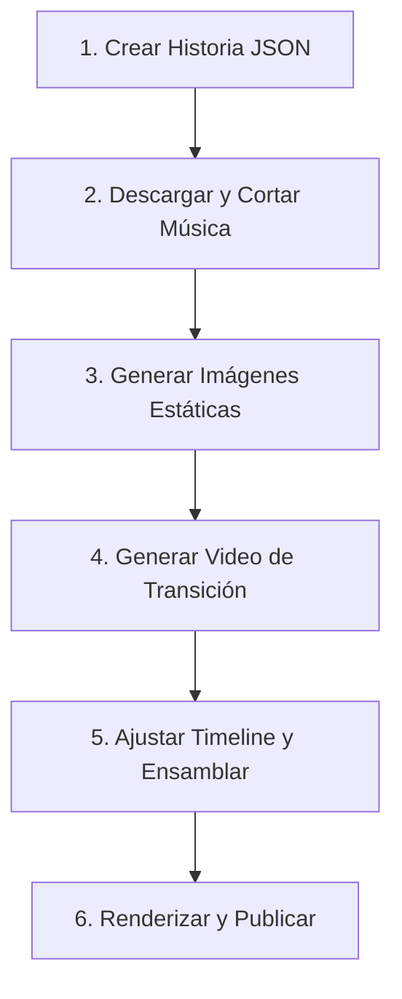

# Protocolo y Flujo de Trabajo: Acordes Ocultos

Este protocolo establece el marco de contexto y los pasos estandarizados que deben seguirse para producir nuevos videos verticales en el proyecto **Acordes Ocultos**. Debe activarse al planificar, crear o depurar cualquier video de la serie.

---

## 📋 Resumen del Pipeline de Producción

El flujo de trabajo se divide en 6 etapas consecutivas:


---

## 🛠️ Detalle de las Etapas

### 1. Inicialización de la Historia
Para crear el esqueleto básico del JSON de la historia, ejecuta en la raíz del proyecto:
```bash
npm run create:story -- "Nombre del Artista" "Título del Video" "Anécdota completa..."
```
Esto creará un archivo inicial en `src/data/generated/<slug-del-titulo>.json`.

### 2. Banda Sonora (Descarga y Corte de Música)
Los videos requieren una banda sonora de fondo basada en la anécdota. Usamos herramientas locales instaladas en el sistema:

1. **Descarga de Audio (YouTube/SoundCloud)**:
   Busca y descarga el audio en máxima calidad MP3 usando `yt-dlp`:
   ```bash
   yt-dlp -x --audio-format mp3 --audio-quality 0 -o "public/music/temp_audio.%(ext)s" "ytsearch:<Artista> <Tema> <Año/Lugar>"
   ```
2. **Corte del Fragmento a 60 Segundos**:
   Recorta exactamente el segmento necesario para el Reel/TikTok usando `ffmpeg`:
   ```bash
   ffmpeg -y -ss <segundo_inicio> -t 60 -i "public/music/temp_audio.mp3" -c copy "public/music/<slug-tema>.mp3"
   rm public/music/temp_audio.mp3
   ```
   > **⚠️ Pauta de Calidad de Audio:** Si la canción contiene discursos hablados al inicio, aplausos prolongados o silencios, el parámetro `-ss <segundo_inicio>` debe configurarse exactamente en el punto donde arranca la melodía principal o el ritmo de la canción, evitando introducciones habladas.

3. **Configuración en el JSON**:
   Configura el objeto `music` en el JSON apuntando al archivo creado:
   ```json
   "music": {
     "title": "Nombre del Tema",
     "artist": "Artista",
     "src": "music/<slug-tema>.mp3",
     "startSecond": 0,
     "volume": 0.55
   }
   ```

### 3. Generación de Imágenes Estáticas
Un video de 60 segundos consta de 7 escenas visuales estáticas principales.
* **Proporción**: Debe usarse siempre un aspect ratio de **9:16** (portrait vertical).
* **Estilo Visual**: Documental de rock clásico, blanco y negro o alto contraste, colores saturados en la paleta, textura de grano de película, safe-area inferior libre de detalles importantes para los subtítulos.
* **Ubicación de Salida**: `public/videos/<slug-del-video>/scene-01.png` a `scene-07.png`.

*Ejemplo de Prompts Sugeridos:*
> `"<Artista> performing live on the stage, dramatic colorful spotlights, vintage Marshall amplifiers, 1960s rock documentary aesthetic, 9:16"`

### 4. Transición de Video (Image-to-Video)
Para elevar la tensión dramática del video, se debe elegir el punto de máximo suspenso e insertar una transición fluida generada por IA (de 8 a 10 segundos).

1. **Selección del Puente Dramático**:
   Identificar la escena de acción suspendida (ej. *Jimi vertiendo gasolina*) y la escena de consecuencia (ej. *guitarra en fuego*).
2. **Generación del Video**:
   * Utilizar la **Escena A** (inicio) y la **Escena B** (fin) como fotogramas de anclaje en una herramienta de generación de video externa (Runway Gen-3, Kling, Luma Dream Machine).
   * **Prompt del video**: Describir el cambio dinámico (ej: *"8 second vertical cinematic transition from a guitarist pouring lighter fluid to the instrument bursting into flames, slow motion, smoke rising, no text"*).
3. **Ubicación de Salida**: Guardar el archivo en `public/videos/<slug-del-video>/transition-<nombre>.mp4`.
4. **Optimización de Calidad (Transcodificación a 30fps)**:
   Dado que las IAs suelen generar clips a 24 fps, es **obligatorio** transcodificar el video para Remotion usando su ffmpeg integrado para evitar tirones y saltos de fotograma:
   ```bash
   npx remotion ffmpeg -y -i "public/videos/<slug>/transition-original.mp4" -r 30 -c:v libx264 -pix_fmt yuv420p -profile:v high -level:v 4.1 -g 1 -bf 0 -crf 18 -c:a aac -b:a 192k "public/videos/<slug>/transition-optimizada.mp4"
   ```
   *(Esto forza los 30 fps de la composición y escribe un keyframe en cada cuadro (`-g 1`), garantizando una previsualización y render fluidos).*

### 5. Línea de Tiempo y Ensamblaje (Timeline & Segments)
Edita el archivo JSON de la historia (y cópialo a `src/data/story.json` para hacerlo activo) programando los tiempos exactos de los subtítulos y los elementos visuales:

* **Sincronización Total (60 segundos)**:
  * Las escenas estáticas ocupan típicamente entre 8 y 9 segundos cada una.
  * El clip de video de transición debe encajar exactamente en sus coordenadas de inicio y duración (`clip.startSecond` y `clip.durationSeconds`).
  * Los `visuals` y los `segments` de subtítulos deben coincidir al milisegundo en su inicio (`start`) y fin (`end`) para una transición sincronizada.

*Ejemplo de Timeline:*
* `scene-01`: 0s - 8s
* `scene-02`: 8s - 16s
* `scene-03`: 16s - 24s
* `scene-04` (Prep Transición): 24s - 28s
* `clip-transicion`: 28s - 36s
* `scene-05` (Post Transición): 36s - 44s
* `scene-06`: 44s - 52s
* `scene-07` (Outro): 52s - 60s

### 6. Compilación, Render y Publicación
1. **Chequeo de Tipos**:
   ```bash
   npm run check
   ```
2. **Previsualización interactiva**:
   ```bash
   npm run dev
   ```
   *Abre Remotion Studio localmente para validar que los textos, opacidades de cortes y partículas fluyan correctamente.*
3. **Renderizado a MP4**:
   ```bash
   npm run render
   ```
   *El video final se compilará en `out/story.mp4`.*
4. **Empaquetado y Distribución**:
   * **Requisito de Configuración**: La variable `CLOUDFLARE_R2_PUBLIC_URL` en `.env` debe configurarse con el dominio público del bucket (`https://pub-xxxxxx.r2.dev` o un dominio customizado) para permitir descargas anónimas desde el navegador.
   * **Publicación**: Ejecuta el pipeline:
     ```bash
     npm run publish:package
     ```
     *Esto subirá el `.mp4` y los metadatos a Cloudflare R2, los registrará en la base de datos de Supabase y enviará una notificación enriquecida a Telegram con la copia editorial y el enlace directo de descarga del video.*

---

## 🔄 Historias en Dos Partes (Multi-part Stories)

Cuando una anécdota musical sea demasiado larga o densa para resumirse en 60 segundos con buen ritmo, el protocolo indica dividirla en dos partes consecutivas:

1. **Estructura de Archivos**:
   Se crearán dos archivos JSON independientes en `src/data/generated/`:
   * `mi-historia-parte-1.json`
   * `mi-historia-parte-2.json`
2. **Convenciones de Contenido**:
   * **Títulos**: Se debe agregar la etiqueta al final del título: `"Título del Video (Parte 1)"` y `"Título del Video (Parte 2)"`.
   * **Parte 1 (Cliffhanger)**: Debe terminar en un punto de alta tensión dramática (e.g., antes de revelar la identidad de un personaje o el desenlace de un suceso). Su `outro` debe invitar directamente al desenlace en la parte 2.
   * **Parte 2 (Continuidad)**: Su `hook` debe iniciar recapitulando brevemente la parte 1 (e.g., *"Tras el impactante final..."* o *"Luego de que..."*) y continuar con el resto de los beats narrativos hasta el desenlace definitivo.
   * **Música**: Ambas partes pueden usar el mismo tema musical, pero en la Parte 2 se puede ajustar el `startSecond` para dar continuidad auditiva al momento donde quedó la Parte 1.

---

## 🏆 Protocolo de Control de Calidad Técnica (Checklist Pre-render)

Antes de realizar el render final y empaquetar la producción, verifica que se cumpla estrictamente este checklist de calidad:

1. **Fluidez de Video (Cero Tirones)**:
   * Todos los clips de video externos (e.g. transiciones generadas por IAs) deben estar sincronizados exactamente a **30 fps**.
   * Deben transcodificarse forzando que cada cuadro sea un fotograma clave (`-g 1` e inhabilitando B-frames `-bf 0`) para evitar saltos, parpadeos o tirones durante la previsualización y el renderizado final.
2. **Sincronización del Timing de Audio (Entrada de Melodía)**:
   * Evita incluir fragmentos con introducciones habladas prolongadas, ruidos del público o silencios iniciales. 
   * Asegura que el corte de música empiece exactamente en el segundo donde arranca la melodía principal o el ritmo que define la historia.
3. **Chequeo de Tipos y Validación de Story**:
   * Ejecuta siempre `npm run check` para garantizar que el archivo JSON cumpla estrictamente con el esquema Zod de Remotion sin errores de tipado.
