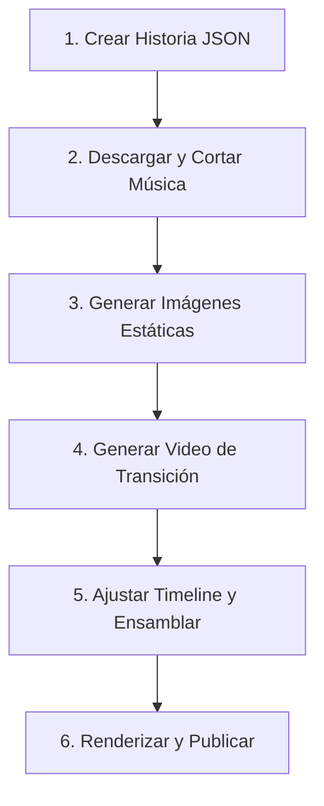

# Protocolo y Flujo de Trabajo: Acordes Ocultos

Este protocolo establece el marco de contexto y los pasos estandarizados que deben seguirse para producir nuevos videos verticales en el proyecto **Acordes Ocultos**. Debe activarse al planificar, crear o depurar cualquier video de la serie.

---

## 📋 Resumen del Pipeline de Producción

El flujo de trabajo se divide en 6 etapas consecutivas:


---

## 🛠️ Detalle de las Etapas

### 1. Inicialización de la Historia
Para crear el esqueleto básico del JSON de la historia, ejecuta en la raíz del proyecto:
```bash
npm run create:story -- "Nombre del Artista" "Título del Video" "Anécdota completa..."
```
Esto creará un archivo inicial en `src/data/generated/<slug-del-titulo>.json`.

### 2. Banda Sonora (Descarga y Corte de Música)
Los videos requieren una banda sonora de fondo basada en la anécdota. Usamos herramientas locales instaladas en el sistema:

1. **Descarga de Audio (YouTube/SoundCloud)**:
   Busca y descarga el audio en máxima calidad MP3 usando `yt-dlp`:
   ```bash
   yt-dlp -x --audio-format mp3 --audio-quality 0 -o "public/music/temp_audio.%(ext)s" "ytsearch:<Artista> <Tema> <Año/Lugar>"
   ```
2. **Corte del Fragmento a 90 Segundos**:
   Recorta exactamente el segmento necesario para el Reel/TikTok usando `ffmpeg`:
   ```bash
   ffmpeg -y -ss <segundo_inicio> -t 90 -i "public/music/temp_audio.mp3" -c copy "public/music/<slug-tema>.mp3"
   rm public/music/temp_audio.mp3
   ```
3. **Configuración en el JSON**:
   Configura el objeto `music` en el JSON apuntando al archivo creado:
   ```json
   "music": {
     "title": "Nombre del Tema",
     "artist": "Artista",
     "src": "music/<slug-tema>.mp3",
     "startSecond": 0,
     "volume": 0.55
   }
   ```

### 3. Generación de Imágenes Estáticas
Un video de 90 segundos consta de 7 escenas visuales estáticas principales.
* **Proporción**: Debe usarse siempre un aspect ratio de **9:16** (portrait vertical).
* **Estilo Visual**: Documental de rock clásico, blanco y negro o alto contraste, colores saturados en la paleta, textura de grano de película, safe-area inferior libre de detalles importantes para los subtítulos.
* **Ubicación de Salida**: `public/videos/<slug-del-video>/scene-01.png` a `scene-07.png`.

*Ejemplo de Prompts Sugeridos:*
> `"<Artista> performing live on the stage, dramatic colorful spotlights, vintage Marshall amplifiers, 1960s rock documentary aesthetic, 9:16"`

### 4. Transición de Video (Image-to-Video)
Para elevar la tensión dramática del video, se debe elegir el punto de máximo suspenso e insertar una transición fluida generada por IA (de 8 a 10 segundos).

1. **Selección del Puente Dramático**:
   Identificar la escena de acción suspendida (ej. *Jimi vertiendo gasolina*) y la escena de consecuencia (ej. *guitarra en fuego*).
2. **Generación del Video**:
   * Utilizar la **Escena A** (inicio) y la **Escena B** (fin) como fotogramas de anclaje en una herramienta de generación de video externa (Runway Gen-3, Kling, Luma Dream Machine).
   * **Prompt del video**: Describir el cambio dinámico (ej: *"8 second vertical cinematic transition from a guitarist pouring lighter fluid to the instrument bursting into flames, slow motion, smoke rising, no text"*).
3. **Ubicación de Salida**: Guardar el archivo en `public/videos/<slug-del-video>/transition-<nombre>.mp4`.

### 5. Línea de Tiempo y Ensamblaje (Timeline & Segments)
Edita el archivo JSON de la historia (y cópialo a `src/data/story.json` para hacerlo activo) programando los tiempos exactos de los subtítulos y los elementos visuales:

* **Sincronización Total (90 segundos)**:
  * Las escenas estáticas ocupan típicamente entre 10 y 12 segundos cada una.
  * El clip de video de transición debe encajar exactamente en sus coordenadas de inicio y duración (`clip.startSecond` y `clip.durationSeconds`).
  * Los `visuals` y los `segments` de subtítulos deben coincidir al milisegundo en su inicio (`start`) y fin (`end`) para una transición sincronizada.

*Ejemplo de Timeline:*
* `scene-01`: 0s - 12s
* `scene-02`: 12s - 24s
* `scene-03`: 24s - 36s
* `scene-04` (Prep Transición): 36s - 48s
* `clip-transicion`: 48s - 56s
* `scene-05` (Post Transición): 56s - 68s
* `scene-06`: 68s - 80s
* `scene-07` (Outro): 80s - 90s

### 6. Compilación, Render y Publicación
1. **Chequeo de Tipos**:
   ```bash
   npm run check
   ```
2. **Previsualización interactiva**:
   ```bash
   npm run dev
   ```
   *Abre Remotion Studio localmente para validar que los textos, opacidades de cortes y partículas fluyan correctamente.*
3. **Renderizado a MP4**:
   ```bash
   npm run render
   ```
   *El video final se compilará en `out/story.mp4`.*
4. **Empaquetado y Distribución**:
   * **Requisito de Configuración**: La variable `CLOUDFLARE_R2_PUBLIC_URL` en `.env` debe configurarse con el dominio público del bucket (`https://pub-xxxxxx.r2.dev` o un dominio customizado) para permitir descargas anónimas desde el navegador.
   * **Publicación**: Ejecuta el pipeline:
     ```bash
     npm run publish:package
     ```
     *Esto subirá el `.mp4` y los metadatos a Cloudflare R2, los registrará en la base de datos de Supabase y enviará una notificación enriquecida a Telegram con la copia editorial y el enlace directo de descarga del video.*
