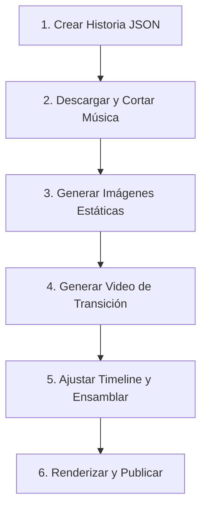

# Protocolo y Flujo de Trabajo: Acordes Ocultos

Este protocolo establece el marco de contexto y los pasos estandarizados que deben seguirse para producir nuevos videos verticales en el proyecto **Acordes Ocultos**. Debe activarse al planificar, crear o depurar cualquier video de la serie.

---

## 📋 Resumen del Pipeline de Producción

El flujo de trabajo se divide en 6 etapas consecutivas:

```mermaid
graph TD
    A[1. Crear Historia JSON] --> B[2. Descargar y Cortar Música]
    B --> C[3. Generar Imágenes Estáticas]
    C --> D[4. Generar Video de Transición]
    D --> E[5. Ajustar Timeline y Ensamblar]
    E --> F[6. Renderizar y Publicar]
```

---

## ✍️ Estilo Narrativo y Tono
 
Los videos deben evitar un formato de reportaje puramente objetivo, frío o periodístico. El guion de cada escena debe escribirse bajo una estricta pauta artística:
* **Rigor Factual y Veracidad Absoluta (CERO ALUCINACIONES):** Es estrictamente obligatorio que todo el contenido (videos, guiones, copys y crónicas de Substack) esté rigurosamente apegado a la verdad de los hechos comprobados. Queda terminantemente prohibido inventar diálogos, falsear fechas, alterar cronologías, inflar cifras o dramatizar anécdotas ficticias. La metáfora poética sirve para transmitir la emoción y la belleza íntima, jamás para alterar los hechos históricos comprobables.
* **Primacía de la Experiencia Emocional y Humana (INNEGOCIABLE):** Las métricas de viralidad y compartidos (*shares* vía DM >40%) demuestran que el impacto masivo de la cuenta reside en la catarsis humana: el duelo, la tragedia real, el coraje frente al poder, el amor y la redención. Queda terminantemente prohibido estructurar historias o guiones en torno a curiosidades técnicas o ingenieriles frías (pedales de efectos, marcas de consolas, microfonía o trucos de estudio descontextualizados). El detalle sonoro solo tiene cabida si nace de una herida o vivencia humana extrema (ej. una voz quebrada en lágrimas o un grito de rebelión).
* **Fusión de Hechos y Poesía:** Combina de forma orgánica los datos clave de la anécdota con metáforas, símiles y figuras retóricas (ej. usar *"exorcizó"* o *"arrojó sus cenizas"* en lugar de *"escribió"*).
* **Belleza Íntima y Emoción:** Resalta el sentimiento, la vulnerabilidad humana o el humor inherente a la historia del artista, logrando que el espectador conecte emocionalmente con la obra musical desde la primera línea.
* **Metáfora Visual de Cierre (Escena 9 — Prohibición de Tornamesas/Vinilos):** Siguiendo la fórmula maestra de nuestro mayor éxito (*Marinero de Luces* con 2.5M de vistas, donde el cierre fue un velero solitario en la niebla marina), **queda terminantemente prohibido cerrar los videos con tocadiscos o vinilos genéricos**. La escena 9 debe presentar siempre una **metáfora visual cinematográfica, poética y evocadora** que condense el tema central de la historia e invite a la reflexión profunda (ej. un velero en el horizonte brumoso, un banco solitario en un parque otoñal con niños jugando a lo lejos, una ventana con lluvia y luz cálida interior).
* **Calibración de Subtítulos vs. Copys:**
  - **Subtítulos en Escena:** Breves, líricos y contundentes. No deben ser una mera descripción de hechos secos, ni tan extensos que saturen la pantalla o impidan su lectura relajada durante la duración de la escena (**~18 a 24 palabras** por 10s en Reels, **~12 a 16 palabras** por ~6.6s en TikTok).
  - **Copy de Publicación (Instagram Reels / Post):** Debe ser conciso y calibrado para no cortarse en Instagram (límite técnico: 2.200 caracteres; **rango óptimo recomendado: ~900 a 1.300 caracteres**, máximo 1.500 con hashtags). Debe iniciar con 1-2 líneas de gancho potente visibles antes de «... más», 2 párrafos breves de microhistoria, una reflexión con pregunta de debate y 5 a 8 hashtags selectos.

---

## 🛠️ Detalle de las Etapas

### 1. Inicialización de la Historia
Para crear el esqueleto básico del JSON de la historia, ejecuta en la raíz del proyecto:
```bash
npm run create:story -- "Nombre del Artista" "Título del Video" "Anécdota completa..."
```
Esto creará un archivo inicial en `src/data/generated/<slug-del-titulo>.json`.

### 2. Banda Sonora (Descarga y Corte de Música)
Los videos requieren una banda sonora de fondo basada en la anécdota. Usamos herramientas locales instaladas en el sistema:

1. **Descarga de Audio (YouTube/SoundCloud)**:
   Busca y descarga el audio en máxima calidad MP3 usando `yt-dlp`:
   ```bash
   yt-dlp -x --audio-format mp3 --audio-quality 0 -o "public/music/temp_audio.%(ext)s" "ytsearch:<Artista> <Tema> <Año/Lugar>"
   ```
2. **Corte del Fragmento a 60 Segundos**:
   Recorta exactamente el segmento necesario para el Reel/TikTok usando `ffmpeg`:
   ```bash
   ffmpeg -y -ss <segundo_inicio> -t 60 -i "public/music/temp_audio.mp3" -c copy "public/music/<slug-tema>.mp3"
   rm public/music/temp_audio.mp3
   ```
   > **⚠️ Pauta de Calidad de Audio:** Si la canción contiene discursos hablados al inicio, aplausos prolongados o silencios, el parámetro `-ss <segundo_inicio>` debe configurarse exactamente en el punto donde arranca la melodía principal o el ritmo de la canción, evitando introducciones habladas.

3. **Configuración en el JSON**:
   Configura el objeto `music` en el JSON apuntando al archivo creado:
   ```json
   "music": {
     "title": "Nombre del Tema",
     "artist": "Artista",
     "src": "music/<slug-tema>.mp3",
     "startSecond": 0,
     "volume": 0.55
   }
   ```

### 3. Generación de Imágenes Estáticas
La producción estándar dual consta de 9 escenas visuales estáticas más la portada de fondo (`cover_bg.png` + `scene-01.png` a `scene-09.png`).
* **Proporción**: Debe usarse siempre un aspect ratio de **9:16** (portrait vertical).
* **Estilo Visual**: Documental de rock clásico, blanco y negro o alto contraste, colores saturados en la paleta, textura de grano de película, safe-area inferior libre de detalles importantes para los subtítulos.
* **Consistencia Fisonómica y Rigor Histórico (INNEGOCIABLE)**:
  - **No negociable**: Es preferible detener por completo una producción antes que utilizar imágenes con personajes genéricos o figuras que no se parezcan al artista real.
  - Si el personaje aparece en múltiples escenas, debe mantenerse exactamente la **misma fisonomía facial, etnia, corte de cabello y vestimenta canónica** en toda la secuencia.
  - Respetar rigurosamente el género, la raza y la cronología de edad real del artista.
* **Ubicación de Salida**: `public/videos/<slug-del-video>/cover_bg.png` y `scene-01.png` a `scene-09.png`.

#### 🖼️ Protocolo de Jerarquía y Control de Calidad:
1. **Primera Opción (Sandbox Interno)**: Se intenta generar utilizando la herramienta interna de generación de imágenes (`generate_image`), aprovechando el anclaje de imagen (`ImagePaths`) para garantizar el parecido facial exacto.
2. **Fotografía Histórica y Documental Real (Internet / Dominio Público)**: Si la producción lo amerita y existen fotografías históricas tomadas en el contexto directo de los acontecimientos narrados, se autoriza y recomienda el uso de estas fotos reales públicas como alternativa o complemento de altísimo valor testimonial (ej. la foto real de Syd Barrett en Abbey Road 1975 para *"Shine On You Crazy Diamond"*).
3. **Segunda Opción / Contingencia (Google Flow)**: Si la cuota del sandbox está agotada, se recurre a Google Flow (`npm run assets:flow`) **únicamente si los prompts pueden garantizar el parecido real del artista sin disparar filtros de seguridad**.
4. **Detención Obligatoria de Calidad**: Si una alternativa genera figuras genéricas o distorsionadas debido a filtros de la plataforma, **la producción se detiene de inmediato** hasta poder ejecutar la generación con la herramienta o material documental que asegure la fidelidad fisonómica e histórica real.

### 4. Transición de Video (Image-to-Video)
Para elevar la tensión dramática del video, se debe elegir el punto de máximo suspenso e insertar una transición fluida generada por IA (de 8 a 10 segundos).

1. **Selección del Puente Dramático**:
   Identificar la escena de acción suspendida (ej. *Jimi vertiendo gasolina*) y la escena de consecuencia (ej. *guitarra en fuego*).
2. **Generación del Video**:
   * Utilizar la **Escena A** (inicio) y la **Escena B** (fin) como fotogramas de anclaje en una herramienta de generación de video externa (Runway Gen-3, Kling, Luma Dream Machine).
   * **Prompt del video**: Describir el cambio dinámico (ej: *"8 second vertical cinematic transition from a guitarist pouring lighter fluid to the instrument bursting into flames, slow motion, smoke rising, no text"*).
3. **Ubicación de Salida**: Guardar el archivo en `public/videos/<slug-del-video>/transition-<nombre>.mp4`.
4. **Optimización de Calidad (Transcodificación a 30fps)**:
   Dado que las IAs suelen generar clips a 24 fps, es **obligatorio** transcodificar el video para Remotion usando su ffmpeg integrado para evitar tirones y saltos de fotograma:
   ```bash
   npx remotion ffmpeg -y -i "public/videos/<slug>/transition-original.mp4" -r 30 -c:v libx264 -pix_fmt yuv420p -profile:v high -level:v 4.1 -g 1 -bf 0 -crf 18 -c:a aac -b:a 192k "public/videos/<slug>/transition-optimizada.mp4"
   ```
   *(Esto forza los 30 fps de la composición y escribe un keyframe en cada cuadro (`-g 1`), garantizando una previsualización y render fluidos).*

### 5. Línea de Tiempo y Ensamblaje (Timeline & Segments)
Edita el archivo JSON de la historia (y cópialo a `src/data/story.json` para hacerlo activo) programando los tiempos exactos de los subtítulos y los elementos visuales:

* **Sincronización Total (60 segundos)**:
  * Las escenas estáticas ocupan típicamente entre 8 y 9 segundos cada una.
  * El clip de video de transición debe encajar exactamente en sus coordenadas de inicio y duración (`clip.startSecond` y `clip.durationSeconds`).
  * Los `visuals` y los `segments` de subtítulos deben coincidir al milisegundo en su inicio (`start`) y fin (`end`) para una transición sincronizada.

*Ejemplo de Timeline:*
* `scene-01`: 0s - 8s
* `scene-02`: 8s - 16s
* `scene-03`: 16s - 24s
* `scene-04` (Prep Transición): 24s - 28s
* `clip-transicion`: 28s - 36s
* `scene-05` (Post Transición): 36s - 44s
* `scene-06`: 44s - 52s
* `scene-07` (Outro): 52s - 60s

### 6. Compilación, Render y Publicación Dual (90s Reels & 60s TikTok)
A partir de ahora, cada producción genera dos versiones optimizadas:

1. **Versión Estándar: Instagram Reels & Feed (90 Segundos)**:
   * 9 escenas de 10 segundos cada una (`out/story.mp4`).
   * Renderizado: `npm run render`

2. **Versión TikTok Cut (60 Segundos Exactos)**:
   * Utiliza las **mismas 9 imágenes** ya generadas distribuidas a ritmo ágil de **~6.6 a 6.7 segundos por escena** (`src/data/generated/<slug>-tiktok.json`).
   * Subtítulos condensados y de lectura rápida para retención de TikTok.
   * **🛡️ Blindaje Algorítmico («TikTok-Proofing»)**: Aplicar obligatoriamente el filtro de suavizado léxico en subtítulos y copys para TikTok en temáticas intensas (tragedias, guerras, atentados, muertes). Evitar términos explícitos de sangre, disparos o heridas crudas (e.g. sustituir *«murió desangrado»* por *«su vida se apagó en el camino»*, *«cornada mortal»* por *«tragedia en el ruedo»*).
   * Renderizado a `out/story_tiktok.mp4`.

3. **Empaquetado y Distribución**:
   * **Publicación**: Ejecuta el pipeline:
     ```bash
     npm run publish:package
     ```
     *O para publicar directamente la versión TikTok:*
     ```bash
     node scripts/publish-package.mjs --story src/data/generated/<slug>-tiktok.json --video out/story_tiktok.mp4
     ```
   * Esto sube los videos y metadatos a Cloudflare R2, los registra en Supabase y envía la notificación enriquecida a Telegram con la copia editorial y el enlace de descarga directa.

4. **Bóveda Maestra de Archivo (Google Drive 4 TB)**:
   * **Archivado Automático**: Al publicar con `GOOGLE_DRIVE_VAULT_PATH` configurado en `.env`, el paquete completo se archiva de forma automática.
   * **Comando Manual Dedicado**:
     ```bash
     npm run backup:vault
     ```
   * **Sincronización Total del Catálogo**:
     ```bash
     npm run backup:vault -- --all
     ```
   * **Restauración Instantánea desde la Bóveda**:
     ```bash
     npm run restore:vault -- <nombre-episodio>
     ```
   * Guarda de forma organizada en `01_Episodios_Completados/<artista>-<cancion>/`: videos másteres (90s y 60s), portada oficial, teaser, las 9 escenas estáticas, audios, story.json, copys y crónicas de Substack.

5. **Capa Editorial Web y Crónicas Extendidas (Substack & Portal Web)**:
   * **Estructura Modular**: Cada crónica extendida reside en `articles/<slug>/` con su texto `article.md` y fotografías másteres en `images/*.png`.
   * **Optimización WebP Preservativa (`npm run images:optimize`)**:
     - Las imágenes maestras en PNG se mantienen **100% intactas y en alta resolución** en `articles/<slug>/images/*.png` para futuras descargas de los usuarios.
     - Genera automáticamente versiones `.webp` (calidad 82) lado a lado y las replica a `web/public/articles/<slug>/images/` para la web y lectura móvil.
   * **Compilación de Dataset Web (`npm run chronicle:compile`)**:
     - Compila en milisegundos todo el markdown de `articles/*/article.md` en `web/src/data/chronicles.json` (~550 KB), eliminando escaneos de disco en tiempo de ejecución en Vercel.
   * **Lectura Móvil Autónoma (`npm run chronicle:html`)**:
     - Genera `articles/<slug>/lectura_movil.html` con las imágenes WebP embebidas en Base64 (~1.5 MB en vez de 25 MB) y lo sincroniza a la Bóveda de Google Drive.
   * **Pipeline Unificado de Sincronización (`npm run chronicle:sync`)**:
     - Ejecuta en un solo comando la optimización de imágenes, la compilación del dataset JSON, la generación de HTML móvil y la sincronización del campo `web_article` en Supabase.
   * **Despliegue a Producción Web**:
     - El portal web en Astro compila en ~25 segundos y se despliega con:
       ```bash
       npx vercel --prod
       ```

---

## 🏷️ Categorías Editoriales Soportadas
Esta arquitectura de producción dual aplica para todas las líneas editoriales del canal:
1. **Acordes Ocultos** (`topic: "acordes-ocultos"`): La microhistoria real, anécdota biográfica oculta y tensión humana detrás de canciones icónicas.
2. **Historia en los Acordes** (`topic: "historia-en-los-acordes"`): La narración cinematográfica y poética de la trama que cuenta la letra de la canción.
3. **Destellos de Gloria** (`topic: "destellos-de-gloria"`): Consagrada a las estrellas fugaces que vivieron vidas cortas pero intensas que brillaron como el sol (e.g. Buddy Holly, Ritchie Valens, Janis Joplin, Jimi Hendrix, Kurt Cobain, Selena). Su estructura editorial identifica rigurosamente los **9 eventos o hechos epistolares clave** que marcaron un quiebre en su vida personal y artística, manteniendo la línea artística y poética de Acordes Ocultos.
4. **Catedrales de Leyenda** (`topic: "catedrales-de-leyenda"`): Consagrada a las leyendas vivas y longevas que desafiaron el tiempo con décadas de gloria y reinvención (e.g. Paul McCartney, Rolling Stones, Tina Turner, David Bowie, Bob Dylan). Su estructura editorial identifica los **9 eventos o hechos epistolares clave** que representaron puntos de inflexión fundamentales en su vida personal y trayectoria artística, con la misma sensibilidad poética y emotiva de Acordes Ocultos.

---

## 🔄 Historias en Dos Partes (Multi-part Stories)

Cuando una anécdota musical sea demasiado larga o densa para resumirse en 60 segundos con buen ritmo, el protocolo indica dividirla en dos partes consecutivas:

1. **Estructura de Archivos**:
   Se crearán dos archivos JSON independientes en `src/data/generated/`:
   * `mi-historia-parte-1.json`
   * `mi-historia-parte-2.json`
2. **Convenciones de Contenido**:
   * **Títulos**: Se debe agregar la etiqueta al final del título: `"Título del Video (Parte 1)"` y `"Título del Video (Parte 2)"`.
   * **Parte 1 (Cliffhanger)**: Debe terminar en un punto de alta tensión dramática (e.g., antes de revelar la identidad de un personaje o el desenlace de un suceso). Su `outro` debe invitar directamente al desenlace en la parte 2.
   * **Parte 2 (Continuidad)**: Su `hook` debe iniciar recapitulando brevemente la parte 1 (e.g., *"Tras el impactante final..."* o *"Luego de que..."*) y continuar con el resto de los beats narrativos hasta el desenlace definitivo.
   * **Música**: Ambas partes pueden usar el mismo tema musical, pero en la Parte 2 se puede ajustar el `startSecond` para dar continuidad auditiva al momento donde quedó la Parte 1.

---

## 🏆 Protocolo de Control de Calidad Técnica (Checklist Pre-render)

Antes de realizar el render final y empaquetar la producción, verifica que se cumpla estrictamente este checklist de calidad:

1. **Fluidez de Video (Cero Tirones)**:
   * Todos los clips de video externos (e.g. transiciones generadas por IAs) deben estar sincronizados exactamente a **30 fps**.
   * Deben transcodificarse forzando que cada cuadro sea un fotograma clave (`-g 1` e inhabilitando B-frames `-bf 0`) para evitar saltos, parpadeos o tirones durante la previsualización y el renderizado final.
2. **Sincronización del Timing de Audio (Entrada de Melodía)**:
   * Evita incluir fragmentos con introducciones habladas prolongadas, ruidos del público o silencios iniciales. 
   * Asegura que el corte de música empiece exactamente en el segundo donde arranca la melodía principal o el ritmo que define la historia.
3. **Chequeo de Tipos y Validación de Story**:
   * Ejecuta siempre `npm run check` para garantizar que el archivo JSON cumpla estrictamente con el esquema Zod de Remotion sin errores de tipado.

---

## 📽️ Video de Presentación del Canal
Para el video especial de presentación de la cuenta (duración de 1:30 minutos, fragmentos secuenciales con sonido original), existe un protocolo y flujo independiente detallado en el archivo [PRESENTATION_WORKFLOW.md](file://./PRESENTATION_WORKFLOW.md). Este flujo utiliza una composición Remotion dedicada y no altera la línea de producción regular de videos de 60 segundos.
