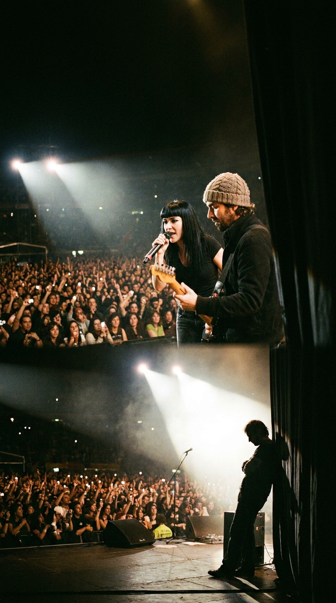
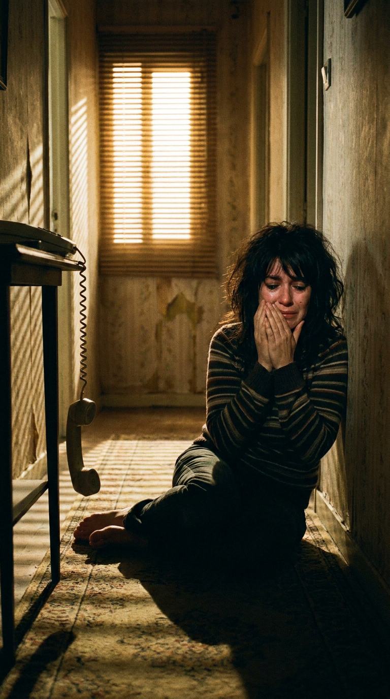
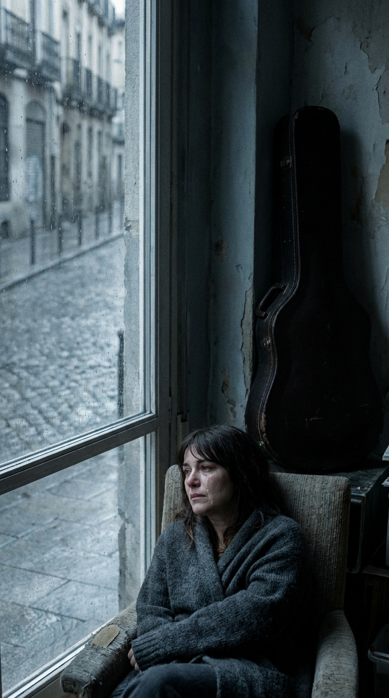
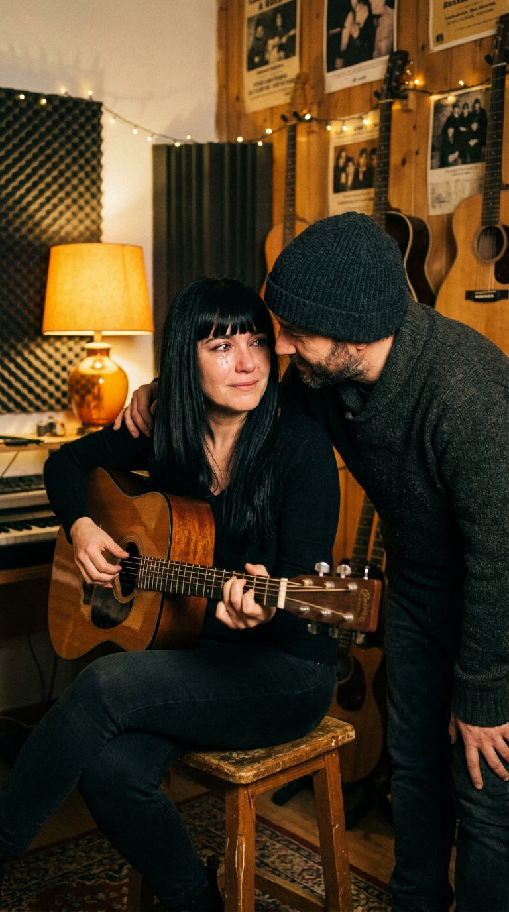
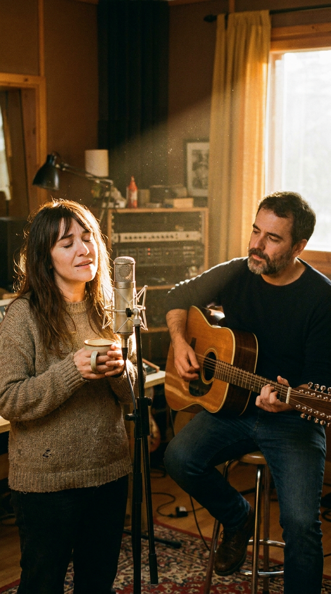
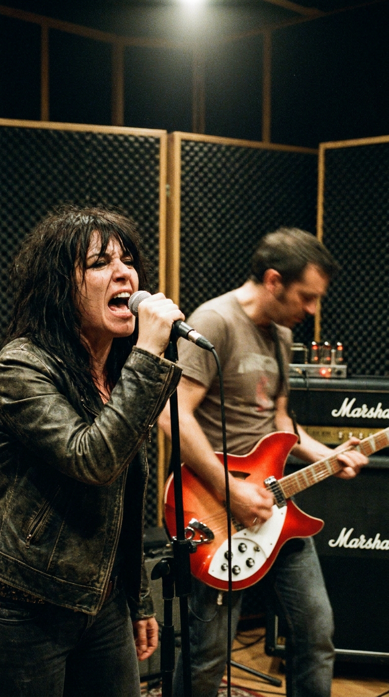
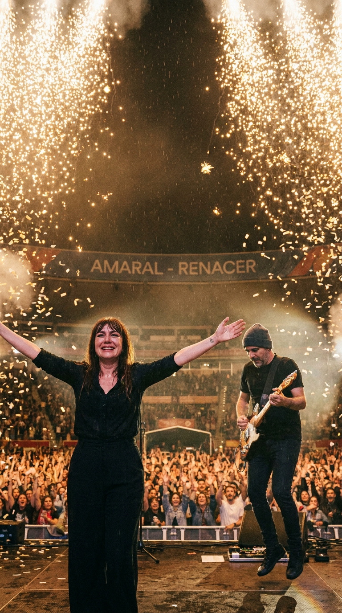

# 🌪️ El Salto al Vacío de Eva Amaral: La Herida Secreta detrás del Himno «Kamikaze»
### *Cómo la muerte repentina de una madre, un pacto de lealtad en una buhardilla de Malasaña y el rechazo frontal a las fórmulas de la industria musical salvaron a la banda más influyente del pop-rock español al borde del abismo.*

---

**Por la redacción de Acordes Ocultos**  
*Tiempo de lectura estimado: 6 minutos y medio*

---

### Prólogo: El grito eufórico que nació de un funeral

En el verano de 2008, no había rincón de España donde no retumbara la misma batería galopante y aquel arpegio vertiginoso de guitarra eléctrica. En los festivales multitudinarios, en las verbenas de pueblo, en las radiofórmulas a todo volumen y en las gargantas de cincuenta mil personas que saltaban al unísono con los brazos en alto, un verso se convirtió en el lema de toda una generación:

> *«Como un kamikaze que va a estrellarse contra tu amor,  
> no me importa si es un error,  
> prefiero saltar al vacío...»*

Para el público masivo, **«Kamikaze»** era la cúspide de la fiesta: un himno luminoso, bailable y contagioso sobre la euforia juvenil del descaro sentimental. Pocos sospechaban que detrás de ese estribillo invencible no había romance de verano, ni ligereza pop. 

Apenas unos meses antes, en la penumbra de una habitación en Zaragoza, **Eva Amaral** no quería saltar a ningún escenario: quería desaparecer. Ahogada en un duelo desgarrador, incapaz de emitir una sola nota y convencida de que su carrera artística había terminado para siempre, la cantante estuvo a punto de disolver el grupo. «Kamikaze» no fue concebida para vender discos; fue un paracaídas de emergencia tejido en secreto para impedir que una de las voces más prodigiosas de nuestra música se precipitara al fondo del abismo.

---

### Acto I: La jaula de oro y el teléfono de la medianoche

Para entender el agotamiento que precedió a la tormenta, es necesario situarse en 2006. Tras la publicación de *Estrella de Mar* (2002) y la apoteosis de *Pájaros en la Cabeza* (2005) —que despachó más de seiscientas mil copias en un país azotado por la piratería digital—, **Amaral** se había convertido en un gigante incontrolable. Llenaban plazas de toros, encabezaban festivales en Europa y América Latina, y acumulaban premios de la música por docenas.

*2006: Detrás de las giras de estadios y el éxito comercial, el engranaje de la industria comenzaba a asfixiar la autenticidad del dúo aragonés.*

Pero la maquinaria corporativa exigía un tributo desmedido. Los ejecutivos de la multinacional discográfica EMI/Virgin presionaban sin descanso: querían otro hit inmediato, otra balada radiofónica de manual que repitiera el molde de *«Sin ti no soy nada»*. Las giras interminables, el acoso de la prensa sensacionalista y la pérdida absoluta de la vida privada comenzaron a minar la salud mental de los dos músicos zaragozanos.

Y entonces, en el caluroso verano de 2007, sonó el teléfono.

La noticia llegó como un mazazo seco, de esos que parten la vida en dos mitades irreconciliables: **Carmen Ramos**, la madre de Eva, acababa de fallecer repentinamente.

*Verano de 2007: La noticia devastadora de la muerte materna sume a Eva en un shock paralizante.*

Carmen no era solo su madre; era su confidente, el pilar silencioso que la había animado a cantar cuando en los bares de Zaragoza nadie creía en una muchacha tímida que tocaba la batería en bandas de punk. Con su partida, el suelo bajo los pies de Eva se desintegró por completo.

---

### Acto II: El silencio absoluto y la decisión de abandonar

Durante los meses siguientes, el otoño de 2007 fue un túnel oscuro. Eva se recluyó en el silencio más estricto. La tristeza derivó en un cuadro depresivo severo que le arrebató incluso la voz hablada. La garganta se le cerró por el impacto somático del dolor; sentía nauseas solo de pensar en encender un amplificador o rozar las cuerdas de una guitarra.

*Otoño de 2007: Con la voz apagada por la aflicción, Eva decide cancelar todos los compromisos y renunciar a la música.*

En una tarde gris, sentada sobre el suelo de madera de su casa mientras la lluvia golpeaba los cristales, Eva llamó a su compañero de toda la vida, el guitarrista **Juan Aguirre**:  
—*«Juan, se acabó. No tengo fuerzas. No puedo volver a subirme a un escenario a sonreír como si nada hubiera pasado. Disolvemos el grupo; no voy a volver a cantar»*.

Cualquier otro compañero de banda en la cumbre del éxito habría pensado en los contratos firmados, en las pérdidas millonarias o en los compromisos legales pendientes. Juan Aguirre, el muchacho de voz pausada y eterno gorro de lana que la acompañaba desde sus inicios en la banda folk *Días de Vino y Rosas* a principios de los años noventa, hizo exactamente lo opuesto.

No le habló de dinero. No le mencionó a la compañía de discos. Simplemente fue a buscarla, le tomó la mano y le dijo:  
—*«No vamos a cantar para la radio, ni vamos a pensar en el grupo. Solo vente a casa. Vamos a preparar café y a tocar como cuando teníamos dieciocho años y nadie nos conocía. Si esto tiene que terminar, que termine cuando tú estés bien. Pero no te voy a dejar caer sola»*.

---

### Acto III: La buhardilla de Malasaña y el chispazo de la catarsis

Juan se llevó a Eva a su modesto estudio casero, bautizado con cariño como **O Gato Negro**, un espacio acogedor atestado de vinilos, amplificadores de válvulas y cintas de casete en el corazón del barrio madrileño de Malasaña.

*Estudio O Gato Negro, finales de 2007: La lealtad inquebrantable de Juan Aguirre rescata a Eva de la soledad y el mutismo.*

Allí no había cronómetros, ni ingenieros de sonido trajeados, ni ejecutivos supervisando el rumbo comercial. Durante semanas, no grabaron nada. Solo hablaban, recordaban viejas historias de Zaragoza y escuchaban los discos que habían forjado su identidad: The Byrds, The Smiths, Big Star, Neil Young y The Velvet Underground.

Un día de diciembre, Juan tomó su guitarra acústica Gibson de doce cuerdas y comenzó a aporrear con furia una progresión en tonalidad mayor. No era un arpegio melancólico de lamento; era un ritmo impetuoso, desafiante, lleno de urgencia y electricidad.

Eva, que estaba sentada en un sillón con una taza de infusión caliente entre las manos, levantó la mirada. Sintió una sacudida interna. El pecho se le abrió y, por primera vez en casi medio año, abrió la boca y emitió una melodía limpia que llenó toda la habitación.

*El chispazo creativo: Eva cierra los ojos frente al micrófono casero y deja brotar el primer boceto melódico de «Kamikaze».*

La letra brotó como un torrente de lava que llevaba meses acumulado bajo tierra. La palabra *«Kamikaze»* no se eligió como una referencia a la guerra ni a la inmolación destructiva; fue la metáfora exacta de lo que sentían en ese instante: la determinación absoluta de lanzarse al precipicio sin paracaídas y sin calcular los riesgos. Comprendieron que la única forma de no dejarse consumir por la parálisis del miedo era arrojarse de cabeza contra la vida, estrellarse contra el dolor si era necesario, pero volver a sentir la adrenalina corriendo por las venas.

> *«Sé que dijeron que el mundo se acaba,  
> que no nos queda tiempo...  
> pero hoy quiero saltar al vacío.»*

La sesión se convirtió en un exorcismo. Aquella misma noche, la estructura de la canción quedó terminada. Eva ya no era la náufraga derrotada por el luto: era una mujer de pie dispuesta a pelear por cada latido.

---

### Acto IV: La rebelión de Londres y el doble álbum contra el mercado

Lejos de conformarse con un puñado de temas convencionales, la explosión creativa tras meses de sequía fue tan avasalladora que compusieron más de treinta canciones. Cuando los directivos de EMI se reunieron con ellos esperando un disco pop estándar de diez cortes listos para sonar en emisoras comerciales, el dúo soltó la bomba:  
—*«Vamos a sacar un disco doble. Diecinueve canciones. Se va a llamar Gato Negro • Dragón Rojo»*.

La respuesta de la industria fue de pánico:  
—*«¡Estáis locos! Estamos en plena crisis económica y la gente ya no compra discos por la piratería. Un álbum doble es un suicidio comercial»*.

Eva y Juan se mantuvieron firmes. Tomaron las cintas y se marcharon a Londres, a los legendarios **Eden Studios** —el templo donde décadas atrás habían grabado leyendas del post-punk y la new wave como The Clash y Elvis Costello—. Junto al productor Juan de Dios Martín y el ingeniero de mezclas británico Cameron Craig, prescindieron de los arreglos prefabricados por ordenador y apostaron por la pureza analógica: baterías agresivas, bajos galopantes y las míticas guitarras Rickenbacker de Juan rugiendo a través de amplificadores Vox AC30 al borde de la saturación.

*Londres, principios de 2008: En Eden Studios, Eva y Juan transforman las guitarras en un muro sónico de guitarras distorsionadas y verdad orgánica.*

«Kamikaze» fue elegida como la punta de lanza del proyecto. Era una bofetada sónica que abría el disco con una declaración de principios: no había marcha atrás.

---

### Epílogo: El milagro de la comunión sobre el escenario

El 27 de mayo de 2008, *Gato Negro • Dragón Rojo* llegó a las tiendas. En menos de veinticuatro horas, contra todos los pronósticos de los agoreros de la industria, el álbum doble entró directo al **número 1 en las listas oficiales de ventas de España**, despachando más de cuarenta mil copias en su primera semana y alcanzando la certificación de disco de platino en tiempo récord.

«Kamikaze» copó el puesto número 1 de las radios durante semanas consecutivas y fue galardonada con el **Premio de la Música a la Mejor Canción del Año** otorgado por la Academia de las Artes y las Ciencias de la Música.

*La comunión final: Eva Amaral y Juan Aguirre celebran la vida frente a miles de personas. La música había ganado la batalla contra el olvido y la muerte.*

Pero el verdadero triunfo no estuvo en las cifras de ventas ni en los galardones dorados sobre una repisa. La verdadera victoria ocurrió cuando comenzó la gira. 

Noche tras noche, al sonar los primeros compases de «Kamikaze», Eva Amaral se plantaba frente al borde del escenario, miraba a los ojos a miles de personas que saltaban como olas enloquecidas coreando su grito de liberación y sonreía con los ojos vidriosos de emoción. Aquellas personas no solo estaban bailando un éxito de rock; estaban cantando, sin saberlo, la victoria de una hija que se negó a rendirse ante la muerte de su madre, y el triunfo de dos amigos que prefirieron estrellarse como kamikazes antes que permitir que el miedo apagara su fuego interior.

---

### 💬 El eco en la memoria

¿Qué recuerdos te trae escuchar hoy «Kamikaze» sabiendo que nació como un salvavidas en el peor momento de Eva Amaral? ¿Alguna vez una canción te ha rescatado a ti del vacío? Cuéntanos tu historia en los comentarios.

---

### 📚 Fuentes y Archivo Documental

* **Amaral, Eva y Aguirre, Juan** (2008). Entrevistas sobre la composición y grabación de *Gato Negro • Dragón Rojo*, diario *El País* (Sección Cultura) y revista *Rolling Stone España*, Madrid.
* **EMI Music Spain / Virgin Records** (2008). *Créditos discográficos y libreto oficial del álbum doble Gato Negro • Dragón Rojo*, producción de Cameron Craig, Juan de Dios Martín, Eva Amaral y Juan Aguirre.
* **Promusicae (Productores de Música de España)** (2008). *Listas Oficiales de Ventas Anuales de Álbumes y Canciones del Año 2008* (Certificación de Doble Disco de Platino).
* **Academia de las Artes y las Ciencias de la Música** (2009). *Premios de la Música XIII Edición: Acta oficial de concesión del Premio a Mejor Canción del Año por «Kamikaze»*.
* **Radio Nacional de España (RNE / Radio 3)** (2008). Archivo sonoro y entrevistas monográficas en *Discópolis* y *Hoy empieza todo* sobre las sesiones en Eden Studios (Londres).
* **Pardo, José Ramón** (2005 / reed. 2012). *Historia del pop español* y *Medio siglo de pop español*. Ediciones Rama Lama Music, Madrid.
