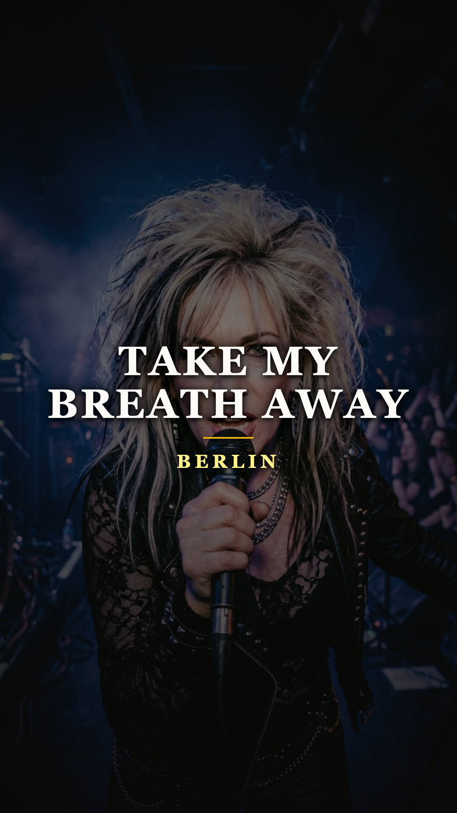
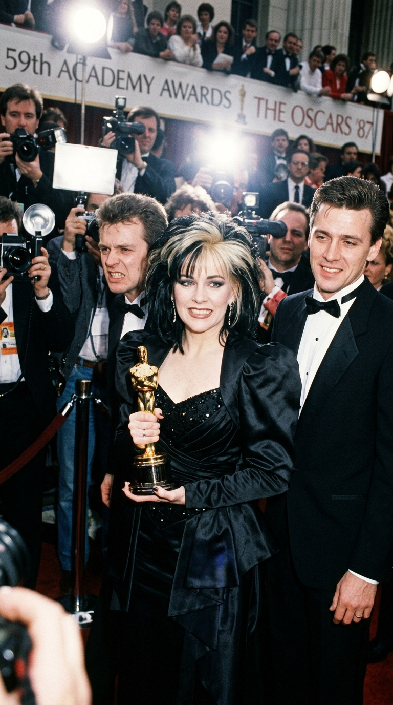
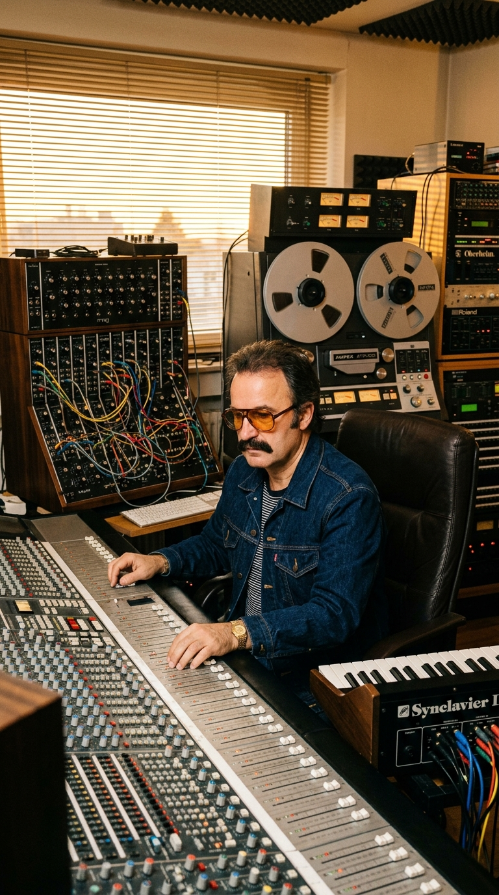
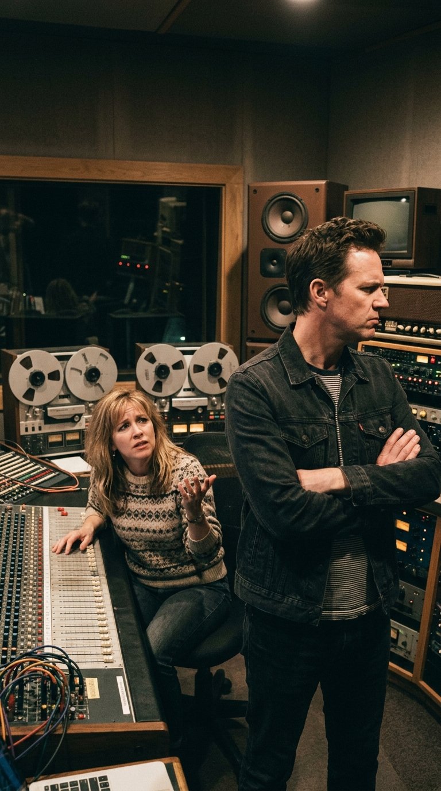
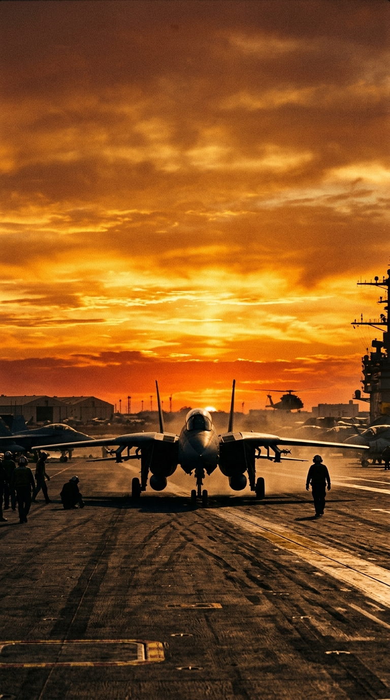
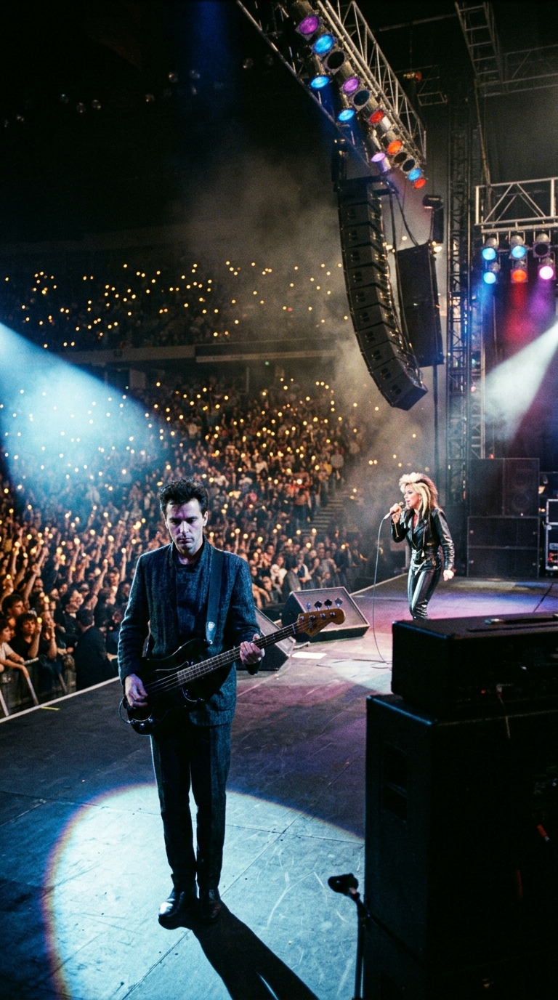
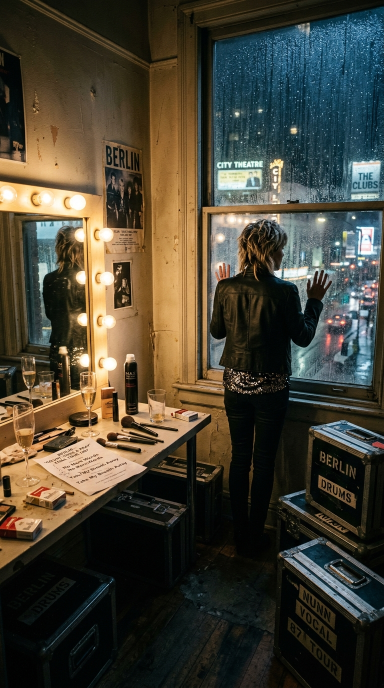

# ✈️ El Éxito que Destruyó a la Banda: La Verdadera Historia de «Take My Breath Away»
### *Cómo una balada creada por Giorgio Moroder para «Top Gun» ganó el Óscar, conquistó las listas del planeta y desencadenó una guerra irreconciliable que desintegró a Berlin en la cima de su gloria.*

---

**Por la redacción de Acordes Ocultos**  
*Tiempo de lectura estimado: 8 minutos*

---

### Prólogo: La noche de los Óscar y el funeral bajo los flashes

El 30 de marzo de 1987, en el Dorothy Chandler Pavilion de Los Ángeles, la 59.ª edición de los Premios de la Academia celebraba el clímax de la era dorada del cine comercial de los ochenta. Cuando los presentadores abrieron el sobre a la **Mejor Canción Original**, los altavoces tronaron con una cadencia de sintetizadores inconfundible: una pulsación hipnótica, lenta y voluptuosa que durante el verano anterior había acompañado los vuelos supersónicos de Tom Cruise y los besos a contraluz con Kelly McGillis en *Top Gun*. El tema ganador era **«Take My Breath Away»**, interpretado por la banda californiana **Berlin**.

Sobre el escenario, la vocalista **Terri Nunn**, enfundada en un traje de gala y con su icónico cabello platino y negro, sonreía emocionada ante los aplausos de la élite de Hollywood. Millones de televidentes en todo el mundo contemplaban lo que parecía el triunfo definitivo de un grupo de rock que había alcanzado la cumbre del planeta.

*1987: El triunfo en Hollywood. Mientras las cámaras celebraban la estatuilla dorada, en el seno de la banda la tensión artística era ya una herida irreversible.*

Sin embargo, detrás de aquella fachada de terciopelo y champán, la realidad era desoladora. Los miembros fundadores de la banda contemplaban la escena con una mezcla de amargura, desconcierto y resignación. Aquella canción no la habían compuesto ellos. En su grabación no había sonado una sola guitarra, ni una sola línea de bajo, ni un solo golpe de batería de ningún músico del grupo. «Take My Breath Away» había sido concebida, producida y orquestada por manos ajenas. 

Habían ganado el premio más codiciado de la industria, pero acababan de firmar su propia sentencia de muerte. Aquel número uno mundial no fue el despegue de Berlin: fue el misil que partió su historia en dos.

---

### Acto I: Los Ángeles, 1978–1984: La forja del synth-pop provocador

Para comprender la magnitud de la tragedia, es necesario retroceder a las raíces de **Berlin**. Formada en el condado de Orange en 1978 por el bajista, teclista y principal compositor **John Crawford**, la banda nació con una vocación rebelde y transgresora, fuertemente influenciada por la frialdad electrónica de Kraftwerk, la elegancia de Roxy Music y la aspereza de la *New Wave* británica de Ultravox y Gary Numan.

Crawford era un purista del sonido electrónico conceptual: componía piezas oscuras, viscerales y cargadas de tensión psicológica. Junto a **Terri Nunn** —una cantante de presencia escénica arrolladora y registro vocal prodigioso— y el guitarrista y sintetista **David Diamond**, Berlin se convirtió en uno de los referentes indiscutibles del underground californiano con su álbum debut *Pleasure Victim* (1982).

*1982: Los Ángeles. Berlin en sus inicios, forjando un synth-pop oscuro, provocador y visceral liderado por el compositor John Crawford.*

Temas como **«The Metro»** y la polémica **«Sex (I'm a...)»** —censurada en decenas de emisoras estadounidenses por su explícito diálogo erótico— cimentaron la reputación del grupo como una entidad provocadora, independiente y autoral. Cada nota, cada acorde disonante y cada verso nacía de la pluma de Crawford. Cuando en 1984 lanzaron *Love Life*, producido parcialmente por el legendario pionero de la música disco y los sintetizadores **Giorgio Moroder** (quien produjo el enérgico sencillo «No More Words»), la banda demostró que podía ser accesible sin traicionar su sonido angular y combativo.

Hacia finales de 1985, Berlin se disponía a dar el gran salto de madurez. Habían fichado al prestigioso productor **Bob Ezrin** —el arquitecto sonoro detrás de obras maestras como *The Wall* de Pink Floyd y los clásicos de Alice Cooper— para grabar su tercer álbum de estudio, *Count Three & Pray*. John Crawford y la banda buscaban un giro hacia un rock más orgánico, guitarrero y denso. No tenían la menor intención de convertirse en una fábrica de baladas comerciales. Pero Hollywood tenía otros planes.

---

### Acto II: El rey del sintetizador y el mecánico letrista

Paralelamente, a comienzos de 1986, los productores cinematográficos **Jerry Bruckheimer** y **Don Simpson** ultimaban el rodaje de una superproducción sobre pilotos de combate de élite de la Armada estadounidense: *Top Gun*, dirigida por **Tony Scott**. 

La banda sonora fue encomendada a Giorgio Moroder, el maestro indiscutible de las bandas sonoras electrónicas tras sus éxitos mundiales en *Midnight Express* (1978), *Scarface* (1983) y *Flashdance* (1983). Moroder necesitaba componer el tema que musicalizaría el romance prohibido entre el piloto rebelde Pete «Maverick» Mitchell y la instructora civil Charlotte «Charlie» Blackwood.

*1986: Giorgio Moroder en su laboratorio de sintetizadores en North Hollywood, diseñando la arquitectura electrónica de «Take My Breath Away».*

Sentado ante sus sintetizadores modulares, Moroder construyó una base hipnótica: una línea de bajo arpegiada en un sintetizador analógico que latía con la lentitud de un pulso cardíaco en reposo, complementada por colchones armónicos que transmitían una sensación de vacío, altitud y suspensión temporal. La melodía pedía una letra de romanticismo hipnótico.

Para escribir los versos, Moroder no acudió a un consagrado poeta de la industria, sino a un personaje singular: **Tom Whitlock**. Whitlock era un joven letrista aficionado que trabajaba en un taller mecánico de Encino, California, y que casualmente había reparado los frenos del Ferrari de Moroder. Al descubrir que Whitlock escribía poesía y letras de canciones, Moroder le dio una copia en casete con la melodía instrumental. Horas más tarde, mientras conducía de regreso a su casa, Whitlock escribió en una servilleta versos que quedarían grabados en la memoria colectiva:

> *«Watching every motion in my foolish lover's game / On this endless ocean, finally lovers know no shame / Turning and returning to some secret place inside / Watching in slow motion as you turn around and say: Take my breath away...»*

Moroder grabó una maqueta preliminar con Martha Davis, vocalista de The Motels, pero los ejecutivos de Columbia y Geffen Records querían una interpretación más sensual, vulnerable y etérea. Fue entonces cuando Moroder recordó a la mujer que le había impresionado dos años antes: Terri Nunn.

---

### Acto III: El susurro gélido en Oasis Studios y la fractura interna

Moroder contactó a Terri Nunn y le mostró la cinta en su estudio de North Hollywood. Terri quedó paralizada por la belleza atmosférica del tema. En sus propias palabras, sintió que la canción tenía una fuerza gravitatoria única, capaz de tocar el cielo. Sin dudarlo, aceptó la invitación de Moroder y acudió a los **Oasis Recording Studios** para poner su voz.

En la sala de grabación, Moroder le pidió que no cantara con potencia desmedida, sino que proyectara un susurro íntimo, acariciando el micrófono como si le hablara al oído a un amante en la oscuridad. La interpretación de Nunn fue perfecta: una mezcla magnética de fragilidad emocional y frialdad robótica que encajaba con precisión milimétrica sobre los sintetizadores de Moroder.

*Oasis Recording Studios: Terri Nunn en la penumbra de la cabina vocal, grabando una de las interpretaciones más icónicas de la década de 1980.*

Pero cuando Terri llevó la cinta al local de ensayo de Berlin para presentársela a sus compañeros, se desató una tormenta de proporciones sísmicas.

**John Crawford escuchó la maqueta y estalló en cólera.** 

Para el fundador de la banda, aquella canción representaba todo lo que Berlin siempre había despreciado: era una balada pop prefabricada para una película comercial del Pentágono, sin filo, sin peligro y, peor aún, ajena por completo a la autoría del grupo. Crawford se negó en rotundo a que la canción se publicara bajo el nombre de Berlin. Argumentó que si Terri quería cantarla, debía hacerlo como solista.

*1986: La fractura ideológica. John Crawford consideró la balada una traición al espíritu de la banda, desatando una batalla que rompió su relación con Terri Nunn.*

> *«John la odiaba con toda su alma»*, relataría Terri Nunn décadas después. *«Me dijo: 'Esto no es Berlin. No suena a nosotros. Nosotros no hacemos baladas pop de Hollywood. Nosotros somos una banda de rock alternativo'. Me rogó que no la sacáramos como banda»*.

Sin embargo, los ejecutivos de **Geffen Records** y los productores de la película vieron el potencial comercial devastador del tema. Presionaron a la banda con una advertencia implacable: o «Take My Breath Away» se acreditaba a Berlin y se incluía como sencillo principal de su próximo álbum, o el sello no brindaría apoyo promocional al resto del disco *Count Three & Pray*. Contra la voluntad de su creador, el contrato se firmó.

---

### Acto IV: La cima del mundo y la tortura del directo

Estrenada en mayo de 1986, *Top Gun* se convirtió en el fenómeno de taquilla más demoledor del año, recaudando más de 350 millones de dólares. El videoclip de «Take My Breath Away», dirigido por Marcelo Anciano y rodado en un cementerio de aviones militares de Mojave, rotó de manera ininterrumpida en la cadena MTV. La imagen de Terri Nunn cantando entre las turbinas de cazas F-14 Tomcat en el crepúsculo se convirtió en el arquetipo visual del romanticismo ochentero.

*1986: La pista militar al atardecer. La alianza con Hollywood disparó la canción al número uno en doce países, devorando las emisoras de radio.*

En septiembre de 1986, «Take My Breath Away» alcanzó el **número uno del Billboard Hot 100** en Estados Unidos, además de liderar las listas de éxitos en el Reino Unido, Canadá, Países Bajos y media Europa. La banda sonora de *Top Gun* vendió más de nueve millones de copias sólo en suelo estadounidense.

Para Berlin, sin embargo, el paraíso se transformó rápidamente en un purgatorio. 

Cuando la banda salió de gira para promocionar su álbum *Count Three & Pray*, se encontraron con una masa de espectadores que no tenía el menor interés en sus composiciones complejas, sus letras transgresoras o sus guitarras afiladas producidas por Bob Ezrin. Los recintos se llenaban de parejas que esperaban durante noventa minutos únicamente para escuchar los cuatro minutos de la balada de la película.

*Gira de 1986: Escenarios masivos, pero una desconexión abismal. La banda tocaba con desgano una balada en la que ninguno de los músicos había participado.*

Noche tras noche, Crawford se veía forzado a subir al escenario a tocar en el teclado o el bajo una canción que detestaba, mientras el foco iluminaba casi en exclusiva a Terri Nunn. La prensa musical comenzó a tratar a Berlin no como un colectivo artístico, sino como «la banda de soporte de Terri Nunn». El ego, la frustración autoral y el resentimiento acumulado pudrieron la convivencia en los hoteles y los autobuses de gira.

> *«La canción nos hizo mundialmente famosos, pero destruyó nuestra credibilidad con los fans que nos habían seguido desde el principio»*, admitió Crawford años después. *«Éramos una banda de New Wave que de pronto se vio encasillada como un grupo de baladas melosas para quinceañeras. Para mí fue una pesadilla»*.

---

### Acto V: El beso de la muerte y la disolución inevitable

Apenas seis meses después de la ceremonia de los Óscar, la situación dentro de Berlin se volvió insostenible. En el estudio, las discusiones sobre la dirección del siguiente trabajo eran una guerra constante de reproches. Nunn defendía seguir explorando la senda melódica y cinematográfica que los había consagrado, mientras Crawford exigía regresar a las raíces oscuras del post-punk y prescindir de productores externos.

La hermandad forjada a finales de los setenta en los garajes de Los Ángeles estaba rota sin remedio.

*1987: El final del camino. Entre partituras desechadas y estuches vacíos, Berlin anunció su disolución definitiva en el punto más alto de su fama.*

A finales de 1987, tras concluir el tour promocional, **Berlin anunció oficialmente su disolución**. No hubo despedidas multitudinarias ni giras triunfales de despedida. La banda se evaporó en el silencio, devorada por el mismo tema que les había dado la gloria eterna. 

John Crawford se retiró temporalmente de la primera línea musical, desencantado con la industria de las multinacionales. Terri Nunn intentó una carrera en solitario y, años más tarde, tras batallas legales por los derechos de la marca, refundó Berlin con nuevos músicos, manteniendo viva la canción en cada una de sus presentaciones.

---

### Epílogo: El misterio del acorde perfecto

Más de cuatro décadas después de su lanzamiento, **«Take My Breath Away»** sigue sonando a diario en emisoras de radio, plataformas de streaming y recopilatorios de la historia del pop. Su atmósfera de sintetizadores analógicos, suspendida en el tiempo, conserva la misma fascinación hipnótica del primer día: una mezcla de nostalgia, belleza etérea y anhelo cósmico que trasciende las modas y las épocas.

*El eco en el tiempo: Terri Nunn mantiene viva la leyenda de una canción que les arrebató el aliento y la banda, pero les entregó la eternidad.*

La historia de Berlin es una de las mayores paradojas de la música contemporánea: la de una banda que soñaba con tocar el cielo y lo logró, solo para descubrir que el aire en la cima era tan enrarecido que no les permitió respirar. Como reza su propio título, la canción no solo les quitó el aliento a millones de personas en el mundo: le arrebató la vida a la banda que la inmortalizó.

---

### 💬 Conversación con la Comunidad

Cuando escuchas hoy las notas iniciales de «Take My Breath Away», ¿la percibes como la balada de amor definitiva de los ochenta o no puedes evitar sentir la melancolía de la banda que se rompió por dentro para regalarle este clásico al mundo? 

**Déjanos tu reflexión en los comentarios.**

---

### 📚 Fuentes y Archivo Documental

* **Nunn, Terri.** Declaraciones biográficas y entrevistas de archivo sobre la trayectoria de Berlin y el impacto de *«Take My Breath Away»*, *The Washington Post* (1987) y *Rolling Stone* (2016).
* **Crawford, John.** Entrevistas retrospectivas sobre la discografía de Berlin, el álbum *Count Three & Pray* y la disolución de la banda en *Goldmine Magazine* (1999) y *Songfacts* (2013).
* **Moroder, Giorgio.** Análisis de composición y producción con sintetizadores (Roland Jupiter-8, Yamaha DX7) para la banda sonora de *Top Gun* en *Sound on Sound* Magazine (*Classic Tracks*, 2012).
* **Whitlock, Tom.** Testimonios sobre la redacción lírica de «Take My Breath Away» y «Danger Zone» en archivos hemerográficos de *Billboard Magazine* (1986).
* **Academy of Motion Picture Arts and Sciences (AMPAS).** Registro oficial de la 59.ª edición de los Premios Óscar (marzo de 1987): Ganador a la Mejor Canción Original para Giorgio Moroder y Tom Whitlock.
* **Billboard Hot 100 & Geffen Records.** Archivo histórico de listas de popularidad (número uno en septiembre de 1986) y notas de lanzamiento discográfico de Columbia Pictures / Geffen Records.
