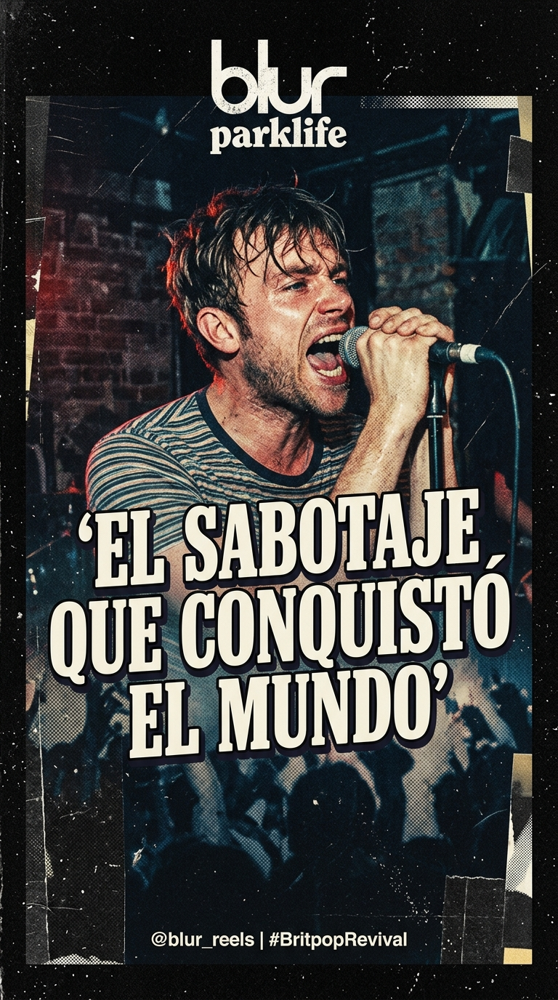
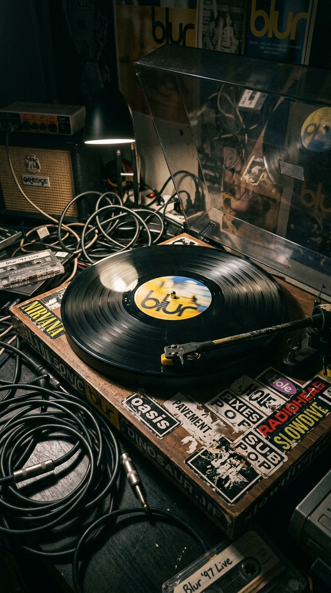
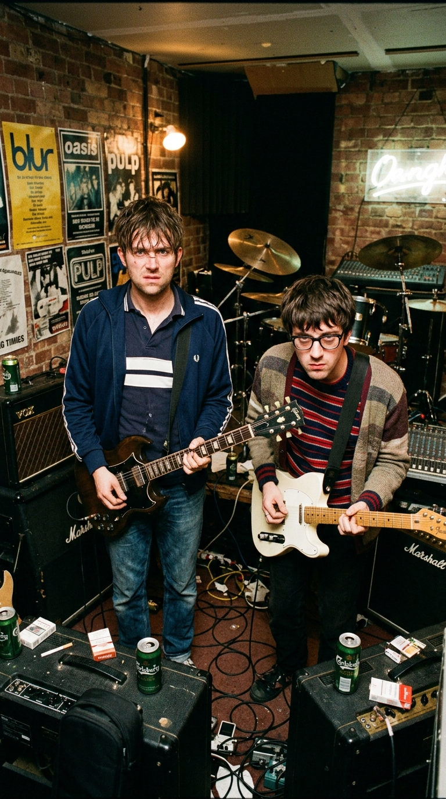
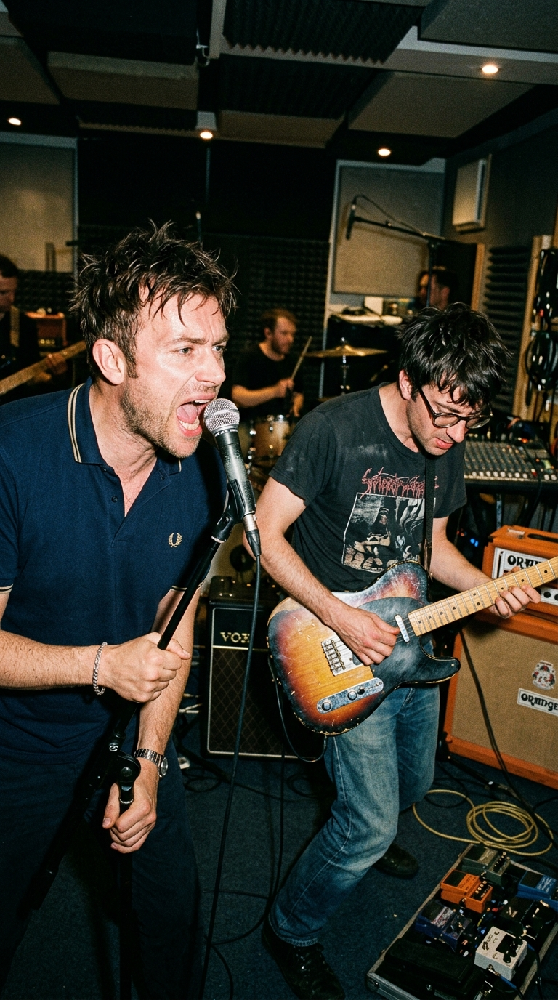
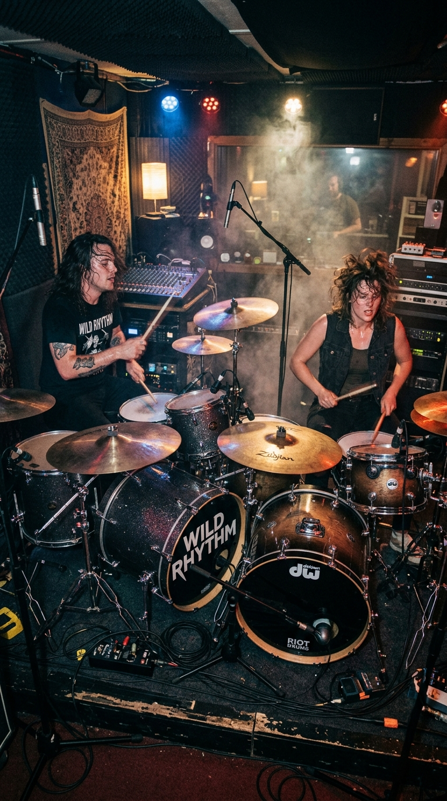
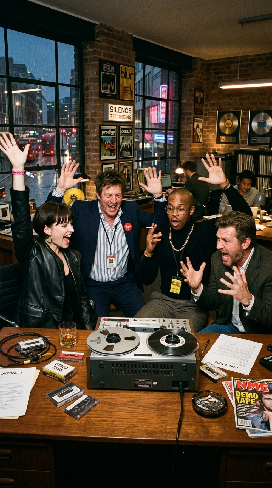
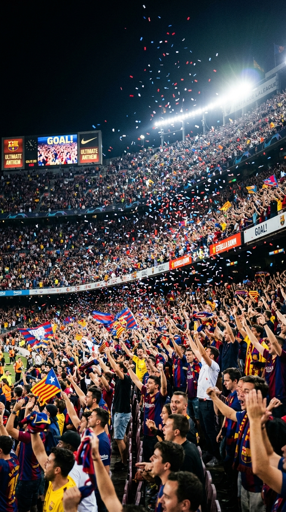
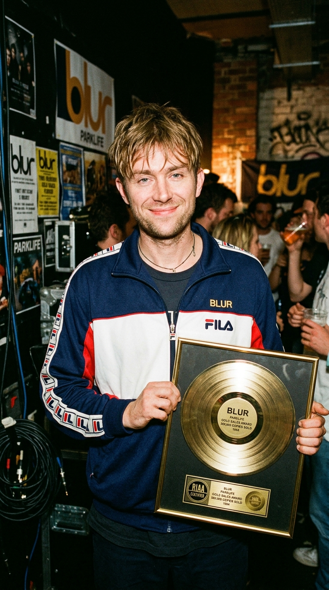

# 💥 El Sabotaje de los Dos Minutos: Cómo una Broma para Enfurecer a la Industria Conquistó el Mundo

> *«Solo queríamos reírnos en la cara de los ejecutivos. Les dijimos: 'Aquí tienen su próximo single'. Esperábamos una bronca monumental, que nos gritaran que era una basura inaudible de dos minutos... En lugar de eso, nos miraron estupefactos y dijeron: 'Dios mío, esto es un número uno mundial'.»*  
> — **Graham Coxon**, recordando la primera escucha de *«Song 2»* en 1997.

---

*Mayfair Studios, Londres, 1996: La irreverente toma de dos minutos y dos segundos que demolió las reglas del Britpop y conquistó los estadios del planeta.*

---

### Prólogo: El cadáver dorado del Britpop

En la primavera de 1996, el pop británico agonizaba bajo el peso de su propia vanidad. Apenas nueve meses antes, en agosto de 1995, la llamada «Batalla del Britpop» —ese circo mediático orquestado con precisión quirúrgica que enfrentó el lanzamiento simultáneo de *«Country House»* de Blur y *«Roll with It»* de Oasis— había copado los titulares de las noticias nocturnas de la BBC y las portadas de los tabloides londinenses. Blur había ganado la carrera comercial del número uno, pero el precio psicológico de aquella victoria pírrica había sido devastador.

Agotados por giras interminables, hastiados de la caricatura costumbrista de chalecos, carreras de galgos y vodevil victoriano en la que se sentían atrapados, los cuatro miembros de la banda —Damon Albarn, Graham Coxon, Alex James y Dave Rowntree— apenas se soportaban. La prensa británica los tachaba de burgueses engreídos; los hermanos Gallagher se burlaban de su estatus universitario desde Mánchester; y en las oficinas de su discográfica, Food Records (filial de EMI), los directores financieros exigían a gritos una secuela de *Parklife* y *The Great Escape* repleta de trompetas, teclados saltarines y estribillos para cantar en las tabernas de Candem Town.

Damon Albarn, asfixiado por ataques de pánico y un agotamiento creativo insostenible, comenzó a refugiarse en Reikiavik, fascinado por el aislamiento helado y la música experimental de Islandia. Por su parte, el guitarrista Graham Coxon, hundido en una espiral de alcoholismo y desencanto, había desconectado por completo del pop de consumo masivo inglés. En sus casetes no sonaban The Kinks ni The Beatles: sonaba el ruido chirriante, visceral y desaliñado del underground estadounidense: Pavement, Dinosaur Jr. y Sonic Youth.

El cuarteto londinense estaba a punto de disolverse o de inmolarse. Eligieron lo segundo.

---

### Acto I: La resaca en Mayfair y la guitarra de Graham

A mediados de mayo de 1996, Blur se reunió en los veteranos **Mayfair Studios**, ubicados en Primrose Hill, Londres, junto a su productor de confianza, **Stephen Street**. El ambiente en la sala de control era espeso, impregnado de una apatía densa y resacas mal curadas. David Balfe y los delegados de Food Records llamaban semanalmente pidiendo maquetas radiables, esperando himnos luminosos que pudieran sostener los presupuestos millonarios de la compañía.

Una tarde especialmente calurosa y frustrante, Graham Coxon se negó a seguir grabando arreglos delicados. Harto de la pulcritud digital, tomó su vieja **Fender Mustang** de 1969, la conectó a un pedal de distorsión **ProCo Rat** y a un amplificador Marshall subido al volumen diez, generando un zumbido ensordecedor que hizo vibrar los paneles acústicos de la sala. 

Damon Albarn sonrió con malicia. Comprendió al instante el mensaje de su guitarrista: estaban hartos de complacer a los ejecutivos de camisa planchada. Damon se sentó frente a un piano acústico destartalado y comenzó a aporrear un riff infantil, deliberadamente torpe y disonante, imitando con ironía la simpleza de las bandas grunge de Seattle que los periodistas ingleses solían despreciar.

—*«Hagamos la canción más ruidosa, corta y estúpida que se nos ocurra»*, propuso Albarn entre risas. *«Un tema de mierda para burlarnos de los directores de la discográfica. A ver qué cara ponen cuando les digamos que este es el single estrella del disco.»*

---

### Acto II: Dos baterías, dos acordes y un grito provisional

Lo que comenzó como una mofa de diez minutos se transformó en una combustión espontánea de catarsis pura. Para lograr un sonido que golpeara el pecho como un tren de mercancías, Stephen Street tomó una decisión inusual: instaló dos baterías completas en la sala de grabación. El baterista titular **Dave Rowntree** se colocó frente a su set habitual, mientras **Graham Coxon** se sentó detrás del segundo kit. 

Al unísono, ambos comenzaron a machacar los parches con un ritmo seco, implacable y cavernoso, sin adornos ni florituras técnicas.

Cuando llegó el turno de grabar las voces, Albarn no se molestó en escribir una letra estructurada en su libreta. Se colocó los auriculares, agarró un micrófono Shure SM58 y comenzó a balbucear las primeras frases sin sentido que le vinieron a la mente:

> *«I got my head checked, by a jumbo jet...  
> It wasn’t easy, but nothing is... no.»*

El estribillo, sin embargo, carecía de letra. Albarn simplemente abrió la boca y soltó un alarido agudo, impulsivo y descarado: **«¡Woo-hoo!»**, seguido de la explosión ensordecedora del pedal de distorsión de Coxon y el bajo distorsionado de Alex James rugiendo a través de un amplificador de válvulas.

La pista duraba exactamente **dos minutos y dos segundos**. Tenía **dos versos**, **dos estribillos** y estaba etiquetada en la cinta de bobina abierta como la **pista 2** de la sesión. 

—*«Es solo una guía para reírnos un rato»*, le aseguró Albarn al productor Stephen Street al salir de la cabina. *«La semana que viene le escribo una letra de verdad y cambiamos ese estúpido 'Woo-hoo' por algo con sentido.»*

Street, un veterano con un oído clínico absoluto forjado junto a The Smiths y The Cranberries, detuvo la cinta, miró a los cuatro músicos con los ojos muy abiertos y sentenció con calma imperturbable:

—*«No van a tocar una sola nota más. No van a cambiar ni una palabra. Esta canción es perfecta tal y como está.»*

---

### Acto III: El espasmo en los despachos de EMI

Cuando la cinta llegó a las oficinas de Food Records y EMI en Londres, la banda aguardaba la llamada de la discordia. Estaban convencidos de que los ejecutivos rechazarían el corte por considerarlo un sacrilegio inaudible, una afrenta contra la identidad melódica que había hecho de Blur una de las bandas más vendedoras de la década.

Pero ocurrió el fenómeno opuesto. Cuando la cinta llegó a manos de los delegados de **Virgin Records America** (el sello distribuidor de EMI en Estados Unidos, liderado por Ray Cooper y Nancy Berry), la reacción fue una ovación de júbilo. 

Durante años, las discográficas habían gastado millones de dólares intentando que las bandas de Britpop británicas triunfaran en las emisoras de radio de Estados Unidos, fracasando estrepitosamente ante la hegemonía del rock alternativo de Nirvana, Smashing Pumpkins y Pearl Jam. El acento cockney y las letras sobre la hora del té de Blur jamás habían conectado con la juventud de Nebraska o Los Ángeles.

Pero *«Song 2»* era dinamita pura: no tenía fronteras geográficas, no requería traducción y su estribillo de dos sílabas podía ser gritado por cualquier ser humano en cualquier rincón del planeta.

Cuando los directivos sugirieron buscar un título formal y comercial para la canción, Albarn y Coxon se negaron rotundamente. Decidieron mantener el nombre del archivo de producción de la mesa de mezclas: **«Song 2»** («Canción 2»). Un título minimalista, anti-comercial y desafiante que sellaba la ironía definitiva de la obra.

---

### Epílogo: El rugido de los estadios y la inmortalidad digital

Lanzada en abril de 1997 como segundo sencillo de su álbum homónimo, *«Song 2»* se convirtió en una epidemia global. Escalaría de inmediato al puesto número dos en las listas británicas y se convertiría en la primera canción de Blur en arrasar las listas de Modern Rock de Billboard en Estados Unidos, sonando en rotación constante en la influyente emisora KROQ de Los Ángeles.

Sin embargo, el verdadero milagro de la canción no ocurrió en las disquerías tradicionales, sino en la cultura popular de masas. En el otoño de 1997, la compañía canadiense **EA Sports** eligió *«Song 2»* como el tema central de apertura del videojuego **FIFA: Road to World Cup 98**. Para toda una generación de millones de niños y adolescentes en todo el mundo, la silueta virtual de David Beckham y el pitido inicial de un partido de fútbol quedaron indisolublemente asociados al grito salvaje de Albarn y la distorsión implacable de Coxon.

Pronto, los pabellones de la NBA, los estadios de la NFL, las pistas de hockey sobre hielo de la NHL y las gradas de los campos de fútbol europeo adoptaron los acordes de *«Song 2»* como el himno oficial para celebrar goles, anotaciones y victorias épicas.

Aquellos dos minutos de ruido furioso, grabados con resaca para burlarse de la avaricia corporativa, terminaron salvando la cuenta bancaria de Blur, reinventando su carrera artística y otorgándoles una inmortalidad que ninguna balada pop convencional jamás les habría concedido.

---

### Reflexión: La victoria del caos sobre el cálculo

En una industria obsesionada con las fórmulas predecibles, las métricas de audiencia y la corrección milimétrica, *«Song 2»* permanece como el recordatorio más electrizante de que la verdadera magia del rock nace cuando los artistas pierden el miedo al error y se atreven a reírse de las reglas establecidas.

Y tú, ¿en qué momento de tu vida gritaste por primera vez ese inolvidable *«¡Woo-hoo!»*?

---

### 📚 Fuentes y Archivo Documental

* **Hemeroteca de NME & Melody Maker (1996-1997):** Crónicas de las sesiones en Mayfair Studios y reportajes sobre la reinvención sónica de Blur tras la saturación del Britpop.
* **Maconie, Stuart (1999):** *Blur: 3862 Days – The Official History*. Virgin Books. Análisis pormenorizado de las grabaciones del álbum homónimo y los testimonios del productor Stephen Street.
* **Cavanagh, David (2000):** *The Creation Records Story: My Magpie Eyes Are Hungry for the Prize*. Virgin Publishing. Contexto histórico sobre la rivalidad con Oasis y el colapso del movimiento alternativo británico.
* **Harris, John (2004):** *Britpop!: Cool Britannia and the Spectacular Demise of English Rock*. Da Capo Press. Registro de las tensiones internas entre Albarn y Coxon y la influencia del lo-fi estadounidense.
* **Billboard Magazine Archives (1997):** Registros de difusión radiofónica en EE. UU. (Modern Rock Tracks) y acuerdos de licencia comercial con EA Sports para *FIFA 98*.
