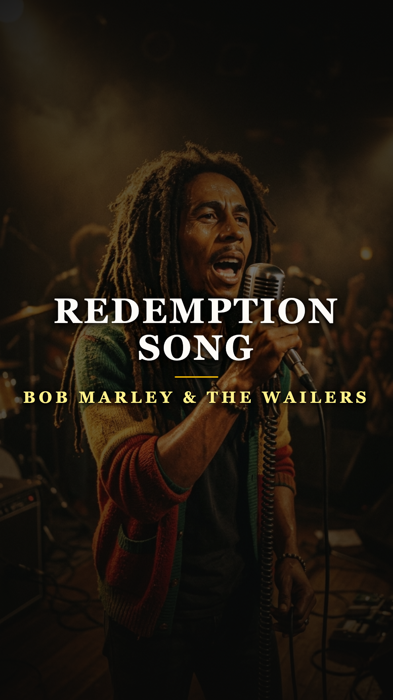
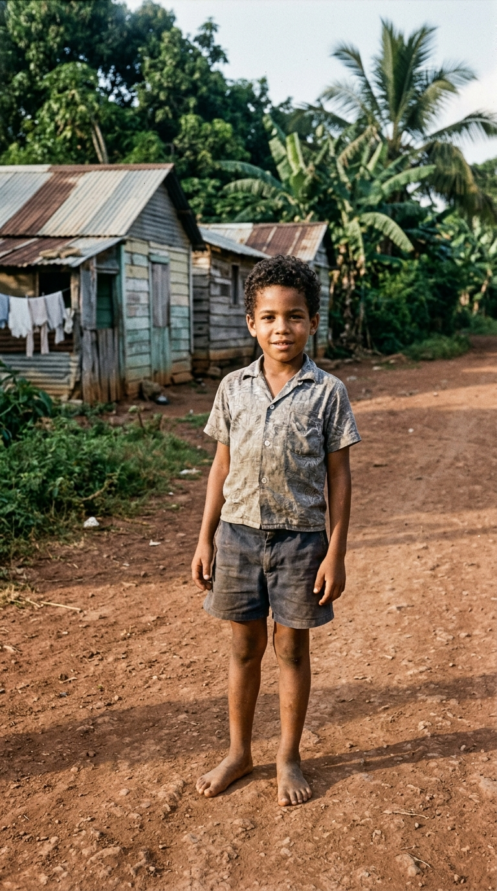
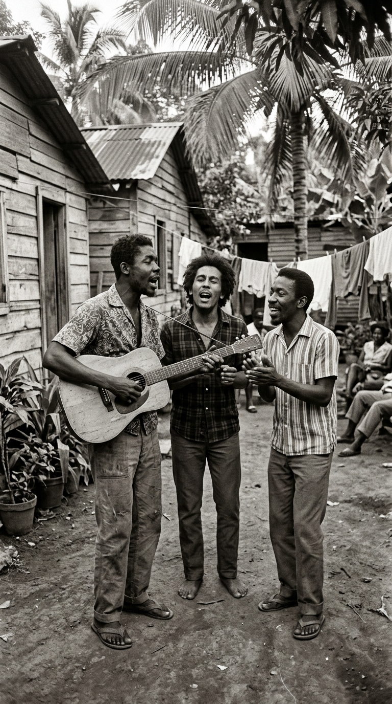
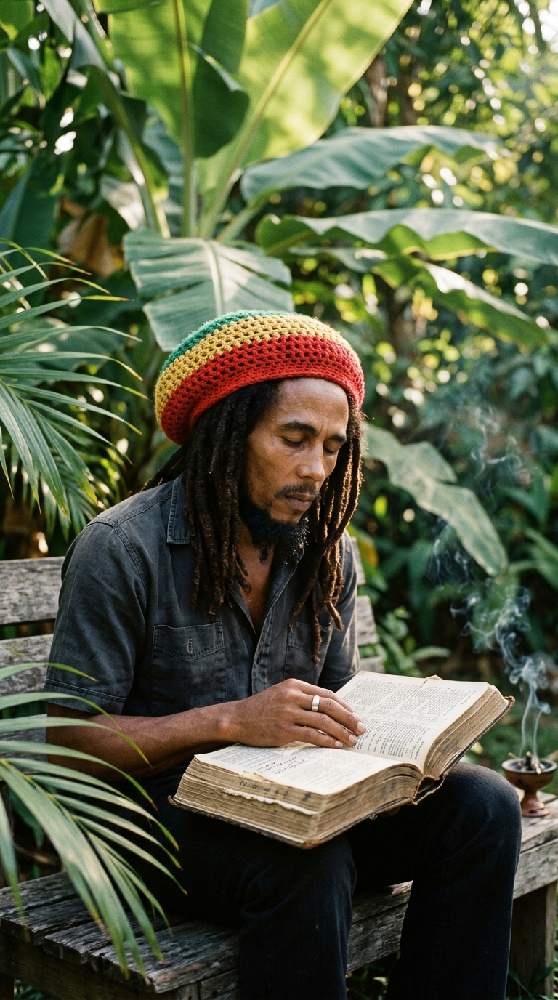
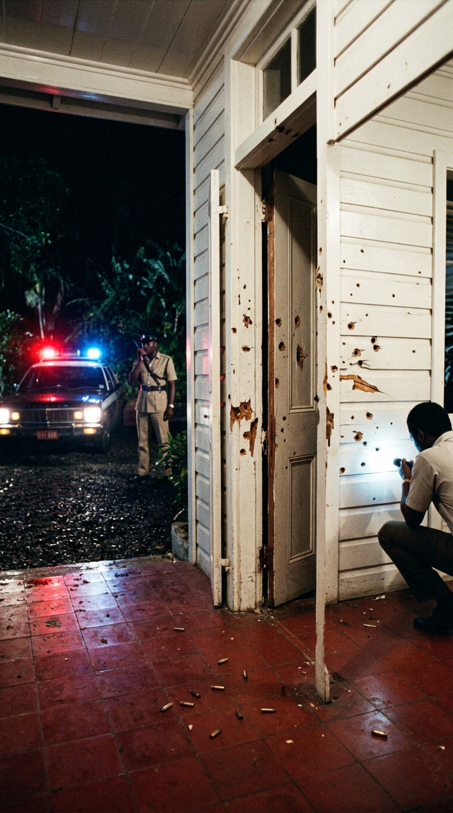
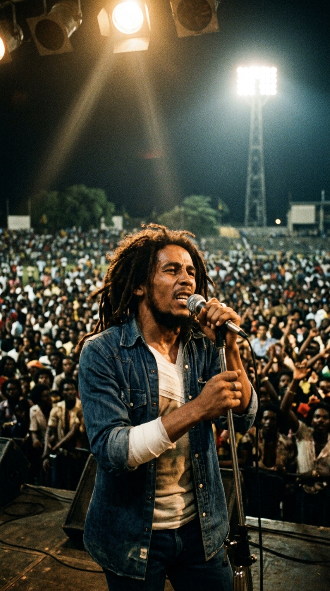
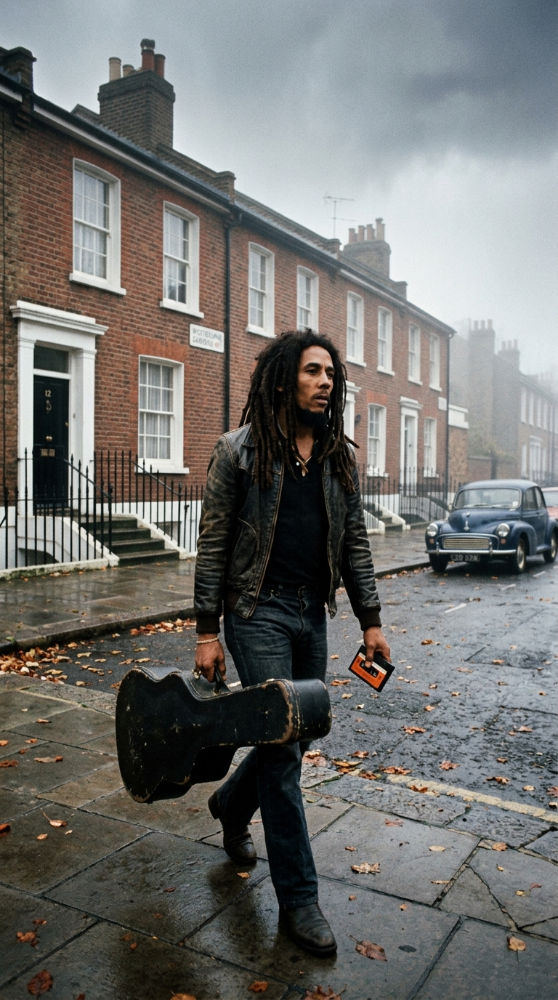
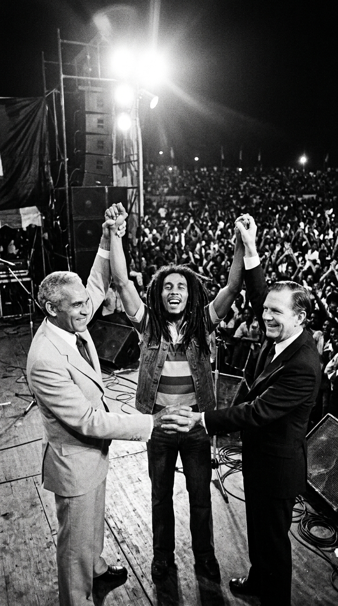
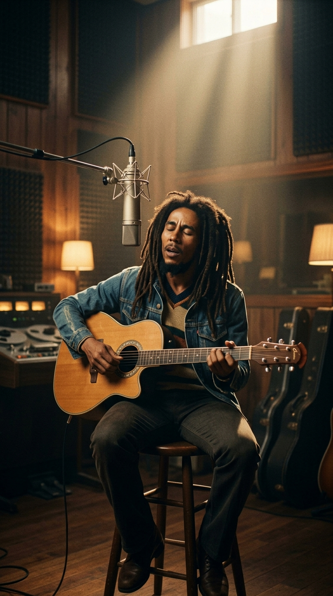

# 🦁 El Profeta Descalzo que Desafió a la Muerte: Bob Marley y los Nueve Destellos de Gloria
### *De las chozas de barro y hojalata de Trenchtown al escenario donde enfrentó a sus propios verdugos con dos balas en el cuerpo, ardiendo como un sol fulgurante hasta legar «Redemption Song» a los 36 años.*

---

**Por la redacción de Acordes Ocultos**  
*Tiempo de lectura estimado: 9 minutos*

---

### Prólogo: La bala que no pudo apagar el canto

Hay hombres cuya voz no pertenece a la industria del entretenimiento, sino a la tierra que los vio nacer y al clamor de los desposeídos que no tienen nombre en los periódicos. **Robert Nesta Marley** no subía a los escenarios a buscar fama ni aprobación mundana; subía como un sacerdote de la resistencia, con los ojos cerrados en trance místico, su melena de rastas sacudiéndose como un látigo bajo los reflectores y su guitarra rítmica marcando el pulso cardíaco de un continente entero.

Su paso por este mundo fue tan breve como devastador. En apenas una década de alcance planetario —entre el lanzamiento internacional de *Catch a Fire* en 1973 y su partida definitiva en mayo de 1981—, aquel muchacho mulato nacido en las colinas rurales de Jamaica convirtió el dialecto, los tambores y la fe de una pequeña isla caribeña en el evangelio moral del Tercer Mundo. Sobrevivió a los tiros de sicarios políticos, obligó a estrecharse la mano a dos líderes enfrentados en plena guerra civil y, cuando supo que un cáncer fulminante devoraba su cuerpo, empuñó una guitarra acústica a solas en el estudio para regalar a la humanidad el testamento más puro de libertad espiritual jamás grabado.

Esta es la crónica de sus **nueve destellos de gloria**: los nueve instantes epistolares que marcaron la vida, el martirio y la trascendencia eterna de la mayor estrella fugaz de la música moderna.

---

### Hito I (1945–1955): El estigma birracial en Nine Mile y el barro de Trenchtown

Para comprender el fuego que habitaba en el pecho de Bob Marley es imprescindible viajar al corazón montañoso de la parroquia de Saint Ann, en **Nine Mile**, donde nació el 6 de febrero de 1945. Su madre, **Cedella Malcolm**, era una campesina negra de apenas dieciocho años; su padre, **Norval Sinclair Marley**, un capitán de marina británico blanco de cincuenta años que prácticamente desapareció tras su nacimiento, limitándose a enviar escasas ayudas económicas hasta su muerte.

Aquella herencia birracial marcó a Bob con un estigma implacable en la Jamaica colonial. Para la élite blanca y mulata de Kingston era un paria negro de la sierra; para las comunidades negras era un *«half-caste»* o *«chico blanco»*. En ambos mundos fue un extraño.

*Nine Mile, Jamaica: En las colinas de tierra roja y casuchas de hojalata, el joven Nesta aprendió la dureza de la supervivencia y la dignidad que más tarde marcarían sus versos.*

A finales de la década de 1950, Bob y su madre emigraron a la capital en busca de un porvenir menos miserable. Llegaron a **Trenchtown**, un suburbio brutal construido sobre antiguos vertederos de Kingston, donde cientos de familias compartían un solo grifo comunal de agua y letrinas descubiertas. En aquellas calles de polvo y violencia entre pandillas, Bob aprendió a defenderse a puñetazos —lo que le valió el apodo callejero de *«Tuff Gong»*—, pero también descubrió la única ventana que podía salvarlo del abismo: una vieja radio de transistores donde sintonizaba las estaciones de rhythm & blues de Nueva Orleans y Miami que cruzaban flotando las aguas del Caribe.

---

### Hito II (1962–1965): La forja de The Wailers y el nacimiento del ritmo

En los patios comunales de Trenchtown, bajo la sombra de los árboles de panapén, Bob conoció a dos muchachos que compartían su misma sed espiritual y musical: **Neville O'Riley Livingston** (a quien el mundo conocería como **Bunny Wailer**) y un guitarrista alto, hosco y virtuoso llamado **Peter McIntosh** (**Peter Tosh**).

Guiados por el respetado cantante local **Joe Higgs**, quien les enseñó armonías vocales y afinación en lecciones gratuitas al anochecer, los tres adolescentes fundaron un grupo vocal al que llamaron *The Teenagers*, luego *The Wailing Rudeboys* y finalmente **The Wailers** (*Los que lloran*).

*Kingston, principios de los 60: Bob Marley, Peter Tosh y Bunny Wailer ensayan en un patio de madera, combinando el ska jamaiquino con el soul más crudo de Norteamérica.*

En 1963, el legendario productor **Clement «Coxsone» Dodd** los escuchó en su mítico **Studio One** de Kingston y quedó fascinado por la intensidad del trío. Su primer sencillo grabado, *«Simmer Down»* —un ruego urgente a las bandas juveniles armadas de los suburbios para que calmaran la violencia callejera—, se disparó al número uno de las listas jamaiquinas vendiendo más de setenta mil copias.

Aquel ritmo rápido de ska pronto comenzó a desacelerarse en los estudios clandestinos de la isla, adaptándose a los calores tropicales y a los latidos pausados del corazón humano. Entre el ska, el rocksteady y los experimentos rítmicos con el productor excéntrico **Lee «Scratch» Perry**, The Wailers estaban pariendo un sonido que cambiaría para siempre la faz de la música popular: el **reggae**.

---

### Hito III (1972–1973): La audacia de Chris Blackwell y la explosión de «Catch a Fire»

A pesar de acumular éxitos en Jamaica, The Wailers no ganaban dinero real; los productores locales los explotaban con contratos draconianos y adelantos miserables. A principios de 1972, la banda viajó a Gran Bretaña para una gira con el cantante Johnny Nash, pero la empresa promotora quebró y los dejó abandonados en un invierno gélido en Londres, sin billetes de regreso, sin calefacción y sin una libra esterlina en los bolsillos.

Desesperado, Bob Marley caminó hasta las oficinas de **Island Records** en Basing Street y pidió ver al fundador del sello, **Chris Blackwell**, un jamaiquino blanco de familia acomodada que distribuía música caribeña en Europa.

Blackwell vio en aquel joven de mirada fiera algo que ningún ejecutivo discográfico había percibido jamás:
> *«Todos los demás veían a grupos de cantantes pop caribeños intercambiables. Yo vi a una banda de rock rebelde, con la misma mística y peso que The Rolling Stones o Jimi Hendrix, pero con un mensaje espiritual que el mundo blanco no entendía»*.

*Londres, 1972: Bob Marley en los estudios de Island Records junto a su guitarra Gibson Les Paul, esculpiendo el sonido global del reggae con el álbum Catch a Fire.*

Blackwell les entregó cuatro mil libras en efectivo —una cifra insólita para la época basada únicamente en la confianza— para que regresaran a Jamaica a grabar un álbum completo en pistas independientes. El resultado fue **«Catch a Fire»** (1973), presentado en una funda original con forma de encendedor Zippo. 

Por primera vez, el reggae no era un sencillo desechable para pinchadiscos de baile, sino una obra conceptual de alta fidelidad. Temas como *«Concrete Jungle»* y *«Slave Driver»* colocaron a Marley en el mapa del periodismo musical británico y norteamericano. Cuando Eric Clapton versionó *«I Shot the Sheriff»* en 1974 y la llevó al número uno del Billboard, el planeta entero se giró hacia Kingston buscando al autor original de aquella obra maestra.

---

### Hito IV (1974–1975): El profeta de Zion y la consagración Rastafari

A medida que Peter Tosh y Bunny Wailer abandonaban la formación por discrepancias con el protagonismo de Bob y su rechazo a las largas giras por el mundo blanco, Bob Marley transformó su arte en una misión puramente espiritual. Rebautizó al grupo como **Bob Marley & The Wailers**, sumando en los coros a las **I-Threes** (integradas por su esposa **Rita Marley**, **Judy Mowatt** y **Marcia Griffiths**).

Marley ya no era un cantante; era un mensajero del movimiento **Rastafari**. Sus canciones adoptaron las enseñanzas bíblicas del Antiguo Testamento interpretadas desde la óptica de la opresión colonial negra, reconociendo al emperador de Etiopía, **Haile Selassie I** (*Ras Tafari*), como la manifestación viviente de la divinidad (*Jah*).

*Kingston, mediados de los 70: Bob Marley con su boina tejida tradicional en íntima comunión espiritual, estudiando las escrituras que inspirarían discos como Natty Dread y Rastaman Vibration.*

En álbumes fundamentales como **«Natty Dread»** (1974) y **«Rastaman Vibration»** (1976), temas como *«No Woman, No Cry»*, *«Them Belly Full (But We Hungry)»* y *«War»* —cuya letra reproduce textualmente el discurso de Haile Selassie ante las Naciones Unidas en 1963 sobre la abolición definitiva del racismo— convirtieron a Marley en un ícono de liberación para las naciones africanas en lucha contra el apartheid y para los barrios marginales de todo el planeta.

---

### Hito V (Diciembre de 1976): La emboscada de Hope Road y el milagro del plomo

A finales de 1976, Jamaica se encontraba sumida en una sangrienta guerra civil no declarada. Las elecciones generales enfrentaban a muerte a los partidarios socialistas del primer ministro **Michael Manley** (People's National Party, PNP) contra los simpatizantes derechistas pro-norteamericanos de **Edward Seaga** (Jamaica Labour Party, JLP). En las calles de Kingston, pandillas armadas financiadas con armas de contrabando y apoyo exterior sembraban cadáveres a diario.

Buscando rebajar la tensión bélica, Marley aceptó encabezar un concierto gratuito y pacífico titulado **«Smile Jamaica»**, organizado para el 5 de diciembre en el National Heroes Park. Aunque Bob insistió en su estricta neutralidad política, el gobierno de Manley adelantó las elecciones generales coincidiendo con la fecha del evento, lo que hizo que la oposición viera el recital como un acto encubierto de apoyo al régimen socialista.

El 3 de diciembre de 1976, dos días antes del espectáculo, la tragedia golpeó a su puerta. A las ocho y media de la noche, mientras la banda ensayaba en la residencia comunal de Marley en el **56 de Hope Road**, siete hombres armados descendieron de dos automóviles blancos y abrieron fuego indiscriminado con pistolas y ametralladoras a través de las ventanas y puertas de madera.

*Kingston, 3 de diciembre de 1976: Las marcas de los disparos en las paredes de Hope Road tras el atentado que estuvo a punto de costarle la vida a Bob Marley y su familia.*

El ataque fue salvaje. Rita Marley recibió un disparo en la cabeza mientras intentaba huir con sus hijos pequeños en un automóvil; el proyectil se desvió milagrosamente por el grosor de sus dreadlocks bajo el cuero cabelludo sin perforar el cráneo. El mánager de la banda, Don Taylor, recibió cinco balazos en la pelvis que casi lo desangran.

Dentro de la cocina, un tirador disparó a quemarropa contra Bob Marley. Una bala le rozó el esternón a escasos milímetros del corazón y se incrustó profundamente en su antebrazo izquierdo. Los atacantes huyeron en la oscuridad dejando un reguero de sangre y casquillos. De manera providencial, ninguna de las víctimas murió aquella noche.

---

### Hito VI (5 de Diciembre de 1976): El concierto del desafío supremo

Con la policía colonial desconcertada y los francotiradores aún libres en las colinas de Kingston, las autoridades médicas y de seguridad rogaron a Bob Marley que cancelara el concierto y fuera evacuado de inmediato del país.

Marley se negó categóricamente.

El 5 de diciembre de 1976, apenas **cuarenta y ocho horas después de haber sido baleado**, un convoy fuertemente escoltado llevó a Bob hasta el escenario del National Heroes Park. Frente a él se extendía un mar humano de más de **ochenta mil jamaiquinos** que contuvieron el aliento al verlo aparecer.

*Kingston, 5 de diciembre de 1976: Bob Marley sobre el escenario del Smile Jamaica, con el torso y brazo vendados bajo su camisa vaquera, desafiando a sus asesinos ante 80.000 compatriotas.*

Marley subió al proscenio con vendajes médicos visibles envolviendo su brazo izquierdo y el pecho bajo una camisa de mezclilla desabotonada. Originalmente se había pactado que Bob tocaría una sola canción para tranquilizar al público antes de retirarse. Pero cuando se colgó su guitarra eléctrica, una cólera sagrada se apoderó de él: tocó durante noventa minutos ininterrumpidos con una furia y una pasión sobrenaturales.

En el clímax de la actuación, Bob abrió su camisa y mostró a la multitud y a los asesinos ocultos entre las sombras las heridas de bala recientes en su piel. Cuando un periodista internacional le preguntó tras el show por qué había arriesgado su vida sabiendo que los sicarios podían dispararle de nuevo desde cualquier rincón, Marley pronunció las palabras que quedaron grabadas en la memoria de la música mundial:

> *«La gente que está intentando hacer de este mundo un lugar peor no se toma ni un solo día libre. ¿Por qué demonios debería tomármelo yo?»*.

---

### Hito VII (1977): El exilio en Londres y la cúspide de «Exodus»

Inmediatamente después del recital, consciente de que su permanencia en la isla desataría una carnicería entre facciones rivales, Bob Marley voló a Nassau (Bahamas) y desde allí se trasladó a **Londres**, donde permaneció exiliado durante dieciséis meses.

En el apartamento número 42 de Oakley Street, en Chelsea, Bob y The Wailers se concentraron con una devoción monástica. Lejos de la presión agobiante de las armas de Kingston, Marley canalizó el trauma del atentado, la nostalgia del destierro y su fe mesiánica en la que sería su obra cumbre: **«Exodus»** (1977).

*Londres, 1977: En los barrios lluviosos de la capital británica, Bob Marley encontró el refugio creativo para componer Exodus, nombrado por la revista Time el mejor álbum del siglo XX.*

El álbum era una catedral sónica en dos actos: el lado A era un tratado político y revolucionario ardiente (*«Natural Mystic»*, *«Guiltiness»*, *«The Heathen»*, *«Exodus»*), mientras que el lado B era una explosión de consuelo humano, romance y optimismo inquebrantable (*«Jamming»*, *«Waiting in Vain»*, *«Three Little Birds»*, *«One Love / People Get Ready»*). 

Años después, a finales del milenio, la revista estadounidense **Time** consagraría a *Exodus* como **el mejor álbum del siglo XX**, por encima de obras canónicas de The Beatles, Bob Dylan o The Rolling Stones, reconociéndolo como un manifiesto universal de esperanza frente a la opresión.

---

### Hito VIII (1978): El milagro de las manos unidas en el One Love Peace Concert

A principios de 1978, la crisis económica y los enfrentamientos armados en Kingston habían alcanzado cotas de barbarie insostenibles. Los jefes de las principales bandas criminales de ambos bandos políticos —hombres que se habían tiroteado en las esquinas— comprendieron que la única persona sobre la faz de la tierra capaz de sentarlos en una misma mesa era Bob Marley.

Los líderes barriales viajaron en secreto a Londres para pedirle que regresara a su patria para un concierto de reconciliación nacional. Marley aceptó el reto.

El **22 de abril de 1978**, en el Estadio Nacional de Kingston, tuvo lugar el legendario **One Love Peace Concert**. Cerca de treinta y dos mil personas, divididas por el odio político y vigiladas por soldados del ejército con fusiles automáticos, presenciaban el espectáculo en una atmósfera de tensión asfixiante. En el palco de honor, sentados a pocos metros de distancia pero sin dirigirse la palabra, estaban el primer ministro Michael Manley y el líder opositor Edward Seaga.

Durante la interpretación de *«Jamming»*, Marley comenzó a improvisar un rezo hipnótico sobre el ritmo del bajo:
> *«Para que haya paz... no necesitamos palabras de diplomáticos. Necesitamos el corazón de los hombres...»*.

*22 de abril de 1978, One Love Peace Concert: Bob Marley alza al cielo las manos entrelazadas de los archirrivales Michael Manley y Edward Seaga, sellando un milagro político sin precedentes.*

Bob se acercó al borde del escenario y señaló directamente a ambos dirigentes, invitándolos a subir. Ante la sorpresa del planeta y el silencio sepulcral del estadio, Manley y Seaga caminaron hacia el centro de las tablas. Marley tomó la mano derecha de cada uno de ellos, las juntó en el aire y alzó los brazos de los archirrivales hacia la noche caribeña bajo el estruendo de un grito de júbilo colectivo que paralizó a la nación entera.

Aquel gesto no resolvió todas las miserias de Jamaica, pero salvó miles de vidas, detuvo la guerra inmediata y le valió a Bob Marley la concesión de la **Medalla de la Paz del Tercer Mundo** por parte de las Naciones Unidas en Nueva York ese mismo año.

---

### Hito IX (1980–1981): El último canto, la colina de Baviera y la eternidad

A finales de 1977, tras una lesión sufrida jugando al fútbol en París, a Bob Marley se le diagnosticó un **melanoma lentiginoso acral** bajo la uña del dedo gordo de su pie derecho. Los médicos le recomendaron la amputación quirúrgica inmediata del dedo. Fiel a sus principios religiosos rastafaris —que prohíben la mutilación deliberada del cuerpo (*«no haréis incisiones en vuestra carne»*)—, Bob rechazó la amputación y optó por una extirpación superficial del tejido cancerígeno, continuando con una agenda demoledora de giras mundiales.

Hacia el verano de 1980, el cáncer había hecho metástasis silenciosa en sus pulmones, hígado y cerebro. Marley sabía con certeza que la muerte lo esperaba en la siguiente esquina.

Con esa conciencia trágica, en las sesiones de su último álbum de estudio, **«Uprising»**, Marley envió a todos los músicos de The Wailers fuera de la sala de grabación de los estudios Tuff Gong. Despojado de bajo, teclados y metales, se sentó a solas en una banqueta de madera, abrazó su guitarra acústica Ovation y cantó su testamento espiritual absoluto: **«Redemption Song»**.

*Kingston, 1980: Desahuciado por la enfermedad, Bob Marley graba a solas su guitarra y voz en Redemption Song, legando el testamento más puro de emancipación espiritual.*

Cada verso de aquella canción desnuda sonaba como el salmo final de un hombre que se despide de la tierra:
> *«Emancipate yourselves from mental slavery; none but ourselves can free our minds. Have no fear for atomic energy, 'cause none of them can stop the time... All I ever have: redemption songs»*.

El 23 de septiembre de 1980, tras desmayarse mientras trotaba en Central Park, Bob ofreció su último recital en el Stanley Theater de Pittsburgh, apoyado físicamente por sus músicos para no desplomarse. Desesperado por frenar el avance implacable del tumor, viajó a los Alpes bávaros para someterse a la clínica del doctor Josef Issels en Rottach-Egern, viviendo en una cabaña nevada bajo rigurosas dietas holísticas. 

Pero el milagro no llegó. Cuando los médicos alemanes le confirmaron que no había retorno posible, Bob pidió volar de regreso a Jamaica para morir en su tierra natal. Durante el vuelo trasatlántico sus signos vitales colapsaron y el avión tuvo que aterrizar de emergencia en Miami.

El **11 de mayo de 1981**, en el hospital Cedars of Lebanon de Miami, a los **treinta y seis años de edad**, Bob Marley cerró los ojos para siempre. Sus últimas palabras a su hijo Ziggy resumieron toda su filosofía terrenal:
> *«El dinero no puede comprar la vida»*.

---

### Epílogo: El mausoleo de Nine Mile y el legado incombustible

Diez días después, Jamaica despidió a su hijo más ilustre en el funeral de Estado más multitudinario jamás celebrado en la cuenca del Caribe. **Más de un millón de personas** —la mitad de la población de la isla— abarrotaron las carreteras entre Kingston y Nine Mile, llorando y bailando al paso del coche fúnebre.

Bob Marley fue sepultado en un mausoleo blanco en la cima de la colina de Nine Mile, exactamente en el lugar donde había corrido descalzo en su niñez. Dentro de su féretro de bronce descansan los símbolos que definieron su paso por el mundo: su guitarra Gibson Les Paul roja, una pelota de fútbol, un ramo de marihuana, un anillo legado por la corona imperial etíope y una Biblia abierta en el Salmo 23: *«El Señor es mi pastor, nada me faltará»*.

Como todos los grandes meteoros que han cruzado el cielo de nuestra cultura, Bob Marley no necesitó envejecer sobre un escenario para alcanzar la gloria. Vivió con la intensidad de un relámpago, convirtió las cicatrices del plomo en un himno de paz y demostró que la música popular puede ser la trinchera más sagrada contra la barbarie. A cuatro décadas de su partida, mientras haya un ser humano sometido a la tiranía o despojado de su dignidad, los acordes de su guitarra acústica seguirán resonando como un recordatorio eterno de que nadie, salvo nosotros mismos, puede liberar nuestras mentes.

---

### 📚 Fuentes y Archivo Documental

1. **White, Timothy.** *Catch a Fire: The Life of Bob Marley*. Henry Holt & Co., 1983 (Edición definitiva ampliada, 2006).
2. **Marley, Rita; con Jones, Hettie.** *No Woman No Cry: My Life with Bob Marley*. Hyperion, 2004.
3. **Salewicz, Chris.** *Bob Marley: The Untold Story*. HarperCollins, 2009.
4. **Steffens, Roger.** *So Much Things to Say: The Oral History of Bob Marley*. W. W. Norton & Company, 2017.
5. **The Daily Gleaner.** Archivo hemerográfico de Kingston, coberturas documentales del atentado de Hope Road (diciembre 1976) y del *One Love Peace Concert* (abril 1978).
6. **Time Magazine.** *The Best Music of the 20th Century: Why Exodus is the Album of the Century*. Diciembre de 1999.
7. **Island Records Archives.** Notas de producción históricas de las sesiones de *Catch a Fire* (1972) y *Exodus* (1977), Basing Street Studios, Londres.
