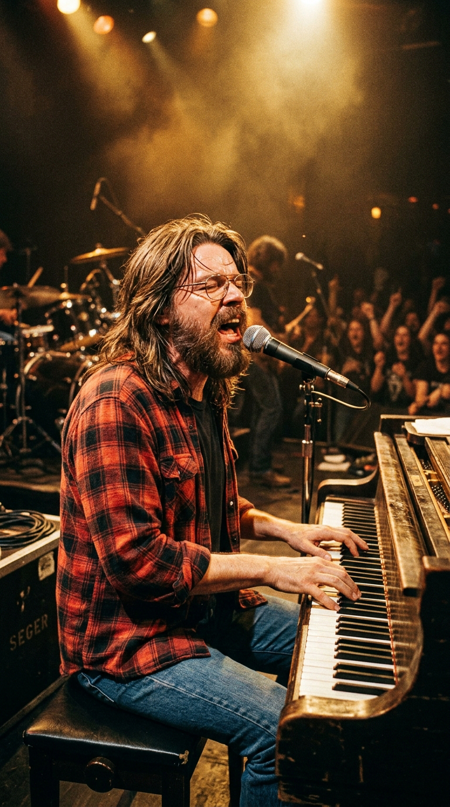
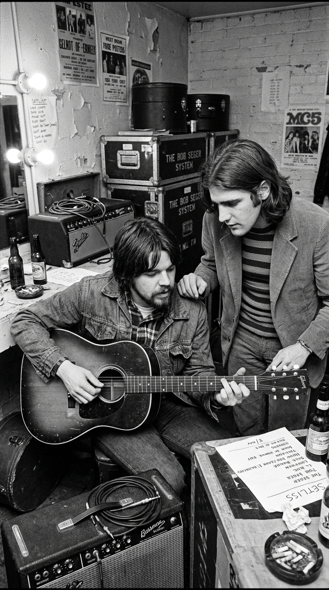
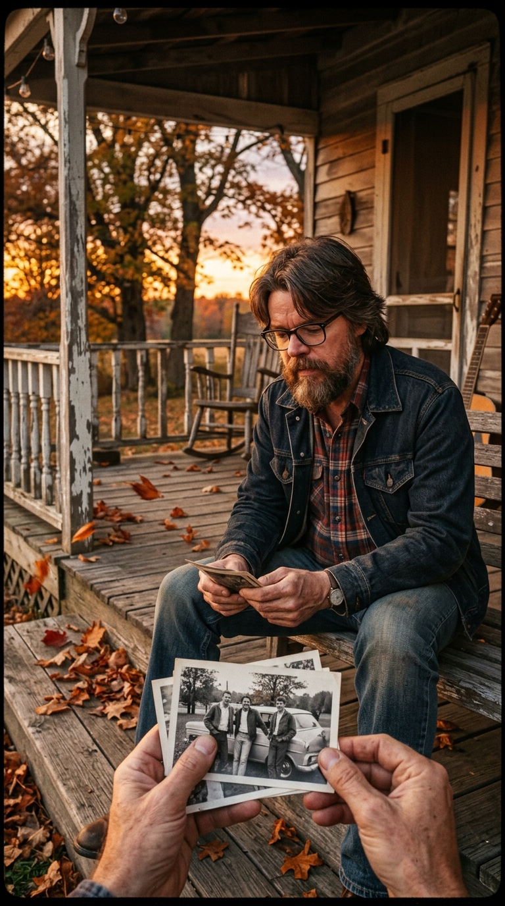
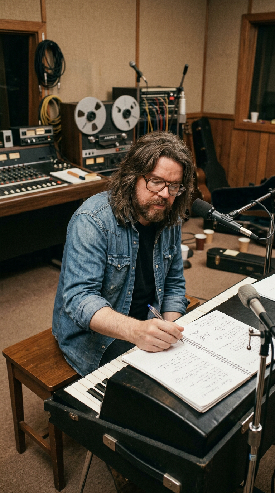
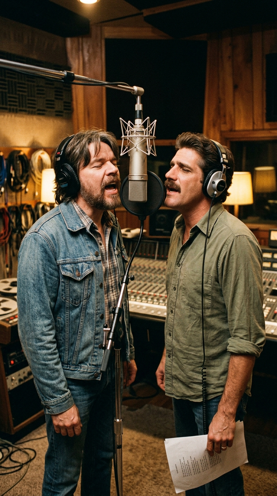
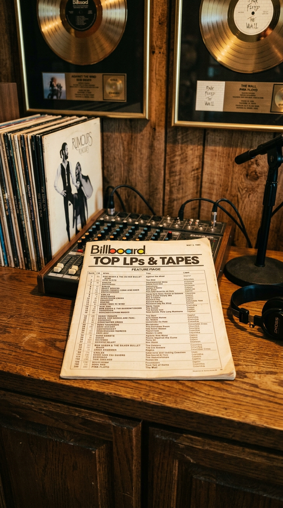
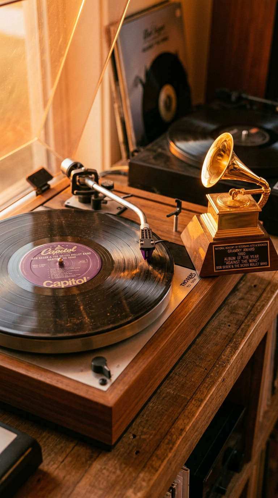

# La Canción Nacida del Viento en Contra: Bob Seger, Glenn Frey y las Cicatrices del Tiempo

> *"La gente piensa que 'Against the Wind' es una metáfora poética inventada en un café. No lo es. Nació del dolor físico en mis piernas y del aire helado quemándome los pulmones cuando corría carreras de fondo en la secundaria de Ann Arbor. Descubrí que correr con el viento a favor es fácil, cualquiera puede hacerlo; pero cuando corres contra el viento, cada paso cuesta el doble de sudor y te hace indestructible para el resto de tus días."*  
> — **Bob Seger**, entrevista para *Rolling Stone*, junio de 1980.

---

## Prólogo: La Tierra Dura del Medio Oeste

En la mitología del rock and roll estadounidense de los años setenta, los reflectores solían iluminar los excesos hedonistas de Los Ángeles o el dinamismo frenético y nihilista de Nueva York. Pero en las fábricas de automóviles, los suburbios fabriles y las llanuras barridas por las ventiscas del Medio Oeste —desde Detroit hasta Chicago y Cleveland—, la música tenía otro pulso: olía a aceite de motor, a sudor obrero de turno de noche y a una honestidad sin aditivos que no entendía de modas pasajeras.

El monarca indiscutible de aquel territorio era Bob Seger. Con su voz raspada de lija y terciopelo, su barba espesa de leñador y su guitarra desgastada por miles de noches en clubes de carretera de mala muerte, Seger encarnaba el triunfo del jornalero del rock: un hombre que había pasado quince años durmiendo en furgonetas heladas y tocando en tugurios para cincuenta parroquianos antes de que el país entero se rindiera a sus pies con *Live Bullet* y *Night Moves* en 1976.

*1980: Bob Seger sobre el escenario. El triunfo tardío de un hombre que jamás olvidó de dónde venía ni cuánto costaba cada palmo de camino.*

Sin embargo, cuando en 1980 alcanzó la cumbre absoluta de su madurez artística con el álbum y la canción que le dieron título, *"Against the Wind"*, Seger no compuso una fanfarria triunfalista sobre la gloria de la victoria. Compuso, por el contrario, una de las reflexiones más conmovedoras, otoñales y sinceras sobre el paso de los años, el costo de las cicatrices y la dolorosa pérdida de la inocencia juvenil.

---

## Acto I: El Corredor de Fondo de Ann Arbor

El origen de la metáfora que bautizaría el himno más universal de Bob Seger no brotó de las lecturas de los poetas de la Generación Beat ni de un desamor en un hotel de lujo. Brotó del barro, la escarcha y los tendones de un muchacho de diecisiete años en el otoño de 1962.

Durante sus años de adolescencia en la **Ann Arbor High School**, en Michigan, Seger era un tímido estudiante de clase obrera cuya única vía de escape frente a los problemas económicos familiares era el equipo escolar de atletismo y carreras a campo traviesa (*cross-country*).

*Michigan, 1962: el joven Bob Seger entrenando campo a través. El esfuerzo físico del viento gélido de los Grandes Lagos forjaría su filosofía de vida.*

Los inviernos en la región de los Grandes Lagos son despiadados. Los entrenadores obligaban a los muchachos a correr circuitos de cinco y diez millas a través de colinas nevadas, maizales secos y caminos rurales donde las ráfagas heladas provenientes del norte azotaban de frente con una furia brutal.

*"Recuerdo la sensación exacta de doblar una curva en el camino rural y sentir que una pared invisible de aire gélido te golpeaba en el pecho"*, relató Seger a *The Detroit Free Press*. *"Te quemaba la garganta, te congelaba el sudor en las cejas y parecía empujarte tres pasos hacia atrás por cada uno que dabas hacia adelante. Pero si no te rendías, si bajabas la cabeza y seguías empujando contra el viento, aprendías una lección que jamás se te borraba del alma: aprendías que las cosas que realmente valen la pena en esta vida nunca vienen a favor de la corriente"*.

Aquella experiencia física quedó grabada a fuego en su memoria durante casi dos décadas, esperando el momento exacto en que la vida lo enfrentara a vientos aún más devastadores que las tormentas de nieve de Michigan.

---

## Acto II: El Muchacho de Detroit y la Deuda de Glenn Frey

A finales de los años sesenta, mucho antes de que el mundo conociera a The Eagles o a The Silver Bullet Band, Detroit era una caldera de creatividad y supervivencia musical. En 1968, un Bob Seger de veintitrés años que intentaba abrirse paso con su grupo The Bob Seger System conoció entre bastidores en el club The Hideout a un joven guitarrista local de diecinueve años, talentoso pero completamente desorientado: **Glenn Frey**.

Seger reconoció de inmediato el brillo en los ojos de aquel muchacho. Lo invitó a su modesto apartamento, le enseñó los secretos de la composición de canciones —cómo estructurar los compases de blues, cómo modular los puentes armónicos— y lo llevó al estudio de grabación para que tocara la guitarra acústica y cantara los coros en su primer gran éxito regional de 1968: *"Ramblin' Gamblin' Man"*.

*Detroit, 1968: Bob Seger acoge bajo su tutela a un desconocido Glenn Frey de diecinueve años, sembrando una lealtad que duraría toda una vida.*

Frey jamás olvidó aquel gesto de generosidad fraternal en una industria caracterizada por la envidia y el canibalismo. Poco después, Glenn se mudó a Los Ángeles, formó The Eagles junto a Don Henley y conquistó el planeta con *Hotel California*. Pero cada vez que se le preguntaba por su maestro, Frey respondía con devoción: *"Bob Seger me enseñó todo lo que sé sobre escribir una canción de rock and roll. Si no hubiera sido por él, probablemente hoy sería mecánico en Michigan"*.

---

## Acto III: El Otoño de 1979 y la Pérdida de la Inocencia

Hacia 1979, tras el impacto masivo de álbumes como *Night Moves* (1976) y *Stranger in Town* (1978), Bob Seger se encontró, por primera vez en su existencia, en una posición económica desahogada. Podía permitirse comprar casas elegantes, autos nuevos y los mejores instrumentos del mercado. Sin embargo, al sentarse en el porche de su casa de madera contemplando las hojas caer, una profunda melancolía se apoderó de su espíritu.

*1979: a los treinta y cuatro años, Seger mira hacia atrás. El éxito había llegado, pero el camino se había cobrado un tributo de viejos amigos e inocencia perdida.*

Muchos de sus viejos compañeros de ruta se habían quedado por el camino: algunos consumidos por las drogas y el alcoholismo, otros derrotados por las deudas y la frustración, y otros convertidos en ejecutivos cínicos que ya no recordaban por qué habían empezado a tocar la guitarra. Se dio cuenta de que la madurez traía consigo una carga dolorosa de decepciones, traiciones inevitables y desencantos.

Tomó su guitarra acústica Ovation y comenzó a rasguear una secuencia dulce y nostálgica en Sol mayor. Las palabras surgieron como un río de memorias:

> *"Seems like yesterday, but it was long ago,*  
> *Janey was lovely, she was the queen of my nights.*  
> *There in the darkness with the radio playing low...*  
> *And I remember what she said to me,*  
> *How she swore that it never would end.*  
> *I remember how she held me, oh so tight,*  
> *Wish I didn't know now what I didn't know then..."*

La línea final de esa estrofa —***"Wish I didn't know now what I didn't know then"*** (*"Ojalá no supiera ahora lo que no sabía entonces"*)— se convertiría en una de las frases más célebres, citadas y reconocibles de la historia de la lírica popular estadounidense. Era la condensación perfecta del dilema existencial humano: el anhelo imposible de recuperar la pureza de cuando éramos jóvenes e ingenuos, antes de que el mundo nos enseñara con qué facilidad se rompen las promesas eternas.

---

## Acto IV: La Sesión de Criteria Studios y el Abrazo en Miami

En el invierno de 1980, Bob Seger y The Silver Bullet Band entraron en los legendarios **Criteria Studios** de Miami para registrar las pistas maestras del álbum. La producción estuvo a cargo de Bill Szymczyk (el cerebro detrás de los discos de The Eagles) y de los propios músicos de la banda.

Para capturar la textura orgánica y campestre de la balada, Seger contó con la presencia magistral de **Barry Beckett** —el legendario tecladista de The Muscle Shoals Rhythm Section— en el piano acústico, y de **Pete Carr** en las guitarras acústicas de doce cuerdas. El pulso del piano de Beckett no era un mero adorno: era el corazón palpitante de la canción, con arpegios elegantes que caían como gotas de lluvia sobre un cristal empañado.

*Criteria Studios, Miami, 1980: Barry Beckett al piano y Bob Seger a la acústica grabando la toma definitiva de 'Against the Wind'.*

Sin embargo, cuando la pista instrumental estaba completada, Seger sintió que al estribillo le faltaba una dimensión vocal crucial: necesitaba una voz cálida y envolvente que hiciera de contrapeso a su aspereza natural, alguien que cantara con él el verso de resistencia: *"Against the wind / Still running against the wind"*.

Bob descolgó el teléfono y llamó a Glenn Frey, que se encontraba descansando en Los Ángeles tras las extenuantes sesiones de *The Long Run* de The Eagles:  
*"Glenn, tengo una canción que necesito que cantes conmigo. Tienes que volar a Miami"*.

Frey no lo dudó un segundo. Tomó el primer vuelo comercial a Florida. En Criteria Studios, ambos viejos amigos de Detroit se pararon frente al mismo micrófono de condensador Neumann. Cuando Frey comenzó a doblar la voz de Seger en el coro, entrelazando sus timbres con una armonía aterciopelada y melancólica, todos en la cabina de control comprendieron que la canción había alcanzado la categoría de milagro.

*Reunión de hermanos de Detroit: Glenn Frey acudió a la llamada de su mentor para sellar el coro más conmovedor de 1980.*

---

## Acto V: El Número Uno y la Victoria sobre "The Wall"

Publicado en la primavera de 1980, el álbum *Against the Wind* se convirtió en un fenómeno arrollador. En una época en la que la radio estadounidense estaba dominada por el punk, la new wave británica y los últimos estertores de la música disco, la franqueza descarnada de Bob Seger conectó de lleno con millones de personas comunes que sentían que la vida cotidiana en medio de la recesión económica era una batalla constante contra los elementos.

El impacto en las listas de ventas fue descomunal. A finales de abril de 1980, el álbum *Against the Wind* escaló hasta el **puesto número uno del Billboard 200**, logrando la hazaña histórica de **desalojar del primer lugar a la gigantesca ópera rock *The Wall* de Pink Floyd**, que llevaba quince semanas consecutivas atrincherada en la cima.

*Primavera de 1980: Bob Seger destrona a Pink Floyd en la cúspide de Billboard y se corona con dos premios Grammy.*

La canción *"Against the Wind"* trepó hasta el número cinco del Billboard Hot 100, ganó **dos premios Grammy** (incluyendo Mejor Interpretación de Rock por un Dúo o Grupo) y vendió más de cinco millones de copias solo en los Estados Unidos. Pero el mayor triunfo de Seger no fueron los trofeos dorados ni las cifras de ventas: fue constatar cómo su canción se convertía en el refugio emocional de toda una generación.

---

## Epílogo: El Viento Sigue Soplando

Más de cuatro décadas después de su lanzamiento, *"Against the Wind"* no ha perdido una sola brizna de su potencia poética. En un mundo donde todo parece diseñado para ser consumido y desechado en segundos, y donde la ilusión de la eterna juventud oculta la riqueza de las cicatrices vividas, la voz de Bob Seger permanece como un monumento a la dignidad de quienes resisten.

*La metáfora del camino: correr contra el viento no es una condena, es la prueba de fuego que forja el alma de los valientes.*

La canción nos recuerda que envejecer no es una derrota, sino el testimonio glorioso de haber peleado cada pulgada de terreno; que está bien mirar atrás con nostalgia y admitir que hemos perdido batallas y que nos han roto el corazón; pero que, mientras quede un soplo de aire en los pulmones, la única respuesta honorable frente a la adversidad es ajustar los hombros, levantar la barbilla y seguir corriendo contra el viento.

*El vinilo morado de Capitol Records: surcos analógicos que albergan el himno definitivo de la perseverancia humana.*

---

### 📚 Fuentes y Archivo Documental

1. **Seger, Bob** (1980). *«Bob Seger: The Rolling Stone Interview»*, por Dave Marsh. *Rolling Stone Magazine*, número 319 (junio de 1980).
2. **Graff, Gary & Weschler, Tom** (2011 / reed. 2023). *Travelin' Man: On the Road and Behind the Scenes with Bob Seger*. Wayne State University Press, Detroit.
3. **Frey, Glenn** (2013). Entrevistas testimoniales sobre la colaboración vocal en «Against the Wind» en el documental oficial *History of the Eagles* (Jigsaw Productions / Capitol Records).
4. **Billboard Magazine** (1980). *Top LPs & Tape Charts: Week of April 26 – May 31, 1980* (Seis semanas consecutivas en el número 1 del Billboard 200).
5. **Capitol Records** (1980). *Créditos y notas de carpeta del álbum Against the Wind (SOO-12041)*: sesiones de la Muscle Shoals Rhythm Section (Barry Beckett, Pete Carr, David Hood) grabadas en Criteria Studios (Miami) y producidas por Bill Szymczyk.
6. **National Academy of Recording Arts and Sciences (NARAS)** (1981). *23rd Annual Grammy Awards Official Winners Record: Best Rock Performance by a Duo or Group with Vocal*. The Recording Academy, Los Ángeles.
