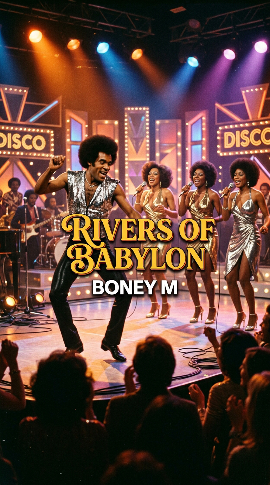
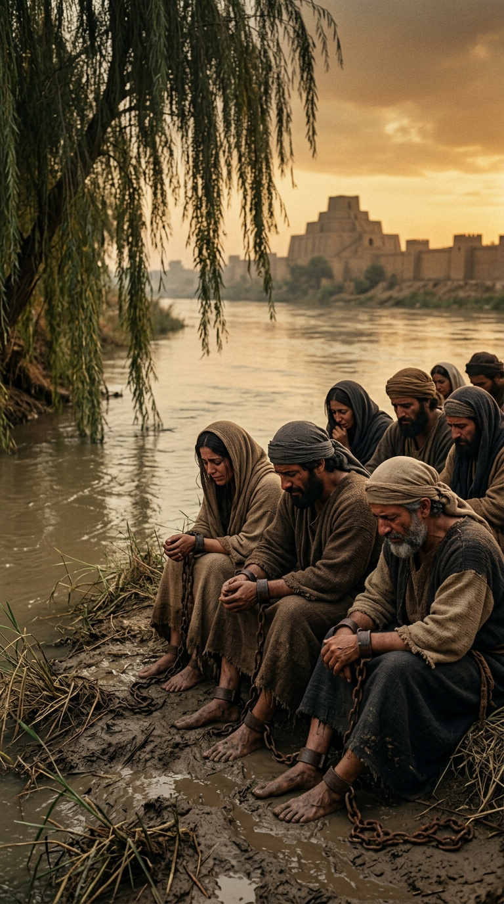
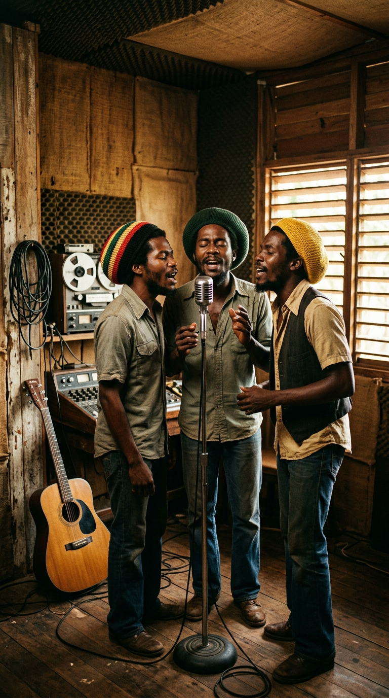
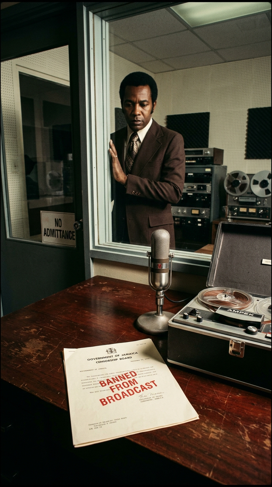
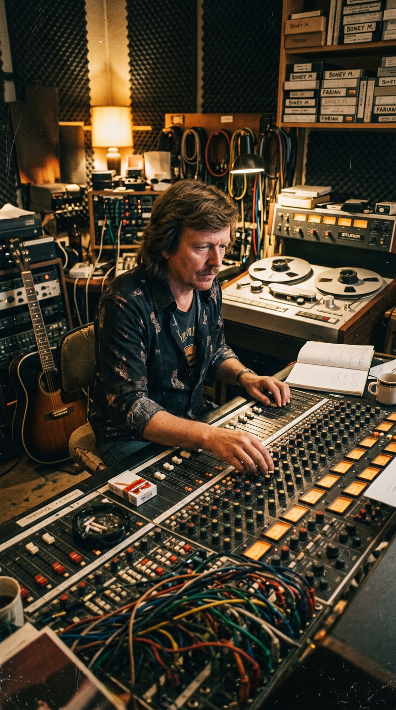

# 🌊 El Lamento de los Esclavos en las Pistas de Baile: La Verdadera Odisea de «Rivers of Babylon»

> *«Junto a los ríos de Babilonia, allí nos sentábamos y llorábamos al acordarnos de Sion... Colgamos nuestras arpas de los sauces... porque los que nos habían llevado cautivos nos pedían que cantáramos para entretenerlos.»*  
> — **Salmo 137:1-3** / **The Melodians** / **Boney M**, 1978.

---

*Offenbach am Main, Alemania Occidental, 1978: La plegaria bíblica de veinticinco siglos de antigüedad que escapó de la censura jamaiquina para conquistar las discotecas del mundo y el corazón del Kremlin soviético.*

---

### Prólogo: El espejismo de una noche de sábado

En el verano de 1978, las pistas de baile de media Europa, América y Asia vibraban bajo el estallido deslumbrante de las luces estroboscópicas y el ritmo sintético de la música disco. Millones de personas vestidas con camisas de seda, pantalones de campana y zapatos de plataforma saltaban al unísono, sonriendo y alzando sus copas al compás de un coro femenino angelical que coreaba una melodía aparentemente festiva, pegadiza e inofensiva.

Casi nadie en aquellas discotecas abarrotadas comprendía la paradoja sobrecogedora que estaba teniendo lugar. Aquellas voces alegres no cantaban sobre amores de verano ni noches de fiesta sin compromiso: estaban recitando, palabra por palabra, uno de los textos poéticos más desgarradores, tristes y antiguos sobre el dolor de la esclavitud, el destierro forzado y el desarraigo humano que jamás haya concebido la humanidad.

Aquellos versos tenían veinticinco siglos de vida. Habían nacido en el siglo VI antes de Cristo, a orillas de los ríos Tigris y Éufrates, cuando el rey caldeo Nabucodonosor II destruyó el Templo de Salomón en Jerusalén, deportó en cadenas al pueblo hebreo hacia Mesopotamia y sus captores babilónicos se burlaban de su sufrimiento exigiéndoles que tocaran sus instrumentos sagrados para la diversión de la corte imperial.

¿Cómo fue posible que el llanto fúnebre de unos cautivos en la antigua Mesopotamia terminara transformado en el mayor bombazo comercial de la música bailable de los años setenta?

---

### Acto I: La trinchera de Kingston y el salmo prohibido

Para desentrañar el misterio es necesario viajar primero a la asfixiante atmósfera política de **Kingston, Jamaica**, en el año **1970**.

La isla caribeña ardía en medio de una profunda polarización social, desempleo crónico y una violencia armada creciente en los guetos de Trenchtown y West Kingston. Para los seguidores del movimiento rastafari, la historia bíblica no era un relato mitológico del pasado remoto: era su presente más crudo. En la teología rastafari, «Babilonia» representaba el sistema de opresión imperialista blanco, las secuelas de la esclavitud colonial británica, la brutalidad de la policía local y la pobreza impuesta a las clases desfavorecidas; mientras que «Sion» encarnaba la tierra prometida, la repatriación espiritual y física a la madre África.

Una calurosa mañana de 1970, el conjunto vocal de rocksteady **The Melodians** —liderado por los cantantes **Brent Dowe** y **Trevor McNaughton**— entró a los estudios de grabación de **Leslie Kong** en Federal Records, Kingston. Dowe y McNaughton tomaron los versos del **Salmo 137** y los fundieron con una línea del **Salmo 19:14**:

> *«By the rivers of Babylon, where we sat down...  
> Yeah, we wept, when we remembered Zion...  
> Let the words of our mouth, and the meditation of our heart,  
> be acceptable in thy sight, here tonight...»*

Acompañados por un compás sincopado de reggae primitivo, bajo pesado y guitarras secas a contratiempo, grabaron una plegaria de resistencia pura. 

Sin embargo, cuando la canción comenzó a sonar en las calles, el gobierno conservador del primer ministro jamaicano **Hugh Shearer** entró en pánico. Las autoridades consideraron que las referencias a la caída de Babilonia eran una incitación directa a la insurrección popular contra el Estado y la policía. La emisora estatal Jamaica Broadcasting Corporation (JBC) prohibió de inmediato su emisión pública. 

La censura gubernamental no pudo detener el fuego: la cinta clandestina se convirtió en un himno de resistencia subterránea en el Caribe y fue incluida dos años después en la célebre banda sonora de la película de culto *The Harder They Come* (1972), protagonizada por Jimmy Cliff.

---

### Acto II: El alquimista alemán y la fábrica de éxitos

A más de ocho mil kilómetros de distancia de Kingston, en la ciudad de **Offenbach am Main**, cerca de Fráncfort (Alemania Occidental), operaba uno de los productores discográficos más astutos, perfeccionistas y enigmáticos de la industria europea: **Frank Farian**.

Farian, un exmúsico de schlager alemán que había construido un imperio sonoro en sus avanzados **Europasound Studios**, poseía una obsesión clínica por las melodías folclóricas del mundo y una habilidad sin igual para empaquetarlas en ritmos irresistibles para la radio continental. En 1975 había inventado de la nada a **Boney M**, un cuarteto formado por cuatro inmigrantes caribeños radicados en Europa: las cantantes jamaicanas **Liz Mitchell** y **Marcia Barrett**, la modelo de Montserrat **Maizie Williams** y el bailarín y showman arubeño **Bobby Farrell**.

Lo que el público desconocía era el gran secreto del grupo: en las grabaciones de estudio, ni Bobby Farrell ni Maizie Williams cantaban una sola nota. Las armonías vocales eran grabadas con precisión quirúrgica por Liz Mitchell y Marcia Barrett, mientras que la voz cavernosa, masculina y grave que dominaba los temas era la del propio productor alemán, Frank Farian, manipulando ecualizadores y cintas de carrete abierto.

En el invierno de 1977, Farian escuchó la grabación original de The Melodians. Fascinado por la dulzura melancólica de la melodía, decidió emprender un experimento osado: extirpar el ritmo pausado de reggae jamaicano y acelerar el tempo a unos trepidantes **114 golpes por minuto**, vistiendo la plegaria con un bombo de cuatro tiempos a tierra (*four-on-the-floor*), sintetizadores brillantes, guitarras rítmicas de funk y coros sinfónicos grandilocuentes.

Liz Mitchell, una mujer de profundas convicciones cristianas que había crecido cantando en coros de iglesia en Londres, aportó a la sesión una emotividad vocal sentida, casi sagrada, que impedía que la pista se convirtiera en un producto plástico vacío.

---

### Acto III: El huracán de ventas y la rendición de Moscú

Lanzada en abril de 1978 como el sencillo principal del álbum *Nightflight to Venus*, *«Rivers of Babylon»* desató un terremoto sociológico sin precedentes en la industria musical.

En el Reino Unido, el sencillo permaneció cinco semanas consecutivas en el número uno, despachando más de **dos millones de copias físicas** y convirtiéndose en el segundo single más vendido en toda la historia de las islas británicas hasta ese momento (solo superado por *Mull of Kintyre* de Wings). En Alemania, Francia, Australia y más de quince países, la canción gobernó las listas durante meses enteros.

En los escenarios de televisión, Boney M ofrecía un espectáculo magnético: vestidas con atuendos blancos de fantasía futurista, Liz y Marcia entonaban el salmo con solemnidad mientras Bobby Farrell saltaba por el plató como un poseso de energía inagotable, agitando las manos y gesticulando con teatralidad salvaje.

Pero el capítulo más inverosímil de esta odisea estaba a punto de escribirse en el corazón de la Guerra Fría.

En diciembre de **1978**, en una decisión histórica que sorprendió a los servicios de inteligencia de Occidente, el Comité Central del Partido Comunista de la Unión Soviética, bajo la presidencia de **Leonid Brézhnev**, autorizó la primera visita oficial de un grupo pop occidental a la URSS. Mientras bandas como The Rolling Stones, The Beatles o Led Zeppelin estaban terminantemente prohibidas en la radio soviética por considerarse agentes de la degeneración burguesa, el régimen autorizó diez conciertos multitudinarios de Boney M en el imponente **Hotel Rossiya** y rodó un especial de televisión en plena **Plaza Roja de Moscú**, rodeados por la nieve y los muros del Kremlin.

Los censores soviéticos revisaron el repertorio con lupa: prohibieron tajantemente que tocaran su éxito *«Rasputin»* por considerarlo una ofensa a la historia rusa, pero dieron el visto bueno entusiasta a *«Rivers of Babylon»*. Los burócratas del Kremlin, cegados por la fachada de música ligera y bailable, creyeron erróneamente que la canción era un simple tema festivo anticolonialista. Jamás se percataron de que estaban permitiendo que miles de ciudadanos soviéticos cantaran a pleno pulmón, en el corazón del imperio comunista ateo, los versos exactos de la Sagrada Biblia.

---

### Epílogo: La victoria eterna de la palabra

Con el paso de las décadas, tras la trágica muerte de Bobby Farrell en San Petersburgo en 2010 y el fallecimiento de Frank Farian en 2024, *«Rivers of Babylon»* sigue sonando a diario en emisoras de radio, reuniones familiares y celebraciones de todo el mundo.

Mucho más que un artefacto dorado de la era de la música disco, la canción es un testimonio elocuente de la alquimia secreta del arte: cómo un poema de dolor nacido en el cautiverio más amargo de la antigüedad logró cruzar mares, desafiar la censura militar del Caribe, burlar la vigilancia del Telón de Acero y transformarse en una celebración global de la supervivencia y la esperanza.

---

### Reflexión: La música como refugio del alma

A veces, las pistas de baile no son lugares para olvidar el mundo, sino templos involuntarios donde el ser humano, aun sin saberlo, canta para recordar de dónde viene y soñar con la libertad que ningún muro ni tirano puede arrebatarle.

Y a ti, cuando escuchas esa melodía luminosa, ¿habías imaginado alguna vez que detrás de su ritmo bailable latía el dolor milenario de un pueblo en cadenas?

---

### 📚 Fuentes y Archivo Documental

* **Libro de los Salmos (Biblia de Jerusalén):** Textos canónicos del Salmo 137:1-4 y Salmo 19:14.
* **Katz, David (2003):** *Solid Foundation: An Oral History of Reggae*. Bloomsbury Publishing. Documentación sobre las sesiones originales de The Melodians producidas por Leslie Kong en Kingston y la censura de la Jamaica Broadcasting Corporation (JBC).
* **Farian, Frank (1978–2010):** Entrevistas de archivo técnico sobre la producción analógica en Europasound Studios (Offenbach, Alemania) y las sesiones vocales de Liz Mitchell y Marcia Barrett para el sello Hansa Records.
* **Mitchell, Liz (2018):** Entrevistas testimoniales para la BBC Radio 4 (*The Reunion: Boney M*) sobre su fe cristiana, el arreglo gospel y el impacto espiritual de la grabación de 1978.
* **The Guardian & NME Archives (Diciembre 1978):** Cobertura periodística histórica de la inédita gira de Boney M en Moscú durante el régimen de Leonid Brézhnev y la prohibición estricta de interpretar «Rivers of Babylon» en la Plaza Roja.
* **British Phonographic Industry (BPI) & Offizielle Deutsche Charts:** Certificaciones de ventas históricas (número 1 en el Reino Unido durante 5 semanas y más de dos millones de copias físicas vendidas).
