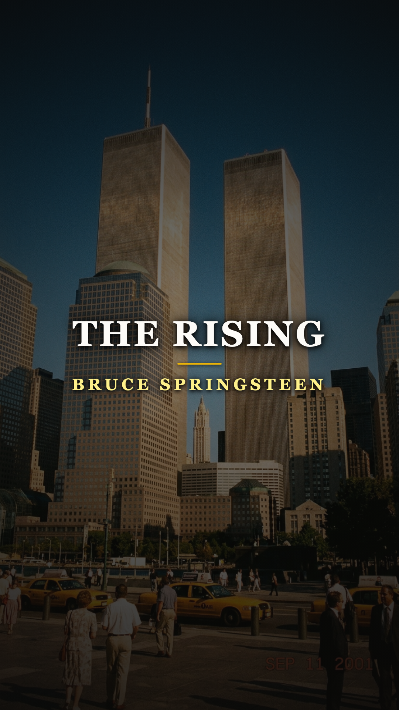
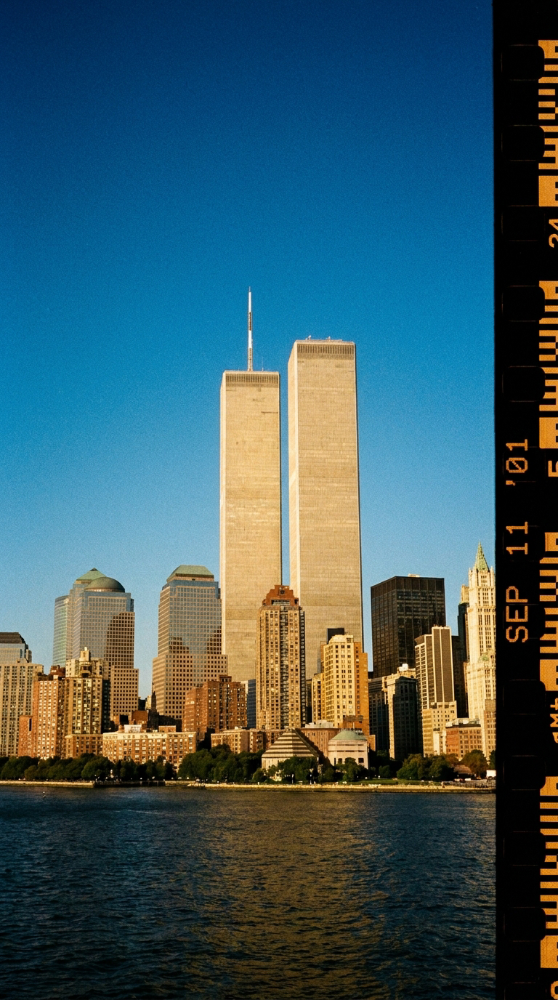
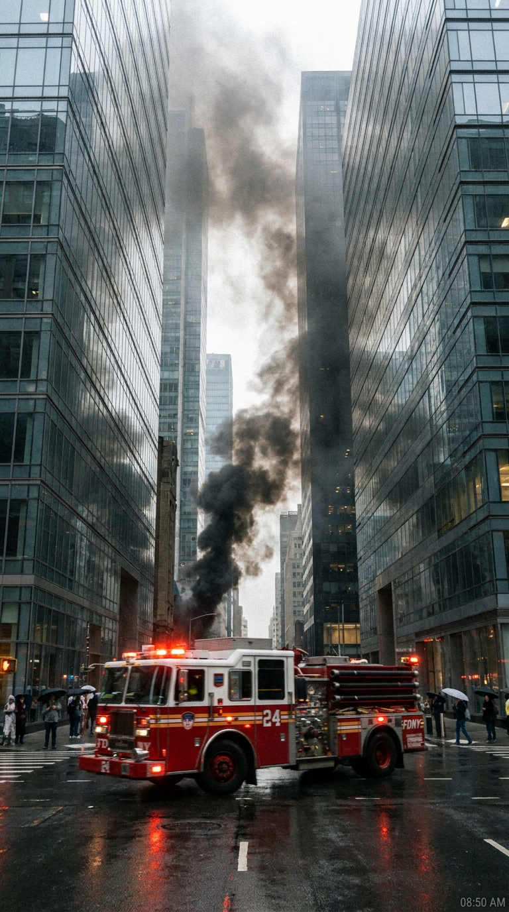
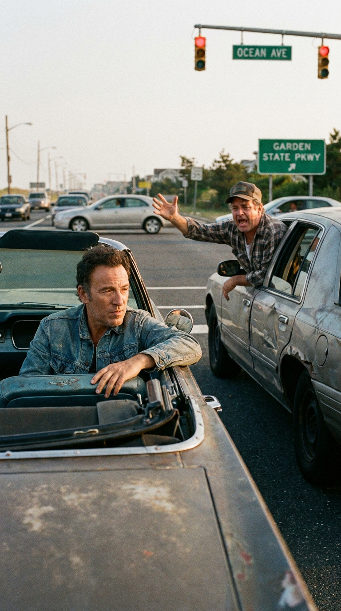
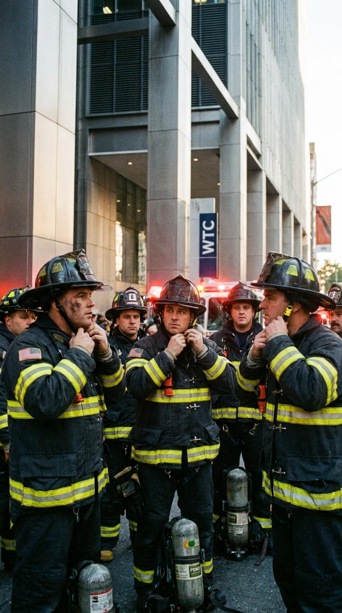
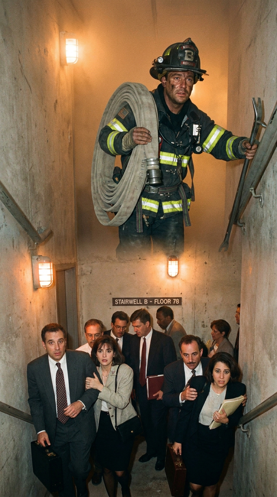
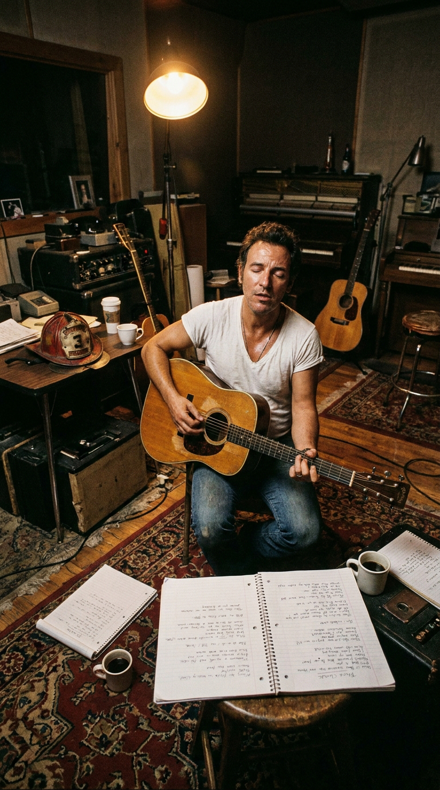
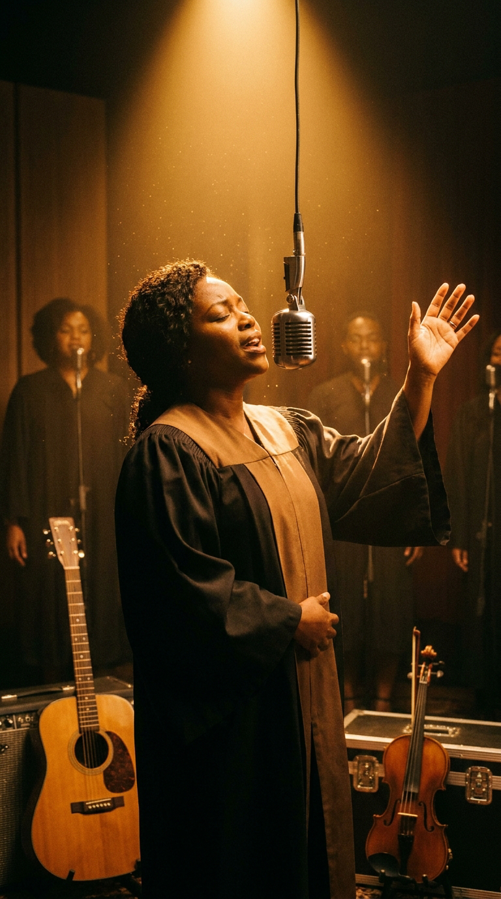
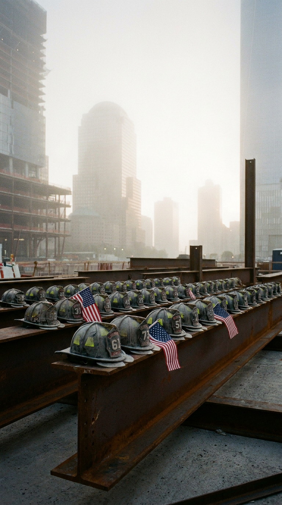
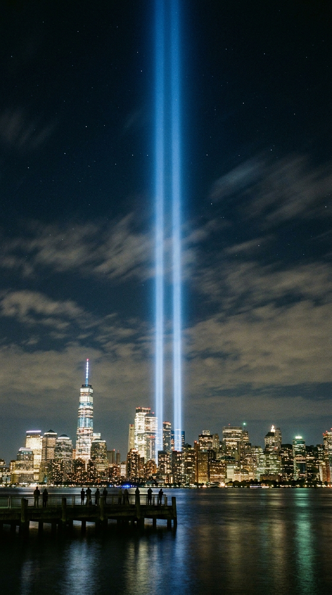

# 🚒 La Ascensión: El Grito en el Semáforo y el Rescate del Alma Americana tras el 11-S
### *Cómo la súplica desesperada de un desconocido en Nueva Jersey obligó a Bruce Springsteen a reunir a la E Street Band para cantar, desde los ojos de un bombero en las escaleras del infierno, la elegía más luminosa de nuestra era.*

---

**Por la redacción de Acordes Ocultos**  
*Tiempo de lectura estimado: 8 minutos*

---

### Prólogo: Un cielo azul cobalto que se partió en dos

La mañana del martes 11 de septiembre de 2001 amaneció en la Costa Este de los Estados Unidos con una transparencia meteorológica tan perfecta que los pilotos de aviación solían denominar «azul severo». Sobre la bahía de Nueva York y las costas de Monmouth County, en Nueva Jersey, el horizonte no presentaba una sola nube. A las 8:45 de la mañana, la silueta plateada de las Torres Gemelas del World Trade Center refulgía bajo el sol matutino como dos agujas gemelas de titanio y orgullo arquitectónico. Quince minutos después, aquel cristal de civilización y rutina laboral se disolvió en una pesadilla de combustión, acero retorcido y lluvia de amianto.

*11 de septiembre de 2001, 8:40 AM: El horizonte impoluto sobre el río Hudson antes de que el estrépito quebrara la historia contemporánea.*

Mientras millones de personas contemplaban las pantallas de televisión paralizadas por el horror, en las estaciones de bomberos de los cinco distritos de Nueva York resonaron los timbres de alarma con una furia inaudita. Desde Brooklyn, Queens, Staten Island y el Bronx, los camiones rojos del Departamento de Bomberos de Nueva York (FDNY) enfilaron hacia los puentes y túneles con las sirenas aullando contra el viento.

*Minutos después del impacto: Los camiones del FDNY abriéndose paso entre el polvo asfixiante hacia el epicentro de la catástrofe.*

En la orilla opuesta del río Hudson, en su casa de Rumson, Bruce Springsteen subió a una colina cercana desde donde se divisaba el puerto. Lo que vio recortado contra el cielo azul no fue un incendio común: era una columna titánica de humo negro que se elevaba miles de metros, arrastrando consigo la ceniza de miles de vidas humanas. Cientos de sus propios vecinos de Nueva Jersey —empleados de banca, oficinistas, operarios y policías— habían tomado los trenes de cercanías esa misma mañana hacia el distrito financiero. Muchos de ellos no regresarían jamás.

Pero entre la confusión colectiva y el olor a pólvora quemada que flotaba en el aire, se estaba gestando una llamada que cambiaría para siempre el rumbo del trovador de Asbury Park.

---

### Acto I: «¡Bruce, te necesitamos!»: La encrucijada en el semáforo

Durante los días posteriores a los atentados, Nueva Jersey se transformó en un camposanto flotante. Solo en el condado de Monmouth, donde residía Springsteen, se contabilizaron 158 víctimas mortales. Los párking de las estaciones de tren de Red Bank y Middletown permanecían repletos de automóviles cuyos dueños jamás volvieron a recogerlos; las familias acudían en silencio a colocar flores y velas sobre los capós empolvados.

Springsteen, que en aquel momento tenía 52 años, se encontraba sumido en un limbo creativo. Llevaba dieciocho años sin publicar un álbum de estudio completo de material inédito junto a la mítica **E Street Band** (desde *Born in the U.S.A.* en 1984). Aunque habían realizado una exitosa gira de reunión entre 1999 y 2000, el Boss no sentía la pulsión imperiosa de grabar nuevas canciones de rock con la banda. Dedicaba sus jornadas a colaborar discretamente en fondos de ayuda para los huérfanos de su comunidad y a llamar por teléfono a viudas anónimas para ofrecer consuelo personal, evitando celosamente las cámaras de televisión.

*Septiembre de 2001: La ventanilla que se baja en una intersección de Nueva Jersey y la frase que sacudió la conciencia de Bruce Springsteen.*

Una tarde soleada de finales de septiembre, mientras conducía su automóvil por las carreteras locales cerca del puente de Sea Bright, Springsteen se detuvo ante una luz roja en un cruce de tráfico. En el carril contiguo, un coche desgastado, conducido por un hombre de mediana edad con aspecto de trabajador de la construcción, frenó en paralelo. 

El conductor bajó la ventanilla, miró fijamente a Bruce a los ojos y, sin pedir un autógrafo ni mostrar una sonrisa de admirador, le gritó con una voz quebrada por la desesperación y el luto:

> —*«¡Bruce, te necesitamos! ¡Te necesitamos ahora más que nunca!»*.

La luz del semáforo cambió a verde y el vehículo aceleró perdiéndose en la carretera, pero aquellas seis palabras quedaron resonando en el habitáculo del Boss como un trueno bíblico. Durante décadas, Springsteen había sido el cronista sentimental de la clase trabajadora estadounidense; había cantado sobre el desempleo en los cinturones industriales, la culpa de los veteranos de Vietnam y las promesas rotas del sueño americano. Aquel desconocido no le estaba pidiendo entretenimiento: le estaba exigiendo que cumpliera con su deber moral como voz y testigo de su pueblo.

---

### Acto II: Sesenta libras de equipo y la mirada del bombero

Al regresar a su granja de Colts Neck, Springsteen se encerró en su estudio de trabajo con una guitarra acústica. El ambiente nacional en los Estados Unidos era irrespirable: los tambores de guerra sonaban en Washington, los programas de radio promovían una histeria de revancha militarista y varios artistas de música comercial comenzaban a componer himnos chovinistas cargados de ira y proclamas de venganza sangrienta.

Bruce se negó tajantemente a alimentar la espiral del odio. En lugar de mirar la tragedia desde la geopolítica, el orgullo nacional o la furia armada, decidió descender al nivel más íntimo, frágil y sagrado de la condición humana: la mirada de un bombero del FDNY entrando en la boca del lobo.

*Bajo la sombra de las torres: Hombres comunes ajustando sus correas y botellas de oxígeno, conscientes del peligro mortal.*

Para documentar la verdad emocional de la canción, Springsteen leyó minuciosamente los perfiles necrológicos que *The New York Times* publicaba a diario bajo el título *Portraits of Grief* (Retratos del Dolor). Se sumergió en las transcripciones de las comunicaciones de radio de los servicios de emergencia y en los testimonios de los supervivientes que habían descendido por las escaleras de emergencia de la Torre Sur.

Allí descubrió el contraste visual y moral más desgarrador de la jornada: mientras miles de civiles aterrorizados bajaban desesperadamente por las estrechas escaleras en busca del aire libre y la vida, los bomberos de Nueva York subían en sentido contrario, cargados con sesenta libras de mangueras, hachas de hierro y aparatos de respiración autónoma. Subían hacia el humo tóxico, hacia el calor de mil grados, conscientes de que las probabilidades de regresar con vida eran prácticamente nulas.

*En la penumbra de la escalera de incendios: Sesenta libras de equipo a la espalda mientras los demás bajaban hacia la salvación.*

De esa imagen nació el latido lírico de **«The Rising»** (*La Ascensión* / *El Levantamiento*):

> *«Left the house this morning  
> Bells ringing to the ground  
> Smoke rollin’ up, sky rollin’ down...  
> I got sixty pounds of stone and dirt, sixty pounds of stone and dirt...»*

La voz que canta no es la de un observador externo ni la de un político: es el monólogo interior de un bombero anónimo que se ahoga en la oscuridad de los peldaños mientras la gravedad del colapso se cierne sobre él. En sus bolsillos palpa los amuletos cotidianos que lo unen a la tierra: la cruz de San Florián en la hebilla de su cinturón, la fotografía de su mujer y sus hijos, y el recuerdo carnal de un beso antes de salir al turno matutino:

> *«May your strength give us strength  
> May your faith give us faith  
> May your hope give us hope  
> May your love give us love...»*

No hay rastro de rencor hacia los atacantes. Hay únicamente entrega fraterna hacia sus compañeros de brigada y una oración final para que su sacrificio otorgue luz y consuelo a los que deja atrás. La palabra *«Rising»* cobró así una doble dimensión poética: era el ascenso físico por las escaleras hacia el deber mortal, pero también la resurrección del espíritu humano sobre la barbarie.

---

### Acto III: La liturgia laica de la E Street Band en Atlanta

Con el cuaderno repleto de canciones que exploraban el vacío, la ausencia y la pérdida (entre ellas *«Lonesome Day»*, *«Into the Fire»*, *«Waitin’ on a Sunny Day»* y *«You’re Missing»*), Springsteen comprendió que no podía grabar este trabajo como un disco acústico y solitario a la manera de *Nebraska* o *The Ghost of Tom Joad*. La nación necesitaba un abrazo colectivo, una muralla de sonido comunitaria que solo sus viejos camaradas podían erigir.

En enero de 2002, Bruce convocó a la **E Street Band** al completo: **Roy Bittan** (piano), **Clarence Clemons** (saxofón tenor), **Garry Tallent** (bajo), **Steve Van Zandt** y **Nils Lofgren** (guitarras), **Max Weinberg** (batería), **Danny Federici** (órgano Hammond) y su esposa **Patti Scialfa** (coros y guitarra acústica).

*La búsqueda de la plegaria: Bruce Springsteen con su guitarra acústica, buscando transformar la desolación en luz colectiva.*

Para evitar cualquier complacencia nostálgica, Springsteen tomó una decisión arriesgada: contrató como productor al joven **Brendan O'Brien**, célebre por su trabajo con bandas de rock alternativo como Pearl Jam, Stone Temple Pilots y Soundgarden. Para alejarse de la presión mediática de Nueva York, trasladó a todo el contingente a los estudios **Southern Tracks Recording** en Atlanta, Georgia.

O'Brien impuso una disciplina quirúrgica. Prohibió las sesiones interminables y exigió tomas directas y viscerales. Para «The Rising», el productor propuso un ritmo de batería seco y marcial a cargo de Max Weinberg, que imitaba los latidos acelerados del corazón de un hombre que sube peldaño a peldaño en la oscuridad. Incorporó el violín luminoso y campesino de **Soozie Tyrell**, que dotó a la introducción de una textura celta y nostálgica.

*Estudios Southern Tracks, 2002: El coro góspel Alliance Singers elevando el estribillo hacia una dimensión celestial.*

Pero la transmutación definitiva ocurrió cuando invitaron al coro góspel afroamericano **Alliance Singers**. Cuando sus voces se fusionaron con el rugido de la guitarra Telecaster de Bruce y los teclados solemnes de Roy Bittan en el estribillo (*«Come on up for the rising, come on up, lay your hands in mine...»*), la atmósfera en la sala de control se volvió electrizante. No sonaba a un réquiem mortuorio; sonaba a un despertar triunfal, a una liturgia laica donde la pena se transmutaba en una fuerza luminosa capaz de levantar a un país entero de sus rodillas.

---

### Acto IV: 343 cascos y la comunión de una nación

El álbum ***The Rising*** se publicó el 30 de julio de 2002 bajo el sello Columbia Records. El impacto cultural y emocional fue inmediato y descomunal. Debutó en el número uno del Billboard 200, vendiendo más de medio millón de copias en su primera semana solo en los Estados Unidos, y se convirtió en el trabajo discográfico más elogiado de Springsteen en dos décadas.

En un momento en que los medios masivos alimentaban el miedo y la paranoia, las radios de todo el continente radiaban a cada hora una obra maestra que no pedía sangre, sino que honraba la dignidad del trabajador común. En la entrega de los **Premios Grammy de 2003**, el disco cosechó tres galardones, incluyendo **Mejor Álbum de Rock** y **Mejor Canción de Rock**.

*Ground Zero: Los cascos de los 343 bomberos caídos, un recordatorio indeleble del precio de la entrega desinteresada.*

Sin embargo, para Bruce Springsteen, el veredicto más importante no vino de los críticos musicales ni de las cifras de ventas de la industria. Vino de las cartas manuscritas que comenzaron a llegar a su buzón firmadas por las familias de los **343 bomberos del FDNY** que perdieron la vida en el colapso de las torres. 

Muchas viudas y huérfanos le confesaron que no habían sido capaces de articular su dolor ni de encontrar paz durante un año entero, hasta que escucharon los acordes de «The Rising». La canción les devolvía a sus padres y esposos no como víctimas mutiladas bajo los escombros de hormigón, sino como seres heroicos y radiantes que caminaron hacia el fuego para que otros pudieran respirar.

---

### Epílogo: El haz de luz sobre la bahía

Más de dos décadas después de aquella mañana fatídica de septiembre, *«The Rising»* trasciende cualquier contexto histórico específico o frontera geográfica. Se ha erigido en un monumento universal a la fraternidad humana frente a la devastación, recordándonos que en los instantes más oscuros de la existencia, lo único que nos rescata del abismo es el lazo invisible que nos une al prójimo.

*Tribute in Light sobre Lower Manhattan: Dos pilares de memoria que se proyectan hacia el firmamento, recordando que el amor vence a la ceniza.*

Cada aniversario, cuando las dos columnas azules del *Tribute in Light* atraviesan la noche de Manhattan proyectándose hacia las estrellas, la guitarra desgarrada de Springsteen sigue recordándonos la verdad fundamental que un conductor anónimo le exigió rescatar en aquel semáforo de carretera: las cenizas pasan, los imperios caen, pero las almas de quienes eligen subir las escaleras por sus hermanos permanecen encendidas para siempre.

---

### 💬 El eco en la memoria

¿Dónde estabas la mañana en que el mundo cambió y qué sensaciones despierta en ti escuchar hoy *«The Rising»* de Bruce Springsteen? ¿Crees que el arte tiene el deber de rescatar la esperanza en medio de las grandes tragedias colectivas? Comparte tu reflexión con nosotros.

---

### 📚 Fuentes y Archivo Documental

* **Springsteen, Bruce** (2016). *Born to Run* (Autobiografía oficial). Simon & Schuster, Nueva York.
* **Carlin, Peter Ames** (2012). *Bruce*. Simon & Schuster, Nueva York.
* **Marsh, Dave** (2004). *Two Hearts: The Story of Bruce Springsteen and the E Street Band*. Routledge, Londres.
* **FDNY Memorial Archives** (2001-2002). *The 343 Fallen Heroes of September 11: Official Roll of Honor*. New York City Fire Museum.
* **The New York Times** (2001-2002). *Portraits of Grief: The Complete Series of 9/11 Memorial Profiles*. Times Books / Henry Holt.
* **Rolling Stone Magazine** (Julio-Agosto 2002). *Bruce Springsteen's American Gospel: The Making and Impact of The Rising*. Edición Nº 903.
* **Hiatt, Brian** (2019). *Bruce Springsteen: The Stories Behind the Songs*. Abrams Image, Nueva York.
* **Columbia Records Session Logs** (Enero-Marzo 2002). *Southern Tracks Recording Studios, Atlanta, GA — Producer: Brendan O'Brien, Sound Engineer: Nick Didia*.
