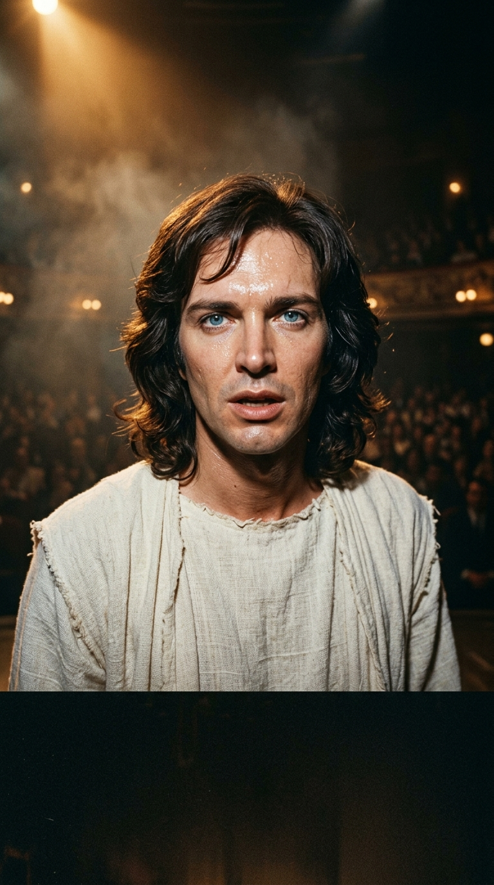
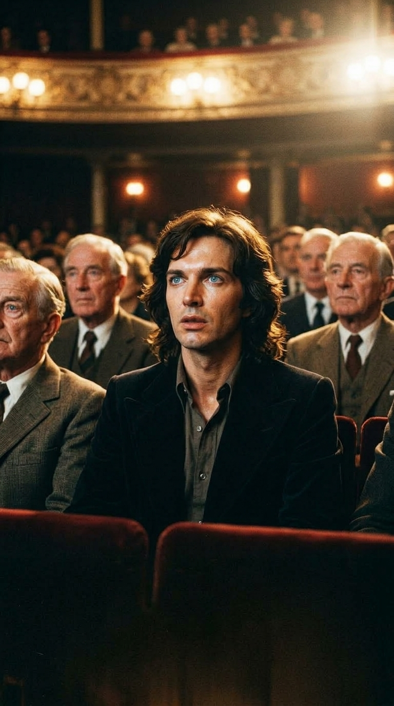
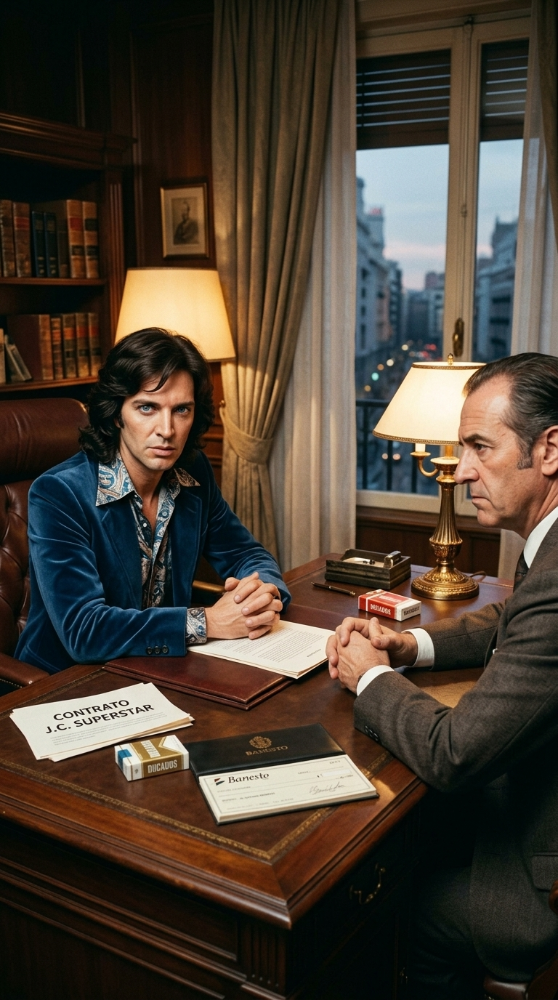
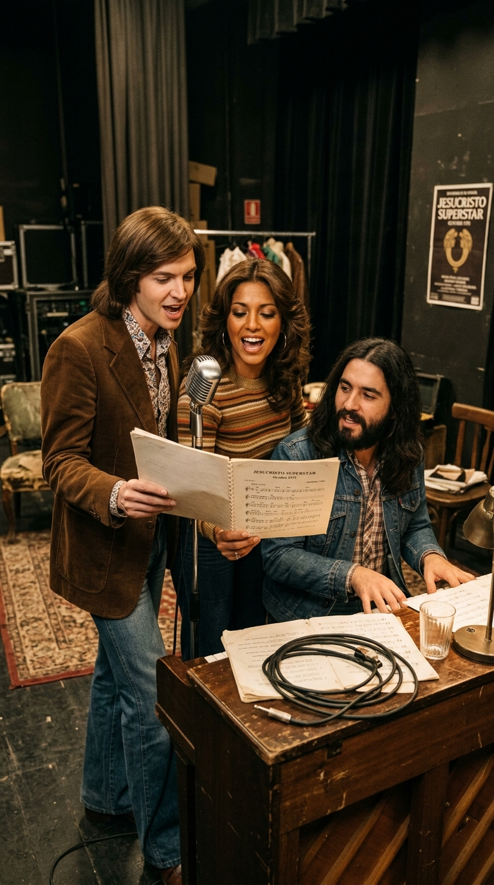
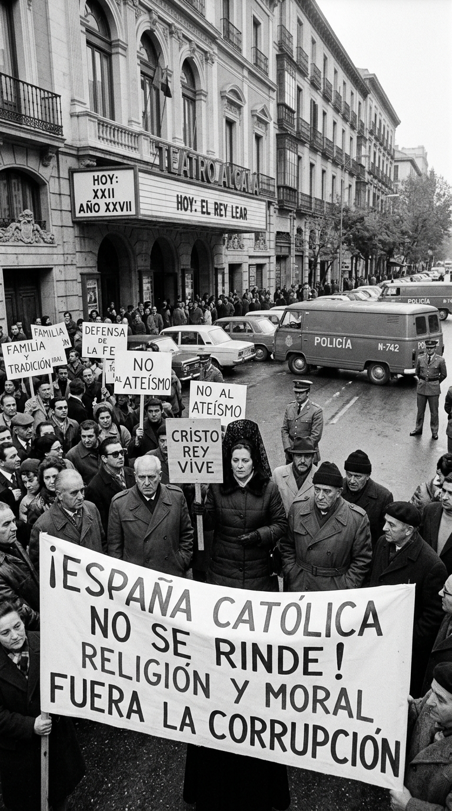
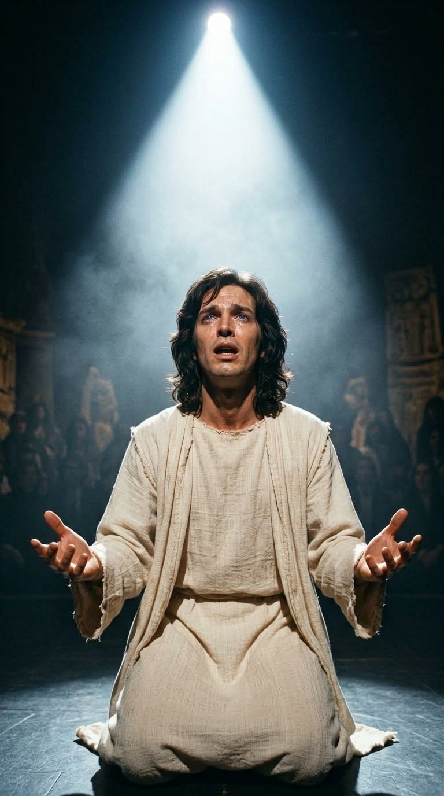
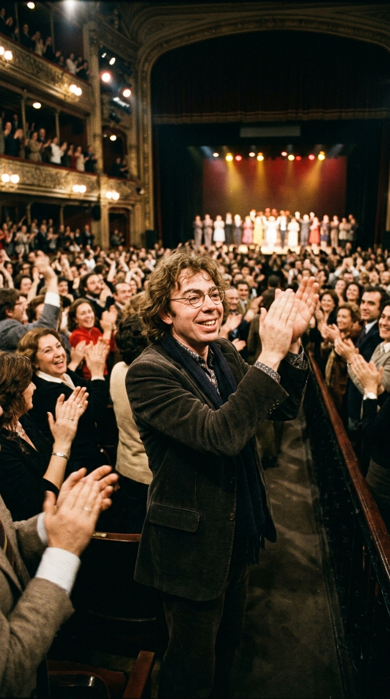

# ✝️ El Desafío de Jesucristo Superstar: Cuando Camilo Sesto Desafió a una Dictadura
### *Cómo el ídolo del pop hispano arriesgó toda su fortuna personal, soportó amenazas de bomba y piquetes de ultraderecha, y desató con «Getsemaní» el mayor do sobreagudo de la historia del teatro español.*

---

**Por la redacción de Acordes Ocultos**  
*Tiempo de lectura estimado: 8 minutos*

---

### Prólogo: El West End londinense y la chispa de la rebelión (1974)

En la primavera de 1974, **Camilo Sesto** era un rey sin corona disputada en el firmamento hispanoamericano. Con veintiocho años, una fisonomía esculpida para la cámara, ojos de un azul translúcido y una tesitura vocal prodigiosa de tres octavas y media, el cantante alicantino despachaba millones de copias de baladas orquestales como *«Algo de mí»* y *«Amor... amar»*. Su vida transcurría entre hoteles de lujo, estadios abarrotados y giras interminables por América.

Sin embargo, detrás del smoking y la sonrisa complaciente del galán de masas, latía un espíritu inquieto que se sentía aprisionado por el molde de la industria.

Durante una escapada privada a Londres, Camilo asistió al Palace Theatre en el West End para presenciar **«Jesus Christ Superstar»**, la ópera rock revolucionaria compuesta por **Andrew Lloyd Webber** con letras de **Tim Rice**. Lo que presenció en aquella sala británica lo atravesó como un rayo: la pasión de Cristo narrada desde la perspectiva humana de Judas Iscariote, impulsada por baterías atronadoras, guitarras eléctricas saturadas y un dramatismo visceral que rompía con toda la tradición litúrgica.

Al descender el telón, Camilo tomó una decisión que sus apoderados calificaron de suicidio profesional: **iba a traer la ópera rock a Madrid y se pondría en la piel de Jesús**.

*Londres, 1974: Camilo Sesto en las butacas del West End, maravillado por la fuerza vanguardista de la ópera rock británica.*

---

### Acto I: Doce millones de pesetas sobre la mesa (1975)

La España de principios de 1975 no era Londres ni Broadway. El régimen del general Francisco Franco transitaba sus últimos meses en medio de una atmósfera opresiva y tensa. La censura oficial vigilaba con lupa cualquier expresión artística que pudiera rozar la moral nacionalcatólica, y la Iglesia más integrista ejercía un poder asfixiante sobre los espectáculos públicos.

Camilo comenzó a convocar reuniones con los principales empresarios teatrales de Madrid y Barcelona. La respuesta fue unánime y rotunda:
> *«Camilo, estás loco. Te van a cerrar el teatro, vas a perder tu carrera de baladista y la policía nos va a meter en la cárcel a todos. Esta obra es blasfema»*.

Ningún inversor puso una sola peseta. Fue en ese momento cuando el ídolo pop demostró que su ambición artística no admitía cobardías. Camilo acudió a su entidad bancaria, liquidó sus cuentas de ahorro, hipotecó parte de su patrimonio y puso sobre la mesa **doce millones de pesetas** de su propio bolsillo —una auténtica fortuna para la época, equivalente a cientos de miles de euros actuales—.

Se convirtió en productor, director musical en la sombra y traductor del libreto junto a su equipo. No buscaba enriquecerse; buscaba sacudir la conciencia cultural de un país que se asfixiaba.

*Madrid, 1975: Camilo Sesto en el despacho donde arriesgó su patrimonio personal ante la negativa del empresariado teatral.*

---

### Acto II: Piquetes, cruces y amenazas de bomba

El anuncio del estreno de *«Jesucristo Superstar»* en el **Teatro Alcalá-Palace** de Madrid encendió la furia de los sectores más reaccionarios. Grupos de extrema derecha como los Guerrilleros de Cristo Rey y cofradías ultracatólicas comenzaron una campaña sistemática de acoso y derribo.

Las cartas de amenaza llegaban a diario a las oficinas del teatro: amenazas de volar el escenario con explosivos, piquetes diarios con crucifijos y pancartas al grito de *«¡Blasfemia!»* y *«¡España católica no se rinde!»*, e intentos reiterados de boicotear los permisos municipales de apertura. La policía armada tuvo que apostar furgones antidisturbios en la calle Alcalá de forma permanente.

Dentro del teatro, sin embargo, el ambiente era un hervidero de creatividad y camaradería. Camilo había reunido a un elenco estelar: la cantante dominicana **Ángela Carrasco** en el papel de María Magdalena, y el músico de rock canario **Teddy Bautista** (líder de Los Canarios) encarnando a un Judas de fuerza volcánica y adaptando los arreglos orquestales.

Los ensayos eran maratonianos. Camilo cuidaba cada inflexión vocal, cada acorde de sintetizador Moog y cada foco de luz. Estaba decidido a ofrecer una producción con el mismo estándar técnico que en Nueva York o Londres.

*Octubre de 1975: Camilo Sesto junto a una joven Ángela Carrasco y Teddy Bautista ensayando las partituras al piano entre bambalinas.*

*Calle Alcalá, otoño de 1975: Piquetes ultraconservadores intentando frenar el estreno frente a los furgones policiales.*

---

### Acto III: La noche del 6 de noviembre y el do sobreagudo

El **6 de noviembre de 1975**, Madrid vivió una noche irrepetible. Con Franco ya en agonía médica en su lecho del Hospital La Paz, las inmediaciones del Alcalá-Palace eran un mar de abrigos de piel, bufandas y miradas de expectación. El miedo al atentado no impidió que las entradas estuvieran agotadas con semanas de antelación.

Cuando se apagaron las luces y sonó la obertura de metales y guitarras eléctricas, la tensión se podía cortar con un bisturí.

El momento cumbre llegó en la segunda mitad de la obra. En el escenario, despojado de artificios, un Camilo Sesto descalzo y envuelto en una túnica blanca de lino crudo cayó de rodillas para interpretar **«Getsemaní (Oración del Huerto)»**. La plegaria del hombre que dialoga con su destino y le pregunta a Dios por qué debe morir.

La interpretación fue de una intensidad aterradora. Su voz pasó del susurro íntimo y quebrado al rugido desgarrado. En el clímax del tema, Camilo acometió el **do sobreagudo (C5 / D5 sostenido en voz mixta y falsete con cuerpo)** con una limpieza, potencia y vibrato tan estratosféricos que el teatro entero contuvo la respiración. Gotas de sudor y lágrimas surcaban su rostro. Al extinguirse el último compás de la orquesta, la sala quedó sumida en un silencio sepulcral de cinco segundos, como si el público hubiera asistido a una revelación sagrada.

De pronto, el Alcalá-Palace estalló en un rugido unánime. Los espectadores saltaron de sus butacas, llorando y aplaudiendo a rabiar en una ovación que superó los quince minutos.

*6 de noviembre de 1975: Camilo Sesto de rodillas en el escenario del Alcalá-Palace clavando el do sobreagudo de «Getsemaní».*

---

### Acto IV: La bendición de Andrew Lloyd Webber

Entre el público de una de aquellas primeras funciones históricas se encontraba un espectador de excepción que había viajado de incógnito desde Londres: el propio **Andrew Lloyd Webber**.

El compositor británico, célebre por su severidad crítica y celoso custodio de sus partituras, quedó absolutamente fascinado por la fuerza escénica de Camilo y la calidez lírica que el español le había aportado al libreto. Al finalizar la función, Lloyd Webber se dirigió a los camerinos, abrazó efusivamente a Camilo y realizó una declaración que la prensa internacional recogió de inmediato:
> *«De todas las producciones que se han realizado en el mundo, incluida la original de Broadway y la de Londres, la de Camilo Sesto en Madrid es la más auténtica, conmovedora y perfecta que jamás he visto»*.

La obra se mantuvo en cartelera durante meses con lleno diario, atrayendo a más de 300.000 espectadores y abriendo de par en par las compuertas de la modernidad escénica en España.

*Noviembre de 1975: Andrew Lloyd Webber en pie aplaudiendo la producción de Camilo Sesto en Madrid.*

---

### Epílogo: El precio de la libertad artística

*«Jesucristo Superstar»* marcó un antes y un después en la historia del espectáculo en España. Demostró que un artista pop comercial podía tener la valentía de arriesgar su propia fortuna por un ideal estético, y actuó como un heraldo poético de la libertad en las mismas semanas en que la dictadura de cuarenta años se extinguía para siempre.

El álbum doble con la banda sonora original batió récords de ventas y consagró a Ángela Carrasco como estrella continental. Para Camilo Sesto, la interpretación de Jesús no fue un simple papel: fue la cima técnica y espiritual de su garganta, un milagro irrepetible donde el talento puro derrotó al miedo y a la censura.

Hoy, más de medio siglo después, cuando suena el grito inicial de *«Getsemaní»*, sigue estremeciendo la certeza de que hubo una noche en que un joven cantante español se jugó el destino para regalarnos una obra maestra inmortal.

---

### 📚 Fuentes y Archivo Documental

1. **Sesto, Camilo** (1985–2010). Declaraciones biográficas y entrevistas de archivo en Televisión Española (*«Informe Semanal»* y *«Lazos de Sangre»*) sobre la financiación y el estreno de *Jesucristo Superstar*.
2. **Carrasco, Ángela & Bautista, Teddy** (2015–2020). Testimonios retrospectivos sobre los ensayos, la dirección musical y el impacto social del estreno en el Teatro Alcalá-Palace.
3. **Lloyd Webber, Andrew** (1975). Declaraciones a la prensa británica y española tras su visita a Madrid: *«Camilo Sesto is the best Jesus Christ of all time»*.
4. **Hemeroteca Diario ABC, Blanco y Negro y La Vanguardia** (Ediciones del 7 al 15 de noviembre de 1975). Crónicas culturales y cobertura policial de los piquetes ultraderechistas frente al Teatro Alcalá-Palace.
5. **Ariola Eurodisc** (1975). *Créditos discográficos y libreto oficial del doble álbum «Jesucristo Superstar»*, con producción general de Camilo Blanes Cortés.
