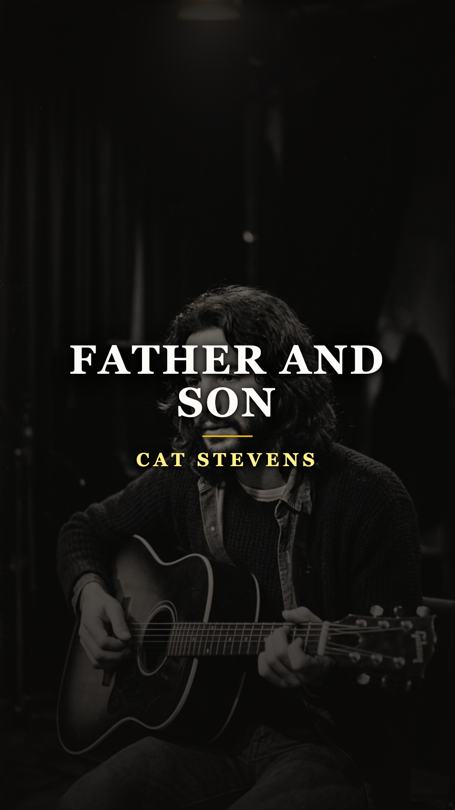
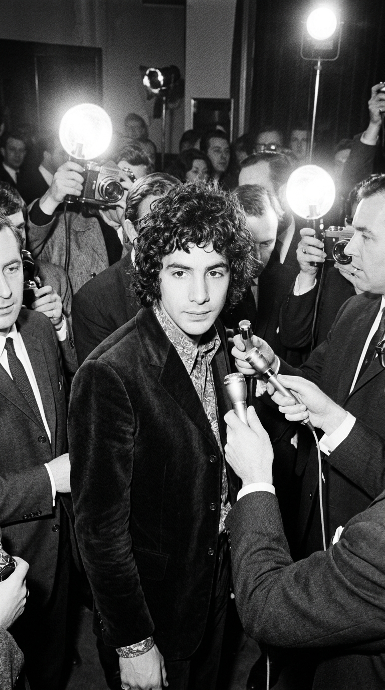
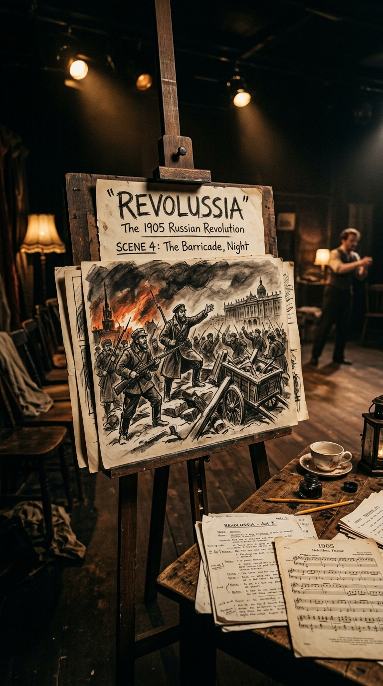
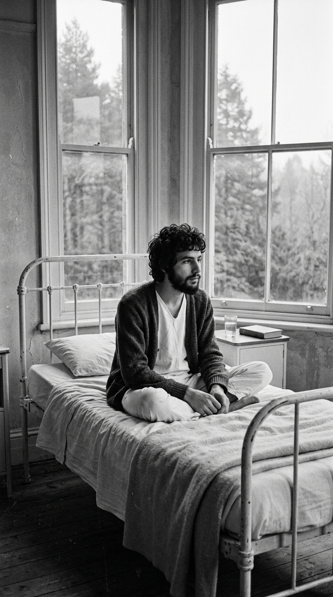
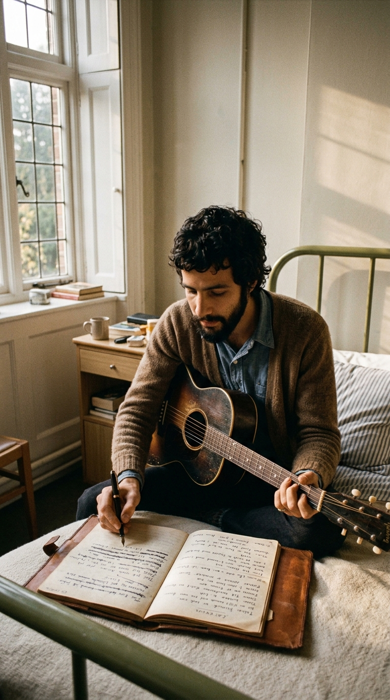
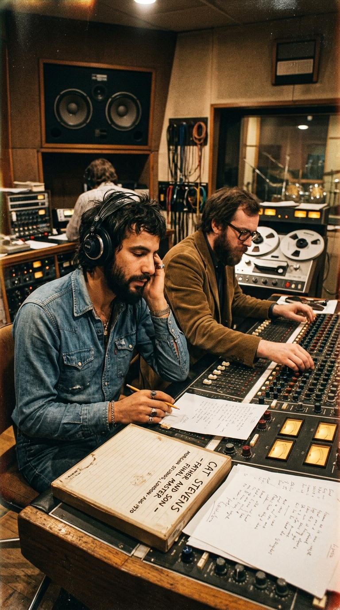
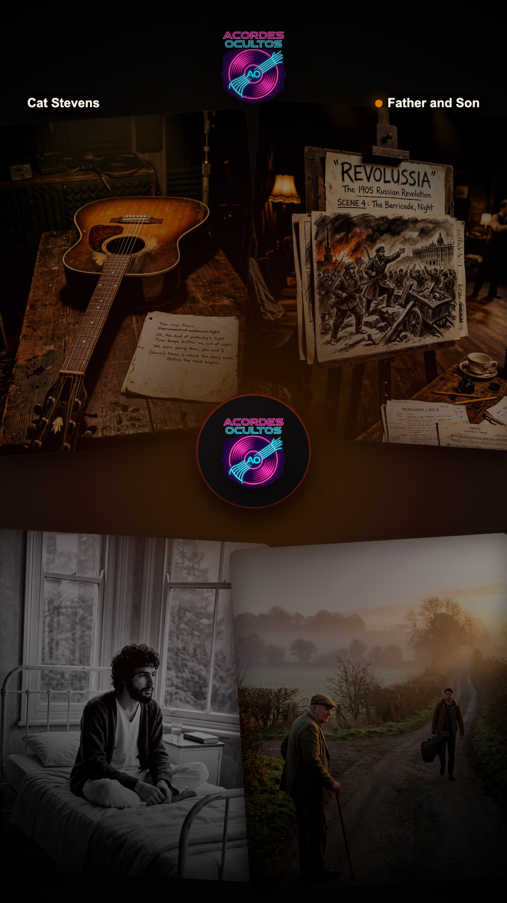

# 🎸 El Fusil Enterrado en la Nieve: La Balada que Salvó a un Hombre de la Muerte
### *La intrahistoria de «Father and Son»: el musical cancelado sobre la Revolución Rusa de 1905, el colapso pulmonar de Cat Stevens a los veinte años y los dos micrófonos que inmortalizaron el abismo entre dos almas.*

---

**Por la redacción de Acordes Ocultos**  
*Tiempo de lectura estimado: 6 minutos*

---

### Prólogo: El engaño de la sobremesa burguesa

Durante más de medio siglo, millones de padres e hijos en los cinco continentes se han sentado frente a un tocadiscos, con los ojos empañados y un nudo en la garganta, convencidos de que escuchaban la crónica doméstica definitiva: una sala de estar británica a media tarde, una taza de té sobre la mesa y dos hombres intentando salvar una distancia insalvable.

El anciano, moldeado por el frío de la prudencia, aconseja calma: *«No es momento de hacer cambios, relájate, tómalo con calma... aún eres joven, ese es tu error; hay tanto que tienes que aprender...»*. El muchacho, devorado por la prisa de su propia sangre, responde con la mirada clavada en la puerta abierta: *«Desde el momento en que pude hablar se me ordenó escuchar... Ahora hay una salida y sé que tengo que marcharme»*.

Es una de las conversaciones más universales y conmovedoras registradas jamás por la música popular. Sin embargo, encierra un secreto celosamente sepultado bajo las capas del mito. Aquel diálogo no nació en ninguna cocina londinense, ni trataba sobre la emancipación juvenil en los años setenta. 

En su concepción original, el muchacho no estaba haciendo las maletas para marcharse a la universidad o buscar un empleo en la gran ciudad: **estaba tomando un fusil de cerrojo para ir a morir a las barricadas de la Revolución Rusa de 1905**, y su padre sabía que, si cruzaba el umbral de la cabaña, jamás volvería con vida.

Para que aquella marcha fúnebre entre la nieve bolchevique se transformara en la obra cumbre de Cat Stevens, el destino tuvo que asestar un golpe demoledor: un pulmón destrozado, litros de sangre sobre el pavimento y un año entero de silencio en las fronteras de la muerte.

---

### Acto I: El muñeco de cuerda de Carnaby Street

Para entender la desesperación que engendró la canción, es preciso viajar al Londres de 1967. Steven Demetre Georgiou, hijo de un inmigrante grecochipriota que regentaba el restaurante *Moulin Rouge* en Shaftesbury Avenue, era entonces un muchacho de apenas diecinueve años al que la maquinaria discográfica había rebautizado con un apodo pegadizo: **Cat Stevens**.

*Londres, 1967: El joven Cat Stevens rodeado por la prensa y la industria del pop antes del colapso.*

Bajo la tutela del productor Mike Hurst y el sello *Deram Records*, el adolescente fue arrojado a la vorágine del *Swinging London*. Con elegantes trajes de terciopelo hechos a medida, camisas con chorreras y peinados a la última moda, encadenó sencillos exitosos como *«I Love My Dog»* y *«Matthew and Son»*. 

Pero detrás de los destellos de magnesio y los desmayos de las adolescentes, Steven sentía que se asfixiaba. Sus composiciones más introspectivas y desnudas eran ahogadas sistemáticamente por arreglos orquestales empalagosos, metales estruendosos y coros infantiles. La industria quería un muñeco pop de consumo rápido; él, un muchacho educado en el bullicio de los callejones del West End y lector voraz de poesía, buscaba desesperadamente una verdad artística que nadie parecía dispuesto a permitirle.

---

### Acto II: «Revolussia» y la sangre en la trinchera

A comienzos de 1968, buscando escapar de la tiranía del pop prefabricado, Stevens se asoció con el célebre actor y dramaturgo británico **Nigel Hawthorne** para un proyecto clandestino y fuera de toda convención comercial: la composición de un musical teatral titulado provisionalmente **«Revolussia»**.

La obra situaba su drama en el San Petersburgo de 1905, durante los prolegómenos de la revolución campesina y obrera contra la tiranía del zar Nicolás II. 

*Bocetos originales de escenografía para «Revolussia», el musical histórico que jamás llegó a las tablas.*

La trama central giraba en torno a un conflicto generacional teñido de pólvora. Un joven agricultor de una provincia remota se empapa de las ideas revolucionarias de la capital y decide unirse a los insurrectos armados. Su padre, un anciano golpeado por hambrunas e inviernos implacables, entiende el mundo desde la mera supervivencia biológica: agachar la cabeza, trabajar la tierra y conservar el aliento.

Cat Stevens se encerró a escribir el tema culminante de la obra. En su mente resonaba el choque ideológico:
> 📝 **EL TEXTO ORIGINAL DE LA TRINCHERA:** *«El diálogo no admitía metáforas románticas. El padre no le decía 'busca una chica y cásate' para invitarlo a la felicidad burguesa, sino para salvarle el pellejo: 'Cásate, quédate en la granja, trabaja... no vayas a la nieve a que la caballería cosaca te atraviese el pecho con una lanza'. Y la respuesta del hijo no era rebeldía adolescente; era el vértigo desgarrador de quien acepta que su causa vale más que su propia vida: 'Away, away, I know I have to make this choice alone'»*.

El libreto estaba listo y los ensayos comenzaban a programarse. Pero la historia tenía preparado un desenlace mucho más oscuro y terrenal.

---

### Acto III: La habitación blanca de Midhurst

El ritmo frenético de grabaciones nocturnas, giras extenuantes, una alimentación precaria a base de cafés de máquina y un consumo desmedido de cigarrillos cobraron su factura definitiva en el invierno de 1968. 

Durante una función en el norte de Inglaterra, con apenas veinte años, Stevens se tambaleó en el escenario. Al salir al callejón húmedo del teatro, un ataque de tos convulsa lo dobló en dos: **escupió coágulos densos de sangre roja sobre la nieve**.

Fue trasladado de urgencia a Londres. Las radiografías revelaron una pesadilla médica: padecía una **tuberculosis cavitaria avanzada** y su pulmón izquierdo había colapsado parcialmente. Los médicos fueron inflexibles: si no ingresaba de inmediato en un régimen de aislamiento absoluto, le quedaban pocas semanas de vida. Además, le advirtieron que, incluso si sobrevivía, el daño pulmonar severo probablemente le impediría volver a cantar.

El proyecto de *«Revolussia»* fue cancelado y enterrado en el acto.

*Midhurst, 1969: Cat Stevens convaleciente tras meses de aislamiento por tuberculosis.*

Stevens fue internado en el sanatorio **King Edward VII en Midhurst**, en el corazón boscoso de Sussex. Pasó cerca de un año recluido entre paredes encaladas, oliendo a desinfectante y contemplando la lluvia golpear contra los ventanales góticos. 

Aquel encierro forzoso fue, paradójicamente, el milagro de su vida. Privado del ruido del mundo, Cat Stevens leyó textos de budismo, mística sufí, filosofía oriental y astrología. Dejó de afeitarse, permitió que su cabello oscuro cayera en rizos desordenados y vio cómo la máscara del dandi pop se desintegraba en el espejo. 

*La metamorfosis: Con una guitarra de salón en la cama del hospital, el fusil bolchevique dio paso al diálogo universal.*

Una enfermera piadosa le permitió ingresar una pequeña guitarra acústica de salón. En la soledad de su cama, Stevens abrió su viejo cuaderno de notas de *«Revolussia»*. Tachó con tinta negra las referencias a los soldados, al zar, a las trincheras y al fango. Y entonces se produjo la revelación: **aquel joven ruso que no soportaba quedarse en la granja era él mismo**. 

Su propia lucha no era contra los cosacos, sino contra la jaula de oro de la fama y la vida que otros habían diseñado para él. Había estado a las puertas de la muerte para comprender que la única rebelión legítima es la que uno emprende para salvar su propia alma.

---

### Acto IV: Dos micrófonos para dos generaciones

En el verano de 1970, renacido físicamente y con una voz más áspera, honda y madura fruto de las cicatrices en su aparato respiratorio, Cat Stevens entró a los estudios **Morgan** de Willesden, al noroeste de Londres. Lo acompañaban su guitarrista acústico inseparable, Alun Davies, y el productor **Paul Samwell-Smith** (ex bajista de The Yardbirds).

El álbum que estaban gestando se llamaría *«Tea for the Tillerman»*. Cuando llegó el momento de registrar *«Father and Son»*, Stevens descartó la idea de contratar a un cantante mayor para que interpretara al padre. Quería que el abismo entre ambos mundos naciera de su propia garganta.

*Morgan Studios, agosto de 1970: Dos micrófonos Neumann a distinta altura para capturar la doble tesitura.*

Para lograrlo, ideó un artificio técnico magistral: colocó en la cabina de madera **dos micrófonos Neumann de válvulas a diferente altura**:
* Para las estrofas del **Padre**, se inclinaba hacia el micrófono inferior y cantaba en un registro grave de barítono, casi susurrado, relajando las cuerdas vocales para transmitir el cansancio, la calma y el miedo protector de quien ya ha vivido demasiado.
* Para los versos del **Hijo**, se erguía hacia el micrófono superior, proyectando la voz en un registro de tenor agudo y desgarrado, casi al borde del quiebre, encarnando la furia impotente de la juventud que necesita romper el cordón umbilical.

Al fondo, la guitarra acústica de Davies marcaba un compás hipnótico de vals terrenal, mientras el piano de Stevens aportaba la solemnidad de un himno sacrosanto. 

*La sesión definitiva: Las cintas de 2 pulgadas donde quedó inmortalizada una de las cumbres del folk rock.*

Cuando la cinta de dos pulgadas se detuvo en el magnetófono de la sala de control, el silencio en el estudio era sepulcral. Habían creado algo que trascendía a la música pop: un espejo donde cualquier ser humano sobre la faz de la Tierra se vería reflejado por los siglos venideros.

---

### Epílogo: Marcharse para no morir

*«Tea for the Tillerman»* vio la luz en noviembre de 1970. Impulsado por *«Father and Son»*, se convirtió de inmediato en un fenómeno colosal de ventas y crítica, catapultando a Cat Stevens al olimpo del folk internacional. 

La canción contenía una verdad tan pura y descarnada que ni el paso de las décadas ni las múltiples versiones (desde Boyzone hasta Johnny Cash) han logrado despojarla de su filo emocional. 

La paradoja final de Cat Stevens es que él mismo terminaría aplicando a rajatabla la lección de su propia canción. Pocos años después, tras rozar nuevamente la muerte en las olas del Pacífico en Malibú, cumplió su promesa de romper definitivamente con la industria que intentaba poseerlo: subastó sus guitarras, donó sus regalías, adoptó el nombre de **Yusuf Islam** y se marchó en silencio, eligiendo su propio destino.

Porque, tal como aprendió en aquella cama de hospital con un pulmón desgarrado, la tragedia más grande de un ser humano no es empuñar las armas ni arriesgarse a caer en el camino; la verdadera muerte consiste en quedarse inmóvil en el puerto seguro, viviendo una vida que jamás nos perteneció.

---

### 💬 La Pregunta para Nuestra Comunidad

La grandeza de *«Father and Son»* radica en que nos coloca frente a dos verdades incompatibles: la prudencia del padre que solo desea proteger la vida, y la urgencia del hijo que necesita encontrar su propia voz aunque deba pagar el precio de la caída.

**¿De qué lado te encontraste tú en tu momento más decisivo? ¿Tuviste alguna vez que romper con los consejos de quienes más te amaban para no morir en vida?**

*Te leemos en los comentarios de nuestra publicación semanal.*

---

### 📚 Fuentes y Archivo Documental

Para la rigurosa reconstrucción histórica, biográfica y técnica de esta crónica, la redacción de *Acordes Ocultos* ha consultado y contrastado las siguientes fuentes documentales:

1. **Stevens, Yusuf / Cat** (2025). *Cat: On the Road to Findout* (Autobiografía oficial). HarperCollins, Londres.
2. **Charlesworth, Chris** (1984). *Cat Stevens: The Complete Illustrated Biography*. Proteus Books, Londres. Capítulos dedicados a la hospitalización en el King Edward VII Hospital de Midhurst, el retiro espiritual y la concepción de *Tea for the Tillerman*.
3. **Samwell-Smith, Paul** (2000–2010). Entrevistas retrospectivas con el productor sobre la ingeniería acústica y las sesiones en Morgan Studios (Londres) en *Sound on Sound* y *Mojo Magazine* (Edición especial *Tea for the Tillerman*).
4. **Island Records & Island Music Publishing Archive.** Manuscritos originales, partituras y sinopsis preliminares del proyecto musical inédito *«Revolussia»* (1969–1970).
5. **Davies, Alun.** Testimonios y archivos sonoros sobre el ensamblaje de arreglos de guitarra acústica y contrapuntos vocales en Morgan Studios para el catálogo de Island Records (ILPS 9135).
6. **Hemeroteca de Prensa Musical Británica (1970–1971).** Revistas *Melody Maker*, *New Musical Express (NME)* y *Record Mirror*: reseñas de lanzamiento, crónicas de conciertos acústicos y entrevistas de la época.

---

