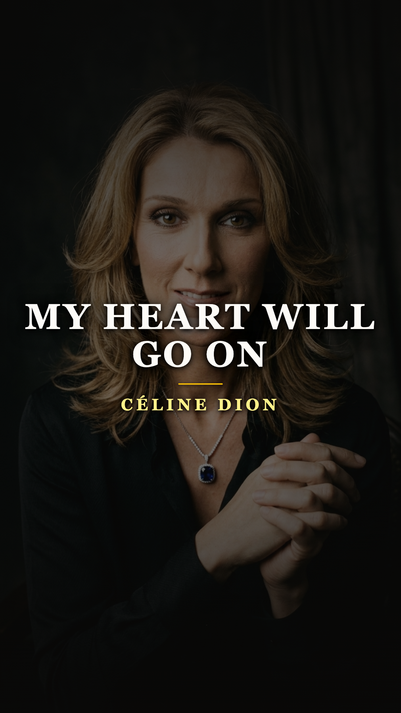
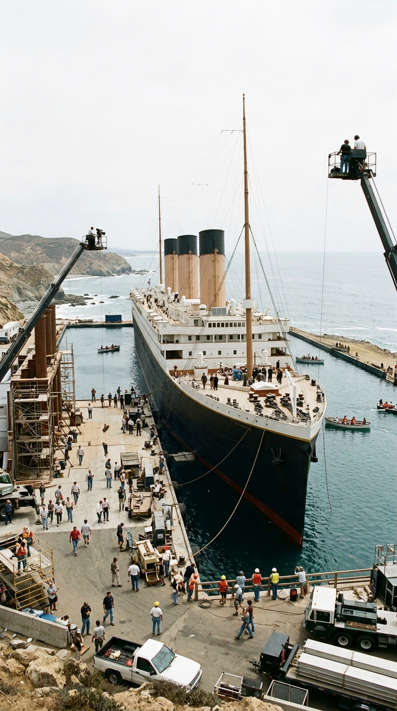
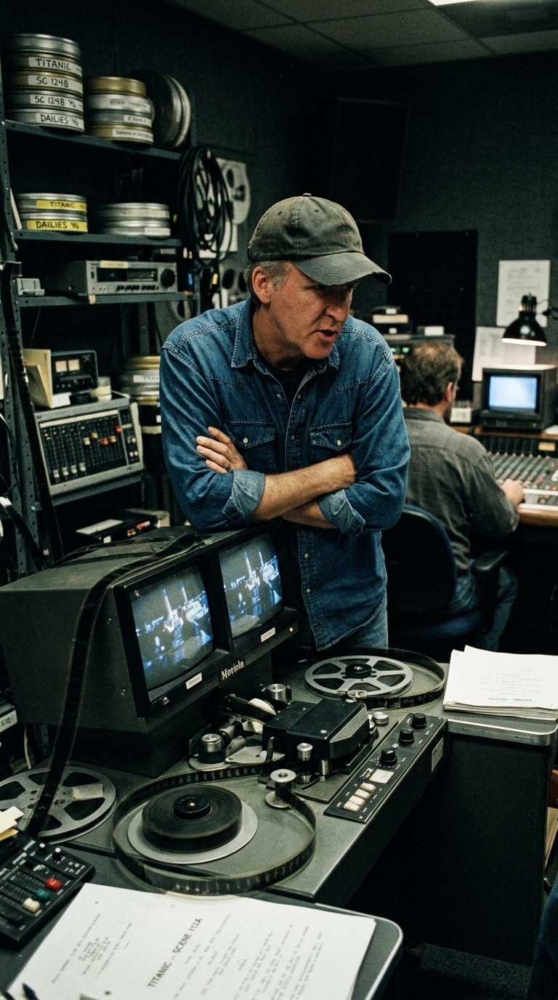
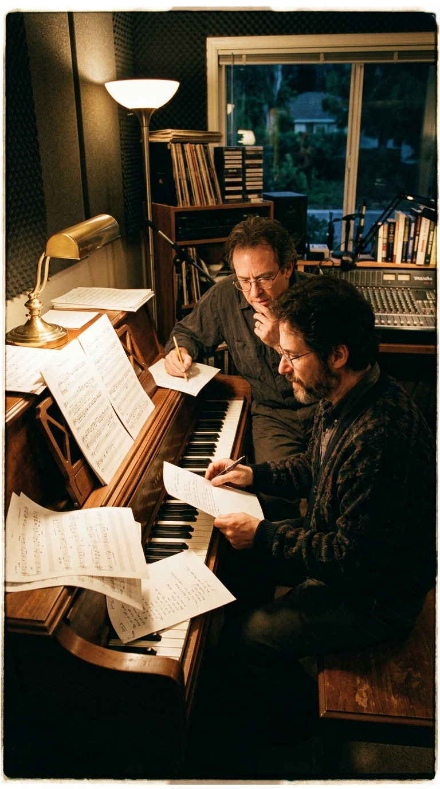
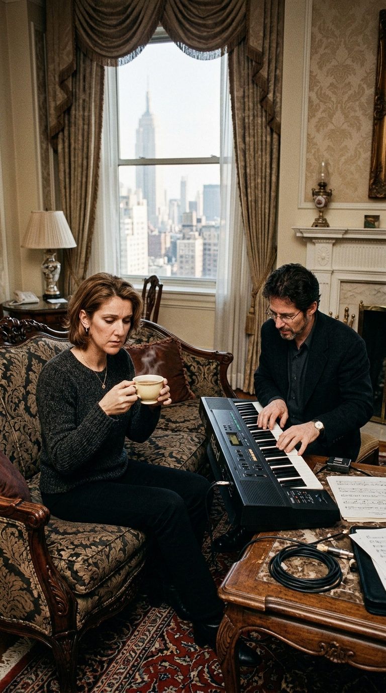
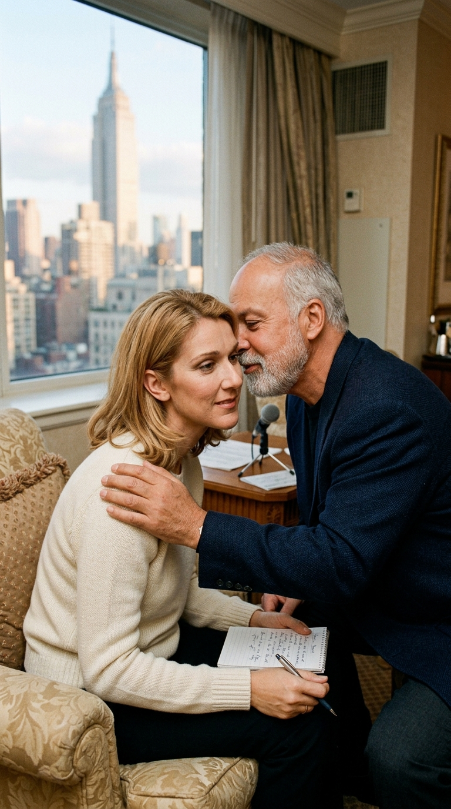
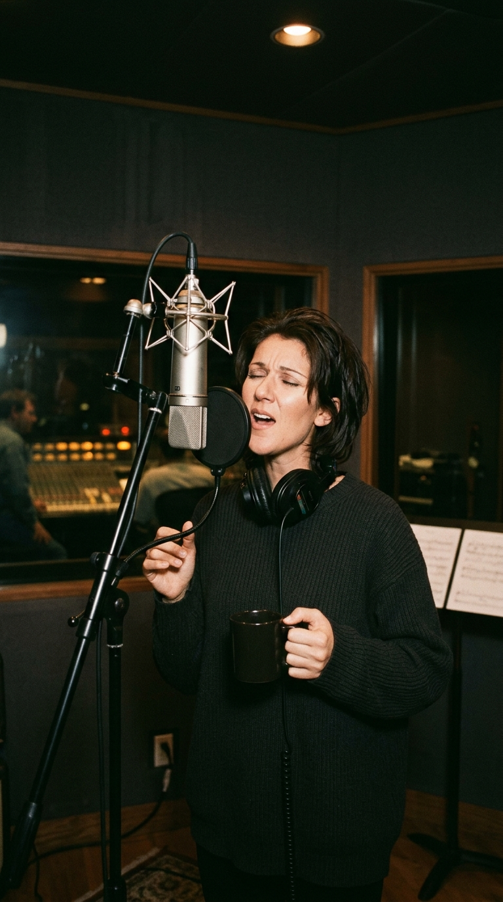
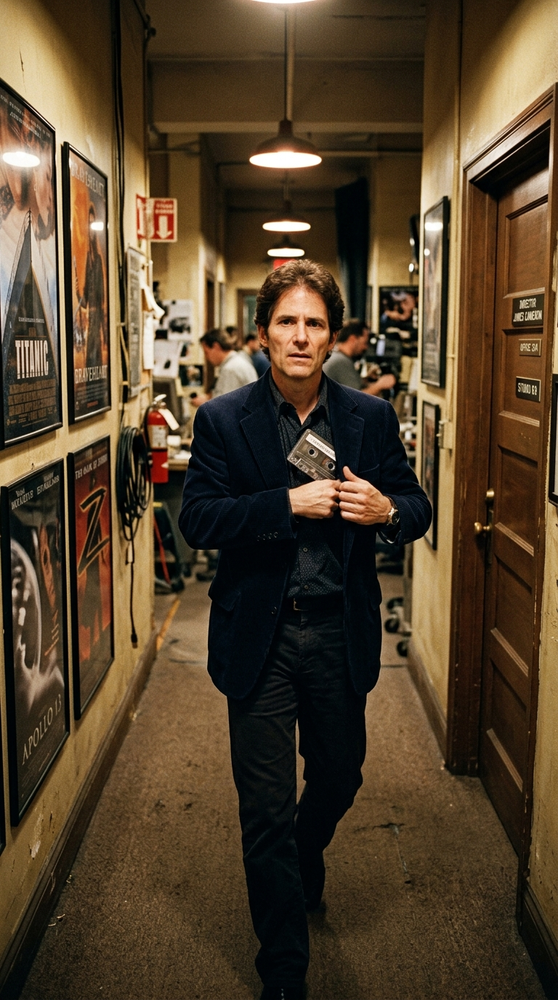
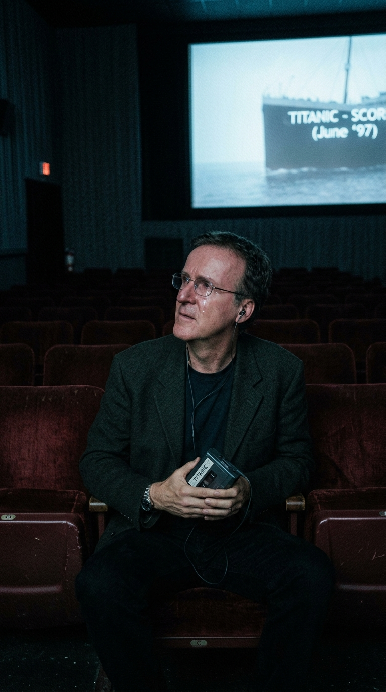
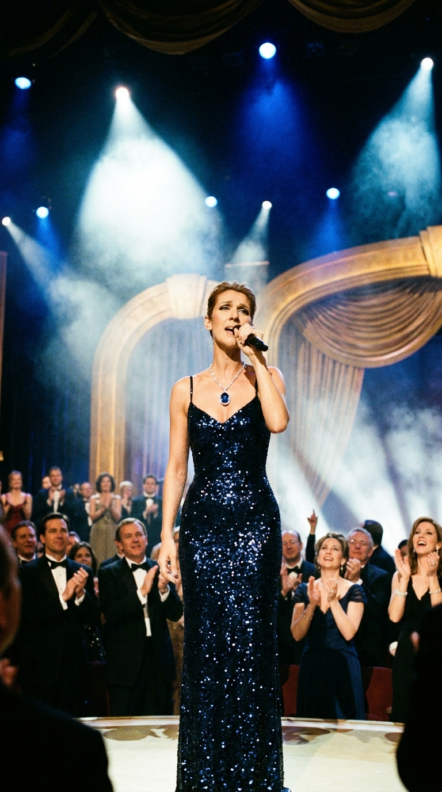

# 🚢 La Maqueta Prohibida: Céline Dion, el Veto de James Cameron y la Toma Única que Salvó a Titanic
### *Cómo el director más temido de Hollywood prohibió las baladas comerciales, James Horner conspiró en secreto y una cantante con dolores menstruales desató frente a un café negro la grabación clandestina más exitosa de todos los tiempos.*

---

**Por la redacción de Acordes Ocultos**  
*Tiempo de lectura estimado: 8 minutos*

---

### Prólogo: El naufragio financiero en las costas de Rosarito

A finales de 1996, en las costas áridas de Rosarito, en el estado mexicano de Baja California, la industria cinematográfica estadounidense presenciaba lo que todos los analistas de Wall Street y los periódicos de Los Ángeles vaticinaban como el mayor desastre económico de la historia del cine. Sobre un estanque artificial de sesenta y cuatro millones de litros de agua marina se erigía una réplica a escala casi real del **RMS Titanic**, una mole de acero y madera de doscientos cuarenta metros de eslora que costaba decenas de miles de dólares por cada hora de retraso.

*Otoño de 1996: El monumental plató de Titanic en Baja California. Entre retrasos y sobrecostes millonarios, la prensa vaticinaba la mayor quiebra de Hollywood.*

El presupuesto inicial de cien millones de dólares se había pulverizado, trepando hasta la cifra astronómica e inédita de **doscientos millones de dólares**. Los dos grandes estudios involucrados, 20th Century Fox y Paramount Pictures, entraron en pánico. Los ejecutivos exigían recortes drásticos de metraje y la prensa especializada se burlaba abiertamente de la megalomanía del proyecto, comparándolo con la catástrofe de *Cleopatra* de 1963.

En el epicentro de aquel caos se encontraba el director **James Cameron**. Célebre por su perfeccionismo implacable y su temperamento volcánico, Cameron rodaba jornadas maratónicas de dieciséis horas con el agua hasta la cintura, sometiendo al elenco y a los técnicos a una presión física y psicológica extrema. Kate Winslet sufrió hipotermia, varios especialistas terminaron hospitalizados y el ambiente en el plató era de un agotamiento rayano en el motín.

Bajo semejante tormenta de fuego corporativo, Cameron se aferró a una sola certeza: su película no sería un producto prefabricado de marketing. Sería una tragedia histórica implacable, solemne y cruda. Y para garantizarlo, impuso una directriz innegociable a todo su equipo de producción.

---

### Acto I: «¿Acaso pondrías pop al final de Schindler?»: El veto de James Cameron

A comienzos de 1997, mientras se iniciaba el montaje de las tres horas y cuarto de metraje, Cameron se reunió con el compositor estadounidense **James Horner**, a quien había contratado para crear la banda sonora orquestal tras haber colaborado previamente en *Aliens* (1986). 

La industria cinematográfica de los años noventa vivía obsesionada con un modelo comercial muy específico: insertar una balada pop contemporánea en los créditos finales para rotar en MTV, copar las emisoras de radio y vender millones de discos compactos de la banda sonora (como había ocurrido con Whitney Houston en *El Guardaespaldas* o Bryan Adams en *Robin Hood*). Los directivos de Sony Music y Fox acariciaban la idea de rematar *Titanic* con un dueto comercial.

Cameron rechazó la propuesta con un desprecio categórico. En una acalorada conversación en la sala de edición, el cineasta miró a Horner y sentenció con sarcasmo:

> —*«¿Acaso pondrías una canción pop comercial al final de La lista de Schindler? Mi película no es un melodrama barato de centro comercial ni un vehículo publicitario para vender cedés. La historia termina con mil quinientas personas congeladas en el fondo del océano. Una canción pop arruinaría la gravedad de la tragedia. La música de los créditos finales será exclusivamente orquestal y coral, sin una sola palabra en inglés»*.

*Principios de 1997: James Cameron en la mesa de edición, vetando terminantemente cualquier canción pop comercial para los créditos de Titanic.*

Horner asintió con cortesía en público, pero en privado albergaba una convicción artística radicalmente opuesta. Tras contemplar los primeros pases del montaje, el compositor comprendió algo que la mirada técnica y fría de Cameron no alcanzaba a vislumbrar: después de tres horas de catástrofe, terror y desgarro humano con el hundimiento del buque y la muerte de Jack Dawson, el público saldría de las salas de cine en un estado de shock y pesadumbre tan desolador que necesitaría un bálsamo emocional. 

Una canción con letra —una voz íntima que le hablara al corazón del espectador y le recordara que el amor verdadero sobrevive a la muerte física— era el único puente capaz de transformar el trauma colectivo en catarsis poética.

Horner decidió jugarse su reputación profesional y desobedecer la orden directa del director más temido de Hollywood.

---

### Acto II: La conspiración al piano en Calabasas

En el más absoluto de los secretos, sin comunicárselo a los estudios ni a Cameron, James Horner convocó a su casa de Calabasas, en las colinas de California, al veterano letrista **Will Jennings** (galardonado con el Oscar por *«Up Where We Belong»* de *Oficial y Caballero* y coautor de la desgarradora *«Tears in Heaven»* de Eric Clapton).

*Calabasas, California: En la penumbra de su estudio, James Horner y Will Jennings dan vida a los acordes secretos de la melodía.*

Sentados junto a un piano de cola en la penumbra del salón, Horner comenzó a tocar los acordes de la melodía que ya había comenzado a esbozar como tema instrumental para el personaje de Rose, utilizando las modulaciones del silbato tradicional irlandés (*tin whistle*). Le explicó a Jennings el espíritu de la película:
—*«Will, no quiero una típica canción de desamor adolescente. La letra debe hablar desde la perspectiva de una mujer de ciento un años que mira hacia atrás en el tiempo y siente que el hombre al que amó durante cuarenta y ocho horas sigue vivo en su memoria y en cada latido de su pecho»*.

Jennings comprendió el encargo de inmediato. En apenas unos días concibió unos versos limpios, universales y despojados de artificio:

> *«Every night in my dreams, I see you, I feel you  
> That is how I know you go on...  
> Far across the distance and spaces between us  
> You have come to show you go on...  
> Near, far, wherever you are  
> I believe that the heart does go on...»*

La melodía estaba lista. Sin embargo, Horner se enfrentaba a un obstáculo infranqueable: necesitaba una cantante con una potencia vocal sobrehumana capaz de defender la canción, pero que al mismo tiempo aceptara grabar una maqueta de forma clandestina sin ninguna garantía de que el tema fuera aprobado jamás por el director de la película.

Solo había un nombre en el planeta capaz de lograrlo: la canadiense **Céline Dion**.

---

### Acto III: La suite del Waldorf Astoria y la resistencia de Céline

En mayo de 1997, James Horner voló a Nueva York con una modesta cinta de casete en el bolsillo. Céline Dion se encontraba alojada en una suite del lujoso hotel **Waldorf Astoria** de Manhattan, en plena promoción internacional de su exitoso álbum *Falling into You*.

Horner se reunió con la cantante y su mánager y esposo, **René Angélil**. En la suite no había un piano acústico de concierto, por lo que Horner se sentó ante un pequeño teclado eléctrico portátil para interpretar la pieza. Para empeorar las cosas, el compositor no poseía una voz afinada: comenzó a cantar los versos con una entonación temblorosa, desafinando en los agudos y marcando los ritmos con los pies.

*Mayo de 1997, suite del Waldorf Astoria: Céline Dion escucha con escepticismo la maqueta casera, indispuesta y reacia a cantarla.*

La reacción de Céline fue de rechazo absoluto. Años más tarde, en su autobiografía *My Story, My Dream*, la cantante relató con total crudeza lo que pasó por su mente:

> *«Yo no quería cantar esa canción. Estaba exhausta tras meses de gira mundial, me sentía físicamente enferma, tenía intensos dolores menstruales y la cabeza a punto de estallarme. Además, ya había cantado canciones para películas como La Bella y la Bestia y Algo para recordar; no sentía la necesidad de hacer otra balada cinematográfica. Y cuando escuché a James Horner desafinar al piano, el tema me pareció aburrido, cursi y anticuado. Hice un gesto de fastidio a René para que rechazáramos la oferta educadamente»*.

Pero René Angélil, un hombre con un olfato comercial infalible que había guiado la carrera de Céline desde su adolescencia, percibió la chispa que se escondía debajo de las torpezas vocales de Horner. Angélil se acercó a su esposa, le puso una mano en el hombro y le susurró al oído en francés:

> —*«Haz solo una pequeña prueba de cortesía para James, mi amor. Vamos a un estudio, cantas una sola pasada rápida para dejarle una maqueta grabada y nos marchamos a descansar. Nadie la escuchará si no nos convence»*.

Céline resopló resignada y aceptó con una condición tajante:  
—*«De acuerdo. Pero la canto una sola vez. No habrá segundas tomas»*.

*La insistencia providencial: René Angélil le pide a Céline una única pasada de prueba por cortesía antes de regresar a casa.*

---

### Acto IV: La toma única en The Hit Factory y el casete en el bolsillo

A los pocos días, el equipo se dio cita en los legendarios estudios **The Hit Factory**, ubicados en la calle 54 Oeste de Manhattan. Céline entró en la cabina de grabación visiblemente indispuesta, abrigada con una chaqueta informal y combatiendo el malestar estomacal. Para despejar la garganta, pidió una taza de café solo con azúcar —algo que sus entrenadores vocales le tenían terminantemente prohibido antes de cantar, pues la cafeína deshidrata las cuerdas vocales—.

Horner colocó en los auriculares una pista base instrumental preliminar, con sintetizadores sencillos que simulaban las cuerdas y el timbre del silbato. La orquesta sinfónica aún no existía.

Céline se colocó frente al micrófono de condensador, cerró los ojos, dio un sorbo al café y comenzó a cantar.

*The Hit Factory, Nueva York: Frente al micrófono y con un café negro, Céline Dion desata una toma única que dejó atónita a la sala.*

Lo que sucedió en los cuatro minutos y medio siguientes pertenece a los anales del milagro musical. Céline no se reservó nada. Arrancó con una delicadeza casi susurrada, dibujando la nostalgia de Rose en las estrofas iniciales; pero al llegar a la modulación del puente y al estribillo cumbre (*«You're here, there's nothing I fear...»*), desató un torrente de voz de pecho, vibrato y resonancia que sacudió los cimientos de la sala.

Cuando el eco de la última nota se extinguió, el silencio en la sala de control era sepulcral. A través del cristal de la pecera, Céline observó a James Horner, al ingeniero de sonido y a René Angélil secándose las lágrimas de las mejillas. Nadie se atrevió a decir una palabra. Había sido **una sola toma directa**, de principio a fin, sin empalmes de cinta ni correcciones digitales de afinación (el software Auto-Tune acababa de nacer y no se utilizaba en aquella sesión).

Céline se quitó los auriculares, sonrió con timidez y dijo: *«Bueno, ya tenéis vuestra maqueta. Me voy al hotel»*.

Horner guardó el casete en el bolsillo interior de su americana como si fuera plutonio enriquecido. Regresó a Los Ángeles y durante cuatro semanas enteras cargó con la cinta a todas partes en el plató de montaje, esperando pacientemente el momento psicológico adecuado. Conocía el carácter volcánico de Cameron: si le ponía la canción en un mal día, el director la rechazaría al primer compás y la orden de destrucción sería irrevocable.

*Los Ángeles, junio de 1997: James Horner carga la cinta clandestina en su bolsillo durante un mes, buscando el instante de tregua.*

Un día de junio de 1997, tras una exitosa sesión de etalonaje donde Cameron se mostraba inusualmente relajado, Horner se acercó con cautela en una sala de proyección vacía:  
—*«Jim, sé lo que me dijiste sobre las canciones pop. Pero he grabado algo a título personal. Solo te pido que lo escuches una vez. Si después de oírlo me dices que no, la cinta irá a la basura y jamás volveré a pronunciar una palabra al respecto»*.

Cameron suspiró fastidiado, se cruzó de brazos y accedió: *«Ponlo»*.

Horner pulsó la tecla de reproducción. En la penumbra de la sala cinematográfica desierta, la voz desnuda y gigante de Céline Dion comenzó a llenar el espacio sobre los sintetizadores caseros.

*En la sala de proyección: James Cameron escucha la voz de Céline en la penumbra y, con lágrimas en los ojos, da su bendición.*

Al principio, Cameron mantuvo el ceño fruncido buscando algún defecto técnico que justificara su veto. Pero a medida que la canción avanzaba y la potencia de Dion alcanzaba el clímax, la coraza del cineasta se desmoronó por completo. Las lágrimas comenzaron a rodar por su rostro. Al apagarse la música, Cameron permaneció en silencio durante varios minutos antes de balbucear con voz entrecortada:  
—*«Dios mío, James... ¿no crees que la gente nos acusará de habernos vendido a lo comercial?»*.

Horner sonrió con calma:  
—*«Jim, no es comercio. Es el corazón de tu película»*.

Cameron se llevó una copia a su residencia para ponérsela a sus hijas y allegados. Todos rompieron a llorar de la misma manera. El veto había sido derrotado por la belleza de los hechos.

---

### Epílogo: El milagro que no admitió segundas tomas

Cuando la producción dio luz verde definitiva para incluir la canción en los créditos finales, James Horner convocó a una orquesta sinfónica completa para grabar los arreglos instrumentales definitivos. A continuación, llamaron a Céline Dion a los estudios de Los Ángeles para registrar la «versión oficial de estudio», pensando que una maqueta improvisada con dolores menstruales y café no podía ser el máster definitivo de una superproducción de doscientos millones de dólares.

Céline grabó varias tomas impecables. Los ingenieros ajustaron los compresores y probaron diferentes micrófonos. Sin embargo, al escuchar las pistas comparadas en la consola de mezclas, todos llegaron a la misma conclusión unánime: **ninguna toma posterior logró igualar el alma, la urgencia salvaje y la vulnerabilidad telúrica de aquella maqueta clandestina grabada en Nueva York**.

La pista vocal que se escucha en la escena final de *Titanic*, la que figura en la banda sonora oficial y la que se incluyó en el álbum de Céline Dion *Let's Talk About Love*, es exactamente **la maqueta original en una sola toma**. No hubo retoques.

*70ª edición de los Premios Oscar (marzo de 1998): Céline Dion canta con el Corazón del Océano ante 1.000 millones de personas, celebrando los 11 premios de la Academia.*

El estreno de *Titanic* en diciembre de 1997 pulverizó todos los récords de la historia de la humanidad. La película permaneció quince semanas consecutivas en el número uno de taquilla, recaudando más de **dos mil doscientos millones de dólares** y alzándose con **once premios Oscar de la Academia**, incluyendo el de **Mejor Canción Original** para Horner y Jennings.

Por su parte, **«My Heart Will Go On»** se convirtió en el mayor éxito en la carrera de Céline Dion y en uno de los sencillos más vendidos de todos los tiempos, con más de **dieciocho millones de copias físicas** despachadas, cuatro premios Grammy y el número uno en más de veinticinco naciones simultáneamente.

La canción que el director prohibió, que la cantante no quería interpretar y que el compositor tuvo que grabar a escondidas en una sola toma de cortesía, terminó convirtiéndose en el himno universal al amor indestructible. Nos recuerda, con la pureza inmarcesible de su melodía, que a veces las mayores obras de arte no nacen del cálculo milimétrico ni de la obediencia ciega, sino de la rebeldía íntima de quienes se atreven a escuchar los latidos del corazón cuando el resto del mundo solo ve números.

---

### 💬 El eco en la memoria

¿Dónde estabas cuando viste *Titanic* por primera vez y qué emoción te produce volver a escuchar la voz de Céline Dion sabiendo que se grabó en una sola toma clandestina que el director intentó prohibir? ¿Crees que la película habría tenido el mismo impacto emocional sin esta canción en los créditos finales? Déjanos tu testimonio en la conversación.

---

### 📚 Fuentes y Archivo Documental

* **Dion, Céline** (2000). *My Story, My Dream* (Autobiografía oficial). HarperCollins Publishers, Nueva York.
* **Parisi, Paula** (1998). *Titanic and the Making of James Cameron*. Newmarket Press, Nueva York. Crónica exhaustiva sobre la producción cinematográfica, el veto inicial a baladas pop y la inclusión de la maqueta final.
* **Marsh, Ed W. & Kirkland, Douglas** (1997). *James Cameron's Titanic*. HarperCollins, Nueva York. Documentación visual y notas de producción autorizadas.
* **The Hollywood Reporter** (Diciembre 2017). *Titanic 20th Anniversary: How 'My Heart Will Go On' Almost Never Happened*, reportaje de investigación por Tatiana Siegel con testimonios directos de Céline Dion, James Cameron y Tommy Mottola.
* **Horner, James** (1997–2012). Declaraciones y entrevistas en *CNN* (*Larry King Live*) y *Los Angeles Times* sobre la composición clandestina de la melodía con Will Jennings en el hotel de Nueva York.
* **Billboard Magazine** (Febrero-Marzo 1998). *Hot 100 Singles & Adult Contemporary Charts: The Worldwide Phenomenon of Let's Talk About Love*.
* **Academy of Motion Picture Arts and Sciences (AMPAS)** (1998). *70th Academy Awards Official Winners Records: Best Original Song*.
* **Sony Music / Columbia Records** (1997). *Créditos y notas técnicas del álbum Let's Talk About Love y Titanic: Music from the Motion Picture*: tomas vocales grabadas por Humberto Gatica en The Hit Factory (Nueva York).
