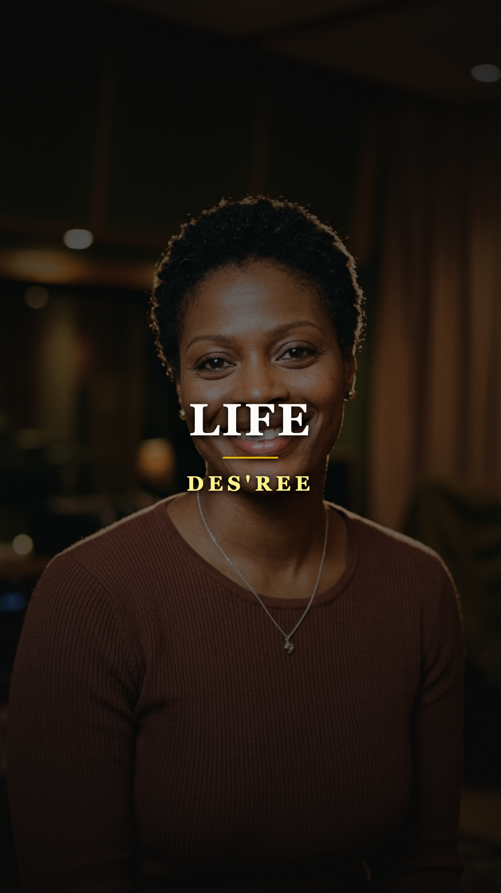
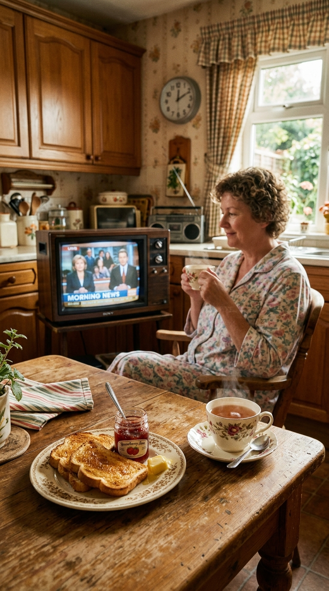
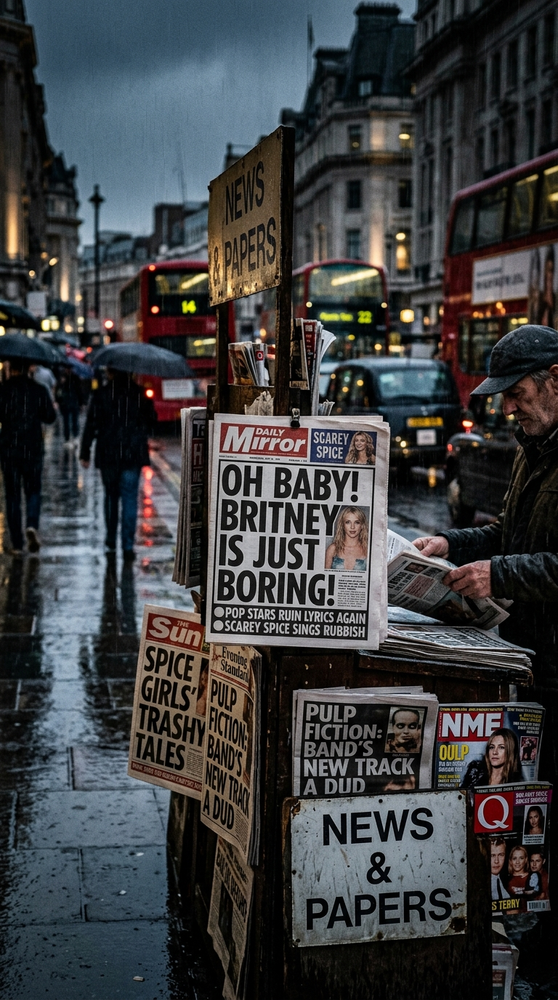
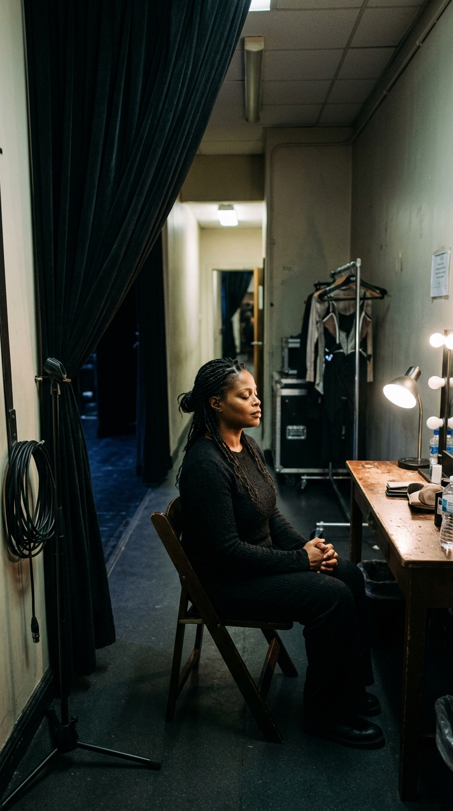
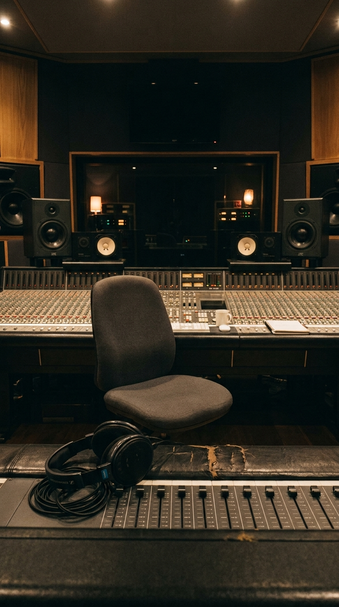

# 🍞 La Paradoja de la Tostada: El Himno Pop de los Noventa que Desafió al Cinismo del Mundo
### *Cómo una rima ingenua sobre el desayuno y los fantasmas fue coronada como «la peor letra de la historia», mientras Des'ree ocultaba un calvario de salud mental antes de renunciar a la fama para sanar vidas.*

---

**Por la redacción de Acordes Ocultos**  
*Tiempo de lectura estimado: 8 minutos*

---

### Prólogo: El descapotable y el silbido del optimismo

En el verano de 1998 era prácticamente imposible caminar por las calles de Londres, París, Madrid, Tokio o Nueva York sin escuchar un silbido contagioso que parecía descender de una nube radiante. Sonaba limpio, despreocupado, impulsado por una línea de bajo elástica y una batería acústica que invitaba a sacudirse el polvo de los zapatos. Acto seguido, una voz de terciopelo y cálido fraseo soul entonaba una declaración de principios que se grababa en la memoria al primer compás:

> *«Life, oh life, oh life, oh life,  
> doo, doot doot doot...»*

El videoclip oficial, dirigido por el aclamado realizador Mike Lipscombe, se convirtió en una de las imágenes más icónicas de la década en MTV y VH1. En él, una radiante mujer británica de 29 años, ataviada con una sencilla camisa blanca y el pelo corto peinado con elegancia minimalista, sonreía de oreja a oreja en el asiento trasero de un Oldsmobile convertible negro de 1965. Mientras el automóvil avanzaba por campos dorados bajo un sol espléndido, una avioneta fumigadora sobrevolaba la carretera arrojando destellos de luz y mariposas de azúcar.

*Verano de 1998: Des'ree en el estudio londinense, concibiendo una melodía luminosa que escaló al número uno en toda Europa y Japón.*

Aquella mujer era **Desirée Annette Simpson**, conocida artísticamente como **Des'ree**. Hija de madre trinitense y padre barbadense afincados en el sur de Londres, ya había cautivado al mundo en 1994 con la introspectiva balada *«You Gotta Be»* y había erizado la piel de millones interpretando *«I'm Kissing You»* en la película *Romeo + Juliet* de Baz Luhrmann. Con su tercer álbum, ***Supernatural***, el éxito fue atronador: el sencillo **«Life»** se catapultó al **número uno en las listas de ventas de toda Europa continental**, dominó el dial de Japón durante semanas y despachó más de tres millones de copias.

Parecía la estampa canónica del triunfo comercial absoluto. Sin embargo, en el epicentro de aquel éxito masivo, una sola estrofa estaba a punto de desatar la mayor tormenta de mofa, cinismo y linchamiento mediático de la historia reciente del pop británico.

---

### Acto I: «I'd rather have a piece of toast»: El verso de la discordia

Para escribir la letra de «Life», Des'ree no contrató a un equipo de compositores de laboratorio ni recurrió a metáforas engoladas. Se sentó en su mesa con una libreta y quiso capturar los miedos cotidianos que cualquier persona experimenta cuando cae la noche, contraponiéndolos a la tierna vulnerabilidad de los placeres simples de la vida terrenal.

En la segunda estrofa de la canción, con una honestidad desarmante y una candidez casi infantil, la cantante deslizó cuatro versos que pasarían a la posteridad:

> *«I don't want to see a ghost  
> It's the sight that I fear most  
> I'd rather have a piece of toast  
> And watch the evening news...»*  
> *(«No quiero ver un fantasma / Es la visión a la que más temo / Prefiero comerme una rebanada de tostada / Y mirar el noticiero de la noche»).*

*La calma de lo cotidiano: Frente al abismo del miedo y la muerte, un desayuno caliente y la paz del hogar como refugio supremo.*

Para Des'ree, la imagen era una viñeta costumbrista y reconfortante: frente al terror sobrenatural de lo desconocido y los espectros del pasado, la rutina doméstica de una cocina tibia, una rebanada de pan tostado crujiente con mantequilla y la voz del telediario representaban el ancla suprema a la cordura y a la vida real.

Sin embargo, para la crítica musical y los tabloides británicos —siempre hambrientos de sangre y caracterizados por una ironía mordaz y destructiva—, aquella rima se convirtió en un pecado mortal.

---

### Acto II: El escarnio nacional y la encuesta de la BBC

Apenas la canción trepó a los primeros puestos del UK Singles Chart, la prensa escrita desató una cacería implacable. Diarios como *The Times*, *The Guardian* y el semanario musical *NME* comenzaron a diseccionar los cuatro versos con un desdén encarnizado. Columnistas y críticos de rock acusaron a Des'ree de pereza intelectual, de escribir como una colegiala de primaria y de trivializar la poesía del soul.

Los programas cómicos de la televisión británica, desde *Have I Got News for You* hasta monologuistas en la cadena BBC, hicieron de la tostada de Des'ree el chiste recurrente de la temporada. Llegaron a bromear sugiriendo si en su próximo sencillo rimaría *«spaghetti»* con *«confetti»* o si cantaría sobre mermelada de frambuesa.

*Titulares despiadados: Los periódicos de Fleet Street convirtieron una confesión inocente en una caricatura a nivel nacional.*

El punto culminante de la humillación pública se produjo en mayo de 2007. La emisora digital **BBC 6 Music**, en colaboración con la cadena cultural **Oneword Radio**, organizó una macroencuesta nacional entre miles de oyentes británicos para elegir **«La Peor Letra Pop de Todos los Tiempos»** (*The Worst Pop Lyric of All Time*).

Entre contendientes de renombre como Duran Duran, The Black Eyed Peas, Snap! y razor-sharp compositores del rock, la rima del fantasma y la tostada de Des'ree arrasó en las votaciones, obteniendo una mayoría abrumadora del sufragio popular y siendo proclamada oficialmente por la corporación pública británica como la peor letra de la historia moderna de la música.

*Estudios de la BBC: La cobertura mediática proclamando la encuesta que estigmatizó a Des'ree ante la opinión pública internacional.*

La noticia dio la vuelta al planeta, reproducida por agencias de noticias desde Tokio hasta Buenos Aires. A ojos del gran público, Des'ree quedó encasillada como un objeto de mofa folclórica: la cantante ingenua que rimó un fantasma con el desayuno.

Pero detrás de los chistes de los cómicos y la burla condescendiente de los críticos, la realidad de Des'ree distaba años luz de la frivolidad que le atribuían.

---

### Acto III: El infierno invisible tras la sonrisa

Mientras el mundo se reía de su tostada, Desirée Simpson vivía un calvario secreto que amenazaba con destruir su cuerpo y su mente.

Aquella sonrisa radiante en el descapotable de 1998 ocultaba una batalla feroz contra una enfermedad autoinmune no diagnosticada adecuadamente durante años: un **hipotiroidismo severo** que le provocaba una fatiga crónica invalidante, dolores articulares constantes y una fragilidad física que la dejaba postrada en cama durante días tras cada concierto.

*El precio de la exposición: Entre bastidores, Des'ree enfrentaba ataques de pánico y un agotamiento físico silencioso.*

A ello se sumó un monstruo aún más devastador: la **agorafobia y el pánico escénico agudo**. A pesar de poseer una presencia escénica elegante y una voz afinada como pocas, Des'ree sentía un pavor cerval antes de salir a actuar ante multitudes o enfrentarse a las cámaras de televisión en directo. La histeria mediática, los viajes intercontinentales constantes para promocionar el disco y las exigencias draconianas de los ejecutivos discográficos de Sony Music terminaron por desmoronar su sistema nervioso.

En una desgarradora entrevista retrospectiva concedida años después, Des'ree relató lo que sentía en la cúspide de su popularidad:

> *«La gente te mira y cree que tu vida es un cuento de hadas porque tienes un disco en el número uno y sales sonriendo en televisión. Pero yo estaba rota por dentro. Sufría ataques de pánico que me dejaban sin respiración en los hoteles. La maquinaria de la industria discográfica no tiene piedad: no les importa si estás enferma o si tu alma se está desgarrando; solo quieren que subas al avión, vendas otro millón de copias y sonrías para la foto. Me di cuenta de que si continuaba en ese engranaje, terminaría muerta»*.

---

### Acto IV: La renuncia voluntaria y el milagro de sanar

En el año 2003, tras editar su cuarto álbum de estudio, *Dream Soldier*, y con las discográficas ofreciéndole jugosos adelantos millonarios para renovar su contrato, Des'ree hizo algo insólito en una industria dominada por la codicia y la vanidad: **decidió renunciar por completo a la fama**.

Se apartó de los focos, apagó el teléfono de los promotores y se despojó de su nombre artístico. Con su nombre civil, Desirée Simpson, se matriculó discretamente en las aulas del prestigioso **College of Naturopathic Medicine (CNM)** en Londres.

*Aulas universitarias de Londres: Des'ree abandona los contratos millonarios para formarse durante cuatro años en medicina natural y nutrición.*

Durante cuatro años de estudio riguroso, rodeada de compañeros jóvenes que en su mayoría no tenían la menor idea de que aquella mujer humilde y estudiosa que tomaba apuntes en primera fila había ganado un premio Brit y coronado las listas de Billboard, Des'ree estudió anatomía, bioquímica, fitoterapia y nutrición celular. En 2008 se graduó con honores como naturópata y nutricionista diplomada.

Abrió una consulta privada en el norte de Londres, dedicándose a tratar a pacientes anónimos con enfermedades autoinmunes, desórdenes digestivos y trastornos de ansiedad, aplicando en ellos la misma sabiduría y remedios naturales que le habían permitido a ella recuperar la salud y la paz espiritual.

*El verdadero refugio: La bata blanca y la calma de ayudar a personas reales lejos del circo mediático de la industria pop.*

Su integridad artística y moral volvió a quedar demostrada en 2007. Cuando la superestrella estadounidense **Beyoncé** grabó una versión no autorizada de su balada *«I'm Kissing You»* (rebautizada como *«Still in Love (Kissing You)»*) para la reedición de lujo de su álbum *B'Day*, violando expresamente las condiciones de copyright que prohibían rodar un videoclip, Des'ree no dudó en llevar a los abogados de Sony BMG y a la propia Beyoncé ante los tribunales de Nueva York y Londres. Des'ree logró que la justicia ordenara la retirada inmediata del videoclip y de las copias físicas del álbum en el mercado mundial, demostrando que ninguna celebridad, por poderosa que fuera, podía pisotear la dignidad de su obra.

---

### Epílogo: La revancha moral de la tostada

Veinticinco años después de aquel verano de 1998, la perspectiva del tiempo ha transformado la burla de «Life» en un testimonio de sabiduría involuntaria.

En un siglo XXI asolado por la ansiedad digital, la adicción a los algoritmos de validación en redes sociales, las crisis de salud mental y el colapso del bienestar emocional en las grandes urbes, aquellos versos que los intelectuales tacharon de ridículos resuenan hoy como una lección vital de primer orden.

*La sabiduría de lo simple: Un cuarto de siglo después, la filosofía de Des'ree brilla como el mayor triunfo frente a la locura del mundo.*

Frente a la histeria de un planeta obsesionado con acumular riqueza, poder y aplausos efímeros a costa de la propia salud mental, la mujer que tuvo el mundo a sus pies y eligió la tranquilidad doméstica nos demostró cuál era la verdadera jerarquía de la existencia. Des'ree no se equivocaba: ante los fantasmas del miedo, la ambición desmedida y el juicio ajeno, no hay mayor acto de rebeldía y cordura que prepararse una tostada caliente, respirar hondo y saborear la paz de estar vivo.

---

### 💬 El eco en la memoria

¿Cómo recuerdas el impacto de *«Life»* en los noventa y qué opinión te merece hoy la decisión de Des'ree de cambiar los escenarios por una vida anónima como terapeuta? ¿Crees que la crítica fue injusta con la ternura de su letra? Cuéntanos tu punto de vista en los comentarios.

---

### 📚 Fuentes y Archivo Documental

* **BBC News Entertainment Archives** (Mayo 2007). *Des'ree lyric voted worst of all time in BBC 6 Music and Oneword poll*. BBC Broadcasting House, Londres.
* **The Guardian** (Septiembre 2019). *Des'ree: 'I needed to step away... pop music can chew you up and spit you out'*. Entrevista en profundidad por Michael Cragg.
* **College of Naturopathic Medicine (CNM)** (2008). *Graduate Directory and Academic Honours: Desirée Annette Simpson, Dip CNM, mBANT*. Londres, Reino Unido.
* **United States District Court for the Southern District of New York** (Abril-Octubre 2007). *Civil Docket Case No. 07-cv-03080: The Royalty Network, Inc. and Des'ree v. Beyoncé Knowles, Columbia Records and Sony BMG Music Entertainment*.
* **British Phonographic Industry (BPI)** (1998-1999). *Supernatural and Life: Platinum Sales Certifications and UK Chart History*.
* **Billboard Magazine** (Agosto 1998). *Des'ree's Supernatural Continental Sweep: European Airplay and Singles Reports*.
