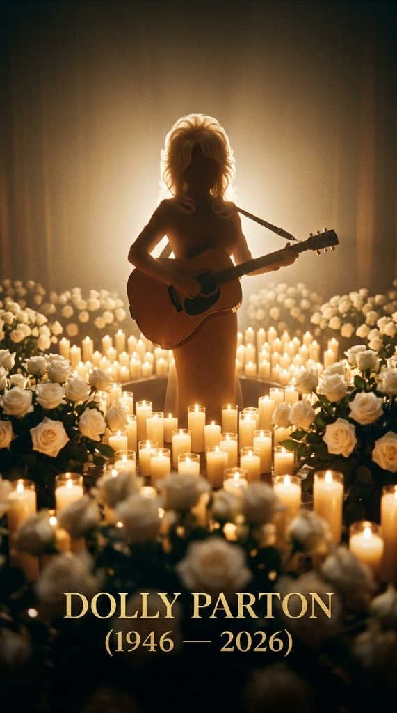
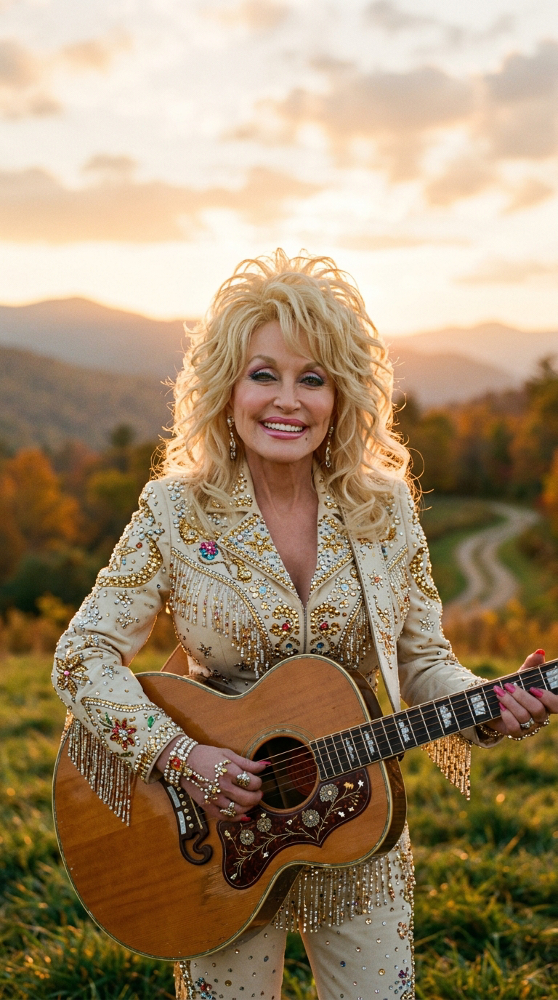
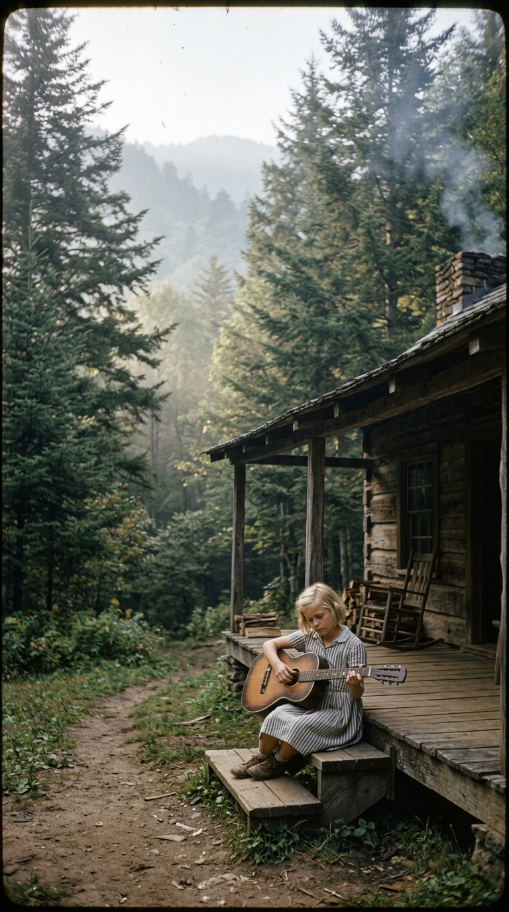
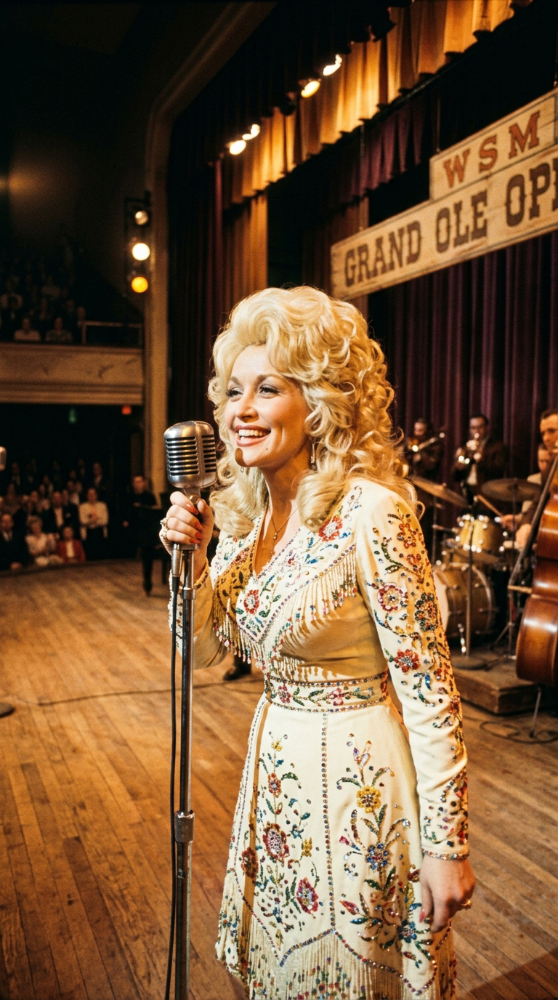
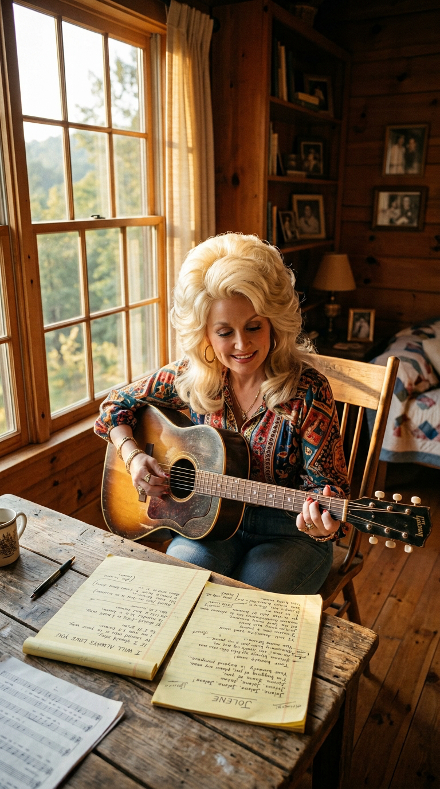

# El Adiós a la Reina Eterna de la Música: La Verdadera Historia de «I Will Always Love You»

> *«If I should stay, I would only be in your way. So I'll go, but I know I'll think of you each step of the way. And I will always love you...»*  
> — **Dolly Parton, 1973**

---

### Prólogo: El himno universal que no nació de un desamor de pareja

Para el oído colectivo del planeta, *«I Will Always Love You»* es la cima absoluta de la balada romántica: la despedida desgarradora entre dos amantes que se separan contra su voluntad, inmortalizada en la década de los noventa por la estratosférica voz de Whitney Houston en la banda sonora de *The Bodyguard*.

Sin embargo, detrás de esa melodía que ha hecho llorar a tres generaciones existe una verdad histórica infinitamente más rica, humana y valiente. La canción no fue escrita tras un divorcio conyugal ni un engaño pasional. Fue la carta de emancipación profesional y agradecimiento eterno de una mujer visionaria que desafió las cadenas de su mentor, se plantó con fiereza ante la maquinaria de Elvis Presley y construyó, a partir de la bondad y el talento puro, el imperio editorial más respetado en la historia de la música popular.

---

### Acto I: La cabaña de madera en las Smoky Mountains

Para comprender la fibra moral de Dolly Rebecca Parton, es necesario descender a una choza de una sola habitación a orillas del río Little Pigeon, en Sevierville, en lo profundo de las Grandes Montañas Humeantes de Tennessee. Nacida en 1946 como la cuarta de doce hermanos en un hogar sin agua corriente ni electricidad, Dolly creció conociendo la indigencia absoluta. Su padre, un agricultor analfabeto, pagó al médico del parto con una saca de harina de avena.

Pero en aquella cabaña donde las paredes se sellaban con periódicos viejos para frenar el viento invernal, sobraba música y dignidad. Con una guitarra casera fabricada con cuerdas de alambre y una lata de manteca, Dolly aprendió que la poesía era el único pasaporte capaz de transformar el hambre en belleza. Al día siguiente de graduarse de la escuela secundaria en 1964, armó una maleta raída y tomó el primer autobús con destino a Nashville.

---

### Acto II: El imperio de Porter Wagoner y la jaula de oro

En 1967, la gran oportunidad tocó a su puerta. El célebre cantante de country y magnate televisivo **Porter Wagoner** la contrató como coanfitriona de su influyente programa sindicado, *The Porter Wagoner Show*, y compañera de duetos en RCA Records.

Durante siete años, el dúo dominó las listas de country, ganó premios nacionales y se convirtió en la pareja artística más rentable de la televisión estadounidense. Sin embargo, a medida que la creatividad de Dolly crecía, la relación se tornó asfixiante. Wagoner, un hombre tradicional y posesivo, consideraba que el éxito de Dolly le pertenecía por entero. Cada vez que ella manifestaba su deseo de emprender el vuelo en solitario, las discusiones en los camerinos terminaban en amenazas, desplantes y reproches amargos:

> *«Porter y yo éramos como el fuego y la gasolina. Discutíamos sin parar. Pero yo sabía que no podía quedarme en su programa para siempre; si me quedaba, me convertiría en una caricatura subordinada. Tenía que marcharme, pero no quería destruirlo en el intento.»*  
> — **Dolly Parton**

---

### Acto III: La tarde mágica de 1973 y la oficina de Porter

Comprendiendo que las palabras habladas solo generaban confrontación, Dolly decidió recurrir al único lenguaje en el que nadie podía rebatirla: la música. En una sola tarde milagrosa de 1973, sentada con su guitarra acústica en su casa de Brentwood, Tennessee, Dolly escribió dos de las obras cumbres de su vida en la misma libreta: *«Jolene»* y *«I Will Always Love You»*.

A la mañana siguiente, vestida con su mejor traje, Dolly entró a la oficina de Porter Wagoner. Se sentó frente a su escritorio, sacó la guitarra y le pidió que guardara silencio durante tres minutos. Con la mirada fija en los ojos de su mentor, entonó los versos recién nacidos:

> *«Bittersweet memories, that is all I'm taking with me. So goodbye, please don't cry... We both know I'm not what you, you need. And I will always love you.»*  
> *(«Recuerdos agridulces, eso es todo lo que me llevo. Así que adiós, por favor no llores... Ambos sabemos que no soy lo que necesitas. Y siempre te querré.»)*

Al terminar el último acorde, el silencio en la habitación fue sobrecogedor. Porter Wagoner tenía los ojos anegados en lágrimas. Se levantó del sillón y le dijo: *«Dolly, es la canción más hermosa que he escuchado jamás. Puedes marcharte con tu carrera en solitario, con una sola condición: déjame producirte este disco»*.

---

### Acto IV: El «no» histórico al Coronel Parker y a Elvis Presley

Lanzada en la primavera de 1974, la versión original de Dolly alcanzó el número uno de las listas de country de Billboard. La belleza de la melodía capturó de inmediato el interés del rey del rock and roll: **Elvis Presley**. Elvis se aprendió la canción, reservó tiempo de estudio y llamó emocionado a Dolly para invitarla a la sesión de grabación.

El día anterior a la cita, el legendario y despiadado mánager de Elvis, el **Coronel Tom Parker**, llamó por teléfono a Dolly para imponerle la cláusula innegociable de la factoría Presley: el artista no grababa ninguna canción a menos que el autor le cediera el 50% de los derechos editoriales y de publicación (*publishing*).

Cualquier compositor joven de la época se habría rendido ante la tentación de ver su nombre junto al de Elvis. Pero Dolly, dotada de una clarividencia empresarial insólita en la década del setenta, se negó en redondo:

> *«Le dije: 'Coronel, con todo el respeto que le tengo al señor Presley, no puedo ceder mis derechos editoriales. Esa canción es el patrimonio de mi familia y de mis futuros herederos'. Lloré durante toda la noche con el corazón roto, pensando que había cometido el mayor error de mi vida. Pero me mantuve firme.»*

Aquella negativa cambiaría el destino de la industria. Dieciocho años más tarde, cuando Whitney Houston grabó la balada para la película *El Guardaespaldas*, Dolly seguía siendo la dueña absoluta del 100% de los derechos de autor. La versión de Houston vendió más de veinte millones de copias físicas y recaudó cientos de millones de dólares en regalías mundiales, convirtiendo a Dolly Parton en una de las mujeres más acaudaladas y poderosas de la cultura global.

---

### Acto V: De las regalías millonarias a la siembra de 200 millones de libros

Lejos de acumular su fortuna con egoísmo corporativo, Dolly Parton transformó cada centavo generado por *«I Will Always Love You»* en una cruzada de amor y solidaridad real. En homenaje a su padre analfabeto, creó la **Imagination Library**, una fundación que envía un libro mensual gratuito a niños de todo el mundo desde su nacimiento hasta los cinco años.

A la fecha, su iniciativa ha distribuido más de doscientos millones de libros infantiles en Estados Unidos, Canadá, el Reino Unido y Australia, alfabetizando a comunidades enteras en condiciones de extrema vulnerabilidad.

En octubre de 2007, cuando Porter Wagoner agonizaba en un centro de cuidados paliativos de Nashville, Dolly acudió a su habitación. Tomó su mano temblorosa, le agradeció por haber creído en ella cuatro décadas atrás y le cantó suavemente al oído los mismos versos con los que se despidió en su oficina. Horas después, Wagoner partió en paz.

---

### Epílogo: El triunfo del amor incondicional

*«I Will Always Love You»* ha trascendido las fronteras de los géneros musicales porque encarna la forma más elevada y madura del afecto humano: aquel que no busca retener, ni someter, ni castigar, sino desear la felicidad del otro incluso cuando los caminos deben bifurcarse.

Dolly Parton nos demostró que se puede ser implacable en los negocios sin perder la ternura en el corazón; que se puede decir adiós con el alma henchida de gratitud; y que la generosidad verdadera consiste en convertir las propias lágrimas en un faro que ilumine la vida de los demás.

---

### 💬 Comunidad y Reflexión

¿Sabías que Dolly Parton se negó a cederle los derechos de esta canción al mismísimo Elvis Presley? ¿Qué versión te emociona más: la intimidad acústica de Dolly o la potencia monumental de Whitney Houston?

Te leemos en los comentarios de **Acordes Ocultos**.

---

### 📚 Fuentes y Archivo Documental

* **Parton, Dolly**: *Dolly: My Life and Other Unfinished Business*, HarperCollins, Nueva York, 1994.
* **Parton, Dolly**: *Songteller: My Life in Lyrics*, Chronicle Books, San Francisco, 2020.
* **Wagoner, Porter**: Archivo de entrevistas y testimonios históricos sobre su colaboración con Dolly Parton, Country Music Hall of Fame and Museum, Nashville.
* **Billboard & RIAA Archives**: Certificaciones oficiales de ventas y desempeño en listas para *«I Will Always Love You»* (1974, 1982 y versión de Whitney Houston en 1992).
* **The Dollywood Foundation**: Informes anuales y estadísticas de distribución comunitaria de la *Imagination Library*, Sevierville, Tennessee.
