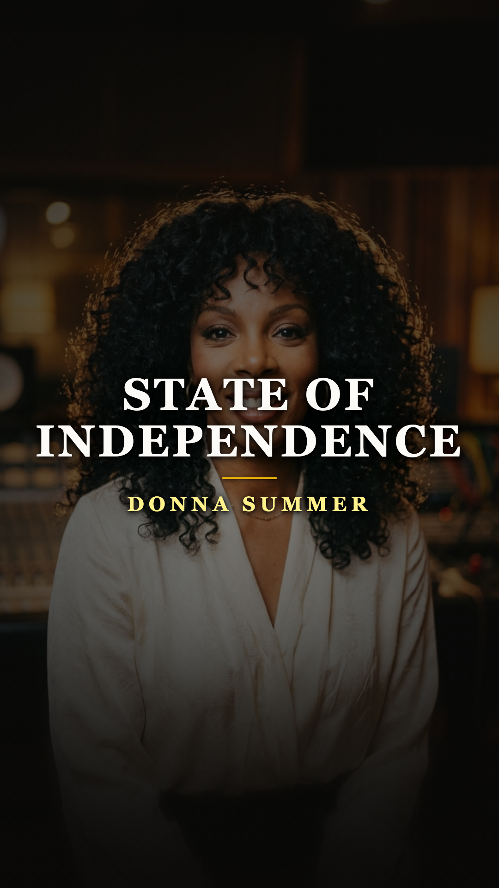
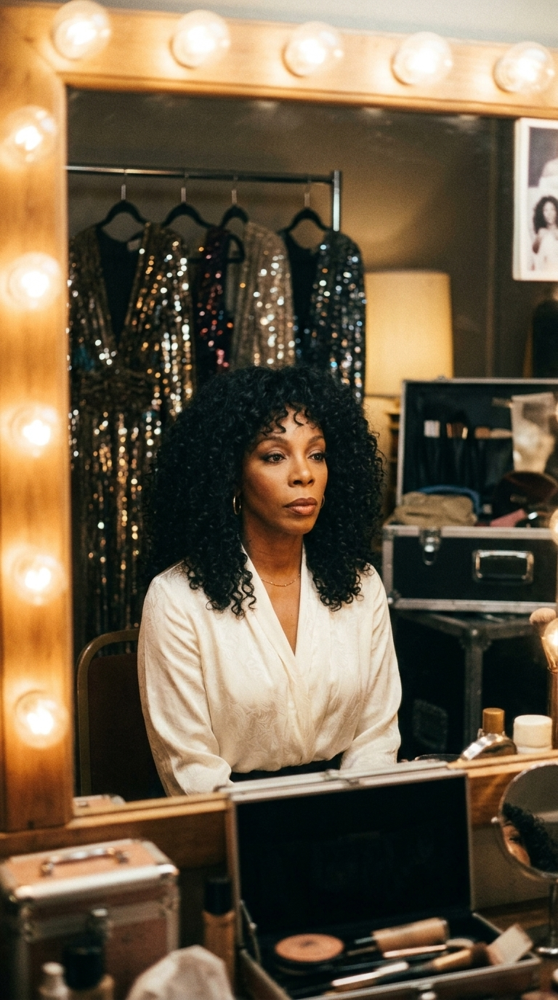
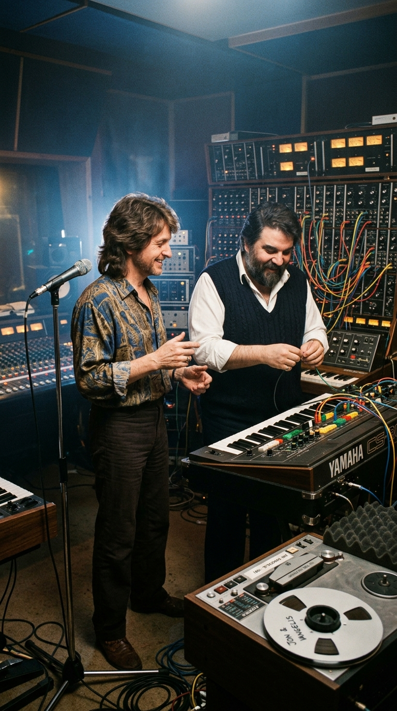
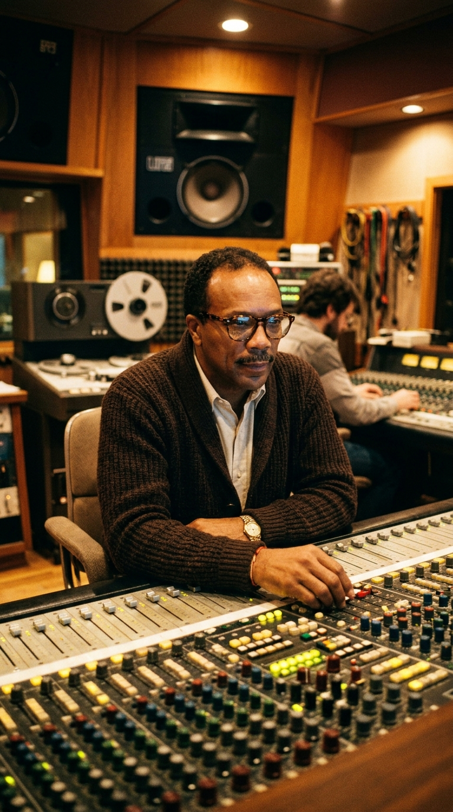
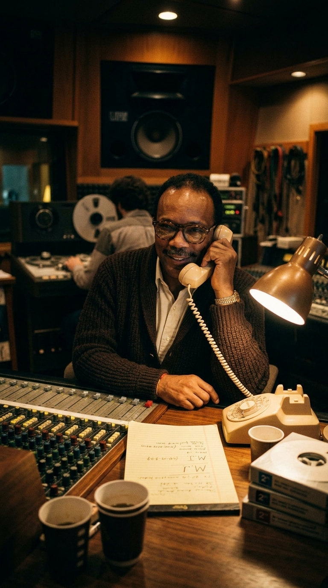
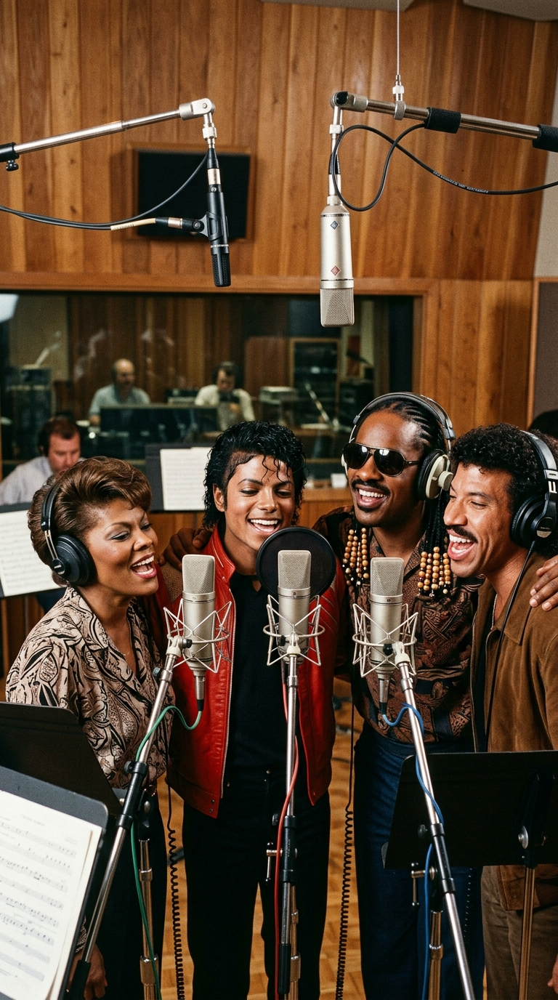
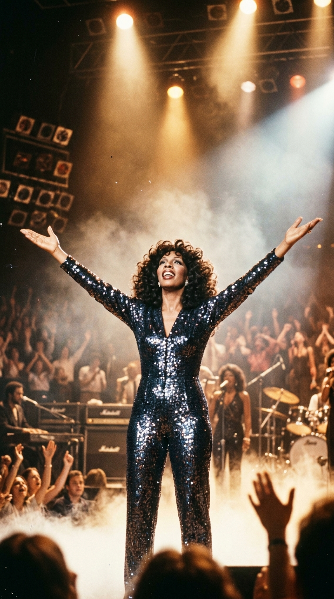

# 🌟 La Plegaria Secreta de Westlake y el Coro que Anticipó un Milagro: La Historia Oculta de «State of Independence»
### *Cómo el hastío de la Reina del Disco, la alquimia progresiva de Vangelis y Jon Anderson, y una llamada de medianoche de Quincy Jones unieron a Michael Jackson, Stevie Wonder y Donna Summer tres años antes de «We Are the World».*

---

**Por la redacción de Acordes Ocultos**  
*Tiempo de lectura estimado: 7 minutos*

---

### Prólogo: El cartel de cartón en Santa Mónica Boulevard

Una noche calurosa de mediados de 1982, sobre la puerta de madera de la sala principal de los estudios **Westlake Audio**, en el 8440 de Santa Mónica Boulevard en Los Ángeles, apareció pegado un trozo de cartón improvisado con una frase escrita a mano con rotulador grueso por el productor **Quincy Jones**:

> *«Leave your egos at the door»* *(Dejen sus egos en la puerta).*

La historia popular atribuye casi unánimemente esa célebre advertencia a la legendaria noche del 28 de enero de 1985, cuando cuarenta y cinco de las más rutilantes estrellas del pop anglosajón se congregaron en los estudios A&M para registrar el himno benéfico *«We Are the World»*. Sin embargo, la memoria colectiva suele omitir un secreto fascinante: el lema no nació en 1985 para combatir la hambruna en Etiopía. Nació tres años antes, en una penumbra cómplice de sintetizadores y humo de tabaco, para rescatar el alma artística de una mujer que sentía asfixiarse bajo las lentejuelas de su propio mito.

Aquella mujer era **Donna Summer**. Y la canción que estaba a punto de grabarse —una extraña y deslumbrante plegaria titulada **«State of Independence»**— no solo congregó al coro más inverosímil jamás reunido en la música popular (con un jovencísimo Michael Jackson en la cúspide creativa de *Thriller*, Stevie Wonder, Lionel Richie y Dionne Warwick cantando hombro a hombro tras un mismo pie de micrófono), sino que funcionó como el ensayo general, el laboratorio humano y la matriz espiritual sobre la cual se edificó el mayor acontecimiento coral del siglo XX.

---

### Acto I: La jaula dorada de la Reina del Disco

A finales de la década de 1970, Donna Summer era la monarca indiscutida de las pistas de baile del planeta. Himnos como *«Love to Love You Baby»*, *«I Feel Love»*, *«Last Dance»* y *«Bad Girls»* habían redefinido la arquitectura sonora del pop moderno de la mano del visionario productor Giorgio Moroder. Sus discos de platino se contaban por docenas y sus giras llenaban estadios.

*Los Ángeles, 1981: Donna Summer en la soledad de su camerino, agotada de la imagen hipersexualizada que la industria le exigía representar.*

Sin embargo, detrás del brillo deslumbrante de las portadas de Casablanca Records, Donna vivía una auténtica pesadilla existencial. La industria la había encasillado en el rol de diosa erótica, una fantasía hipersexualizada que distaba años luz de sus verdaderas raíces: una muchacha criada en el seno de una devota familia cristiana de Boston, formada en los coros góspel de la iglesia apostólica y dotada de un registro vocal de tres octavas con una potencia operística arrolladora.

La presión implacable de las giras, sumada a una severa depresión y a la batalla judicial para romper su leonino contrato discográfico, la llevaron al borde del colapso físico y emocional. En 1980, tras abrazar de nuevo su fe espiritual y convertirse en cristiana renacida, el recién fundado sello **Geffen Records** la fichó como su primer gran estandarte. El magnate David Geffen fue categórico: para inaugurar su nueva era y despojarse de los clichés del euro-disco, Donna debía trabajar con el productor más respetado, ecléctico y genial de la música negra: **Quincy Jones**.

---

### Acto II: La conexión mística en Nemo Studios

Mientras Donna Summer buscaba un renacimiento en California, al otro lado del océano Atlántico, en un antiguo colegio de señoritas transformado en laboratorio sonoro cerca de Hyde Park en Londres —los legendarios **Nemo Studios**—, dos gigantes de la música progresiva europea daban forma a una obra inclasificable.

Eran **Jon Anderson**, la voz celestial y mística de la banda de rock progresivo **Yes**, y el compositor griego **Evángelos Odysséas Papathanassíou**, universalmente conocido como **Vangelis**. Unidos bajo el proyecto colaborativo *Jon and Vangelis*, acababan de grabar el álbum *The Friends of Mr Cairo* (1981).

*Londres, 1981: Jon Anderson y Vangelis rodeados de sintetizadores analógicos en los míticos Nemo Studios durante la gestación de «State of Independence».*

Entre las pistas del disco destacaba una pieza de casi ocho minutos: **«State of Independence»**. Impulsada por una hipnótica y repetitiva línea de sintetizador polifónico creada en un Yamaha CS-80 por Vangelis, y coronada por los versos crípticos y espirituales de Anderson (*«State of life, state of play / State of independence, shall I call...»*), la canción era un canto chamánico a la iluminación interior, al despertar de la conciencia y a la soberanía del espíritu humano.

Para el público general europeo fue una rareza de culto. Pero cuando una cinta con la maqueta llegó al buzón de Quincy Jones en Los Ángeles, el veterano arreglista —que se había curtido tocando la trompeta con Dizzy Gillespie y Duke Ellington antes de producir a Frank Sinatra— escuchó algo que nadie más había sido capaz de descifrar.

Debajo de las capas de electrónica vanguardista y del misticismo cósmico inglés, Quincy sintió los tambores de África, la síncopa del rhythm & blues y el fuego abrasador de una misa góspel de los domingos por la mañana.

---

### Acto III: El alquimista de Westlake

Jones citó a Donna Summer en los estudios Westlake. Cuando le puso la versión original de Jon and Vangelis, Donna quedó desconcertada por el ritmo robótico y las texturas espaciales. Quincy apagó los monitores, la miró por encima de sus gafas de carey y le dijo sonriendo: *«Escucha la letra, Donna. Olvida las máquinas por un momento. Esto no es pop europeo; esto es una alabanza al Altísimo. Y tú eres la única mujer en este planeta capaz de hacer que la gente crea en ella»*.

*Westlake Studios, 1982: Quincy Jones en la mesa de mezclas analógica, orquestando la compleja metamorfosis rítmica del tema.*

Quincy convocó a la crema y nata de los músicos de sesión angelinos. Reemplazó la frialdad sintética original por la batería viva e incisiva de **Ndugu Chancler**, las percusiones arrolladoras de **Paulinho da Costa** y una prodigiosa línea de sintetizador operada por **Michael Boddicker** y **David Foster**. Donna Summer entró en la cabina y entregó una de las interpretaciones vocales más deslumbrantes de su vida, modulando desde un susurro íntimo y contemplativo hasta un torrente de notas agudas plenas de vigor evangélico.

La pista estaba casi terminada. Sonaba épica, majestuosa y vibrante. Sin embargo, en la mente perfeccionista de Quincy Jones faltaba la pieza maestra: el clímax final. En la estructura concebida por Anderson y Vangelis, la canción desembocaba en un mantra rítmico aparentemente ininteligible (*«Shablamidi, shablamida...»*), una especie de glosolalia poética que celebraba la fraternidad universal.

Quincy no quería una sección de coristas profesionales de estudio. Quería una congregación de almas gigantescas que transmitiera la sensación de una humanidad entera elevándose hacia el firmamento.

---

### Acto IV: La noche de los milagros y el coro secreto

Eran cerca de las diez de la noche cuando Quincy Jones se sentó frente al teléfono de disco del estudio. Al mismo tiempo, en la sala contigua de Westlake, el propio Quincy se encontraba en plena fase de preproducción de un proyecto que cambiaría la historia de la cultura pop: el álbum ***Thriller*** de **Michael Jackson**. 

*La noche de las llamadas: Quincy Jones reúne a la realeza del soul y el pop estadounidense para una sola toma vocal.*

Michael, que tenía entonces apenas veintitrés años y pasaba horas en el estudio afinando las maquetas de *«Billie Jean»* y *«Beat It»*, escuchó el llamado de Quincy y cruzó de inmediato el pasillo para unirse a la sesión. Pero Quincy no se detuvo allí. Levantó el auricular y llamó a los amigos más talentosos de su agenda:

—*«Stevie, tienes que venir ahora mismo a Westlake. No me preguntes nada, solo ven»*, le dijo a **Stevie Wonder**.  
Minutos después marcaba el número de **Lionel Richie**, que acababa de iniciar su carrera en solitario tras dejar los Commodores. Luego telefoneó a la legendaria **Dionne Warwick**, prima de Whitney Houston y voz icónica de Burt Bacharach. En menos de dos horas, la sala de grabación de Westlake parecía una fantasía irreal.

Junto a ellos se sumaron **Kenny Loggins**, **Christopher Cross**, **James Ingram**, **Brenda Russell** y la actriz **Dyan Cannon**. Era la alineación vocal más formidable y cotizada de la industria musical estadounidense reunida en cuatro paredes sin previo aviso y sin un solo contrato de por medio, movidos únicamente por el respeto ciego hacia Quincy Jones y la admiración por Donna Summer.

*Un milagro irrepetible: Michael Jackson (en plena era Thriller), Stevie Wonder, Lionel Richie y Dionne Warwick compartiendo el micrófono en Westlake Studios.*

Quincy colocó a los cantantes en semicírculo alrededor de un par de micrófonos de condensador Neumann de válvulas. Stevie Wonder se sentó momentáneamente al piano para marcar las armonías del contracanto. Michael Jackson, con su cabello peinado en los icónicos rizos húmedos de *Thriller* y vistiendo una chaqueta roja informal, tarareaba las modulaciones al oído de Lionel Richie.

Cuando la cinta de dos pulgadas comenzó a rodar y la pista instrumental inundó los auriculares, ocurrió la magia. 

Donna Summer cantaba las estrofas principales desde la pecera acristalada, y cuando llegó el crescendo de la coda, las voces unificadas de Michael, Stevie, Lionel, Dionne y Donna rompieron al unísono:

> *«State of independence, shall I call...  
> Time will come when we shall be as one!»*

La conjunción tímbrica fue tan apabullante, tan colmada de fervor espiritual y pureza artística, que al apagarse el eco del último desvanecimiento de la cinta, la sala quedó en un silencio sepulcral. En la cabina de aislamiento, Donna Summer se dejó caer de rodillas sobre la moqueta, con los auriculares aún en la cabeza y las manos sobre el rostro, incapaz de contener el llanto por la emoción de haber presenciado un milagro divino.

---

### Epílogo: La semilla de 1985

Lanzado como segundo sencillo del álbum *Donna Summer* en el otoño de 1982, «State of Independence» se convirtió en un éxito rotundo en Europa, alcanzando los primeros puestos de las listas en el Reino Unido, Países Bajos e Irlanda. Aunque en los Estados Unidos la radio comercial de la época —altamente segregada tras la reacción violenta del movimiento *Disco Demolition Night*— no le brindó el apoyo masivo que merecía, el tema adquirió de inmediato el estatus de obra maestra indiscutible.

*Donna Summer liberada: la consagración de una voz que trascendió las modas pasajeras para alcanzar la inmortalidad artística.*

Sin embargo, el impacto más trascendental de aquella noche en Westlake Studios no se midió en las listas de ventas de 1982, sino en la historia del mundo tres años más tarde.

Cuando en diciembre de 1984 el activista Harry Belafonte y el mánager Ken Kragen concibieron la idea de reunir a las estrellas estadounidenses para emular el proyecto británico *Band Aid* de Bob Geldof, recurrieron a la única persona con la autoridad moral, la audacia musical y la capacidad de convocatoria para dirigir semejante titán: **Quincy Jones**.

Quincy no dudó un segundo. Llamó a **Lionel Richie** y a **Michael Jackson** para que compusieran el himno. Y cuando llegó la noche del 28 de enero de 1985 y las estrellas del mundo entraron al estudio, volvieron a encontrar el mismo cartel que Quincy había clavado en Westlake para Donna Summer: *«Dejen sus egos en la puerta»*.

Allí estaban otra vez Michael, Stevie, Lionel, Dionne y Kenny Loggins, cantando las mismas notas de fraternidad universal que habían ensayado en secreto aquella noche mágica de 1982. «State of Independence» no fue simplemente una gran canción; fue el prólogo sagrado, la raíz invisible y la prueba irrefutable de que, cuando los gigantes callan su soberbia, la música tiene el poder de sanar las heridas del mundo.

---

### 📚 Fuentes y Archivo Documental

Para la reconstrucción histórica y narrativa de esta crónica, la redacción de *Acordes Ocultos* ha consultado y contrastado las siguientes fuentes documentales, biográficas y testimoniales:

1. **Jones, Quincy.** *Q: The Autobiography of Quincy Jones*. Doubleday / Random House, Nueva York, 2001. Capítulos dedicados a las sesiones de producción en Westlake Studios (1981-1982), los orígenes de la consigna «Leave your egos at the door» y el ensamblaje del *All-Star Choir*.
2. **Summer, Donna & Eliot, Marc.** *Ordinary Girl: The Journey*. Villard Books, Nueva York, 2003. Memorias oficiales de Donna Summer; testimonios sobre su renacimiento espiritual, su ruptura con Casablanca Records y el impacto emocional de grabar «State of Independence».
3. **Taraborrelli, J. Randy.** *Michael Jackson: The Magic, The Madness, The Whole Story*. Pan Macmillan, Londres, 2004. Crónica documental sobre las sesiones paralelas de Michael Jackson en Westlake durante la primavera y el verano de 1982.
4. **Anderson, Jon.** Entrevistas para *Songfacts Archives* (2013) y *Prog Magazine* (2016) sobre la génesis compositiva de «State of Independence» junto a Vangelis en Nemo Studios (Londres, 1981) y su reacción al escuchar el arreglo góspel de Quincy Jones.
5. **Sound on Sound Magazine.** *Classic Tracks: USA for Africa 'We Are the World' & The Westlake Sessions*. Análisis técnico de ingeniería de sonido, microfonía Neumann U87/U67 y consolas Harrison/Neve en los estudios Westlake Audio de Los Ángeles.
6. **Billboard Magazine Archive (1982).** Reseñas de lanzamientos discográficos y reportajes de la industria sobre el debut homónimo de Donna Summer bajo el sello Geffen Records.
