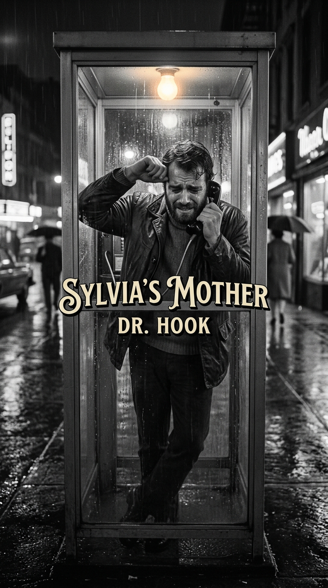
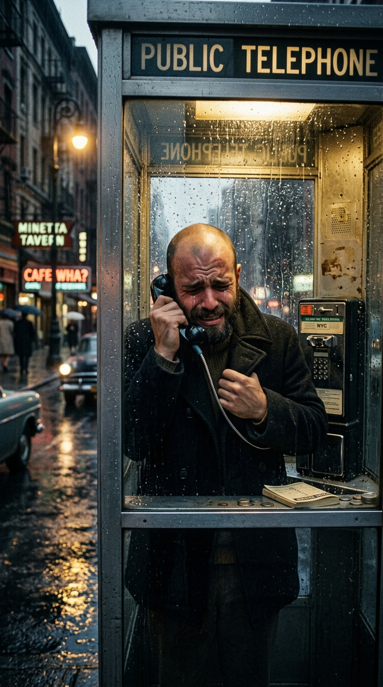
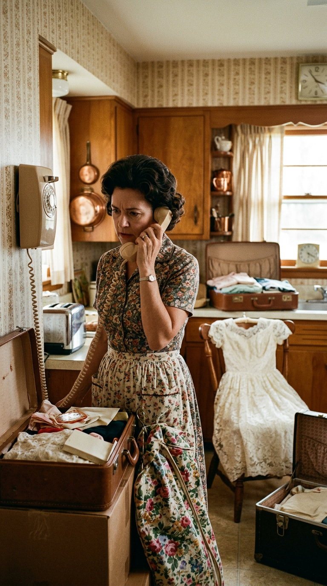
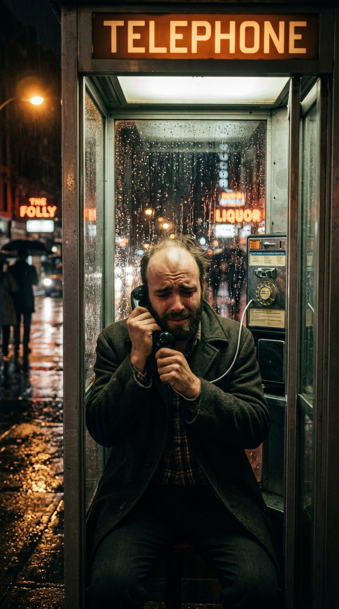
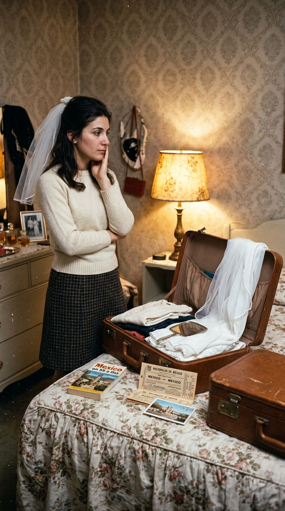
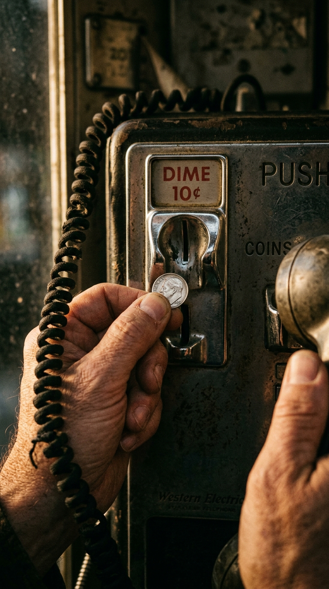
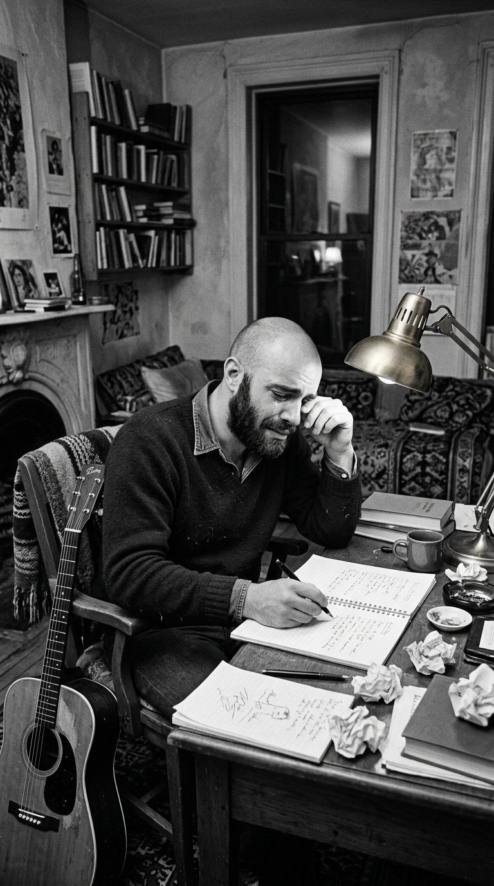
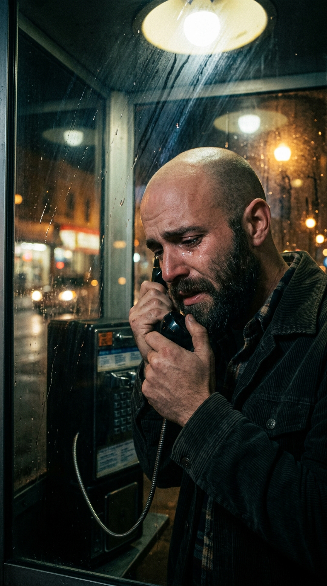
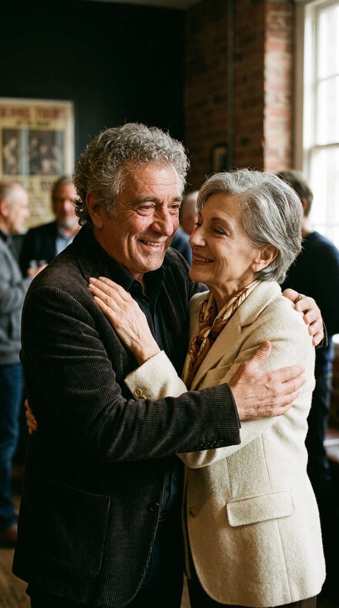

# La Llamada Real que Rompió un Corazón en 3 Minutos: La Historia Detrás de «Sylvia’s Mother»

> *«Sylvia's mother says, "Sylvia's busy, too busy to come to the phone." Sylvia's mother says, "Sylvia's tryin' to start a new life of her own." And the operator says: "Forty cents more for the next three minutes."»*  
> — **Shel Silverstein, 1971**

---

### Prólogo: El tintineo de una moneda en la cabina

Durante más de tres décadas, el público que cantaba y sonreía con el pegadizo estribillo de *«Sylvia's Mother»* asumió que se trataba de una comedia musical de enredos: una viñeta satírica ideada por un letrista ingenioso para retratar la clásica resistencia de las suegras hacia los pretendientes bohemios. La interpretación de la banda **Dr. Hook & The Medicine Show**, con su aire desenfadado, sus barbas hirsutas y un estilo campirano teñido de vodevil, invitaba a tomarse la pieza como una agradable caricatura pop.

Sin embargo, detrás de cada verso, de cada interrupción y de cada centavo que caía por la ranura metálica no había una pizca de ficción. Lo que aquella canción retrataba con una fidelidad milimétrica fue la conversación telefónica real más humillante y desgarradora en la vida de uno de los grandes poetas y caricaturistas de Estados Unidos: Shel Silverstein, atrapado en una cabina bajo la lluvia mientras el amor de su vida empacaba sus maletas para marcharse para siempre.

---

### Acto I: Shel Silverstein y el amor esquivo de Sylvia

A mediados de los años sesenta, Sheldon Allan Silverstein era una figura legendaria de la contracultura neoyorquina: dibujante estrella de la revista *Playboy*, autor de cuentos infantiles inmortales como *The Giving Tree* y compositor de pluma prodigiosa que más tarde escribiría clásicos como *«A Boy Named Sue»* para Johnny Cash. Pero detrás de su imponente estatura, su cabeza afeitada y su espesa barba negra, Shel albergaba una vulnerabilidad romántica casi infantil.

En Chicago, Shel se había enamorado profundamente de una joven sofisticada, inteligente y de espíritu libre llamada **Sylvia Pandolfi**. Vivieron un romance apasionado pero intermitente, marcado por la vida nómada de Silverstein y las dudas de Sylvia sobre el porvenir de la relación. Con el paso de los meses, la distancia enfrió el vínculo, hasta que Sylvia conoció a un arquitecto y pintor mexicano con quien decidió dar un giro definitivo a su existencia: casarse y mudarse a la Ciudad de México.

---

### Acto II: La muralla cortés de la señora Louisa

Al enterarse por terceros de que Sylvia estaba a punto de casarse y abandonar el país, Shel entró en pánico. Se precipitó a una cabina telefónica pública en una esquina de Manhattan con un puñado de monedas de diez y veinticinco centavos en el bolsillo del abrigo. Marcó el número de larga distancia con los dedos temblorosos, rogando tener una última oportunidad de convencerla o, al menos, escuchar su voz por última vez.

Pero quien levantó el auricular al otro lado de la línea no fue Sylvia, sino su madre: **Louisa Pandolfi**.

La señora Louisa no insultó a Shel ni le colgó con rabia. Actuó con una educación impecable, templada y gélida, ejerciendo el papel de un centinela infranqueable que protegía el futuro de su hija frente al caos bohemio del artista:

> *«Sylvia está ocupada, Shel... Demasiado ocupada para ponerse al teléfono. Está empacando sus vestidos y sus recuerdos. Se marcha hoy mismo para empezar una nueva vida en México. Por favor, déjala ir. No compliques las cosas.»*

Cada palabra de la señora Pandolfi caía como un mazazo en el pecho de Silverstein. Desde el fondo del pasillo, a través de la línea, Shel creyó escuchar el rumor de pasos y maletas cerrándose, mientras suplicaba desesperadamente: *«Solo dígale adiós de mi parte... Dígale que solo quería desearle suerte»*.

---

### Acto III: El cronómetro de la operadora

Para colmo de la agonía, la llamada estaba mediada por la tecnología analógica de cobro por tiempo de la compañía telefónica Bell. Cada ciento ochenta segundos, un pitido agudo interrumpía la conversación, seguido por la voz mecánica y desapasionada de la telefonista:

> *«Deposite cuarenta centavos más para los próximos tres minutos.»*

El contraste resultaba brutal y surrealista: mientras Shel vaciaba sus bolsillos buscando monedas de plata con las lágrimas empañando el cristal de la cabina, el sistema capitalista medía en centavos la muerte de su relación.

Cuando arrojó la última moneda que le quedaba, la señora Pandolfi pronunció una frase lapidaria que selló su destino: *«Gracias por llamar, Shel... pero es mejor que no vuelvas a buscarla»*. La línea se cortó con un chasquido sordo, dejando a Silverstein a solas con el tono de ocupado y el murmullo de la lluvia en el asfalto.

---

### Acto IV: Del papel empapado a la voz desgarrada de Dr. Hook

Destrozado por la impotencia, Shel regresó a su apartamento en Greenwich Village, tomó su guitarra acústica y una libreta de espiral. No necesitó inventar metáforas ni recurrir a la ficción poética: se limitó a transcribir con precisión taquigráfica la conversación exacta que acababa de mantener, palabra por palabra.

Años después, a comienzos de la década de 1970, Silverstein entregó la partitura a un grupo de músicos extravagantes y bohemios afincados en Nueva Jersey: **Dr. Hook & The Medicine Show**. El productor Ron Haffkine confió la voz principal a **Dennis Locorriere**, quien, con apenas veintidós años, dotó a la interpretación de un quejido sureño empapado en llanto, autocompasión y desesperación auténtica.

Lanzada en 1972, *«Sylvia's Mother»* se convirtió de inmediato en un éxito colosal: escaló al número cinco del *Billboard Hot 100*, alcanzó el número dos en las listas británicas y vendió millones de copias en todo el mundo.

---

### Acto V: La verdad descubierta tres décadas después

Durante mucho tiempo se sospechó que el relato era una alegoría. Sin embargo, en el año 2000, un equipo de investigación documental y periodistas musicales rastrearon el paradero de la auténtica musa: **Sylvia Pandolfi**.

La sorpresa fue mayúscula. Sylvia no solo era una persona de carne y hueso, sino una distinguida figura del mundo del arte contemporáneo: se había establecido en México, se había casado con el arquitecto Roberto Vásquez y se había desempeñado durante años como directora del prestigioso *Museo de Arte Carrillo Gil* en la Ciudad de México.

En entrevistas posteriores, la propia Sylvia y su anciana madre Louisa confirmaron que cada detalle de la canción era rigurosamente verídico:

> *«Mi madre siempre recordaba aquella tarde. Shel llamó desesperado desde la cabina y ella realmente le dijo que no arruinara mi partida. Cuando la canción salió años después y se convirtió en un éxito mundial, mi madre solía bromear diciendo que ella era la madre más famosa del rock.»*  
> — **Sylvia Pandolfi**

Lejos del rencor, Sylvia y Shel mantuvieron una correspondencia cariñosa a lo largo de las décadas, sellando una amistad que duró hasta la muerte de Silverstein en mayo de 1999.

---

### Epílogo: La tragedia doméstica de los tres minutos

El perdurable atractivo de *«Sylvia's Mother»* radica en su honestidad descarnada. No narra una épica de amantes malditos al estilo de Romeo y Julieta, sino una derrota cotidiana, torpe y real: la de quien ve escaparse al amor de su vida sin poder siquiera despedirse, mientras una operadora le cuenta las monedas y una madre protectora le cierra la puerta con la más demoledora de las sonrisas amables.

---

### 💬 Comunidad y Reflexión

¿Sabías que la conversación telefónica con la señora Louisa ocurrió palabra por palabra en la vida real? ¿Alguna vez has tenido que vivir un adiós definitivo mediado por la distancia o la frialdad de un tercero?

Te leemos en los comentarios de **Acordes Ocultos**.

---

### 📚 Fuentes y Archivo Documental

* **Silverstein, Shel**: Archivo de entrevistas sobre la génesis de sus canciones populares y composiciones para Dr. Hook, *Nashville Songwriters Hall of Fame*.
* **Pandolfi, Sylvia**: Testimonio documental y entrevistas sobre su relación con Shel Silverstein y el impacto de *«Sylvia's Mother»*, Archivos del Museo de Arte Carrillo Gil y prensa mexicana, 2000.
* **Locorriere, Dennis**: *«The Story Behind Dr. Hook's Sylvia's Mother»*, entrevista histórica para BBC Radio 2, 2012.
* **Billboard & UK Singles Chart**: Registros de ventas y certificaciones del álbum *Dr. Hook* (Columbia Records C 30898), 1972.
* **Rogak, Lisa**: *A Boy Named Shel: The Life and Times of Shel Silverstein*, Thomas Dunne Books / St. Martin's Griffin, Nueva York, 2007.
