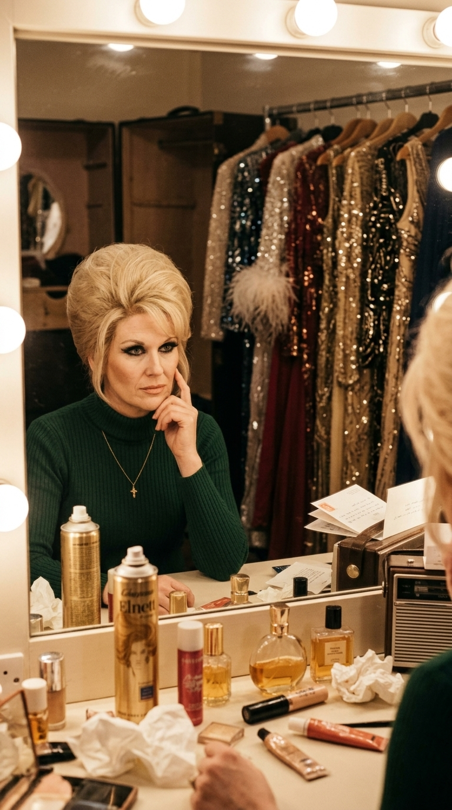
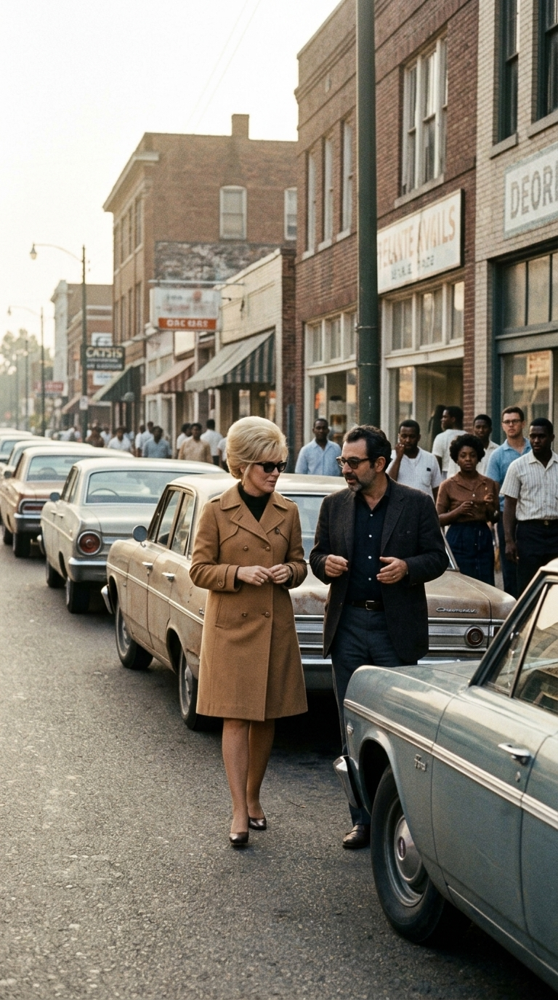
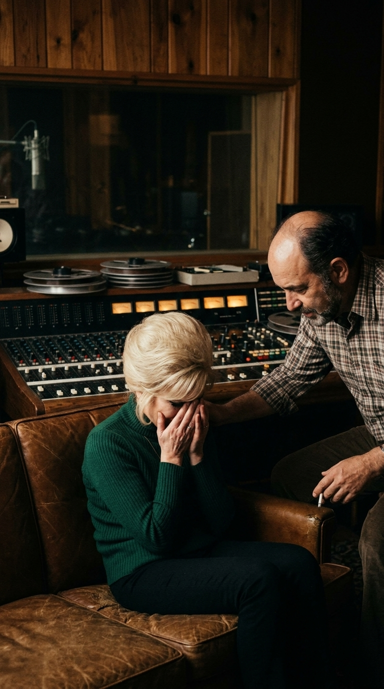
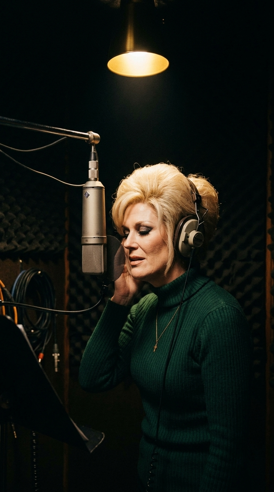
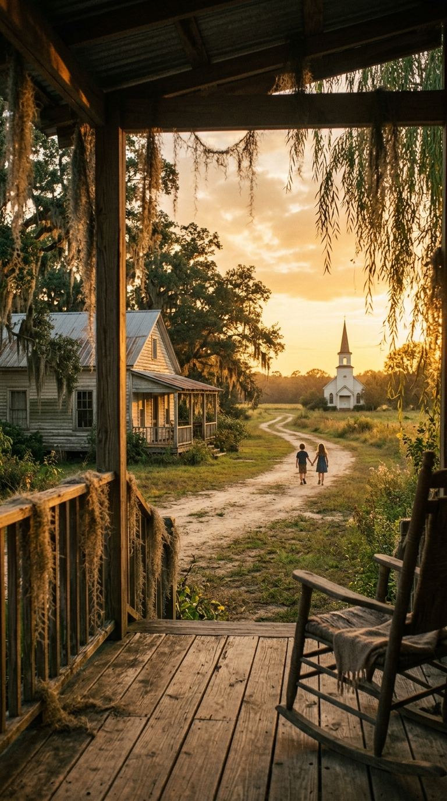

# El Himno del Miedo Sagrado: La Odisea Emocional de «Son of a Preacher Man» de Dusty Springfield

**Por la redacción de Acordes Ocultos**

---

### Prólogo: El rechazo en Detroit y la frontera del tabú

A finales del verano de 1968, sobre la madera gastada de un piano vertical en Detroit, descansaba una partitura mecanografiada que ardía como una brasa. Sus autores, los compositores John Hurley y Ronnie Wilkins, habían escrito cada compás y cada verso con una destinataria indiscutible en mente: Aretha Franklin, la indiscutible Reina del Soul. El título de la pieza, *«Son of a Preacher Man»*, parecía un traje a la medida para la mujer que había aprendido a modular la gloria vocal en los bancos de la iglesia baptista de New Bethel, guiada por la imponente figura de su padre, el reverendo C.L. Franklin.

Sin embargo, cuando la partitura llegó a manos de Aretha, la respuesta fue un silencio cortante y una negativa categórica. 

Para la cantante y para el estricto círculo eclesiástico que la rodeaba, narrar el despertar carnal de una muchacha en el patio trasero junto al hijo de un predicador no era una audacia poética: rozaba la blasfemia. Mezclar el fervor sagrado del púlpito con la insinuación de un amor furtivo entre la hierba alta parecía una falta de respeto inadmisible hacia la memoria y la investidura paterna. Aretha apartó la canción con desdén piadoso.

Nadie sospechaba entonces que aquel papel desdeñado cruzaría el océano Atlántico para convertirse en la tabla de salvación —y en el purgatorio emocional más aterrador— de una tímida chica católica londinense.

---

### Acto I: Mary O'Brien y el espejismo dorado del Swinging London

En Londres, la mujer que el mundo conocía como Dusty Springfield vivía atrapada dentro de una armadura que empezaba a asfixiarla. Nacida bajo el nombre de Mary Isobel Catherine O’Brien en una familia de clase media de West Hampstead, la cantante había construido a lo largo de los años sesenta una identidad pública colosal: peinados colmena de un rubio platino casi arquitectónico, pestañas postizas infinitas y un grueso delineado negro de ojos que ocultaba una timidez enfermiza y una profunda sensación de insuficiencia.

A pesar de acumular éxitos arrolladores en las listas británicas como *«I Only Want to Be with You»* o *«You Don't Have to Say You Love Me»*, Mary O’Brien despreciaba la orquestación ligera y el artificio del pop de consumo masivo. Sentada frente al espejo iluminado de su camerino, con la mirada perdida entre frascos de laca y vestidos de lentejuelas, Dusty albergaba una devoción casi mística y clandestina: la música negra estadounidense. 

Coleccionaba con fervor casi religioso los discos de importación de Motown, Stax y Atlantic Records. Admiraba con devoción visceral a Otis Redding, Wilson Pickett y, por encima de todos ellos, a Aretha Franklin. Sin embargo, su propia voz blanca y aterciopelada le parecía un chiste pálido comparada con el rugido volcánico de los cantantes nacidos en los campos de algodón y las congregaciones del Sur profundo.

Fue entonces cuando Jerry Wexler, el legendario productor y cofundador de Atlantic Records, le lanzó un desafío audaz: despojarse de los violines edulcorados de Londres, viajar al epicentro del rhythm and blues estadounidense y grabar un disco de soul descarnado en el mismísimo Tennessee.

---

### Acto II: La peregrinación a Memphis bajo la sombra del duelo

En septiembre de 1968, Dusty Springfield aterrizó en Memphis. La ciudad respiraba una atmósfera densa, pesada y cargada de una tristeza asfixiante. Apenas cinco meses antes, el 4 de abril, una bala de odio había segado la vida de Martin Luther King Jr. en el balcón del Motel Lorraine, a escasos minutos del estudio. El toque de queda militar y las heridas sangrantes de la segregación racial flotaban en cada esquina y en el aire húmedo de las avenidas sureñas.

Para Dusty, cruzar las puertas del austero **American Sound Studio**, ubicado en el 827 de Thomas Street, fue como entrar a una catedral sagrada descalza. 

Aquel local sin lujos, con paredes revestidas de listones de madera acústica y linóleo gastado, era el taller donde se forjaban los milagros sonoros de la época. Allí la aguardaban los legendarios *Memphis Boys* —el guitarrista Reggie Young, el bajista Tommy Cogbill, el baterista Gene Chrisman y el teclista Bobby Emmons—, flanqueados por los coros celestiales de *The Sweet Inspirations*, lideradas por Cissy Houston. Eran músicos fogueados en cientos de sesiones históricas, capaces de crear un ritmo hipnótico con una sola mirada.

Pero lo que para Wexler era el escenario idóneo para consagrar a su nueva protegida, para Dusty se convirtió de inmediato en una trampa psicológica devastadora.

---

### Acto III: El colapso del alma blanca frente a los templarios del soul

La reverencia que Dusty sentía por sus ídolos se transformó en un terror paralizante. El llamado *síndrome del impostor* la atenazó con una violencia feroz. 

Cuando los *Memphis Boys* comenzaron a ensayar los primeros compases sincopados de *«Son of a Preacher Man»*, construyendo ese punteo de guitarra limpio y arrastrado que hoy forma parte del inconsciente colectivo, Dusty no vio una oportunidad de lucimiento: vio su propia condena. En su mente herida, una chica blanca, burguesa y británica no tenía derecho alguno a mancillar aquel santuario sonoro intentando imitar el dolor y la gloria del góspel afroamericano.

En la cabina de grabación, colocada frente al imponente micrófono Neumann, su garganta se cerró por completo. Las tomas vocales eran titubeantes, temblorosas. Tras escuchar la reproducción en los monitores de la sala de control, Dusty rompió a llorar desconsoladamente sobre el sofá de cuero desgastado, sepultando el rostro entre las manos. Convencida de que su talento era un fraude mayúsculo y que los músicos de sesión se burlaban en silencio de su osadía, sufrió un ataque de pánico de tal magnitud que fue incapaz de articular una sola estrofa definitiva.

Jerry Wexler, un productor veterano acostumbrado a lidiar con genios temperamentales, comprendió de inmediato que empujar a Dusty en aquel entorno equivalía a destruir su espíritu para siempre. Hizo una pausa, abrazó a la cantante con infinita paciencia y tomó una decisión inédita: apagaría los micrófonos vocales en Memphis, registraría únicamente las pistas instrumentales con la banda y se llevaría las cintas maestras de dos pulgadas a mil quinientos kilómetros de distancia.

---

### Acto IV: La penumbra salvadora de Nueva York y el susurro eterno

Semanas más tarde, en los estudios de Atlantic Records en Manhattan, el escenario era radicalmente distinto. No había bandas en vivo, ni miradas escrutadoras, ni la sombra intimidante de la leyenda sureña.

En la más absoluta soledad y bajo una penumbra deliberadamente atenuada, iluminada apenas por el resplandor cálido de un foco cenital, Dusty Springfield se colocó los auriculares. Nadie podía verla. Sola ante el micrófono, liberada del peso de tener que demostrar una potencia que no le pertenecía, dejó a un lado el grito desgarrado del góspel y recurrió a su arma más secreta: la intimidad sobrecogedora, el aire contenido y la sensualidad susurrada.

En lugar de atacar las notas con furia, Dusty las acarició con una calidez vulnerable y rota. El inicio de la canción se convirtió en una confidencia compartida en la penumbra:

> *«Billy Ray was a preacher's son / And when his daddy'd visit he'd come along / When they gathered round and started talkin' / That's when Billy would take me walkin'...»*

Cada respiración, cada inflexión ronca y cada caída melódica transmitían la autenticidad de una experiencia humana palpable. La británica no intentaba parecer negra; estaba entregando su propia alma desnuda. El resultado fue una obra maestra de contrastes: la base rítmica implacable de Memphis, empapada de sudor y groove sureño, coronada por la voz etérea, tímida y embriagadora de una mujer que acababa de vencer a sus propios fantasmas.

---

### Epílogo: El perdón de la Reina y la victoria de la vulnerabilidad

Cuando el álbum *Dusty in Memphis* y el sencillo *«Son of a Preacher Man»* vieron la luz a comienzos de 1969, el impacto en la cultura musical fue sísmico. La canción escaló de forma fulgurante hasta el Top 10 en los Estados Unidos y el Reino Unido, rompiendo etiquetas y demostrando que la emoción genuina no entiende de pasaportes ni de colores de piel.

Pero el momento definitivo de redención llegó meses después, en una llamada telefónica privada. 

Aretha Franklin había escuchado el disco en su tocadiscos. Desarmada por la finura interpretativa y la elegancia sensual con la que Dusty había dotado a la pieza que ella misma había repudiado por prejuicio, la Reina del Soul llamó a Jerry Wexler para confesarle su asombro y admitir con humildad que se había equivocado por completo. Tan profunda fue su admiración que, en 1970, Aretha entró a los mismos estudios de Atlantic para grabar su propia versión de *«Son of a Preacher Man»* en su aclamado álbum *This Girl's in Love with You*, concibiéndola como un tributo explícito a la proeza de la cantante británica.

Décadas más tarde, en 1994, Quentin Tarantino inmortalizó la canción para siempre en la banda sonora de *Pulp Fiction*, acompañando la entrada descalza de Mia Wallace y grabándola a fuego en la memoria de las nuevas generaciones.

Dusty Springfield partió tempranamente en marzo de 1999, víctima de un cáncer de mama, pocos días antes de ingresar solemnemente al Salón de la Fama del Rock and Roll. Nos legó, en aquellos tres minutos de cadencia inolvidable, una lección imborrable: que las obras más grandes del arte no nacen de la arrogancia o la perfección técnica impecable, sino del coraje tembloroso de quienes, aun estando al borde del colapso, se atreven a transformar sus miedos más profundos en belleza inmortal.

---

### 📚 Fuentes y Archivo Documental

1. **Wexler, Jerry & Ritz, David** (1993). *Rhythm and the Blues: A Life in American Music*. Alfred A. Knopf, Nueva York. (Memorias oficiales de Jerry Wexler detallando las sesiones de grabación de *Dusty in Memphis* y el traslado de las pistas vocales a Nueva York).
2. **Valentine, Penny & Wickham, Vicki** (2000). *Dancing with Demons: The Authorised Biography of Dusty Springfield*. Hodder & Stoughton, Londres. (Investigación biográfica sobre los problemas de ansiedad, autoexigencia y el trasfondo de sus sesiones de estudio).
3. **Guralnick, Peter** (1999). *Sweet Soul Music: Rhythm and Blues and the Southern Dream of Freedom*. Back Bay Books. (Contexto histórico sobre American Sound Studio, The Memphis Boys y la atmósfera social de Memphis en 1968).
4. **Franklin, Aretha & Ritz, David** (1999). *Aretha: From These Roots*. Villard Books. (Testimonios sobre su rechazo inicial a la composición de Hurley y Wilkins y su posterior grabación en 1970).
5. **Atlantic Records Archive** (1968–1970). Hojas de sesión, registros de masterización y créditos de producción de *Dusty in Memphis* (Catálogo SD-8214) y *This Girl's in Love with You* (Catálogo SD-8248).
6. **Billboard Magazine** (Noviembre de 1968 – Marzo de 1969). Críticas discográficas de la época y seguimiento del desempeño comercial del sencillo en las listas *Hot 100*.
