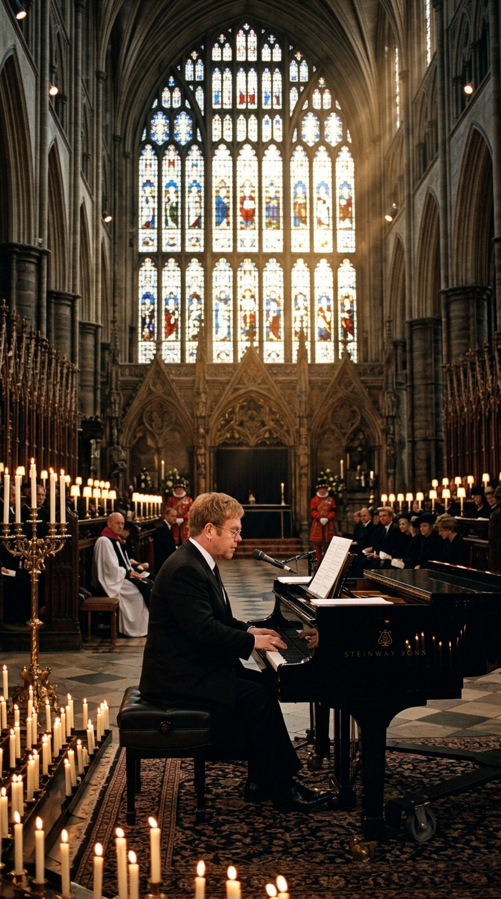
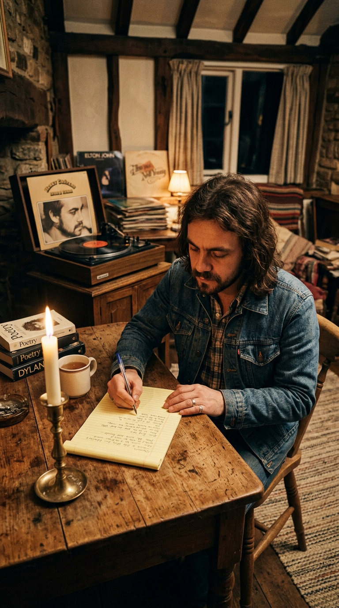
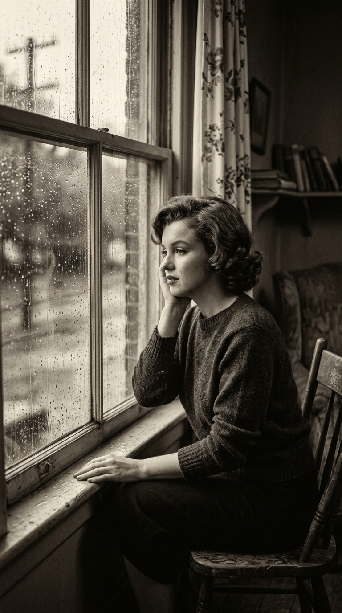
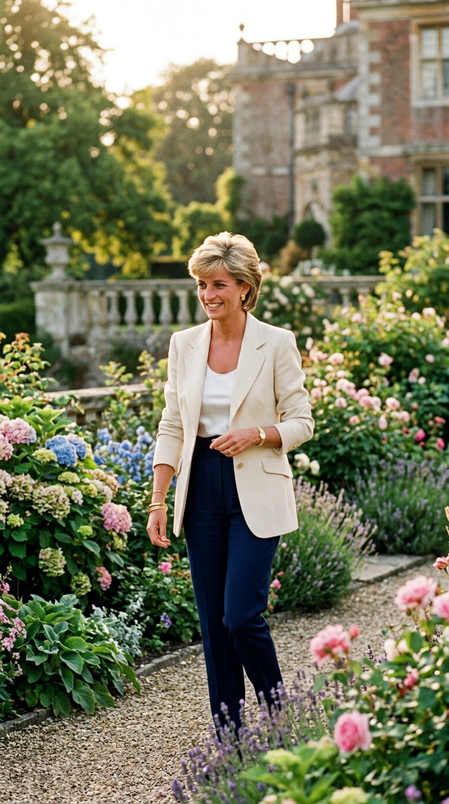
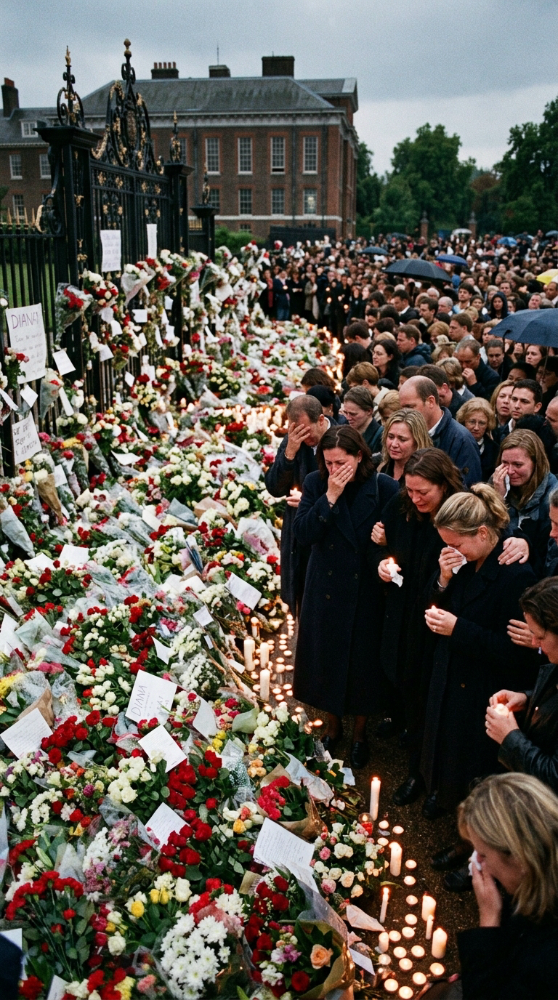
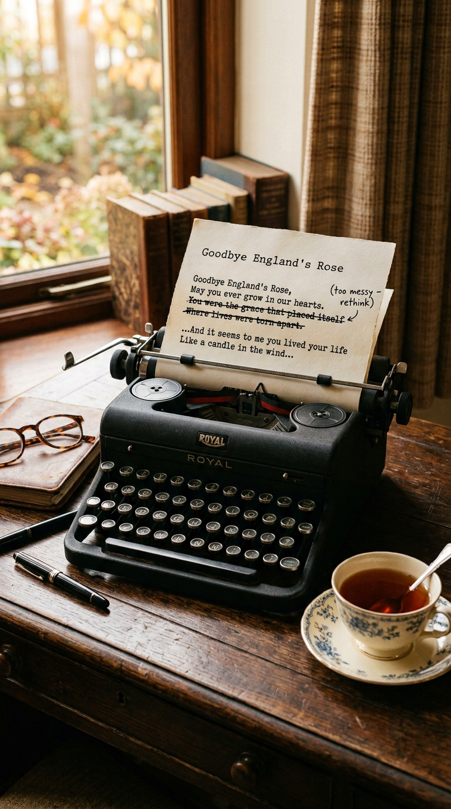
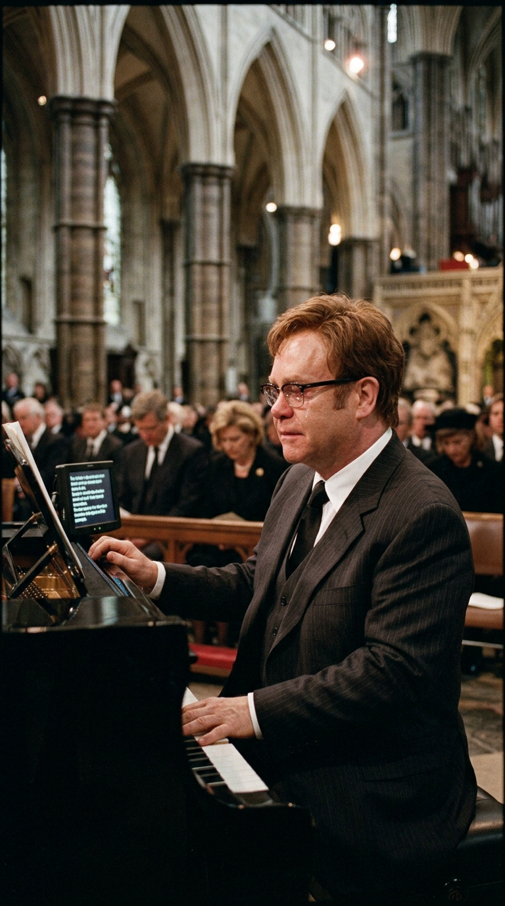
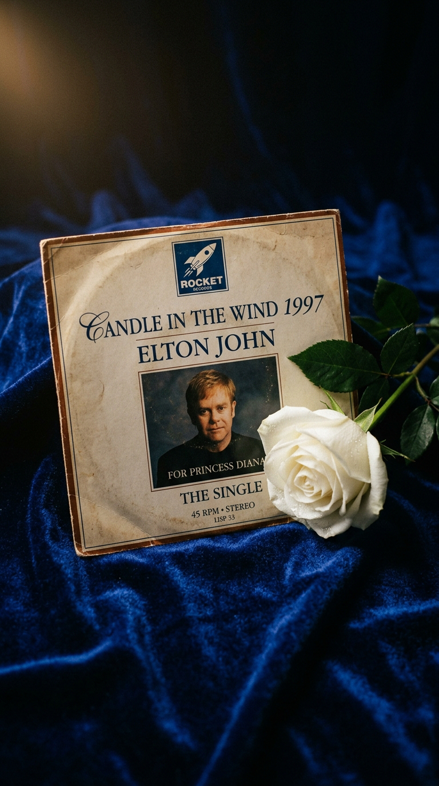
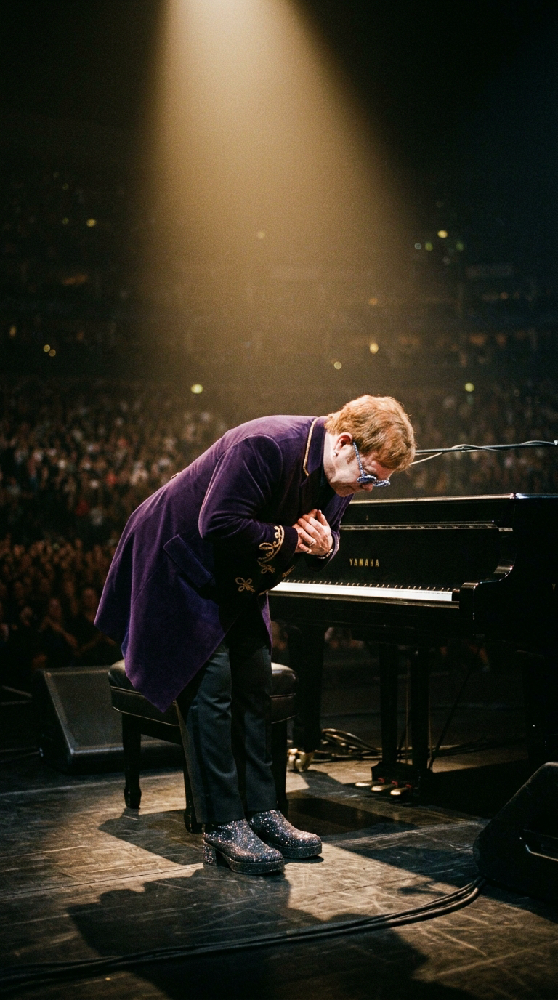

# La Canción Prohibida tras el Funeral del Siglo: El Voto Sagrado de Elton John y la Despedida a Lady Di

> *"Sabía que dos mil quinientos millones de personas estaban mirando por televisión. Si me permitía sentir el dolor, si dejaba que las lágrimas brotaran de mis ojos, mi garganta se cerraría por completo y no podría terminar la canción. Tuve que encerrar todas mis emociones en una caja de acero dentro de mi pecho, clavar la mirada en las notas pegadas al piano y cantar para mi amiga como si estuviéramos solos en la habitación."*  
> — **Elton John**, recordando el 6 de septiembre de 1997 en su autobiografía *Me* (2019).

---

## Prólogo: La Abadía y el Silencio de dos Mil Millones de Almas

La mañana del sábado 6 de septiembre de 1997, Londres no parecía pertenecer a este mundo. Las calles victorianas que rodean la Abadía de Westminster, habitualmente congestionadas por el tráfico y el bullicio metropolitano, estaban sumidas en un silencio espeso, casi sobrenatural, interrumpido únicamente por el tañido fúnebre de las campanas cada sesenta segundos y el sollozo ahogado de más de un millón de personas apretadas contra las vallas de seguridad. Sobre el carruaje de la Real Artillería a Caballo, cubierto por el estandarte real y una colina de lirios blancos con una carta que rezaba una sola palabra escrita a mano —*"Mummy"*—, avanzaba el féretro de Diana Spencer, Princesa de Gales.

*Abadía de Westminster, 6 de septiembre de 1997. Elton John frente al piano de cola: el instante en que la música popular se convirtió en el dolor de toda la humanidad.*

En el interior del templo gótico, entre reyes, primeros ministros, dignatarios internacionales y celebridades de todo el planeta, un hombre de cincuenta años con traje negro y gafas oscuras se sentaba frente a un piano de cola negro. Pocas veces en la historia de la civilización occidental un solo músico ha cargado sobre sus hombros semejante peso emocional: cantar en vivo para una audiencia televisiva global estimada en **dos mil quinientos millones de personas** —casi la mitad de la población del planeta Tierra en aquel momento— la despedida definitiva a la mujer más fotografiada, admirada y llorada del siglo XX.

Lo que sonó en los minutos siguientes fue *"Candle in the Wind 1997"* (*"Goodbye England's Rose"*). La canción rompería todos los récords comerciales imaginables hasta convertirse en el sencillo físico más vendido de todos los tiempos. Pero su destino definitivo fue mucho más asombroso: una vez que la última nota se extinguió bajo las bóvedas de piedra de Westminster, Elton John selló un voto sagrado de silencio que permanece intacto hasta el día de hoy.

---

## Acto I: De Norma Jeane a la Rosa de Inglaterra

Para comprender la magnitud de lo ocurrido en Westminster, es necesario viajar veinticuatro años hacia el pasado. En la primavera de 1973, Elton John y su letrista Bernie Taupin grabaron en el castillo francés de Hérouville su obra cumbre *Goodbye Yellow Brick Road*. Entre los surcos de aquel doble vinilo figuraba una balada majestuosa titulada *"Candle in the Wind"*.

*1973: Bernie Taupin concibe la metáfora original. 'Una vela al viento' no era una elegía de obituario, sino una denuncia contra la máquina que devora a las almas sensibles.*

Taupin no escribió la canción pensando exclusivamente en Marilyn Monroe (cuyo nombre civil, Norma Jeane Baker, abría el primer verso). La frase *"como una vela al viento"* se la había escuchado meses antes al productor Clive Davis al describir la trágica muerte por sobredosis de Janis Joplin a los veintisiete años. La canción era una meditación compasiva sobre la crueldad de la fama, la explotación implacable de los medios de comunicación y la fragilidad de aquellos seres luminosos a quienes el público idolatra pero nadie se detiene a proteger.

> *"Goodbye Norma Jeane,*  
> *Though I never knew you at all,*  
> *You had the grace to hold yourself*  
> *While those around you crawled..."*

*Marilyn Monroe: la primera encarnación de la metáfora. Una flor pisoteada por el engranaje del espectáculo cuya sombra alcanzaría a la realeza británica.*

Ni Elton ni Bernie sospechaban que, un cuarto de siglo más tarde, aquella misma elegía cobraría una vigencia escalofriante al proyectarse sobre el destino de la amiga más entrañable del cantante.

---

## Acto II: La Amistad Rota y el Reencuentro de Milán

Diana y Elton se conocieron en 1981, en la fiesta por el vigésimo primer cumpleaños del príncipe Andrés en el Castillo de Windsor. Ambos conectaron de inmediato con una complicidad eléctrica y desparpajada: bailaron Charleston en los salones de palacio, compartían un humor travieso y coincidían en una empatía desbordante hacia los marginados y los enfermos de sida en una época en que el estigma social era brutal.

*La Princesa de Gales: su carisma humano y su compasión por los desamparados forjaron con Elton John un lazo fraterno indestructible.*

Sin embargo, a principios de 1997, una agria disputa los distanció. Elton había publicado un libro benéfico de fotografías de moda de Gianni Versace (*Rock and Royalty*) cuyos beneficios iban destinados a la fundación contra el VIH. El Palacio de Kensington temió que la inclusión de fotos de la familia real junto a desnudos masculinos desatara un escándalo en la prensa sensacionalista británica, y Diana retiró abruptamente el prólogo que había prometido escribir, desatando una dolorosa frialdad entre ambos.

La reconciliación llegó en las circunstancias más desgarradoras posibles. El 15 de julio de 1997, el diseñador italiano Gianni Versace fue asesinado a tiros en Miami Beach. En el funeral celebrado en la catedral de Milán una semana después, Diana vio a Elton destrozado en una banca lateral. Se acercó a él, lo abrazó con ternura maternal, le secó las lágrimas con un pañuelo y susurró: *"Todo está bien, Elton. Estamos juntos en esto"*. La fotografía de ambos consolándose en la basílica italiana recorrió el mundo como el retrato definitivo de su afecto.

Seis semanas después, en la madrugada del domingo 31 de agosto de 1997, el Mercedes negro en el que viajaban Diana y Dodi Al-Fayed se estrelló contra el pilar número trece del túnel del Alma en París mientras intentaban escapar del acoso demencial de los paparazzi.

*Londres, septiembre de 1997: el duelo popular ante Kensington Palace. La nación exigía un tributo digno para la 'Princesa del Pueblo'.*

---

## Acto III: El Fax de California y la Letra de dos Horas

La muerte de Diana sumió a Elton John en un abismo de dolor y rabia. El Reino Unido y la Commonwealth entraron en un estado de conmoción colectiva sin precedentes en la era moderna. El empresario Richard Branson, amigo íntimo de Diana y de Elton, telefoneó al cantante para comentarle que la familia Spencer y el primer ministro Tony Blair consideraban que nadie en el mundo podía rendirle un tributo musical más conmovedor que él durante el funeral de Estado.

Elton aceptó el encargo, pero con una condición innegociable: no interpretaría una canción genérica. Necesitaba que la música hablara directamente al corazón del pueblo que lloraba a su princesa. Telefoneó de urgencia a Bernie Taupin, que se encontraba en su rancho de Santa Ynez, California:  
*"Bernie, tienes que reescribir 'Candle in the Wind'. El mundo la conocía a ella como nosotros conocíamos a Norma Jeane: una mujer perseguida hasta la muerte por las cámaras, pero que iluminó la vida de millones. Tienes que adaptarla para Diana, y tiene que ser ahora mismo"*.

*En menos de dos horas, Bernie Taupin completó la reescritura de la letra más leída y escuchada del siglo XX.*

Taupin se sentó frente a su máquina de escribir con el corazón encogido. En apenas ciento veinte minutos, con una inspiración que rozaba lo místico, completó el texto. Cada referencia a Hollywood y a la industria cinematográfica fue sustituida por versos de una belleza clásica y un dolor límpido:

> *"Goodbye England's rose,*  
> *May you ever grow in our hearts.*  
> *You were the grace that placed itself*  
> *Where lives were torn apart.*  
> *You called out to our country*  
> *And you whispered to those in pain.*  
> *Now you belong to heaven,*  
> *And the stars spell out your name..."*

El letrista envió el texto mecanografiado por fax a la residencia de Elton en Windsor. Cuando John leyó las líneas en el papel térmico que salía de la máquina, rompió a llorar desconsoladamente.

---

## Acto IV: La Prueba de Fuego en Westminster Abbey

El jueves 4 de septiembre, Elton John y el legendario productor de The Beatles, **Sir George Martin**, se reunieron en secreto en los Townhouse Studios de Londres. Martin compuso un arreglo sutil para cuarteto de cuerdas y un solo de flauta de madera que envolvía el piano de Elton con una solemnidad sacra.

La mañana del 6 de septiembre, cuando Elton subió al pequeño estrado donde descansaba el piano de cola en el crucero norte de la Abadía de Westminster, el aire se podía cortar con una cuchilla. El deán de Westminster, Wesley Carr, había tenido que vencer las reticencias iniciales de ciertos sectores conservadores de la Casa Real que consideraban inapropiado incluir una actuación de música pop en una liturgia anglicana formal.

*El temple de un titán: Elton fijó la mirada en la letra pegada con cinta al piano para evitar que el llanto le cerrara la garganta.*

Consciente de que un solo sollozo arruinaría la interpretación y provocaría un colapso emocional en la congregación, Elton recurrió a un truco desesperado de profesionalismo: le pidió al técnico que pegara la partitura y la letra con abundante cinta adhesiva negra directamente sobre el marco del atril de madera, justo encima de las teclas.

Durante los cuatro minutos que duró la interpretación, Elton jamás levantó la vista. No miró al ataúd cubierto de flores a pocos metros de él; no miró a los príncipes Guillermo y Enrique, de quince y doce años; no miró al príncipe Carlos ni a la reina Isabel II. Apretó los dientes, clavó los ojos en el papel y cantó con una voz firme, límpida, desgarradora y cargada de una ternura que atravesó los televisores de dos mil quinientos millones de hogares en los cinco continentes.

Al pronunciar el verso final —*"Your candle's burned out long before your legend ever will"*—, Elton soltó el pedal de resonancia, se puso de pie, inclinó la cabeza respetuosamente en una reverencia hacia el féretro de su amiga y caminó hacia su asiento con paso marcial. Solo al sentarse junto a su pareja David Furnish y a George Michael, sus manos comenzaron a temblar incontrolablemente.

---

## Acto V: El Récord Absoluto y las 38 Millones de Libras

La respuesta del público mundial fue un tsunami sin precedentes en la historia del comercio musical. A petición expresa de Elton John y la familia Spencer, el sello discográfico Rocket Records y PolyGram publicaron la grabación como un sencillo con fines benéficos, producido por Sir George Martin, con la versión clásica de *"Something About the Way You Look Tonight"* en la cara B.

*El sencillo físico más vendido de la historia: 33 millones de copias certificadas y más de 38 millones de libras donadas íntegramente a las causas de Diana.*

Las fábricas de prensado de discos de todo el planeta trabajaron veinticuatro horas al día los siete días de la semana para intentar satisfacer una demanda astronómica. La gente hacía filas de cuatro cuadras frente a las tiendas de discos de Londres, Nueva York, Tokio y Sídney. En su primer día de lanzamiento en el Reino Unido se vendieron seiscientas cincuenta mil copias; en su primera semana en los Estados Unidos superó los tres millones y medio de unidades.

El Libro Guinness de los Récords certificó oficialmente a *"Candle in the Wind 1997"* como **el sencillo físico más vendido de la historia de la música grabada desde el advenimiento de los rankings oficiales de ventas**, alcanzando la cifra estratosférica de **33 millones de copias vendidas en todo el mundo**.

Elton John no se quedó con un solo centavo de los derechos de autor, de las regalías mecánicas ni de los beneficios de distribución. Cada penique generado —una suma colosal que superó los **38 millones de libras esterlinas** (más de cincuenta millones de dólares)— fue transferido íntegramente al recién fundado *The Diana, Princess of Wales Memorial Fund*, financiando durante décadas el desminado de zonas de guerra en Angola y Camboya, la investigación contra el cáncer y el apoyo a niños huérfanos en todo el mundo.

---

## Epílogo: El Voto de Silencio

A pesar de las presiones multimillonarias de promotores de conciertos, cadenas de televisión y festivales benéficos que le rogaban que cantara *"Goodbye England's Rose"* en sus giras multitudinarias, Elton John tomó una decisión inquebrantable que enaltece su dignidad artística: selló un voto sagrado de no volver a interpretar jamás esa versión de la canción en directo.

*El voto de silencio: Elton juró que jamás volvería a cantarla en vivo, reservando sus notas para la memoria eterna de Diana.*

La canción fue excluida de todas sus giras mundiales posteriores, de sus álbumes en vivo y de la inmensa mayoría de sus discos de grandes éxitos comerciales. En su repertorio regular de conciertos, Elton continuó tocando la versión original de 1973 dedicada a Marilyn Monroe, pero la letra de *"Goodbye England's Rose"* quedó clausurada para siempre en el templo de Westminster.

*"Esa canción le pertenecía a Diana y a ese momento irrepetible de dolor de su país"*, explicaría Elton con serenidad años más tarde. *"Cantarla en un concierto de gira como un número de entretenimiento pop habría sido un acto de vulgaridad repugnante. Solo la volvería a cantar si sus hijos, Guillermo o Enrique, me lo pidieran personalmente en algún evento muy solemne de sus vidas. De lo contrario, descansará para siempre en Westminster"*.

Bajo las piedras milenarias de la abadía londinense, las notas de *"Goodbye England's Rose"* permanecen suspendidas como un incienso invisible. Nos recuerdan que, en medio de la vorágine de una industria a menudo desalmada y frívola, hubo un día en que un hombre y su piano se convirtieron en el corazón doliente del planeta entero para proclamar que el amor y la memoria verdadera son más fuertes que la muerte.

---

### 📚 Fuentes y Archivo Documental

1. **John, Elton** (2019). *Me: Elton John Official Autobiography*. Henry Holt and Company, Nueva York / Macmillan, Londres.
2. **Guinness World Records** (2007–2024). *Official Certification: Best-Selling Single of All Time (Physical Sales) — "Candle in the Wind 1997" (33 Million Copies)*. Guinness World Records Limited, Londres.
3. **The Diana, Princess of Wales Memorial Fund** (1998–2012). *Financial Statements and Charitable Grant Allocations: The Candle in the Wind Royalties Archive*. The Charity Commission for England and Wales.
4. **Martin, George** (2002). *Playback: An Illustrated Memoir*. Genesis Publications, Guildford, Surrey.
5. **Brown, Tina** (2007). *The Diana Chronicles*. Doubleday / Random House, Nueva York.
6. **BBC Broadcast Archives** (1997). *The Funeral of Diana, Princess of Wales: Live International Broadcast Master Tape, September 6, 1997*. British Broadcasting Corporation, Londres.
7. **The Times & The Guardian** (1997). *Hemeroteca Histórica del 1 al 10 de septiembre de 1997: Reportajes del Funeral de Estado y Ventas de Rocket Records*. Archivos Hemerográficos Nacionales del Reino Unido.
