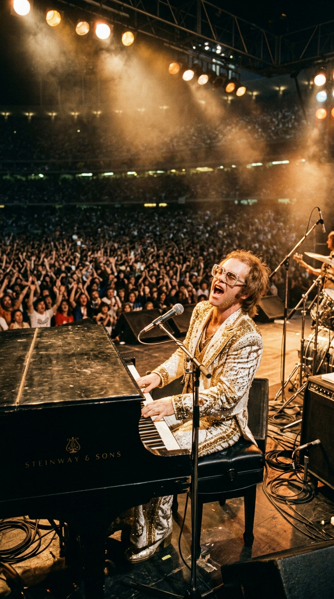
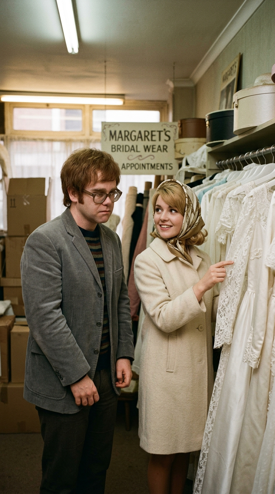
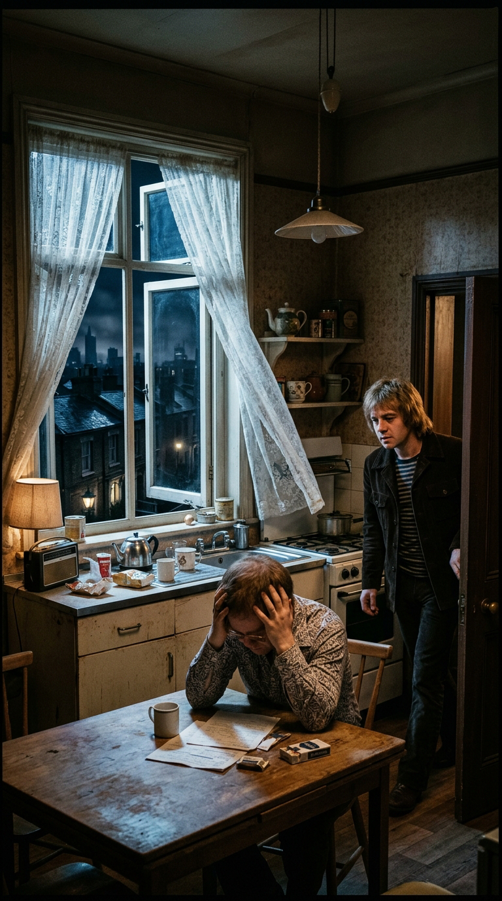
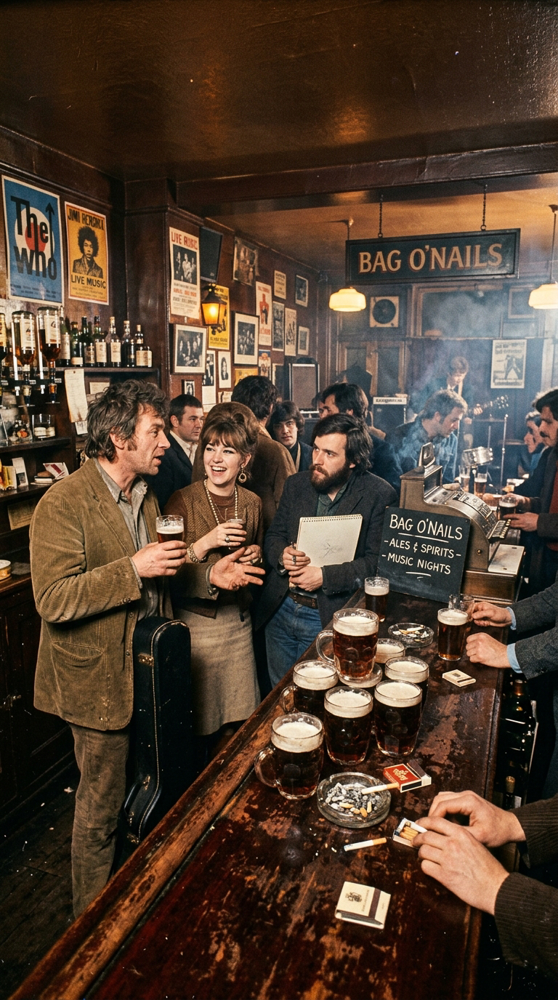
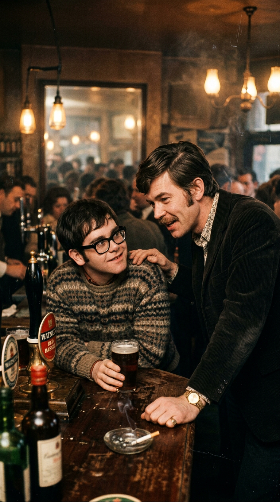
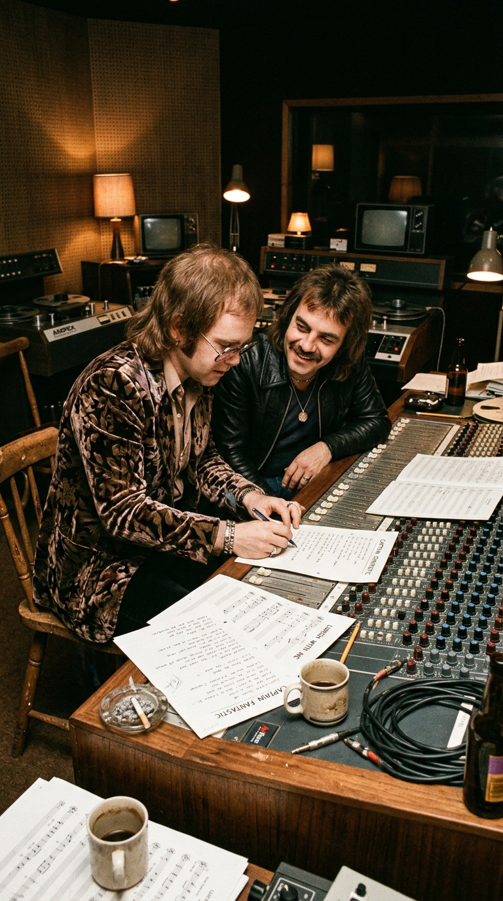
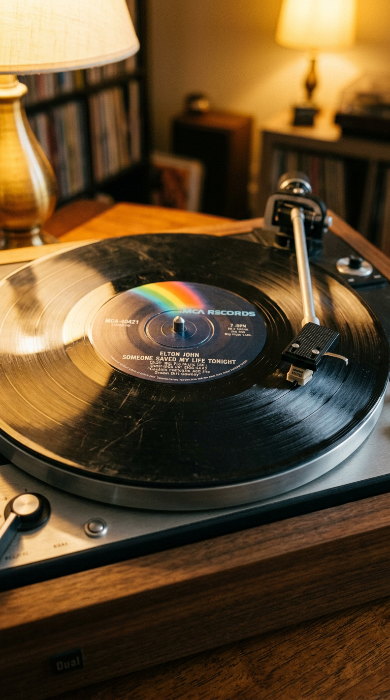

# El Rescate Secreto que Salvó a una Leyenda: Cómo Long John Baldry Evitó el Suicidio de Elton John

> *"Reggie, mírate al espejo. Eres gay. Si te casas con esa mujer vas a arruinar su vida y vas a destruir la tuya. Tienes un talento que solo se ve una vez en cada generación. Cancela esa maldita boda, sal de ese armario y dedícate a hacer lo que naciste para hacer: música."*  
> — **Long John Baldry** a un joven Reginald Dwight en el pub Bag O'Nails, Londres, 1968.

---

## Prólogo: La Máscara del Éxito y la Sombra del Pasado

A mediados de 1975, Elton John no era simplemente la mayor estrella de la música pop sobre la faz de la Tierra; era un fenómeno cultural que desafiaba la gravedad de la industria. Sus álbumes debutaban directamente en el número uno de las listas de Billboard —una hazaña jamás alcanzada hasta entonces por ningún solista blanco—, llenaba estadios de béisbol con más de cien mil personas vestido con trajes de lentejuelas y gafas de plumas de avestruz, y generaba, por sí solo, el dos por ciento de todas las ventas mundiales de discos del planeta.

*1975: Elton John en la cima del universo del pop. Pocos entre la multitud sospechaban que el hombre tras las gafas de diamantes estuvo a punto de no existir.*

Sin embargo, detrás de aquel torbellino de purpurina, pianos de cola voladores y estribillos eufóricos, latía un secreto doloroso que el artista guardaba bajo siete llaves en su pecho. Siete años antes de que el mundo coreara su nombre, en un oscuro y deprimente rincón de los suburbios de Londres, Elton John —entonces un desconocido pianista de veintiún años llamado Reginald Kenneth Dwight— estuvo a escasos centímetros de perder la vida por su propia mano.

En su obra cumbre autobiográfica de 1975, el álbum conceptual *Captain Fantastic and the Brown Dirt Cowboy*, Elton y su inseparable letrista Bernie Taupin decidieron, por primera vez, descorrer el telón y narrar con brutal honestidad aquel episodio fatídico. La canción resultante, una odisea melódica de casi siete minutos titulada *"Someone Saved My Life Tonight"*, permanece hoy como uno de los testimonios de gratitud, rescate y liberación personal más conmovedores en la historia del rock.

---

## Acto I: El Enredo de Mill Hill y la Asfixia de Reginald Dwight

Para comprender el abismo en el que se encontraba el futuro emperador del pop, es necesario viajar al año 1968. Reginald Dwight era entonces un muchacho tímido, con sobrepeso, marcado por una severa miopía y aplastado por el desprecio implacable de su padre, Stanley Dwight, un severo comandante de la Real Fuerza Aérea que consideraba que la música popular era una profesión indigna y afeminada.

Reggie sobrevivía como pianista acompañante en clubes nocturnos de mala muerte con la banda de blues Bluesology y como músico de sesión a sueldo en los estudios de Londres, ganando apenas doce libras a la semana grabando mañaneras versiones anónimas de éxitos de la radio. En medio de aquella precariedad, Dwight comenzó a salir con una secretaria rubia llamada Linda Woodrow. Al poco tiempo, la pareja alquiló un diminuto y gélido apartamento en el barrio periférico de Mill Hill.

*Londres, 1968. Reginald Dwight antes de ser Elton John: un joven acomplejado y temeroso, atrapado en una vida que amenazaba con anular su identidad.*

Empujado por la inercia, por el temor al qué dirán y por la desesperada necesidad de encajar en los moldes de la respetabilidad británica de la época, Reggie le propuso matrimonio a Linda. La maquinaria familiar se puso en marcha con una velocidad aterradora: se fijó la fecha de la boda, se enviaron las invitaciones, se contrataron los arreglos florales y la madre de Linda comenzó a elegir los muebles para el futuro hogar conyugal.

Para Reginald, cada día que pasaba era una soga que se ajustaba un milímetro más alrededor de su cuello. Sabía, en lo más profundo de sus entrañas, que su atracción hacia los hombres era una verdad innegable que no podía seguir enterrando; comprendía que el matrimonio convencional sería una farsa asfixiante que lo condenaría a una doble vida miserable; y sentía que el sueño sagrado de componer canciones junto a su joven amigo poeta Bernie Taupin —a quien acababa de conocer por un anuncio en el semanario *NME*— moriría aplastado bajo la rutina de un empleo de oficina en un banco.

*El compromiso forzado: el matrimonio burgués se cernía sobre Reggie como una condena de muerte para su creatividad.*

---

## Acto II: El Horno de Gas y la Ventana Abierta

El pánico se transformó en una depresión negra e insoportable. Una mañana de finales de 1968, incapaz de soportar el peso de las expectativas ajenas y convencido de que su existencia era un estorbo para todos, Reginald Dwight decidió poner fin a su vida.

Entró en la estrecha cocina del apartamento de Mill Hill, abrió las llaves del horno de gas tradicional, colocó un cojín de lana en el suelo frente al artefacto y apoyó la cabeza en su interior esperando que el monóxido de carbono hiciera su trabajo silencioso.

*La cocina de Mill Hill: el dramatismo de un joven desesperado chocó con el aire frío de una ventana que salvó su destino.*

Un par de horas más tarde, Bernie Taupin llegó al apartamento para una de sus sesiones habituales de trabajo. Al entrar a la cocina, el letrista se encontró con una escena que oscilaba de manera casi surrealista entre la tragedia más desgarradora y la comedia involuntaria británica: Reggie estaba tendido en el suelo sobre el cojín, profundamente mareado por el hedor a gas pero completamente vivo. En su desesperación y torpeza juvenil, Dwight había olvidado un detalle fundamental: había dejado de par en par la ventana de la cocina, permitiendo que una corriente fresca de aire matinal disipara el veneno.

Taupin ayudó a incorporarse a su amigo, abrió todas las puertas del apartamento y se sentó a su lado en el suelo. Reggie lloraba como un niño desconsolado, repitiendo una y otra vez que estaba atrapado en un laberinto sin salida, que no podía casarse con Linda pero que carecía del coraje para decírselo en la cara y cancelar la ceremonia a dos semanas de la fecha pactada.

Bernie sabía que sus palabras de aliento no bastarían. Para arrancar a Reginald de aquella trampa mortal, se necesitaba una autoridad moral gigantesca; alguien a quien Reggie reverenciara y temiera a partes iguales.

---

## Acto III: El Juicio del "Oso de Azúcar" en el Soho

Aquella misma noche, Bernie y Reggie se dirigieron al corazón del Soho londinense, al legendario pub y club nocturno **Bag O'Nails** en Kingly Street, un santuario bohemio frecuentado por The Beatles, Jimi Hendrix y The Who.

Allí los esperaba el líder de la banda Bluesology: **Long John Baldry**. Con sus imponentes dos metros y un centímetro de estatura (seis pies y siete pulgadas), su voz cavernosa de barítono y su porte señorial de dandi eduardiano, Baldry era una de las figuras más carismáticas e influyentes de la escena musical inglesa. Había sido el mentor de un jovencísimo Rod Stewart (a quien descubrió cantando en una estación de tren) y acogía a Dwight bajo su ala con un cariño casi paternal.

*El pub Bag O'Nails en el Soho: el santuario bohemio donde se selló la salvación de una de las mayores voces del siglo XX.*

A diferencia de la mayoría de los hombres de su generación en una Inglaterra donde la homosexualidad apenas acababa de ser despenalizada en 1967, Baldry era un hombre abiertamente gay en su círculo íntimo, despojado de complejos y con una visión del mundo libre de pacaterías burguesas.

Tras escuchar el relato tartamudeante y vergonzoso de Reggie entre pintas de cerveza tibia, Long John Baldry se inclinó sobre la pequeña mesa de madera, clavó sus ojos penetrantes en el rostro angustiado del muchacho y desató una reprimenda demoledora que cambiaría la historia de la música popular para siempre.

*Long John Baldry ('Sugar Bear'): con dos metros de estatura y una franqueza demoledora, le ordenó a Reggie despertar y asumir su destino.*

*"¡Reggie, por el amor de Dios, deja de comportarte como un idiota cobarde!"*, rugió Baldry, golpeando la mesa con la palma de la mano. *"Mírate al espejo. No amas a esa muchacha. Eres homosexual, Reggie. Todos tus amigos lo sabemos y a nadie le importa un comino. Pero si sigues adelante con esta farsa para complacer a tu familia o a sus parientes, vas a condenar a Linda a un infierno y te vas a matar de verdad en menos de dos años. Tienes en los dedos un don que solo Dios le entrega a un puñado de seres humanos por siglo. Ahora mismo vas a ir a ese apartamento, le vas a decir la verdad, vas a cancelar esa maldita boda y vas a empezar a escribir canciones con Bernie. ¿Me has oído? ¡No te vas a casar!"*.

Aquellas palabras, pronunciadas sin filtros pero con un amor infinito, actuaron como una bofetada de realidad que rompió el hechizo del miedo. Reginald Dwight sintió que una losa de diez toneladas se desprendía de sus espaldas.

A la mañana siguiente, con el apoyo incondicional de Taupin y Baldry, Reggie habló con Linda, asumió el dolor de la ruptura, pagó las deudas del vestido de novia y abandonó el apartamento de Mill Hill llevando únicamente una maleta raída y su colección de discos. Reginald Dwight había muerto en aquella cocina; en su lugar, libre de cadenas y dueño de su verdad, comenzaba a respirar **Elton John**.

*La mañana de la libertad: tras romper el compromiso, Reggie camina ligero hacia el estudio, listo para renacer bajo un nuevo nombre.*

---

## Acto IV: La Creación de una Catedral Autobiográfica

Siete años después de aquella noche salvadora en el Soho, en el invierno de 1974 y 1975, Elton John y Bernie Taupin se recluyeron en los estudios **Caribou Ranch**, en lo alto de las montañas nevadas de Nederland, Colorado, para registrar el álbum más ambicioso y personal de sus vidas: *Captain Fantastic and the Brown Dirt Cowboy*.

El disco fue concebido como una crónica conceptual cronológica que narraba, canción por canción, las penurias, fracasos, humillaciones y victorias de ambos autores entre 1967 y 1969, antes de su explosión en el Troubadour de Los Ángeles en 1970. Cuando llegó el turno de abordar el intento de suicidio y el rescate de Long John Baldry, Bernie Taupin le entregó a Elton un texto desgarrador, lleno de sarcasmo protector y poesía confesional.

*Caribou Ranch, Colorado, 1975: Elton John y Bernie Taupin dando vida a los casi siete minutos de 'Someone Saved My Life Tonight'.*

Elton se sentó al piano de cola Steinway y concibió una de las estructuras armónicas más complejas, ricas y dinámicas de su repertorio. La canción, que se extiende a lo largo de seis minutos y cuarenta y cinco segundos, no sigue el formato radial predecible de verso-estribillo. Es una suite dramática donde el piano percutivo de Elton, la guitarra acústica de Davey Johnstone, el bajo elástico de Dee Murray y la batería explosiva de Nigel Olsson construyen una tensión ascendente que desemboca en un grito de alivio colosal:

> *"You almost had your hooks in me, didn't you dear?*  
> *You had me pegged and you had me groomed for a bride.*  
> *Bitten by the wire that made me roll and bleed...*  
> *Someone saved my life tonight, sugar bear!*  
> *Someone saved my life tonight, yielding you'll remain.*  
> *And I thank God my music's still alive!"*  
>  
> *(Casi tuviste tus ganchos clavados en mí, ¿verdad, querida?*  
> *Me tenías atrapado y preparado para ser un novio.*  
> *Mordido por el alambre que me hacía rodar y sangrar...*  
> *¡Alguien salvó mi vida esta noche, oso de azúcar!*  
> *Alguien salvó mi vida esta noche...*  
> *¡Y le doy gracias a Dios de que mi música siga viva!)*

El apodo cariñoso **"Sugar Bear"** (*oso de azúcar*) que resuena en el coro con una fuerza apoteósica era el homenaje público y eterno de Elton a Long John Baldry: el gigante bonachón que con su ternura y rudeza le había devuelto el derecho a respirar.

---

## Acto V: El Triunfo de la Vida y la Gratitud Eterna

Cuando el sencillo de *"Someone Saved My Life Tonight"* llegó a las radios en junio de 1975, los programadores temieron que su inusual duración de casi siete minutos ahuyentara a los oyentes. La respuesta popular fue arrolladora: la canción escaló hasta el puesto número cuatro del Billboard Hot 100 en los Estados Unidos, convirtiéndose en uno de los sencillos más extensos en alcanzar los primeros puestos en la historia de la radio comercial.

*El vinilo de MCA Records de 1975: una confesión grabada en cera que convirtió una herida secreta en un himno universal de supervivencia.*

Elton John jamás olvidó la deuda sagrada que tenía con Long John Baldry. A lo largo de las décadas siguientes, cuando la carrera de Baldry sufrió reveses económicos y problemas de salud, Elton financió discretamente sus tratamientos médicos, produjo álbumes para él y se aseguró de que su mentor viviera con dignidad hasta su fallecimiento en 2005.

*"Si Long John Baldry no se hubiera sentado en aquella mesa del Bag O'Nails aquella noche, yo no estaría aquí"*, declaró Elton John en sus memorias oficiales *Me* (2019). *"Habría terminado casado con una mujer maravillosa a la que habría destrozado el corazón, probablemente me habría suicidado de verdad unos años más tarde, y el mundo jamás habría escuchado 'Your Song', 'Rocket Man' ni 'Tiny Dancer'. Un amigo que te dice la verdad que no quieres oír, en el momento exacto en que necesitas oírla, es el regalo más grande que la vida te puede dar"*.

---

## Epílogo: La Canción del Hombre que Sobrevivió a Sí Mismo

Cincuenta años después de su lanzamiento, *"Someone Saved My Life Tonight"* sigue erizando la piel de quien la escucha con atención. En un mundo donde la presión por encajar en las expectativas de la familia, la sociedad o las convenciones asfixiantes empuja a tantas personas al borde de la desesperación silenciosa, la historia de Reginald Dwight es un faro de esperanza.

La canción nos recuerda que no hay trampa tan profunda ni laberinto tan oscuro del que no se pueda salir si encontramos el valor de mirar a nuestra verdad a los ojos; que a veces se necesita tocar fondo para comprender que la vida merece ser defendida con uñas y dientes; y que, por encima de todos los honores y riquezas del mundo, no hay melodía más sagrada sobre la Tierra que el latido de un corazón que ha conquistado su propia libertad.

---

### 📚 Fuentes y Archivo Documental

1. **John, Elton** (2019). *Me: Elton John Official Autobiography*. Henry Holt and Company, Nueva York / Pan Macmillan, Londres.
2. **Rosenthal, Elizabeth J.** (2001). *His Song: The Musical Journey of Elton John*. Billboard Books / Watson-Guptill Publications, Nueva York.
3. **Taupin, Bernie** (1977). *The One Who Writes the Words for Elton John: Complete Lyrics from 1968 to 1976*. Jonathan Cape, Londres.
4. **Norman, Philip** (1991). *Elton John*. Fireside / Simon & Schuster, Nueva York.
5. **Connolly, Ray** (1976). *John Lennon and Elton John: Conversations in New York*. Evening Standard Archives.
6. **Liner Notes Oficiales** (1975). *Captain Fantastic and the Brown Dirt Cowboy*. MCA Records / DJM Records (MCA-2142).
7. **BBC Radio 1 Archives** (1975). *Elton John on The Story of Captain Fantastic, interviewed by Paul Gambaccini*. British Broadcasting Corporation.
