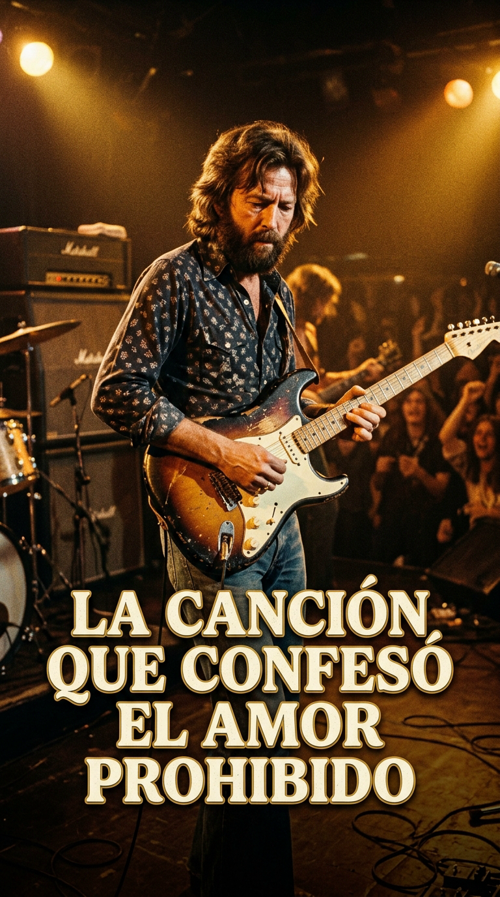
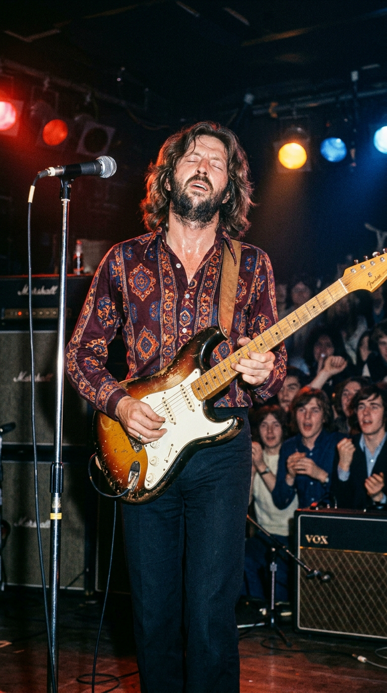
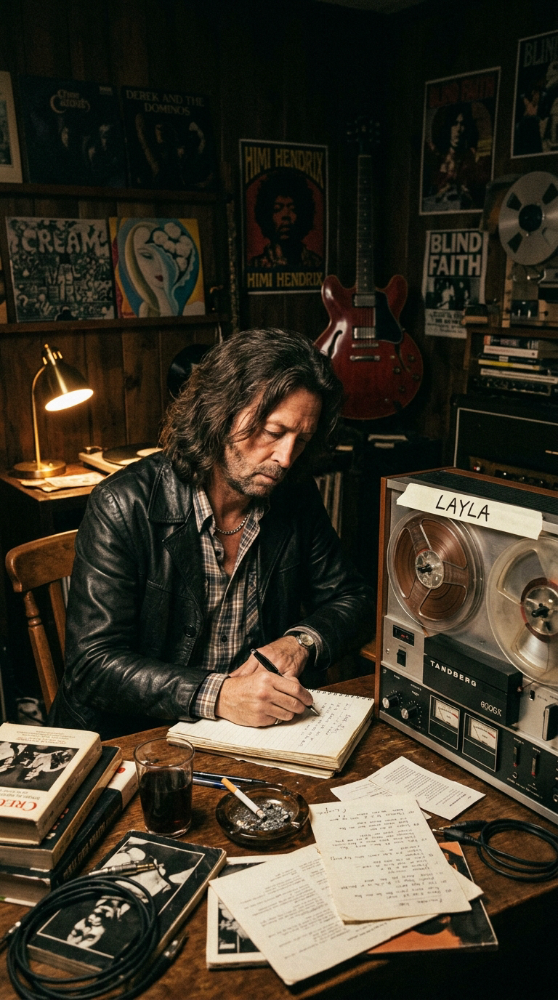
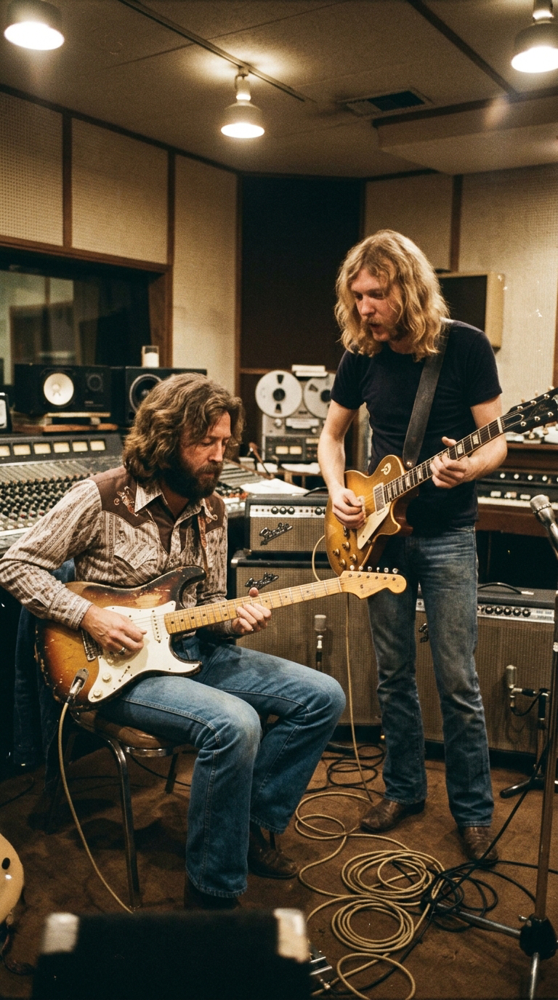
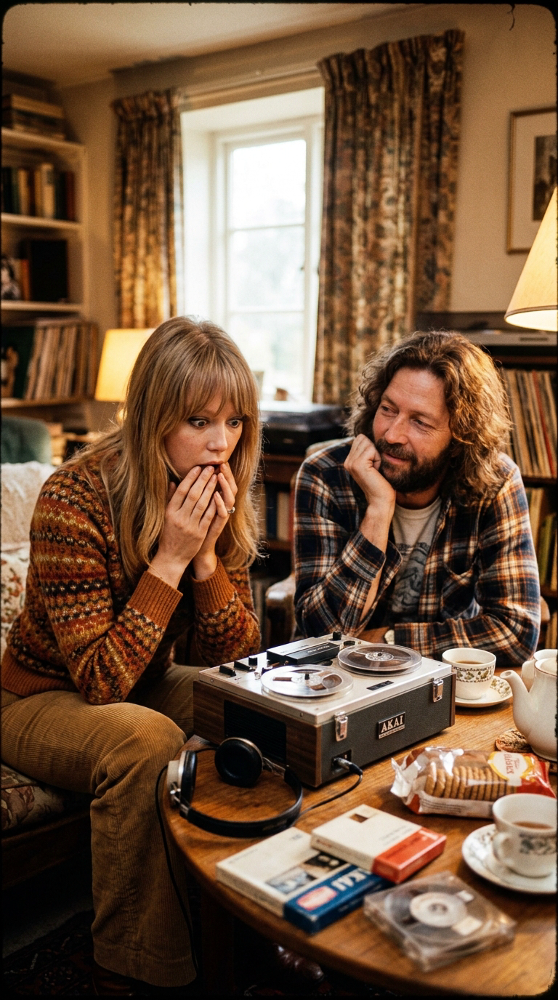
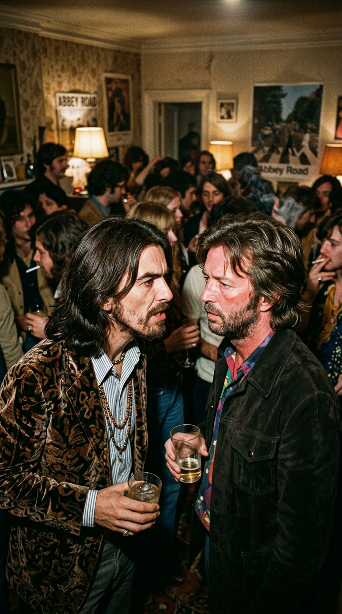
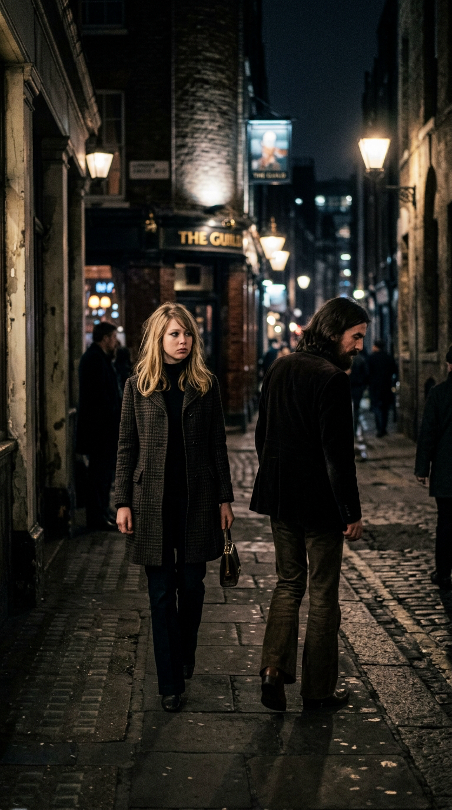
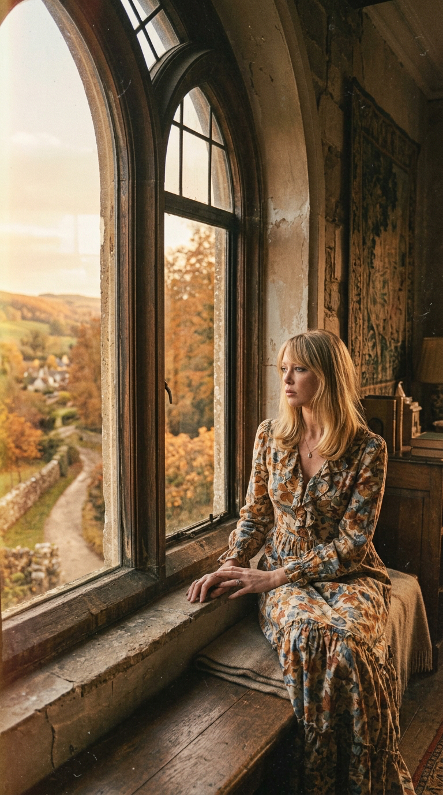
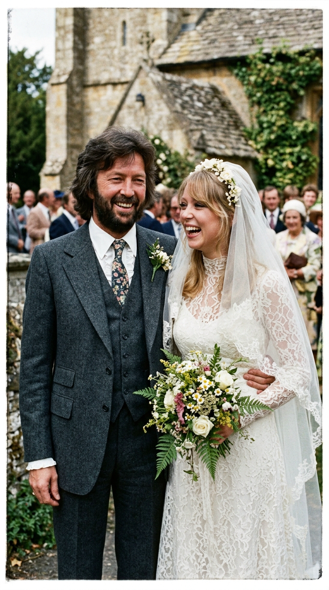
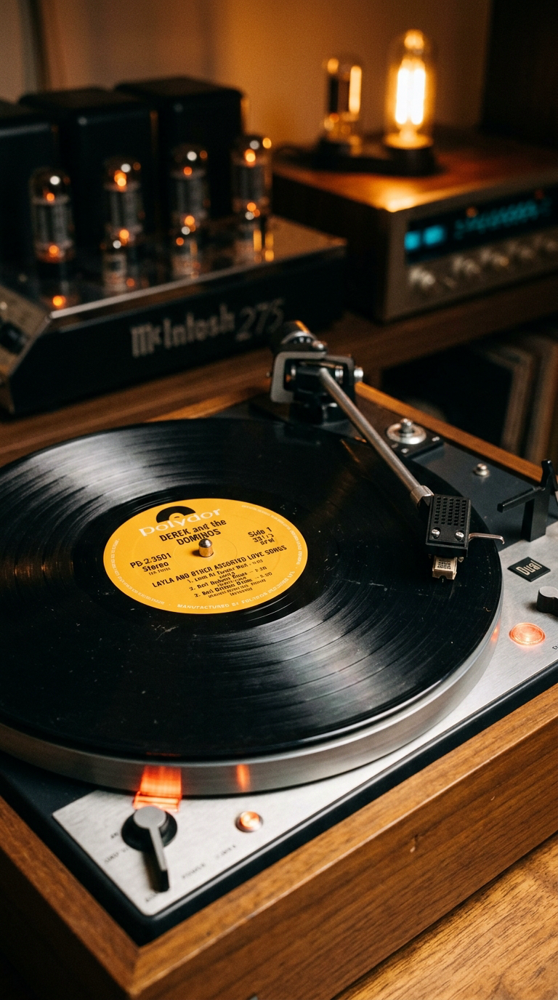

# 💔 La Canción que Confesó el Amor Prohibido: Eric Clapton, George Harrison y el Tormento de Layla
### *Cómo la obsesión secreta por la esposa de su mejor amigo, un poema persa del siglo XII y el duelo de guitarras con Duane Allman forjaron la declaración de amor más desgarradora y peligrosa en la historia del rock.*

---

**Por la redacción de Acordes Ocultos**  
*Tiempo de lectura estimado: 10 minutos*

---

### Prólogo: El hombre que lo tenía todo y no poseía nada

A finales de 1969, los muros de los callejones de Londres amanecían decorados con un grafiti reverencial que resumía la devoción de toda una generación: *«Clapton is God»* («Clapton es Dios»). Con apenas veinticuatro años, **Eric Clapton** había alcanzado la cima técnica y comercial de la música internacional tras liderar The Yardbirds, John Mayall & the Bluesbreakers, el supergrupo Cream y Blind Faith. Era millonario, reverenciado universalmente por su virtuosismo con la guitarra eléctrica y dueño de Hurtwood Edge, una imponente mansión señorial en las colinas de Surrey.

*1970: Eric Clapton empuñando su Fender Stratocaster «Brownie», sumido en un dolor personal devastador.*

Sin embargo, detrás de las puertas de roble de su finca, Clapton se consumía en un infierno privado de heroína, alcohol y soledad. La adoración de las masas no podía llenar un vacío desgarrador: el guitarrista más aclamado del planeta estaba irremediable, desesperada y clandestinamente enamorado de la única mujer a la que jamás debía tocar.

Su nombre era **Pattie Boyd**: una de las modelos más hermosas del *Swinging London*, musa de la minifalda y el icono estético de la contracultura británica. Pero había un obstáculo sagrado e insalvable: Pattie era la esposa legítima de **George Harrison**, el guitarrista de The Beatles y el amigo más íntimo, generoso y leal que Clapton tenía sobre la faz de la Tierra.

---

### Acto I: El espejo de Majnún y el nombre en clave

La amistad entre Eric Clapton y George Harrison era un vínculo fraternal forjado en el respeto artístico mutuo. Fue Harrison quien invitó a Clapton a los estudios Abbey Road en 1968 para grabar el legendario solo de guitarra de *«While My Guitar Gently Weeps»*, y fue en la mansión de George, Kinfauns, donde Eric comenzó a frecuentar la cotidianidad de la pareja.

Con el paso de los meses, la admiración de Eric hacia la belleza etérea y la dulzura de Pattie se transformó en una obsesión incontrolable. Mientras el matrimonio entre George y Pattie se erosionaba lentamente debido a las infidelidades del Beatle y su inmersión monástica en la espiritualidad hindú, Clapton se convertía en el confidente secreto de la modelo. Cada mirada compartida, cada té en la cocina y cada conversación telefónica alimentaban un fuego clandestino que devoraba la cordura del guitarrista.

*1970: En la soledad de Hurtwood Edge, Clapton recurre a las cintas de bobina para desahogar un amor que no se atrevía a pronunciar.*

A principios de 1970, un amigo común, Ian Dallas, le regaló a Clapton una traducción al inglés del romance persa del siglo XII *Layla y Majnún*, obra inmortal del poeta sufí **Nezami Ganjavi**. La historia narraba la tragedia de un joven poeta árabe llamado Qays que se enamoraba con tal devoción mística de una hermosa doncella llamada Layla que, al ser rechazado por el padre de ella y obligado a permanecer separado de su amada, perdía el juicio y se retiraba al desierto a vivir entre bestias salvajes, ganándose el apodo de *Majnún* («el loco poseído»).

Al devorar los versos persas, Clapton se derrumbó conmovido hasta las lágrimas. Se vio reflejado en el alma de Majnún: él era el loco desterrado que moría de sed frente a un oasis prohibido. En un rapto de inspiración catártica, comprendió que había encontrado la llave para desahogar su tormento sin destruir públicamente a su amigo: bautizaría a Pattie Boyd con el nombre en clave de **Layla**.

---

### Acto II: Criteria Studios y el tornado de Duane Allman

Deseoso de escapar del acoso mediático de Londres y buscando esconderse tras el anonimato de un seudónimo colectivo, Clapton huyó a los Estados Unidos y fundó una banda sin su apellido en los créditos: **Derek and the Dominos**, reclutando al teclista Bobby Whitlock, al bajista Carl Radle y al baterista Jim Gordon.

En agosto de 1970, la banda se atrincheró en los **Criteria Studios** de Miami, Florida, bajo las órdenes del legendario productor **Tom Dowd**. Las primeras sesiones fueron un desastre denso y atascado, dominado por el consumo desmedido de cocaína y heroína. La banda tocaba con pesadez y Clapton no lograba traducir en sonido el aullido que le desgarraba el pecho.

El milagro se produjo cuando Tom Dowd se llevó a Clapton a un concierto al aire libre en Miami de una emergente banda sureña: **The Allman Brothers Band**. Al contemplar el fraseo lírico, incisivo y ardiente de su joven guitarrista, **Duane Allman**, tocando la técnica del slide con una botella de medicina de cristal Coricidin en el dedo anular, Clapton quedó boquiabierto. Aquella misma noche, Eric invitó a Allman a unirse a las sesiones de grabación en Criteria.

*Agosto de 1970 en Miami: Eric Clapton y Duane Allman entrelazan sus guitarras en una histórica sesión de improvisación analógica.*

La química entre ambos fue una explosión cósmica. Duane Allman tomó el patrón rítmico básico que Clapton había esbozado —inspirado a su vez en una frase vocal de Albert King en *«As the Years Go Passing By»*— y le imprimió una velocidad electrizante. El mítico riff de cinco notas iniciales, atacado con violencia en Re menor, no era una simple melodía de blues: sonaba como un clarín de guerra, como la sirena de una ambulancia corriendo hacia un accidente fatal.

En jornadas maratónicas de dieciocho horas, Clapton (con su Stratocaster *Brownie*) y Allman (con su Gibson Les Paul) sobregrabaron hasta seis pistas simultáneas de guitarras que se perseguían, se mordían, armonizaban y lloraban al unísono. La voz de Clapton, desgarrada por los nódulos y el dolor real, se desgañitaba frente al micrófono suplicando misericordia:

> *«What'll you do when you get lonely  
> And nobody's waiting by your side?  
> You've been running and hiding much too long  
> You know it's just your foolish pride...  
> Layla, you've got me on my knees  
> Layla, I'm begging, darling, please  
> Layla, darling won't you ease my worried mind?»*

---

### Acto III: El té en South Kensington y la confesión a George Harrison

A finales de septiembre de 1970, con la cinta de dos pulgadas recién prensada en un acetato de prueba, Eric Clapton aterrizó en Londres. No le importaban las ventas de discos ni los contratos comerciales: la única persona en el planeta para la que había grabado aquella música debía escucharla antes de que saliera a la luz.

Clapton telefoneó a Pattie Boyd y la citó de urgencia en un piso señorial del barrio londinense de South Kensington para tomar el té a solas. Cuando la joven modelo se sentó en el sofá, Eric no pronunció palabra. Encendió un magnetófono de bobina abierta y le dio al play.

*Septiembre de 1970: Pattie Boyd sentada frente a la grabadora de cinta, descubriendo en estado de shock que ella era Layla.*

Pattie recordaría aquel instante en su autobiografía *Wonderful Tonight* (2007) como uno de los momentos más aterradores y abrumadores de su vida:

> —*«Me puso la canción dos o tres veces seguidas. La escuché con el corazón encogido en la garganta. Era la música más desgarradora, poderosa e intensa que jamás había oído. Pero al mismo tiempo me invadió un terror absoluto. Me di cuenta de inmediato de que cada verso, cada quejido de la guitarra y cada palabra estaban dirigidos a mí. Sentí que me estaban desnudando en medio de una multitud. Pensé: 'Dios mío, todo el mundo va a saber que esto va sobre mí. ¿Qué va a pasar con George?'»*.

Aquella misma noche se celebraba una fiesta multitudinaria en la mansión de Hurtwood Edge del productor cinematográfico y mánager Robert Stigwood. George Harrison llegó tarde al evento y comenzó a buscar a su esposa por los salones atestados de humo. Al caminar hacia el jardín exterior, George divisó dos siluetas recortadas en la penumbra de un balcón: eran Pattie y Eric hablando en susurros íntimos.

*Otoño de 1970: George Harrison confronta directamente a Eric Clapton en una velada de altísima tensión humana.*

Harrison se acercó con paso firme y preguntó con frialdad británica:
—*«¿Qué demonios está pasando aquí?»*.

Clapton, harto de mentir y empujado por la valentía trágica del alcohol y la desesperación, no retrocedió ni bajó la mirada. Miró fijamente a los ojos de su mejor amigo y soltó la confesión que dinamitó los cimientos del rock:
—*«Tengo que decírtelo, George: estoy enamorado de tu esposa»*.

El silencio que siguió en la habitación fue gélido como un páramo polar. George, con el orgullo destrozado pero manteniendo una compostura aristocrática, no levantó los puños. Se giró lentamente hacia Pattie y le planteó un ultimátum inapelable:
—*«¿Y bien? ¿Te vas con él o vienes conmigo a casa?»*.

Pattie, aterrorizada por el escándalo público, confundida en sus sentimientos y atada por los votos matrimoniales, bajó la cabeza y respondió con un susurro:
—*«Me voy contigo, George»*.

*La noche de la decisión: Pattie Boyd camina hacia el automóvil junto a George, dejando a Clapton sumido en el abismo.*

---

### Acto IV: La coda del piano robado y los años del abismo

El rechazo de Pattie empujó a Eric Clapton a las profundidades de un abismo que duró más de tres años. Encerrado en Hurtwood Edge, llegó a gastar miles de libras a la semana en heroína pura, negándose a salir de su dormitorio y considerando el suicidio como la única salida a su tormento.

Sin embargo, antes de que el disco saliera al mercado, la canción *«Layla»* experimentó una mutación final milagrosa. Durante los descansos de las sesiones en Miami, el baterista **Jim Gordon** solía sentarse al piano del estudio a tocar una melodía clásica melancólica, nostálgica y reposada (una pieza instrumental que, según revelaría la historia años más tarde, había sido coescrita por su entonces novia, la cantautora **Rita Coolidge**, aunque los créditos oficiales jamás se la reconocieron formalmente).

A Clapton le fascinó el contraste dramático de aquella melodía de piano: era el bálsamo perfecto para cerrar la carnicería eléctrica del tema. Convenció a Gordon de grabarla e injertarla a continuación de la sección de rock. Durante tres minutos y medio, el piano de Gordon y Bobby Whitlock, arropado por el slide agudo de Duane Allman —que emulaba el graznido solitario de las gaviotas sobre un océano en calma—, transformó una queja furiosa en una elegía inmortal.

*1974: En los jardines de Friar Park, el matrimonio de Pattie y George se apaga mientras el himno resuena en las radios de todo el mundo.*

El álbum doble **Layla and Other Assorted Love Songs** salió a la venta en noviembre de 1970. En sus inicios fue un fracaso de ventas desconcertante: sin el nombre de Clapton en la portada, el público no entendió el proyecto. Trágicamente, un año después, el 29 de octubre de 1971, Duane Allman falleció en un accidente de motocicleta con solo veinticuatro años, sellando la leyenda trágica de la banda.

---

### Epílogo: La boda de 1979 y la victoria de la amistad

El destino, sin embargo, tenía guardado un giro insólito que desarmó cualquier cliché sobre el odio y la venganza. En 1974, desgastado por años de distanciamiento y dolor mutuo, el matrimonio de George Harrison y Pattie Boyd llegó a su fin definitivo mediante un divorcio cordial. Poco después, liberada de sus ataduras, Pattie aceptó finalmente los brazos de Eric Clapton.

El 27 de marzo de 1979, tras casi una década de espera tortuosa, Eric Clapton y Pattie Boyd contrajeron matrimonio en una ceremonia civil en Tucson, Arizona, seguida de una gran celebración en Hurtwood Edge.

*1979: Eric Clapton y Pattie Boyd celebran su matrimonio tras una década de tormenta, con la bendición fraternal de George Harrison.*

Lo verdaderamente extraordinario no fue la boda, sino quién estuvo en ella: en el escenario montado en el jardín para festejar la unión, el propio **George Harrison** subió a tocar la guitarra y cantar junto a Eric Clapton, Paul McCartney y Ringo Starr. Harrison, que solía referirse afectuosamente a Clapton como su *«husband-in-law»* («esposo político»), entendió que la música y el amor genuino estaban por encima de las mezquindades humanas:

> —*«Prefiero mil veces que Pattie esté con alguien a quien amo como a un hermano, que con un imbécil cualquiera»*, declararía Harrison con impecable nobleza espiritual.

*El histórico vinilo de Derek and the Dominos: el monumento definitivo a la transmutación del dolor prohibido en belleza eterna.*

*«Layla»* se erige hoy como la cumbre del blues-rock moderno: una obra monumental nacida de las entrañas de la culpa, la cobardía y el deseo prohibido, que demostró que el verdadero arte no juzga a los hombres por sus debilidades, sino que redime sus heridas convirtiendo el infierno en una plegaria universal.

---

### 📚 Fuentes y Archivo Documental

* **Clapton, Eric**: *Clapton: The Autobiography* (Broadway Books, 2007). Memorias oficiales del músico, detallando minuciosamente su obsesión por Pattie Boyd, la lectura del poema sufí de Nezami y la confesión directa a George Harrison.
* **Boyd, Pattie & Penny Junor**: *Wonderful Tonight: George Harrison, Eric Clapton, and Me* (Harmony Books, 2007). Testimonio testimonial en primera persona sobre la audición secreta del té en Londres y el impacto psicológico del tema.
* **Harrison, George**: *I Me Mine* (Genesis Publications, 1980 / Chronicle Books, 2002). Reflexiones autobiográficas sobre su amistad con Clapton y su visión espiritual del divorcio con Pattie.
* **Dowd, Tom**: Entrevistas históricas y archivos de producción en *Tom Dowd & The Language of Music* (Documental biográfico dirigido por Mark Moormann, 2003).
* **Coolidge, Rita & Michael Walker**: *Delta Lady: A Memoir* (HarperCollins, 2016). Documentación sobre la autoría no acreditada de la coda de piano de la canción.
* **Ganjavi, Nezami**: *The Story of Layla and Majnun* (Traducción clásica al inglés de Rudolf Gelpke, Bruno Cassirer Publishers, 1966). Obra literaria persa que sirvió de base conceptual directa a la lírica del álbum.
* **Rolling Stone Magazine Archive**: Reseña y cobertura retrospectiva del álbum *Layla and Other Assorted Love Songs* (Edición especial *The 500 Greatest Songs of All Time*).
