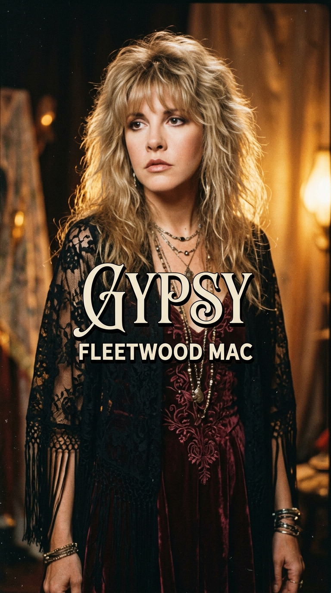
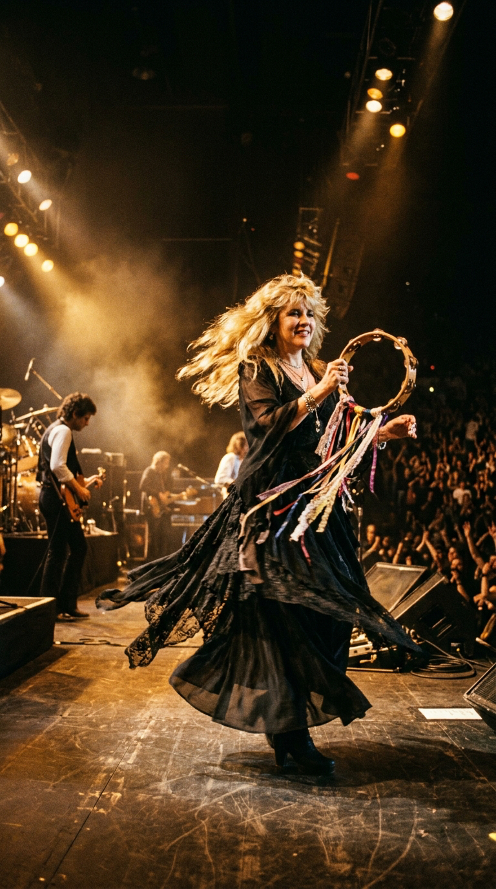
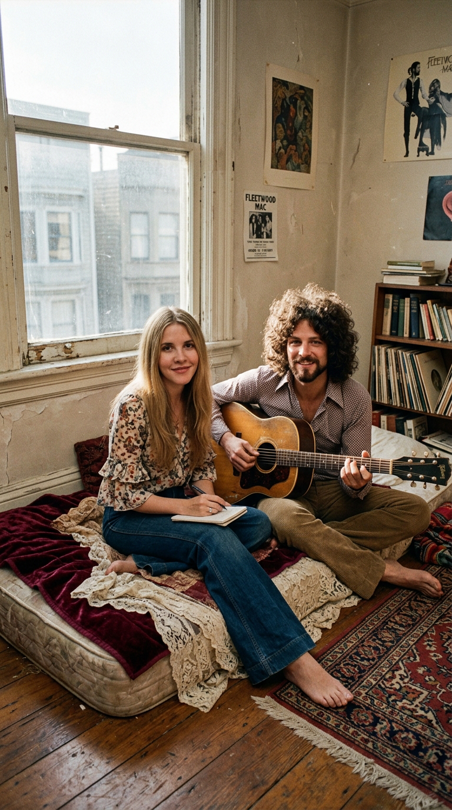
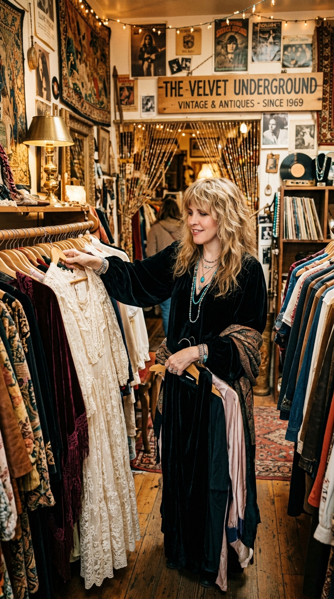
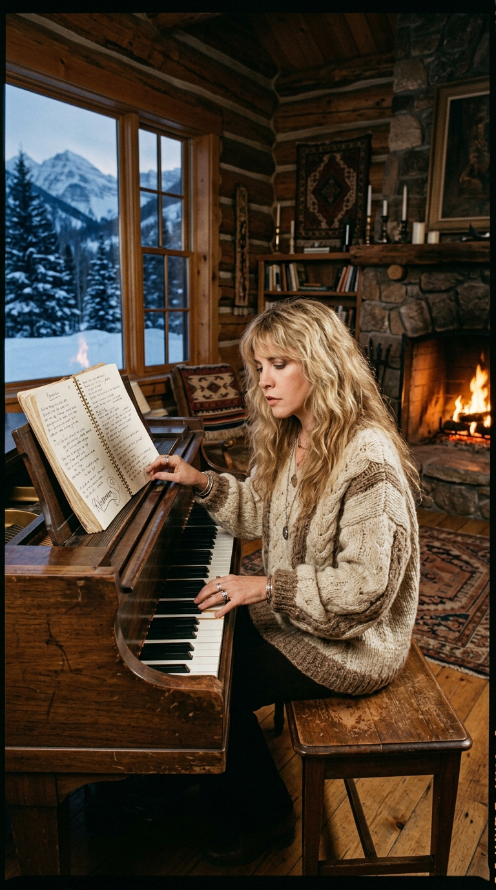
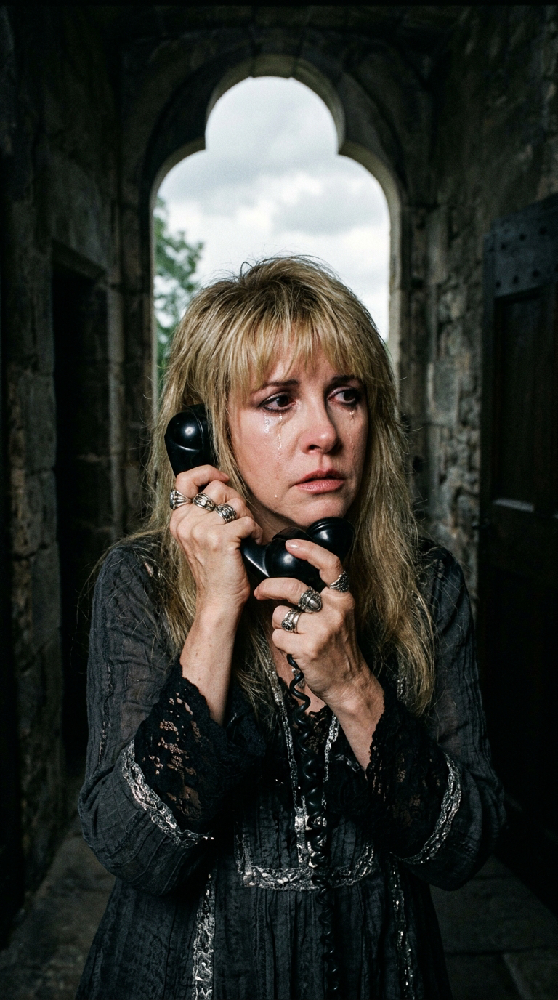
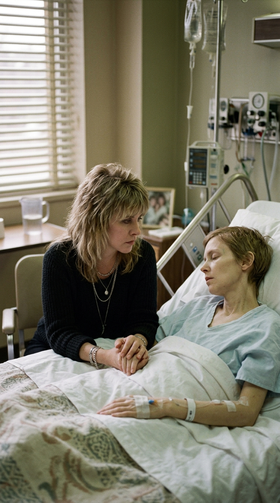
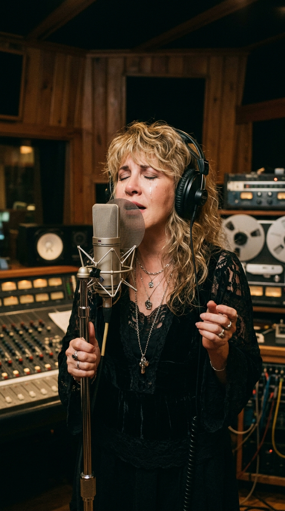
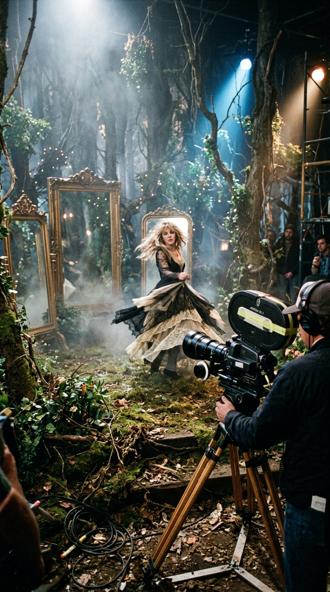

# La Despedida Oculta Detrás del Encaje: La Verdadera Tragedia de «Gypsy»

> *«Lightning strikes, maybe once, maybe twice... And it lights up the night, and you see through the eyes of the one you became. Back to the velvet underground...»*  
> — **Stevie Nicks, 1982**

---

### Prólogo: El giro de gasa y la lágrima invisible

Sobre los escenarios de los estadios más multitudinarios del planeta, Stevie Nicks era una aparición hipnótica. Vestida con metros de gasa negra, encajes victorianos y botas de plataforma de terciopelo, giraba sobre sí misma con una pandereta adornada de cintas, mientras una lluvia de focos dorados la consagraba como la suma sacerdotisa del rock de los ochenta. Cuando los primeros acordes luminosos de *«Gypsy»* arrancaban, el público estallaba en júbilo creyendo presenciar una desenfadada oda a la libertad bohemia y al glamour nómada de las estrellas.

Casi nadie entre las decenas de miles de asistentes imaginaba que detrás de esa cadencia bailable y de esos giros etéreos se ocultaba una de las historias de duelo más desgarradoras y privadas de la música moderna: una elegía fúnebre dedicada a la única persona que había conocido a Stevie antes de que el mundo la convirtiera en mito.

---

### Acto I: El colchón en el suelo y los días de San Francisco

Para rastrear el ADN emocional de *«Gypsy»*, es necesario retroceder una década, hasta el San Francisco de 1971. Mucho antes de los millones de copias vendidas con *Rumours*, de las limusinas y de las mansiones en Malibú, Stevie Nicks y Lindsey Buckingham eran dos jóvenes soñadores sin un solo centavo en los bolsillos.

Instalados en un diminuto apartamento victoriano, no tenían dinero siquiera para comprar la estructura de una cama. Su único lecho era un colchón tamaño *king-size* apoyado directamente sobre el suelo de madera. Pero donde otros habrían visto indigencia, la desbordante imaginación de Stevie vio un palacio bohemio. Para dignificar su rincón, cubría el colchón con sábanas de encaje antiguo y una colcha de terciopelo gastado, rodeándolo de velas y flores silvestres: *«No teníamos nada, pero teníamos la música, y cuando me acostaba en ese colchón me sentía como una reina»*, recordaría años después.

---

### Acto II: The Velvet Underground y la añoranza de la raíz

En aquella época de penurias, Stevie pasaba las tardes explorando una tienda de segunda mano en San Francisco llamada *The Velvet Underground*. Aquel pintoresco bazar, frecuentado en los sesenta por Janis Joplin y Grace Slick, atesoraba vestidos de época de las décadas de 1920 y 1930, encajes rescatados de baúles olvidados y sedas raídas que se vendían por unos pocos dólares.

Aquel escaparate moldeó para siempre su identidad visual y espiritual. Años más tarde, en 1979, tras la brutal vorágine del éxito planetario, el agotamiento de las giras y el desgaste sentimental dentro de Fleetwood Mac, Stevie se sentó frente a un piano vertical en una cabaña de Aspen, Colorado. Sintió una profunda crisis de identidad: el lujo desmedido y las adicciones amenazaban con devorar a la mujer auténtica.

Allí compuso la base de *«Gypsy»*: un mantra íntimo para obligarse a recordar quién era antes de la fama, prometiéndose regresar algún día al colchón en el suelo y a las telas gastadas de *The Velvet Underground*.

---

### Acto III: El eco helado del Château d'Hérouville

En el verano de 1981, Fleetwood Mac se trasladó al *Château d'Hérouville*, un castillo del siglo XVIII en las afueras de París, para registrar las canciones de su álbum *Mirage*. En aquel retiro aristocrático donde habían grabado David Bowie y Elton John, la banda intentaba recuperar la cohesión musical.

Una tarde de lluvia, el timbre del vetusto teléfono de piedra quebró la calma del castillo. Al otro lado de la línea, desde Los Ángeles, sonó la voz quebrada de su familia. La noticia paralizó el pulso de la cantante: **Robin Snyder Anderson**, su mejor amiga desde los quince años —la confidente con quien había compartido secretos de adolescencia en el instituto de Arcadia—, había sido diagnosticada con una forma fulminante de leucemia terminal. Para mayor dolor, Robin estaba embarazada de su primer hijo.

---

### Acto IV: La despedida en el hospital y la voz en la cinta

Stevie voló de inmediato a California. La escena en la habitación del hospital fue de una ternura insoportable. Robin dio a luz prematuramente a un niño al que llamaron Matthew. Tres días después del parto, sostenida de la mano por Stevie entre lágrimas y oraciones en voz baja, Robin cerró los ojos para siempre.

La muerte de Robin desgarró el alma de Stevie Nicks. Sintió que la única persona que la amaba por quien era, ajena al personaje público y a las intrigas de la industria discográfica, había sido arrebatada del mundo.

Cuando regresó al estudio para grabar las tomas vocales definitivas de *«Gypsy»*, la canción ya no era simplemente un ejercicio de nostalgia juvenil; era un canal de comunicación directo con el más allá.

Frente al micrófono de condensador, con los ojos cerrados y las lágrimas humedeciendo sus mejillas, Stevie modificó la intención de cada verso:

> *«Lightning strikes, maybe once, maybe twice... And it lights up the night, and you see through the eyes of the one you became...»*  
> *(«El rayo cae quizás una vez, quizás dos... E ilumina la noche, y puedes ver a través de los ojos de la persona en la que te convertiste...»)*

El rayo representaba el milagro fugaz de su amistad con Robin y la brevedad implacable de la vida terrenal. Cada inflexión de su voz cargaba con el peso de la pérdida y la promesa de no olvidarla jamás.

---

### Acto V: El bosque de espejos y el adiós inmortal

En 1982, para acompañar el lanzamiento del sencillo, se produjo el mítico videoclip dirigido por Russell Mulcahy. Con un presupuesto récord de un cuarto de millón de dólares —el más caro de la historia hasta ese momento— y elegido por MTV como su primer estreno mundial exclusivo, el video trasladó la metáfora de Stevie a un bosque gótico envuelto en niebla y rodeado de espejos dorados.

En las secuencias, Stevie bailaba entre los reflejos de su juventud, atravesando los espejos como quien cruza el umbral entre el mundo visible y el territorio del recuerdo. Era su forma cinematográfica de despedirse de Robin y de abrazar a la gitana interior que nunca moriría.

---

### Epílogo: El regreso a la raíz

Más de cuatro décadas después, *«Gypsy»* sigue brillando con una luminosidad inalterable. Nos recuerda que no importa cuán lejos nos lleven los caminos de la ambición, el éxito o la fortuna: cuando la tempestad arrecia y el dolor nos despoja de las certezas, la verdadera salvación consiste en regresar al lugar donde fuimos puros.

Al final, cuando las luces del escenario se apagan y los aplausos se desvanecen, todos volvemos a ser aquel joven en el colchón del suelo, buscando en el terciopelo y en el recuerdo de quienes amamos el calor suficiente para seguir viviendo.

---

### 💬 Comunidad y Reflexión

¿Conocías la conmovedora historia de amistad y duelo que se oculta tras los giros de encaje de *«Gypsy»*? ¿Qué canción es para ti ese refugio sagrado que te devuelve a tus raíces?

Te leemos en la comunidad de **Acordes Ocultos**.

---

### 📚 Fuentes y Archivo Documental

* **Nicks, Stevie**: Entrevistas históricas de archivo sobre la composición de *«Gypsy»* y el fallecimiento de Robin Snyder Anderson, *Entertainment Weekly*, 2009.
* **Davis, Stephen**: *Gold Dust Woman: The Biography of Stevie Nicks*, St. Martin's Press, Nueva York, 2017.
* **Fleetwood, Mick & Bozza, Anthony**: *Play On: Now, Then, and Fleetwood Mac*, Little, Brown and Company, Nueva York, 2014.
* **Billboard & RIAA Archives**: Registro de desempeño en listas del sencillo *«Gypsy»* y del álbum *Mirage*, otoño de 1982.
* **MTV Network Archives**: Registro del estreno de *«Gypsy»* como el primer *World Premiere Video* en la historia de la cadena, septiembre de 1982.
* **Rolling Stone Magazine**: *«The High Cost of Being Stevie Nicks»*, entrevista de portada por Cameron Crowe, Edición 377, septiembre de 1982.
