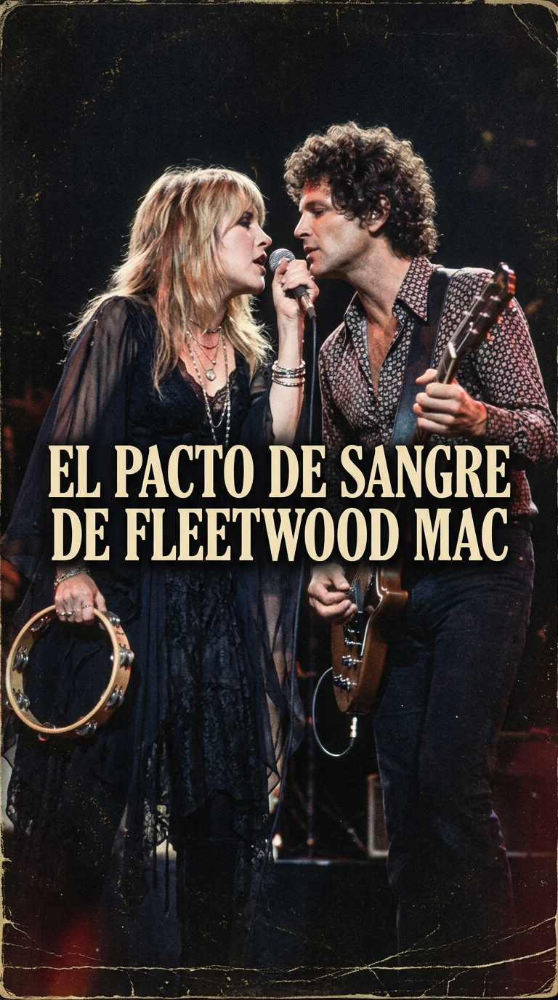
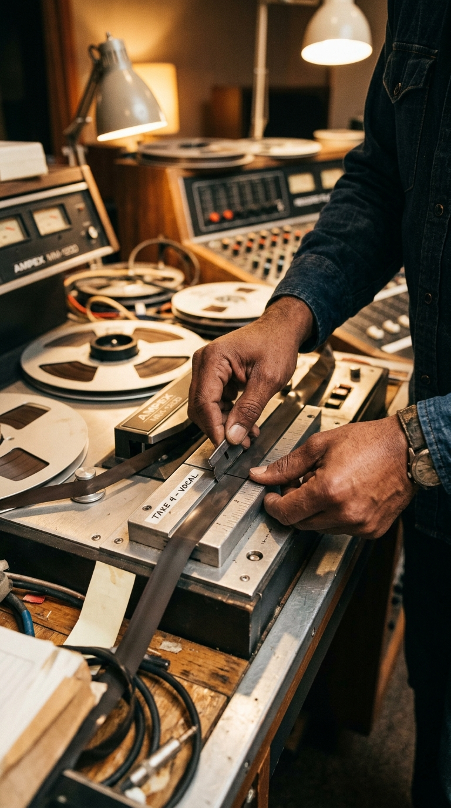
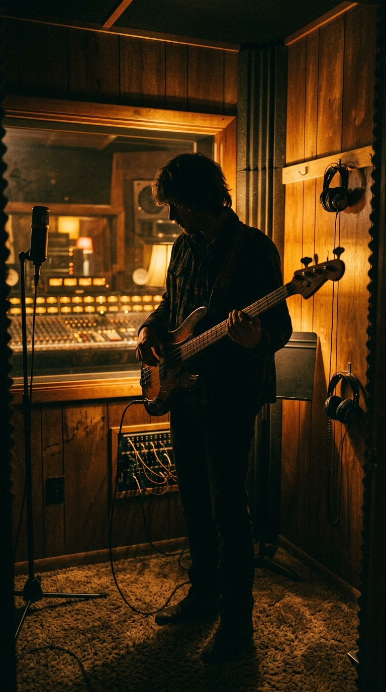
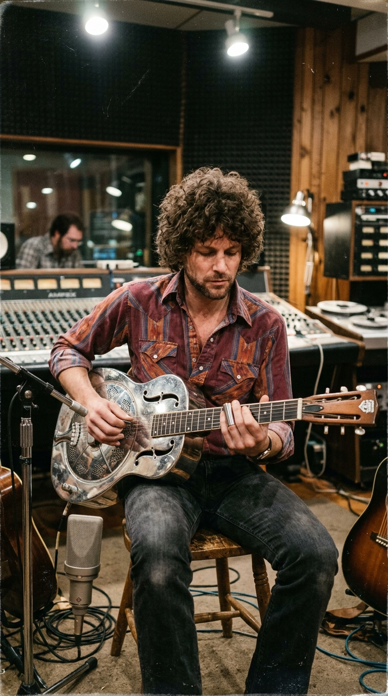
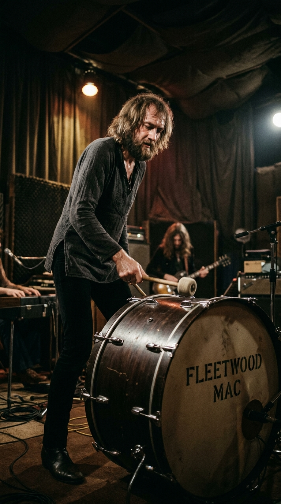

# ⛓️ La Navaja y el Rencor: El Pacto de Sangre que Salvó a Fleetwood Mac del Infierno de «Rumours»

> *«Si nos vas a odiar, ódianos. Si vas a gritarme, grítame. Pero mientras estemos dentro de este estudio, la cadena no se rompe. Nos estamos matando vivos entre nosotros, pero esta música nos va a sobrevivir a todos.»*  
> — **Mick Fleetwood** a Lindsey Buckingham y Stevie Nicks, en los pasillos de Sausalito, 1976.

---

*The Record Plant, Sausalito, 1976: Cinco almas rotas devoradas por los celos y la cocaína que unieron sus pedazos con una hoja de afeitar para forjar el himno de traición más indestructible del rock.*

---

### Prólogo: El purgatorio de Sausalito

A principios de 1976, cruzar la puerta de los estudios **The Record Plant** en Sausalito, una pintoresca localidad costera al norte de San Francisco, era adentrarse en una cámara de tortura emocional sin escapatoria. En aquel edificio sin ventanas forrado de madera de secuoya y alfombras gruesas, los cinco integrantes de **Fleetwood Mac** se habían encerrado para grabar el sucesor de su exitoso álbum homónimo de 1975.

Pero lo que debía ser una sesión de trabajo profesional era, en realidad, un campo de minas de desintegración conyugal. Las dos parejas sentimentales que sostenían el corazón del grupo habían colapsado simultáneamente y de manera sangrienta.

El bajista **John McVie** y la teclista y cantante **Christine McVie**, tras ocho años de matrimonio, estaban en pleno proceso de divorcio. Para evitar el dolor, no se dirigían la palabra salvo para consultar la afinación de un instrumento; y Christine ya había comenzado un romance público con el director de iluminación de las giras del grupo. 

En la otra esquina del estudio, el guitarrista y cerebro sónico **Lindsey Buckingham** y la hechicera vocal **Stevie Nicks** libraban una guerra de trincheras despiadada: tras una década de convivencia y sacrificios mutuos, su romance agonizaba en medio de insultos feroces, portazos que hacían temblar las paredes y miradas de puro veneno en la sala de control.

Por si fuera poco, el baterista y líder de la banda, el gigantesco **Mick Fleetwood**, acababa de descubrir que su esposa Jenny Boyd le había sido infiel con su mejor amigo, dejándolo sumido en una depresión corrosiva.

Con las emociones al rojo vivo, el insomnio alimentado por montañas de cocaína de alta pureza y una atmósfera enrarecida donde el resentimiento flotaba como gas invisible, cualquier otra banda del planeta se habría disuelto en el acto. 

Ellos decidieron hacer algo más peligroso: convertir su propia podredumbre afectiva en arte imperecedero.

---

### Acto I: Retazos de cinta y una hoja de afeitar

A diferencia del resto de las canciones del álbum *Rumours* —donde cada compositor utilizaba sus temas como dagas arrojadizas contra su expareja (como *«Go Your Own Way»* de Buckingham contra Nicks o *«Dreams»* de Nicks contra Buckingham)—, **«The Chain»** es la **única canción en la historia de la formación clásica de Fleetwood Mac firmada al unísono por los cinco integrantes**.

Y la razón es tan fascinante como insólita: la canción no nació de una inspiración colectiva frente a una fogata, sino de una operación quirúrgica de corta y pega con **cinta magnética mutilada**.

A mediados de 1976, la banda tenía entre manos varias piezas sueltas que no funcionaban por separado. Christine McVie había compuesto una balada melancólica titulada *«Keep Me There»* (originalmente bautizada como *«Butter Cookie»*), que tenía una progresión de acordes elegante al piano pero carecía de fuerza en las estrofas. 

Por su parte, Stevie Nicks había escrito en su casa una poesía acústica desgarradora sobre la muerte de su amor con Lindsey:

> *«Listen to the wind blow, watch the sun rise...  
> Run in the shadows, damn your love, damn your lies...»*

Frustrado por la falta de un himno épico para cerrar la cara B del vinilo, Lindsey Buckingham tomó su guitarra acústica con cuerpo resonador metálico **Dobro** y diseñó una introducción siniestra, bluesera y tribal: un punteo de afinación abierta que sonaba como el traqueteo de un tren de mercancías avanzando a ciegas hacia un precipicio.

En la sala de control, los productores **Ken Caillat** y **Richard Dashut** tomaron una decisión audaz. Con una **hoja de afeitar Gillette** y un bloque de empalme de aluminio, cortaron físicamente con sus propias manos las cintas maestras analógicas de dos pulgadas de diferentes sesiones de Sausalito: separaron la intro de Dobro de Lindsey, empalmaron las estrofas cantadas por Stevie y pegaron la sección rítmica que Christine había compuesto meses atrás.

Los fragmentos sueltos de cinco personas rotas estaban unidos por un trozo de celuloide adhesivo. Ahora faltaba el corazón del monstruo.

---

### Acto III: El latido fúnebre del bajo de John McVie

Faltaba el desenlace, ese momento en el que la tensión acumulada durante tres minutos de reproches acústicos debía estallar. Y fue entonces cuando el habitualmente silencioso y hermético **John McVie** dio un paso al frente.

Agotado de los gritos entre Stevie y Lindsey, McVie se colgó su bajo eléctrico de madera personalizada **Alembic**, tomó una púa dura y comenzó a ensayar una frase solitaria. Eran solo **diez notas descendentes**, pulsadas con una sequedad implacable y cavernosa: *dumm... dumm-dumm, dumm-dumm, dumm-dumm-dumm...*. 

Sonaba a un electrocardiograma deteniéndose; al latido fúnebre de un amor al que se le acaba el oxígeno.

En el minuto **3:03** de la canción, toda la instrumentación se extingue abruptamente. Solo queda ese bajo solitario, desnudo, resonando en la inmensidad del silencio. 

De repente, un golpe seco de caja de Mick Fleetwood rompe la hipnosis.

Y entonces, Lindsey Buckingham pisa el pedal de ganancia de su amplificador y desata un solo de guitarra incendiario, violento y desquiciado en su **Fender Stratocaster** modificada. No era un ejercicio de virtuosismo complaciente: era el aullido sonoro de un hombre que volcaba en seis cuerdas toda la furia, la impotencia y el desamor que no podía expresar con palabras.

Las voces de los cinco miembros se entrelazaban en un coro apocalíptico:

> *«And if you don't love me now... you will never love me again!  
> I can still hear you saying you would never break the chain!»*  
> *(«Y si no me amas ahora... ¡nunca volverás a amarme!  
> Todavía puedo oírte decir que nunca romperías la cadena»)*.

---

### Acto IV: El exorcismo en el escenario

Cuando el álbum *Rumours* salió a la venta en febrero de 1977, se convirtió de inmediato en un fenómeno cultural imparable, vendiendo más de **cuarenta millones de copias** y pasando a la historia como el disco de desamor más vendido de todos los tiempos.

Pero el verdadero milagro de *«The Chain»* no se vivió en las listas de ventas, sino sobre los escenarios de los estadios del mundo.

Cada noche, ante cincuenta mil extraños, Stevie Nicks y Lindsey Buckingham se colocaban a escasos centímetros de distancia, compartiendo el mismo micrófono. Con los ojos inyectados en sangre, las venas del cuello a punto de reventar y mirándose fijamente con una mezcla escalofriante de desprecio y adoración, se gritaban los versos de la canción a la cara. 

Aquella actuación no era una pose coreografiada para entretener a la masa: era un exorcismo público en tiempo real. 

Mick Fleetwood había impuesto un pacto sagrado y tiránico a sus compañeros: podían odiarse en los hoteles, podían ignorarse en los aviones y podían rehacer sus vidas con quien quisieran, pero en el instante en que pisaban las tablas, la cadena del grupo era más sagrada que su propia felicidad individual. La música devoraba a las personas para otorgarles la inmortalidad.

---

### Epílogo: El rugido de los motores y la cadena que no cede

Con el transcurso de las décadas, *«The Chain»* trascendió el drama íntimo de Fleetwood Mac para convertirse en un emblema de la cultura popular universal. Durante años fue la legendaria sintonía de apertura de las transmisiones de la **Fórmula 1 en la BBC**, asociando para siempre las diez notas de bajo de John McVie al rugido de los motores y a la adrenalina de los monoplazas en los circuitos de Monza y Silverstone.

Tras la trágica muerte de Christine McVie en noviembre de 2022 y la definitiva disolución de la formación sobre los escenarios, *«The Chain»* permanece como el monumento supremo a la resiliencia artística: el testimonio de cómo cinco seres humanos al borde del abismo prefirieron inmolar sus corazones antes que permitir que el fuego de su música se apagara.

---

### Reflexión: Los lazos que nos atan a la vida

Todos hemos forjado alguna vez pactos invisibles que nos desgarran por dentro, cadenas emocionales que pesan como plomo pero que nos negamos a romper porque sabemos que, sin ellas, quedaríamos a la deriva en la oscuridad.

Y a ti, cuando las diez notas de bajo de John McVie rompen el silencio y arranca el solo furioso de Lindsey Buckingham, ¿qué promesas rotas o qué lazos indestructibles vuelven a estremecer tu memoria?

---

### 📚 Fuentes y Archivo Documental

* **Caillat, Ken & Stiefel, Steve (2012):** *Making Rumours: The Inside Story of the Classic Fleetwood Mac Album*. John Wiley & Sons. Registro técnico día a día de los cortes con cuchilla de afeitar en The Record Plant de Sausalito.
* **Fleetwood, Mick & Davis, Stephen (1990):** *My Life and Adventures in Fleetwood Mac*. William Morrow & Co. Memorias del líder sobre el pacto de hierro y las tensiones matrimoniales durante 1976.
* **Sound on Sound Magazine (Agosto 2007):** *Classic Tracks: Fleetwood Mac 'The Chain'*. Análisis pormenorizado del bajo Alembic de John McVie y la mezcla de Richard Dashut.
* **Rolling Stone Magazine (Archives, Febrero 1977):** *Fleetwood Mac: Life at the Edge*. El mítico reportaje de Cameron Crowe sobre la grabación de *Rumours*.
