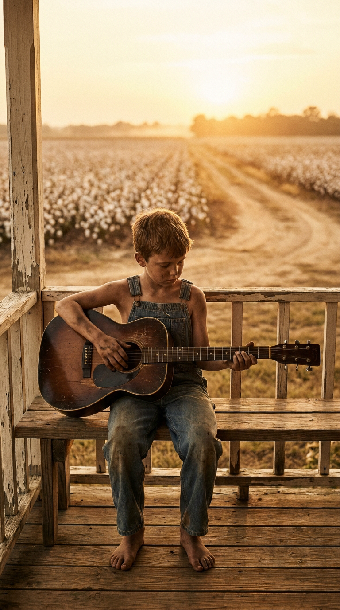
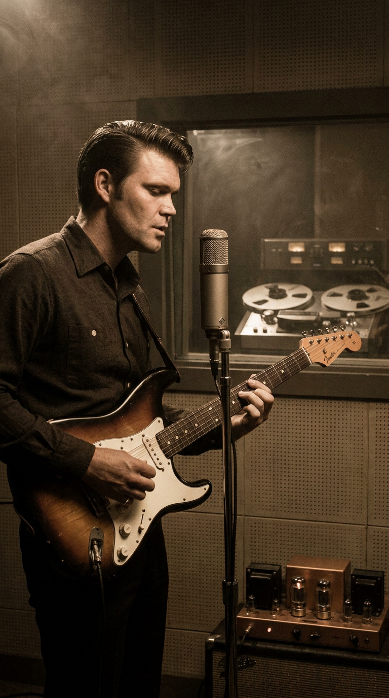
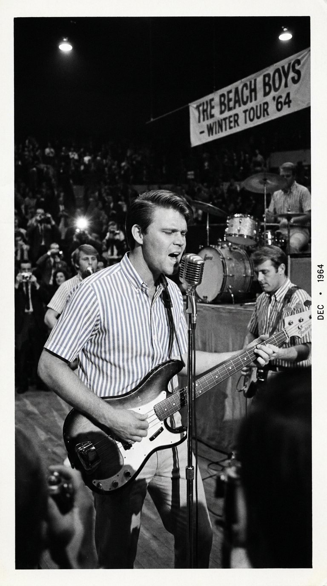
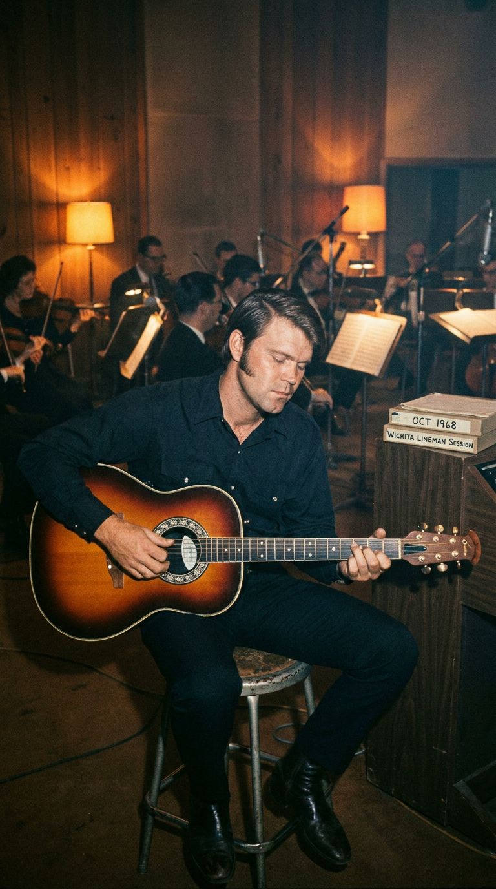
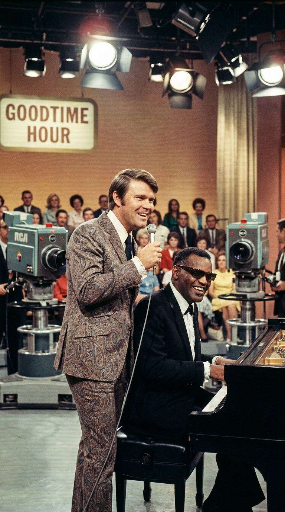
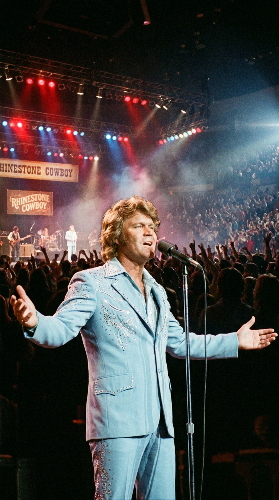
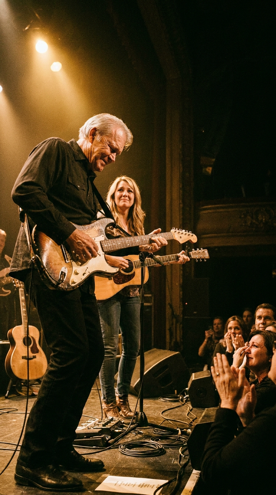
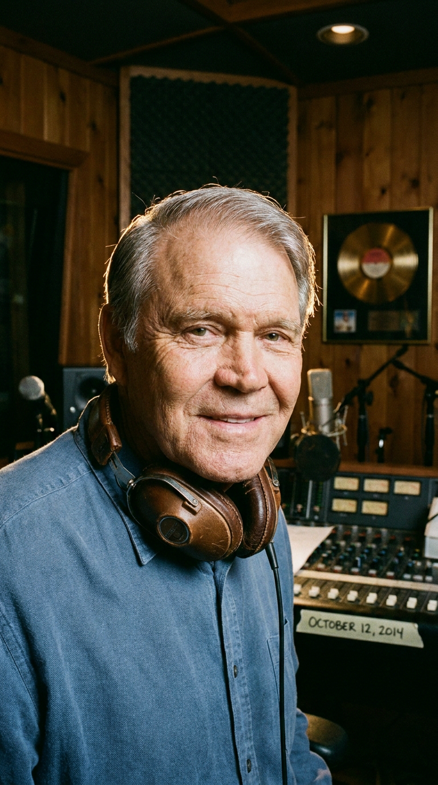

# ⚡ El Cable que Susurraba en la Soledad y el Acorde que Venció al Olvido: La Epopeya de Glen Campbell
### *De recolectar algodón descalzo en los lodazales de Arkansas a rescatar a The Beach Boys, inventar el pop orquestal de carretera con «Wichita Lineman» y desafiar al Alzheimer con una guitarra en las manos.*

---

**Por la redacción de Acordes Ocultos**  
*Tiempo de lectura estimado: 7 minutos*

---

### Prólogo: El zumbido en medio de la nada

El cielo de Washita County, en las llanuras infinitas de Oklahoma, es un domo de plomo ardiente que aplasta el horizonte. A finales del verano de 1968, un joven compositor de veintiún años llamado **Jimmy Webb** conducía su automóvil por una carretera recta que parecía extenderse hasta el confín del planeta. No había gasolineras, ni granjas, ni árboles; solo millas de postes telefónicos de madera desvencijada que marchaban paralelos al asfalto como cruces solitarias.

De pronto, recortada contra el resplandor dorado del atardecer, Webb divisó una figura. En lo alto de un poste, suspendido entre el cielo y la tierra con arneses de cuero y espuelas de acero, un hombre solitario trabajaba sobre el tendido eléctrico. Tenía un auricular de pruebas conectado a los hilos de cobre y sostenía una herramienta con la mano enguantada.

En aquel instante no había nadie más en cincuenta kilómetros a la redonda. Webb redujo la velocidad y lo contempló al pasar: un trabajador anónimo, cubierto de sudor y polvo, escuchando en silencio las voces invisibles, los secretos, los sollozos y las risas de miles de personas que viajaban a través de esos cables, mientras él permanecía recluido en el más desgarrador de los aislamientos.

Webb pensó de inmediato: *«¿Qué siente un hombre así cuando cae la tarde? ¿A quién extraña? ¿Con quién sueña cuando solo el viento le responde?»*.

Aquella visión fugaz en una autopista solitaria fue la chispa que encendió **«Wichita Lineman»**, calificada por críticos de todo el mundo y por el propio Bob Dylan como *«la canción más hermosa y perfecta jamás escrita sobre la soledad del hombre común»*. Pero la melodía jamás se habría convertido en un monumento inmortal de no haber caído en las manos del único músico sobre la faz de la tierra capaz de dotarla de un corazón de carne, hueso y redención: **Glen Campbell**.

---

### Acto I: El niño de las manos sangrantes y el secreto de Hollywood

Para entender la melancolía luminosa que Glen Campbell imprimía en cada nota, es imprescindible descender a las ciénagas de la miseria rural estadounidense durante la Gran Depresión. Glen nació en 1936 en Billstown, cerca de **Delight, Arkansas**, como el séptimo de doce hermanos de una familia de aparceros paupérrimos. No tenían electricidad, ni agua corriente, ni retrete interior; se alimentaban de ardillas cazadas en el bosque, harina de maíz y lo poco que rendía la tierra.

*Delight, Arkansas, década de 1940: El niño aparcero que recogía algodón descalzo y encontró en una vieja guitarra acústica su única vía de escape.*

A los cinco años, su padre le compró una guitarra rústica por cinco dólares en el catálogo de Sears Roebuck. A los seis, Glen ya recolectaba algodón bajo un sol abrasador de cuarenta grados, arrastrando sacos que pesaban más que su propio cuerpo y terminando cada jornada con los dedos en carne viva. Para aliviar el dolor de la jornada, su tío Boo le enseñó a pulsar las cuerdas. Glen no necesitó cuadernos de partituras ni maestros de conservatorio: poseía un oído absoluto y una memoria prodigiosa que absorbía cualquier melodía con solo escucharla una vez.

En 1960, con veinticuatro años y una técnica de púa vertiginosa, llegó a Los Ángeles. Hollywood vivía una edad dorada irrepetible, y en los sótanos de los estudios de grabación comenzaba a gestarse una leyenda secreta: **The Wrecking Crew**, la élite de músicos de sesión clandestinos que grababa anónimamente las pistas instrumentales de los mayores éxitos de la época.

*Los Ángeles, 1962: Glen Campbell deslumbra a los productores en Capitol Studios. Sin saber leer solfeo, dominaba cualquier arreglo de oído al primer intento.*

Campbell se convirtió en el arma secreta de productores legendarios como Phil Spector y Jimmy Bowen. Mientras los directores de orquesta repartían complejas partituras de papel que otros músicos tardaban horas en descifrar, Campbell se limitaba a escuchar una maqueta en cinta, asentía con la cabeza y clavaba la toma perfecta al primer intento. Su guitarra rítmica y sus arpegios cristalinos impulsaron himnos generacionales como *«Strangers in the Night»* de Frank Sinatra, *«Viva Las Vegas»* de Elvis Presley, *«You've Lost That Lovin' Feelin'»* de The Righteous Brothers y prácticamente todos los éxitos tempranos de The Monkees.

---

### Acto II: El salvamento de The Beach Boys y la llamada de emergencia

En diciembre de 1964, el destino puso a prueba la templanza de Campbell. **Brian Wilson**, el atormentado genio de The Beach Boys, colapsó víctima de un severo ataque de nervios en pleno vuelo entre Los Ángeles y Houston durante una gira nacional. Incapaz de subir a un escenario, la banda quedó al borde del desastre financiero y logístico con entradas agotadas en todo el país.

Desesperados, los Beach Boys llamaron a Glen Campbell: *«Necesitamos que toques el bajo y cantes las armonías agudas de falsete de Brian a partir de mañana por la noche»*.

*Diciembre de 1964: Con la camisa a rayas de The Beach Boys, Glen Campbell sustituyó a Brian Wilson salvando la gira mundial.*

Campbell jamás había tocado el bajo eléctrico en directo con el grupo, ni conocía al dedillo los intrincados contrapuntos vocales del repertorio surf. Se encerró en la habitación de un hotel con un tocadiscos portátil, memorizó los doce temas en menos de veinticuatro horas y subió al escenario en Houston con una soltura que dejó atónita a la crítica. Durante varios meses fue un Beach Boy de pleno derecho, pero su ambición artística no era ser el sustituto de nadie: quería que el mundo escuchara su propia voz.

Esa voz encontró su alma gemela en 1967 cuando escuchó una composición de Jimmy Webb titulada *«By the Time I Get to Phoenix»*. La química fue inmediata: Webb escribía con la sofisticación armónica de Ravel y la melancolía de Steinbeck, mientras Campbell cantaba con la nobleza desgarrada del campesino que conoce el peso del barro y la dignidad del trabajo rudo.

---

### Acto III: «¡No está terminada!»: La sesión milagrosa en Capitol Studios

Tras el éxito arrollador de *«Phoenix»*, Campbell llamó a Webb a mediados de 1968:  
—*«Jimmy, necesito otra canción de carretera. Pero esta vez sobre un pueblo o una profesión, algo que la gente humilde sienta en las entrañas. Y la necesito para mañana, tengo sesión reservada en Capitol»*.

Webb recordó la imagen del liniero de Washita County. Se sentó al piano en su casa de Hollywood Hills y compuso de tirón la primera estrofa y el estribillo:

> *«I am a lineman for the county, and I drive the main road...  
> searching in the sun for another overload.  
> And I hear you in the wire, I can hear you through the whine...  
> And the Wichita Lineman is still on the line.»*

Cuando llegó al verso central, Webb escribió una frase que desafiaba toda lógica gramatical y que sin embargo condensaba la cumbre de la devoción amorosa:

> *«And I need you more than want you...  
> and I want you for all time.»*

Pero Webb se bloqueó. No tenía una tercera estrofa. No tenía un solo de puente ni un desenlace claro. Creyendo que solo era un borrador incompleto, grabó una maqueta rápida con su voz desafinada y un piano acústico, y le envió el acetato a Campbell con una nota categórica: *«Glen, esto es solo un bosquejo. Le falta una estrofa entera y el final. No la grabes todavía, la terminaré el fin de semana»*.

*Agosto de 1968, Capitol Tower (Hollywood): Glen Campbell junto a los arreglos de Al De Lory forjando la inmortalidad de «Wichita Lineman».*

Glen Campbell no esperó. Al escuchar la maqueta en la legendaria torre circular de **Capitol Studios** en Hollywood, comprendió que cualquier verso adicional arruinaría la mística del silencio. La canción no necesitaba más palabras; necesitaba espacio para que el oyente respirara la inmensidad del paisaje.

El arreglista **Al De Lory** diseñó una arquitectura de cuerdas cinematográfica: violines que se mecían imitando el silbido del viento frío entre los cables telegráficos, cellos oscuros que marcaban la soledad de la llanura y un pulso rítmico sostenido por la batería sutil de **Hal Blaine** y el bajo hipnótico de **Carol Kaye**.

Sin embargo, en medio de la pista quedaba un vacío de doce compases donde Webb debía haber escrito la estrofa ausente. Campbell miró a su alrededor en la sala. Había allí un instrumento poco habitual: un **Fender Bass VI**, un bajo de seis cuerdas afinado una octava más baja que una guitarra convencional.

Glen se colgó el bajo al cuello, ajustó el vibrato de su amplificador a válvulas Fender Twin Reverb y, de una sola toma improvisada en directo, tocó uno de los solos más icónicos y conmovedores de la historia moderna: un fraseo limpio, nasal y solitario que goteaba nostalgia, replicando de forma magistral la señal morse y el murmullo errante de los cables de alta tensión.

Cuando Jimmy Webb escuchó el máster final en la radio semanas más tarde, llamó a Campbell estupefacto:  
—*«¡Glen, pero si la canción no estaba terminada!»*  
A lo que Campbell respondió con su calma campesina:  
—*«Jimmy, estaba terminada en el momento exacto en que la tocamos»*.

---

### Acto IV: La cima del mundo, el pozo de la sombra y la redención

«Wichita Lineman» escaló simultáneamente al primer puesto de las listas de Country y al Top 3 del Billboard Hot 100 de Pop, conquistando múltiples premios Grammy y abriendo una era dorada para Campbell.

*1969: En pleno auge de la tensión racial y social, Glen desafió las advertencias de los ejecutivos de CBS invitando a Ray Charles y Stevie Wonder a su programa estelar de televisión.*

Entre 1969 y 1972, Campbell condujo su propio programa estelar en la cadena CBS: *The Glen Campbell Goodtime Hour*. En una época de feroz polarización por la Guerra de Vietnam y la segregación racial, Glen utilizó su prestigio para derribar barreras: invitó a músicos negros de soul como **Ray Charles** y un jovencísimo **Stevie Wonder**, compartió pantalla con figuras del folk contestatario y coprotagonizó junto a **John Wayne** el clásico del cine wéstern *True Grit* (1969), recibiendo una nominación al Globo de Oro.

*1975: La consagración definitiva con «Rhinestone Cowboy», himno universal de la perseverancia artística frente a la adversidad.*

En 1975, cuando muchos críticos lo daban por superado por la nueva ola del rock sureño, Campbell escuchó un casete olvidado en su coche de un cantante desconocido llamado Larry Weiss. Enamoró de la letra al instante y grabó **«Rhinestone Cowboy»**, un fenómeno sociocultural sin precedentes que vendió más de cinco millones de copias y lo catapultó a los mayores estadios del planeta.

Pero la gloria cobró un peaje devastador. Durante los primeros años de la década de 1980, Campbell cayó en una espiral autodestructiva de alcoholismo y adicción a la cocaína. Las portadas de prensa comenzaron a reflejar arrestos nocturnos y escándalos mediáticos en lugar de éxitos musicales. Tocó fondo en Las Vegas, al borde de la bancarrota moral y física.

Fue en 1982 cuando conoció a **Kim Woollen**, una bailarina del Radio City Music Hall que se convirtió en su ancla espiritual. Gracias a su amor incondicional y a una férrea fe personal, Glen se desintoxicó por completo, reconstruyó su familia y regresó a los escenarios con una dignidad renovada.

---

### Epílogo: El milagro de la memoria muscular frente al abismo

En junio de 2011, Glen Campbell y su familia hicieron público un anuncio que conmovió al mundo: a los setenta y cinco años, el artista había sido diagnosticado con la enfermedad de **Alzheimer** en fase avanzada.

Cualquier otra figura se habría recluido en la intimidad de su hogar para ocultar el declive. Glen Campbell hizo exactamente lo contrario: anunció una colosal gira de despedida, **«The Goodbye Tour»**, que acabó extendiéndose por **151 conciertos** a lo largo y ancho de los Estados Unidos, el Reino Unido y Europa, acompañado en el escenario por sus propios hijos (Shannon, Ashley y Cal).

*2011-2012: Desafiando al Alzheimer en The Goodbye Tour junto a su hija Ashley Campbell.*

Lo que presenciaron cientos de miles de espectadores en aquellos conciertos raya en el milagro científico y espiritual. En el camerino, Glen a menudo no sabía en qué ciudad se encontraba, no recordaba el año en que vivía y le costaba reconocer los rostros de sus allegados. Sin embargo, en el instante en que sus pies pisaban las tablas del escenario y sentía el peso de su guitarra colgada del hombro, la niebla cerebral se disipaba por completo.

Los neurólogos lo definieron como un caso extraordinario de preservación de la **memoria procedimental y muscular**: las rutas neuronales forjadas por millones de horas de dedicación al instrumento permanecían intactas en su corteza motora. Podía olvidar la letra de una estrofa y requerir un teleprónter para recordar el verso siguiente, pero sus dedos sobre el diapasón jamás erraban una sola semicorchea.

En 2014, cuando la enfermedad ya le impedía mantener una conversación coherente, Campbell entró por última vez a un estudio de grabación en Nashville para registrar su testamento musical: **«I'm Not Gonna Miss You»**. En ella, con una lucidez desgarradora y serena, le cantaba a su esposa y a sus hijos sobre la cruel paradoja del olvido:

> *«No voy a extrañarte cuando ya no sepa quién eres...  
> porque tú serás quien tenga que cargar con el dolor de recordarme,  
> y yo seré quien esté en paz.»*

*2014: La mirada serena de Glen Campbell durante la grabación de su despedida definitiva, «I'm Not Gonna Miss You».*

Glen Campbell partió el 8 de agosto de 2017 a los ochenta y un años. El Alzheimer logró apagar sus recuerdos terrenales, pero jamás pudo tocar su música.

Cada vez que cae el sol sobre las autopistas interminables de Oklahoma y el viento hace gemir los cables de cobre entre los postes de madera, el liniero de Wichita sigue allí arriba, suspendido entre el cielo y la tierra, recordándonos que mientras haya un alma dispuesta a escuchar una guitarra sincera, la memoria humana es invencible.

---

### 💬 El eco en la memoria

¿Conocías la historia secreta detrás de *«Wichita Lineman»* y la batalla heroica de Glen Campbell contra el olvido? ¿Qué emoción te despierta escuchar hoy ese solo solitario de seis cuerdas? Déjanos tu reflexión en los comentarios de la comunidad.

---

### 📚 Fuentes y Archivo Documental

* **Campbell, Glen con Peck, Tom** (1994). *Rhinestone Cowboy: An Autobiography*. Villard Books / Random House, Nueva York.
* **Webb, Jimmy** (1998). *Tunesmith: Inside the Art of Songwriting*. Hyperion Books, Nueva York.
* **Webb, Jimmy** (2017). *The Cake and the Rain: A Memoir*. St. Martin's Press, Londres.
* **Hartman, Kent** (2012). *The Wrecking Crew: The Inside Story of Rock and Roll's Best-Kept Secret*. St. Martin's Griffin.
* **Keach, James** (Director) (2014). *Glen Campbell: I'll Be Me* (Documental cinematográfico oficial sobre la gira de despedida y el diagnóstico de Alzheimer). PCH Films.
* **Archivos Hemerográficos de Capitol Records** (1968). *Recording Session Logs: Session #14592, Studio A, Hollywood, CA*.
* **Billboard Magazine** (1968-1969). *Top Country Singles & Hot 100 Charts Archives*.
* **Rolling Stone Magazine** (2004). *The 500 Greatest Songs of All Time: Entry #195 - Wichita Lineman*.
