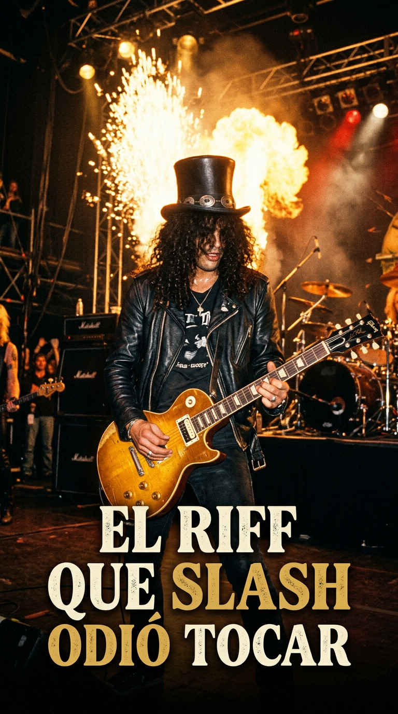
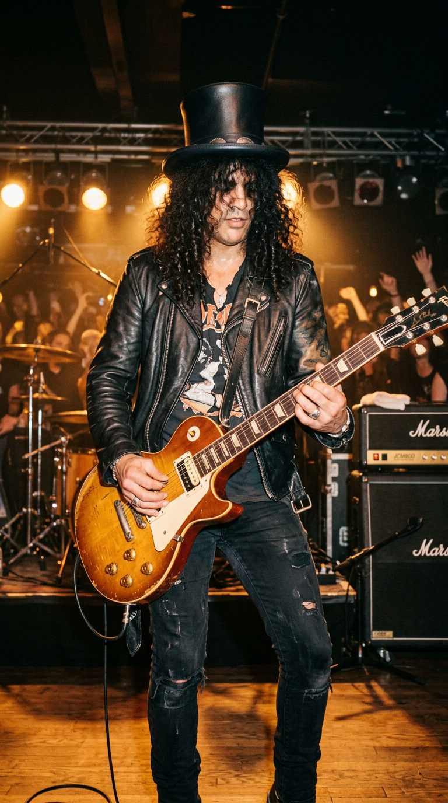
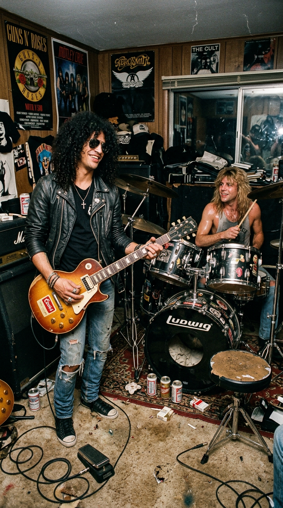
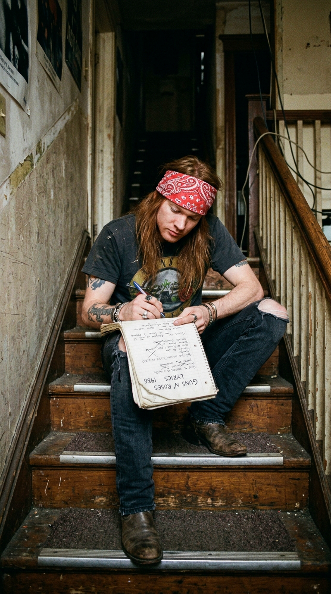
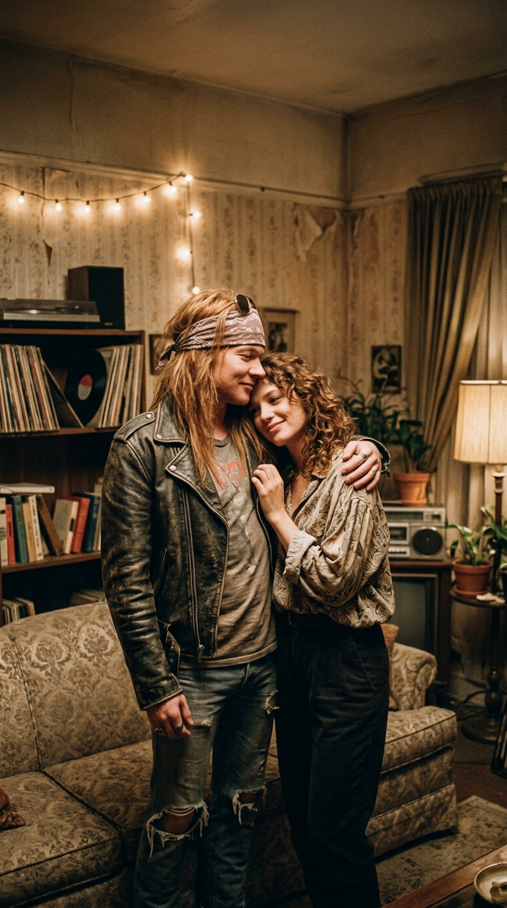
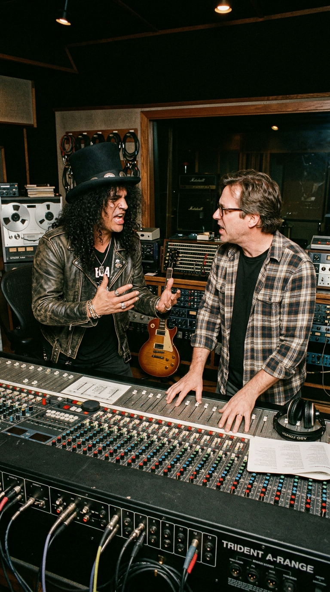
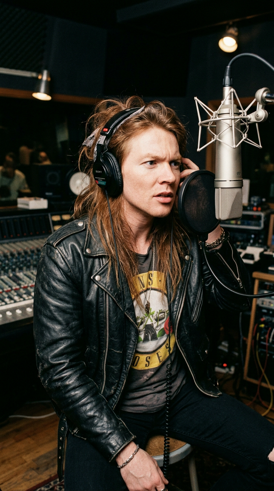
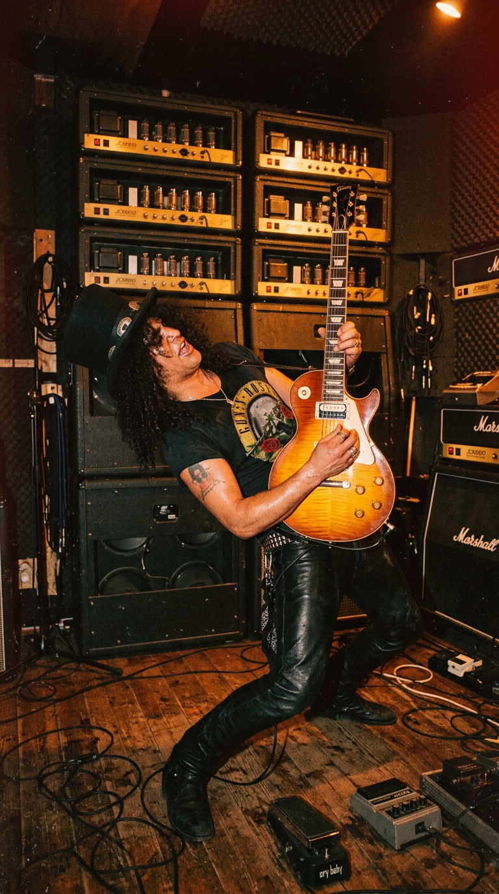
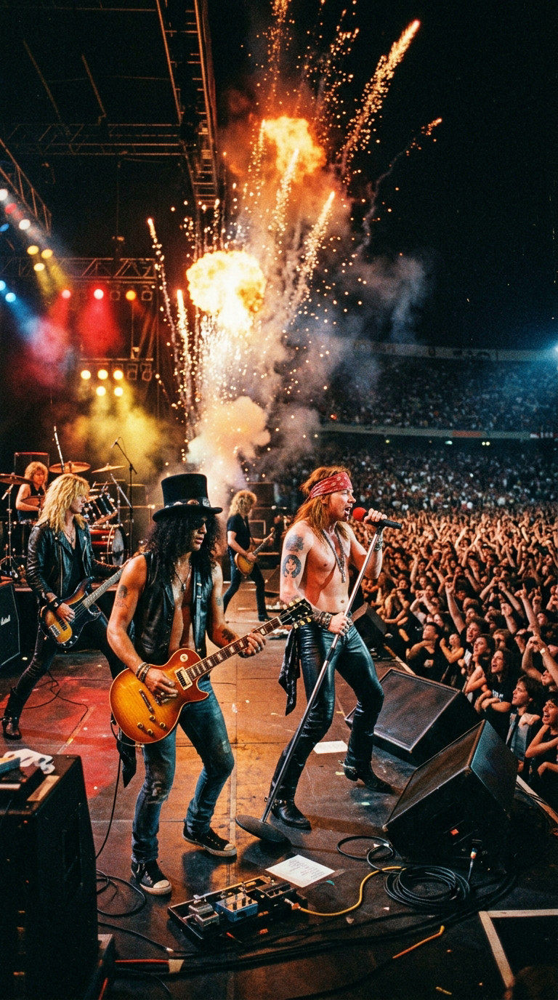
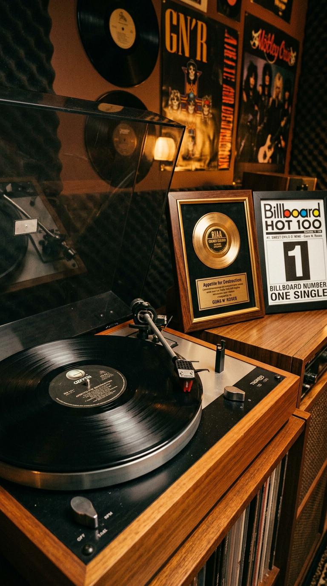

# 🎸 El Riff que Slash Odió Tocar: El Ejercicio Circense que Salvó a Guns N' Roses
### *Cómo un calentamiento técnico que el guitarrista consideraba una broma tonta se cruzó con un poema íntimo en una habitación del Sunset Strip para forjar el único número uno planetario de la banda más salvaje del rock.*

---

**Por la redacción de Acordes Ocultos**  
*Tiempo de lectura estimado: 9 minutos*

---

### Prólogo: El zoológico de Gardner Street

A mediados de 1986, en una destartalada casa de dos plantas alquilada sobre Gardner Street, en pleno corazón de West Hollywood, cinco muchachos desarrapados sobrevivían entre botellas vacías de vino barato *Nightrain*, colchones carcomidos en el suelo y una montaña de colillas de cigarrillos. No tenían dinero para pagar la calefacción ni comida en la nevera, pero compartían un pacto sellado con sangre callejera: conquistar el mundo o quemarse en el intento. Se hacían llamar **Guns N' Roses**.

*1987: Slash empuñando su legendaria réplica Sunburst Les Paul bajo los focos de Los Ángeles.*

En el submundo del Sunset Strip angelino —un ecosistema dominado por el glam rock prefabricado, el maquillaje relamido y las producciones estériles de sintetizadores ochenteros—, Guns N' Roses representaba una anomalía biológica: eran sucios, peligrosos, adictos a la adrenalina y alimentados por la furia cruda de Aerosmith, The Rolling Stones y los Sex Pistols. Su música era un puñetazo en la mandíbula que narraba sobredosis, redadas policiales, pobreza extrema y desenfreno nocturno.

Nadie en aquella guarida de West Hollywood, y mucho menos su guitarrista líder, imaginaba que la canción que los rescataría del olvido corporativo nacería de una payasada técnica diseñada para burlarse de un baterista despistado.

---

### Acto I: La mueca del payaso y el salto de cuerda

Una tarde calurosa de finales de 1986, la banda se encontraba reunida en el salón de Gardner Street para una sesión informal de ensayo. **Slash** (Saul Hudson), que por entonces apenas tenía veintiún años y escondía su timidez tras una espesa cortina de rizos negros y su inseparable sombrero de copa, se sentó en el suelo de madera con su guitarra desenchufada, frente al baterista **Steven Adler**.

*1986: En el caótico salón de Gardner Street, Slash juguetea con un patrón de calentamiento frente a Steven Adler.*

Buscando romper la monotonía del calentamiento y con ganas de hacer reír a Adler, Slash comenzó a ejecutar un ejercicio gimnástico de digitación (*string-skipping* o salto de cuerdas) en la tonalidad de Re mayor. Era una figura cíclica, matemática y acelerada que subía y bajaba por los trastes agudos. Para acentuar la parodia, Slash tocaba mientras le ponía caras raras y muecas burlescas a Adler, emulando la música histriónica de un circo ambulante o una vieja melodía de dibujos animados.

> —*«Para mí era una completa estupidez»*, recordaría Slash décadas más tarde en su autobiografía homónima de 2007. *«Era solo un patrón técnico tonto de calentamiento, una de esas frases mecánicas que tocas para aflojar los dedos sin prestarle ninguna atención. No tenía la menor intención de convertirlo en una canción. Para colmo, sonaba como música de circo»*.

Sin embargo, el oído de **Izzy Stradlin**, el guitarrista rítmico y cerebro silencioso de la banda, detectó algo magnético en aquel torrente de notas. Sentado en un sillón destartalado, Izzy agarró su guitarra acústica y le gritó a Slash:
—*«¡No pares! ¡Tócalo otra vez!»*.

Izzy comenzó a montar una secuencia armónica por debajo del riff: Re mayor, Do mayor, Sol mayor y de regreso a Re. El bajista **Duff McKagan**, fascinado por la tensión melódica que se abría en la sala, tomó su Fender Jazz Bass y aportó una línea de bajo sinuosa y profunda que ancló la ligereza del arpegio a la tierra, mientras Adler marcaba un compás constante y bailable sobre la caja. Lo que había comenzado como una broma sarcástica comenzaba a respirar con vida propia.

---

### Acto II: El poema en la planta alta y la herida de Erin Everly

En el piso superior de la casa, ajeno a la sesión instrumental, se encontraba **Axl Rose**. Tumbado sobre la cama de su habitación, el vocalista de veinticuatro años atravesaba uno de sus recurrentes períodos de aislamiento melancólico, sumido en una compleja y tormentosa relación con **Erin Everly** (hija de Don Everly, miembro del legendario dúo The Everly Brothers), quien era por entonces el epicentro absoluto de su universo emocional.

*1986: Axl Rose, refugiado en la planta superior de la casa, escribe los versos inspirados por la melodía que subía del salón.*

A través del piso de madera, las notas hipnóticas del riff de Slash y los acordes de Izzy comenzaron a filtrarse en la mente de Axl. Lejos de percibir una melodía circense, el cantante sintió una calidez nostálgica y luminosa que contrastaba de forma desgarradora con la brutalidad habitual de su vida en Los Ángeles. Tomó un cuaderno desgastado y comenzó a escribir con urgencia febril.

Axl no quería componer la típica oda lasciva del hair metal angelino sobre groupies y excesos de camerino. Buscaba capturar la pureza protectora de un amor que pudiera salvarlo de sus propios demonios infantiles:

> *«She's got a smile that it seems to me  
> Reminds me of childhood memories  
> Where everything was as fresh as the bright blue sky...  
> Now and then when I see her face  
> She takes me away to that special place  
> And if I stare too long, I'd probably break down and cry...»*

*1986: La intimidad entre Axl Rose y Erin Everly en Los Ángeles, musa directa de la letra más vulnerable de la banda.*

Axl confesaría posteriormente que su principal referencia conceptual fue la banda de rock sureño **Lynyrd Skynyrd**. Quería que la canción sonara honesta, orgánica y sentida, despojada de artificios de producción, como una balada campestre nacida del alma de un trovador herido.

Al día siguiente, cuando Axl bajó las escaleras y le mostró la letra a la banda, el conflicto estalló en el seno del grupo. Slash se negó en redondo a tocarla en serio:
—*«¡Somos una banda de hard rock, Axl! ¡Esto es una balada empalagosa, suave y cursi! ¡Parece una canción pop para la radio!»*.

Para Slash, un purista del blues-rock pesado educado en los riffs de Jimi Hendrix y Led Zeppelin, la canción ponía en peligro la identidad fiera y callejera que tanto les había costado construir en los clubes de Los Ángeles. Pero Axl y Duff se mantuvieron firmes. A regañadientes, Slash accedió a ensayarla, aunque juró que jamás permitiría que se convirtiera en un sencillo.

---

### Acto III: El milagro en Rumbo Recorders y la duda de «Where do we go now?»

En enero de 1987, Guns N' Roses se encerró en los estudios **Rumbo Recorders** de Canoga Park, California, bajo la batuta del productor **Mike Clink**. La misión de Clink era titánica: capturar en una cinta analógica de dos pulgadas la energía eléctrica y salvaje de un quinteto al borde del colapso continuo, sin pulir las asperezas que los hacían únicos.

*Principios de 1987: Slash y el productor Mike Clink discuten los arreglos del tema en la consola de mezclas de Rumbo Recorders.*

Cuando llegó el turno de grabar *«Sweet Child O' Mine»*, Slash seguía manifestando su rechazo. Para él, tocar aquel arpegio era una tortura de orgullo. Sin embargo, para la grabación de las guitarras solistas, Slash recurrió a un instrumento legendario: una réplica artesanal de una Gibson Les Paul Standard de 1959 construida por el luthier **Kris Derrig**, conectada a un cabezal Marshall JCM800 modificado con válvulas calientes. Con la guitarra afinada medio tono abajo (en Mi bemol, como era norma en el grupo), el sonido que brotó de los amplificadores tenía un cuerpo cremoso, cortante y celestial que transformó el simple ejercicio de digitación en un canto fónico monumental.

No obstante, al llegar a la sección final de la canción tras el segundo estribillo, la banda se topó con un muro compositivo insalvable. El tema se repetía en un bucle monótono y nadie en el estudio sabía cómo estructurar la transición hacia el clímax final. La tensión en la sala de control era asfixiante.

Axl se colocó frente al micrófono Neumann en la cabina de voces, con los auriculares puestos, mientras Clink reproducía la pista una y otra vez. Desesperado, sin saber hacia dónde conducir la melodía, Axl comenzó a murmurar en voz alta lo que realmente estaba pensando en ese instante:

> —*«Where do we go? Where do we go now? Where do we go?»* (*«¿Adónde vamos? ¿Adónde vamos ahora?»*).

*1987: Con los auriculares puestos en la penumbra del estudio, Axl improvisa la histórica pregunta que resolvió el final de la canción.*

Desde el otro lado del cristal de la pecera, Mike Clink pulsó el botón del intercomunicador:
—*«¡Axl, eso es exactamente lo que tienes que cantar! ¡No lo cambies, cántalo con rabia!»*.

Aquel interrogante espontáneo de un músico desorientado en un estudio de grabación se convirtió en uno de los puentes más dramáticos y celebrados de la historia del rock. Acto seguido, Slash se colgó su Les Paul y desató un solo final colosal de más de un minuto: una lección magistral de control de tono, bendings milimétricos y uso del pedal wah-wah que transitó de la sutileza melódica a la furia volcánica.

*1987: Slash desata la tormenta en el solo culminante de Sweet Child O' Mine frente a un muro de amplificadores Marshall.*

---

### Acto IV: La llamada que salvó a un disco moribundo

El álbum debut de la banda, **Appetite for Destruction**, salió a la venta el 21 de julio de 1987. Contra todo pronóstico contemporáneo, el disco fue un fracaso comercial estrepitoso en sus primeros seis meses de vida. Las emisoras de radio censuraban su contenido explícito, las cadenas de tiendas se negaban a exhibir la portada original de Robert Williams y la todopoderosa cadena MTV consideraba a la banda «demasiado desagradable y violenta» para su audiencia. En diciembre de 1987, el álbum había vendido apenas doscientas mil copias y la discográfica Geffen Records consideraba rescindirles el contrato.

Fue entonces cuando el magnate David Geffen intervino personalmente, rogando a los directivos de MTV que emitieran el videoclip de *«Welcome to the Jungle»* al menos una vez, logrando que lo proyectaran un domingo a las cinco de la madrugada. El teléfono de la centralita colapsó con llamadas de adolescentes exigiendo ver más de aquel grupo rabioso.

Pero el verdadero cataclismo cultural se produjo en agosto de 1988, cuando Geffen Records decidió lanzar *«Sweet Child O' Mine»* como tercer sencillo comercial, acompañado de un videoclip en blanco y negro filmado en el M.K. Ballroom de Huntington Park, donde los miembros de la banda aparecían tocando rodeados de sus novias reales (incluida Erin Everly).

*1988: Guns N' Roses desata el delirio en estadios abarrotados de todo el planeta al compás del riff de apertura.*

El impacto fue descomunal e instantáneo. La vulnerabilidad lírica de Axl combinada con la majestuosidad de la guitarra de Slash derribó todas las barreras generacionales: unía a los fanáticos del heavy metal más agresivo con los oyentes de música pop y baladas radiales. El 10 de septiembre de 1988, *«Sweet Child O' Mine»* trepó hasta el **puesto número uno del Billboard Hot 100**, donde permaneció durante dos semanas consecutivas.

Empujado por el fenómeno del sencillo, *Appetite for Destruction* saltó al primer lugar de ventas mundiales, transformándose en el **disco debut más vendido en la historia de la música en los Estados Unidos**, con más de treinta millones de copias despachadas en todo el mundo.

*El histórico vinilo de Appetite for Destruction junto al galardón que acreditó su único número uno en el Hot 100.*

---

### Epílogo: El abrazo eterno de una paradoja

Con el paso de los años y la reconciliación de la formación clásica de Guns N' Roses tras décadas de guerras judiciales y distanciamiento amargo, Slash admitió públicamente la hermosa ironía que marcó su destino:

> —*«Odiaba esa maldita canción con toda mi alma porque me parecía cursi y blandengue. Pero la vida tiene una forma muy extraña de darte una lección de humildad. Ese riff que nació de una payasada para hacer reír a Steven terminó convirtiéndose en la pieza de música más importante que he tocado en toda mi existencia. Cada noche que salgo a un estadio y toco las primeras tres notas, veo a setenta mil personas abrazarse y llorar de felicidad. Es imposible odiar algo que produce tanta luz»*.

*«Sweet Child O' Mine»* permanece en la memoria colectiva como el monumento a una paradoja irrepetible: la prueba viviente de que cuando los músicos más peligrosos del planeta se atreven a desnudar su fragilidad sin vergüenza, el rock and roll deja de ser un grito de guerra para convertirse en un refugio eterno.

---

### 📚 Fuentes y Archivo Documental

* **Slash & Anthony Bozza**: *Slash* (HarperCollins, 2007). Memorias oficiales del guitarrista, detallando la gestación del riff de calentamiento en Gardner Street y su resistencia inicial a grabar la balada.
* **McKagan, Duff**: *It's So Easy: and Other Lies* (Touchstone, 2011). Testimonio sobre la vida comunitaria de la banda en West Hollywood y la construcción armónica de la sección de bajo.
* **Adler, Steven & Lawrence Spagnola**: *My Appetite for Destruction: Sex, and Drugs, and Guns N' Roses* (It Books, 2010). Recuerdos sobre la tarde de ensayo en que Slash realizó el ejercicio de digitación burlesco frente a su batería.
* **Davis, Stephen**: *Watch You Bleed: The Saga of Guns N' Roses* (Gotham Books, 2008). Crónica periodística exhaustiva sobre la grabación en Rumbo Recorders y la intervención de David Geffen ante MTV.
* **Clink, Mike**: Declaraciones técnicas y notas de producción en *Sound on Sound* Magazine (Edición especial *Classic Tracks: Sweet Child O' Mine*, 2004).
* **Rose, Axl**: Entrevista retrospectiva con Del James para *Hit Parader* (1989), explicando la influencia de Lynyrd Skynyrd y la dedicatoria original a Erin Everly.
* **Billboard Magazine Archive**: Registros históricos de listas de popularidad del Billboard Hot 100 correspondientes a septiembre de 1988 (N.º 1 nacional).
