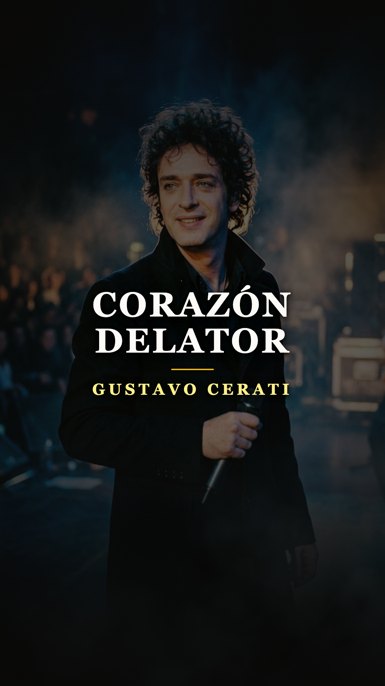
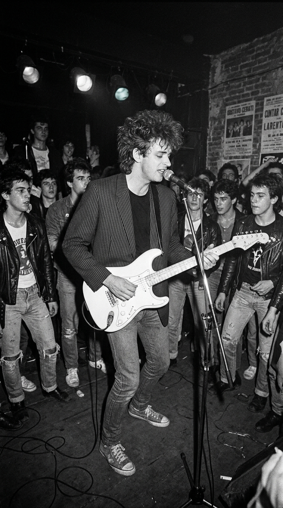
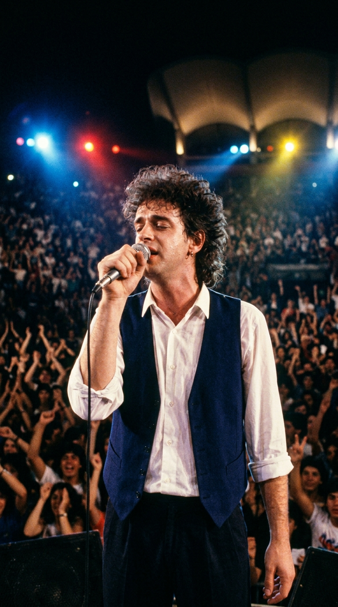
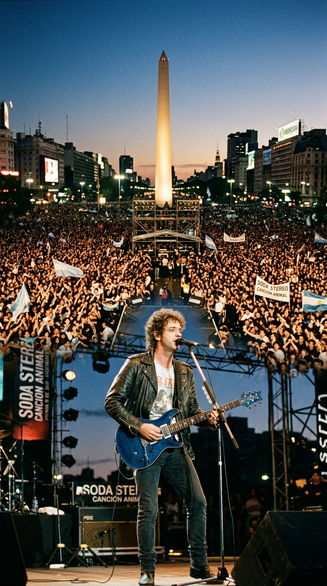
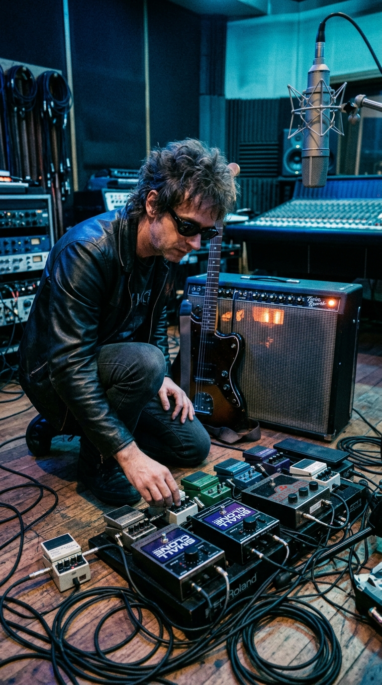
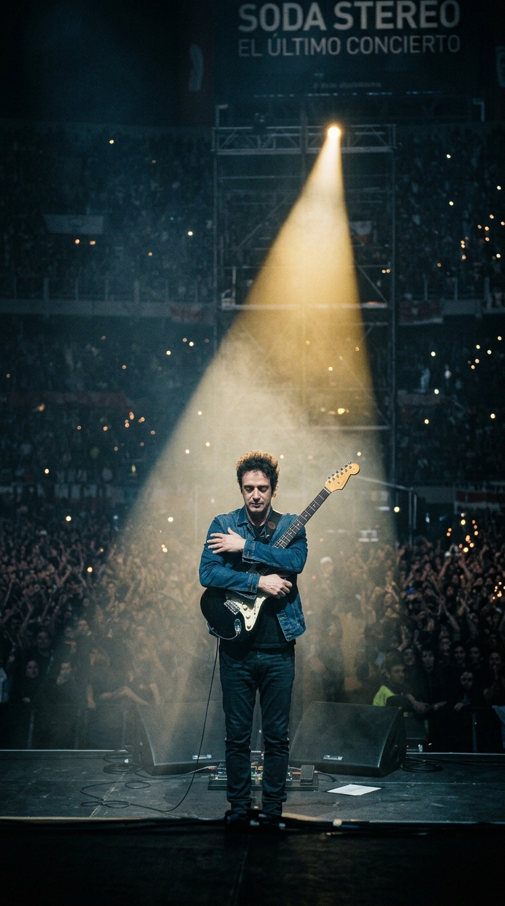
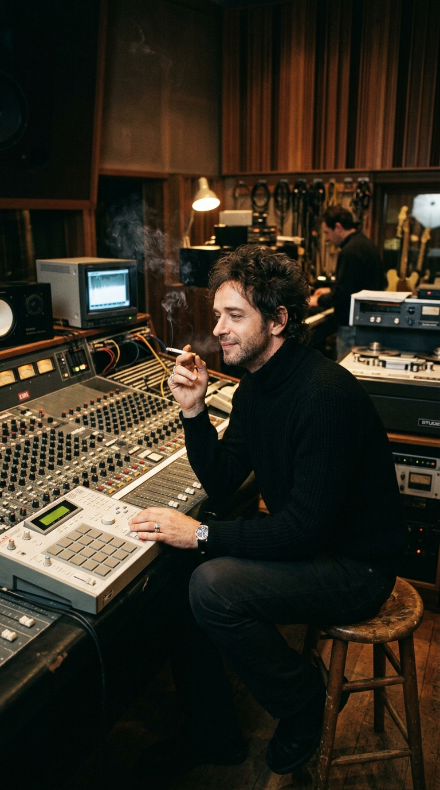
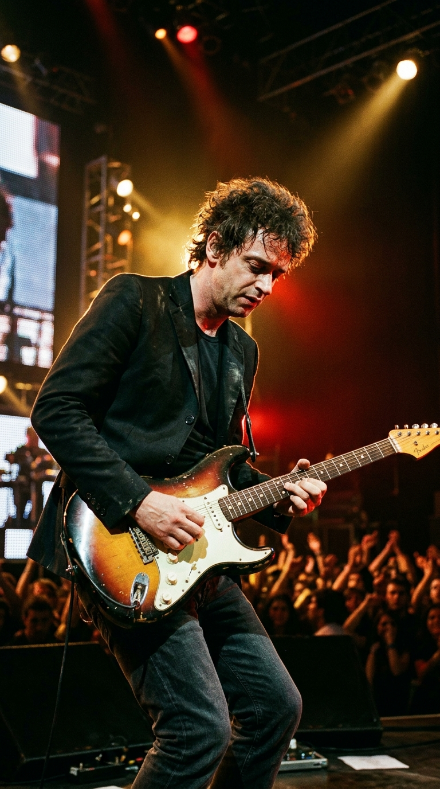
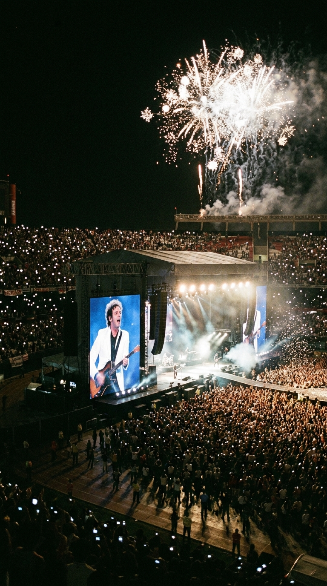
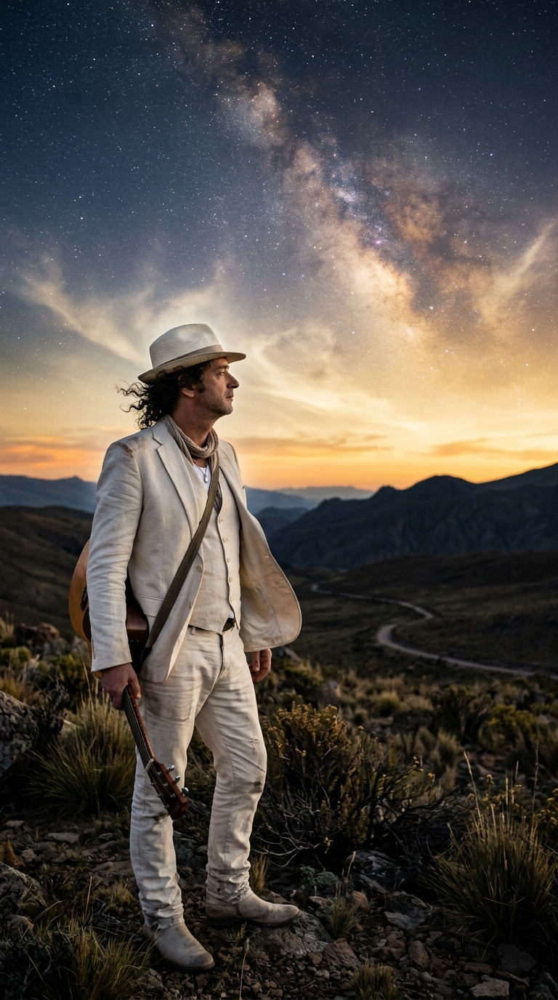

# 🏛️ El Arquitecto del Sonido Eterno: La Catedral Viva de Gustavo Cerati
### *Cómo un joven de rizos negros y guitarras angulares transformó la respiración de un continente, desafió las fórmulas del éxito comercial para abrazar la vanguardia y construyó el monumento musical más imponente del rock en español.*

---

**Por la redacción de Acordes Ocultos**  
*Tiempo de lectura estimado: 8 minutos*

---

### Prólogo: El Teatro Avenida y la solemnidad del corazón

La noche del 11 de agosto de 2001, las luces tenues del histórico **Teatro Avenida**, sobre la Avenida de Mayo en Buenos Aires, envolvían a cuarenta y dos músicos académicos en un silencio casi religioso. No había sintetizadores programados ni baterías electrónicas listas para estallar. El director de orquesta **Alejandro Terán** alzó su batuta en medio de una penumbra azulada. En el centro del proscenio, envuelto en un chaqué azul oscuro que evocaba a un aristócrata de otro siglo, un hombre de rizos azabache y mirada penetrante cerró los ojos y esperó.

Aquel hombre era **Gustavo Adrián Cerati**. A sus cuarenta y dos años, no necesitaba demostrarle nada a nadie. Había llenado estadios a lo largo de toda América Latina, había vendido millones de discos con Soda Stereo y se había consagrado como la voz más influyente de la cultura pop hispanoamericana. Sin embargo, estaba allí, despojado de su clásica guitarra eléctrica, dispuesto a someter su repertorio a la disciplina implacable de una orquesta sinfónica.

Cuando los violonchelos y los violines atacaron los primeros compases de *«Corazón Delator»*, una corriente eléctrica recorrió las butacas del teatro. El arreglo orquestal no era un adorno cosmético: era una reinterpretación visceral inspirada en los acordes oscuros de Bernard Herrmann para el cine de Hitchcock. Cuando Cerati abrió los labios para entonar *«Un señuelo... hay algo oculto en cada sensación»*, su voz no compitió con la orquesta; levitó sobre ella con una autoridad majestuosa.

En ese instante preciso quedó claro para la historia de nuestra música: Gustavo Cerati ya no pertenecía únicamente al panteón del rock juvenil de su tiempo. Se había convertido en un monumento perenne, en una **Catedral de Leyenda** cuya arquitectura sonora desafiaría el paso de los siglos.

---

### Acto I: La primavera democrática y el sonido angular (1982–1984)

Para comprender la magnitud de la obra de Cerati, es necesario regresar a los primeros meses de 1982 en una Argentina asfixiada por las sombras de la última dictadura militar y la herida abierta de la Guerra de Malvinas. El rock local de la época estaba dominado por la gravedad solemne y acústica del folk testimonial; una música sentada, reflexiva y enlutada.

Cerati, un estudiante de publicidad apasionado por la estética británica y el underground londinense, entendió antes que nadie que la juventud argentina necesitaba respirar, levantarse y sacudirse el dolor.

Junto al bajista **Zeta Bosio** y al baterista **Charly Alberti**, formó **Soda Stereo**. Fascinados por el ska dinámico de The Specials, el filo rítmico de The Police y la modernidad de Talking Heads, el trío comenzó a ensayar en el sótano de la casa familiar de Alberti en el barrio de Belgrano. 

*Buenos Aires, 1983: Un joven Gustavo Cerati de 24 años al frente de Soda Stereo en los clubes subterráneos porteños, desafiando la solemnidad del rock con estética new wave.*

Con sus peinados batidos con laca, camperas con hombreras angulares y letras cargadas de sarcasmo pop (*«¿Por qué no puedo ser del Jet-Set?»*, *«Sobredosis de TV»*), Soda Stereo descolocó a los críticos tradicionales del rock porteño, quienes inicialmente los tildaron de superficiales y frívolos. Pero Cerati no buscaba complacer a los guardianes del dogma: buscaba inaugurar el futuro. En los locales underground del Café Einstein y Zero Bar, el boca a boca fue fulminante. La modernidad había llegado al Río de la Plata y llevaba su firma.

---

### Acto II: La histeria continental y el mar humano de la 9 de Julio (1986–1991)

El debut homónimo de 1984 y el refinamiento oscuro de *Nada Personal* (1985) cimentaron su popularidad, pero fue en 1986, con la publicación de **«Signos»**, cuando la figura de Cerati adquirió una estatura mítica. Escrito durante noches enteras de insomnio creativo y crisis personal, el álbum introdujo una densidad poética y una elegancia melancólica sin precedentes en canciones como *«Prófugos»* y la versión original de *«Persiana Americana»*.

En febrero de 1987, Soda Stereo desembarcó en el **Festival Internacional de la Canción de Viña del Mar**, en Chile. Lo que ocurrió en la Quinta Vergara no fue un concierto: fue un terremoto social. Miles de fanáticos desbordaron las medidas de seguridad, los hoteles fueron sitiados y la prensa acuñó el término **«Sodamanía»**.

*Chile, 1987: Gustavo Cerati en la Quinta Vergara durante la explosión de la «Sodamanía», derribando para siempre las barreras aduaneras del rock en español.*

Por primera vez en la historia, una banda de rock cantado en español rompía las fronteras nacionales para conquistar de manera simultánea Chile, Perú, Colombia, Venezuela y México. Soda Stereo abrió la autopista continental por la que más tarde transitarían todas las bandas del continente.

El clímax de esta primera era dorada llegó el **14 de diciembre de 1991**. Tras haber grabado en Nueva York la obra cumbre del rock valvular, **«Canción Animal»** (1990), la banda ofreció un concierto gratuito en el cruce de la Avenida 9 de Julio y Avenida Corrientes, con el Obelisco porteño como testigo.

*Buenos Aires, 14 de diciembre de 1991: Un cuarto de millón de personas colman la Avenida 9 de Julio, coreando «De Música Ligera» en el mayor concierto gratuito de la historia argentina.*

**Doscientas cincuenta mil personas** se agolparon a lo largo de catorce cuadras de asfalto. Cuando la banda atacó los cuatro acordes inmortales de *«De Música Ligera»*, Buenos Aires tembló literalmente bajo los pies de una multitud que cantaba al unísono. Cerati estaba en la cúspide absoluta del poder popular. Y fue exactamente en ese instante de gloria comercial cuando decidió demolerlo todo.

---

### Acto III: La audacia del shoegaze y el adiós en River Plate (1992–1997)

Cualquier otro artista en la cima del éxito masivo habría repetido la fórmula de guitarras directas de *Canción Animal*. Gustavo Cerati hizo lo contrario. Intrigado por la escena británica de Manchester y los paisajes sonoros de My Bloody Valentine, Cocteau Twins y The Jesus and Mary Chain, se encerró en el estudio Supersónico para parir **«Dynamo»** (1992).

Fue un shock mayúsculo para la industria. En lugar de estribillos radiales inmediatos, *Dynamo* ofrecía muros de sonido distorsionado, capas de retardo y texturas hipnóticas (*«Primavera 0»*, *«Secuencia Inicial»*). Las radios no sabían cómo programarlo; muchos fanáticos quedaron descolocados. Sin embargo, con el paso de los años, el disco se convirtió en la piedra angular del rock alternativo en castellano. Cerati demostró que su lealtad no era con las ventas, sino con la búsqueda estética.

*Estudios Supersónico, 1992: Gustavo sumergido entre pedales de efectos y texturas de shoegaze durante las sesiones de Dynamo, adelantándose una década a su tiempo.*

Pero el costo humano de diez años de giras ininterrumpidas, presiones financieras y tensiones internas terminó por fracturar la convivencia del trío. Tras publicar el bellísimo y experimental *Sueño Stereo* (1995) y registrar su célebre sesión acústica para *MTV Unplugged* (*Comfort y Música Para Volar*, 1996), el 1 de mayo de 1997 Gustavo anunció formalmente la disolución de la banda a través de una carta abierta en el suplemento *Sí!* del diario Clarín:

> *«Comparto la tristeza que se generará en muchos. A mí mismo me pesa este cierre. Pero Soda Stereo es un capítulo terminado en nuestras vidas. No podemos engañarnos ni engañar a nadie»*.

El 20 de septiembre de 1997, ante más de sesenta y cinco mil almas en el **Estadio Monumental de River Plate**, la banda ofreció su despedida histórica en *El Último Concierto*. Al culminar los acordes finales de *«De Música Ligera»*, con la guitarra palpitando todavía contra su pecho, Cerati se acercó al micrófono, alzó la mirada hacia el cielo nocturno y pronunció la frase que quedaría cincelada para siempre en la memoria de Hispanoamérica:

> *«No sólo no hubiéramos sido nada sin ustedes, sino con toda la gente que estuvo a nuestro alrededor desde el comienzo; algunos siguen hasta hoy. ¡Gracias... totales!»*.

*Estadio Monumental, 20 de septiembre de 1997: El instante irrepetible de «Gracias Totales», sellando con dignidad y gratitud el cierre de una era legendaria.*

---

### Acto IV: El renacimiento en Abbey Road y el poder de las guitarras (1999–2007)

Muchos pronosticaron que, sin la marca protectora de Soda Stereo, Cerati pasaría a ser un recuerdo nostálgico de los años ochenta. Gustavo respondió con la obra cumbre de su carrera en solitario: **«Bocanada»** (1999).

Grabado entre su estudio CasaSubmarina en Buenos Aires y los míticos **Abbey Road Studios** de Londres —donde convocó a *The London Session Orchestra* bajo arreglos de Gavin Wright—, *Bocanada* fue una obra maestra de trip-hop, pop electrónico, texturas cinematográficas y samples milimétricos (desde Spencer Davis Group hasta Gary Wright). Canciones como *«Puente»*, *«Paseo Inmortal»* y la propia *«Bocanada»* consolidaron a Gustavo como un orfebre sonoro incomparable.

*Londres, 1999: Gustavo Cerati en los estudios Abbey Road durante la concepción de Bocanada, fusionando samplers vintage y arreglos orquestales con refinada elegancia.*

Tras la experimentación electrónica de *Siempre es Hoy* (2002), en 2006 Cerati decidió volver a su primer amor: el rock eléctrico visceral. Con **«Ahí Vamos»**, rodeado por una banda de virtuosos (Richard Coleman, Fernando Nalé, Leandro Fresco y Bolsa González), desató una tormenta de riffs afilados y melodías perfectas (*«Crimen»*, *«La Excepción»*, *«Adiós»*). El álbum arrasó en los premios Grammy Latino y consagró su madurez absoluta como compositor clásico.

*Gira Ahí Vamos, 2006: Gustavo Cerati en plenitud de virtuosismo rockero, comandando el escenario con maestría interpretativa y aplauso unánime.*

Y cuando el planeta creía haber visto todo, llegó el reencuentro. En 2007, diez años después de su despedida, Soda Stereo anunció la gira continental **«Me Verás Volver»**. 

El impacto superó cualquier cálculo: la banda agotó **seis estadios River Plate**, pulverizando el récord que ostentaban The Rolling Stones con cinco fechas consecutivas en el mismo escenario. Más de un millón de espectadores en toda América presenciaron a una banda en estado de gracia que no volvía por nostalgia, sino para reclamar su trono legítimo en la historia.

*Estadio River Plate, 2007: Soda Stereo rompe récords continentales con seis estadios repletos durante la gira «Me Verás Volver», consagrando la inmortalidad de su legado.*

---

### Acto V: El viaje cósmico y el paso a la eternidad (2009–2014)

En 2009, Gustavo presentó lo que él mismo definió como su álbum más libre y luminoso: **«Fuerza Natural»**. Lejos de la distorsión urbana de *Ahí Vamos*, el disco abrazó el folk psicodélico, la imaginería campestre, las guitarras acústicas y la fascinación por el universo (*«Déjà Vu»*, *«Magia»*, *«Cactus»*). Vestido con un traje claro y un sombrero campesino, Cerati parecía un chamán elegante que navegaba las corrientes invisibles del tiempo.

*2009: Gustavo Cerati durante la era de Fuerza Natural, su testamento sonoro más luminoso, mirando con serenidad hacia el infinito.*

El 15 de mayo de 2010, en el campo de fútbol de la Universidad Simón Bolívar en **Caracas, Venezuela**, Gustavo ofreció el último concierto de la gira de presentación de *Fuerza Natural*. Tras interpretar *«Lago en el Cielo»*, se despidió con una sonrisa radiante: *«Hasta la próxima, chao»*. Minutos después, en su camerino, sufrió un accidente cerebrovascular del que jamás despertaría.

Durante cuatro años, una multitud silenciosa depositó flores, cartas y plegarias en las afueras de la Clínica Alcla de Buenos Aires. El 4 de septiembre de 2014, a los cincuenta y cinco años, su corazón se detuvo definitivamente.

---

### Epílogo: El templo que jamás se derrumbará

Las leyendas no se miden por los años que vivieron sobre la tierra, sino por el tamaño del vacío que dejan al partir y la solidez del refugio que construyeron para quienes quedan.

Gustavo Cerati no perteneció a las modas pasajeras. Construyó su obra como los antiguos maestros levantaban las grandes catedrales góticas: con nervaduras de bajo inquebrantables, vitrales de sintetizadores luminosos, contrafuertes de guitarras distorsionadas y una cúpula poética que todavía hoy cobija las alegrías y las penas de millones de seres humanos en todos los rincones de habla hispana.

Cuando su voz suena en una habitación solitaria diciendo *«Usa el amor como un puente»* o *«Mereces lo que sueñas»*, no escuchamos a un cantante del pasado. Escuchamos al arquitecto eterno que nos enseñó que la música, cuando se concibe con rigor, belleza y entrega absoluta, es la única forma terrenal de tocar el infinito.

---

### 📚 Fuentes y Archivo Documental

1. **Aboitiz, Maitena** (2012). *Cerati en primera persona*. Buenos Aires: Ediciones B. (Compilación exhaustiva de testimonios directos, entrevistas de prensa y reflexiones estéticas de Gustavo Cerati entre 1983 y 2010).
2. **Fernández Bitar, Marcelo** (2015). *Soda Stereo: La biografía total*. Buenos Aires: Sudamericana. (Registro cronológico y documental de las sesiones de grabación, contratos, giras internacionales y conciertos históricos de la banda).
3. **Morris, Juan** (2015). *Cerati: La biografía*. Buenos Aires: Planeta. (Investigación biográfica detallada sobre su infancia, proceso compositivo, la concepción de *Bocanada* en Abbey Road y los últimos días de la gira en Caracas).
4. **Archivo Hemerográfico Diario Clarín** (1991–1997). Cobertura de prensa del concierto masivo en la Av. 9 de Julio (15 de diciembre de 1991) y la crónica del Último Concierto en River Plate (21 de septiembre de 1997).
5. **Rolling Stone Argentina** (Edición especial de colección, septiembre de 2014). *Gustavo Cerati: El sonido del mito*. Archivo de entrevistas históricas y ensayos discográficos.
6. **Sony Music Entertainment Argentina / BMG** (2001). *11 Episodios Sinfónicos: Notas de producción y registro del concierto en el Teatro Avenida de Buenos Aires*, bajo la dirección y arreglos orquestales de Alejandro Terán.
7. **Terán, Alejandro** (2001–2014). Entrevistas y testimonios sobre la concepción y partituras de los arreglos orquestales para *11 Episodios Sinfónicos* y su presentación en el Teatro Avenida y Auditorio Nacional de México.
