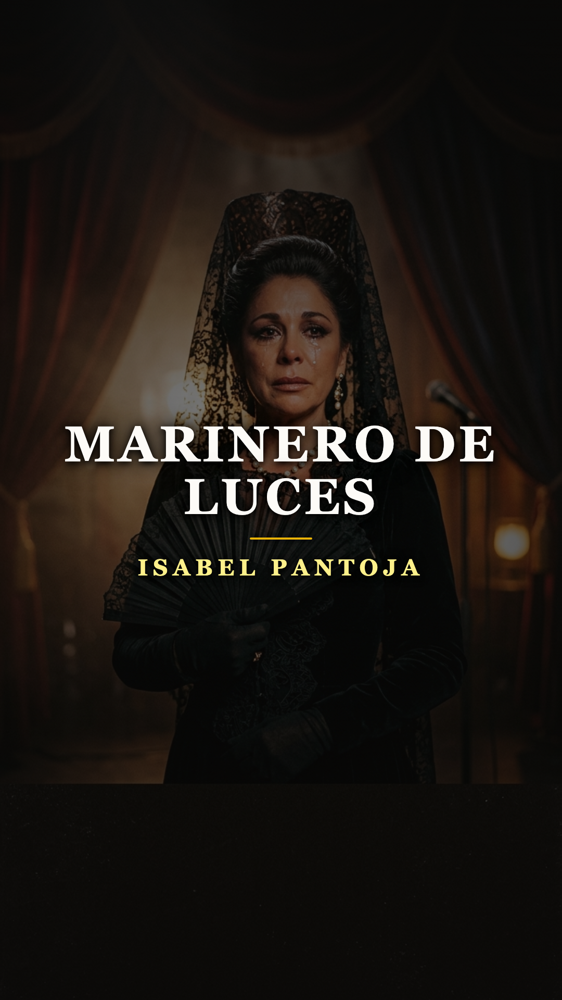
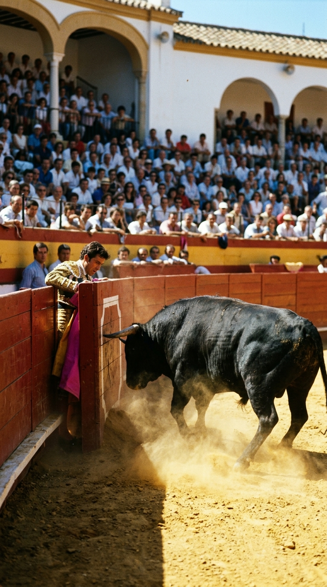
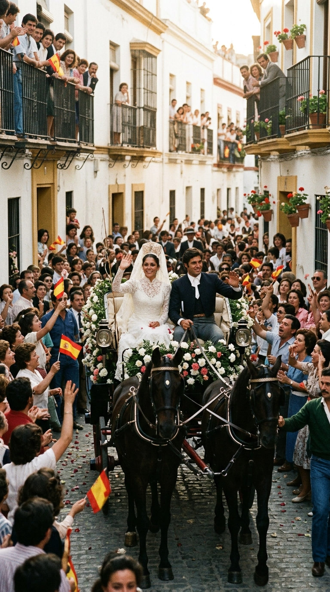
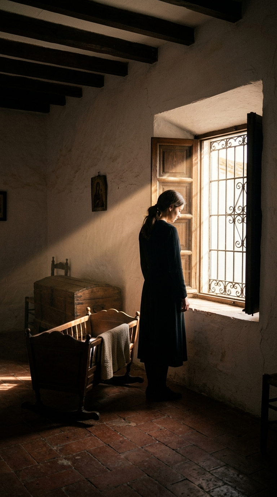
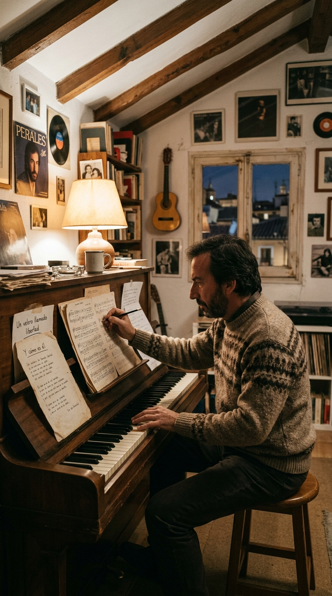
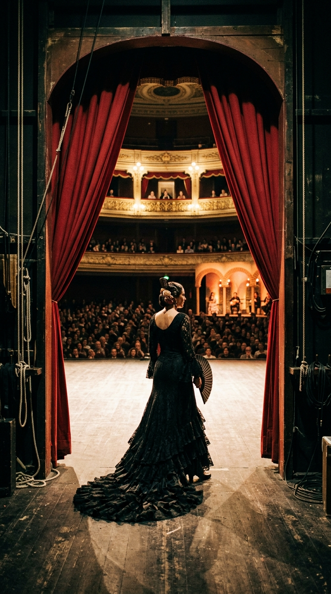
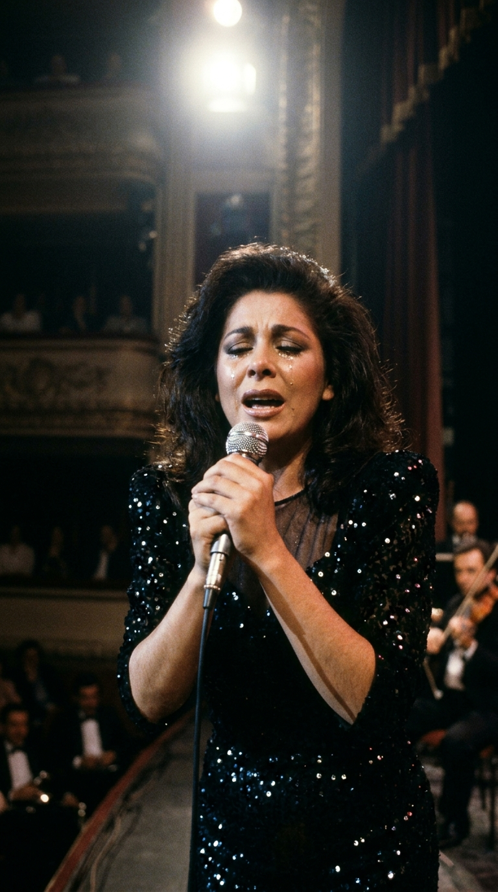

# ⛵ El Llanto que Paralizó a un País: La Tragedia Real de «Marinero de Luces»
### *Cómo la muerte televisada de Paquirri en Pozoblanco vistió de luto a España, el encierro de Isabel Pantoja en Cantora y el réquiem sanador de José Luis Perales que convirtió la sangre del ruedo en un velero hacia la eternidad.*

---

**Por la redacción de Acordes Ocultos**  
*Tiempo de lectura estimado: 8 minutos*

---

### Prólogo: La calima de Pozoblanco y la serenidad en la enfermería

La tarde del 26 de septiembre de 1984, la localidad cordobesa de **Pozoblanco** ardía bajo un sol plomizo de final de verano. Era el cierre de feria. En los carteles figuraban Vicente Ruiz «El Soro», José Cubero «Yiyo» y la máxima figura del toreo de la época: **Francisco Rivera «Paquirri»**, con treinta y seis años recién cumplidos y en el cenit de su poderío físico y profesional.

Nadie presagiaba el horror. Saltó al ruedo el cuarto toro de la tarde, llamado **«Avispado»**, cárdeno, de la ganadería de Sayalero y Bandrés. Durante un quite con el capote pegado a las tablas del tendido uno, el astado derrotó con violencia y prendió al matador por el muslo derecho. El toro no lo soltó de inmediato: lo zarandeó en el aire suspendido de la taleguilla durante varios segundos angustiosos que parecieron una eternidad.

Cuando sus cuadrillas lograron arrancar el cuerpo de los pitones y lo trasladaron a la enfermería de la plaza, el pantalón de seda y oro manaba una hemorragia torrencial. Las cámaras de televisión grabaron una escena que heló el corazón de millones de españoles. Tendido sobre una modesta camilla de hule, pálido pero con los ojos abiertos de par en par, Paquirri miró al médico cirujano de la plaza, el doctor **Eliseo Morán**, y pronunció unas palabras que pasaron a la historia del toreo por su escalofriante temple:

> *«Doctor, yo quiero hablar con usted o no me voy a quedar tranquilo. La herida es fuerte. Tiene al menos dos trayectorias: una para allá y otra para acá. Abran todo lo que tengan que abrir, y lo demás está en sus manos. Y calma, doctor, mucha calma»*.

*Pozoblanco, 26 de septiembre de 1984: La arena ensangrentada del ruedo cordobés donde el toro Avispado segó la vida del torero más célebre de la época.*

El asta de Avispado había destrozado la vena safena y la arteria femoral. En una enfermería de pueblo carente de banco de sangre e instrumental para cirugía vascular compleja, los médicos taponaron la hemorragia a la desesperada. En la ambulancia que lo trasladaba a Córdoba, a la altura del término municipal de Villaharta, el torero entró en parada cardiorrespiratoria irreversible. Paquirri murió desangrado antes de llegar al hospital.

---

### Acto I: La boda del siglo y el sueño truncado (1983)

Para entender la onda expansiva que sacudió a España aquella tarde, es necesario retroceder diecisiete meses en el tiempo. El **30 de abril de 1983**, Sevilla fue el epicentro de la llamada «boda del siglo». Ante el altar de la Basílica del Gran Poder, unían sus destinos las dos grandes pasiones populares de la tradición andaluza: el matador de toros más carismático y la joven tonadillera llamada a heredar el trono de la copla, **Isabel Pantoja**.

*Sevilla, 30 de abril de 1983: Isabel Pantoja y Paquirri en su enlace nupcial, la unión cumbre de la tonadilla y la tauromaquia que cautivó al país.*

Aquel romance representaba el triunfo del amor joven y fulgurante. Isabel, criada en el barrio sevillano del Tardón e hija de un cantaor humilde, había trabajado desde niña en los tablaos. Paquirri, divorciado de Carmina Ordóñez, personificaba la estampa del héroe clásico andaluz: noble, valiente y generoso.

En febrero de 1984 nació su único hijo en común, Francisco José (conocido popularmente como «Kiko»). La felicidad de la pareja parecía inexpugnable. Apenas siete meses después del nacimiento del niño, la llamada telefónica desde Córdoba partió en dos la existencia de Isabel Pantoja. Tenía veintiocho años y su mundo se había derrumbado para siempre.

---

### Acto II: El silencio sepulcral de Cantora y la viuda de España (1984–1985)

El entierro de Paquirri en el cementerio de San Fernando de Sevilla fue una marea humana desbordada de dolor popular. Detrás del féretro, oculta bajo unas gafas oscuras y un velo de luto impenetrable, Isabel apenas podía sostenerse en pie.

Tras las exequias, la cantante tomó una decisión radical: canceló todos sus contratos discográficos, clausuró sus apariciones públicas y se recluyó tras los muros encalados de **Cantora**, la inmensa finca ganadera gaditana que su marido había comprado y que ambos habían soñado como su paraíso familiar.

*Cantora, finales de 1984: Isabel Pantoja sumida en el luto riguroso y la reclusión absoluta, negándose a pisar un escenario tras la muerte de su esposo.*

Durante catorce meses ininterrumpidos, Cantora se convirtió en un convento laico. Isabel vistió rigurosamente de negro azabache, sin joyas ni maquillaje, encerrada en la penumbra del cortijo y dedicada exclusivamente a criar a su hijo huérfano. La prensa bautizó a la artista como **«La Viuda de España»**. Los periódicos especulaban sobre su salud mental; los promotores musicales intentaban contactarla sin éxito. Su respuesta era siempre la misma: *«No volveré a cantar jamás. La voz se me murió con Paco»*.

---

### Acto III: El orfebre secreto y la metáfora del mar (1985)

A comienzos de 1985, los directivos de la discográfica RCA/Ariola sabían que solo existía un hombre en España capaz de tender un puente entre la oscuridad de Isabel y la música: **José Luis Perales**.

El cantautor conquense era el compositor melódico más respetado del momento, célebre por su delicadeza poética y su capacidad para desnudar las emociones humanas sin caer jamás en la vulgaridad ni el sensacionalismo. Cuando le propusieron el encargo de escribir el disco del regreso de Pantoja, Perales sintió un pánico inicial:

> *«Pensé que era una responsabilidad tremenda. Toda España estaba pendiente de aquel dolor. Yo no quería hacer un disco morboso. Si mencionaba la arena, los toros, las cornadas o la sangre, habría sido una profanación del duelo»*.

Perales se encerró en el ático de su casa en Madrid frente al piano. Allí tomó una decisión creativa genial: **trasladar la tragedia al mar**.

*Madrid, 1985: José Luis Perales al piano, componiendo en secreto el réquiem poético que salvaría a Isabel Pantoja del abismo emocional.*

El «traje de luces» del torero se transformó poéticamente en un **«marinero de luces»**. El albero de la plaza pasó a ser la orilla (*«con alma de fuego y espalda de arena»*). La partida mortal no se nombró como una cornada sangrienta, sino como un viaje en la distancia: *«ese barco velero, cargado de sueños, cruzó la bahía...»*. Las metáforas marinas funcionaban como un escudo protector: le permitían a Isabel gritar su llanto a los cuatro vientos sin tener que nombrar la herida de Pozoblanco.

Con una maqueta grabada a guitarra y voz, Perales viajó a Cantora. En la soledad del salón de la finca, tomó su guitarra española y le cantó *«Marinero de Luces»* mirándola a los ojos. Isabel rompió a llorar desconsoladamente durante más de una hora. Cuando secó sus lágrimas, alzó la mirada y susurró: *«José Luis, estas canciones son mi propia alma. Las voy a cantar»*.

---

### Acto IV: La noche del Lope de Vega y el llanto ante la Reina (5 de diciembre de 1985)

La noche del **5 de diciembre de 1985**, la Gran Vía madrileña quedó paralizada. En el **Teatro Lope de Vega**, no cabía un alfiler. En el palco de honor se encontraba la **Reina Doña Sofía**, acompañada por las principales personalidades de la cultura, la política y la sociedad española. Televisión Española transmitía en directo para millones de hogares que contenían la respiración.

Se apagaron las luces de la sala. Tras catorce meses de mutismo, se descorrió el telón de terciopelo granate. Sobre el proscenio apareció la silueta solitaria de Isabel Pantoja: bata de cola de terciopelo negro azabache, peineta oscura y el cabello recogido con sobria elegancia.

*Madrid, 5 de diciembre de 1985: La silueta de espaldas de Isabel Pantoja antes de salir al escenario del Lope de Vega frente a la Reina Sofía.*

Cuando la orquesta dirigida por el maestro Rafael Ferro inició los compases de *«Marinero de Luces»*, un silencio sobrecogedor se apoderó del teatro. Isabel tomó el micrófono con manos temblorosas. Al pronunciar los versos:

> *«Ese barco velero, cargado de sueños, cruzó la bahía*  
> *Me dejó aquella tarde agitando el pañuelo*  
> *Sentada en la orilla...»*

La cantante no pudo contener el dique del dolor. Grandes lágrimas negras de rímel surcaron sus mejillas ante las cámaras. Su voz se quebró por momentos, transformando la balada en un desgarro visceral, casi telúrico, que trascendió la música popular. La Reina Sofía, conmovida en el palco, aplaudió con los ojos humedecidos. El teatro entero se puso en pie en una ovación interminable de más de diez minutos que fue secundada por el llanto de un país entero frente al televisor.

*5 de diciembre de 1985: El llanto desgarrador de Isabel Pantoja cantando «Marinero de Luces», la mayor catarsis colectiva en la historia de la televisión española.*

Aquella noche, el duelo privado de una viuda se convirtió en la catarsis colectiva de toda España. Isabel Pantoja no solo no había perdido la voz: había aprendido a cantar desde las cenizas.

---

### Epílogo: El velero que nunca volvió a puerto

El disco **«Marinero de Luces»** fue un fenómeno social sin precedentes en la industria discográfica española. Vendió **más de un millón de copias**, copó las listas de éxitos durante meses en toda América Latina y consagró a Isabel Pantoja como la mayor vendedora de discos del país.

Canciones como *«Hoy quiero confesarme»*, *«Era mi vida él»* y *«Pensando en ti»* completaron una obra redonda donde cada surco respiraba la ausencia del hombre amado. Pero ninguna alcanzó la dimensión mítica de *«Marinero de Luces»*.

*Alegoría poética del velero de luces que zarpó hacia el infinito, inmortalizado por los versos de José Luis Perales.*

Las heridas del ruedo de Pozoblanco jamás cicatrizaron del todo en la memoria de los españoles. Sin embargo, gracias a la sensibilidad orfebre de José Luis Perales y a la valentía desgarrada de una mujer herida, la muerte de Paquirri no quedó sepultada en una camilla de hospital, sino suspendida en un océano eterno donde los barcos nunca naufragan del todo.

---

### 📚 Fuentes y Archivo Documental

1. **Perales, José Luis** (2015–2020). Entrevistas testimoniales en RTVE (*«Lazos de Sangre»*) y declaraciones hemerográficas sobre la composición de *Marinero de Luces* y su encuentro con Isabel Pantoja en Cantora.
2. **Archivo Histórico de Radio Televisión Española (RTVE)** (1984–1985). Registro audiovisual de la cornada de Pozoblanco (26 de septiembre de 1984) y grabación íntegra del recital benéfico en el Teatro Lope de Vega de Madrid ante la Reina Doña Sofía (5 de diciembre de 1985).
3. **Dr. Eliseo Morán** (1984). *Parte médico oficial de la enfermería de la Plaza de Toros de Pozoblanco*, certificando la herida por asta de toro de Francisco Rivera «Paquirri» con rotura de vasos femorales.
4. **Hemeroteca Diario ABC y El País** (Ediciones del 27–30 de septiembre de 1984 y 6 de diciembre de 1985). Cobertura del fallecimiento de Paquirri y crónica cultural de la reaparición musical de Isabel Pantoja.
5. **RCA / Ariola Records** (1985). *Notas de producción y créditos discográficos del álbum «Marinero de Luces»*, arreglos de Rafael Ferro y letras de José Luis Perales.
