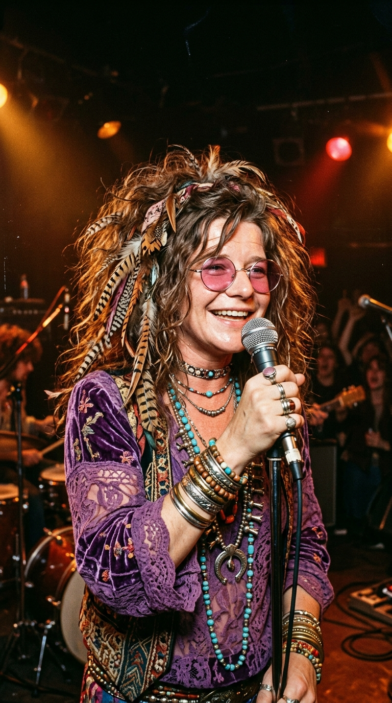
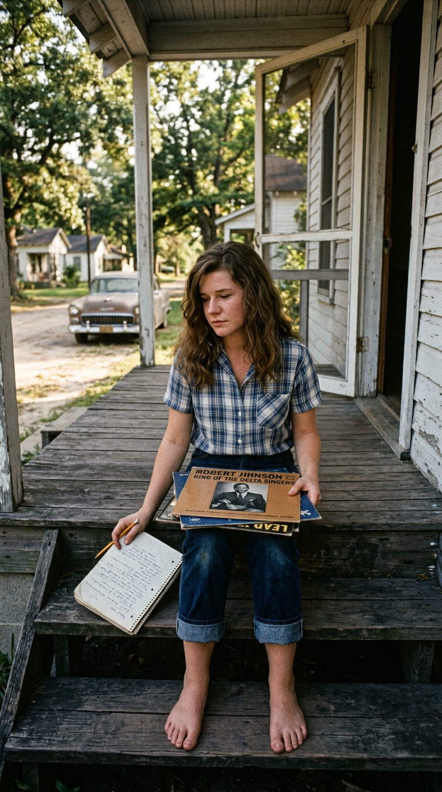
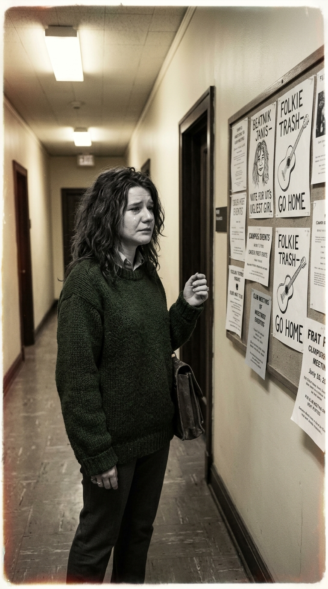
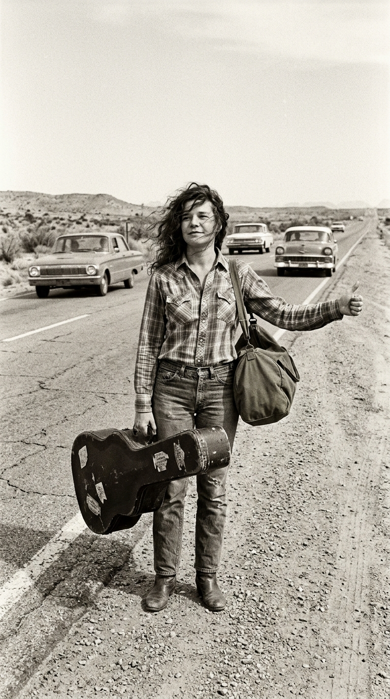
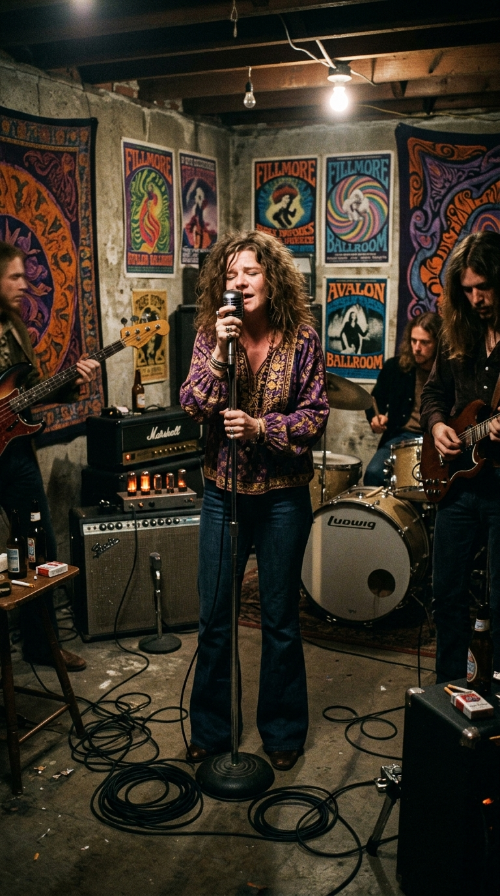
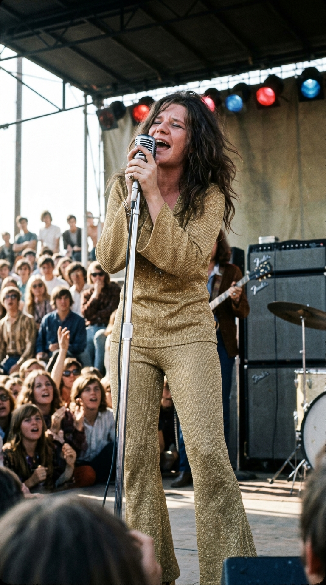
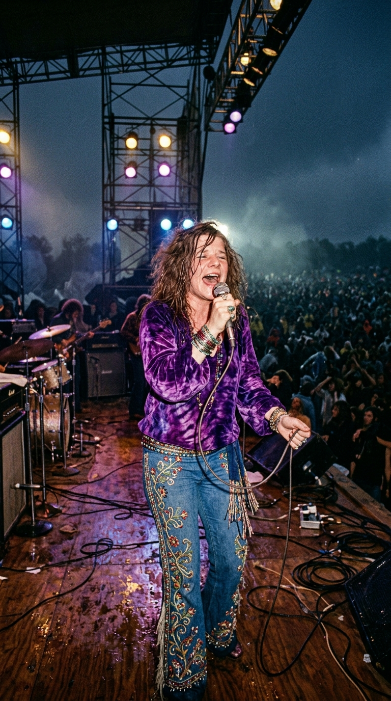
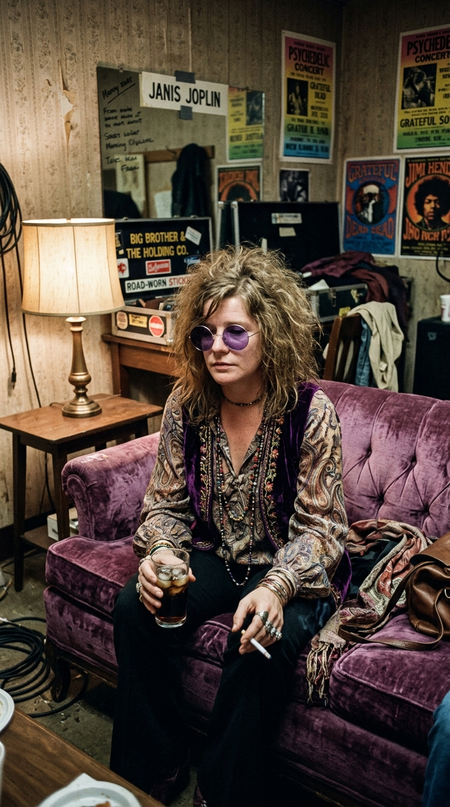
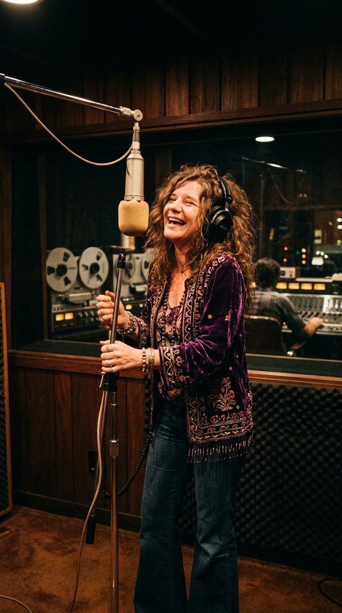
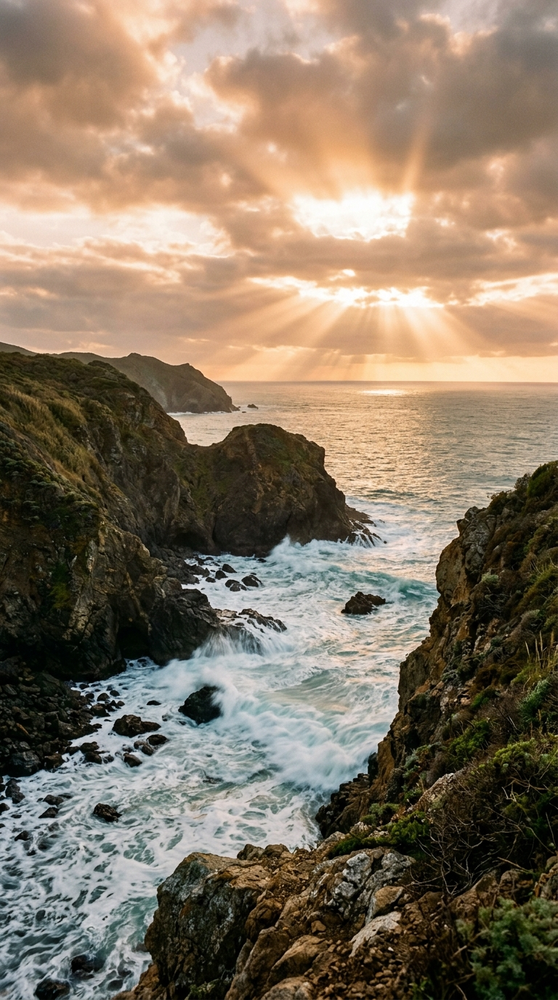

# 🎙️ El Cometa Indomable: Janis Joplin, el Desgarro de Port Arthur y los Nueve Destellos de Gloria
### *De la estudiante humillada como «el hombre más feo del campus» a la reina salvaje que reinventó el blues con «Piece of My Heart», ardiendo en apenas cuatro años meteóricos para sembrar sus cenizas en el Pacífico.*

---

**Por la redacción de Acordes Ocultos**  
*Tiempo de lectura estimado: 8 minutos*

---

### Prólogo: La garganta en carne viva

Janis Joplin no cantaba con las cuerdas vocales: cantaba con las heridas abiertas de toda una vida. Cuando se acercaba al micrófono —aferrándolo con ambas manos como si fuera el borde de un precipicio, inclinando la cabeza hacia atrás mientras sacudía su melena encrespada envuelta en boas de plumas púrpuras—, de su garganta no brotaba la dicción edulcorada del pop radiofónico. Brotaba un rugido telúrico, un aullido de lija y terciopelo que sonaba como si Bessie Smith y Otis Redding hubieran colisionado a toda velocidad contra un amplificador de válvulas saturado de ácido lisérgico.

Fue un cometa salvaje. En apenas cuatro años deslumbrantes —entre su aparición casi anónima en el Festival de Monterey en 1967 y su muerte prematura en un motel de Hollywood en 1970—, Janis destrozó todas las convenciones sobre cómo debía comportarse, sonar y vestir una mujer sobre un escenario de rock. Abrió a patadas las puertas de un club que hasta entonces era coto exclusivo de varones virtuosos, enseñando a una generación entera que el dolor más insoportable podía transformarse en la forma más pura de belleza y emancipación.

Esta es la crónica de sus nueve destellos de gloria: los nueve instantes epistolares que forjaron a la leyenda más desgarradora y querida del siglo XX.

---

### Hito I (1958): El estigma de Port Arthur y el refugio del blues

Para entender el volcán que rugía en el pecho de Janis, es imprescindible situarse en **Port Arthur**, Texas, a finales de la década de 1950. Era una localidad petrolera, plana y asfixiante, gobernada por una moral puritana intransigente, donde el destino inexorable de cualquier muchacha era casarse con un empleado de refinería, sonreír en los sermones dominicales y ocultar cualquier atisbo de singularidad.

*Port Arthur, finales de los 50: Janis Joplin sentada en el porche de madera con sus cuadernos de poesía y discos de vinilo, buscando un escape al conservadurismo asfixiante.*

Janis, nacida el 19 de enero de 1943 en el seno de una familia de clase media, pronto comprendió que no encajaba en aquel molde. Tenía sobrepeso, padecía un acné severo que le dejó cicatrices cutáneas permanentes y se negaba a llevar los vestidos de miriñaque de sus compañeras. Pero su pecado imperdonable para la burguesía local fue de orden moral y cultural: en una Texas férreamente segregada por las leyes de Jim Crow, Janis proclamaba abiertamente su rechazo al racismo y se reunía con un puñado de chicos inadaptados para escuchar discos clandestinos de blues negro importados de Luisiana.

En las voces cavernosas de **Bessie Smith**, **Lead Belly** y **Big Mama Thornton**, Janis halló su hogar espiritual. Aquellos cantantes no fingían la felicidad; hablaban del abandono, del desamor brutal, del alcoholismo y de la soledad nocturna. En su habitación, Joplin comenzó a imitar sus inflexiones, descubriendo con asombro que cuando abría la boca, el dolor acumulado por el rechazo social se disolvía en una vibración poderosa que estremecía los cristales.

---

### Hito II (1962): La crueldad colegial en Austin y el hombre más feo del campus

En el otoño de 1962, buscando escapar de la mediocridad de su pueblo natal, Janis se matriculó en la **Universidad de Texas en Austin** para estudiar Bellas Artes. Caminaba por el campus vestida con pantalones vaqueros desgastados de hombre, camisas campesinas de lana, descalza o en sandalias, cargando una vieja autoharpa y sus carpetas de dibujo. Su aspecto estrafalario y su carcajada estruendosa la convirtieron de inmediato en el blanco de las burlas del estudiantado convencional.

*Otoño de 1962, Universidad de Texas en Austin: Janis camina junto a los paneles estudiantiles con paso firme, disimulando la herida más cruel de su juventud.*

El golpe más vil llegó a finales de aquel semestre. Los miembros de una prominente fraternidad masculina universitaria organizaron un concurso público y colocaron carteles por todo el campus para votar al **«Hombre Más Feo del Campus»** (*Ugly Man on Campus*). Como una broma sádica orquestada, varios estudiantes postularon la fotografía de Janis Joplin. 

El día del escrutinio, Janis caminó inocentemente hacia la cafetería universitaria y vio su propio rostro ampliado en una caricatura burlona, anunciando que había sido elegida ganadora oficial de la votación.

Las crónicas de sus compañeros de cuarto recuerdan que Janis no gritó ni armó un escándalo en público. Mantuvo la cabeza erguida mientras atravesaba el pasillo entre las risotadas de cientos de jóvenes, se encerró en su habitación y lloró desconsoladamente durante días. Aquella humillación institucional no solo partió su autoestima para siempre; fue la gota que colmó el vaso de su paciencia. Comprendió que jamás sería aceptada por la sociedad respetable y que su único camino hacia la supervivencia era huir hacia los márgenes de la civilización.

---

### Hito III (1963): El pulgar en la carretera y el aullido del autostop

A principios de 1963, sin dinero en los bolsillos y con una vieja guitarra acústica de segunda mano colgada al hombro en una funda de lona raída, Janis Joplin se paró en el arcén de la Ruta 66, levantó el pulgar y comenzó a hacer autostop rumbo a California.

*1963: En la cuneta de la carretera desértica, con el pelo al viento y una vieja guitarra, huyendo hacia San Francisco en busca de una voz propia.*

Fueron miles de kilómetros de polvo, camiones de carga y noches al raso. Janis subsistía cantando en tabernas oscuras de camioneros, clubes de folk de mala muerte en Venice Beach y cafés bohemios de San Francisco, recibiendo como pago unas monedas en un vaso de plástico o un plato de sopa caliente.

En aquellos tugurios sin micrófonos profesionales ni amplificación, Janis se vio obligada a forzar el aparato fonador para hacerse oír sobre el tintineo de las botellas de cerveza y el murmullo de los parroquianos borrachos. Fue en esa intemperie donde su voz mutó: las notas dulces de soprano folk que practicaba en su adolescencia se quebraron por el tabaco barato, el whisky y el esfuerzo físico, adquiriendo esa textura áspera, arenosa y desgarradora que más tarde electrizaría al mundo. Había nacido la voz del blues blanco más indómita de América.

---

### Hito IV (1966): La colisión eléctrica con Big Brother and the Holding Company

En 1966, el distrito de Haight-Ashbury en San Francisco se había convertido en la capital cósmica de la contracultura hippie. Cientos de bandas experimentaban con el rock ácido, pero un cuarteto de músicos psicodélicos llamado **Big Brother and the Holding Company** —integrado por **Sam Andrew** y **James Gurley** en las guitarras, **Peter Albin** en el bajo y **Dave Getz** en la batería— buscaba desesperadamente una voz principal que pudiera dotar de fuego a sus desarticuladas murallas de distorsión.

El promotor y mánager Chet Helms, que había conocido a Janis en sus años de vagabundeo por Texas, envió a un amigo a buscarla a Port Arthur (adonde Joplin había regresado temporalmente para intentar rehabilitarse de sus primeras adicciones). Cuando Janis entró en el sótano húmedo de San Francisco donde ensayaba el grupo, la colisión fue inmediata.

*1966: Entre marañas de cables y amplificadores humeantes, Janis Joplin fusiona su desgarro vocal con el sonido ácido de Big Brother.*

Hasta entonces, Janis solo había cantado acompañada de guitarras acústicas de palo. Cuando los amplificadores Fender de Gurley y Andrew comenzaron a rugir con toneladas de feedback y sustain distorsionado, Joplin sintió una revelación física:  
> *«Nunca había escuchado una potencia semejante. Sentí que podía apoyarme contra esa pared de sonido y empujar con todo mi cuerpo»*.

Janis dejó de contenerse. Se desprendió de los corsés melódicos del folk y comenzó a aullar, a gemir y a saltar en el estudio con una ferocidad casi chamánica. La química fue instantánea: Big Brother aportaba la anarquía eléctrica de las drogas psicodélicas, y Janis aportaba el alma y las raíces centenarias del blues negro.

---

### Hito V (Junio de 1967): El estallido de Monterey Pop y la redención dorada

El fin de semana del 16 al 18 de junio de 1967 tuvo lugar el acontecimiento que cambió la historia de la música moderna: el **Monterey International Pop Festival**. Ante cincuenta mil personas y los principales ejecutivos de las compañías discográficas de Nueva York y Los Ángeles, desfilaban titanes como The Who, Jimi Hendrix, Otis Redding y The Byrds.

Big Brother and the Holding Company actuó el sábado por la tarde. El mánager del grupo, receloso del negocio comercial, había prohibido inicialmente que las cámaras del documentalista **D.A. Pennebaker** filmaran su actuación. Pero cuando Janis subió al entarimado, vestida con un conjunto pantalón de punto dorado brillante que relucía bajo el sol de California, el tiempo se detuvo.

*Junio de 1967: Ataviada en oro resplandeciente en el Monterey Pop Festival, Janis Joplin conmociona a la historia del rock interpretando «Ball and Chain».*

Comenzaron a tocar **«Ball and Chain»** de Big Mama Thornton. Janis no cantó: convulsionó. Con los pies marcando un compás frenético, las venas del cuello a punto de reventar y los ojos apretados con una angustia palpable, expulsó cinco años de vejaciones, soledad y desprecio en una interpretación de una violencia emocional sobrehumana. 

Entre el público de la zona VIP, la cámara de 16 milímetros de Pennebaker captó el fotograma más elocuente de la década: **Mama Cass Elliot**, la carismática cantante de The Mamas & the Papas, sentada entre el público con la boca abierta de par en par, exclamando en un susurro incrédulo: *«Oh, wow... that’s heavy!»*.

El impacto fue tan arrollador que Pennebaker y los organizadores rogaron a la banda que repitieran su concierto al día siguiente para poder inmortalizarlo en película. Aquella misma tarde, el legendario presidente de Columbia Records, **Clive Davis**, acudió a los camerinos con un contrato en blanco de **doscientos cincuenta mil dólares** para ficharla en exclusiva. La chica que Texas había llamado monstruo se había convertido en la diosa indiscutible del rock and roll.

---

### Hito VI (1968): «Piece of My Heart» y la cima del mundo con Cheap Thrills

En el verano de 1968, Columbia Records publicó ***Cheap Thrills***, con una portada legendaria dibujada por el historietista contracultural Robert Crumb. El álbum fue un cataclismo comercial: despachó un millón de copias en sus primeras semanas y permaneció ocho semanas consecutivas en el **número uno del Billboard 200**.

El corazón sónico del disco era **«Piece of My Heart»**, una canción compuesta por Jerry Ragovoy y Bert Berns que la hermana de Aretha Franklin, Erma Franklin, había grabado el año anterior con un estilo soul elegante y contenido. 

Janis tomó aquella melodía y la dinamitó por completo. Arrancaba con un diálogo retador (*«Come on, come on, come on, come on and take it!»*), antes de lanzarse a un estribillo volcánico donde cada frase era una entrega masoquista y liberadora:

> *«Take another little piece of my heart now, baby!  
> Break another little bit of my heart now, darling, yeah, yeah, have another little piece of my heart now, baby...  
> You know you got it, if it makes you feel good!»*

Lo que en su origen era una queja de desamor se convirtió, en la voz de Janis, en un manifiesto de soberanía femenina. Cantaba desde la certeza de haber sido pisoteada mil veces, pero demostrando que su capacidad de amar y resurgir era indestructible: podían arrancarle pedazos del corazón una y otra vez, pero jamás lograrían quebrar su espíritu. La canción se convirtió en el sencillo más radiado del año y consagró a Joplin como la primera gran estrella femenina global de la historia del rock.

---

### Hito VII (1969): La catarsis en el lodo de Woodstock y la paradoja de la soledad

Sin embargo, a medida que la fama y el dinero crecían exponencialmente, la fisura interior de Janis se ensanchaba. Disolvió Big Brother para formar agrupaciones más versátiles con metales (The Kozmic Blues Band), pero la presión de la industria y las expectativas del público comenzaron a asfixiarla.

El 17 de agosto de 1969, a las dos de la madrugada, subió al escenario del legendario **Festival de Woodstock** ante más de cuatrocientas mil personas empapadas en lluvia y lodo. Janis llevaba más de diez horas esperando en el backstage, bebiendo botellas enteras de licor Southern Comfort y consumiendo heroína para calmar los ataques de pánico que la atenazaban antes de cada actuación.

*Agosto de 1969, 2:00 AM: Bajo los andamios mojados de Woodstock, Janis canta contra la oscuridad ante medio millón de almas.*

Pese a encontrarse exhausta, ofreció una actuación telúrica de diez canciones que mantuvo a la multitud en trance bajo la noche neoyorquina. Pero fue al bajar de aquel escenario donde Joplin articuló la paradoja más trágica y lúcida de su corta existencia. En una entrevista íntima concedida a la periodista David Dalton en el camerino, confesó con los ojos empañados:

> *«En el escenario hago el amor con veinticinco mil personas distintas cada noche... pero luego me voy sola a la habitación del hotel»*.

*1968: El silencio tras el rugido de la multitud; Janis Joplin sentada a solas en el camerino, enfrentando el vacío imposible de llenar.*

El aplauso de las masas era ensordecedor, pero duraba noventa minutos. Al apagarse las luces de los focos, la niña rechazada de Texas volvía a encontrarse a solas con sus fantasmas, buscando en la heroína y el alcohol el anestésico contra un desamparo afectivo que ningún número uno en ventas lograba saciar.

---

### Hito VIII (Septiembre de 1970): La plenitud creadora de Pearl en Sunset Sound

En el verano de 1970, Janis parecía haber doblado la esquina más peligrosa de su vida. Había armado una banda sensacional, la **Full Tilt Boogie Band**, compuesta por jóvenes músicos canadienses que la respetaban y cuidaban, y había contratado como productor al mítico **Paul Rothchild** (el hombre detrás de los álbumes de The Doors).

Se encerraron en los estudios **Sunset Sound** de Los Ángeles para grabar el que debía ser el disco de su vida: ***Pearl*** (el apodo cariñoso con el que sus amigos íntimos la llamaban).

*Septiembre de 1970, Sunset Sound: Janis Joplin canta con una madurez radiante en la cabina de grabación de Los Ángeles, dando vida a su obra cumbre.*

En aquellas sesiones, Janis demostró una versatilidad y una templanza interpretativa desconocidas hasta entonces. Su voz ya no necesitaba gritar constantemente para transmitir poder; aprendió a susurrar, a jugar con el tempo y a balancearse con maestría entre el country, el soul y el rhythm and blues. Allí grabó una versión inmortal de **«Me and Bobby McGee»**, compuesta por su examante Kris Kristofferson, y concibió de forma espontánea y a capela la mordaz sátira social **«Mercedes Benz»**, riendo abiertamente ante el micrófono en la última toma de audio que jamás registraría en vida.

Estaba radiante, comprometida con su prometido Seth Morgan y entusiasmada con el rumbo sonoro del álbum. Todo parecía indicar que Janis Joplin estaba lista para sobrevivir a sus demonios y entrar triunfalmente en la madurez artística.

---

### Hito IX (4 de Octubre de 1970): La habitación 105 y las cenizas sobre el Pacífico

El sábado 3 de octubre de 1970, Janis pasó el día en Sunset Sound escuchando las mezclas instrumentales de *«Buried Alive in the Blues»*, la pista sobre la que debía grabar su voz definitiva el lunes siguiente. Por la noche, fue a tomar unas copas con los miembros de su banda al bar *Barney’s Beanery* en West Hollywood y regresó pasada la medianoche a su alojamiento habitual, la **habitación 105 del Landmark Motor Hotel**.

Allí, en la soledad de la madrugada, contactó con un distribuidor local para comprar una dosis de heroína. Lo que Janis no sabía era que aquel alijo tenía una pureza química letal, entre cuatro y cinco veces más potente que la habitual en la calle; varios clientes del mismo traficante sufrieron sobredosis mortales ese mismo fin de semana en Los Ángeles.

Tras inyectarse la sustancia en el brazo, Janis bajó al vestíbulo a comprar un paquete de cigarrillos en la máquina expendedora, conversó amablemente con el recepcionista y regresó a su habitación. Al intentar desvestirse junto a la mesilla de noche, el colapso respiratorio fue fulminante. Cayó desplomada sobre la alfombra, con unas monedas apretadas en la mano. Tenía solo **veintisiete años**.

*El vuelo final: Las aguas del Pacífico frente a California, donde las cenizas de Janis Joplin se fundieron con la inmensidad del viento y la memoria.*

De acuerdo con sus últimas voluntades expresadas en su testamento —en el que dejó dos mil quinientos dólares reservados para que sus amigos celebraran una gigantesca fiesta de despedida con música y bebidas—, su cuerpo fue incinerado en el cementerio Westwood Village Mortuary. Días después, un piloto en una avioneta Cessna sobrevoló la costa de **Marin County**, en el norte de California, y esparció sus cenizas sobre las aguas bravas del Océano Pacífico, disolviendo a la muchacha de Port Arthur en la inmensidad del horizonte.

---

### Epílogo: El fuego que jamás se apaga

Tres meses después de su partida, en enero de 1971, Columbia Records editó el álbum póstumo ***Pearl***. La pista *«Buried Alive in the Blues»* se incluyó tal como ella la dejó: como un instrumental mudo, en homenaje a la voz que no llegó a cantarla. El disco se catapultó de inmediato al número uno de las listas internacionales y *«Me and Bobby McGee»* se convirtió en su mayor éxito póstumo, dejando para la posteridad un verso que resume la biografía entera de su creadora:

> *«Freedom’s just another word for nothing left to lose...»*  
> *(«La libertad no es más que otra palabra para decir que no te queda nada que perder»)*.

Janis Joplin no necesitó décadas de giras nostálgicas para consagrar su monumento. Vivió con la urgencia desesperada de quien sabe que la mecha es corta pero se niega a atenuar la llama. En un mundo que intentó avergonzarla por su cuerpo, su risa salvaje y su pasión sin filtros, nos enseñó que la vulnerabilidad extrema es el mayor acto de valentía que un ser humano puede ofrecer.

Medio siglo después, cada vez que suena su voz en un tocadiscos o a través de los auriculares en una calle fría, el grito de Janis sigue perforando la niebla del tiempo: no para recordarnos cómo murió, sino para demostrarnos con qué furia indomable fue capaz de vivir.

---

### 💬 El eco en la memoria

¿Cuál fue la primera canción en la que escuchaste la voz de Janis Joplin y qué sacudida emocional te produjo aquel desgarro? ¿Crees que su figura abrió el camino para que las artistas contemporáneas pudieran mostrarse imperfectas, libres y sin censura sobre un escenario? Comparte tu mirada con nosotros.

---

### 📚 Fuentes y Archivo Documental

* **Echols, Alice** (1999). *Scars of Sweet Paradise: The Life and Times of Janis Joplin*. Metropolitan Books / Henry Holt, Nueva York.
* **Amburn, Ellis** (1992). *Pearl: The Obsessions and Pop Violence of Janis Joplin*. Warner Books, Nueva York.
* **Joplin, Laura** (1992). *Love, Janis* (Epistolario y cartas familiares inéditas). Villard Books / Random House.
* **Dalton, David** (1991). *Piece of My Heart: A Portrait of Janis Joplin*. Da Capo Press.
* **Davis, Clive & Willwerth, James** (1975). *Clive: Inside the Record Business*. William Morrow & Company.
* **Pennebaker, D.A.** (1968). *Monterey Pop: Filming the Counterculture Explosion*. The Criterion Collection Documentation.
* **County of Los Angeles Coroner's Office** (Octubre 1970). *Autopsy Protocol and Toxicology Report: Janis Lyn Joplin, Case No. 70-9838*.
* **Rolling Stone Magazine** (Octubre-Noviembre 1970). *Special Memorial Issue: Janis Joplin (1943-1970)*. Edición Nº 69.
