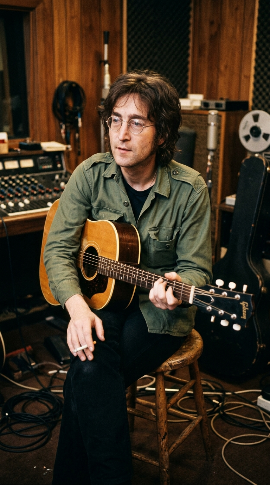
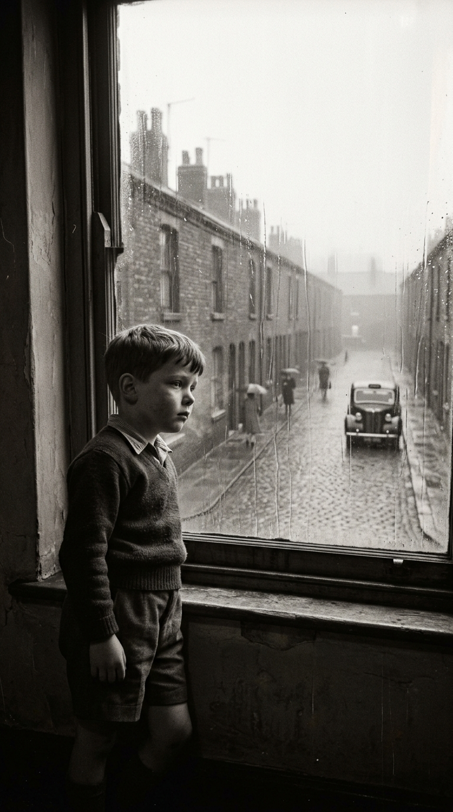
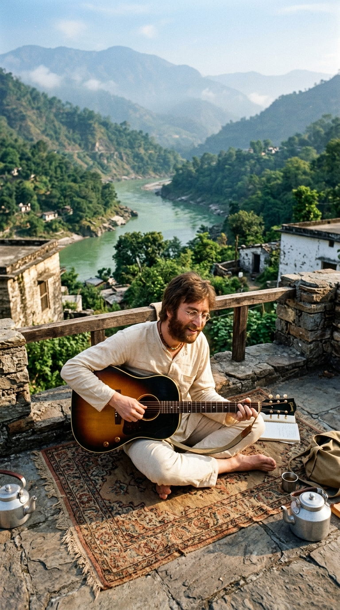
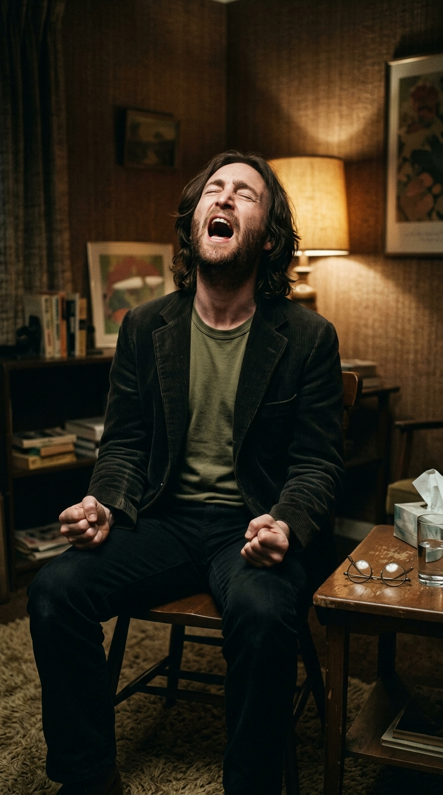
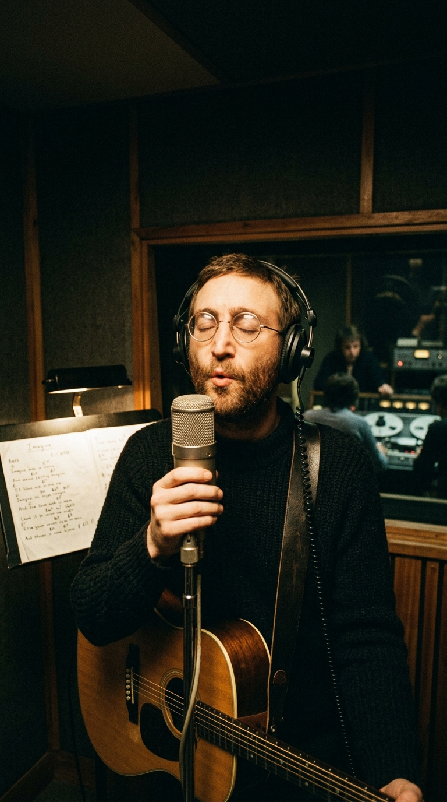

# La Balada que Desnudó la Herida: La Verdad Detrás de «Jealous Guy» de John Lennon

**Por la redacción de Acordes Ocultos**

---

### Prólogo: El ídolo que se arrodilló ante su propia sombra

En mayo de 1971, los muros señoriales de Tittenhurst Park —la mansión de techos altos y jardines infinitos que John Lennon y Yoko Ono habitaban en Berkshire— guardaban un silencio denso, cargado de reproches mudos y vergüenza. El mundo exterior seguía viendo en Lennon al semidiós del pacifismo, al líder carismático que vestía de blanco y exigía a los gobiernos del planeta que dieran una oportunidad a la paz. Pero puertas adentro, cuando las cámaras se apagaban y el eco de los aplausos se extinguía, el hombre que cantaba sobre la fraternidad universal libraba una guerra despiadada contra sus propios demonios.

Lennon estaba aterrado. Un ataque desmedido de celos e inseguridad casi había quebrado, una vez más, la frágil convivencia con la mujer que consideraba su ancla espiritual. Sentado ante el piano blanco en la penumbra de su estudio, el músico no buscó excusas teóricas ni coartadas filosóficas. Apoyó los dedos sobre el teclado y dejó que brotara una confesión tan descarnada que rozaba la humillación:

> *«I was dreaming of the past / And my heart was beating fast / I began to lose control... I didn't mean to hurt you / I'm sorry that I made you cry / Oh no, I didn't want to hurt you / I'm just a jealous guy.»*

Aquella no era una canción de amor complaciente ni un ejercicio de vanidad pop. Era un acta de rendición. El testimonio desgarrador de un ídolo de masas desarmando su propio ego para pedir perdón de rodillas.

---

### Acto I: El niño roto de Liverpool y el miedo al abismo

Para comprender la raíz envenenada de «Jealous Guy», es imprescindible descender al origen de la fractura emocional de John Lennon. Detrás de la pose mordaz, el humor cáustico y la agresividad juvenil con la que conquistó Hamburgo y las cavernas del Merseybeat, latía una herida de desamparo infantil que jamás cicatrizó.

Abandonado por su padre Alfred cuando apenas era un niño de cuatro años, y apartado del hogar de su madre Julia para ser criado bajo la severidad disciplinaria de su tía Mimi, Lennon creció con la convicción visceral de que todo aquello que amaba estaba destinado a esfumarse. La tragedia selló su destino en julio de 1958: cuando John tenía 17 años y empezaba a reconstruir un vínculo cómplice con su madre, Julia murió atropellada por un policía fuera de servicio a pocos metros de la casa de Mimi.

Aquel golpe brutal moldeó una masculinidad defensiva y a menudo violenta. El propio Lennon lo reconoció con crudeza años más tarde en su célebre entrevista con David Sheff para la revista *Playboy* en 1980:

> *«Solía ser cruel con mi mujer, físicamente cruel. Con cualquier mujer. Era un golpeador. No sabía cómo expresarme y recurría a los golpes. Peleaba con hombres y golpeaba a mujeres. Por eso siempre estoy hablando de la paz, ¿sabes? Son las personas más violentas las que persiguen el amor y la paz.»*

Cuando Yoko Ono irrumpió en su vida a finales de los sesenta, Lennon proyectó sobre ella toda la devoción acumulada y, con la misma intensidad, todo su terror al vacío. El amor se convirtió en una trinchera asfixiante: la obligaba a acompañarlo a todas partes, prohibiéndole ausentarse incluso para ir al baño durante las tensas sesiones de grabación en Twickenham y Abbey Road. Si Yoko hablaba con otra persona o miraba hacia otro lado, el pánico al abandono detonaba en Lennon una furia posesiva incontrolable.

---

### Acto II: De Rishikesh a Abbey Road: El nacimiento de «Child of Nature»

Curiosamente, la melodía celestial de «Jealous Guy» no nació en medio de una tormenta doméstica, sino en el enclave más espiritual del planeta: las colinas de Rishikesh, en la India, durante la primavera de 1968.

Allí, a orillas del sagrado río Ganges, The Beatles se encontraban recluidos en el ashram de Maharishi Mahesh Yogi, meditando durante horas y componiendo compulsivamente con guitarras acústicas. Una tarde, el Maharishi impartió una conferencia sobre la armonía del ser humano con las leyes del cosmos y la belleza de la madre naturaleza. Aquella charla tocó una fibra profunda en dos de los compositores: Paul McCartney y John Lennon.

McCartney canalizó la inspiración en una pastoral campestre que bautizó como *«Mother Nature’s Son»*. Por su parte, Lennon escribió una plegaria mística que tituló *«Child of Nature»*:

> *«On the road to Rishikesh / I was dreaming more or less / And the way I walk along / Was in the face of nature’s song...»*

En mayo de 1968, en el bungalow de George Harrison en Kinfauns (Esher), The Beatles grabaron una maqueta acústica deslumbrante de la canción. La melodía ya poseía la cadencia nostálgica, el balanceo hipnótico y los acordes mayores y menores que tres años después conmoverían al mundo. Sin embargo, cuando el cuarteto entró en Abbey Road para registrar el legendario *Álbum Blanco*, McCartney propuso y grabó en solitario *«Mother Nature’s Son»*.

Al percibir que ambos temas partían de la misma premisa lírica y competían en el mismo terreno melódico, el orgullo competitivo de Lennon le impidió insistir. Sintiéndose eclipsado, guardó la cinta en un cajón y archivó la partitura durante años, reacio a ser visto como el segundón de su eterno socio.

---

### Acto III: El Grito Primal y el despojo del héroe

Entre 1969 y 1970, el universo de The Beatles se desintegró en una amarga guerra legal y pública. Lennon, despojado del escudo protector de la banda y abrumado por el juicio mediático que culpaba a Yoko Ono de la ruptura, tocó fondo emocional. Fue entonces cuando la pareja recurrió a la terapia del *Grito Primal* con el psicólogo estadounidense Arthur Janov, primero en Londres y luego en Los Ángeles.

El tratamiento de Janov consistía en despojar al paciente de todas sus defensas intelectuales y forzarlo a revivir, entre lágrimas, alaridos y convulsiones en el suelo, el dolor primario del abandono en la infancia. Para Lennon, la experiencia fue un terremoto demoledor: por primera vez en su vida, el Beatle rebelde tuvo que mirar de frente al niño huérfano que suplicaba afecto y al joven violento que había hecho daño a las personas que lo amaban.

Aquel colapso psicológico fructificó en la brutal honestidad de su primer disco solista oficial, *John Lennon/Plastic Ono Band* (1970), con aullidos como *«Mother»* y *«God»*. Pero aún quedaba una deuda íntima pendiente. Faltaba la canción que mirara a los ojos a Yoko Ono y asumiera la culpa de los celos, la vigilancia obsesiva y las lágrimas derramadas en la alcoba.

---

### Acto IV: La sesión de Ascot y el silbido de la redención

En mayo de 1971, durante las sesiones del álbum *Imagine* en los estudios propios construidos en Ascot (Berkshire), Lennon recordó la hermosa melodía que dormía en las cintas de Kinfauns desde 1968. Tomó la estructura armónica de *«Child of Nature»*, arrancó los versos espirituales sobre la India y vertió sobre ella la poesía más cruda y avergonzada de su carrera. Nacía oficialmente «Jealous Guy».

La grabación congregó a un elenco irrepetible: Nicky Hopkins al piano aportando arpegios de una elegancia sublime, Klaus Voormann en el bajo, Alan White en la batería, y Joey Molland y Tom Evans (de Badfinger) reforzando las guitarras acústicas con sutiles rasgueos. Sobre ese colchón sonoro, la voz de Lennon —cálida, cercana, casi susurrada al oído— transmitía una fragilidad que erizaba la piel.

Cuando llegó el momento del puente instrumental, Lennon prescindió de guitarras solistas o arreglos grandilocuentes. Se acercó al micrófono Neumann, cerró los ojos y silbó la melodía con una espontaneidad sobrecogedora. Aquel silbido no era un alarde técnico: era la respiración desarmada de un hombre que se vaciaba por dentro, incapaz de añadir más palabras al peso de su arrepentimiento.

---

### Epílogo: El himno del perdón que sobrevivió al disparo

El 8 de diciembre de 1980, cuatro disparos frente al edificio Dakota de Manhattan silenciaron para siempre la voz de John Lennon. El mundo quedó sumido en un estupor absoluto. Dos meses después, en febrero de 1981, la banda británica Roxy Music se encontraba de gira por Alemania. Consternado por el magnicidio, su elegante vocalista Bryan Ferry decidió incorporar «Jealous Guy» al repertorio en vivo como un tributo sincero al maestro desaparecido.

La respuesta del público fue tan desgarradora que Roxy Music entró de inmediato al estudio para grabarla. Lanzada como sencillo en marzo de 1981, la versión de Ferry escaló de inmediato al número 1 de las listas británicas e internacionales, manteniéndose en la cima durante semanas. Fue el único número 1 de Roxy Music en el Reino Unido, pero, por encima de los récords comerciales, significó la consagración definitiva de «Jealous Guy» como un patrimonio universal de la humanidad.

Hoy, más de medio siglo después de su composición, «Jealous Guy» se alza como una lección imperecedera. En un mundo donde la arrogancia y la justificación constante suelen gobernar las relaciones humanas, la obra maestra de Lennon nos recuerda que el verdadero coraje no reside en disimular las grietas, sino en tener la valentía de mirarlas a la luz del día y pedir perdón antes de que sea demasiado tarde.

---

### 📚 Fuentes y Archivo Documental

* **Lennon, John & Sheff, David (1981)**. *The Playboy Interviews with John Lennon and Yoko Ono*. Playboy Press / Ballantine Books.
* **Janov, Arthur (1970)**. *The Primal Scream: Primal Therapy, the Cure for Neurosis*. G.P. Putnam’s Sons.
* **Norman, Philip (2008)**. *John Lennon: The Life*. Ecco / HarperCollins.
* **Lewisohn, Mark (1988)**. *The Complete Beatles Recording Sessions*. Hamlyn / EMI Books.
* **Badman, Keith (2001)**. *The Beatles Diary Volume 2: After the Break-Up 1970–2001*. Omnibus Press.
* **Womack, Kenneth (2014)**. *The Beatles Encyclopedia: Everything Fab Four*. Greenwood Press.
* **Archivos Hemerográficos BBC / Rolling Stone Magazine (1971–1981)**: Crónicas de lanzamiento de *Imagine* y recepción del homenaje discográfico de Roxy Music.
