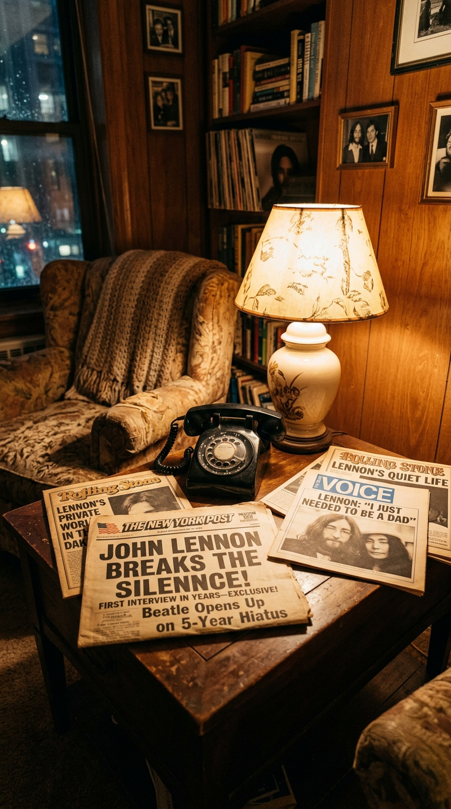
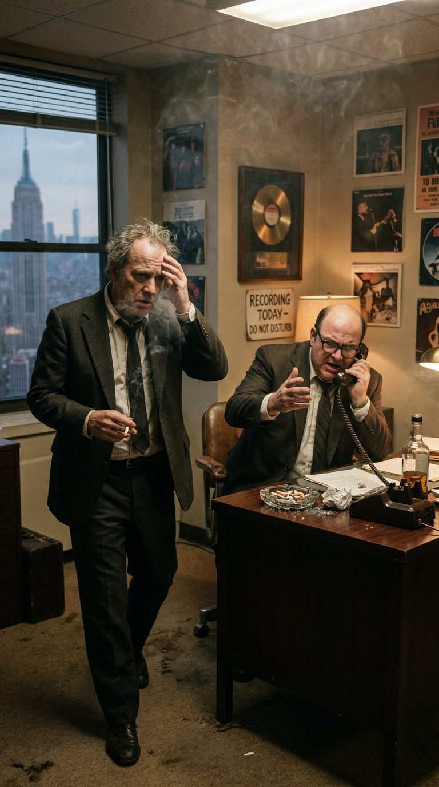
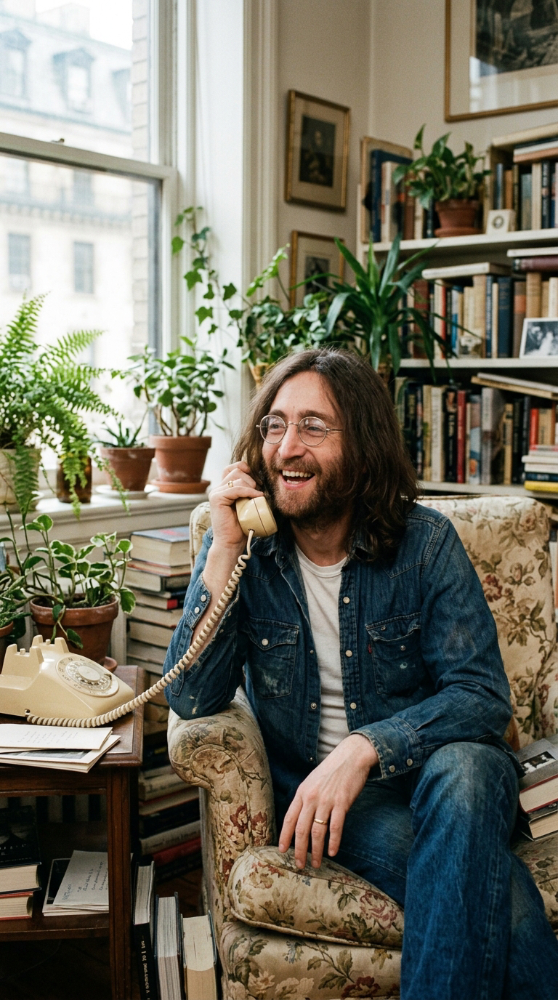
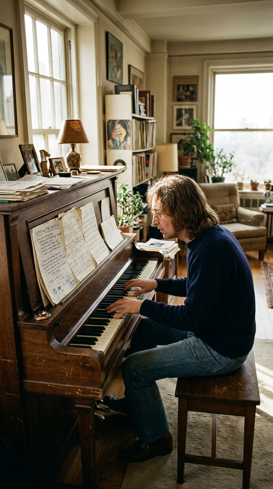
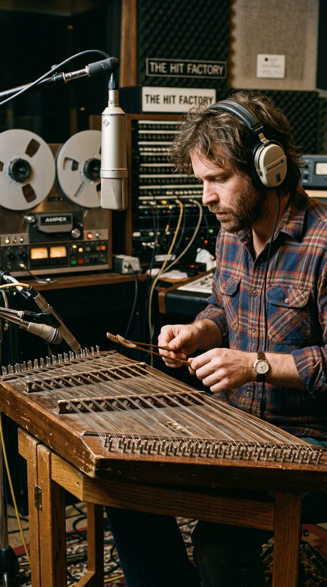
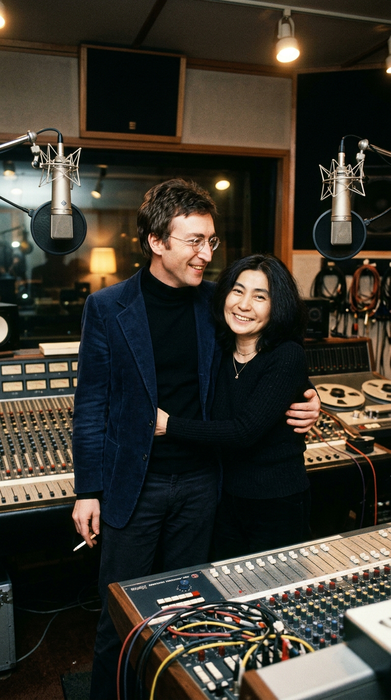
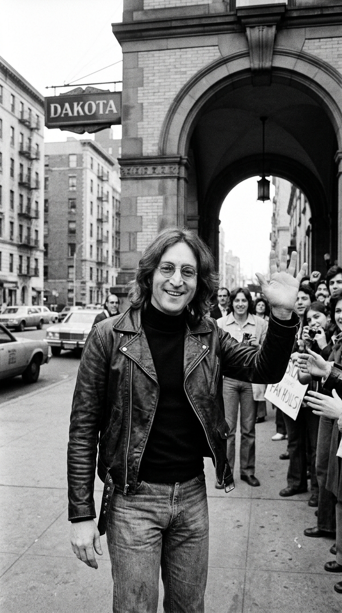

# El Músico que Cambió la Fama por Hornear Pan: La Renuncia y Plenitud de John Lennon

> *"La gente me dice: '¿Qué has estado haciendo? ¿Por qué no estás haciendo nada?'. Y yo les respondo: 'Estoy haciendo pan. Estoy criando a mi hijo. Estoy viendo girar las ruedas'. Y me miran como si estuviera loco. Para mí, estar vivo ya es una ocupación de tiempo completo."*  
> — **John Lennon**, entrevista con David Sheff para *Playboy*, septiembre de 1980.

---

## Prólogo: La Rendición de un Ídolo

Hay momentos en la historia en los que el silencio de un hombre retumba con más fuerza que el estruendo de un estadio abarrotado. En el otoño de 1975, la industria de la música mundial asistió, atónita y sin manual de instrucciones, a la desaparición voluntaria del artista más influyente de su tiempo. John Winston Ono Lennon —el líder rebelde que había sacudido los cimientos de la cultura occidental con The Beatles, el activista que desafió al FBI de J. Edgar Hoover y a la administración de Richard Nixon desde una cama de hotel, el autor de *"Imagine"*— decidió, a sus treinta y cinco años recién cumplidos, colgar su guitarra en la pared, apagar los amplificadores y cerrar la pesada puerta de roble del apartamento 72 en el edificio Dakota de Manhattan.

*Nueva York, 1976. John Lennon en las alturas del edificio Dakota: el mundo giraba afuera con prisa suicida, mientras adentro comenzaba una revolución íntima.*

Para la maquinaria del espectáculo, aquella renuncia equivalía a una herejía imperdonable. El capitalismo del entretenimiento no concibe el desapego: un mito no tiene derecho a envejecer en pijama, a amasar harina ni a contemplar el cambio de estación desde un ventanal de la calle 72. Durante cinco largos años, entre 1975 y 1980, el mundo exterior proyectó sobre su aislamiento sus propias ansiedades. Los tabloides británicos y neoyorquinos publicaron artículos delirantes asegurando que Lennon había perdido el juicio, que vivía enclaustrado en habitaciones a oscuras consumido por la paranoia, o que era rehén de los designios esotéricos de Yoko Ono. 

La verdad, sin embargo, era infinitamente más bella, subversiva y desconcertante: John Lennon había descubierto el milagro de la vida ordinaria. Y desde esa atalaya de serenidad, compuso *"Watching the Wheels"*, una de las canciones más lúcidas y transparentes jamás escritas sobre la libertad humana, el escape de la carrera de ratas y el arte supremo de no pertenecer a nadie más que a uno mismo.

---

## Acto I: La Histeria Mediática y el Cheque en Blanco

A finales de los años sesenta y principios de los setenta, la existencia de John Lennon había sido un vendaval sin tregua. La dolorosa implosión de The Beatles en 1970 no trajo la calma; trajo una batalla legal encarnizada, una producción solista visceral (*Plastic Ono Band*, *Imagine*), el prolongado "Lost Weekend" de dieciocho meses en Los Ángeles entre alcohol, excesos y desarraigo, y una persecución implacable del gobierno estadounidense para deportarlo debido a su postura pacifista durante la Guerra de Vietnam.

Cuando en octubre de 1975, en el hospital Roosevelt de Nueva York y en el mismo día en que John cumplía 35 años, nació Sean Taro Ono Lennon, el suelo bajo los pies de Lennon tembló con una revelación definitiva. Recordando la ausencia de su padre Alfred en su propia infancia, y la culpa jamás cicatrizada de haber sido un padre distante y ausente para su primogénito Julian durante los años frenéticos de la Beatlemanía, John tomó una decisión irrevocable: no permitiría que la máquina del estrellato le robara la infancia de Sean.

*Los titulares de la prensa británica y estadounidense se devanaban los sesos buscando conspiraciones, incapaces de comprender que un genio pudiera elegir el silencio.*

El teléfono del apartamento del Dakota sonaba a diario con insistencia febril. Promotores de conciertos, ejecutivos de discográficas multinacionales y emisarios de la prensa insistían en que el mundo exigía el regreso de The Beatles o, al menos, un nuevo álbum solista. El promotor Bill Sargent llegó a ofrecer un cheque de cincuenta millones de dólares —una suma astronómica para la época— por una sola presentación de reunión del cuarteto de Liverpool. 

En los rascacielos de cristal de Manhattan, los directivos de los sellos discográficos fumaban desesperados, incapaces de asimilar que ningún contrato, por millonario que fuera, pudiera competir con el olor a pan caliente por las mañanas.

*Las oficinas ejecutivas de la industria discográfica en Manhattan: ofertas millonarias sobre escritorios caoba chocaban contra la tranquila negativa del Dakota.*

Lennon escuchaba las ofertas a través de intermediarios o por boca de Yoko, que había asumido con puño de hierro la gestión de los negocios familiares, y simplemente sonreía. Para un hombre que había conquistado el planeta antes de los treinta años, la cumbre ya no guardaba ningún misterio: solo había frío y una soledad desoladora. Bajarse de la cima era el único acto que aún requería verdadero coraje.

---

## Acto II: El Ama de Casa del Edificio Dakota

Lejos de los focos, los años comprendidos entre 1975 y 1979 fueron para John Lennon una etapa de reconstrucción espiritual y doméstica. Adoptó con un orgullo casi militante el término *"househusband"* (amo de casa). Quien fuera el ícono contracultural más reverenciado de la juventud global se despertaba a las seis de la mañana, preparaba el biberón de Sean, lo bañaba, lo llevaba a pasear en cochecito por los senderos de Central Park como cualquier vecino común del Upper West Side, y pasaba horas frente a la mesa de la cocina perfeccionando recetas de masa madre.

*Lennon en su cocina: amasar, vigilar el fuego y cuidar a su hijo Sean se convirtieron en las obras maestras cotidianas de su retiro.*

*"Estaba tan emocionado con el pan que no hablaba de otra cosa durante semanas"*, recordaría Lennon entre risas a David Sheff en 1980. *"Hacer pan no es como la música. En la música puedes fingir, puedes poner efectos y hacer que algo mediocre suene bien. Pero con el pan no puedes engañar a nadie: o fermenta y sabe glorioso, o te queda un ladrillo incomible. Cuando saqué mi primer pan dorado y perfecto del horno, sentí una satisfacción más pura y honesta que cuando recibí un disco de oro por 'Imagine'"*.

Los pocos viejos amigos que lograron visitarlo en el Dakota durante aquellos años se encontraban con un hombre irreconocible: sereno, despejado de adicciones, con el cabello largo recogido en una coleta informal, gafas redondas de montura de alambre y una calidez hogareña despojada de cualquier pose cínica. Mientras la música disco y la explosión del punk sacudían el planeta musical, John observaba la marea con la tranquilidad de un monje zen que ya ha cruzado todas las tormentas.

*El desapego como forma suprema de sabiduría: John reía ante la urgencia de una industria que corría en círculos.*

---

## Acto III: El Nacimiento de *"Watching the Wheels"*

Hacia 1977 y 1978, la necesidad de expresar aquella metamorfosis personal comenzó a brotar de nuevo entre las teclas de su piano vertical blanco. John no quería escribir un manifiesto político ni una diatriba amarga contra sus críticos; quería redactar una carta abierta, dulce, compasiva pero inquebrantable, para todos aquellos que no lograban concebir que alguien pudiera renunciar a la gloria material sin haber perdido el juicio.

Sentado al piano en el amplio salón bañado por la luz que entraba desde Central Park, Lennon comenzó a dar forma a una progresión circular de acordes. La melodía tenía el balanceo pausado, hipnótico y melancólico de un carrusel de feria antigua que gira sobre su propio eje.

*Frente al piano en el Dakota: las notas de 'Watching the Wheels' surgieron como un himno a la pausa y a la contemplación.*

La letra nació con la sencillez demoledora que siempre caracterizó a sus mejores textos:

> *"People say I'm crazy doing what I'm doing,*  
> *Well they give me all kinds of warnings to save me from ruin.*  
> *When I say that I'm okay, well they look at me kind of strange:*  
> *'Surely you're not happy to be out of the race?'"*  
>  
> *(La gente dice que estoy loco por hacer lo que hago,*  
> *me dan toda clase de advertencias para salvarme de la ruina.*  
> *Cuando les digo que estoy bien, me miran con extrañeza:*  
> *'¿Seguro que no eres feliz estando fuera de la carrera?')*

Y luego, el estribillo, una de las declaraciones de principios más sublimes del cancionero popular del siglo XX:

> *"I'm just sitting here watching the wheels go round and round,*  
> *I really love to watch them roll.*  
> *No longer riding on the merry-go-round,*  
> *I just had to let it go."*  
>  
> *(Solo estoy sentado aquí viendo las ruedas girar y girar,*  
> *realmente me encanta verlas rodar.*  
> *Ya no viajo en el carrusel,*  
> *simplemente tuve que dejarlo ir).*

El "carrusel" (*merry-go-round*) era la metáfora perfecta: un tiovivo brillante, lleno de luces y música ruidosa, donde la gente se sube creyendo que avanza hacia alguna parte, cuando en realidad solo gira en círculos interminables, mareándose sin llegar jamás a ningún destino. John había descendido de la atracción. Había puesto los pies en tierra firme y se dedicaba a observar a los demás girar, no con desprecio o soberbia, sino con tierna compasión.

---

## Acto IV: La Sesión en The Hit Factory y el Sonido del Tiovivo

En el verano de 1980, tras un viaje en velero a las islas Bermudas donde una tormenta atlántica lo devolvió a la vida creativa en medio de las olas, John Lennon sintió que su almacén interior volvía a rebosar. Tenía decenas de canciones completas, frescas y luminosas. Con cuarenta años a punto de cumplirse, decidió entrar al estudio de grabación.

En agosto de 1980, John y Yoko reservaron The Hit Factory en Nueva York bajo la producción del legendario Jack Douglas. Los músicos de sesión convocados —incluyendo a Tony Levin en el bajo, Hugh McCracken y Earl Slick en las guitarras, Andy Newmark en la batería y George Small en los teclados— no daban crédito a la vitalidad de aquel Lennon renovado. No había rastro del artista atormentado de los primeros años setenta; en el estudio había un hombre puntual, generoso, risueño y con una dirección artística milimétrica.

*The Hit Factory, Nueva York, agosto de 1980: Jack Douglas y John Lennon puliendo la pista definitiva de 'Watching the Wheels'.*

Para capturar la textura sonora exacta de *"Watching the Wheels"*, Jack Douglas y John buscaron recrear auditivamente la cadencia de una feria tradicional. Douglas convocó a Matthew McCauley para que interpretara un **dulcémele martillado** (*hammered dulcimer*), un instrumento acústico de cuerdas percutidas con pequeños macillos de madera, típico del folclore anglosajón y europeo. 

El tintineo cristalino y resonante del dulcémele, sumado al piano eléctrico Rhodes, a la guitarra acústica y a las notas graves y redondas del bajo de Levin, construyó esa atmósfera inconfundible: una música que parece suspendida en el tiempo, girando suavemente en el aire de una tarde dorada de domingo. La voz de Lennon, grabada sin dobles pistas innecesarias ni artificios, transmitía una calma y una franqueza que erizaba la piel de los ingenieros en la cabina. Había cantado con rabia en *"Mother"*, con angustia en *"Help!"*, con utopía en *"Imagine"*; pero en *"Watching the Wheels"*, John Lennon cantaba con el sosiego del hombre que ha encontrado su hogar.

---

## Acto V: El Retorno Luminoso y la Sombra del Destino

En noviembre de 1980 vio la luz *Double Fantasy*, el álbum conjunto de John y Yoko concebido como un diálogo íntimo sobre el matrimonio, la madurez, la crianza y el amor cotidiano. *"Watching the Wheels"* fue reservada como uno de los pilares del álbum y posteriormente lanzada como tercer sencillo en la primavera de 1981.

En las semanas posteriores al lanzamiento del disco, John concedió extensas entrevistas a la BBC y a la revista *Playboy*. En todas ellas, su mensaje fue invariable: la vida no es lo que los demás esperan de ti, sino lo que tú decides hacer con tu tiempo.

*Otoño de 1980: John Lennon en Central Park, retratado en su plenitud vital poco antes del desenlace fatal que enlutó al mundo.*

*"La gente gasta su vida entera buscando lo que no tiene, creyendo que la próxima compra, el próximo ascenso o el próximo aplauso les dará la paz"*, reflexionaba John. *"Y la paz no está allí. La paz es despertarse por la mañana, mirar a tu hijo respirar y saber que no tienes que demostrarle nada a nadie"*.

La tragedia, atroz e incomprensible, aguardaba a la vuelta de la esquina. El 8 de diciembre de 1980, apenas unas semanas después de reencontrarse con su público, las balas de un asesino perturbado apagaron la vida de John Lennon en la entrada del edificio Dakota. El luto planetario fue unánime; millones de personas lloraron en plazas públicas de Londres, Nueva York, Tokio y Buenos Aires.

Pero en medio del dolor desgarrador, cuando en 1981 *"Watching the Wheels"* escaló los rankings de éxitos de todo el mundo, la canción no sonaba como un réquiem fúnebre. Sonaba como una bendición póstuma. Era la voz de un amigo entrañable que, habiendo cruzado todos los laberintos del ego y la gloria, se asomaba desde la eternidad para recordarnos que el carrusel sigue girando, pero que la verdadera grandeza consiste en aprender a mirar.

*El legado de John Lennon: una sonrisa de libertad incondicional grabada para siempre en la memoria de la humanidad.*

---

## Epílogo: El Valor de Bajarse a Tiempo

Más de cuatro décadas después de su grabación, *"Watching the Wheels"* resuena hoy con una vigencia aún más urgente y reveladora. En una sociedad hiperconectada, donde el valor de un ser humano parece medirse en métricas de productividad, seguidores digitales, visibilidad incesante y el miedo patológico a perderse algo (*FOMO*), la decisión de John Lennon adquiere la categoría de una lección revolucionaria de salud mental y dignidad existencial.

Lennon demostró que el mayor acto de rebeldía en un mundo obsesionado con la velocidad es tener el coraje de detenerse; que la verdadera libertad no es hacer lo que todos aplauden, sino atreverse a hacer lo que a uno le llena el alma; y que, al final del camino, hornear un trozo de pan con amor para quienes amas vale más que todas las coronas del universo.

Las ruedas del mundo continúan su giro incesante, con su ruido y su vértigo. Pero en algún rincón sereno de nuestra conciencia, la voz dulce de John nos susurra que está bien dar un paso al costado, sentarse en la hierba y simplemente mirar.

---

### 📚 Fuentes y Archivo Documental

1. **Sheff, David** (1981). *The Playboy Interviews with John Lennon and Yoko Ono*. Playboy Press / Ballantine Books.
2. **Lennon, John & Wenner, Jann S.** (1971 / reed. 2000). *Lennon Remembers: The Full Rolling Stone Interviews from 1970*. Verso Books.
3. **Norman, Philip** (2008). *John Lennon: The Life*. HarperCollins Publishers, Nueva York.
4. **Lewisohn, Mark** (1988). *The Beatles Recording Sessions*. Harmony Books, Nueva York.
5. **Sharp, Ken** (2010). *Starting Over: The Making of John Lennon and Yoko Ono's Double Fantasy*. Testimonios de Jack Douglas y músicos de sesión. MTV Books / Simon & Schuster, Nueva York.
6. **Shotton, Pete & Schaffner, Nicholas** (1983). *John Lennon: In My Life*. Stein and Day, Nueva York.
7. **Baird, Julia** (2007). *Imagine This: Growing Up with My Brother John Lennon*. Hodder & Stoughton, Londres.
