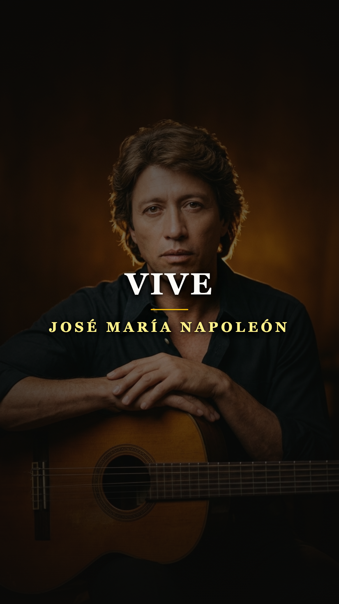
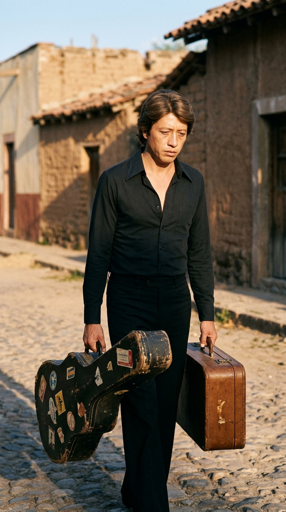
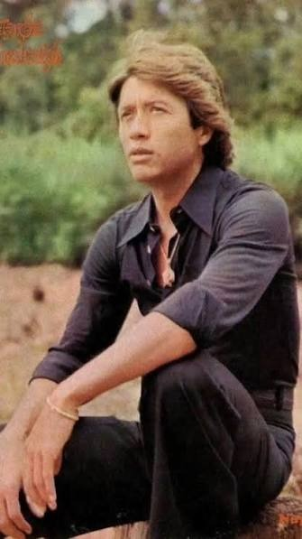
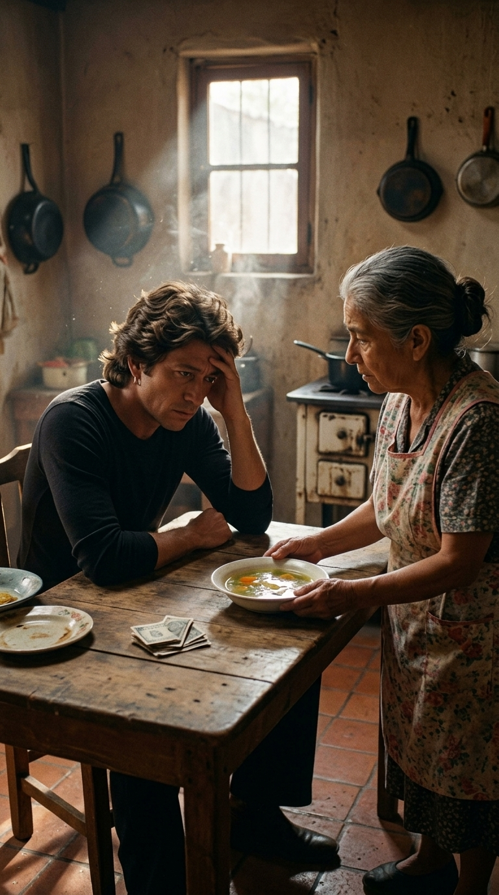
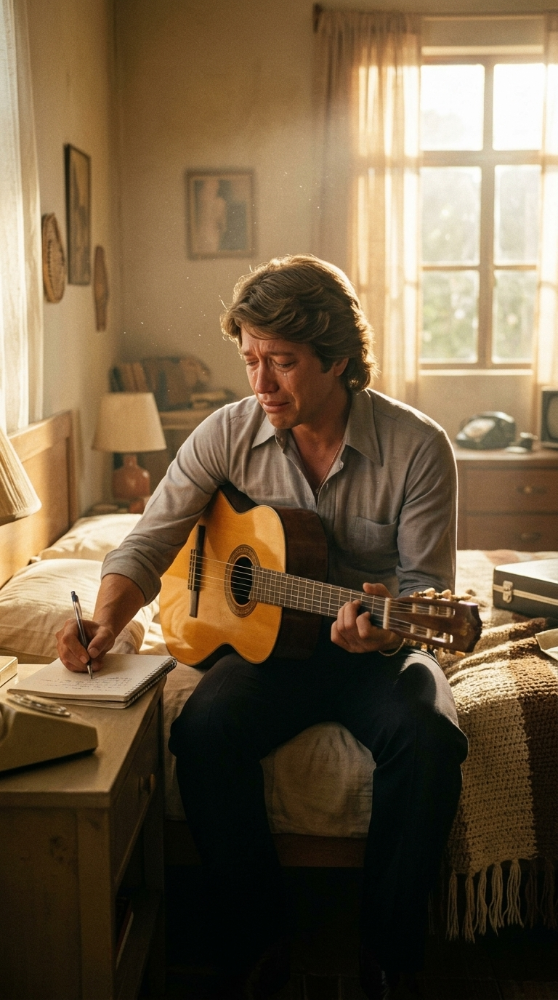
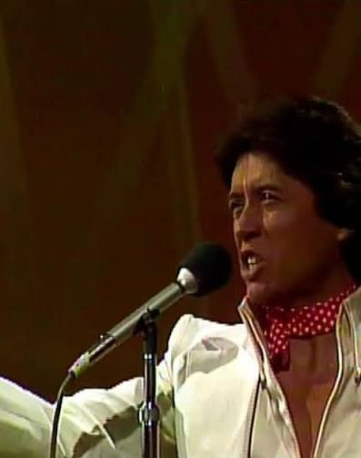
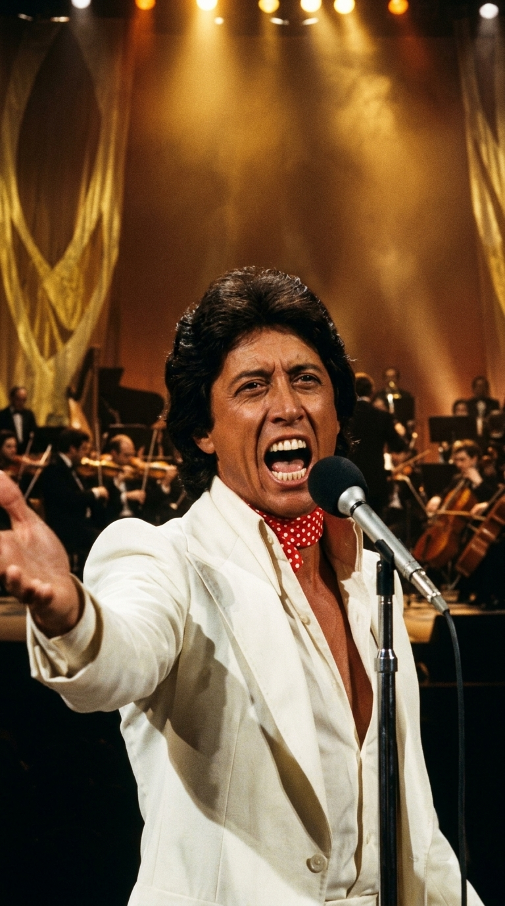
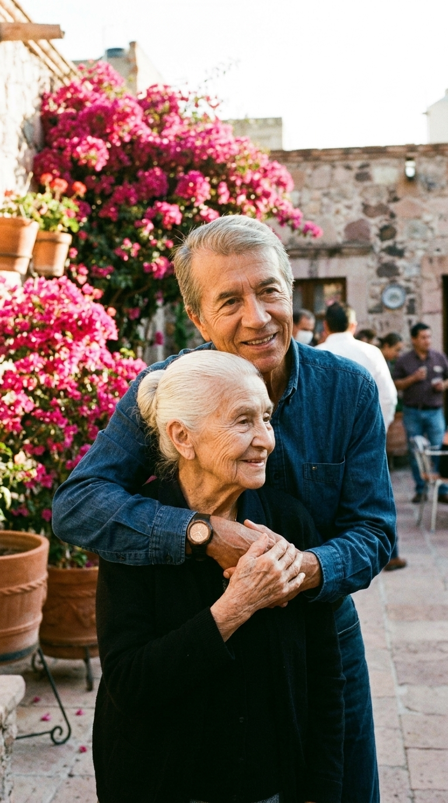

# 🕊️ El Lavadero de Ropa Ajena y las Lágrimas que Crearon un Himno: La Historia Secreta de «Vive»
### *Cómo la amargura de un joven cantautor al borde del fracaso, la sabiduría luminosa de una madre lavandera en Aguascalientes y un polémico despojo en el Festival OTI de 1976 forjaron la balada más trascendente sobre el valor de la existencia en español.*

---

**Por la redacción de Acordes Ocultos**  
*Tiempo de lectura estimado: 6 minutos y medio*

---

### Prólogo: El motín en el patio de butacas

La noche del 14 de noviembre de 1976, el imponente **Teatro de la Ciudad de México** se convirtió en un polvorín a punto de estallar. Las cámaras de la televisión transmitían en directo la final nacional del **Festival OTI**, el certamen de la canción más prestigioso y vigilado de Iberoamérica. En el escenario, la flor y nata de los compositores y arreglistas del país aguardaba con nerviosismo aristocrático el veredicto del jurado calificador.

Minutos antes, un muchacho provinciano de veintisiete años, enjuto, de mirada penetrante y vestido con un impecable traje blanco y un pañuelo rojo de lunares atado al cuello, había detenido el tiempo. Sin pirotecnia vocal ni aspavientos teatrales, **José María Napoleón** se plantó frente al micrófono de pedestal, abrió los brazos de par en par y cantó con las entrañas en la mano:

> *«Nada te llevarás cuando te marches...  
> las cosas no son más de quien las tiene, sino de aquel que las sabe disfrutar.  
> Abre tus brazos fuertes a la vida, no dejes nada a la deriva,  
> del cielo nada te va a caer...»*

La ovación que sacudió la sala al apagarse el último acorde orquestal no fue el aplauso de cortesía de una gala televisada; fue un terremoto de catarsis colectiva. Cientos de personas en el patio de butacas se pusieron en pie con lágrimas en los ojos. Sin embargo, cuando los jueces leyeron los resultados oficiales, ocurrió lo impensable: el jurado relegó la canción a un **humillante cuarto lugar**.

Lo que siguió fue un conato de insurrección popular. El público abucheó a los jueces durante minutos interminables, los gritos de reproche apagaron la música de fondo y la transmisión televisiva tuvo que cortar apresuradamente. En aquel instante, nadie imaginaba que la decisión del jurado acababa de firmar su propia irrelevancia: mientras el tema ganador caía en el olvido al cabo de unos meses, aquella balada nacida en el rincón más modesto de Aguascalientes estaba destinada a convertirse en el himno a la dignidad humana más universal jamás escrito en nuestra lengua.

Pero para entender de dónde brotó esa filosofía implacable y luminosa, es indispensable retroceder unos meses en el tiempo, a una cocina humilde con suelo de ladrillo y el sonido monótono de ropa siendo restregada con agua helada.

---

### Acto I: El trovador de las suelas rotas

A comienzos de 1976, José María Napoleón no era una estrella; era un náufrago. Nacido en el popular barrio de San Marcos, en **Aguascalientes**, llevaba varios años librando una batalla desigual en la jungla de asfalto de la Ciudad de México. Sobrevivía en pensiones baratas de la colonia Roma, alimentándose de café con leche y pan duro, tocando su guitarra en pequeños cafés cantantes y llamando a las puertas blindadas de las casas discográficas, donde los ejecutivos solían rechazar sus baladas poéticas por considerarlas «demasiado líricas y poco comerciales».

*Aguascalientes, principios de 1976: Napoleón regresa derrotado y exhausto a su tierra natal tras meses de rechazos discográficos.*

Consumido por el agotamiento físico y la frustración moral, con los bolsillos vacíos y las suelas de los zapatos gastadas, Napoleón tomó un autobús de regreso a Aguascalientes. Llevaba una pequeña maleta de cartón y su guitarra al hombro, pero sobre todo cargaba un veneno corrosivo en el pecho: la amargura del fracasado. Se sentía avergonzado de volver a su tierra con las manos vacías, resentido con el destino por negarle la fama y la riqueza que creía merecer para rescatar a su familia de la precariedad.

Caminó por las calles empedradas de su infancia con la cabeza gacha, rumiando su rabia. Al empujar la vieja puerta de madera de la casa materna, un silencio espeso lo recibió. Y fue allí, en el patio trasero, donde la vida le propinó la lección más demoledora de su existencia.

---

### Acto II: El agua helada del lavadero y el plato de sopa

Inclinada sobre un lavadero de cemento rústico, vio a su madre: **Doña María del Refugio Ruiz**, a quien todos llamaban cariñosamente *«Doña Cuca»*. Era una mujer menuda, de pelo cano recogido en un moño austero, viuda y curtida por décadas de privaciones. Para sacar adelante a sus hijos y garantizar que nunca faltara un bocado en la mesa, Doña Cuca lavaba y planchaba ropa ajena de familias adineradas de la ciudad.

*La mirada profunda y serena de un joven trovador que estaba a punto de transformar su propia soberbia en poesía inmortal.*

Aquella mañana de invierno el frío calaba hasta los huesos. El agua de la tina estaba casi congelada. Napoleón observó con horror las manos de su madre: estaban hinchadas, enrojecidas y surcadas de grietas sangrantes causadas por el jabón de lejía y el roce incesante contra la piedra. 

Al notar la presencia de su hijo, la mujer se secó las manos apresuradamente en su delantal de flores, sonrió con una ternura infinita y corrió a abrazarlo: *«¡Hijo mío, qué alegría verte! Siéntate, que te voy a servir de comer»*.

Minutos después, en la penumbra de la cocina, Doña Cuca colocó sobre la mesa de madera un plato hondo con un caldo ralo de verduras que había hecho rendir añadiéndole agua para que alcanzara para los dos. 

*La cocina de adobe en Aguascalientes: el plato humilde que detonó el reclamo amargo del hijo y la respuesta sabia de la madre.*

Antes de probar bocado, Doña Cuca inclinó la cabeza y rezó una oración en voz baja, dando gracias a Dios con fervor por los alimentos. Aquella escena, en lugar de conmover al joven cantautor, desató la furia reprimida que traía dentro. Ciego de frustración, Napoleón golpeó suavemente la mesa y comenzó a quejarse a gritos:

—*«¡Mamá, por Dios! ¿Cómo puedes dar gracias por esto? ¡Mírate las manos, estás lavando los calzones de gente extraña por unos cuantos centavos! ¡Mírame a mí, no tengo un peso en la bolsa, la capital me cerró las puertas y aquí estamos comiendo agua con sal! ¿Qué tenemos que agradecerle a la vida?»*

Doña Cuca se quedó en silencio. No hubo reproche en su rostro, ni un ápice de ira. Se sentó frente a él, le tomó las manos con sus dedos ásperos y lo miró a los ojos con la serenidad de quien habita una dimensión moral superior. Con voz pausada y firme, pronunció unas palabras que quedaron grabadas a fuego en el alma del artista:

> *«Hijo, escúchame bien: jamás te quejes. Tienes dos brazos fuertes para trabajar, tienes salud, tienes juventud, tienes un don que Dios te dio y tienes a tu familia. Hoy tenemos un techo y tenemos este plato caliente en la mesa. El dinero y los lujos van y vienen, y cuando te vayas de este mundo, ni una sola moneda te vas a llevar al cajón. La vida no se mide por lo que tienes guardado, sino por lo que sabes agradecer. Deja de quejarte, abre tus brazos y vive»*.

---

### Acto III: Quince minutos febriles en la penumbra

Aquellas palabras cayeron sobre Napoleón como una losa de plomo. La bofetada moral fue tan fulminante que se quedó sin habla. En un solo segundo de epifanía lúcida, se vio a sí mismo como lo que realmente era en ese instante: un muchacho soberbio, ingrato y vanidoso, llorando por comodidades materiales ante una mujer anciana que destruía su propia carne en el agua helada sin emitir una sola queja.

La vergüenza lo atravesó de parte a parte. Un nudo insoportable se le formó en la garganta y sintió que se ahogaba. Se levantó de la mesa sin decir palabra, corrió a la pequeña habitación del fondo y cerró la puerta.

*La catarsis en la habitación: ahogado en llanto y avergonzado por su soberbia, Napoleón escribe la letra de «Vive» en quince minutos.*

Se sentó al borde de la cama, con lágrimas ardientes rodándole por las mejillas. Tomó su guitarra acústica con manos temblorosas, sacó una libreta de apuntes y comenzó a rasguear una cadencia en tonalidad mayor, cálida y pastoral. No tuvo que buscar la rima ni tachar una sola palabra; las estrofas no salían de su intelecto, brotaban directamente del remordimiento y la devoción filial.

En menos de quince minutos, de un solo tirón de inspiración febril, quedó escrita la partitura completa de **«Vive»**. En cada verso plasmó textualmente la filosofía de su madre: la advertencia de que del cielo nada cae por azar, la inutilidad del rencor y la certeza innegociable de que la verdadera opulencia no se deposita en los bancos, sino en la capacidad de disfrutar del aire, la luz y la existencia.

Cuando salió de la habitación, Napoleón ya no era el mismo joven amargado que había bajado del autobús. Había encontrado la voz de su madurez artística.

---

### Acto IV: La rebelión de 1976 y la inmortalidad

Meses más tarde, en el otoño de 1976, Napoleón inscribió la canción en la fase clasificatoria del Festival OTI. Los directores musicales de su compañía discográfica dudaban: consideraban que el arreglo era demasiado sobrio frente a las pomposas baladas orquestales de la época. Pero cuando el tema sonó en la gran final, la honestidad del mensaje desarmó al país entero.

*La fotografía de archivo que capturó el momento cumbre: Napoleón en el OTI 1976 con su traje blanco y pañuelo rojo a lunares.*

Con su traje blanco, su pañuelo de topos rojos y su entrega desgarradora, Napoleón no cantó para los jueces ni para la industria: cantó para la mujer del delantal en Aguascalientes. Cuando el jurado dictó el injusto cuarto lugar, ocurrió el milagro que ninguna campaña de marketing puede comprar: el pueblo mexicano se sintió personalmente ofendido.

Las emisoras de radio de todo el país comenzaron a recibir miles de llamadas diarias pidiendo la canción de Napoleón. En cuestión de semanas, el disco sencillo de 45 RPM rompió todos los récords de venta en México, extendiéndose como un reguero de pólvora hacia Centroamérica, Sudamérica y el mercado hispano de los Estados Unidos. «Vive» se transformó en un rezo cívico, en el canto predilecto de graduaciones, bodas, despedidas y momentos de crisis personal.

*La orquesta sinfónica en pleno apogeo en el OTI: la derrota en los papeles oficiales que se transformó en victoria continental.*

---

### Epílogo: Las llaves de la casa y el retiro definitivo del lavadero

A finales de 1977, la Sociedad de Autores y Compositores de México liquidó las primeras regalías oficiales por las ventas millonarias de «Vive». Cuando José María Napoleón vio la cifra en el cheque bancario, no pensó en automóviles deportivos, ropa de diseñador ni en fiestas en la capital.

Guardó el dinero, tomó el primer autobús nocturno a Aguascalientes y se dirigió a una hermosa casa luminosa que había seleccionado en una de las mejores zonas de la ciudad, con un patio amplio y soleado adornado con macetas de barro y frondosas buganvilias de color fucsia.

*El triunfo definitivo: José María Napoleón abraza a Doña Cuca frente a la casa que le regaló, alejándola para siempre del lavadero ajeno.*

Caminó hasta la modesta vivienda paterna, tomó de la mano a Doña Cuca y la llevó caminando en silencio hasta el nuevo hogar. Al llegar al umbral, colocó las llaves doradas en la palma de su mano agrietada:

—*«Mamá, esta casa es tuya. A partir de hoy, nunca más en la vida volverás a lavar la ropa de nadie»*.

Doña Cuca miró a su hijo a los ojos, con la misma mirada dulce y sabia de aquella mañana de sopa y reproches, y apretó las llaves contra su pecho. La profecía se había cumplido al pie de la letra: no se llevó nada material a la tumba, pero con su dignidad maternal le había entregado al mundo un tesoro que jamás perderá su brillo.

---

### 📚 Fuentes, Hemeroteca y Archivo Documental:

* **Autobiografía y Testimonio Directo:** Napoleón, José María. *Yo solo quería ser torero*. Ediciones B / Penguin Random House México, 2017.
* **Archivo Audiovisual Histórico:** *V Festival OTI de la Canción (Fase Nacional Mexicana)*, Teatro de la Ciudad de México, emisión de Telesistema Mexicano / Televisa, 14 de noviembre de 1976; entrevistas biográficas en *El Minuto que Cambió mi Destino* (Imagen TV, 2017).
* **Hemeroteca de Prensa:** Periódicos *El Heraldo de México* y *Excélsior*, sección espectáculos (cobertura del 15 al 20 de noviembre de 1976 sobre las deliberaciones del jurado del Festival OTI).
* **Registros Fonográficos:** Sencillo de 45 RPM *«Vive»* (Lado A) / *«Canción del molino blanco»* (Lado B), Discos Raff / Cisne (Catálogo RF-042, México, 1976).
* **Archivos Estatales:** Archivo Histórico del Estado de Aguascalientes, fondo cultural de creadores populares del Barrio de San Marcos.
