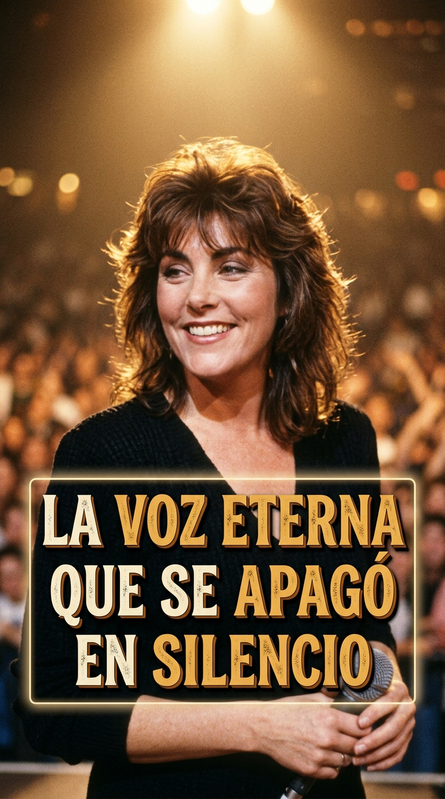
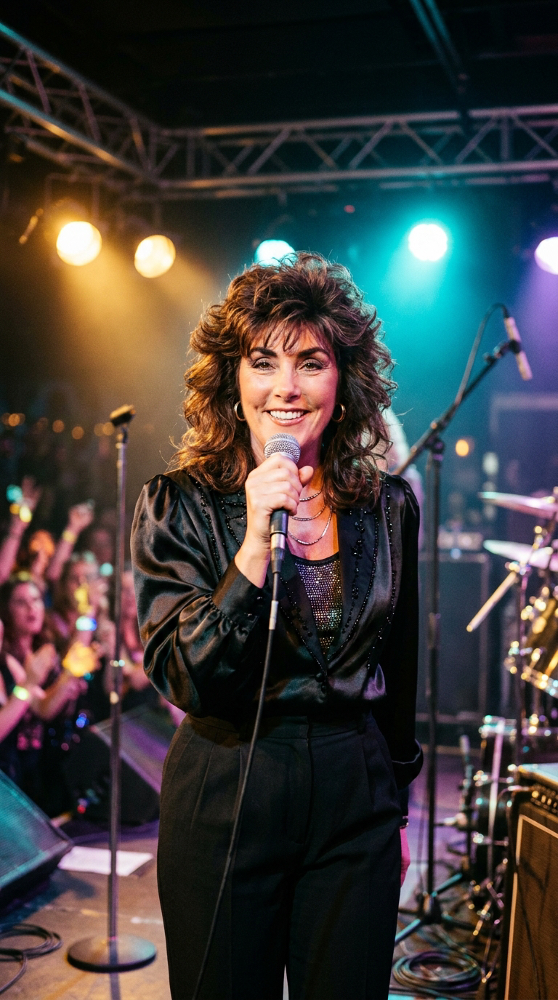
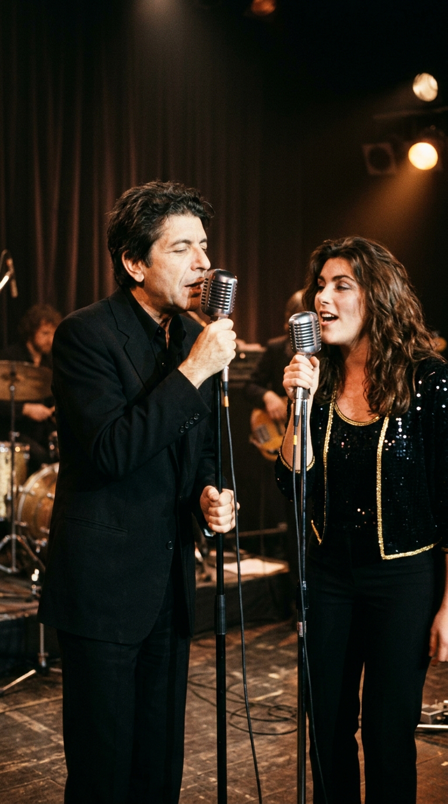
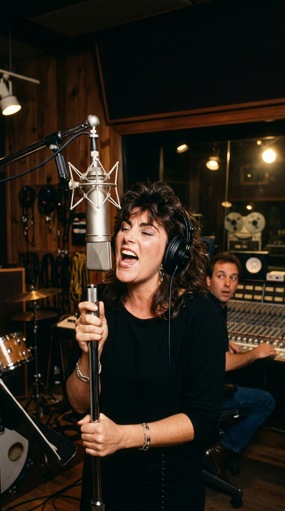
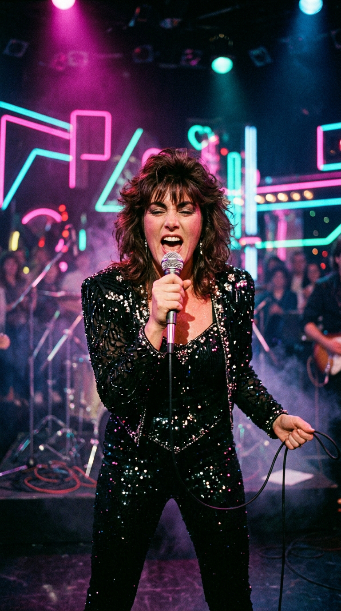
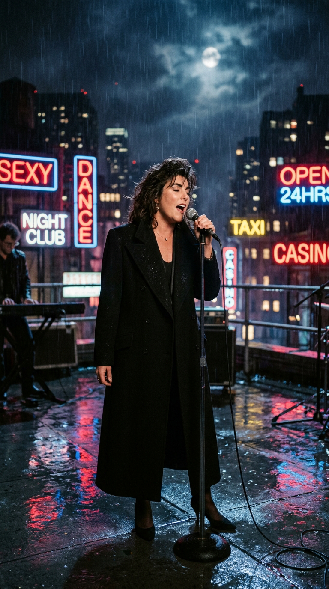
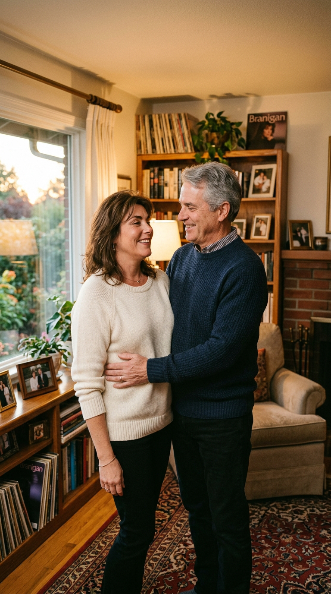
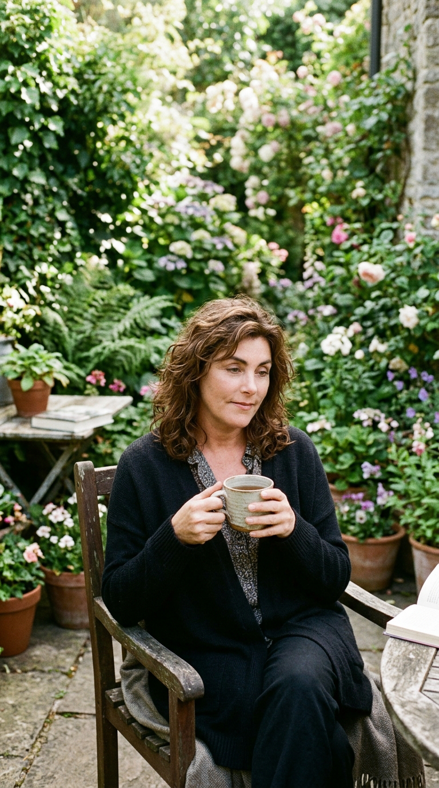
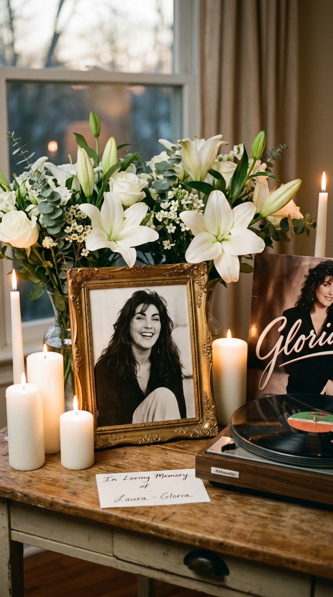
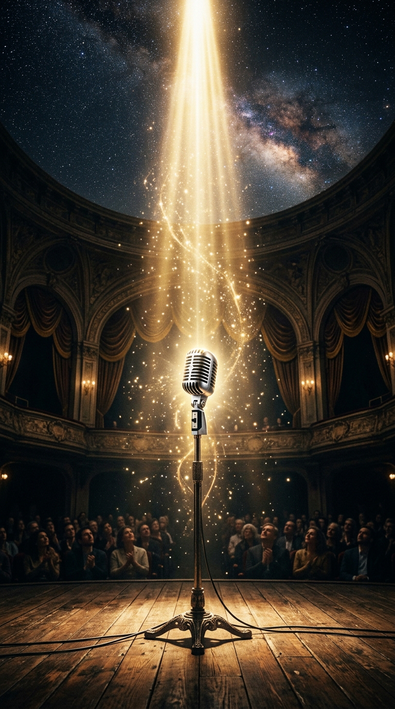

# 🕯️ La Voz Eterna que se Apagó en Silencio: El Sacrificio y la Gloria de Laura Branigan
### *Dueña de un registro volcánico de cuatro octavas y de himnos que definieron la década de los ochenta, renunció a la cima del estrellato para cuidar al amor de su vida: la conmovedora historia de una estrella generosa.*

---

**Por la redacción de Acordes Ocultos**  
*Tiempo de lectura estimado: 10 minutos*

---

### Prólogo: El trueno lírico y el silencio de una santa laica

En la década de los ochenta —una era marcada por la euforia sintética, la sobreproducción electrónica y la competencia voraz de la recién nacida cadena MTV—, **Laura Branigan** representaba una fuerza de la naturaleza prácticamente inalcanzable. Mientras la mayoría de las figuras del pop dependían de coros de apoyo y trucos de ecualización en estudio para sostener sus melodías, Laura poseía un instrumento biológico prodigioso: una garganta lírica con un registro descomunal de **cuatro octavas**, capaz de proyectar notas agudas con la potencia broncínea de una cantante de ópera y descender en el mismo compás a la melancolía rasgada de una balada nocturna.

*Años 80: Laura Branigan en el pináculo de su carrera, dueña de una voz torrencial y un carisma cálido que conquistó al mundo.*

Con himnos generacionales como *«Gloria»*, *«Self Control»*, *«Solitaire»*, *«Ti Amo»* y su majestuosa versión de *«The Power of Love»*, la cantante neoyorquina vendió decenas de millones de discos, abarrotó auditorios en los cinco continentes y obtuvo cuatro nominaciones a los premios Grammy. Su imagen —con su inconfundible melena castaña capeada, sus ojos expresivos y una elegancia sobria que huía de las estridencias vulgares— se convirtió en el paisaje sonoro de toda una época.

Sin embargo, el capítulo más conmovedor y extraordinario de su biografía no se escribió bajo las luces cegadoras de los escenarios ni en las listas de éxitos del Billboard, sino en la penumbra silenciosa de una habitación de convalecencia. En la cúspide de su fama internacional, cuando los contratos millonarios llovían sobre su mesa, Laura Branigan tomó una decisión que dejó perpleja a la industria: renunció a todo para consagrar cada segundo de sus días a cuidar al amor de su vida en su lecho de muerte. Esta es la crónica verídica de un talento monumental que eligió la lealtad humana por encima de la vanidad del aplauso.

---

### Acto I: Las tablas de Manhattan y la bendición de Leonard Cohen

Nacida el 3 de julio de 1952 en Mount Kisco y criada en el apacible entorno rural de Brewster (estado de Nueva York), Laura Ann Branigan supo desde su niñez más temprana que su destino estaba ligado a la vibración del escenario. Mientras sus compañeras de escuela soñaban con vidas suburbanas convencionales, Laura pasaba las tardes frente al tocadiscos familiar imitando las complejas líneas vocales de Maria Callas, Aretha Franklin y Edith Piaf, descubriendo en su propia laringe una elasticidad y un volumen asombrosos.

A los dieciocho años, armada únicamente con una maleta y una determinación inquebrantable, se mudó al corazón de Manhattan para ingresar en la prestigiosa **American Academy of Dramatic Arts** (AADA). Durante casi cuatro años, Laura se sometió a una rigurosa disciplina teatral: estudió declamación clásica, control diafragmático, danza y pantomima, mientras costeaba sus estudios y su diminuto apartamento trabajando como camarera en restaurantes de Broadway.

*1974: Una joven y soñadora Laura Branigan camina frente a la American Academy of Dramatic Arts de Manhattan abrazando sus partituras.*

A finales de los setenta, tras una breve incursión en el cuarteto folk Meadow, la oportunidad de su vida se presentó en la forma de una audición para una de las figuras más veneradas de la poesía y la música universal: el cantautor canadiense **Leonard Cohen**.

Cohen, célebre por su meticulosidad casi litúrgica a la hora de seleccionar a sus coristas, quedó profundamente impresionado por la riqueza armónica y la calidez espiritual de aquella muchacha desconocida. En 1979, la reclutó como corista principal para su extensa gira de conciertos por auditorios de culto en Europa occidental.

*1979: En un teatro europeo en sombras, Laura Branigan aporta sus coros líricos tras el legendario poeta canadiense Leonard Cohen.*

Noche tras noche, en ciudades como París, Viena, Londres y Múnich, Laura aprendió del maestro Cohen la economía del gesto, el peso dramático de cada sílaba poética y la gravedad de pararse frente a un público con el alma al desnudo. Aquella experiencia de élite fue su verdadera universidad musical.

---

### Acto II: El olfato de Ahmet Ertegun y las 36 semanas de «Gloria»

A su regreso a los Estados Unidos a comienzos de 1980, el mánager Sid Bernstein —el legendario promotor que había llevado a The Beatles al Shea Stadium— le organizó una audición privada ante el magnate más influyente de la industria fonográfica norteamericana: **Ahmet Ertegun**, fundador y presidente de **Atlantic Records**.

Ertegun, que había descubierto y guiado las carreras de Ray Charles, Aretha Franklin, Led Zeppelin y The Rolling Stones, escuchó a Laura cantar a capella en la penumbra de su despacho de la Octava Avenida. Con los ojos cerrados, el veterano ejecutivo sintió que aquella garganta contenía la misma madera noble e irrepetible de las divas del soul clásico, combinada con un timbre moderno y penetrante capaz de hendir las frecuencias de la radio contemporánea. En ese mismo instante, Ertegun le ofreció un contrato discográfico exclusivo de largo plazo.

*1982: Laura Branigan en el estudio de Atlantic Records, entregando tomas vocales de descomunal potencia ante el asombro del equipo de producción.*

Para su álbum debut, *Branigan* (1982), el productor Jack White y el arreglista alemán Greg Mathieson le presentaron una pista disco italiana lanzada en 1979 por el cantautor Umberto Tozzi: *«Gloria»*. La versión original era una canción rítmica en italiano, pero Laura y el letrista Trevor Veitch reescribieron por completo los textos en inglés, transformando la composición en un sobrecogedor retrato psicológico sobre una mujer brillante que pierde la cordura al borde del abismo por correr tras espejismos superficiales.

Cuando el sencillo salió a las ondas en el verano de 1982, se produjo una catarsis comercial inmediata. La interpretación de Laura —que arrancaba con un fraseo confidencial y explotaba en el estribillo con un torrente agudo que desafiaba los límites de la afinación perfecta— capturó el corazón de una nación entera.

*1982: Laura desata la euforia bajo las luces de neón en un plató televisivo cantando 'Gloria', el himno que rompió récords históricos en Billboard.*

*«Gloria»* protagonizó una de las trayectorias más longevas y asombrosas en la historia del pop mundial: permaneció durante **treinta y seis semanas consecutivas en el Billboard Hot 100** (un récord de permanencia que ninguna artista femenina había logrado en aquella era), escalando hasta el puesto número dos nacional y conquistando el número uno en Canadá, Australia y América Latina. La canción le valió su primera nominación a los premios Grammy a la *Mejor Interpretación Vocal Pop Femenina*, situando a Laura Branigan de golpe en el panteón de las grandes estrellas del planeta.

---

### Acto III: La audacia de «Self Control» y el templo de la fidelidad

Lejos de convertirse en una estrella de un solo éxito pasajero, Laura Branigan redobló su ambición estética en 1984 con su tercer trabajo discográfico: **Self Control**.

Volviendo a rastrear la vanguardia europea, Laura adaptó una gema del italo-disco compuesta por el artista italiano Raf. Con arreglos de sintetizadores cortantes y una línea de bajo hipnótica, la canción narraba la seducción de la vida nocturna urbana, la pérdida de las riendas morales en la madrugada y la fascinación por las sombras.

Para filmar el videoclip promocional, Laura reclutó a uno de los directores más prestigiosos y transgresores del cine de Hollywood: el oscarizado cineasta **William Friedkin** (*El Exorcista*, *The French Connection*). Friedkin concibió una pieza cinematográfica vanguardista, rodada en azoteas nocturnas neoyorquinas envueltas en bruma y fiestas de máscaras venecianas de alta tensión sensual.

*1984: Laura Branigan en una azotea nocturna durante la filmación del videoclip 'Self Control', dirigido por el legendario cineasta William Friedkin.*

El videoclip fue tan atrevido para los cánones televisivos norteamericanos que la todopoderosa cadena MTV se negó inicialmente a emitirlo a menos que se eliminaran ciertas escenas eróticas veladas. Aquella controversia no hizo más que multiplicar el apetito del público: *«Self Control»* se convirtió en un número uno gigantesco en Alemania, Suiza, Austria, Suecia y Sudáfrica, consagrándose como uno de los cortes definitivos de la década.

Sin embargo, a diferencia de muchos de sus contemporáneos que cayeron en la vorágine de las drogas, las fiestas descontroladas de Studio 54 o los matrimonios efímeros de conveniencia publicitaria, Laura Branigan mantuvo siempre una vida privada blindada contra la vanidad del espectáculo.

En diciembre de 1978, en una fiesta íntima en Manhattan, Laura había conocido al abogado neoyorquino **Larry Kruteck**. A pesar de que Larry era casi veinte años mayor que ella y era un hombre sereno, ajeno por completo al mundillo de la farándula, la conexión espiritual entre ambos fue fulminante. Se casaron en 1981 en una ceremonia civil discreta y establecieron su hogar en los Hamptons, en la costa este de Long Island.

*Finales de los 80: La intimidad y complicidad de Laura junto a su esposo Larry Kruteck en su hogar de Long Island, lejos de los artificios de la fama.*

Para Laura, Larry no era solo su marido; era su ancla a la tierra, el hombre que le preparaba el desayuno con una sonrisa cuando ella regresaba exhausta de giras de dos meses por Japón, el consejero sabio que jamás le permitió perder la humildad ni la sencillez provinciana que la definían. Su matrimonio era un templo inexpugnable de amor verdadero.

---

### Acto IV: La renuncia más noble y la vigilia junto al lecho

A mediados de los noventa, mientras Laura continuaba llenando teatros con álbumes aclamados por la crítica como *Laura Branigan* (1990) y *Over My Heart* (1993), el destino le asestó el golpe más atroz de su existencia.

A comienzos de 1994, tras someterse a unas revisiones médicas rutinarias, a Larry Kruteck le diagnosticaron un **cáncer de colon en estadio avanzado e inoperable**. El pronóstico de los oncólogos era demoledor: apenas le quedaban unos meses de vida.

Cualquier otra superestrella de la música, en un momento donde las giras internacionales generaban ingresos multimillonarios y los compromisos discográficos exigían presencia continua, habría contratado enfermeras de élite y delegado el cuidado médico para seguir cumpliendo con su agenda profesional.

Laura Branigan no dudó un solo segundo.

Canceló todas sus presentaciones en vivo de manera fulminante, rescindió contratos de grabación, despidió a publicistas y se retiró por completo de la industria del entretenimiento. Durante casi tres años, Laura se convirtió en la enfermera personal de su esposo las veinticuatro horas del día, los siete días de la semana.

*1995: Laura sentada en el jardín de su residencia, consagrada en cuerpo y alma a cuidar a su esposo enfermo, alejada por entero de los escenarios.*

Ella misma aprendió a administrarle los sueros y los cócteles de morfina para calmar los dolores; ella misma preparaba con paciencia las papillas y alimentos blandos cuando él perdió la fuerza para masticar; ella misma se sentaba al borde de su cama durante noches interminables para sostener su mano temblorosa, acariciarle la frente y cantarle bajito al oído las baladas que a él más le gustaban, recordándole que jamás estaría solo.

Larry Kruteck falleció en paz en sus brazos el **15 de junio de 1996**, habiendo sobrevivido más del doble del tiempo previsto gracias a la devoción y el cuidado sobrehumano de su esposa.

El dolor de la pérdida sumió a Laura en un prolongado duelo de varios años. Se negó a grabar música nueva durante un lustro, afirmando a sus amigos más íntimos que su voz había quedado enmudecida por la tristeza. Recién a comienzos de la década de 2000, alentada por las cartas de admiradores de todo el mundo que le rogaban que regresara, Laura comenzó a planear su retorno paulatino al arte: aceptó el papel protagónico en la obra teatral de Broadway *Love, Janis* —donde encarnó con una fuerza vocal desgarradora a Janis Joplin, cosechando elogios unánimes de la prensa neoyorquina— y comenzó a componer maquetas para un esperado álbum de regreso.

---

### Epílogo: El suspiro en la penumbra de East Quogue

El verano de 2004 parecía marcar el renacimiento artístico y personal de Laura Branigan. A sus cuarenta y siete años, lucía una madurez escénica deslumbrante y ultimaba los detalles de una nueva gira de conciertos por el continente europeo que marcaría su vuelta formal a las grandes ligas.

Durante las primeras semanas de agosto, Laura comenzó a manifestar fuertes y persistentes dolores de cabeza en su casa de campo en **East Quogue**, en el condado de Suffolk (Nueva York). Fiel a su naturaleza estoica y generosa —siempre más preocupada por el bienestar de sus hermanos, su madre enferma de Alzheimer y sus allegados que por el suyo propio—, atribuyó las molestias al estrés de los ensayos y al cambio de estación, negándose a acudir a un hospital para que le realizaran una resonancia magnética.

En la noche del **26 de agosto de 2004**, tras cenar con tranquilidad y hablar por teléfono con amigos sobre sus proyectos discográficos, Laura se retiró a su dormitorio para descansar.

En mitad de la madrugada, mientras dormía plácidamente en su cama, un **aneurisma cerebral ventricular congénito** —una anomalía vascular silenciosa que jamás le había sido diagnosticada— se rompió súbitamente. Su corazón y su respiración se apagaron sin dolor, en una vigilia callada, sin que diera tiempo a que los servicios de emergencia pudieran intervenir. Tenía exactamente cuarenta y siete años de edad.

*Rosas blancas, cirios encendidos y el vinilo histórico de Gloria: el sentido homenaje memorial a una artista irrepetible.*

La noticia de su fallecimiento causó una conmoción honda en el mundo de la música. Artistas de todos los géneros rindieron tributo no solo a la potencia titánica de su garganta, sino fundamentalmente a la nobleza impecable de su condición humana. Sus cenizas fueron esparcidas en las aguas azules de Long Island Sound, cerca de la casa donde había vivido los años más luminosos junto a Larry.

*El micrófono bañado por una columna de luz dorada en la inmensidad del proscenio: el eco eterno de la voz de Laura Branigan que jamás dejará de brillar.*

Laura Branigan fue la prueba viviente de que el éxito comercial no tiene por qué corromper el alma de un artista. En una industria que con frecuencia devora la piedad y premia el egoísmo, ella eligió la ternura, el sacrificio y la verdad más pura. Cada vez que las notas iniciales de *«Gloria»* incendian una pista de baile o que la solemnidad orquestal de *«The Power of Love»* nos estremece en la penumbra, la voz de Laura desciende desde las estrellas como un rayo invencible para recordarnos que el amor verdadero es, en efecto, la fuerza más poderosa del universo.

---

### 📚 Fuentes y Archivo Documental

* **The New York Times**: Obituario oficial publicado el 29 de agosto de 2004 (*«Laura Branigan, 47, Singer of the 1980's Hit 'Gloria', Dies»*), detallando el dictamen médico del forense del Condado de Suffolk sobre el aneurisma cerebral ventricular no diagnosticado.
* **Los Angeles Times & Associated Press**: Crónica biográfica y testimonios del mánager Sid Bernstein sobre la audición ante Ahmet Ertegun y el retiro voluntario para el cuidado de Larry Kruteck (agosto 2004).
* **Holden, Stephen**: Reseñas históricas y análisis musicológico de los álbumes *Branigan* y *Self Control* en *Rolling Stone* Magazine (1982, 1984).
* **Friedkin, William**: *The Friedkin Connection: A Memoir* (HarperCollins, 2013). Recuerdos del cineasta sobre la dirección del videoclip de *Self Control* y la integridad interpretativa de Laura Branigan.
* **Tozzi, Umberto & Raf**: Declaraciones de archivo sobre las adaptaciones al inglés de sus composiciones originales (*Gloria* y *Self Control*) y su impacto en el mercado anglosajón.
* **Billboard Magazine Archive**: Registros históricos del Billboard Hot 100 acreditando las 36 semanas consecutivas de permanencia de *Gloria* en lista (julio 1982 - marzo 1983).
* **The Recording Academy (GRAMMYs Archive)**: Registro de nominaciones a los premios Grammy (25.ª y 26.ª edición anual, categorías de Mejor Interpretación Vocal Pop Femenina).
