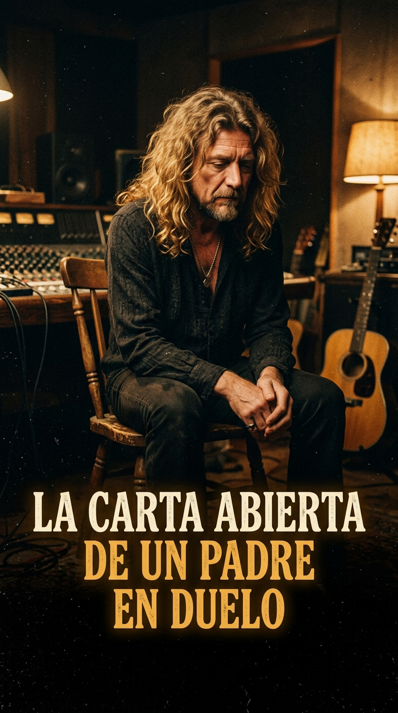
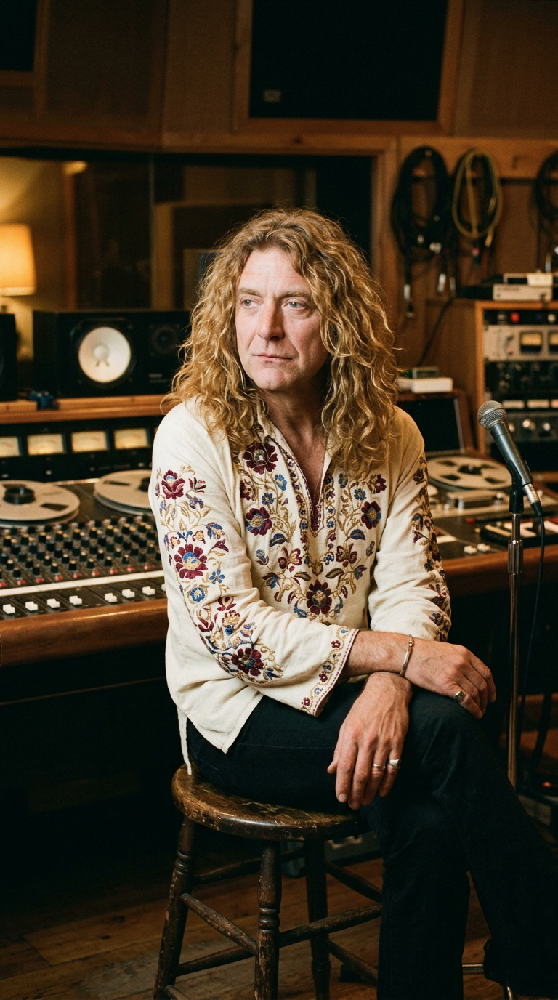
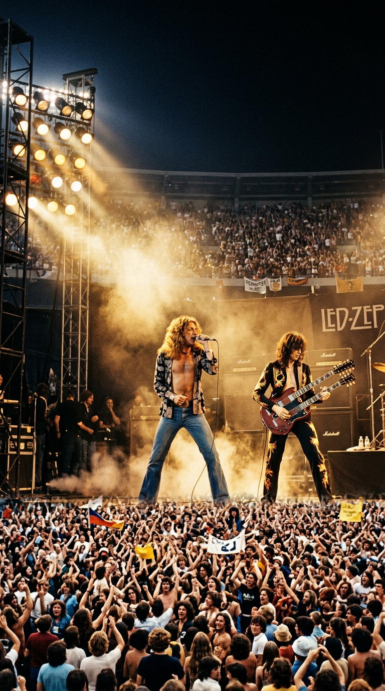
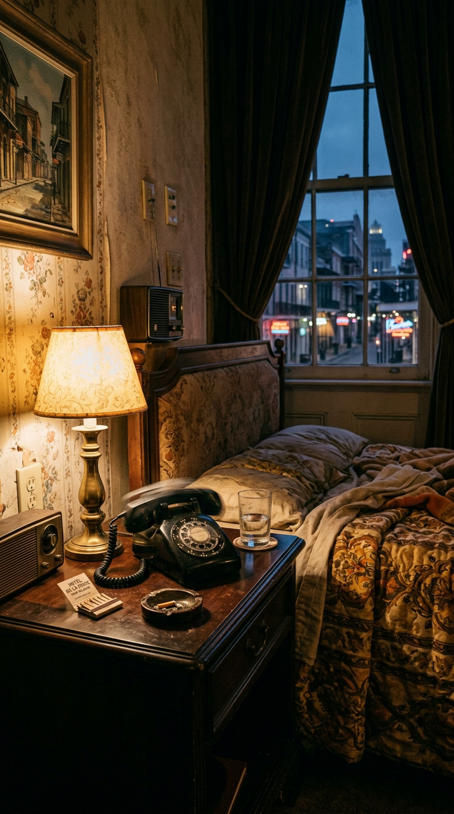
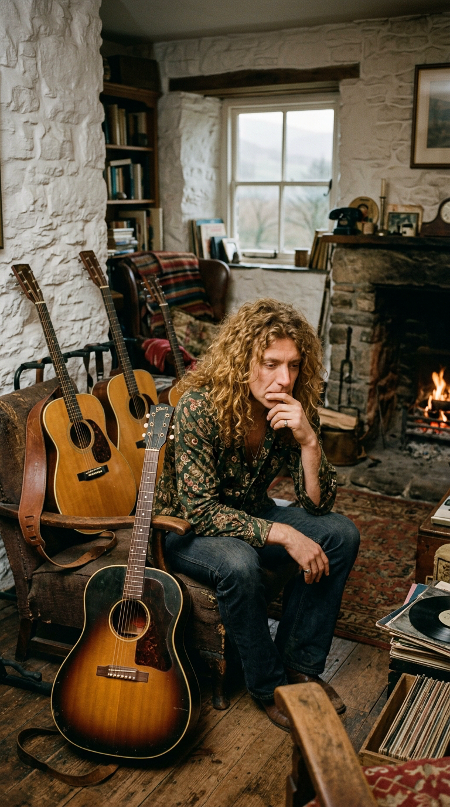
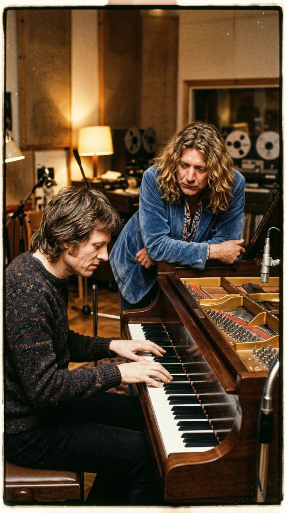
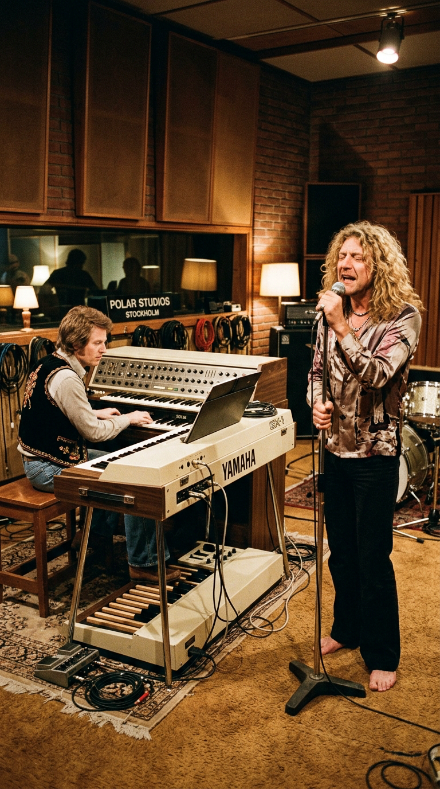
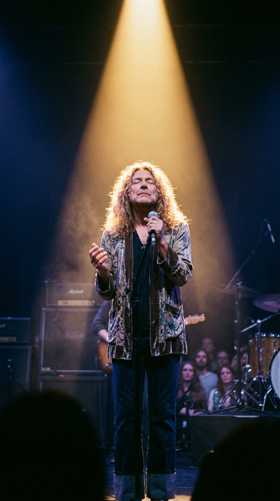

# 🕊️ La Carta Abierta de un Padre en Duelo: La Tragedia que Quebró a Led Zeppelin y la Plegaria Eterna de Robert Plant
### *Cómo la repentina muerte de su hijo de cinco años paralizó a la mayor banda del planeta, el retiro solitario en Gales y la balada luminosa en los estudios de ABBA que desafió la dureza del hard rock.*

---

**Por la redacción de Acordes Ocultos**  
*Tiempo de lectura estimado: 9 minutos*

---

### Prólogo: El coloso herido en la cima del mundo

En el verano de 1977, **Led Zeppelin** era una fuerza de la naturaleza sin parangón en la historia de la música. Su undécima gira por Norteamérica pulverizaba todos los récords de asistencia registrados: llenaban estadios de setenta mil espectadores por noche, viajaban a bordo de su propio avión privado *Caesar's Chariot* y amasaban fortunas colosales que los convertían en monarcas absolutos del rock and roll.

*1978: Robert Plant en la penumbra del estudio, marcado por la tristeza indeleble tras la pérdida de su hijo.*

Sin embargo, detrás de la opulencia y el estruendo de los amplificadores, una atmósfera oscura y destructiva comenzaba a pudrir las entrañas del cuarteto británico. Las peleas violentas de su personal de seguridad tras bambalinas, las adicciones descontroladas y el desgaste físico de meses en la carretera presagiaban un colapso inminente. 

Nadie en el séquito de la banda imaginaba que el golpe definitivo no provendría de la ley ni de los excesos del estrellato, sino de una llamada telefónica intercontinental que partiría en dos el alma de su vocalista.

---

### Acto I: El teléfono negro en Nueva Orleans

La tarde del 26 de julio de 1977, la banda se encontraba alojada en el elegante hotel **Maison Dupuy** del Barrio Francés de Nueva Orleans, preparándose para actuar ante ochenta mil personas en el monumental Superdome. En su suite, **Robert Plant**, que por entonces tenía veintiocho años, descansaba junto a la ventana cuando el timbre del teléfono negro de la mesilla comenzó a sonar con insistencia metálica.

*26 de julio de 1977: En la soledad de la suite de Nueva Orleans, la llamada que ningún padre está preparado para atender.*

Al descolgar, la voz entrecortada y bañada en lágrimas de su esposa Maureen llegó desde Inglaterra. Su hijo menor, **Karac Pendragon Plant**, de apenas cinco años de edad, había enfermado repentinamente en su granja de Midlands con fiebre alta y vómitos provocados por un virus estomacal fulminante. El médico de cabecera intentaba estabilizarlo de urgencia en el hospital de Kidderminster.

Dos horas más tarde, el teléfono volvió a sonar en la habitación de Plant. Esta vez no hubo explicaciones médicas. Karac había sufrido un colapso respiratorio irreversible en brazos de su madre. Había fallecido.

El impacto fue demoledor. Testigos en el hotel relataron que los aullidos de dolor de Plant sacudieron los pasillos del Maison Dupuy. La gira norteamericana se canceló en ese mismo instante. Sin equipaje y con el pecho desgarrado por la incredulidad, Robert abordó el primer vuelo transatlántico de regreso a Gran Bretaña para enterrar a su hijo en el cementerio parroquial de San Pedro, en Wolverley.

*Otoño de 1977: Robert Plant contempla la lluvia en el campo galés, sumido en un silencio que amenazaba con alejarlo de la música para siempre.*

En el sepelio, una herida invisible se abrió en el corazón de la banda: mientras el baterista **John Bonham** —amigo de la infancia de Robert en Black Country— acudió de inmediato a abrazar a su compañero y llorar con él como un hermano, la ausencia física de Jimmy Page y John Paul Jones en los primeros días del duelo generó una frialdad amarga que Plant tardaría años en perdonar.

Sumergido en una depresión asfixiante, Plant se aisló en Jennings Farm, su remota granja en las colinas de Gales. Colgó el micrófono, guardó silencio absoluto durante más de un año y consideró seriamente abandonar Led Zeppelin para siempre y matricularse en una escuela rural como maestro de educación infantil.

---

### Acto II: La cabaña en Gales y el pacto con John Paul Jones

Fue el paso implacable del tiempo y la insistencia paciente de John Bonham lo que finalmente rescató a Robert Plant de la parálisis vital. Hacia finales de 1978, el vocalista comprendió que la única manera de no enloquecer ante la ausencia física de Karac era transformar su memoria en un acto de amor creador.

*1978: En el refugio de su cabaña en Gales, Robert busca en los acordes acústicos un canal de diálogo con el recuerdo de Karac.*

En noviembre de 1978, Led Zeppelin acordó reunirse en territorio neutral para intentar componer nuevo material. El lugar elegido fueron los **Polar Studios** de Estocolmo, en Suecia: unas modernas y luminosas instalaciones de grabación analógica recién inauguradas por los miembros del grupo **ABBA**.

El ambiente en Estocolmo distaba mucho de la hermandad juvenil de antaño. El guitarrista Jimmy Page y el mánager Peter Grant atravesaban graves problemas de adicción a las drogas duras y solían llegar a los estudios a altas horas de la madrugada, durmiendo durante el día. En esas largas mañanas vacías en Polar Studios, **Robert Plant** y el multiinstrumentista **John Paul Jones** comenzaron a trabajar juntos en solitario, lejos del ruido y la toxicidad que amenazaban a la banda.

---

### Acto III: El milagro del Yamaha GX-1 en Polar Studios

John Paul Jones se sentó frente a una joya de la ingeniería electrónica recién adquirida por el estudio: el **Yamaha GX-1**, un revolucionario sintetizador polifónico apodado «el sintetizador soñado», capaz de emular con calidez orgánica cuerdas orquestales, metales barrocos y órganos de catedral.

*Noviembre de 1978 en Polar Studios de Estocolmo: John Paul Jones y Robert Plant forjan en secreto la melodía de All of My Love.*

Conmovido por la fragilidad emocional de Plant, Jones comenzó a pulsar una secuencia armónica luminosa, tierna y majestuosa construida sobre acordes mayores (La mayor, Si menor, Mi mayor). Aquella música no tenía nada que ver con el hard rock pantanoso, agresivo y oscuro que había cimentado el mito de Led Zeppelin: era un manto de luz pura, una sonata neoclásica cargada de elegancia y esperanza.

Sentado a su lado con una guitarra acústica de doce cuerdas y un cuaderno de notas, Plant sintió que las compuertas de su dolor contenido se abrían de par en par. No escribió un réquiem fúnebre ni una queja amarga contra Dios; escribió una carta íntima de despedida y reverencia hacia el espíritu de su hijo, entrelazando metáforas poéticas de la mitología celta sobre el destino y la permanencia del amor más allá de la muerte física:

> *«Should I fall out of love, my fire in the light  
> To chase a feather in the wind...  
> Within the glow that weaves a cloak of delight  
> There moves a thread that has no end...  
> For me, the cloth once more to cleanse...  
> He is the little boy that will never grow old...  
> But the feather will stay in the wind...»*

*1978: John Paul Jones compone los pasajes de teclado que transformaron el dolor de un padre en un monumento artístico.*

El estribillo, despojado de cualquier artificio retórico, se convirtió en una declaración inmortal de entrega incondicional:

> *«All of my love, all of my love  
> All of my love to you...»*

Cuando Jimmy Page escuchó la grabación, su reacción fue de un profundo rechazo estilístico. Acostumbrado a los riffs pesados y al blues demoníaco de temas como *«Dazed and Confused»* o *«Black Dog»*, Page consideró que *«All of My Love»* era «demasiado blanda y comercial», una concesión al pop que desvirtuaba el legado duro del grupo. Sin embargo, respetó el dolor de su compañero y se limitó a grabar un solo de guitarra sutil y melancólico para cerrar la sección central tras el virtuoso pasaje clásico de sintetizador de John Paul Jones.

*1978: Robert Plant desata en el micrófono de Polar Studios un canto desgarrador donde la vulnerabilidad sustituye al rugido del rock.*

De las ocho canciones que conformaron el nuevo disco, *«All of My Love»* fue una de las dos únicas piezas en toda la historia de Led Zeppelin donde el nombre de Jimmy Page no figuró en los créditos de composición: la autoría pertenecía en exclusiva a Robert Plant y John Paul Jones.

---

### Acto IV: La despedida definitiva y la consagración del mito

En agosto de 1979 vio la luz el octavo y último álbum de estudio de la banda: **In Through the Out Door**. A pesar de las reticencias de los sectores más puristas del hard rock, el disco se disparó al **número uno de las listas de éxitos en el Reino Unido y en los Estados Unidos**, permaneciendo siete semanas consecutivas en la cima de Billboard.

*La presencia espiritual de Karac: La metáfora visual de la pluma en el viento que trasciende el umbral de la muerte.*

Para millones de oyentes en todo el mundo, *«All of My Love»* representó una revelación sobrecogedora: el cantante que había encarnado al dios vikingo de la sensualidad y el trueno se despojaba de su armadura para mostrarse como un padre destrozado pero invicto ante la muerte, capaz de encontrar belleza en las cenizas más desoladoras de su vida.

Trágicamente, el destino asestó un último golpe mortal a Led Zeppelin apenas un año después: el 25 de septiembre de 1980, el baterista John Bonham falleció por asfixia accidental tras una noche de excesos alcohólicos. Rotos por dentro y fieles a su pacto de hermandad, Robert Plant, Jimmy Page y John Paul Jones emitieron un comunicado oficial anunciando la disolución irrevocable de la banda: sin Bonham, Led Zeppelin no podía existir.

*Robert Plant interpretando con los ojos cerrados bajo un foco cálido el himno dedicado a su hijo.*

---

### Epílogo: La pluma que nunca cae

A lo largo de su brillante y extensa carrera en solitario durante las décadas siguientes, Robert Plant interpretó *«All of My Love»* en contadísimas ocasiones. Con un pudor sagrado, el cantante siempre consideró la canción como un relicario privado, una plegaria que pertenecía única y exclusivamente a la memoria de su pequeño Karac.

En una íntima entrevista retrospectiva concedida a la revista británica *Uncut*, Plant reflexionó con serenidad sobre el significado último de aquella balada inmortal:

> —*«Perder a un hijo es una herida que jamás cicatriza; aprendes a vivir con el vacío, pero el dolor siempre camina a tu lado en silencio. Cuando grabamos 'All of My Love' en Estocolmo, no estaba pensando en vender discos ni en los fanáticos de los estadios. Era simplemente una conversación directa con mi hijo allá donde estuviera su alma. Quería dejar constancia de que nada en este mundo —ni la fama, ni el dinero, ni la distancia insondable de la muerte— puede apagar el fuego de un amor verdadero. Esa pluma seguirá flotando en el viento para siempre»*.

*«All of My Love»* permanece en la cúspide de la historia musical como el testimonio más conmovedor de la fragilidad humana: el día en que los titanes más ruidosos del planeta bajaron el volumen de sus guitarras para que el susurro de un padre pudiera acariciar el cielo.

---

### 📚 Fuentes y Archivo Documental

* **Spitz, Bob**: *Led Zeppelin: The Biography* (Penguin Press, 2021). Documentación pormenorizada sobre la gira norteamericana de 1977, la muerte de Karac Plant y las grabaciones en Polar Studios.
* **Davis, Stephen**: *Hammer of the Gods: The Led Zeppelin Saga* (William Morrow, 1985). Crónica hemerográfica sobre la estancia en el hotel Maison Dupuy de Nueva Orleans y el funeral de Karac.
* **Wall, Mick**: *When Giants Walked the Earth: A Biography of Led Zeppelin* (Orion, 2008). Testimonios orales sobre el distanciamiento interno tras la tragedia y la colaboración entre Plant y John Paul Jones.
* **Plant, Robert**: Entrevistas autobiográficas en *Uncut* Magazine (Edición especial retrospectiva, 2005) y *Rolling Stone* (1988 y 2007), explicando el simbolismo lírico del tema.
* **Page, Jimmy**: Declaraciones en *Guitar World* (1993) sobre sus dudas iniciales con el sintetizador Yamaha GX-1 y su respeto final hacia la obra.
* **Polar Studios Technical Logs**: Archivos de producción e ingeniería de sonido de Estocolmo correspondientes a las sesiones de *In Through the Out Door* (Noviembre–Diciembre de 1978).
* **Billboard Chart History**: Registros del álbum *In Through the Out Door* en el N.º 1 del Billboard 200 (Agosto–Octubre de 1979).
