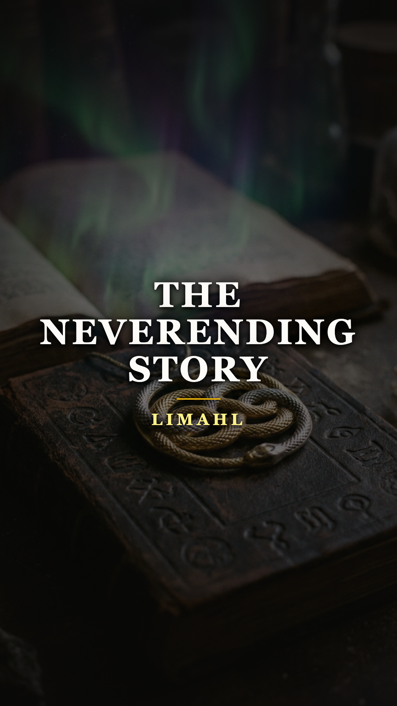
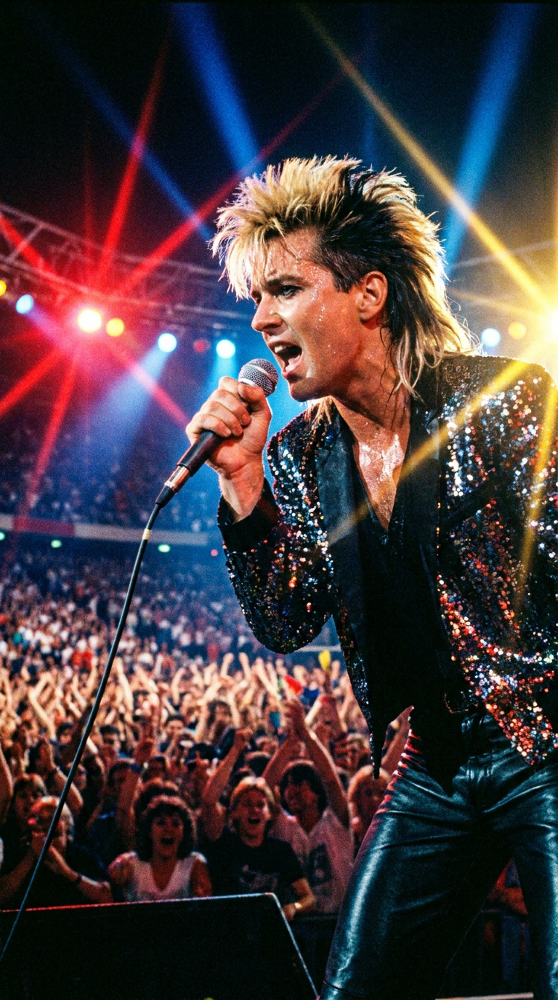
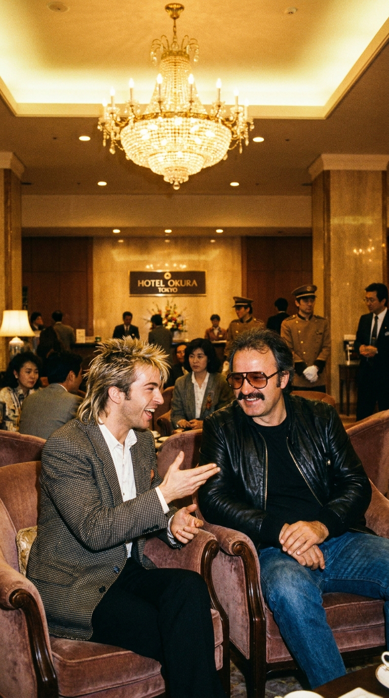
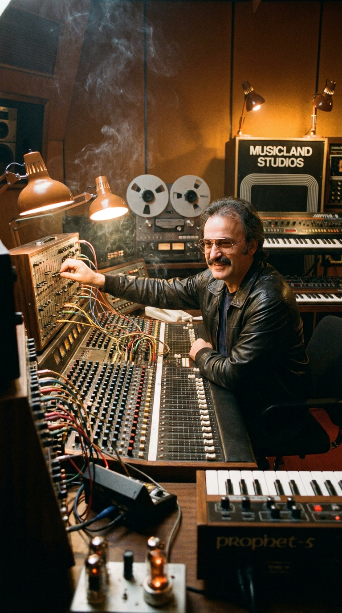
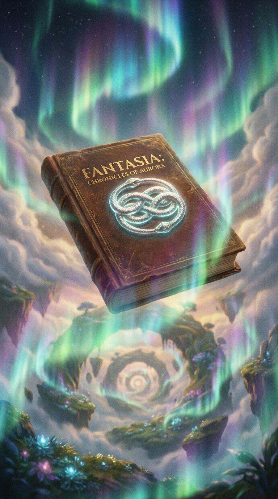
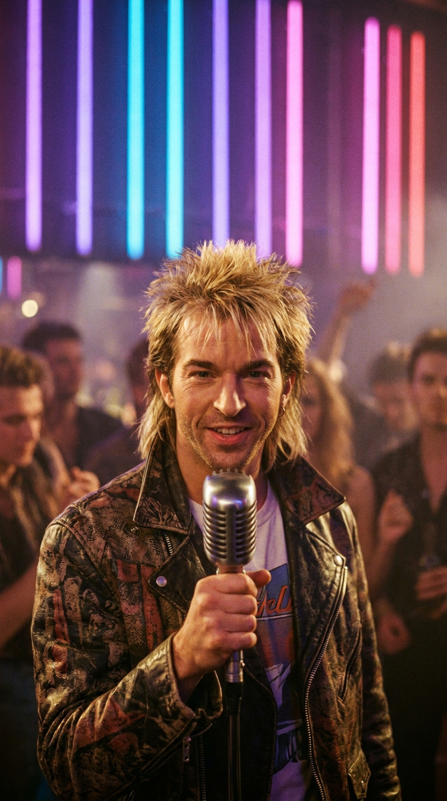

# 🐉 La Canción Sin Fin: La Traición por Teléfono que Forjó el Himno Inmortal de Fantasía
### *Cómo Limahl fue despedido vilmente de Kajagoogoo tras cobrar un show, halló a Giorgio Moroder por azar en Tokio y grabó la melodía infinita que Michael Ende intentó prohibir.*

---

**Por la redacción de Acordes Ocultos**  
*Tiempo de lectura estimado: 8 minutos*

---

### Prólogo: La melodía que no tiene principio

Si uno escucha con atención los primeros compases de **«The NeverEnding Story»**, descubrirá un fenómeno acústico insólito en la historia del pop de los años ochenta: la pista no arranca con un golpe de batería, ni con un acorde marcado, ni con una cuenta atrás en el plató. Emerge imperceptiblemente del silencio absoluto mediante un *fade-in* progresivo, como si la música llevara sonando desde el origen del universo en una dimensión paralela y nuestros oídos simplemente se hubieran sintonizado con su frecuencia.

Enseguida, una cascada de sintetizadores cristalinos y arpegios analógicos dibuja un cielo salpicado de estrellas, antes de que una voz juvenil, dulce y ligeramente andrógina, entone la invitación más nostálgica de la era analógica:

> *«Turn around, look at what you see...  
> In her face, the mirror of your dreams...  
> Make believe I'm everywhere, given in the lines  
> Written on the pages, is the answer to a never ending story...»*

Aquellas notas quedaron grabadas en la retina emocional de toda una generación: el vuelo blanco del dragón de la suerte **Falkor** sobre las colinas verdes del Reino de Fantasía, la mirada penetrante de la Emperatriz Infantil en su Torre de Marfil y el muchacho Bastian devorando el libro encuadernado en cuero bajo la luz de una vela en el desván de su escuela.

Sin embargo, detrás de aquella cumbre del pop cinematográfico no había una planificación corporativa armoniosa. Había una puñalada por la espalda entre compañeros de banda, un despido cobarde por teléfono, un encuentro accidental a diez mil kilómetros de distancia y un litigio judicial feroz desatado por uno de los escritores más célebres de Europa, quien intentó por todos los medios legales impedir que aquella canción viera la luz.

---

### Acto I: La llamada cobarde tras el concierto en Finlandia

Para entender el renacimiento de **Limahl** (cuyo nombre real es **Christopher Hamill**, un anagrama de su propio apellido), es indispensable retroceder a los meses más convulsos del año 1983. Con apenas veinticuatro años, el cantante se había convertido en uno de los rostros más reconocibles del planeta al frente del quinteto británico de new wave **Kajagoogoo**.

Impulsados por el padrinazgo de Nick Rhodes, teclista de Duran Duran, su sencillo debut *«Too Shy»* fue un terremoto sónico: número uno en el Reino Unido, número uno en doce países y número cinco en el estricto Billboard Hot 100 estadounidense. 

Con su corte de pelo puntiagudo bicolor (rubio platino en la coronilla y castaño oscuro en la nuca), sus chalecos entallados y su energía magnética, Limahl acaparaba todas las portadas de las revistas juveniles como *Smash Hits* y los focos de la televisión.

*Verano de 1983: Limahl frente a 40.000 fanáticos en Finlandia, ignorando que entre bastidores sus compañeros tramaban su expulsión por celos.*

Pero en el interior del grupo, el resentimiento y la envidia profesional comenzaron a corroer la convivencia. Los otros cuatro integrantes —Nick Beggs, Steve Askew, Stuart Neale y Jez Strode— consideraban que la prensa eclipsaba su virtuosismo instrumental para centrarse únicamente en la imagen de su vocalista.

El desenlace fue de una bajeza memorable. A finales del verano de 1983, tras concluir un concierto apoteósico ante más de cuarenta mil personas en un festival de Finlandia, la banda regresó a Londres. Los cuatro músicos esperaron deliberadamente a que la promotora transfiriera los honorarios del concierto y se liquidaran los cheques de la gira. 

Apenas el dinero estuvo a salvo en sus cuentas bancarias, el bajista Nick Beggs levantó el teléfono y llamó a Limahl a su piso:  
—*«Christopher, hemos tenido una reunión. Estás fuera del grupo. Hemos decidido continuar sin ti»*.

*Londres, 1983: En la soledad de su salón, Limahl sostiene el auricular conmocionado tras ser traicionado por quienes consideraba sus hermanos.*

Limahl se quedó paralizado, con el auricular pegado a la oreja mientras las lágrimas rodaban por sus mejillas. No hubo reunión cara a cara, ni explicaciones artísticas, ni derecho a réplica. En cuestión de segundos, el joven que llenaba estadios fue despojado de la banda que él mismo había ayudado a fundar y bautizar.

---

### Acto II: El abismo del juguete roto y el azar en Tokio

La caída en desgracia fue fulminante. La maquinaria de la industria musical británica, siempre despiadada con los ídolos adolescentes caídos, le dio la espalda de la noche a la mañana. Los tabloides lo calificaron de «juguete roto» y sus primeros intentos en solitario pasaron desapercibidos en las listas.

Hundido en una profunda depresión, avergonzado de salir a la calle y sintiendo que su carrera profesional había terminado antes de cumplir los veinticinco años, Limahl recibió a mediados de 1984 una invitación modesta: viajar a Japón para participar como representante británico en el **World Popular Song Festival de Tokio**, celebrado en el prestigioso auditorio Nippon Budokan.

Aceptó el viaje sin grandes expectativas, simplemente para poner distancia con el asedio de la prensa londinense. No podía imaginar que en el vestíbulo de un hotel de lujo en el bullicioso distrito de Shinjuku el destino le tenía reservada la mayor carambola de su vida.

*Tokio, 1984: En el vestíbulo del hotel, el arquitecto del sintetizador Giorgio Moroder descubre el timbre mágico de Limahl.*

Una tarde, mientras tomaba un café para combatir el desfase horario, Limahl divisó al otro lado del salón a un hombre de bigote inconfundible y gafas de sol oscuras: era **Giorgio Moroder**, el genio italiano de la música electrónica, el legendario productor de Donna Summer, pionero del Eurodisco y flamante ganador de dos premios Oscar de la Academia por las bandas sonoras de *El expreso de medianoche* (1978) y *Flashdance* (1983).

Armándose de un valor desesperado, Limahl se acercó a su mesa para presentarse y expresarle su admiración. Moroder, que estaba familiarizado con el éxito de *«Too Shy»*, lo observó detenidamente y le dijo con su marcado acento tirolés:  
—*«Conozco tu voz, Christopher. Es limpia, tiene fragilidad pero corta la mezcla. Estoy produciendo en Múnich la música para la película fantástica más cara de la historia del cine europeo. Tengo una canción que necesita exactamente ese timbre. ¿Volarías a Alemania la próxima semana?»*.

Aquella conversación fortuita de cinco minutos cambió la historia de la música pop.

---

### Acto III: La rebelión de Michael Ende y el juicio por Fantasía

La película en cuestión era ***La historia interminable*** (*Die unendliche Geschichte*), una superproducción germano-estadounidense de veinticinco millones de dólares dirigida por **Wolfgang Petersen** (el aclamado director de *Das Boot*). 

Para el mercado internacional, los productores de Constantin Film y Warner Bros. decidieron que la música orquestal original de Klaus Doldinger resultaba demasiado densa para el público juvenil anglosajón. Por ello, contrataron a Moroder para que compusiera una nueva banda sonora electrónica y un tema central radiable que sirviera de ariete promocional en las cadenas de televisión.

*Musicland Studios, Múnich: Giorgio Moroder en la consola analógica, esculpiendo los arpegios dorados de la canción.*

Moroder se encerró en los míticos **Musicland Studios** de Múnich junto a su letrista de cabecera, **Keith Forsey**. Juntos concibieron una joya de synth-pop con sintetizadores Roland Júpiter-8, cajas de ritmos LinnDrum y una atmósfera etérea inspirada en la literatura fantástica. Limahl voló a Múnich y clavó las tomas vocales en apenas unas horas; poco después, en Los Ángeles, la cantante estadounidense **Beth Anderson** grabó las armonías vocales femeninas que completaban el dueto angelical.

Sin embargo, cuando el autor de la novela original, el ilustre escritor alemán **Michael Ende**, escuchó el resultado del filme y la música pop de Moroder, entró en una cólera monumental.

*1984: Michael Ende califica la película de «hamburguesería kitsch» e inicia acciones legales contra los productores.*

Ende consideraba que la adaptación cinematográfica había traicionado por completo la profundidad mística, filosófica y antropológica de su libro. Acusó a Petersen de transformar su fábula existencial en una «gigantesca hamburguesería kitsch de Hollywood» repleta de monstruos de gomaespuma, y calificó la música sintetizada de Moroder de sacrilegio comercial.

El novelista presentó una demanda judicial formal en los tribunales de Múnich para paralizar el estreno mundial de la película o, en su defecto, obligar a la productora a retirar su nombre de los créditos principales. Aunque los jueces finalmente permitieron el estreno tras un acuerdo donde el nombre de Ende quedaba relegado al final de los títulos de crédito, la polémica desató una expectación mediática sin precedentes.

---

### Acto IV: La arquitectura sónica de la eternidad

Pese a la furia de Ende, Moroder y Forsey habían incorporado en la composición de «The NeverEnding Story» un concepto filosófico y estructural brillante que rendía un homenaje insuperable al título de la obra: **la canción fue diseñada para no tener principio ni final**.

En una época en que los sencillos pop cerraban con resoluciones armónicas perfectas (tónicas contundentes o acordes finales sostenidos), Moroder concibió la pista como un lazo de Möbius acústico:

1. **La apertura infinita**: Arranca de la nada absoluta mediante un fundido de entrada (*fade-in*) de doce segundos que simula el nacimiento de una galaxia.
2. **La ausencia de resolución**: La progresión armónica del estribillo nunca descansa en la tónica raíz; se mantiene en una tensión aérea suspendida en el modo lidio.
3. **El cierre infinito**: Hacia el minuto 3:15, el saxofón y los sintetizadores continúan girando mientras el volumen desciende paulatinamente en un fundido de salida (*fade-out*), transmitiendo al oyente la convicción inequívoca de que, aunque el disco termine, la canción sigue sonando en algún rincón invisible del cosmos.

*La arquitectura sónica: Un fundido sin principio ni fin diseñado por Moroder para que la fantasía jamás dejara de sonar.*

El lanzamiento del sencillo a finales de 1984 fue una apoteosis planetaria. Alcanzó el **número uno en doce países**, incluyendo Suecia, Noruega, Austria y España, llegó al número cuatro en el Reino Unido y conquistó el Top 20 en los Estados Unidos. La sonrisa de Limahl volvía a brillar en las pantallas de todo el mundo.

---

### Epílogo: El triunfo de Fantasía sobre el tiempo

La justicia poética no tardó en manifestarse. Mientras Limahl saboreaba una redención artística y financiera que lo convirtió en un icono intergeneracional, sus antiguos compañeros de Kajagoogoo editaron dos álbumes sin él que fracasaron estrepitosamente en el mercado, obligando a la banda a disolverse en 1985 sumida en deudas y en el olvido del público.

Treinta y cinco años después de su grabación, en el verano de 2019, la magia de «The NeverEnding Story» volvió a sacudir al planeta. En el episodio final de la tercera temporada de la serie de Netflix ***Stranger Things***, los personajes de Dustin y Suzie interpretaron la canción a capela por radiofrecuencia en mitad de una persecución contra reloj. 

En menos de veinticuatro horas, las reproducciones del tema en Spotify y YouTube se dispararon un **ochocientos por ciento**, escalando nuevamente a las listas de éxitos virales mundiales y conquistando a una generación que ni siquiera había nacido en los años ochenta.

*El triunfo sobre el tiempo: Cuatro décadas después, la voz de Limahl nos recuerda que la infancia y los sueños son inmunes al olvido.*

La traición que pretendió enterrar a Limahl en un piso oscuro de Londres solo sirvió para empujarlo hacia las manos de un genio que inmortalizó su voz para siempre. Porque los imperios discográficos pasan, los celos se extinguen y los rencores se olvidan; pero cada vez que suena ese sintetizador suspendido en el aire, volvemos a subir a lomos de Falkor para comprobar que, mientras exista un niño capaz de abrir un libro, la historia interminable jamás tendrá final.

---

### 💬 El eco en la memoria

¿Qué sentiste la primera vez que escuchaste *«The NeverEnding Story»* y qué recuerdos te despierta la voz de Limahl sobrevolando las nubes de Fantasía? ¿Crees que la intervención pop de Giorgio Moroder benefició a la película o compartes la visión purista de Michael Ende? Déjanos tu reflexión en los comentarios.

---

### 📚 Fuentes y Archivo Documental

* **Majewski, Lori & Miller, Jonathan** (2014). *Mad World: An Oral History of New Wave Artists and Songs That Defined the 1980s*. Abrams Image, Nueva York. Testimonios directos de Limahl sobre su expulsión y la colaboración con Giorgio Moroder.
* **Moroder, Giorgio** (2013). *Lecture: Synthesizer Pioneers and Film Scoring*. Red Bull Music Academy, Nueva York. Declaraciones sobre el método de composición, el uso de arpegios y la colaboración con Keith Forsey y Limahl.
* **The Guardian** (2020). *How we made: Limahl and Giorgio Moroder on The NeverEnding Story*. Entrevista en profundidad de Dave Simpson sobre las sesiones de grabación en Musicland Studios (Múnich).
* **Ende, Michael** (1984). *Conferencia de prensa y demanda judicial contra Neue Constantin Film por deformación de obra*. Hemeroteca de *Der Spiegel* (Edición N.º 14/1984: «Kitsch ist das Zauberwort») y Archivo Judicial de Múnich.
* **British Phonographic Industry (BPI) & Billboard** (1984–1985). *International Singles Chart History: The NeverEnding Story*.
