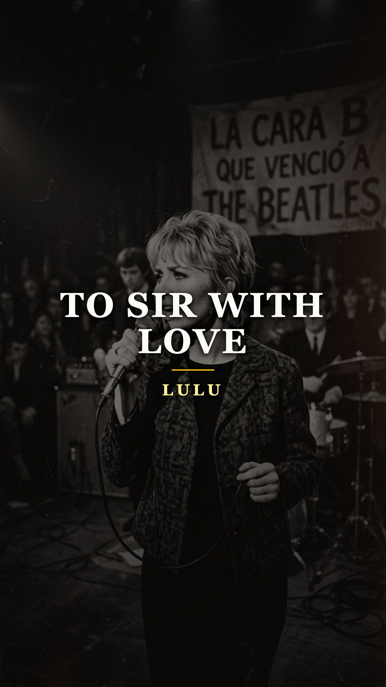
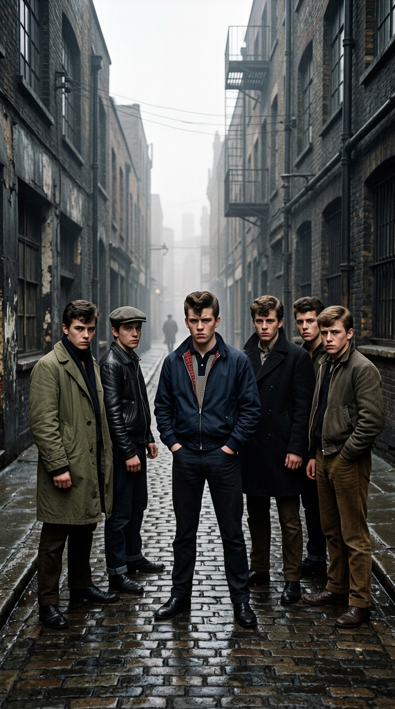
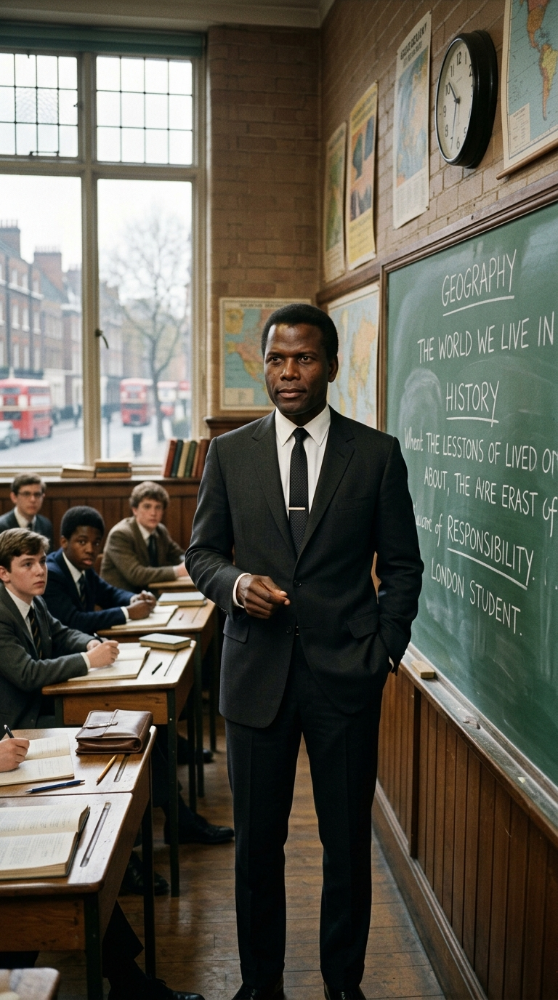
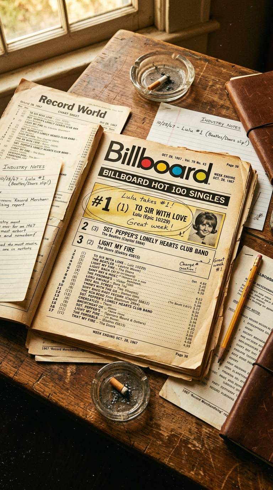

# 🎓 La Huérfana del East End y el Maestro que Venció a The Beatles: La Historia Secreta de «To Sir with Love»
### *Cómo una balada desterrada a la Cara B por los ejecutivos de Londres, rechazada por las discográficas inglesas y nacida de un rodaje entre jóvenes marginales y Sidney Poitier, se convirtió en el fenómeno radial que conquistó el número uno de América en pleno Verano del Amor de 1967.*

---

**Por la redacción de Acordes Ocultos**  
*Tiempo de lectura estimado: 6 minutos*

---

### Prólogo: El interruptor en la cabina de Manhattan

En una tarde gris de finales de agosto de 1967, en el piso veintiséis de un rascacielos del centro de Manhattan, un veterano programador de la emisora de radio *WABC* contemplaba con desgana un pequeño disco de vinilo de siete pulgadas recién llegado en el correo de importación británico. 

La etiqueta plateada del sello *Epic Records* anunciaba con letras mayúsculas el nuevo sencillo de la cantante escocesa **Lulu**: *«The Boat That I Row»*, una pieza de pop efervescente y ligero compuesta por Neil Diamond. El disco estaba diseñado milimétricamente para complacer a las emisoras juveniles: ritmo bailable, coros azucarados y una duración estándar de dos minutos y cuarenta segundos. Cumpliendo la rutina, el locutor colocó la aguja sobre el microsurco de la Cara A y la canción sonó en antena. Fue recibida con la más absoluta e indiferente cortesía por parte de los oyentes.

Aburrido antes de salir a su descanso para el almuerzo, y sin más expectativas que matar tres minutos de tiempo muerto, el operador de sonido cometió un acto fortuito de desobediencia profesional: levantó el brazo mecánico del tocadiscos, dio la vuelta al vinilo y dejó caer la púa sobre el lado condenado de la copia promocional. 

Aquella era la **Cara B**: el vertedero contractual donde las casas discográficas solían esconder las canciones de relleno, las sobras de estudio y los descartes que ningún ejecutivo consideraba dignos de promoción.

A través de los monitores de estudio no brotó pop psicodélico ni guitarras estridentes. Sonó, en cambio, una campana orquestal solitaria, un piano de madera íntimo como un susurro infantil y la voz desnuda de una muchacha de dieciocho años que parecía cantar con un nudo de lágrimas contenido en la garganta:

> *«Those schoolgirl days of telling tales and biting nails are gone...  
> But in my mind, I know that there will still live on and on...»*

En menos de tres minutos, la centralita telefónica del piso veintiséis se encendió como un árbol navideño fuera de control. Decenas de líneas parpadearon al unísono: oficinistas detenidos en el tráfico de la Quinta Avenida, amas de casa de Brooklyn, estudiantes universitarios de Queens y veteranos de guerra conmovidos llamaban en masa exigiendo saber qué era aquella melodía desgarradora y rogando que volvieran a ponerla de inmediato.

Nadie en Londres lo sabía aún, pero la maquinaria de la historia musical acababa de dar un giro irreversible: la canción que los ejecutivos británicos habían desterrado a la basura estaba a punto de arrebatarle el trono de América a The Beatles, The Doors y The Rolling Stones.

---

### Acto I: La fiera de Glasgow y el laberinto de Carnaby Street

Para comprender el peso emocional de aquella grabación, es indispensable retroceder a los callejones húmedos de Dennistoun, un suburbio obrero al este de Glasgow, en Escocia. Allí creció **Marie McDonald McLaughlin Lawrie**, una niña menuda, pelirroja y de mirada chispeante, criada entre la estrechez económica de una familia de clase trabajadora. 

*Glasgow y Londres, mediados de los años sesenta: La menuda Marie Lawrie transformada en el fenómeno vocal «Lulu».*

A los quince años, rebautizada como **Lulu**, conmocionó las listas británicas con una versión volcánica y salvaje de *«Shout»* de The Isley Brothers. Con una energía física descomunal y un timbre rasgado más propio de una veterana cantante afroamericana de gospel que de una colegiala escocesa, la prensa la catalogó de inmediato como un torbellino juvenil de R&B.

Sin embargo, a medida que la ola del *Swinging London* estallaba en 1966 con sus minifaldas de Mary Quant y las boutiques psicodélicas de Carnaby Street, Lulu se vio atrapada en una encrucijada artística sofocante. Los sellos discográficos querían domesticarla: le imponían vestidos de muñeca de porcelana, canciones de feria comercial y apariciones en programas de variedades ligeros. Ella quería cantar con verdad y desnudarse el alma; la industria solo quería que sonriera y agitara el flequillo frente a las cámaras.

El rescate llegó desde un rincón totalmente inesperado: el celuloide cinematográfico. El aclamado novelista y cineasta **James Clavell** (quien años más tarde escribiría la monumental novela *Shōgun*) estaba preparando la adaptación cinematográfica de una célebre memoria autobiográfica y buscaba a una muchacha auténtica que no supiera fingir: alguien de orígenes humildes que pudiera interpretar a una rebelde colegiala del East End londinense.

Lulu no solo obtuvo el papel secundario de *Barbara Pegg*; sin pretenderlo, acababa de cruzar la puerta de entrada al rodaje que redefiniría su destino.

---

### Acto II: La dignidad como trinchera: Sidney Poitier en el East End

La película se titulaba **«To Sir, with Love»** (estrenada en el mundo hispanohablante como *«Rebelión en las aulas»* o *«Al maestro con cariño»*), basada en el libro del diplomático guyanés **E.R. Braithwaite**. 

La historia no era una ficción complaciente: reflejaba la crudeza de la posguerra británica en el marginal barrio del East End de Londres, donde los escombros de los bombardeos de la Luftwaffe nazi aún convivían con familias hacinadas, fábricas humeantes y una juventud desencantada, cínica y violenta que abandonaba los pupitres para irse a la miseria del andamio o la delincuencia callejera.

*Londres, 1966: Sidney Poitier como el maestro Mark Thackeray, una encarnación de temple y respeto frente a la hostilidad del aula.*

En medio de aquel entorno hostil y en una Gran Bretaña donde las tensiones raciales contra los inmigrantes antillanos y caribeños estaban a flor de piel, el argumento situaba a **Sidney Poitier** en el papel del ingeniero antillano **Mark Thackeray**, un hombre que, incapaz de conseguir empleo en su profesión debido al racismo institucional de la época, acepta un puesto temporal como profesor en la conflictiva escuela secundaria de North Quay.

Poitier, quien en ese mismo año prodigioso de 1967 rodaría obras maestras contra la segregación como *«In the Heat of the Night»* y *«Guess Who's Coming to Dinner»*, aportó al papel una dignidad regia y serena. En lugar de doblegar a los muchachos con castigos corporales o sermones condescendientes, Thackeray los trató por primera vez como adultos: tiró los libros de texto a la basura, les enseñó modales, respeto mutuo, higiene y, por encima de todo, el valor inquebrantable de la propia dignidad humana.

Hacia el desenlace de la película, durante el baile de graduación de fin de curso, los alumnos debían entregarle un obsequio de despedida y agradecerle haberlos rescatado del abismo. James Clavell necesitaba desesperadamente una canción para esa escena culminante.

Sin embargo, el director rechazó una tras otra decenas de maquetas enviadas por compositores profesionales de Tin Pan Alley: *«Todas suenan a melodrama barato o a clichés infantiles de graduación»*, protestaba furioso Clavell.

Fue la propia Lulu quien decidió tomar cartas en el asunto. En una visita a los estudios, contactó a su amigo, el compositor británico **Mark London**, y al célebre letrista **Don Black** (quien ya había ganado el Óscar por *«Born Free»*). Lulu los sentó en una habitación con un piano y les explicó lo que Poitier significaba para aquellos muchachos en el plató: *«No necesitamos una canción sobre la escuela; necesitamos una carta de gratitud a un padre que nunca tuvimos»*.

Esa misma tarde, en menos de una hora de inspiración febril, nació la melodía y el verso inmortal:

> *«If you wanted the sky, I would write across the sky in letters  
> That would soar a thousand feet high: 'To Sir, with Love'»*.

Al escuchar la humilde grabación en cinta magnetofónica, James Clavell rompió a llorar en su despacho y ordenó incluirla en el montaje final de inmediato.

---

### Acto III: Olympic Studios y la ceguera de Mickie Most

A principios de 1967, Lulu entró a los legendarios **Olympic Studios** de Barnes, al suroeste de Londres, para registrar la versión oficial de la banda sonora.

En la cabina de control no estaba un artesano sensible, sino uno de los hombres más poderosos y temidos de la industria del pop británico: el productor **Mickie Most**, artífice de los éxitos multimillonarios de The Animals, Herman's Hermits y Donovan. 

Most tenía un olfato comercial infalible para el pop adolescente de chicle y guitarras pegadizas, pero padecía una ceguera monumental para las baladas de carga dramática profunda. Desde el primer minuto, dejó claro su desprecio por la composición: la consideraba un tema cursi, sentimental, apto únicamente para ancianas y completamente desfasado en un año donde la juventud británica escuchaba el sitar de George Harrison o la psicodelia lisérgica de Pink Floyd en el club UFO.

*Olympic Studios, Londres, 1967: Lulu frente al micrófono de válvulas, despojando su voz de artificios comerciales.*

Aislada tras el cristal de la sala de grabación, Lulu tomó una decisión instintiva que cambiaría para siempre el curso de su carrera. Apagó los excesos de volumen, bajó la guardia y cantó con una dulzura contenida y una melancolía que jamás había mostrado en sus discos anteriores. 

Cuando concluyó la toma maestra, los músicos de la orquesta de cuerda aplaudieron en silencio. Pero Mickie Most no se conmovió. Cumplió con entregar la cinta a la productora cinematográfica y, cuando llegó la hora de publicar el nuevo sencillo de Lulu en el Reino Unido a través del sello Columbia/EMI, ejecutó su veredicto:

* Colocó en la **Cara A** el tema rítmico de Neil Diamond, *«The Boat That I Row»*.
* Arrojó *«To Sir with Love»* a la **Cara B**, sin destinar un solo penique a su promoción ni incluirla en la programación de las radios británicas.

En las islas británicas, el single alcanzó un tibio sexto puesto gracias a la Cara A, mientras que la balada escolar pasó desapercibida como un pie de página insignificante. Para los ejecutivos de Londres, el asunto estaba zanjado.

---

### Acto IV: La rebelión de las radios y el destronamiento de The Beatles

El destino, sin embargo, tenía guardada una revancha colosal a tres mil millas de distancia.

En el verano de 1967, la película *«To Sir, with Love»* se estrenó en las salas de cine de Estados Unidos. Para sorpresa de Columbia Pictures, el filme se convirtió en un fenómeno sociocultural sin precedentes: miles de jóvenes hacían filas que doblaban las esquinas de Broadway y Los Ángeles para ver a Sidney Poitier enseñando a chicos de su misma edad a mirarse a los ojos con dignidad.

Cuando los discos de vinilo de importación llegaron a los despachos de las cadenas de radio americanas, ocurrió el chispazo de WABC en Nueva York. Locutores independientes de Filadelfia, Detroit, Chicago y San Francisco comenzaron a darle la vuelta al disco. La reacción popular fue sísmica.

*Otoño de 1967: Las listas de Billboard coronando a «To Sir with Love» en el puesto de honor durante cinco semanas consecutivas.*

El sello estadounidense *Epic Records* se vio obligado a reeditar el vinilo a toda prisa, invirtiendo el orden de las caras y colocando a *«To Sir with Love»* en el lugar de honor que le correspondía. 

En octubre de 1967, la modesta balada descartada de una muchacha escocesa de dieciocho años escaló implacable hasta el **número uno del Billboard Hot 100**. 

No fue un triunfo fugaz de una semana. La canción se atrincheró en la cima durante **cinco semanas consecutivas**, vendiendo más de un millón de copias en cuestión de semanas y recibiendo la certificación de disco de oro. Al cierre del año, las auditorías oficiales de la revista *Billboard* emitieron su dictamen histórico:

> 🏆 **EL RÉCORD INDISCUTIBLE DE 1967:** *«To Sir with Love» fue oficialmente proclamada como la **canción número uno de todo el año 1967 en los Estados Unidos**, superando en ventas e impacto radial a monumentos indiscutibles de la era como «All You Need Is Love» de The Beatles, «Light My Fire» de The Doors, «Respect» de Aretha Franklin y «Happy Together» de The Turtles.*

Lulu se convirtió en la segunda artista femenina británica de la historia en conquistar el número uno en las listas estadounidenses (tras Petula Clark con *«Downtown»*), logrando una hazaña con la que los magnates que la habían relegado a la Cara B ni siquiera se atrevían a soñar.

---

### Epílogo: El pupitre vacío y la deuda con nuestros maestros

Han transcurrido casi seis décadas desde que aquella aguja cayó por descuido en la cabina de Manhattan. Con el paso de los años, las modas pop de 1967, las psicodelias de colores chillones y las modas efímeras de Carnaby Street han quedado archivadas como reliquias nostálgicas de una era lejana.

Sin embargo, *«To Sir with Love»* conserva intacto su poder devastador. Cada vez que su melodía vuelve a sonar, el tiempo parece suspenderse: reaparece el aula humilde con suelo de madera encerada, el olor a tiza en la pizarra, el ramo de flores silvestres descansando sobre el escritorio y la figura imponente de Sidney Poitier despidiéndose en silencio con una mirada que no juzga, sino que confía.

*Un pupitre, un ramo de flores y una nota manuscrita: El homenaje eterno a quienes creyeron en nosotros cuando nadie más lo hacía.*

La lección que encierra este surco oculto es doble: por un lado, nos recuerda la arrogancia endémica de una industria que con frecuencia confunde lo comercialmente obvio con lo artísticamente eterno; por el otro, rinde tributo a una de las relaciones humanas más puras y transformadoras que existen: la del maestro que, al tratarnos con respeto, nos enseña a ser libres.

Porque al final del camino, todos llevamos en la memoria a ese maestro, tutor o mentor que se cruzó en nuestro sendero en el momento de mayor desamparo y encendió una luz donde solo había niebla.

---

### 💬 La Pregunta para Nuestra Comunidad

La historia de Lulu y Sidney Poitier nació para recordarnos que nadie llega lejos enteramente solo; siempre hay una voz generosa que nos mostró el camino antes de que aprendiéramos a caminarlo.

**¿Qué maestro, mentor o figura inesperada cambió el rumbo de tu vida cuando más perdido te encontrabas? ¿Qué palabras suyas aún resuenan en tu mente como un acorde imborrable?**

*Te leemos en los comentarios.*

---

### 📚 Fuentes y Archivo Documental

Para la rigurosa reconstrucción histórica, narrativa e industrial de esta crónica, la redacción de *Acordes Ocultos* ha consultado y contrastado las siguientes fuentes documentales:

1. **Lulu (Marie Lawrie).** *I Don't Want to Fight: The Autobiography*. Time Warner Books, Londres, 2002. Capítulos dedicados a la filmación de *To Sir, with Love*, la relación humana y artística con Sidney Poitier y las discrepancias de repertorio con el productor Mickie Most.
2. **Braithwaite, E. R.** *To Sir, With Love*. The Bodley Head, Londres, 1959. Novela testimonial autobiográfica de referencia sobre los retos pedagógicos y la discriminación racial en las escuelas secundarias de posguerra del East End de Londres.
3. **British Film Institute (BFI) National Archive & Columbia Pictures.** Documentación de producción, notas de rodaje y correspondencia ejecutiva de la película *To Sir, with Love* (Dirección de James Clavell, 1967).
4. **The Ivors Academy (British Academy of Songwriters, Composers and Authors).** Archivo histórico de compositores: entrevistas con Don Black y Mark London sobre la composición del tema principal y su arreglo melódico para voz y orquesta de cuerda.
5. **Billboard Magazine Historical Archives (1967).** Listas semanales del *Billboard Hot 100* (octubre y noviembre de 1967); auditoría de fin de año proclamando a «To Sir with Love» como la canción número uno del año 1967 en EE. UU.; informes de la Recording Industry Association of America (RIAA) sobre la certificación de disco de oro.
6. **Registros Fonográficos Originales:** Sencillo de 45 RPM *«The Boat That I Row»* / *«To Sir with Love»* (Columbia Records DB 8167, Reino Unido, abril de 1967); y reedición con inversión de caras *«To Sir with Love»* / *«The Boat That I Row»* (Epic Records 5-10187, Estados Unidos, agosto de 1967).

---

*Si disfrutaste esta entrega de Acordes Ocultos, compártela con un amigo melómano o suscríbete para recibir cada domingo la intrahistoria poética detrás de los grandes himnos de la música popular.*

