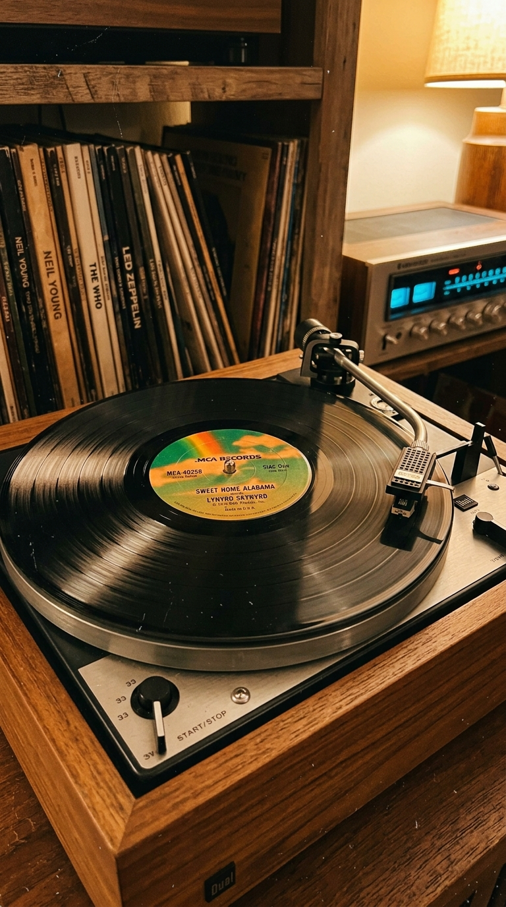
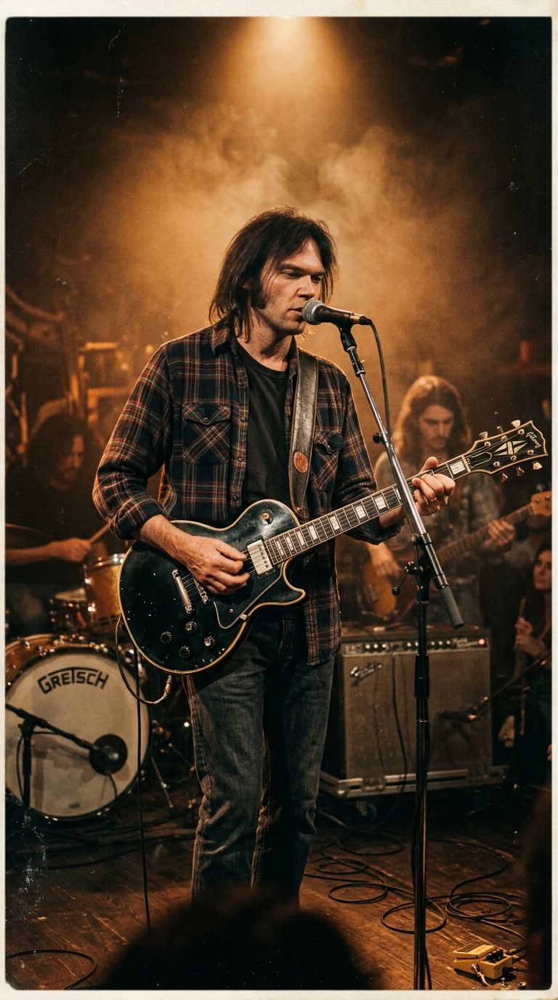
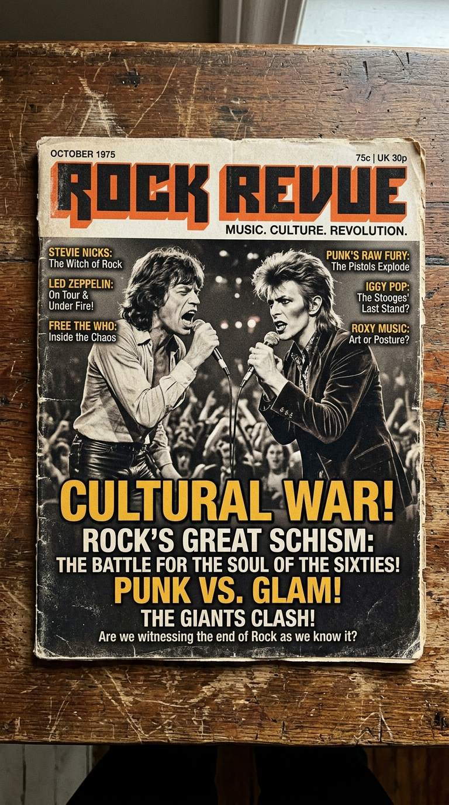
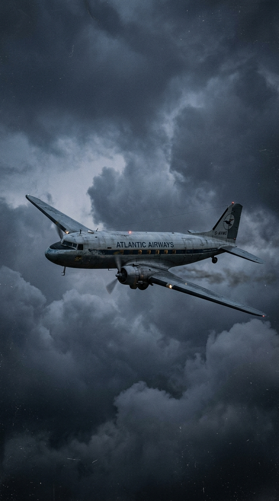
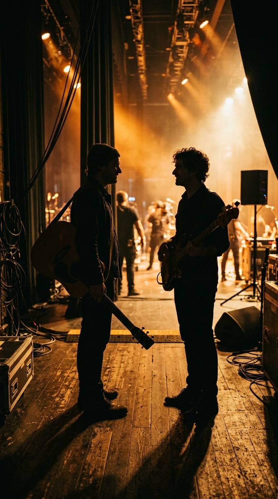

# La Falsa Trinchera del Rock Sureño: La Verdad Detrás de "Sweet Home Alabama" y el Pacto Secreto con Neil Young

> *"Ronnie y yo no éramos enemigos. Nos queríamos mucho. Escribieron esa canción porque creían que yo había sido demasiado duro y condescendiente con su tierra en 'Southern Man' y 'Alabama', y tenían toda la razón. 'Sweet Home Alabama' es una obra maestra insuperable. De hecho, yo mismo la toqué con orgullo."*  
> — **Neil Young**, autobiografía *Waging Heavy Peace* (2012).

---

## Prólogo: La Canción que Dividió a un País

En el verano de 1974, tres acordes crujientes de guitarra acústica y eléctrica —un Re mayor, un Do novena y un Sol mayor— irrumpieron en las radios de todo el continente americano como una descarga de artillería sureña. Sobre ese riff inmortal, un chasquido de baquetas marcaba el compás y una voz áspera, segura y cargada de tierra roja susurraba la consigna: *"Turn it up"* (Súbele el volumen).

Apenas unos compases después, el cantante Ronnie Van Zant pronunciaba los versos que incendiarían los quioscos de prensa, las emisoras y los bares de carretera desde Boston hasta Nueva Orleans:

> *"Well, I heard Mister Young sing about her,*  
> *Well, I heard ol' Neil put her down.*  
> *Well, I hope Neil Young will remember:*  
> *A Southern man don't need him around, anyhow!"*  
>  
> *(Bueno, escuché al señor Young cantar sobre ella,*  
> *escuché al viejo Neil despreciarla.*  
> *Bueno, espero que Neil Young recuerde:*  
> *¡que un hombre del sur no lo necesita cerca de todos modos!)*

*El lanzamiento de 1974: el vinilo de MCA Records que convirtió una conversación entre caballeros en la rivalidad más célebre del rock.*

Para los redactores de las revistas musicales de la época, aquello era oro puro. En una Norteamérica todavía traumatizada por las heridas de la Guerra de Vietnam, los disturbios por los derechos civiles y el asesinato de Martin Luther King, la prensa musical creyó encontrar la guerra cultural perfecta: de un lado, Neil Young, el bardo canadiense de la contracultura progresista, melancólico y pacifista; del otro, Lynyrd Skynyrd, una pandilla de muchachos duros de los pantanos de Jacksonville, Florida, ondeando la bandera confederada y defendiendo con furia el orgullo de su territorio.

Sin embargo, detrás del humo de aquella supuesta trinchera mediática, se ocultaba una de las historias más nobles, conmovedoras y paradójicas de la música popular: un pacto de respeto mutuo, una devoción artística compartida y una amistad truncada trágicamente por el destino a miles de pies de altura.

---

## Acto I: El Dardo del Canadiense en el Corazón de Dixie

Para entender el nacimiento de *"Sweet Home Alabama"*, es imprescindible retroceder a los primeros años de la década de 1970. En su aclamado álbum *After the Gold Rush* (1970), Neil Young había publicado *"Southern Man"*, una composición desgarradora y furiosa en la que arremetía contra la brutalidad del racismo histórico en el sur de los Estados Unidos, evocando cruces en llamas, látigos y el terror del Ku Klux Klan:

> *"Southern man, better keep your head,*  
> *Don't forget what your good book said.*  
> *Southern change gonna come at last,*  
> *Now your crosses are burning fast..."*

Dos años después, en su obra cumbre *Harvest* (1972), Young volvió a la carga con un tema titulado explícitamente *"Alabama"*, donde cantaba con tono admonitorio: *"Alabama, tienes el peso sobre tus hombros... te estás desmoronando, ¿qué estás haciendo, Alabama?"*.

*Neil Young en los primeros años setenta: sus canciones retrataron las heridas raciales del sur con un tono que muchos habitantes sintieron como una condena generalizada.*

Desde su hogar en Toronto y sus mansiones en California, las canciones de Young nacían de una genuina indignación moral ante la injusticia racial. Sin embargo, para los millones de familias sureñas trabajadoras que jamás habían tenido esclavos, que rechazaban la violencia racista y que luchaban por salir adelante en medio de la pobreza del cinturón bíblico, aquellas letras se sintieron como un latigazo injusto: una condena generalizada pronunciada desde la comodidad lejana por un forastero que jamás había compartido un pedazo de pan con la gente común de la región.

---

## Acto II: La Réplica de los Muchachos del Pantano

A más de tres mil kilómetros de distancia, en los suburbios obreros de Jacksonville, Florida, cinco jóvenes liderados por el cantante Ronnie Van Zant, los guitarristas Gary Rossington y Allen Collins, y el baterista Bob Burns ensayaban sin descanso en una cabaña de madera en medio del bosque conocida como el *"Hell House"* (La Casa del Infierno), soportando un calor sofocante sin aire acondicionado durante diez horas diarias.

Ronnie Van Zant era un fanático devoto y absoluto de la música de Neil Young. Se sabía de memoria las canciones de Buffalo Springfield y de Crosby, Stills, Nash & Young. Pero cuando escuchó *"Alabama"*, sintió que alguien debía poner las cosas en su lugar con franqueza y sin complejos.

*Ronnie Van Zant en 1974: orgullo obrero, voz callejera y una honestidad brutal que no aceptaba lecciones de superioridad moral.*

*"Pensábamos que Neil le estaba disparando a todos los patos para cazar solo a un par"*, declararía Van Zant a la revista *Rolling Stone* en una célebre entrevista conducida por un joven Cameron Crowe. *"Era como decir que todos en Nueva York son criminales o que todos en Alemania eran nazis. Amábamos a Neil Young, era uno de nuestros héroes musicales; pero sentimos que había juzgado a toda una tierra por los pecados de unos cuantos fanáticos"*.

A finales de 1973, con la incorporación del guitarrista californiano Ed King a la banda, la magia estalló en el Hell House. King despertó una mañana con un riff resonando en su cabeza. Corrió a buscar su Fender Stratocaster y comenzó a tocar la figura rítmica arpegiada mientras Gary Rossington respondía con un contrapunto punzante. Al escuchar la cadencia, Ronnie Van Zant se puso de pie en la cabaña, sonrió de oreja a oreja y comenzó a improvisar los versos de apertura.

---

## Acto III: El Boicot a Wallace y el Doble Fondo de la Letra

La canción fue grabada en los míticos **Muscle Shoals Sound Studios** de Sheffield, Alabama, bajo la supervisión del productor Al Kooper. Lejos de ser un panfleto reaccionario o supremacista, la letra de *"Sweet Home Alabama"* encierra una complejidad política y social que sus críticos más superficiales jamás se detuvieron a descifrar.

El fragmento más polémico de la canción hace referencia al gobernador ultraconservador y segregacionista de Alabama, George Wallace:

> *"In Birmingham they love the governor (boo! boo! boo!)*  
> *Now we all did what we could do.*  
> *Now Watergate does not bother me,*  
> *Does your conscience bother you? Tell the truth!"*

*Los tabloides y revistas alimentaron el mito del enfrentamiento, obviando que la banda abucheaba al gobernador segregacionista en la propia grabación.*

Mucha gente en el norte del país creyó erróneamente que la banda estaba respaldando al gobernador Wallace. La realidad grabada en la cinta matriz era exactamente la contraria: tras pronunciar la frase *"In Birmingham they love the governor"*, los propios coristas y Ronnie exclaman de forma explícita y contundente: **"¡Boo! ¡Boo! ¡Boo!"** (el universal sonido anglosajón del abucheo y el repudio).

*"La gente del norte no entendió el abucheo"*, aclaró Van Zant enfurecido en múltiples ocasiones. *"Estábamos abucheando a Wallace. Nosotros no votamos por él, no creíamos en sus políticas segregacionistas. La línea sobre Watergate era un dardo para la gente del norte: ustedes tienen al presidente Richard Nixon pudriendo la Casa Blanca en Washington; no nos miren por encima del hombro como si su propia casa estuviera limpia"*.

Además, la canción rendía un homenaje deslumbrante a *"The Swampers"*, la legendaria sección rítmica de músicos de sesión de Muscle Shoals que había grabado los grandes clásicos del soul afroamericano para Aretha Franklin, Wilson Pickett y Percy Sledge: *"Now Muscle Shoals has got the Swampers / And they've been known to pick a song or two / Lord, they get me off so much / They pick me up when I'm feeling blue"*. La canción celebraba la tierra, la gente, el río y la música negra y blanca entrelazadas; no el odio político.

---

## Acto IV: La Camiseta de "Tonight's the Night" y el Abrazo en Miami

¿Cómo reaccionó Neil Young cuando *"Sweet Home Alabama"* se convirtió en un himno planetario que cantaba su nombre en cada rincón del mundo? Con una generosidad y una nobleza artística que desarmó a todos los oportunistas de la prensa.

Lejos de molestarse, Neil Young se declaró un ferviente admirador de la canción desde la primera vez que la escuchó en la radio de su camioneta. En una muestra pública de autocrítica que honra a su grandeza, Young reconoció abiertamente en sus memorias:  
*"Mi canción 'Alabama' merecía con creces la respuesta que le dieron los muchachos de Lynyrd Skynyrd. Escuchándola hoy, me doy cuenta de que mis letras fueron arrogantes, sermoneadoras y poco fundamentadas. Eran fáciles de escribir, pero carecían de la sabiduría y el matiz necesarios. 'Sweet Home Alabama' es una gran canción de rock and roll; de hecho, he tocado su música yo mismo muchas veces porque tiene un espíritu irrepetible"*.

*La prueba del respeto: Ronnie Van Zant sobre el escenario vistiendo con orgullo la camiseta del álbum de Neil Young.*

La amistad entre Ronnie y Neil floreció en privado. Ambos artistas se intercambiaban mensajes y elogios continuos. Ronnie Van Zant comenzó a presentarse en giras multitudinarias y festivales vistiendo una camiseta negra con la portada del álbum más oscuro y visceral de Neil Young: ***Tonight's the Night***. En la portada del álbum de Lynyrd Skynyrd *Street Survivors* (1977), fotografiada semanas antes de su muerte, Ronnie aparece inmortalizado en el centro de la imagen luciendo esa misma camiseta de su supuesto "enemigo".

El 12 de noviembre de 1976, en un concierto benéfico celebrado en Miami, Neil Young sorprendió al público interpretando en directo un medley acústico que fusionaba *"A Man Needs a Maid"* con los acordes de *"Sweet Home Alabama"*, sonriendo ante el entusiasmo de la multitud. La complicidad llegó a tal punto que Neil Young compuso una canción extraordinaria, la conmovedora balada campestre ***"Powderfinger"***, y le envió la maqueta a Ronnie Van Zant para que Lynyrd Skynyrd la grabara en su siguiente trabajo discográfico.

---

## Acto V: El Vuelo del Convair 240 y la Canción que Nunca Oímos

En octubre de 1977, Lynyrd Skynyrd se encontraba en la cúspide absoluta de su carrera. Acababan de publicar *Street Survivors*, un disco magistral aclamado por la crítica, y llenaban pabellones con decenas de miles de personas cada noche. Ronnie Van Zant y Neil Young habían acordado reunirse en el estudio en los primeros meses de 1978 para grabar juntos y consumar sobre el vinilo la hermandad que ya compartían en sus corazones.

El destino, implacable y ciego, segó aquel sueño de cuajo la tarde del **jueves 20 de octubre de 1977**.

El avión chárter bimotor de la banda, un vetusto Convair CV-240 fabricado en 1948, se quedó sin combustible en pleno vuelo debido a una falla mecánica en los carburadores mientras volaba de Greenville, Carolina del Sur, hacia Baton Rouge, Luisiana. Los pilotos intentaron un aterrizaje de emergencia en un claro boscoso, pero el aparato se estrelló contra los árboles pantanosos de Gillsburg, Mississippi.

*20 de octubre de 1977: el cielo de Mississippi arrebató la vida a Ronnie Van Zant, congelando en el aire una colaboración histórica.*

En el impacto fallecieron instantáneamente Ronnie Van Zant, de solo veintinueve años; el joven guitarrista Steve Gaines; su hermana Cassie Gaines, corista de la banda; el road manager Dean Kilpatrick; y ambos pilotos. Dieciséis personas más sobrevivieron milagrosamente con heridas devastadoras.

La noticia sacudió al mundo de la música. Pocas semanas después, en un homenaje conmemorativo, Neil Young subió al escenario con el corazón destrozado e interpretó en solitario *"Sweet Home Alabama"*, despidiendo a su amigo con las lágrimas brillando bajo el ala de su sombrero. *"Powderfinger"*, la canción que Young había compuesto para que la voz de Ronnie la hiciera inmortal, tuvo que ser grabada finalmente por el propio Neil en su aclamado álbum *Rust Never Sleeps* (1979), dedicada en silencio a la memoria de los pájaros libres que ya no volverían a cantar.

---

## Epílogo: Los Puentes que Tiende el Arte

*"Sweet Home Alabama"* ha trascendido con creces las coordenadas geográficas de un estado o las etiquetas reduccionistas de un subgénero. Hoy, sus acordes resuenan en bodas, películas, estadios deportivos y celebraciones de todo el mundo, no como un himno de división, sino como una fiesta universal de pertenencia, dignidad y alegría de vivir.

*El legado de Lynyrd Skynyrd y Neil Young: la demostración de que la honestidad y el respeto mutuo valen más que cualquier bandera de rencor.*

La historia detrás de sus notas encierra una enseñanza luminosa para estos tiempos de polarización ciega y trincheras ideológicas automáticas: demuestra que dos artistas nacidos en mundos opuestos pueden discrepar con pasión y firmeza sobre sus respectivas tierras sin descender al fango del odio; que la franqueza entre caballeros es el camino más directo hacia la admiración sincera; y que cuando las guitarras suenan con el alma limpia, la música es capaz de construir puentes de amor donde los hombres mezquinos solo pretendían levantar muros.

---

### 📚 Fuentes y Archivo Documental

1. **Young, Neil** (2012). *Waging Heavy Peace: A Hippie Dream*. Blue Rider Press, Penguin Group, Nueva York.
2. **McDonough, Jimmy** (2002). *Shakey: Neil Young's Biography*. Anchor Books / Random House, Nueva York.
3. **Odom, Gene & Dorman, Frank** (2002). *Lynyrd Skynyrd: Remembering the Free Birds of Southern Rock*. Broadway Books, Nueva York.
4. **Crowe, Cameron** (1974). *"Lynyrd Skynyrd: The Sky's the Limit"*. Entrevista y perfil para *Rolling Stone Magazine*, número 172 (octubre de 1974).
5. **Ribowsky, Mark** (2015). *Whiskey Man: The Real Ronnie Van Zant and the Story of Lynyrd Skynyrd*. Chicago Review Press.
6. **Kooper, Al** (1998 / reed. 2008). *Backstage Passes & Backstabbing Bastards: Memoirs of a Rock 'n' Roll Survivor*. Backbeat Books, San Francisco.
7. **National Transportation Safety Board (NTSB)** (1978). *Aircraft Accident Report: L & J Company Convair CV-240, N55VM, Gillsburg, Mississippi, October 20, 1977*. NTSB-AAR-78-6, Washington D.C.
