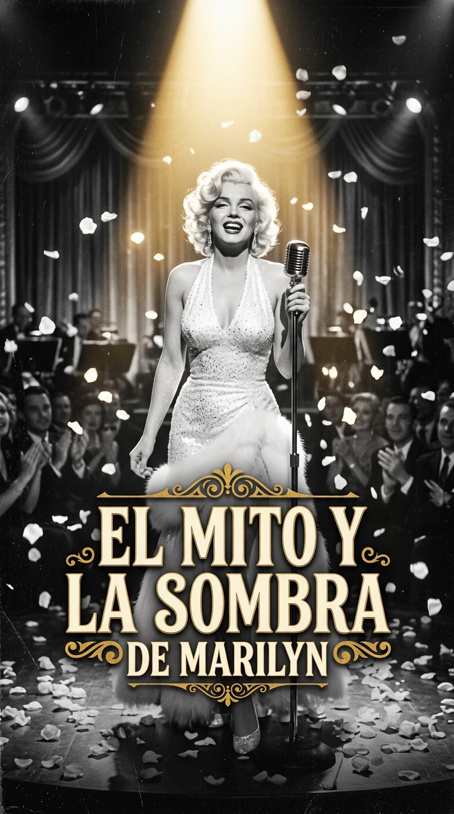
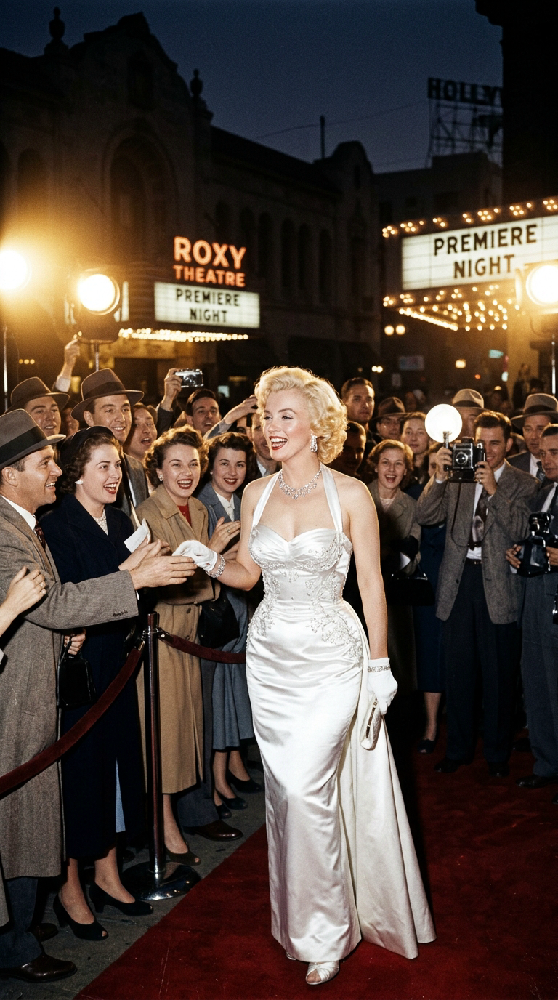
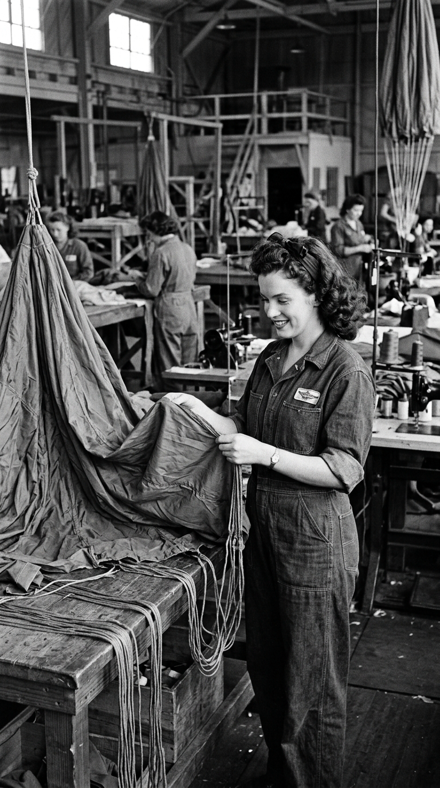
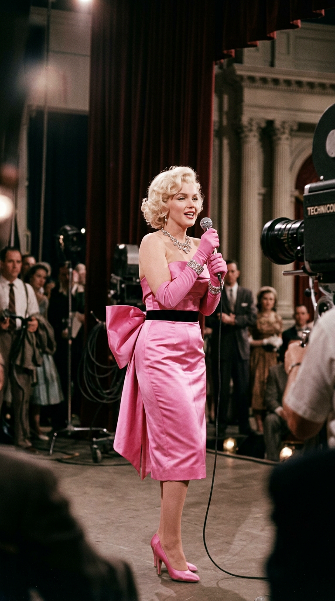
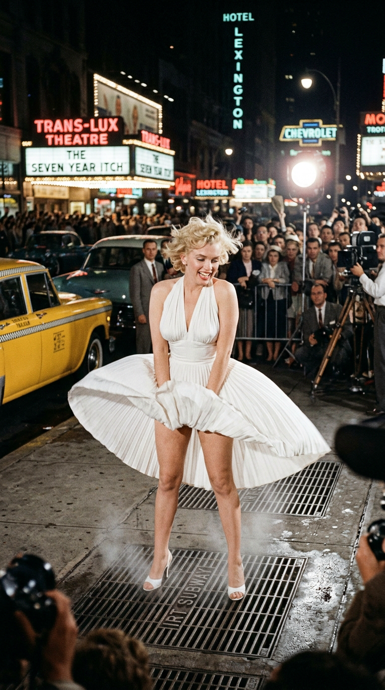
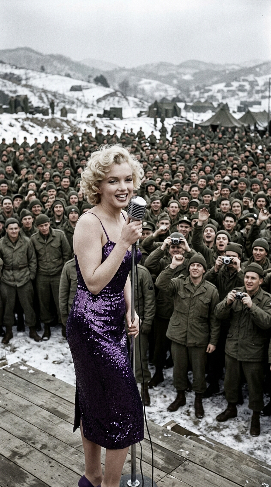
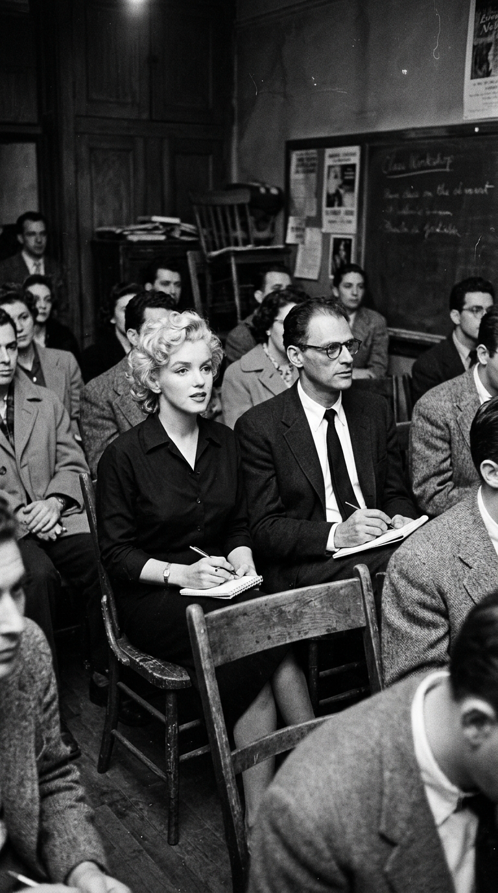
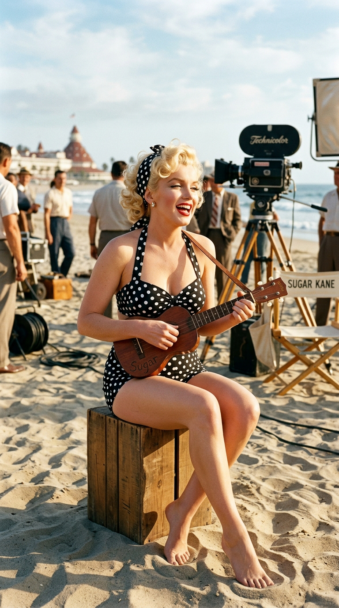
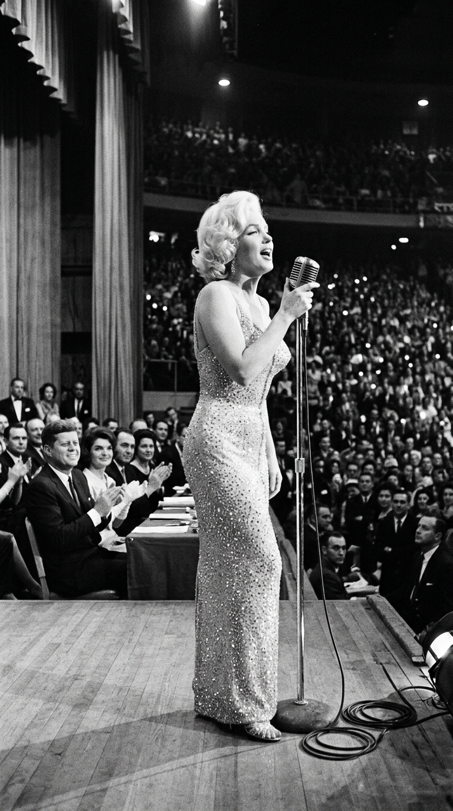
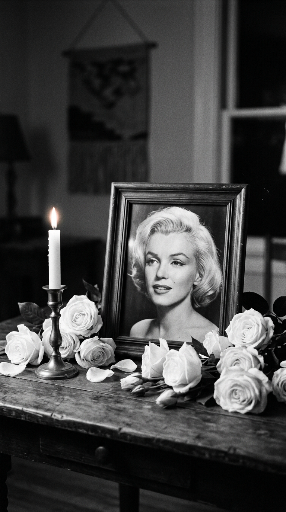

# 🕯️ El Mito y la Sombra de Marilyn: La Vela en el Viento de Norma Jeane
### *De la línea de montaje en una fábrica de guerra al icono más fulgurante y trágico del siglo XX: la desgarradora búsqueda de verdad, respeto y afecto de la mujer detrás del mito.*

---

**Por la redacción de Acordes Ocultos**  
*Tiempo de lectura estimado: 10 minutos*

---

### Prólogo: La deidad de celuloide y la niña en la intemperie

En toda la mitología cultural del siglo XX, ningún rostro ha encarnado con tanta intensidad la promesa de la felicidad, el magnetismo erótico y la fascinación universal como el de **Marilyn Monroe**. La cámara no simplemente la retrataba; parecía enamorarse de ella con un fervor devorador. Su cabello rubio platino, sus labios carmín húmedos en un suspiro entreabierto y su andar sinuoso sobre tacones de aguja definieron el canon de la feminidad de la posguerra y convirtieron a los grandes estudios de Hollywood en fábricas de sueños multimillonarias.

*Años 50: Marilyn Monroe deslumbra a la multitud en una premiere de Hollywood, envuelta en el fulgor de los focos y la adoración colectiva.*

Sin embargo, detrás de aquella fachada de diosa dorada diseñada por los magnates de la 20th Century Fox para alimentar las fantasías de una sociedad puritana y consumista, latía una mujer de una lucidez lacerante, atormentada por la orfandad infantil y hambrienta de una sola cosa que el dinero y el aplauso masivo jamás pudieron comprarle: ser respetada como una artista seria y ser amada por quien realmente era, lejos de la máscara teatral de «rubia tonta».

Cuando en 1973 Elton John y el letrista Bernie Taupin compusieron su inmortal elegía *«Candle in the Wind»*, capturaron en un solo verso la tragedia esencial de su destino: *«Goodbye Norma Jeane, though I never knew you at all / You had the grace to hold yourself / While those around you crawled...»*. Marilyn fue una llama incandescente que ardió con tanta belleza y fragilidad en medio de la tempestad de la industria que el viento terminó apagándola antes de tiempo. Esta es la crónica documental, humana y conmovedora de la mujer de carne y hueso que habitó la sombra del mito.

---

### Acto I: El milagro de la fábrica Radioplane y el entierro de Norma Jeane

Para desentrañar las heridas que moldearon el espíritu de Marilyn Monroe es imperativo retroceder hasta la infancia desamparada de **Norma Jeane Mortenson**, nacida el 1 de junio de 1926 en la sala de beneficencia del Hospital General de Los Ángeles. Hija de una madre con graves trastornos de esquizofrenia paranoide que pasó la mayor parte de su vida internada en instituciones psiquiátricas y de un padre ausente cuya identidad jamás conoció con certeza, Norma Jeane creció como una paria institucional: transitó por once hogares de acogida diferentes y un orfanato estatal, sufriendo episodios de negligencia y abusos sexuales que marcaron su alma con una tartamudez infantil y una necesidad patológica de aprobación externa.

A los dieciséis años, para evitar ser devuelta al hospicio de menores cuando sus tutores debían mudarse a otro estado, contrajo matrimonio con un vecino obrero de veintiún años, James Dougherty.

En el verano de 1944, mientras su joven marido servía en la marina mercante en el Pacífico durante la Segunda Guerra Mundial, Norma Jeane, de dieciocho años, trabajaba en turnos extenuantes de diez horas en la planta militar **Radioplane de Van Nuys**, en el valle de San Fernando. Con un overol azul de faena, el rostro cubierto de hollín y su melena natural castaña rizada, la muchacha inspeccionaba telas de paracaídas y aplicaba barniz ignífugo a los fuselajes de los primeros drones de prueba militares.

*1944: La joven de dieciocho años Norma Jeane Baker ensambla paracaídas militares en la fábrica Radioplane antes de ser descubierta por el lente de David Conover.*

Fue allí donde se cruzó en su camino el fotógrafo del ejército **David Conover**, quien recorría las fábricas de suministros bélicos por orden del capitán Ronald Reagan para retratar a mujeres trabajadoras para la revista moral de las tropas, *Yank*. Al enfocar a Norma Jeane a través del visor de su cámara Graflex, Conover bajó el lente anonadado: la luz del sol que entraba por los ventanales de la nave industrial parecía emanar directamente de la piel de aquella muchacha desconocida.

Conover le tomó una serie de instantáneas y le sugirió que se presentara en la agencia de modelos Blue Book en Hollywood. Guiada por una ambición de supervivencia feroz, Norma Jeane se tiñó el cabello de rubio miel, tomó clases de dicción para superar su tartamudeo y comenzó a protagonizar decenas de portadas de revistas de pin-up.

En 1946, el cazatalentos Ben Lyon la llevó a los despachos de la **20th Century Fox**. Allí, el poderoso ejecutivo Darryl F. Zanuck le ofreció su primer contrato cinematográfico con una condición innegociable: debía enterrar para siempre a Norma Jeane Dougherty. Lyon sugirió el nombre de pila «Marilyn» en homenaje a la actriz de Broadway Marilyn Miller, y ella eligió el apellido de soltera de su abuela materna: «Monroe». Había nacido el mayor artefacto de seducción del siglo XX, pero la niña huérfana jamás abandonaría su pecho.

---

### Acto II: El estallido de la diosa y la fractura en la rejilla del metro

Tras varios años de papeles menores donde demostró un magnetismo innato que eclipsaba a las protagonistas en filmes como *The Asphalt Jungle* (de John Huston) y *All About Eve* (de Joseph L. Mankiewicz), el año **1953** detonó el cataclismo comercial de Marilyn Monroe.

En cuestión de doce meses, protagonizó tres clásicos absolutos de la cinematografía universal: el perturbador film noir *Niagara*, la hilarante sátira *How to Marry a Millionaire* y la cumbre de la comedia musical, **Gentlemen Prefer Blondes** (*Los caballeros las prefieren rubias*), dirigida por Howard Hawks.

En esta última cinta, Marilyn inmortalizó el número musical más imitado y parodiado de la historia del cine: ataviada con un icónico vestido palabra de honor de satén rosa fucsia con un lazo gigante a la espalda y guantes largos hasta el codo, rodeada por decenas de pretendientes en frac, interpretó con una ironía deliciosa *"Diamonds Are a Girl's Best Friend"*.

*1953: Marilyn Monroe en su legendario vestido de satén rosa cantando 'Diamonds Are a Girl's Best Friend', coronada como el mayor icono de Hollywood.*

En diciembre de ese mismo año, el joven editor Hugh Hefner publicó el número inaugural de la revista **Playboy**, utilizando sin el consentimiento directo de la actriz una fotografía de desnudo artístico que Marilyn se había tomado en 1949, cuando no tenía dinero para pagar el alquiler de su automóvil. El ejemplar vendió más de cincuenta mil copias en pocos días, catapultando a Marilyn a la categoría de mito erótico planetario.

Buscando un puerto seguro en su turbulenta vida privada, Marilyn contrajo matrimonio en enero de 1954 con el héroe nacional del béisbol norteamericano, el legendario bateador de los New York Yankees, **Joe DiMaggio**. DiMaggio, un ítalo-americano chapado a la antigua educado en los valores patriarcales de San Francisco, soñaba con que Marilyn abandonara el cine para convertirse en un ama de casa convencional. La colisión entre dos universos tan opuestos era inevitable.

La fractura definitiva estalló en la madrugada del **15 de septiembre de 1954**, en la esquina de la Calle 52 con Lexington Avenue en Manhattan, durante el rodaje de la película de Billy Wilder **The Seven Year Itch** (*La tentación vive arriba*).

*Septiembre de 1954: La corriente de aire del metro levanta el vestido blanco plisado de Marilyn en una de las imágenes más célebres de la historia del cine.*

Ante más de dos mil espectadores y decenas de fotógrafos de prensa convocados por la Fox para generar publicidad, Marilyn se paró sobre una rejilla de ventilación del metro subterráneo con su vaporoso vestido blanco plisado de crepé de seda creado por el diseñador William Travilla. Cada vez que pasaba un convoy bajo sus pies, una ráfaga de aire cálido elevaba la falda por encima de sus muslos, mientras Wilder repetía la toma una y otra vez ante los vítores de la multitud.

Entre las sombras del set, Joe DiMaggio contemplaba la escena mudo de ira y humillación. Aquella misma noche, en el Hotel St. Regis, se desató una violenta discusión conyugal. Nueve meses después de haber pasado por el altar, un tribunal de Santa Mónica concedía a Marilyn el divorcio por «crueldad mental».

---

### Acto III: El milagro en la nieve de Corea y la rebelión de una actriz

Apenas un mes después de casarse con DiMaggio, en febrero de 1954, Marilyn había protagonizado el que ella misma definiría como el momento más puro y feliz de toda su existencia.

Aprovechando su paso por Tokio durante su luna de miel y tras recibir una invitación de las Fuerzas Armadas estadounidenses, Marilyn desvió su agenda y voló en helicóptero militar hacia las gélidas colinas de **Corea del Sur**, donde más de cien mil soldados de las tropas aliadas vigilaban la tensa frontera tras el armisticio de la Guerra de Corea.

A lo largo de cuatro jornadas épicas, desafiando temperaturas de varios grados bajo cero y vestida únicamente con un ceñido vestido de cóctel de tirantes de satén púrpura cuajado de lentejuelas, Marilyn ofreció diez recitales sobre tablones de madera en mitad de la nieve ante más de **cien mil soldados uniformados** que aullaban enfervorecidos de devoción patriótica.

*Febrero de 1954: Desafiando el frío glacial bajo la nieve de Corea, Marilyn canta en tirantes ante miles de soldados en el momento más luminoso de su vida.*

Al descender del escenario, con los labios morados por el frío pero con los ojos chispeantes de lágrimas, Marilyn le comentó a su acompañante:
> —*«Nunca en toda mi vida me había sentido tan querida. Podía sentir el calor humano subiendo desde la nieve como una ola inmensa. Por primera vez sentí que yo le importaba a alguien de verdad»*.

De regreso a Los Ángeles, la actriz tomó una decisión de una audacia sindical sin precedentes en una industria dominada por hombres. Harta de que los ejecutivos de la Fox le asignaran contratos leoninos (ganaba una fracción ínfima de lo que cobraban sus coprotagonistas masculinos) y de que la encasillaran en comedias bobas, Marilyn rompió su contrato unilateralmente, hizo las maletas y se mudó a Nueva York.

En 1955, fundó su propia compañía independiente, **Marilyn Monroe Productions**, y se inscribió como una alumna más en el prestigioso **Actors Studio** de Manhattan bajo la dirección del gurú de la interpretación **Lee Strasberg**. Allí, sentada en el suelo en vaqueros gastados y sin maquillaje junto a figuras como Marlon Brando y Paul Newman, Marilyn se sometió al rigor del «Método», explorando sus traumas infantiles para dar a sus personajes una verdad psicológica sobrecogedora.

En junio de 1956, sorprendió al mundo al contraer matrimonio con el más célebre dramaturgo de la nación, el intelectual y premio Pulitzer **Arthur Miller** (*Muerte de un viajante*, *Las brujas de Salem*).

*1956: Marilyn sentada en una clase del Actors Studio de Nueva York junto a su esposo, el dramaturgo Arthur Miller, buscando ser respetada como actriz dramática.*

Para Marilyn, Miller representaba la validación de su inteligencia y el acceso a un mundo de respeto cultural; para Miller, Marilyn era una fuerza de la naturaleza cuya vulnerabilidad y nobleza moral lo fascinaban. Sin embargo, la constante lucha de la actriz contra el insomnio crónico, el dolor de varios abortos espontáneos derivados de una dolorosa endometriosis y su creciente dependencia a los barbitúricos comenzaron a resquebrajar la convivencia.

---

### Acto IV: La gloria de «Some Like It Hot» y el eco en el Madison Square Garden

A pesar de sus tormentas íntimas, la genialidad cómica de Marilyn Monroe alcanzó su cenit absoluto en 1959 con la inmortal obra maestra de Billy Wilder: **Some Like It Hot** (*Con faldas y a lo loco*).

Encarnando a *Sugar Kane Kowalczyk*, una vulnerable y entrañable cantante de una orquesta femenina de jazz en la Florida de los años veinte que busca consuelo en el ukelele y en el alcohol barato para no enamorarse de «hombres con saxofón», Marilyn ofreció una clase magistral de ritmo cómico, timing y ternura.

*1959: Marilyn Monroe canta y toca el ukelele en la playa interpretando a Sugar Kane en la obra maestra cómica Some Like It Hot.*

A pesar de un rodaje extenuante donde requería decenas de tomas para recordar sus líneas debido a la ansiedad y el abuso de sedantes, la pantalla irradiaba una magia incombustible. Su interpretación le valió el **Globo de Oro a la Mejor Actriz de Comedia**, coronándola ante la crítica más estricta como una comediante de primer orden mundial.

Pero el descenso a la penumbra se aceleró tras el rodaje de *The Misfits* (*Vidas rebeldes*, 1961), un drama existencialista escrito para ella por Arthur Miller y dirigido por John Huston, que marcaría el final de su matrimonio con el escritor y el último filme completado por Clark Gable antes de morir.

El 19 de mayo de 1962, Marilyn protagonizó su última gran aparición pública, un evento que quedaría grabado en la memoria política y cultural de los Estados Unidos. Se celebraba en el abarrotado **Madison Square Garden** de Nueva York una gala multitudinaria de recaudación de fondos para el cuadragésimo quinto cumpleaños del presidente **John F. Kennedy**.

Hacia el final de la noche, el actor Peter Lawford presentó a la estrella. Marilyn subió al escenario despojándose de un abrigo de armiño blanco para revelar un vestido que desafiaba las leyes de la censura: una creación de gasa de seda color carne transparente confeccionada a medida por el diseñador de alta costura Jean Louis, cuajada con más de **dos mil quinientos cristales cosidos a mano**. El vestido era tan ceñido que tuvieron que cosérselo directamente sobre su cuerpo desnudo minutos antes de entrar en escena.

*19 de mayo de 1962: En el Madison Square Garden, Marilyn entona su seductor e histórico 'Happy Birthday' ante el presidente John F. Kennedy.*

Con la luz de un solo foco iluminando su figura en la inmensidad del estadio y un leve jadeo de timidez en la garganta, Marilyn entonó su ya legendario:
> —*«Happy Birthday to you... / Happy Birthday to you... / Happy Birthday, Mr. President... / Happy Birthday to you»*.

El auditorio rugió de fascinación ante la audacia del momento. Pero detrás de aquel derroche de seducción y brillo palaciego, la vida de Marilyn se desmoronaba en la soledad más absoluta.

---

### Epílogo: El suspiro en Brentwood y la rosa que nunca marchita

En el verano de 1962, Marilyn había comprado su primera y única casa propia: una modesta hacienda de estilo español situada en un callejón sin salida del 12305 de Fifth Helena Drive, en el barrio de Brentwood (Los Ángeles). Sobre los azulejos de la entrada colocó una placa de barro cocido con un lema en latín que resumía su búsqueda de paz: *«Cursum Perficio»* (*«Mi viaje ha terminado»*).

En la madrugada del domingo **5 de agosto de 1962**, su ama de llaves, Eunice Murray, notó una luz encendida bajo la puerta cerrada del dormitorio principal de la actriz. Al no obtener respuesta a sus llamados, alertó al psiquiatra personal de Marilyn, el doctor Ralph Greenson, quien forzó una ventana de cristal y accedió a la habitación.

Marilyn Monroe yacía boca abajo en su cama, completamente desnuda, con el auricular del teléfono todavía aferrado con fuerza en su mano izquierda, rodeada de frascos vacíos de medicamentos.

El dictamen oficial de la Oficina Forense del Condado de Los Ángeles certificó que la actriz había fallecido a causa de una «intoxicación aguda por sobredosis masiva de barbitúricos» (hidrato de cloral y Nembutal), calificando el deceso como un «probable suicidio». Tenía exactamente treinta y seis años de edad.

*Un retrato en blanco y negro, rosas rojas y la llama trémula de un cirio: el homenaje imperecedero a la estrella que ardió como una vela en el viento.*

Al enterarse de la tragedia, su exmarido **Joe DiMaggio** acudió de inmediato a la morgue de Los Ángeles para reclamar el cuerpo. Devastado por la culpa y el dolor, DiMaggio se encargó de organizar un funeral íntimo y austero en la capilla del Westwood Village Memorial Park, prohibiendo la entrada a todos los directivos de los estudios de Hollywood y celebridades de la farándula, a quienes acusaba abiertamente de haber destruido la vida de la actriz.

Durante los siguientes **veinte años**, hasta el día de su propia muerte en 1999, DiMaggio cumplió una promesa sagrada: encargó a una floristería local que enviara tres veces por semana media docena de rosas rojas frescas a la pequeña cripta de mármol donde descansaban los restos de Marilyn. Jamás volvió a casarse ni concedió una sola entrevista comercial sobre su relación con ella.

Sesenta años después de aquella fatídica noche de agosto, la sombra de Marilyn Monroe sigue proyectándose sobre la cultura contemporánea con la fuerza de un arquetipo eterno. Su vida fue un campo de batalla entre la deslumbrante ficción que el mundo le exigía encarnar y la fragilidad inocente de Norma Jeane. Como bien cantó Elton John, su vela se apagó mucho antes de que su leyenda pudiera siquiera comenzar a extinguirse; y mientras la belleza, la melancolía y el cine existan sobre la faz de la tierra, la luz trémula de Marilyn seguirá alumbrando el corazón de todos los solitarios del mundo.

---

### 📚 Fuentes y Archivo Documental

* **Spoto, Donald**: *Marilyn Monroe: The Biography* (HarperCollins, 1993). La investigación biográfica y hemerográfica más rigurosa sobre los orígenes de Norma Jeane, el descubrimiento de David Conover en la planta Radioplane y los contratos de 20th Century Fox.
* **Summers, Anthony**: *Goddess: The Secret Lives of Marilyn Monroe* (Golancz, 1985). Investigación periodística exhaustiva con más de seiscientas entrevistas a testigos directos, forenses y allegados a la casa de Brentwood.
* **Mailer, Norman**: *Marilyn: A Biography* (Grosset & Dunlap, 1973). Ensayo literario y cultural fundamental sobre la creación del mito de Marilyn y la paradoja psicológica de su orfandad.
* **Miller, Arthur**: *Timebends: A Life* (Grove Press, 1987). Memorias del dramaturgo, narrando la convivencia conyugal con la actriz, las sesiones en el Actors Studio de Nueva York y el rodaje de *The Misfits*.
* **Wilder, Billy**: *Conversations with Wilder* (compiladas por Cameron Crowe, Knopf, 1999). Testimonios de primera mano del director sobre el rodaje de *The Seven Year Itch* en Lexington Avenue y la genialidad cómica de Marilyn en *Some Like It Hot*.
* **Oficina Forense del Condado de Los Ángeles**: Informe de autopsia oficial del Dr. Thomas Noguchi (Caso N.º 81128, agosto de 1962), dictaminando envenenamiento agudo por barbitúricos.
* **John, Elton & Taupin, Bernie**: Notas de composición de *«Candle in the Wind»* para el álbum *Goodbye Yellow Brick Road* (DJM Records, 1973).
