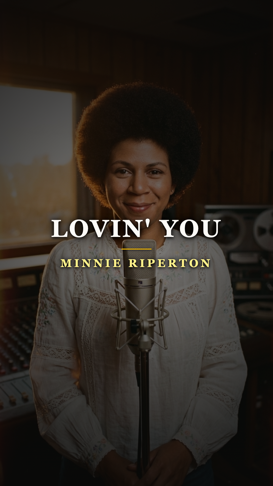
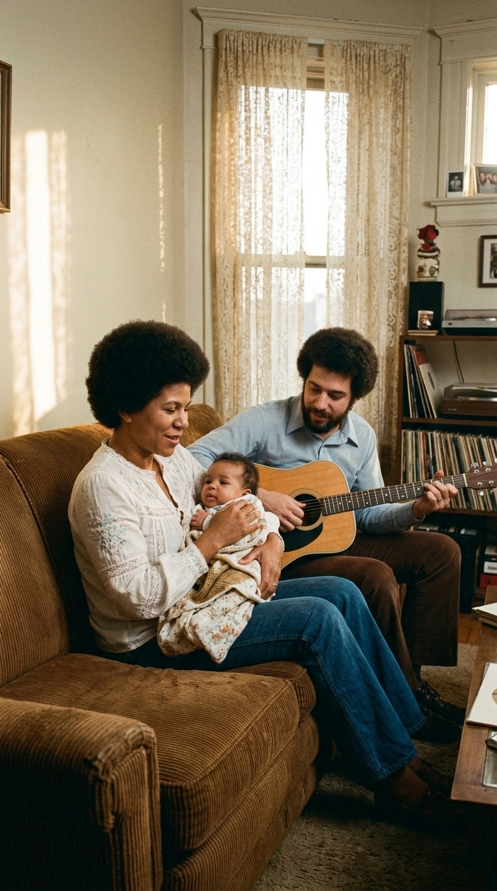
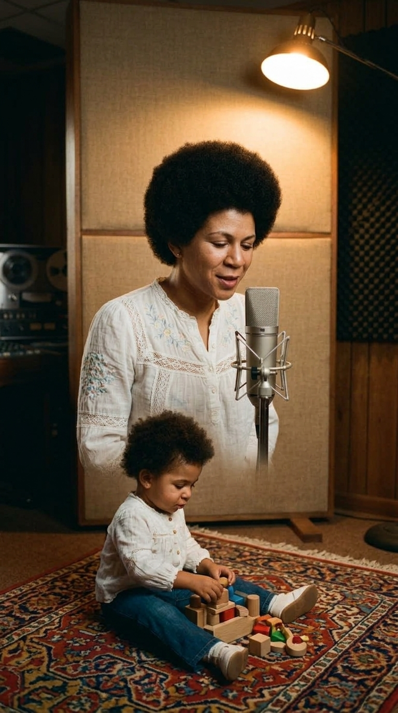
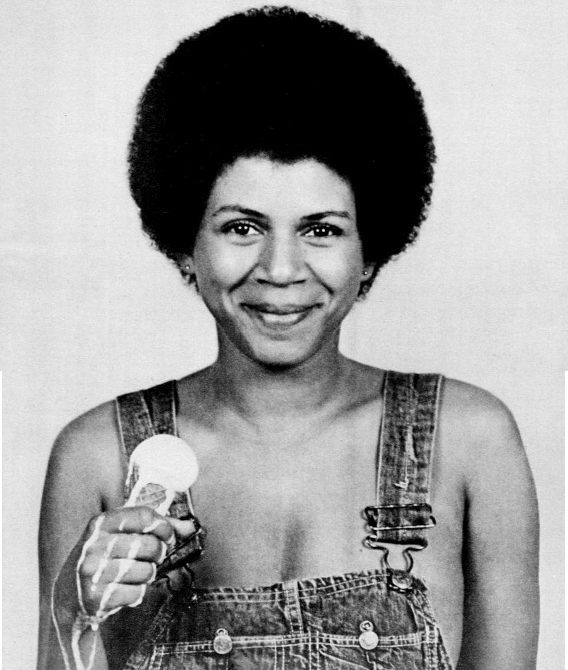
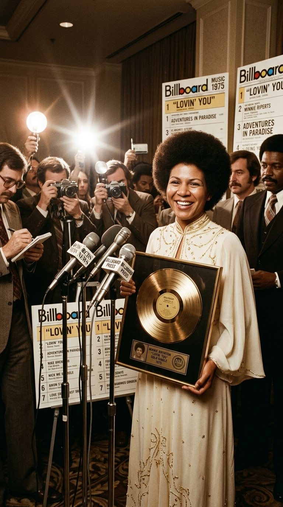
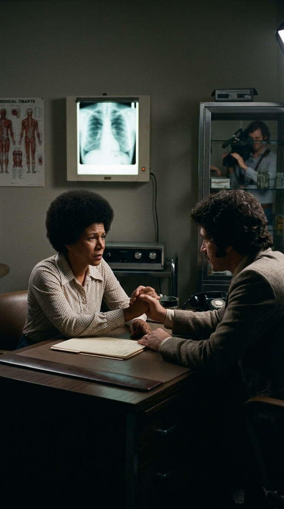
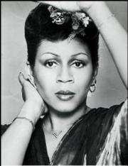
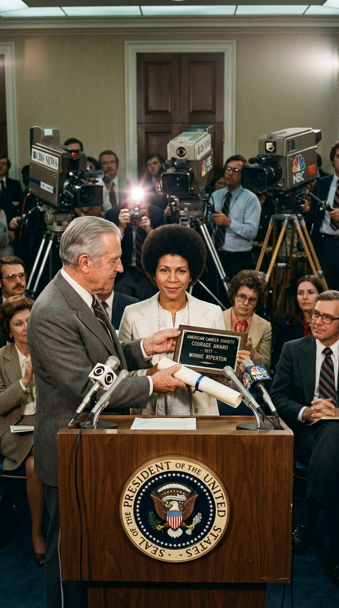
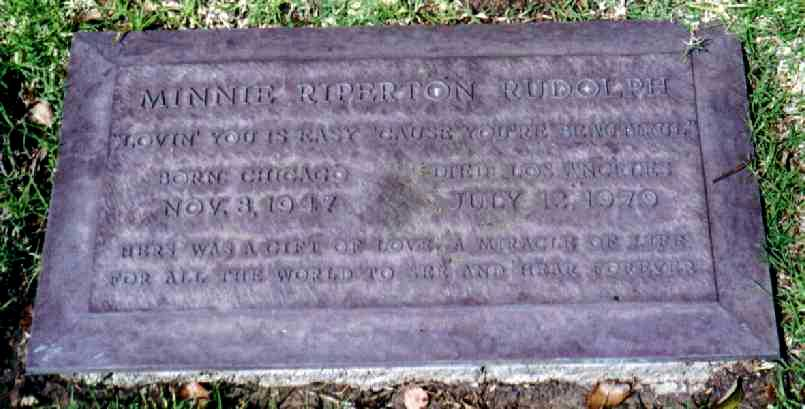

# 🕊️ El Susurro Inmortal de una Madre: La Verdadera Historia de «Lovin' You»
### *Cómo una melodía improvisada para arrullar a una niña pequeña en Chicago conmovió al mundo, el pacto clandestino de Stevie Wonder bajo el seudónimo «El Toro Negro» y el trágico adiós de Minnie Riperton a los treinta y un años.*

---

**Por la redacción de Acordes Ocultos**  
*Tiempo de lectura estimado: 8 minutos*

---

### Prólogo: El trino celestial que paralizó la radio en 1975

En la primavera de 1975, las emisoras de radio de medio mundo se vieron invadidas por un sonido que desafiaba toda convención de la música popular. En plena efervescencia de la música disco y las grandes superproducciones orquestales, una canción despojada de artificios irrumpió con la pureza de un milagro acústico: una guitarra de madera acariciada con suavidad, el dulce gorgoteo de unos pájaros al amanecer, las notas cálidas de un piano eléctrico y una voz femenina que no parecía pertenecer a este mundo.

Hacia el final del tema, la intérprete ascendía sin esfuerzo aparente hacia notas estratosféricas que rozaban el límite del oído humano, alcanzando el legendario registro de silbido (*whistle register*) con la limpidez cristalina de un ruiseñor. La canción se titulaba **«Lovin' You»** y convirtió de la noche a la mañana a su autora, **Minnie Riperton**, en una estrella de escala planetaria.

*1975: Minnie Riperton frente al micrófono, cuya voz de cinco octavas y pureza tímbrica asombraron al mundo entero.*

El público asumió de inmediato que se trataba de una declaración de amor apasionada, una oda romántica compuesta para un amante ideal. Pocos sospechaban que aquella joya musical no había sido concebida para la industria del disco, ni para las listas de ventas, ni para los focos de los escenarios. Había nacido cuatro años antes, entre el olor a café y los pañales de un modesto apartamento en Chicago, como una nana protectora destinada a arrullar a una niña pequeña.

---

### Acto I: Chicago, 1971 y el arrullo en el apartamento

A comienzos de la década de 1970, Minnie Riperton no gozaba de la gloria comercial. Tras haber sido una de las voces de soporte indispensables del legendario sello **Chess Records** —donde cantó para luminarias como Etta James, Muddy Waters o Fontella Bass— y tras liderar el vanguardista colectivo de rock psicodélico y soul **Rotary Connection**, su primer álbum en solitario, *Come to My Garden* (1970), con arreglos del maestro Charles Stepney, había sido un rotundo fracaso en ventas pese a su deslumbrante calidad artística.

Desilusionada con los manejos turbios de las discográficas, Minnie contrajo matrimonio con el joven guitarrista y compositor **Richard Rudolph**. En su apartamento de Chicago, la pareja intentaba conciliar la precariedad económica de los músicos con la llegada de sus dos hijos: Marc y la pequeña **Maya Rudolph**, nacida en el verano de 1972.

*Chicago, 1971: Minnie Riperton junto a su esposo Richard Rudolph en la intimidad de su hogar, donde la música nacía del amor cotidiano.*

Maya era una criatura inquieta que a menudo se resistía a conciliar el sueño. Una tarde cualquiera, mientras Minnie cocinaba y atendía las labores del hogar, Richard tomó su guitarra acústica y comenzó a desgranar una secuencia de acordes circular, dulce y relajante. Minnie se acercó, cargó a su bebé entre los brazos y, sobre la melodía de su marido, comenzó a tararear versos improvisados, imitando el silbido juguetón de las aves para hacer reír a su hija.

> *«La compusimos en dos minutos para entretener a Maya mientras Minnie estaba en la cocina»*, recordaría años más tarde Richard Rudolph. *«Era una melodía puramente familiar. No tenía pretensión comercial alguna. Era nuestro juego íntimo para hacerla sonreír y dormirla en calma»*.

Aquella pequeña nana doméstica quedó grabada en una modesta cinta de casete y guardada en un cajón, como un tesoro familiar que nadie fuera de esas cuatro paredes debía escuchar jamás.

---

### Acto II: El secreto de «El Toro Negro» y el rescate de Stevie Wonder

Cansada del bullicio urbano y de la indiferencia de la industria musical, la familia se trasladó a Gainesville, Florida, donde Minnie decidió retirarse prácticamente de la música para dedicarse por completo a la crianza de sus hijos. Sin embargo, su prodigioso talento no había pasado desapercibido para el genio más influyente de la era: **Stevie Wonder**.

Fascinado por el disco *Come to My Garden*, Stevie Wonder se obsesionó con localizar a Minnie. Cuando por fin logró dar con ella en Florida a finales de 1973, le propuso una oferta irrechazable: unirse a su coro estelar, **Wonderlove**, y permitirle producir su nuevo álbum para relanzar su carrera por todo lo alto.

*El prodigio vocal: Minnie dominaba un registro de más de cinco octavas, capaz de fundirse con el canto de la naturaleza.*

Minnie firmó un contrato discográfico con **Epic Records**, pero surgió un obstáculo contractual mayúsculo: Berry Gordy y el sello Motown tenían atado a Stevie Wonder con una exclusividad implacable que le prohibía de forma tajante producir discos para compañías rivales.

Lejos de amedrentarse, Wonder ideó una maniobra clandestina. Decidió producir el álbum íntegramente bajo un seudónimo enigmático: **«El Toro Negro»**, un homenaje directo a su signo zodiacal, Tauro.

*1974: Stevie Wonder («El Toro Negro») a los teclados en Record Plant, orquestando en la clandestinidad el renacimiento de Minnie.*

Cuando revisaban el material para el álbum *Perfect Angel* en los estudios **Record Plant** de Los Ángeles, faltaba una canción corta para completar el minutaje del disco. Richard Rudolph recordó la vieja cinta casera grabada en Chicago. Tímidamente, tomó la guitarra y le tocó la melodía de cuna a Stevie. El genio de Detroit quedó paralizado:

> *«Stevie se quedó en silencio frente a nosotros y dijo: 'No toquen nada. No le añadan batería, no le pongan bajo. Esa canción es perfecta exactamente así. Solo necesitamos tu guitarra acústica, Minnie cantando y yo al piano eléctrico'»*.

---

### Acto III: La sesión de Record Plant y el susurro en la cinta (1974)

La grabación de «Lovin' You» en 1974 fue una de las sesiones más íntimas y mágicas en la historia de la música contemporánea. Para reproducir la atmósfera campestre y serena de Gainesville, los ingenieros de sonido introdujeron en la mezcla cintas con cantos reales de pájaros y sutiles efectos sintetizados.

En la sala de grabación, Richard acariciaba las cuerdas de su guitarra acústica mientras Stevie Wonder delineaba acordes etéreos en su piano Fender Rhodes. Frente al micrófono Neumann U87, Minnie cantó en una sola toma deslumbrante, dejando que su voz flotara con una naturalidad conmovedora.

*Estudios Record Plant, 1974: Minnie Riperton ante el micrófono durante la toma definitiva, mientras la pequeña Maya presenciaba la sesión.*

En la alfombra del estudio, jugando silenciosamente a pocos metros de su madre, se encontraba la pequeña Maya, que entonces tenía dos años. En el último minuto de la canción, cuando la música comenzaba a desvanecerse en un lento fundido (*fade out*), Minnie apartó un instante la vista de la partitura, miró con ternura infinita a su hija a los ojos y comenzó a repetir en un susurro amoroso fuera de compás:

> *«Maya... Maya... Maya... Maya... Maya...»*

Ese susurro, conservado para siempre en la versión del álbum, era la firma indeleble de una madre que le dedicaba cada nota al ser más amado de su vida.

*Archivo documental de 1974: La imagen icónica de Minnie Riperton con su blusa campesina y su sonrisa luminosa durante la era de «Perfect Angel».*

---

### Acto IV: La cima de Billboard y la sombra del destino (1975–1976)

Inicialmente, los ejecutivos de Epic Records se negaron a publicar «Lovin' You» como sencillo, alegando que una balada sin percusión ni ritmo bailable jamás triunfaría en las emisoras de radio. No obstante, las estaciones de FM comenzaron a emitirla por iniciativa propia ante el aluvión de peticiones de los oyentes.

El éxito fue imparable. El **5 de abril de 1975**, «Lovin' You» escaló hasta el **puesto número uno del Billboard Hot 100** en los Estados Unidos, alcanzó el número dos en el Reino Unido y se coronó en las listas de más de una veintena de países. El álbum *Perfect Angel* se convirtió en disco de oro y la sonrisa radiante de Minnie copó las portadas de las principales revistas culturales.

*Primavera de 1975: Minnie Riperton en la cima del éxito discográfico mundial, conquistando el número uno indiscutible de Billboard.*

Sin embargo, el destino preparaba un golpe demoledor. En los primeros meses de 1976, en la cúspide de su juventud y su carrera, Minnie notó un bulto extraño en el pecho. Tras someterse a exámenes de urgencia en el hospital **Cedars-Sinai** de Los Ángeles, el veredicto médico fue fulminante: padecía un carcinoma de mama en fase avanzada que ya había hecho metástasis en su sistema linfático.

A pesar de someterse de inmediato a una mastectomía radical modificada, los oncólogos fueron lapidarios: le diagnosticaron una esperanza de vida de apenas seis meses. Tenía tan solo veintiocho años.

*1976: La intimidad del dolor. Minnie Riperton enfrentando el diagnóstico terminal con una dignidad y valentía conmovedoras.*

---

### Acto V: Coraje en la Casa Blanca y despedida a los treinta y un años (1976–1979)

En una época en la que la palabra «cáncer» se pronunciaba en susurros y representaba un estigma social vergonzante que las celebridades ocultaban a toda costa, Minnie Riperton tomó una decisión revolucionaria: no esconderse.

Apareció en el célebre programa de entrevistas de Mike Douglas y reveló públicamente que había sufrido una mastectomía, exhortando a las mujeres de todo el mundo a autoexplorarse y desterrar el miedo. Su franqueza quebró décadas de oscurantismo. En 1977, la **American Cancer Society** la nombró Presidenta Nacional de Educación.

*1977: Minnie Riperton, convertida en símbolo nacional de concienciación y esperanza en la lucha contra el cáncer de mama.*

En 1978, en una emotiva ceremonia celebrada en el Despacho Oval de la Casa Blanca, el Presidente de los Estados Unidos, **Jimmy Carter**, le hizo entrega del prestigioso **Courage Award** (Premio al Coraje) por su incansable labor humanitaria.

*Casa Blanca, 1978: El Presidente Jimmy Carter entrega a Minnie Riperton el Courage Award de la American Cancer Society por su valentía civil.*

A pesar de que el cáncer continuó extendiéndose implacablemente y le provocó un linfedema severo que paralizó por completo su brazo derecho, Minnie se negó a soltar el micrófono. Con el brazo oculto bajo elegantes chalecos o apoyado en su regazo, continuó ofreciendo conciertos y grabó su último álbum homónimo, *Minnie* (1979).

En la mañana del **12 de julio de 1979**, en una habitación del Cedars-Sinai Medical Center de Los Ángeles, Minnie Riperton cerró sus ojos para siempre recostada en los brazos de su esposo Richard Rudolph. Tenía apenas treinta y un años.

---

### Epílogo: El epitafio de Westwood y la niña que aprendió a reír

Minnie fue sepultada en el cementerio **Westwood Village Memorial Park** de Los Ángeles. Sobre su losa de bronce pulido no se grabaron sus premios ni sus cifras de ventas; se cinceló únicamente el verso que compuso para su familia en aquella cocina de Chicago:

> *«Lovin' you is easy 'cause you're beautiful»*  
> *(Amarte es fácil porque eres hermosa)*

*Cementerio Westwood Village de Los Ángeles: La lápida de Minnie Riperton con el verso inmortal de su canción de cuna.*

Aquella niña de dos años que jugaba en la alfombra del estudio mientras su madre le susurraba su nombre creció. **Maya Rudolph** se convirtió con los años en una de las actrices y comediantes más admiradas de su generación, estrella histórica de *Saturday Night Live* y ganadora de múltiples premios Emmy.

*El susurro inmortal: La música como lazo eterno que une a una madre y a su hija a través del tiempo.*

Cada vez que el mundo escucha ese trino celestial y esa voz que roza las nubes, no está presenciando únicamente un clásico inmortal de la década de 1970; está escuchando el escudo invisible con el que una madre de veintiséis años protegió a su hija antes de que la vida la arrancara de sus brazos. Un susurro de cuna que, cincuenta años después, sigue venciendo a la muerte.

---

### 📚 Fuentes y Archivo Documental

1. **Billboard Magazine** (Ediciones de marzo y abril de 1975). *Hot 100 Charts y reseñas de producción del sencillo «Lovin' You» y el álbum «Perfect Angel»* (Epic Records).
2. **Rudolph, Richard** (2009–2018). *Entrevistas retrospectivas con NPR Music y Sound Opinions* sobre la creación hogareña de «Lovin' You», la colaboración clandestina con Stevie Wonder («El Toro Negro») y las sesiones analógicas en Record Plant.
3. **Rudolph, Maya** (2012–2020). *Testimonios en The New York Times y el programa Fresh Air de Terry Gross (NPR)* acerca del susurro de su nombre en la cinta maestra de 1974 y el legado humano de su madre.
4. **The White House Archives & American Cancer Society** (1978). *Registro oficial y fotografía de la entrega del «Courage Award» a Minnie Riperton por el Presidente Jimmy Carter en el Despacho Oval*, reconociendo su labor pionera en la visibilización pública del cáncer de mama.
5. **Epic Records / Sony Music Entertainment** (1974). *Créditos originales y notas de carpeta del álbum «Perfect Angel» (KE 32561)*, catalogación de personal: Richard Rudolph (guitarra acústica), «El Toro Negro» (piano Fender Rhodes), Charles Stepney y Stevie Wonder (producción).
6. **Los Angeles Times & The New York Times** (Ediciones del 13 de julio de 1979). *Obituarios oficiales y cobertura documental del fallecimiento de Minnie Riperton a los 31 años en Cedars-Sinai Medical Center*.
