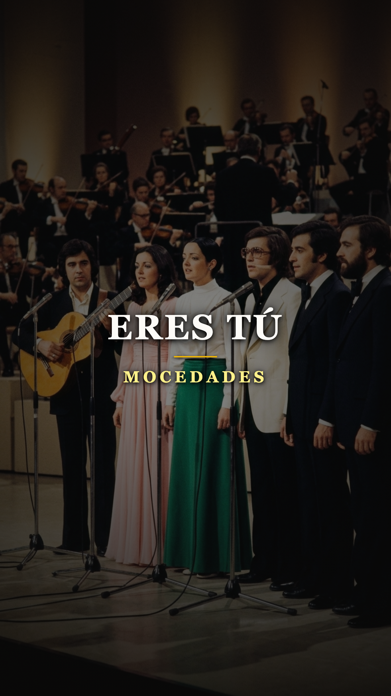
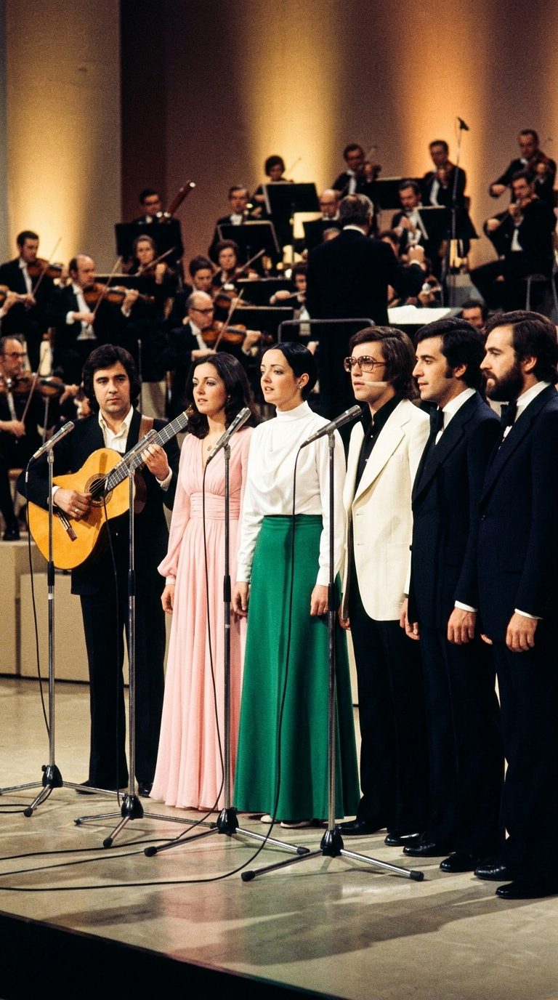
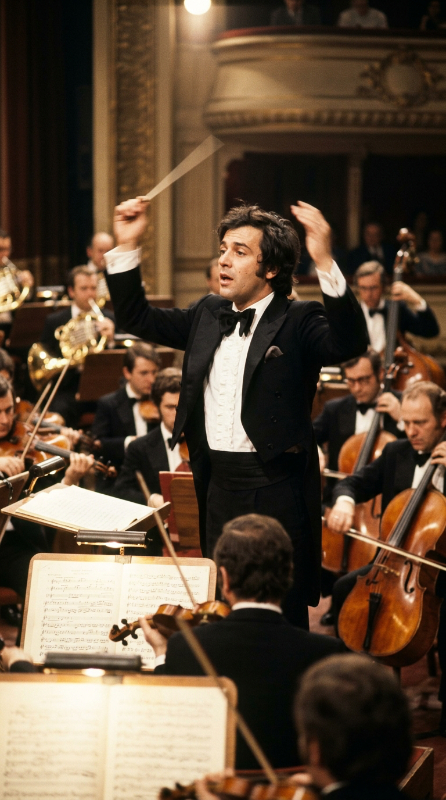
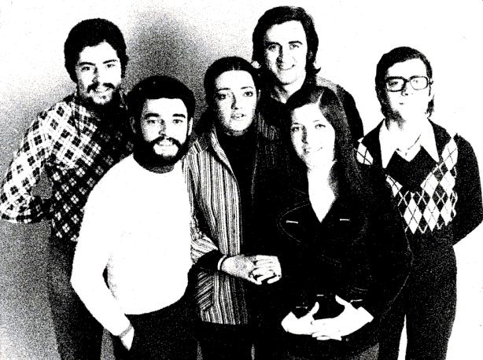
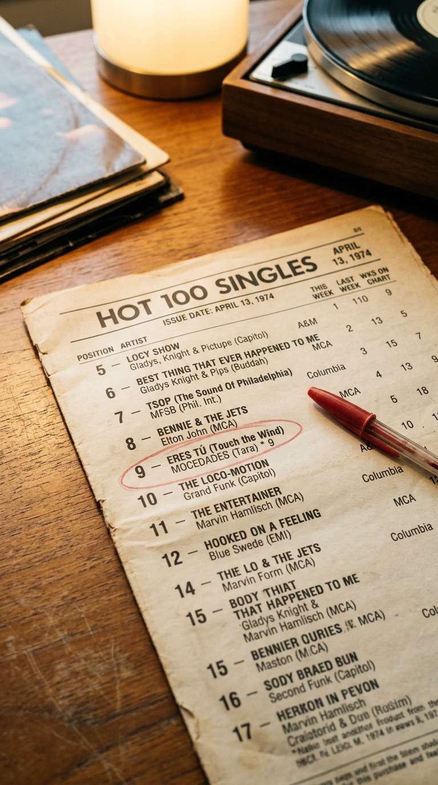

# 🎼 El Milagro de las Seis Voces que Conquistó a un Continente Sordo
### *La intrahistoria de «Eres tú»: una acusación de plagio a orillas del Rin, la batuta al límite de Juan Carlos Calderón y el asalto en español al búnker del Billboard estadounidense.*

---

**Por la redacción de Acordes Ocultos**  
*Tiempo de lectura estimado: 5 minutos y medio*

---

### Prólogo: La radio de Manhattan no entendía español

En la primavera de 1974, las cabinas de las emisoras FM de Nueva York, Chicago y Los Ángeles operaban bajo una ley no escrita pero inquebrantable: **el pop anglosajón no admitía intrusos**. Si querías sonar en el codiciado *Billboard Hot 100*, debías cantar en la lengua de Shakespeare. Cualquier intento foráneo era relegado a pequeños programas de medianoche o condenado al exilio de las tiendas de importación.

Sin embargo, en abril de aquel año, un fenómeno inexplicable comenzó a saturar las líneas telefónicas de los directores de programación. Los oyentes no pedían a Elton John, ni a Stevie Wonder, ni a Paul McCartney. Pedían, con insistencia casi febril, una canción cuyas palabras no alcanzaban a pronunciar pero cuya melodía les erizaba la piel: *«Touch the Wind»*, decían algunos; *«la canción de la promesa»*, decían otros.

El sello discográfico estadounidense intentó convencer a las emisoras de emitir la adaptación en inglés. Fue inútil. Los radioyentes llamaban furiosos exigiendo la versión original: la que comenzaba con un murmullo íntimo y estallaba en una catedral de seis voces limpias cantando en castellano: *«Como una promesa, eres tú, eres tú...»*. 

Aquella grabación no procedía de ningún rascacielos de Nashville o Londres. Había nacido en el norte de España, en una familia numerosa de Bilbao, y doce meses antes había estado a punto de ser destruida en uno de los escándalos de plagio más tensos de la historia europea.

---

### Acto I: La alquimia de Bilbao y el orfebre cántabro

Para entender la fuerza sísmica de *«Eres tú»*, hay que retroceder a finales de los años sesenta, en un Bilbao industrial donde las hermanas Amaya, Izaskun y Estíbaliz Uranga cantaban canciones de cuna, espirituales negros y música tradicional vasca en reuniones familiares. Con su hermano Roberto y un puñado de amigos de la universidad —Javier Garay, José Ipiña y Carlos Zubiaga— formaron un colectivo amateur al que llamaron sin pretensiones: *Voces y Guitarras*.

No buscaban la fama; cantaban por la pura fascinación de entrelazar sus timbres vocales. Pero cuando una cinta de ensayo llegó a las manos del pianista y compositor cántabro **Juan Carlos Calderón**, el destino del grupo dio un vuelco radical.

Calderón no vio en ellos una simple banda juvenil; vio un instrumento sinfónico viviente. Poseían lo que ninguna escuela de música puede fabricar: un empaste vocal casi genético. En el corazón de esa maquinaria brillaba la voz de **Amaya Uranga**: un contralto de una textura singular, capaz de susurrar con la fragilidad de una hoja seca y, dos compases después, proyectar una potencia de bronce que llenaba un auditorio entero sin desafinar un ápice.

Rebautizados como **Mocedades**, Calderón se propuso esculpir para ellos una obra maestra. No una canción ligera de verano, sino un himno atemporal. Tomó la estructura armónica del góspel, la riqueza contrapuntística del barroco y la poesía íntima de la balada romántica. Tras semanas de ensayos extenuantes, puliendo cada respiración y cada consonante, nació *«Eres tú»*.

*Foto de archivo 1973: La mirada y templanza de Amaya Uranga durante los ensayos previos a Eurovisión.*

---

### Acto II: La tormenta de Luxemburgo y la sombra del plagio

En la primavera de 1973, Televisión Española eligió internamente la canción para representar al país en la XVIII edición del Festival de Eurovisión, que se celebraría el **7 de abril en el Gran Teatro de Luxemburgo**. 

España vivía los estertores de la dictadura franquista, aislada políticamente del resto de Europa y vista con recelo por gran parte del continente. La delegación española sabía que la música debía hablar por sí sola para sortear el veto cultural implícito.

Pero a solo unos días del certamen, la tragedia sobrevoló a la expedición: **la prensa europea estalló en acusaciones de plagio**.

Varios medios franceses y alemanes publicaron artículos incendiarios denunciando que la estructura armónica y el estribillo de *«Eres tú»* eran un calco descarado de *«Brez besed»* («Sin palabras»), una balada que la cantante Berta Ambrož había interpretado por Yugoslavia en la edición de Eurovisión de 1966.

> 📝 **LA POLÉMICA:** *«El parecido en los primeros compases del estribillo era innegable para el oído inexperto. Durante 48 horas de pánico absoluto, se especuló con la expulsión inmediata de España del festival. Juan Carlos Calderón, consumido por la ansiedad en los pasillos del hotel, defendió nota por nota la legitimidad de su partitura ante los comités de la Unión Europea de Radiodifusión (UER). Tras un análisis musicológico de urgencia, los peritos concluyeron que, aunque compartían una progresión cadencial clásica habitual en la música occidental, el desarrollo melódico, la modulación y la polifonía de Calderón eran una creación original y soberana. Fueron autorizados a cantar, pero el daño moral estaba hecho: saldrían al escenario bajo la mirada inquisidora de quinientos millones de telespectadores.»*

*El momento cumbre: Mocedades en formación sobre el escenario del Gran Teatro de Luxemburgo, 1973.*

---

### Acto III: El silencio que desarmó al Gran Teatro

La noche del 7 de abril de 1973, cuando el presentador anunció a España, la tensión en el camerino cortaba el aire. Seis jóvenes de entre veinticinco y veintiséis años, vestidos con sobriedad y sin artificios coreográficos, caminaron hacia el centro de las tablas del Gran Teatro de Luxemburgo.

En el foso, Juan Carlos Calderón alzó su batuta. El teatro entero contuvo el aliento.

*Juan Carlos Calderón en el foso de la orquesta sinfónica, volcando toda la tensión acumulada en cada compás.*

Sonaron las primeras notas del piano, redondas y desnudas. Y entonces, la voz de Amaya Uranga rompió la penumbra:

> *«Como una promesa, eres tú, eres tú...*  
> *como una mañana de verano.*  
> *Como una sonrisa, eres tú, eres tú...*  
> *así, así eres tú.»*

Cualquier vestigio de suspicacia se evaporó en el acto. La dicción cristalina de Amaya no sonaba a certamen televisivo; sonaba a plegaria. Cuando el resto de las voces entraron en canon (*«Toda mi esperanza, eres tú, eres tú...»*), la acústica del Gran Teatro se transformó en un templo. Calderón dirigía a la orquesta de 50 músicos con una furia contenida, haciendo que las cuerdas y los metales empujaran la armonía vocal hacia un clímax colosal.

Al extinguirse el último acorde sostenido a seis voces, ocurrió algo insólito en Eurovisión: **el público de la aristocracia europea rompió el estricto protocolo y se puso en pie**. No fueron aplausos de cortesía; fue una ovación cerrada, atronadora y visceral que duró casi un minuto.

En las votaciones, el suspense fue asfixiante. Tras un intercambio de puntos de infarto, Luxemburgo se llevó la victoria con la cantante francesa Anne-Marie David por solo cuatro puntos de ventaja (129 contra 125). Mocedades quedó en un histórico **segundo lugar**. 

Pero las listas de ventas de la historia no las deciden los jurados de televisión.

---

### Acto IV: El asalto a las Américas

Lo que para cualquier otro participante de Eurovisión habría sido el final del camino, para Mocedades fue apenas el prólogo. 

El productor estadounidense **Radcliff Messman** escuchó la grabación en Europa y quedó cautivado. Compró la licencia para Norteamérica a través del modesto sello *Tara Records*. La discográfica, temerosa del rechazo al castellano, contrató al letrista Mike Hawker para traducir la letra al inglés bajo el título *«Touch the Wind»* y editó un disco sencillo de dos caras: la cara A en inglés y la cara B en español.

Lo que ocurrió a continuación desafió todas las leyes del mercado musical. 

Los programadores de radio de Nueva York comenzaron a pinchar la cara B por curiosidad. La respuesta de la audiencia fue instantánea: el público estadounidense no quería la versión en inglés; **querían la pureza, la pasión y el timbre original de Amaya Uranga en español**.

*Documento de época: Portada y listado oficial de Billboard Hot 100 donde Mocedades irrumpe en el Top 10 estadounidense.*

Semana tras semana, *«Eres tú»* comenzó a escalar posiciones en el chart más exigente del planeta:
* El **23 de marzo de 1974**, la canción ingresó al **Top 10 del Billboard Hot 100**, alcanzando la **posición número 9**.
* Vendió más de **un millón de copias solo en los Estados Unidos**, logrando el Disco de Oro de la RIAA.
* Fue nominada al premio **Grammy a Canción del Año** en 1975.

Era una proeza sin precedentes: una canción grabada íntegramente en español, sin sintetizadores de moda, sostenida únicamente por la poesía acústica y la excelencia armónica, compartiendo los diez primeros puestos de la música mundial con monstruos sagrados de la talla de John Lennon, Wings, Barbra Streisand y Cher.

*El registro histórico: «Eres tú» (#9) compartiendo cartel en el Billboard Hot 100 de 1974.*

---

### Epílogo: El viento que nunca dejó de soplar

Más de cincuenta años después de aquella velada en Luxemburgo, *«Eres tú»* ha sido versionada por decenas de artistas internacionales (desde Bing Crosby y Perry Como hasta Il Divo y Acker Bilk), acumulando cientos de millones de reproducciones en la era digital.

Pero su verdadero milagro no radica en las cifras de Billboard ni en los premios de la industria. Su milagro reside en haber demostrado que **la emoción humana profunda es el único idioma universal**. 

Aquella noche de 1973, en un continente dividido por fronteras, idiomas y desconfianzas políticas, seis jóvenes vascos que casi fueron descalificados antes de cantar demostraron que cuando el arte se forja desde la verdad más pura, no hay censura que pueda silenciarlo ni frontera que pueda detenerlo.

Como escribió el propio Juan Carlos Calderón años más tarde en sus memorias:
> *«Hay canciones que uno compone con la cabeza, y canciones que bajan del cielo y se te meten en las manos. Eres tú no nos pertenecía a nosotros; le pertenecía a cualquiera que alguna vez hubiera amado tanto que las palabras normales ya no le alcanzaran.»*

---

### 🎧 Escucha Recomendada para esta Crónica:
Acompaña la lectura con la **versión original de estudio de 1973 (Remasterizada)** en alta fidelidad:
* [Escuchar «Eres tú» de Mocedades en Spotify](https://open.spotify.com/track/4uLU6hMCjMI75M1A2tKUQC)

---

### 💬 Conversación en la Comunidad:
*¿Qué recuerdo personal o familiar te evoca la primera vez que escuchaste «Eres tú»? ¿Crees que hoy en día una canción enteramente acústica y sin efectos electrónicos podría volver a conquistar el Top 10 mundial? Déjanos tu reflexión en los comentarios.*

---

### 📚 Fuentes y Archivo Documental

Para la rigurosa reconstrucción histórica, musical e institucional de esta crónica, la redacción de *Acordes Ocultos* ha consultado y contrastado las siguientes fuentes documentales:

1. **Calderón, Juan Carlos.** Declaraciones, testimonios y análisis armónicos recogidos en el archivo documental de RTVE, *«Imprescindibles: Juan Carlos Calderón, el alquimista de la armonía»* (RTVE Play, 2013); entrevistas de prensa sobre la creación y arreglos corales de «Eres tú» (1973–2010).
2. **Uranga, Amaya; Garay, Javier & Uranga, Izaskun.** *Medio Siglo de Voces: Testimonios de la trayectoria de Mocedades*. Entrevistas retrospectivas para Radio Nacional de España (RNE) y Televisión Española (TVE, 1973–2023).
3. **Unión Europea de Radiodifusión (UER / EBU).** Actas oficiales del *18th Eurovision Song Contest 1973* (Nouveau Théâtre de Luxembourg, 7 de abril de 1973); informes de auditoría del jurado y dictamen de la comisión técnica de arbitraje que desestimó la reclamación por supuesta similitud con «Brez besed» (1966).
4. **Hemeroteca de Prensa Histórica Española (abril de 1973).** Coberturas especiales en los periódicos *ABC*, *La Vanguardia*, *Informaciones* y *El Correo Español - El Pueblo Vasco* sobre la participación española en Luxemburgo y el impacto sociocultural del segundo puesto europeo.
5. **Billboard Magazine Historical Archives (1973–1974).** Listas oficiales del *Billboard Hot 100* y *Adult Contemporary* (marzo y abril de 1974); auditorías de ventas internacionales y certificación de Disco de Oro de la Recording Industry Association of America (RIAA) por más de un millón de copias vendidas en los Estados Unidos.
6. **Registros Fonográficos Originales:** Sencillo de 45 RPM *«Eres tú»* / *«Recorrer el camino»* (Discos Zafiro / Novola NO-071, Madrid, España, 1973); y edición para el mercado anglosajón *«Eres tú (Touch the Wind)»* (Tara Records TRS-100 / Famous Music Corp., EE. UU., 1973).

