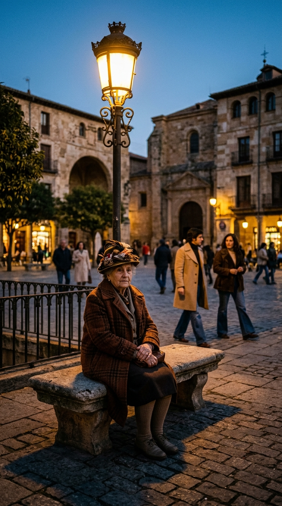
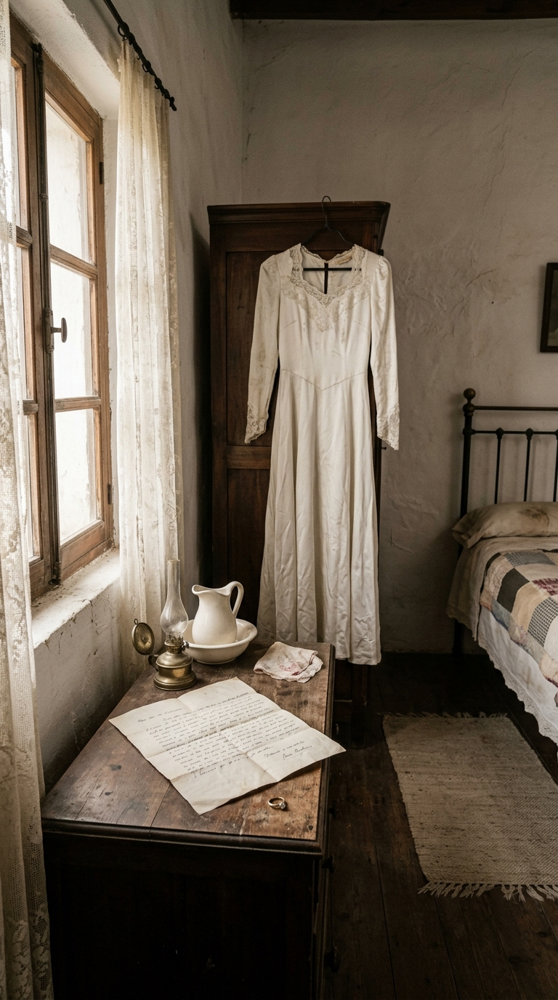
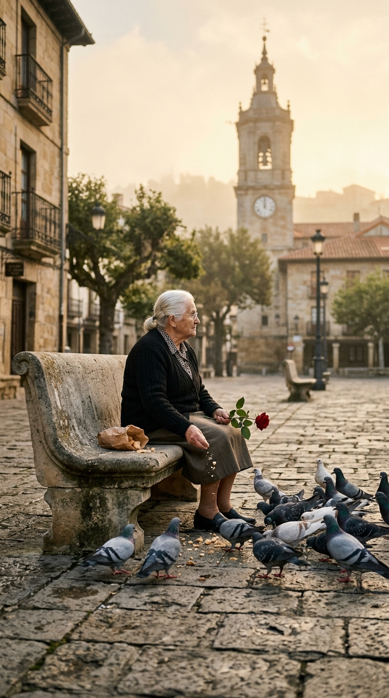
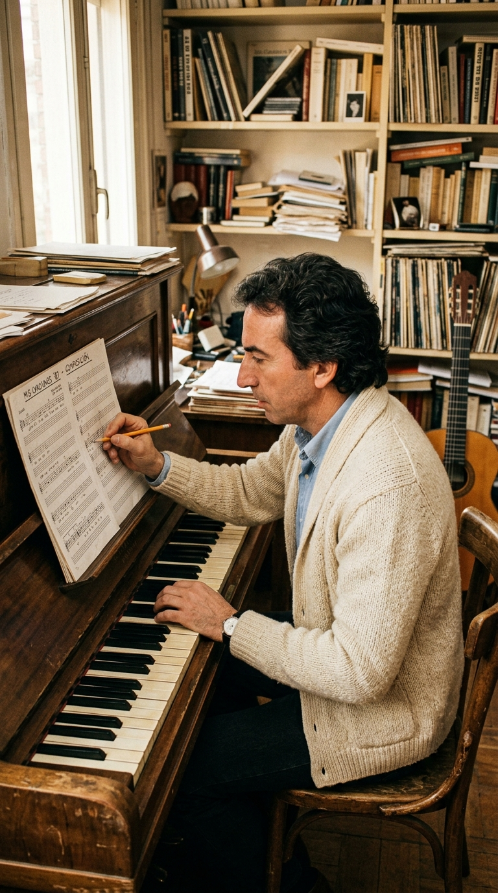
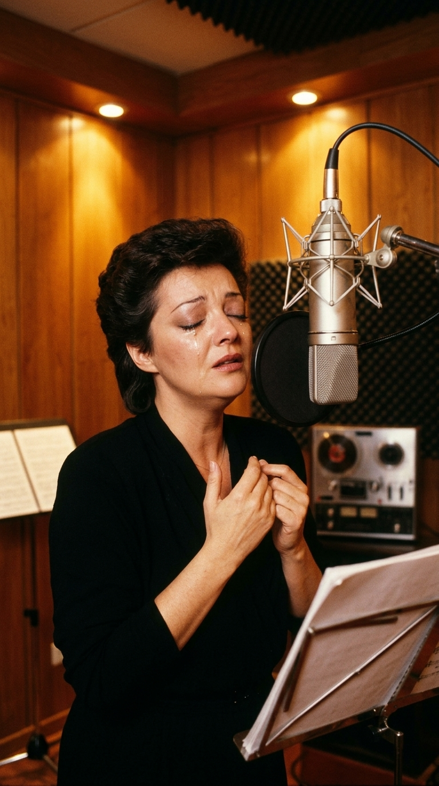

# La Rosa del Banco de Piedra: La Verdad Detrás de «Le Llamaban Loca»

> *«Tiene la sonrisa triste y la mirada perdida... Le llamaban loca por la calle.»*

---

## Prólogo: El Estigma de la Devoción

En todas las ciudades y pueblos de España existió alguna vez una figura que el vecindario decidió marcar con el sello despiadado de la demencia. Alguien que no vestía según la norma, que hablaba con las sombras o que pasaba las horas anclado en una esquina, alimentando palomas o mirando al infinito con una paciencia que desconcertaba a los transeúntes. Para la prisa del mundo moderno, la soledad obstinada resulta intolerable; la sociedad necesita etiquetarla, reírse de ella en voz baja o rodearla de mitos para no mirarse en el espejo de su propio miedo al desamparo.

En 1982, un grupo vocal nacido en los márgenes de la ría de Bilbao y un artesano de la canción nacido entre las colinas de Cuenca unieron sus sensibilidades para detener esa burla colectiva. **Mocedades**, en la voz imperial y herida de **Amaya Uranga**, y **José Luis Perales**, el mayor retratista del alma cotidiana en la lengua de Cervantes, publicaron una balada que no era una simple melodía radiofónica: era un desagravio moral. Se titulaba **«Le llamaban loca»**, y en apenas tres minutos y medio transformó la crueldad de un pueblo en una de las plegarias más desgarradoras jamás compuestas sobre el duelo y la fidelidad.

---

## Acto I: El Mito Bilbaíno de la Plaza de Arriquibar

Durante más de cuatro décadas, la memoria popular de Bilbao defendió con orgullo y fervor que «Le llamaban loca» era un homenaje directo a una de las hijas más célebres y enigmáticas de su casco urbano: **Mercedes Lorenzo Sauto** (1915–1996), conocida por generaciones de bilbaínos como *«La loca de Arriquibar»* o *«La loca del sombrero»*.

Mercedes era una mujer de porte aristocrático y mirada dulce que, tras un desengaño devastador en los albores de su juventud —la leyenda afirmaba que su prometido la abandonó a escasas horas de subir al altar para marcharse con otra mujer—, se negó a aceptar el final del romance. Ataviada con abrigos de corte antiguo, guantes gastados y sombreros extravagantes adornados con flores secas o plumas, Mercedes convirtió los bancos de piedra de la Plaza de Arriquibar en su hogar espiritual. Allí pasaba mañanas y tardes enteras, tejiendo con agujas de lana, repartiendo mendrugos de pan entre los gorriones y las palomas, y contemplando el ir y venir de una burguesía que la señalaba con condescendencia.

Cuando Mocedades —icono absoluto del País Vasco tras su segundo puesto en Eurovisión 1973 con *«Eres tú»*— lanzó la canción en su álbum *Amor de hombre*, toda la ciudad creyó ver en sus versos el retrato fidedigno de Mercedes:

> *«Y en el banco de aquel parque donde el tiempo se detiene,  
> ella espera que regrese el amor que nunca viene...»*

Mercedes Lorenzo Sauto falleció el 23 de enero de 1996 en el hospital Aita Menni de Mondragón, pero su leyenda ya era inseparable de la canción. Sin embargo, detrás del mito vasco latía otra historia real, íntima y dolorosamente cercana al compositor que empuñó la pluma.

---

## Acto II: El Cuaderno de José Luis Perales

La verdadera génesis de la obra no brotó en las calles húmedas de Bilbao, sino en el corazón templado de Castilla. A finales de los años setenta, José Luis Perales pasaba temporadas en casa de sus padres. Frente a aquella vivienda, el compositor observaba a diario a una mujer madura que transitaba por el barrio como una aparición errante.

Al preguntar por ella, sus padres le revelaron la tragedia que la vecindad comentaba en voz baja: aquella mujer había sido una muchacha hermosa, llena de vitalidad y proyectos, hasta que una ruptura amorosa repentina y atroz quebró su equilibrio emocional. Incapaz de asumir que aquel hombre se había marchado para no regresar, su mente trazó un refugio invisible para protegerse de la realidad: se convenció de que su prometido seguía vivo, amándola, y que cada atardecer volvería a buscarla al mismo rincón donde solían despedirse.

Perales vio en aquel ritual diario una dimensión poética y sagrada que la gente común era incapaz de descifrar. La mujer no pedía limosna ni molestaba a nadie; simplemente acudía cada tarde a la floristería de la esquina, compraba una flor fresca y caminaba hacia el banco de la plaza para esperarle:

> *«Yo no estoy loca, estuve loca ayer... pero fue por amor.»*

«Me conmovía profundamente la indiferencia y la crueldad con que la gente juzga a quienes pierden la razón por una herida afectiva», recordaría Perales años después. «No estaba loca de odio ni de maldad; estaba 'loca' porque su corazón se negó a aceptar que el amor se había terminado. La canción fue mi forma de abrazarla y pedirle perdón en nombre de todos los que se reían al verla pasar».

---

## Acto III: La Voz Desgarrada de Amaya Uranga

A comienzos de 1982, Mocedades preparaba el lanzamiento más ambicioso de su carrera. Tras una década en la cima de la balada hispanoamericana, el productor Óscar Gómez concibió el álbum *Amor de hombre*, una obra maestra que combinaba adaptaciones de zarzuelas clásicas (como el célebre intermedio de *La leyenda del beso*) con composiciones inéditas de los mejores autores de la época.

Cuando Perales presentó la maqueta acústica de «Le llamaban loca», el grupo entero quedó conmocionado. La canción requería una delicadeza interpretativa absoluta: no podía sonar melodramática ni altisonante, sino íntima, confidencial, como un susurro al oído de quien contempla una lágrima ajena.

En los estudios de grabación de Madrid, **Amaya Uranga** se plantó frente al micrófono de condensador descalza, con las manos apretadas y los ojos cerrados. Las crónicas de la sesión relatan que Amaya tuvo que detener la toma en varias ocasiones porque el nudo en su garganta le impedía modular los versos finales. Su timbre oscuro, aterciopelado y cargado de una melancolía atlántica inconfundible encontró en el coro de sus hermanos y compañeros el colchón litúrgico perfecto.

El álbum *Amor de hombre* se convirtió en un terremoto comercial sin precedentes: despachó más de 500.000 copias en España en cuestión de semanas y conquistó el número uno en las listas de México, Colombia, Argentina y Estados Unidos. Pero de todas las canciones del disco, «Le llamaban loca» fue la que caló hondo en la memoria afectiva de las familias, convirtiéndose en el himno indiscutible de las madres y abuelas que reconocían en aquella historia el peso silencioso del sacrificio femenino.

---

## Acto IV: La Redención del Juicio Ajeno

El verdadero triunfo de «Le llamaban loca» no se mide en discos de oro ni en cifras de taquilla, sino en su capacidad para transformar la mirada de quien la escucha. A través de la melodía de Perales y las armonías de Mocedades, la figura grotesca de la «loca del pueblo» fue despojada de su estigma para ser entronizada como una heroína trágica.

La canción plantea una paradoja filosófica implacable: en un mundo cínico donde los sentimientos se negocian, se desgastan y se sustituyen con fría ligereza, la verdadera locura tal vez no sea esperar eternamente, sino ser capaz de olvidar con tanta facilidad. Aquella mujer que compraba una rosa cada tarde desafiaba las leyes del tiempo y la muerte; en su mente, el amor era invulnerable al paso de los calendarios.

---

## Epílogo: La Rosa en la Niebla

Más de cuatro décadas después de su grabación, «Le llamaban loca» sigue estremeciendo con la misma fuerza que en el otoño de 1982. En cada plaza solitaria de España y América Latina, cuando cae la tarde y se encienden las farolas de gas o de sodio, parece quedar flotando el eco de aquellos pasos lentos y la silueta de un sombrero viejo.

No era locura. Era la forma más limpia, desgarradora y solitaria de lealtad humana. Una lección de amor inquebrantable que la música rescató del olvido para convertirla en patrimonio eterno de nuestra cultura.

---

### 📚 Fuentes y Archivo Documental

1. **Perales, José Luis.** Declaraciones hemerográficas y entrevistas retrospectivas sobre el proceso compositivo de *Amor de hombre* y «Le llamaban loca» (Archivo RTVE / *El Cultural*, 1982–2016).
2. **Gómez, Óscar.** *Notas de producción del álbum Amor de hombre*. Discos CBS / Sony Music Spain, Madrid, 1982.
3. **Lorenzo Sauto, Mercedes («La loca de Arriquibar»).** Archivo hemerográfico de la Villa de Bilbao, crónicas urbanas de *El Correo Español - El Pueblo Vasco* y obituarios de Mondragón (enero de 1996).
4. **Uranga, Amaya; Uranga, Roberto; Uranga, Izaskun; Pérez, Carlos; Ipiña, Javier; Blanco, José Antonio.** *Historia oficial y discografía comentada de Mocedades (1969–1993)*. SGAE / Fundación Autor.
5. **Fonoteca de la Música Española.** Ficha técnica y registro sonoro de la sesión de grabación de CBS en Estudios Kirios, Madrid, primavera de 1982.

---

*¿Alguna vez conociste en tu barrio o pueblo una historia similar a la de «Le llamaban loca»? Comparte tu memoria en los comentarios.*
