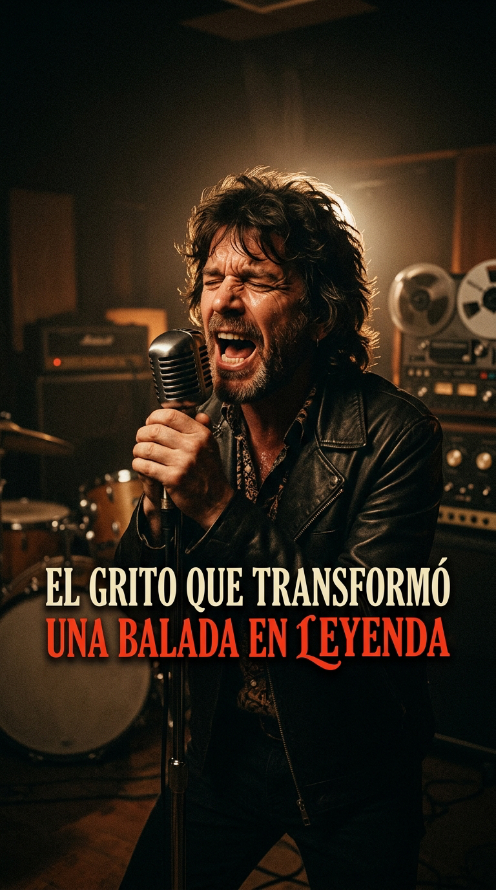
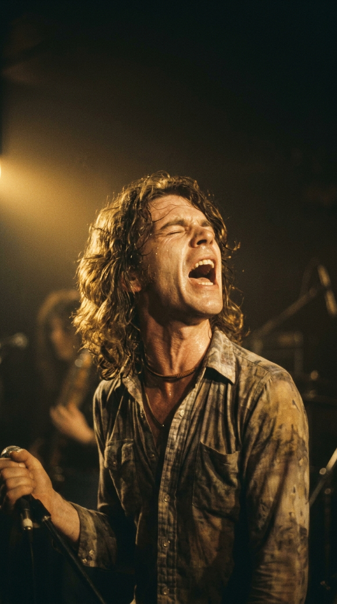
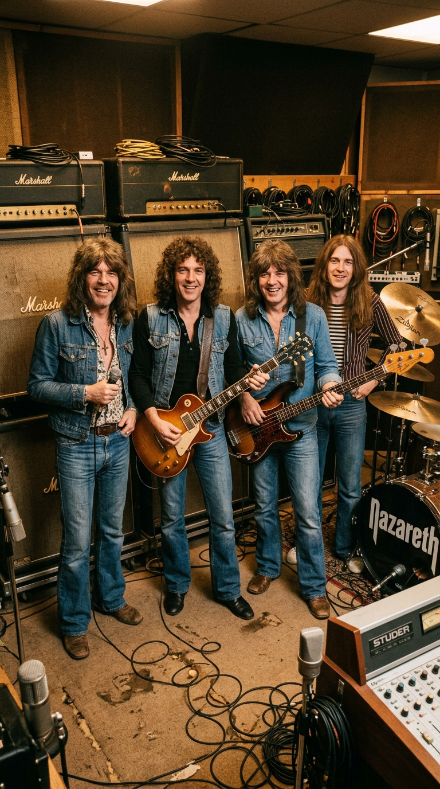
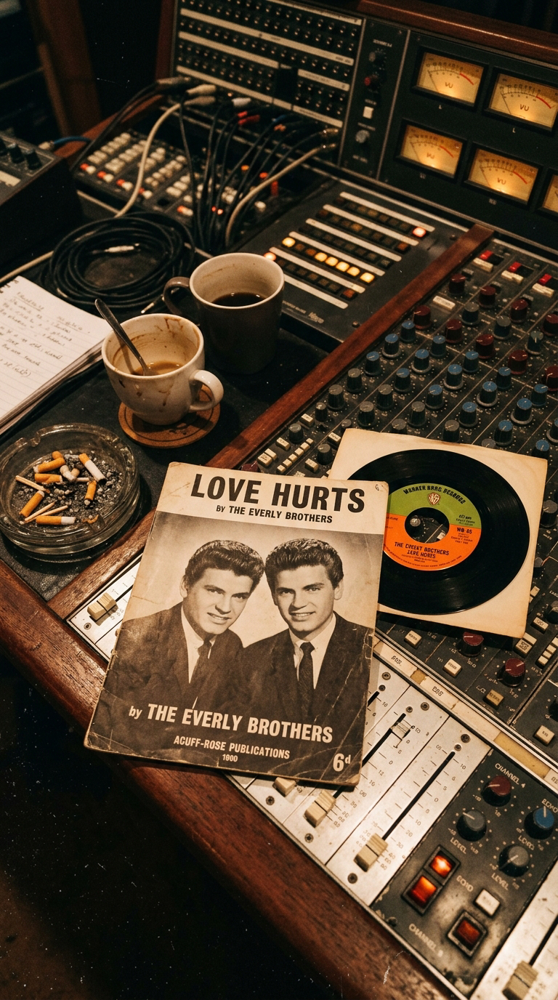
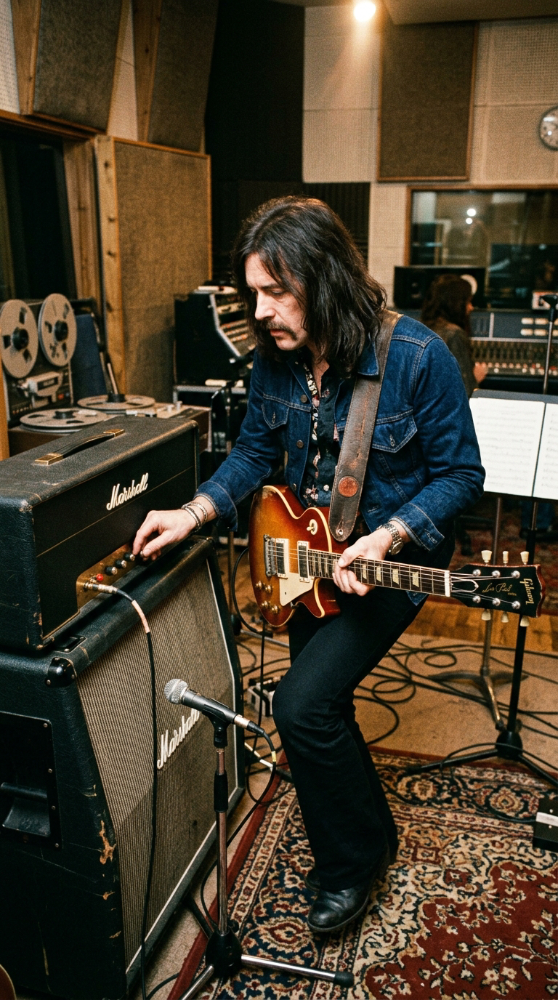
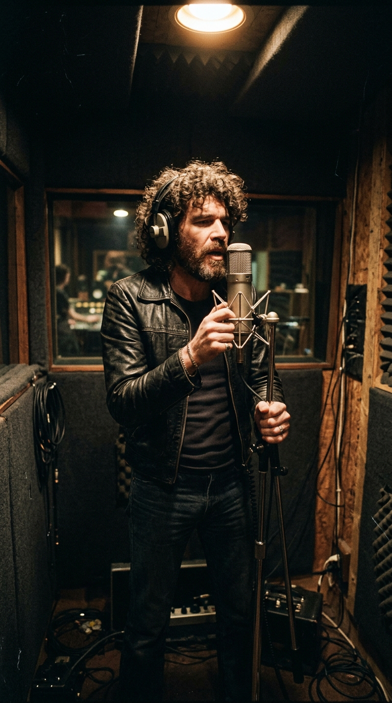
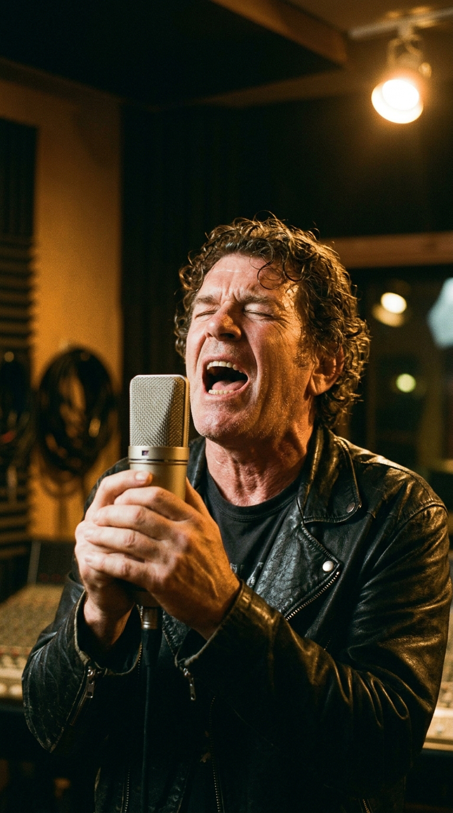
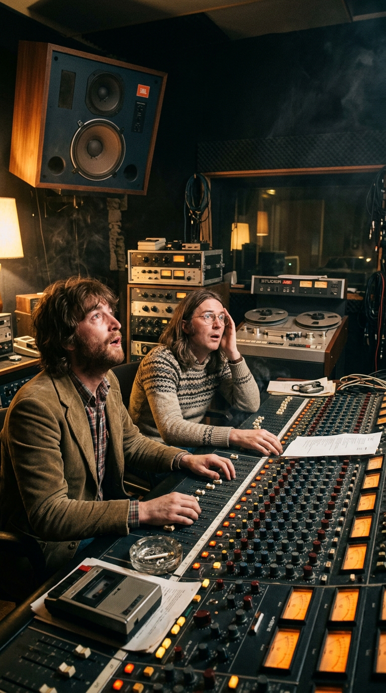
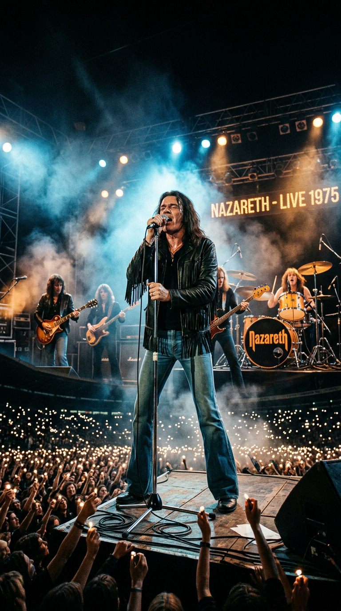
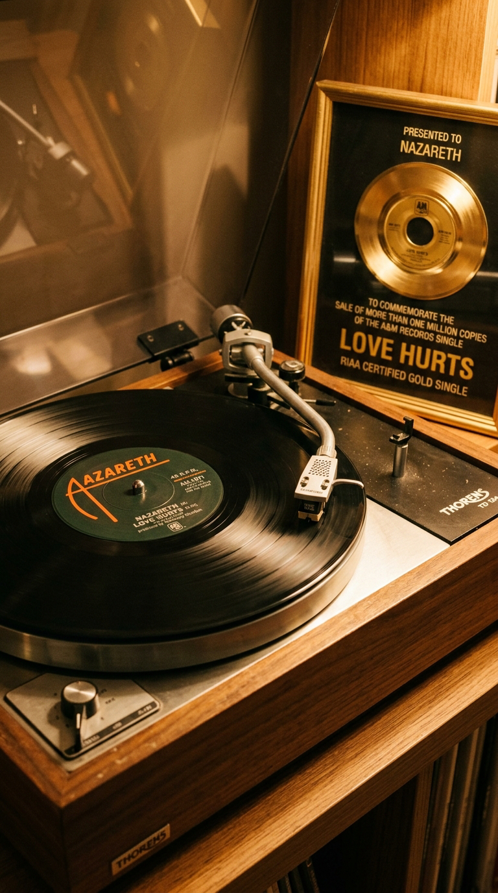

# El Grito que Transformó una Balada en Leyenda: Cómo Nazareth Reinventó «Love Hurts»

> *«Love hurts, love scars, love wounds and mars any heart not tough or strong enough to take a lot of pain... Love is like a cloud, it holds a lot of rain. Love hurts.»*  
> — **Felice & Boudleaux Bryant / Dan McCafferty, 1975**

---

### Prólogo: El mar de llamas en la oscuridad

A mediados de la década de 1970, en las arenas repletas de Estados Unidos y Europa, los conciertos de hard rock eran templos de volumen atronador, sudor y distorsión salvaje. Sin embargo, cuando las luces principales se apagaban y una solitaria guitarra acústica desgranaba los primeros acordes melancólicos de una balada, un ritual nuevo y mágico se adueñaba de la penumbra: miles de brazos se elevaban al unísono encendiendo pequeños mecheros de gasolina, convirtiendo los graderíos en un océano ondulante de fuego dorado.

En el centro del escenario, un fornido cantante escocés con melena rizada y mirada felina no entonaba una queja dócil ni un dulce lamento de despecho juvenil. Lo que brotaba de la garganta de Dan McCafferty era un rugido telúrico, una herida sangrante hecha sonido que desgarraba el aire. Aquel vendaval emocional consagró a **Nazareth** en el Olimpo del rock y parió un género nuevo que dominaría las décadas venideras: la *power ballad*. Sin embargo, la canción que hizo temblar al mundo no había nacido en una taberna obrera de Escocia, sino en las pulcras colinas de Nashville quince años atrás.

---

### Acto I: La balada de seda que nadie recordaba

En 1960, el prestigioso matrimonio de compositores Boudleaux y Felice Bryant —autores de gigantescos éxitos para las armonías vocales de la música country— escribieron *«Love Hurts»*. Concebida como una reflexión elegante y sobria sobre el desencanto amoroso, la pieza fue grabada originalmente por **The Everly Brothers** en su álbum *A Date with the Everly Brothers*.

Años después, titanes de la talla de Roy Orbison y la trágica figura del country-rock Gram Parsons (junto a una joven Emmylou Harris) ofrecieron versiones exquisitas del tema. Todas compartían un mismo denominador común: una tristeza aterciopelada, contenida y respetuosa de las formas del folk y el country tradicional. La canción advertía que el amor causaba heridas, pero lo hacía con la distancia de quien contempla una cicatriz antigua en la tranquilidad de la tarde.

Nadie sospechaba que aquella melodía de salón estaba esperando a cuatro obreros de los astilleros y fábricas de Fife para mostrar sus verdaderas garras.

---

### Acto II: La tormenta de Dunfermline en Escape Studios

Formados en la localidad minera de Dunfermline en 1968, Nazareth eran la antítesis de la sofisticación londinense. Curtidos tocando versiones en los clubes más rudos y pendencieros del norte británico, la banda —integrada por Dan McCafferty, el guitarrista Manny Charlton, el bajista Pete Agnew y el demoledor baterista Darrell Sweet— practicaba un boogie hard rock pesado, directo y sin concesiones.

En 1974, la banda se encerró en *Escape Studios*, en el condado rural de Kent, para registrar su sexto álbum de estudio: *Hair of the Dog*. El objetivo del grupo era forjar su trabajo más agresivo y afilado, un manifiesto de puro rock pesado que los consolidara internacionalmente. Pero en medio de aquella tempestad de decibelios y amplificadores Marshall al rojo vivo, el guitarrista y productor Manny Charlton intuyó que el disco necesitaba un contraste emocional absoluto: una balada que detuviera el pulso del oyente.

---

### Acto III: El rediseño pesado de Manny Charlton

Charlton rescató de su colección personal el viejo vinilo de The Everly Brothers. Sabía que la melodía poseía una fuerza indestructible, pero el envoltorio acústico original era demasiado frágil para la identidad de Nazareth. Se sentó en la sala de grabación con su Gibson Les Paul y comenzó a desmantelar la estructura original.

Manny sustituyó las guitarras livianas por una pared de sonido densa y reverberante: arpegios cristalinos en primer plano respaldados por acordes eléctricos saturados que estallaban en el estribillo con un dramatismo sobrecogedor. Creó un puente instrumental de guitarra que no buscaba la rapidez, sino el llanto sostenido de las cuerdas dobladas, imitando la voz de un corazón que se quiebra.

La base instrumental estaba lista, pero el destino de la grabación dependía enteramente de lo que ocurriera en la cabina de aislamiento vocal.

---

### Acto IV: La toma descarnada de Dan McCafferty

Cuando Dan McCafferty se colocó los auriculares frente al micrófono de condensador Neumann U47 en la penumbra del estudio, no intentó endulzar su timbre ni esconder su acento obrero. Cerró los ojos, apretó los puños y atacó la letra con una furia desprovista de máscaras.

Su voz —un milagro biológico capaz de rasgar como el papel de lija y volar a registros agudos inhumanos sin perder consistencia— convirtió cada verso en un exorcismo personal. Donde los cantantes anteriores decían con resignación que el amor hiere, McCafferty aullaba como un hombre al que le están arrancando las vísceras en una esquina solitaria:

> *«I'm young, I know, but even so I know a thing or two, and I learned from you! I really learned a lot, really learned a lot: love is like a flame, it burns you when it's hot... Love hurts!»*

En la sala de control, los ingenieros y sus propios compañeros de banda se quedaron mudos, con la piel erizada. McCafferty no estaba interpretando una canción ajena; estaba vaciando en la cinta magnética toda la soledad, el orgullo herido y la rabia del desamor humano.

---

### Acto V: El estallido global y el récord de 1975

Lanzada en 1975 como sencillo en Estados Unidos para la edición norteamericana de *Hair of the Dog*, la versión de Nazareth desató un terremoto comercial sin precedentes para un grupo de hard rock europeo.

El sencillo trepó al número ocho del *Billboard Hot 100*, fue certificado como disco de platino y alcanzó el número uno en Canadá, Bélgica, Sudáfrica y Nueva Zelanda. En Noruega protagonizó una hazaña irrepetible en la historia discográfica de la nación: se mantuvo en el número uno durante catorce semanas consecutivas y permaneció en las listas durante más de un año.

Nazareth había demostrado que los hombres rudos del rock pesado también sabían llorar, pero lo hacían de pie, rugiendo contra el cielo y sin pedir disculpas.

---

### Epílogo: El ADN de la Power Ballad

El impacto de *«Love Hurts»* alteró para siempre el rumbo del rock comercial. Bandas enteras que triunfarían en los años ochenta y noventa —desde Scorpions y Whitesnake hasta Guns N' Roses y Bon Jovi— tomaron como biblia de cabecera la fórmula que Nazareth perfeccionó en Kent: el contraste entre la delicadeza del verso y la explosión desgarrada del estribillo.

Dan McCafferty falleció en noviembre de 2022, pero su alarido sigue resonando en cada rincón del mundo donde alguien sufre por amor. Los Everly Brothers nos enseñaron que el amor duele; pero hizo falta un escocés indomable para recordarnos que ese dolor, cuando se canta con el alma al desnudo, puede convertirse en una victoria inmortal.

---

### 💬 Comunidad y Reflexión

¿Conocías el origen country de *«Love Hurts»* antes de que Nazareth la convirtiera en el himno definitivo del rock? ¿Qué sientes al escuchar ese desgarrador alarido de Dan McCafferty?

Te leemos en los comentarios de **Acordes Ocultos**.

---

### 📚 Fuentes y Archivo Documental

* **McCafferty, Dan & Agnew, Pete**: Archivo de entrevistas sobre las sesiones de *Hair of the Dog* en Escape Studios, *Classic Rock Magazine*, Edición 204, 2014.
* **Charlton, Manny**: *Hair of the Dog*. Notas de producción y testimonios de sesión en Escape Studios (Kent, Inglaterra). A&M Records (1975) / Sanctuary Records Definitive Edition (2010).
* **Billboard & RIAA Archives**: Registro de certificaciones de oro y platino para el sencillo *«Love Hurts»* y el álbum *Hair of the Dog*, 1975–1976.
* **VG-lista (Norwegian National Record Chart)**: Historial hemerográfico del récord de permanencia en el número uno del sencillo *«Love Hurts»*, Oslo, 1976.
* **Bryant, Felice & Boudleaux**: Catálogo de composiciones y registro autoral de House of Bryant Publications / BMI Archives, Nashville, Tennessee.
