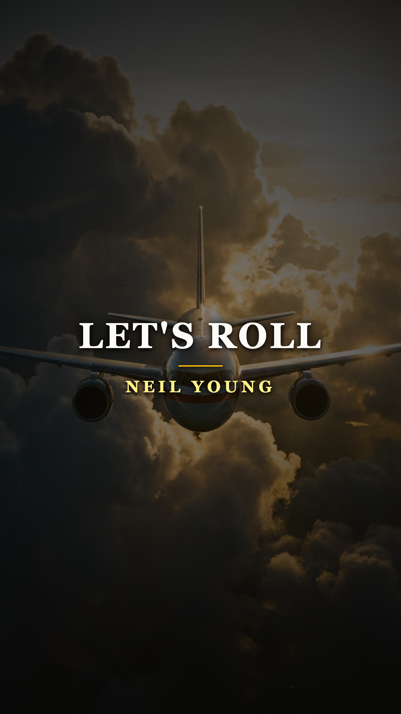
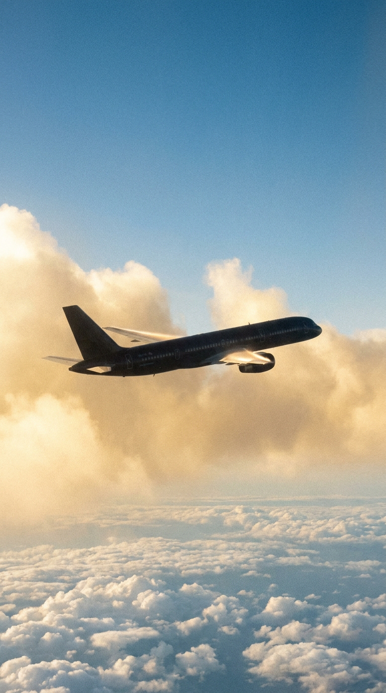
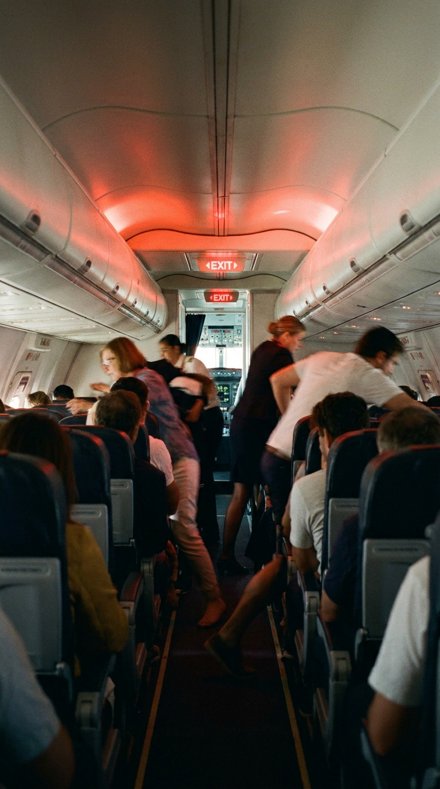
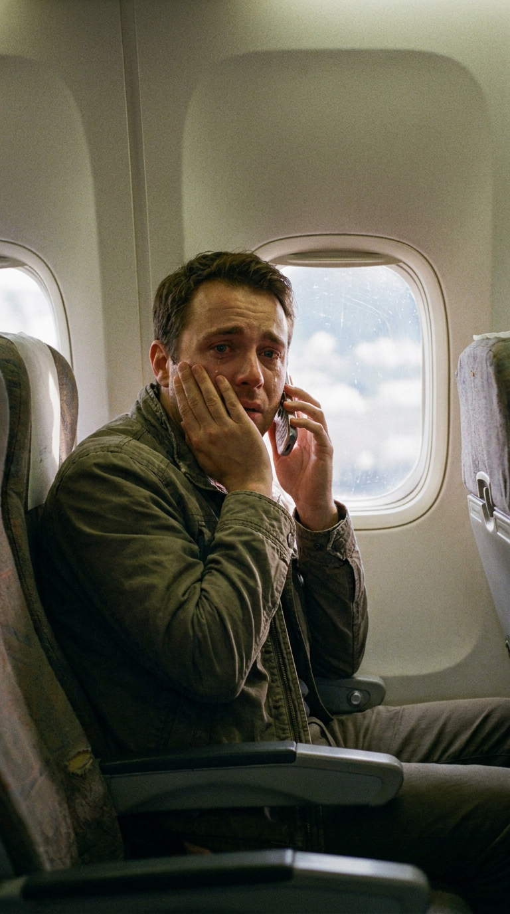
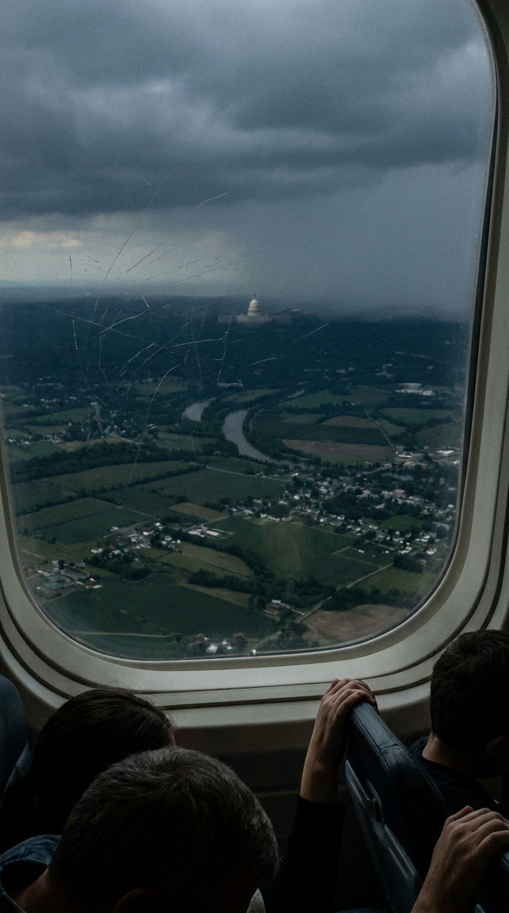
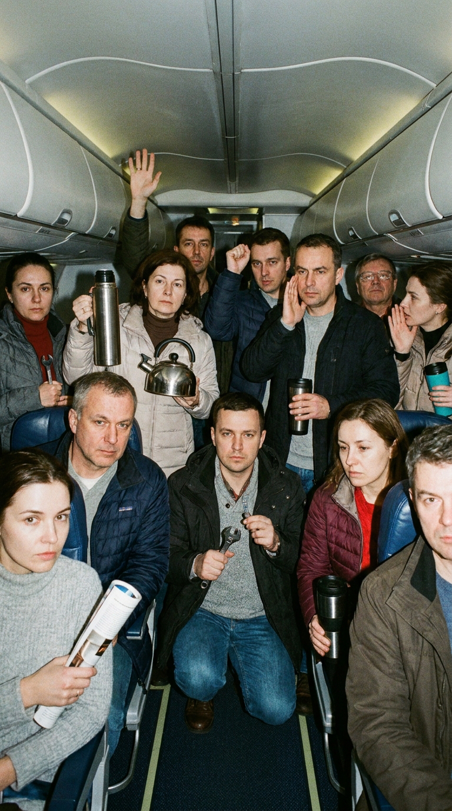
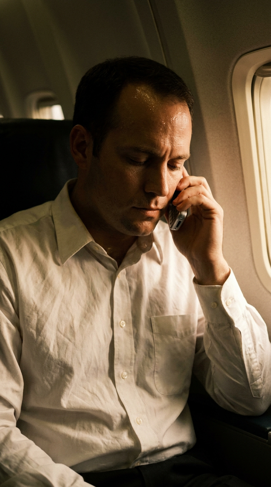
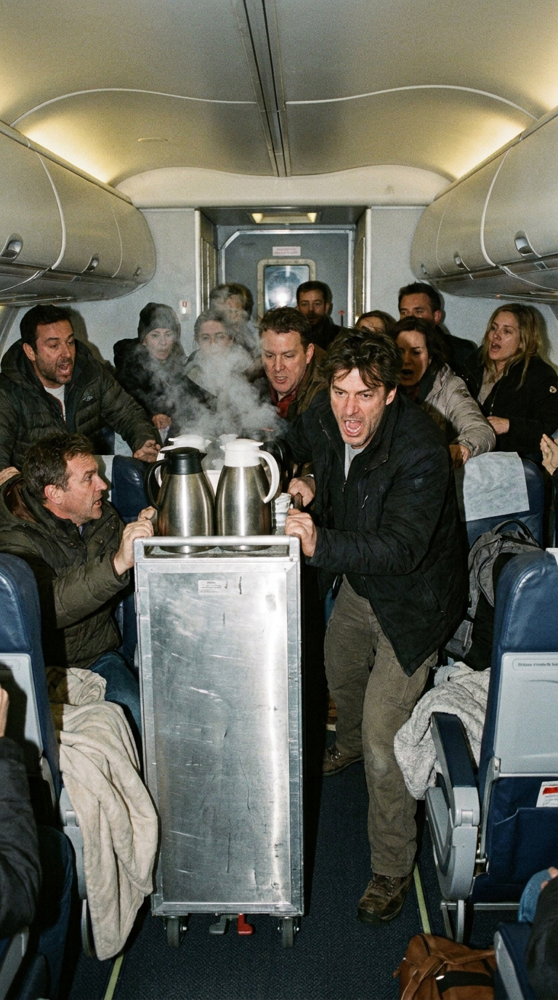
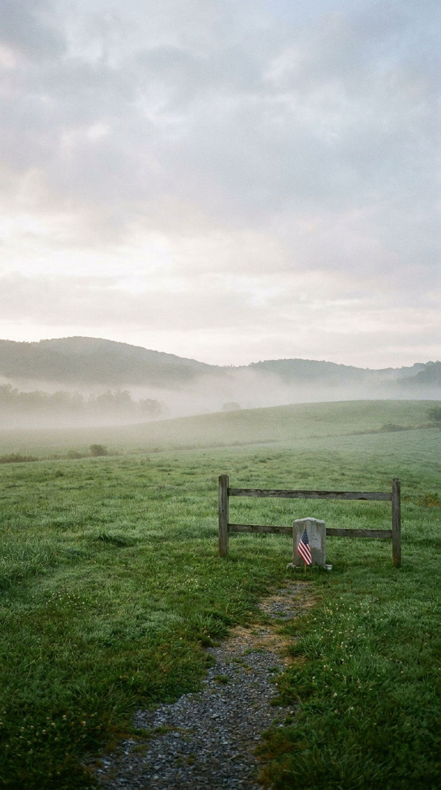
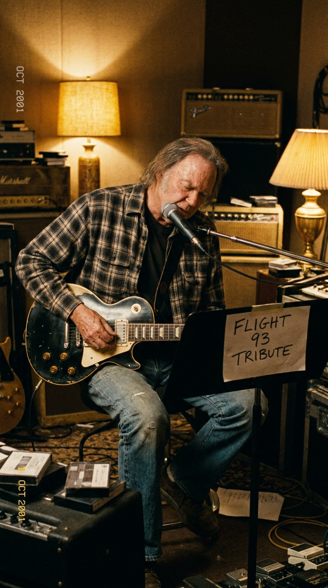

# ✈️ El Vuelo del Coraje: Los Cuarenta Héroes del Vuelo 93 y la Furia Eléctrica de Neil Young
### *Cómo treinta y tres pasajeros y siete tripulantes votaron en el pasillo asaltar una cabina secuestrada para salvar el Capitolio, inspirando al viejo leñador canadiense a forjar un monumento de acero y respeto.*

---

**Por la redacción de Acordes Ocultos**  
*Tiempo de lectura estimado: 8 minutos*

---

### Prólogo: La última pista de despegue en Newark

A las 8:42 de la mañana del martes 11 de septiembre de 2001, las ruedas del Boeing 757 que operaba el **Vuelo 93 de United Airlines** se despegaron del asfalto del Aeropuerto Internacional de Newark, en Nueva Jersey. La aeronave, propulsada por dos motores Pratt & Whitney y cargada con más de cuarenta mil litros de combustible para cruzar todo el continente americano rumbo a San Francisco, ascendió suavemente hacia un cielo de un azul prístino y diáfano.

*11 de septiembre de 2001, 8:42 AM: El Boeing 757 del Vuelo 93 asciende hacia un cielo limpio, sin presagiar la encrucijada mortal que se avecinaba.*

A bordo viajaban treinta y tres pasajeros comunes, siete tripulantes de cabina y una calma engañosa. Había empresarios que regresaban a Silicon Valley, deportistas universitarios, una azafata recién casada, un jubilado aficionado a la ornitología y una mujer embarazada de tres meses. La ocupación era inusualmente baja: apenas una quinta parte de la capacidad total del avión.

Mientras el piloto Jason Dahl y el copiloto LeRoy Homer nivelaban la nave a treinta y cinco mil pies de altitud sobre Pensilvania, en la pantalla del radar de control aéreo de Nueva York los dos primeros aviones comerciales secuestrados ya habían impactado contra las Torres Gemelas. El Vuelo 93 había despegado con cuarenta y un minutos de retraso debido a la congestión de pistas en Newark; una demora aparentemente rutinaria que, por los azares del destino, se convertiría en la única brecha por la que la verdad lograría colarse en el aire.

A las 9:28, cuando sobrevolaban la frontera con Ohio, cuatro terroristas de Al Qaeda armados con cuchillos de hoja corta, gas lacrimógeno y una supuesta caja de cartón envuelta con cables rojos que simulaba una bomba, irrumpieron en la cabina de mando asesinando a los pilotos y tomando los mandos de navegación.

*9:28 AM: La violencia estalla en la cabina; los secuestradores desconectan el piloto automático y giran rumbo a la capital federal.*

---

### Acto I: La revelación telefónica en el cielo

Los secuestradores obligaron a los cuarenta rehenes a replegarse hacia las últimas filas de la cabina de clase turista, bajando las cortinas y asegurando que tenían una bomba que harían estallar si alguien intentaba desobedecer. El avión dio un viraje brusco hacia el sureste, descendiendo rápidamente de altitud con dirección al corazón político de los Estados Unidos: Washington D.C.

En la penumbra de la parte trasera del avión, los pasajeros comenzaron a hacer algo que los secuestradores no habían previsto en sus manuales: descolgaron los teléfonos *GTE Airfone* integrados en los respaldos de los asientos y encendieron sus teléfonos móviles personales.

*A diez mil metros de altura: Los teléfonos de fila se convierten en el puente desgarrador con la realidad de tierra.*

Entre las 9:30 y las 10:00 de la mañana, se realizaron **treinta y siete llamadas telefónicas** desde el Vuelo 93 hacia tierra firme. Lo que los pasajeros y las azafatas escucharon al otro lado de la línea desarmó cualquier esperanza ingenua de negociación:
—*«Han estrellado dos aviones contra el World Trade Center en Manhattan... y otro acaba de penetrar en el Pentágono. El país está bajo ataque militar»*.

Aquellas frases sellaron el destino de la aeronave. Los cuarenta civiles comprendieron de golpe la macabra realidad del siglo XXI: ya no existía la figura clásica del secuestro aéreo de los años setenta, donde los piratas desviaban el avión a Cuba o Argelia para exigir dinero o la liberación de presos políticos. Su propio avión era un proyectil teledirigido, y el combustible que quemaban sus alas estaba destinado a pulverizar la cúpula del Capitolio o la Casa Blanca, asesinando a miles de compatriotas en tierra.

*Sobrevolando Pensilvania: Con el Capitolio en la mira de los secuestradores, los pasajeros asumen que no habrá rescate exterior.*

---

### Acto II: «¿Están listos? Bien. ¡Vamos!»

En lugar de sumirse en un pánico paralizante, en el llanto estéril o en la histeria colectiva, los pasajeros del Vuelo 93 hicieron algo profundamente arraigado en la tradición cívica de la democracia: **celebraron una asamblea en el pasillo**.

Hombres y mujeres de orígenes, razas y tendencias políticas dispares se miraron a los ojos entre las filas 30 y 34. Entre ellos destacaban figuras con liderazgo atlético y temple de acero: **Todd Beamer**, un ejecutivo de cuentas de 32 años de Oracle; **Mark Bingham**, un relaciones públicas de 31 años y exjugador de rugby; **Jeremy Glick**, un cinturón negro de judo de 31 años; y **Tom Burnett**, vicepresidente de una empresa médica. Junto a ellos, las asistentes de vuelo Sandra Bradshaw y CeeCee Lyles hervían agua en las cafeteras del servicio de a bordo y preparaban jarras metálicas como armas improvisadas.

Sometieron la decisión a votación democrática en el estrecho pasillo:  
—*«¿Esperamos al impacto pasivamente o luchamos para arrebatarles los mandos?»*.  
La respuesta fue unánime y rotunda: iban a contraatacar.

*La democracia a 30.000 pies: Treinta y tres pasajeros y siete tripulantes votan rebelarse y dar sus vidas.*

Incapaz de conectar con su esposa Lisa, que estaba embarazada de su tercer hijo, Todd Beamer logró comunicarse mediante el Airfone con la centralita telefónica de GTE en Oakbrook (Illinois). Al teléfono respondió la supervisora **Lisa Jefferson**. Durante trece minutos desgarradores, Beamer mantuvo una serenidad sobrehumana. Describió el número de secuestradores, sus armas y la posición del aparato. 

Cuando asumió que el final era inminente, le pidió a Jefferson que rezara con él. Juntos, a miles de kilómetros de distancia, recitaron el **Padre Nuestro** y los versículos del **Salmo 23**:  
> *«Aunque camine por el valle de sombra de muerte, no temeré mal alguno, porque tú estarás conmigo...»*.

Al concluir la oración, Beamer le hizo una última petición a la operadora:  
—*«Prométeme que llamarás a mi mujer y le dirás cuánto la amo a ella y a mis hijos»*.  
—*«Te lo prometo, Todd»*, respondió Jefferson entre lágrimas.

Todd no colgó el auricular. Lo dejó descansando sobre el asiento para que el mundo pudiera ser testigo de lo que iba a ocurrir. Segundos después, la operadora escuchó a través del cable su voz firme y autoritaria dirigiéndose a los hombres apostados en el pasillo tras el carrito de comidas:

> —*«Are you guys ready? Okay. Let's roll!»*  
> *(«¿Están listos, muchachos? Bien. ¡Vamos!»)*.

*La última plegaria: Todd Beamer susurra sus últimas voluntades antes de pronunciar las tres palabras que cambiaron la historia.*

---

### Acto III: El asalto a la cabina sobre Shanksville

A las 9:57 comenzó el contrataque. Empujando el pesado carrito de metal de las bandejas de comida a modo de ariete contra la puerta blindada, los pasajeros cargaron por el pasillo envueltos en vapor de agua hirviendo y gritos de guerra.

La grabadora de voz de la cabina de mando (la caja negra recuperada posteriormente por el FBI) registró el sonido de platos y tazas rotas, cubiertos metálicos chocando y los alaridos aterrados de los secuestradores en árabe (*«¡Vienen hacia acá! ¡Sostengan la puerta por dentro!»*). Los pasajeros lograron forzar la cerradura y penetrar en la cabina; en la grabación se escuchan insultos en inglés, sonidos de forcejeo cuerpo a cuerpo a escasos centímetros de los micrófonos y el pitido ensordecedor del aviso de pérdida de sustentación.

*9:58 AM: El avance desesperado por el pasillo con el carro de servicio como escudo en una lucha a muerte.*

Al darse cuenta de que los rehenes estaban a punto de tomar el control físico de los mandos, el piloto terrorista Ziad Jarrah decidió precipitar deliberadamente la aeronave contra el suelo antes de ser reducido. Giró el timón con violencia hacia la derecha, invirtiendo el avión casi boca abajo.

A las **10:03 de la mañana**, a más de **novecientos kilómetros por hora**, el Boeing 757 se estrelló contra un campo abierto y pantanoso en el municipio rural de **Shanksville**, Pensilvania, a escasos ciento sesenta kilómetros (menos de veinte minutos de vuelo) del edificio del Capitolio en Washington.

*El campo de la memoria: El prado verde de Pensilvania donde la bravura civil impidió una catástrofe inimaginable en la capital.*

Los cuarenta hombres y mujeres a bordo perecieron instantáneamente. Pero su gesta impidió que el corazón del gobierno federal fuera decapitado y salvó la vida de miles de senadores, congresistas, secretarias y turistas que en ese mismo instante evacuaban el Capitolio. Fue la única victoria civil de aquella mañana negra.

---

### Acto IV: La vieja Les Paul «Old Black» de Neil Young

Cuando la noticia del sacrificio del Vuelo 93 y las últimas palabras de Todd Beamer se hicieron públicas en las semanas posteriores, el impacto en la conciencia colectiva estadounidense fue sobrecogedor. Entre los millones de personas profundamente conmovidas se encontraba el veterano cantautor canadiense **Neil Young**.

Young, que en 1970 había compuesto el himno antibélico *«Ohio»* tras la masacre de estudiantes en la Universidad de Kent State en apenas veinticuatro horas, sintió que el coraje demostrado por aquellos cuarenta ciudadanos en el pasillo del avión requería una respuesta artística inmediata y sin filtros.

A finales de noviembre de 2001, en su rancho Broken Arrow en Redwood City, California, Neil Young desenfundó su guitarra más temible: su **Gibson Les Paul de 1953 bautizada como «Old Black»**, equipada con una pastilla P-90 y un puente de vibrato Bigsby que ruge como una turbina industrial al pasar por sus viejos amplificadores a válvulas Fender Deluxe Tweed.

*Finales de 2001: Neil Young canaliza la furia y el respeto en las cuerdas saturadas de su legendaria Gibson Les Paul.*

En un rapto de indignación ética y respeto reverencial, compuso y grabó **«Let's Roll»**:

> *«I know I said I love you  
> I know you know it's true  
> I've got to put any time I've got into lovin' you...  
> No time for indecision  
> We've got to make a move  
> I hope that we're forgiven for what we've gotta do...  
> Let's roll!»*

La pista abre con el efecto ominoso de un tono de llamada telefónica que resuena en la distancia, seguido por un compás de batería lento, fúnebre y pesado como el avance de un batallón. Sobre esa base pétrea, la guitarra de Young no busca el virtuosismo ni el adorno melódico: vomita notas saturadas, cortantes y herrumbrosas que recrean la claustrofobia de la cabina y la determinación de quienes saben que van a morir pero eligen hacerlo de pie.

Publicada inicialmente en emisoras de radio y editada posteriormente en su álbum de 2002 ***Are You Passionate?***, la canción generó un debate apasionado. Varios sectores de la crítica folk purista, acostumbrados al perfil contestatario de Young, lo acusaron erróneamente de escribir una marcha belicista. 

Neil respondió con una serenidad demoledora:  
> *«Esta canción no trata de política exterior, ni de invasiones militares en el extranjero, ni de patrioterismo barato. Trata de cuarenta hombres y mujeres comunes que se encontraron cara a cara con la muerte a diez mil metros de altura y votaron luchar para proteger la vida de personas que ni siquiera conocían. Si el rock and roll no sirve para honrar a héroes semejantes, no sirve para nada»*.

---

### Epílogo: El monumento del honor

Fiel a su coherencia innegociable, Neil Young renunció a lucrarse económicamente con el tema. Firmó la cesión de todos los derechos de autor y regalías generadas por «Let's Roll» a favor de la **Todd M. Beamer Foundation** (posteriormente *Heroic Choices*), destinada a brindar becas de estudio, apoyo psicológico y estabilidad financiera a los hijos huérfanos de los pasajeros y tripulantes del Vuelo 93.

Hoy en día, en el **Flight 93 National Memorial** erigido en Shanksville, cuarenta losas monolíticas de mármol blanco custodian la pradera verde enmarcando la Torre de las Voces, una estructura de casi treinta metros que alberga cuarenta campanas de viento afinadas para resonar perpetuamente con la brisa de Pensilvania.

La consigna *«Let's roll»* trascendió el dolor para convertirse en un lema de solidaridad civil y coraje colectivo. Y cada vez que las cuerdas oxidadas de la Gibson de Neil Young rasgan el silencio, nos devuelven la lección más luminosa de aquella mañana sombría: que el mayor heroísmo no pertenece a los ejércitos ni a los reyes, sino a los ciudadanos anónimos que, ante el abismo absoluto, eligen tomarse de la mano y avanzar juntos hacia la inmortalidad.

---

### 💬 El eco en la memoria

¿Qué sientes al recordar el dilema moral al que se enfrentaron los pasajeros del Vuelo 93 al votar su propio destino en el pasillo? ¿Crees que la música de Neil Young logró capturar con honestidad el peso de aquel instante? Deja tu testimonio en los comentarios.

---

### 📚 Fuentes y Archivo Documental

* **The 9/11 Commission** (2004). *Final Report of the National Commission on Terrorist Attacks Upon the United States*. U.S. Government Printing Office, Washington D.C.
* **Beamer, Lisa & Abraham, Ken** (2002). *Let's Roll!: Ordinary People, Extraordinary Courage*. Tyndale House Publishers, Carol Stream, IL.
* **Jefferson, Lisa & Kachel, Colleen** (2006). *Called: The True Story of the Operator Who Took the Last Call of Flight 93*. Warner Faith / Hachette Book Group.
* **National Park Service** (2011). *Flight 93 National Memorial: Official Resource Guide and Oral History Transcripts*. Shanksville, PA.
* **McDonough, Jimmy** (2002). *Shakey: Neil Young's Biography*. Anchor Books / Random House, Nueva York.
* **Young, Neil** (2012). *Waging Heavy Peace: A Hippie Dream* (Memorias oficiales). Blue Rider Press / Penguin Group.
* **Federal Bureau of Investigation (FBI)** (2002). *Flight Data and Cockpit Voice Recorder Transcripts of United Airlines Flight 93*. Department of Justice Records.
* **Rolling Stone Magazine** (Mayo 2002). *Neil Young's Angry Call to Arms: The Story Behind Are You Passionate? and Let's Roll*.
