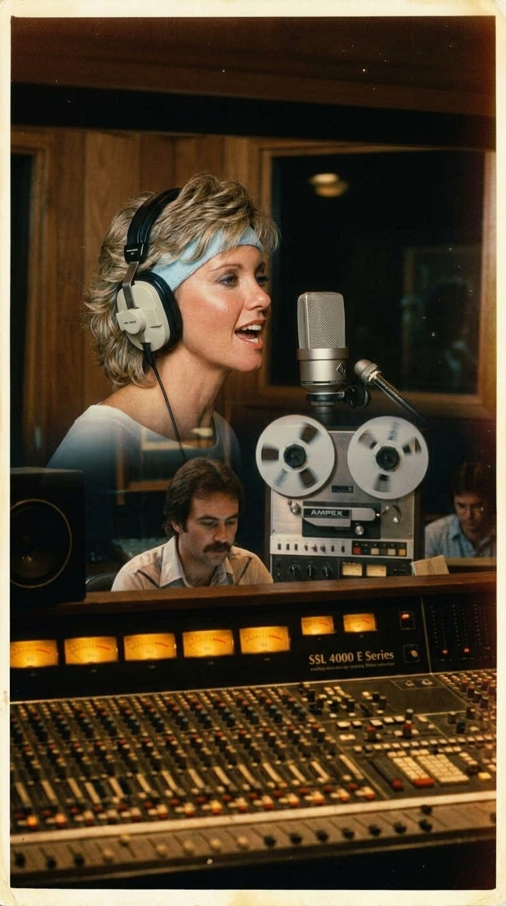
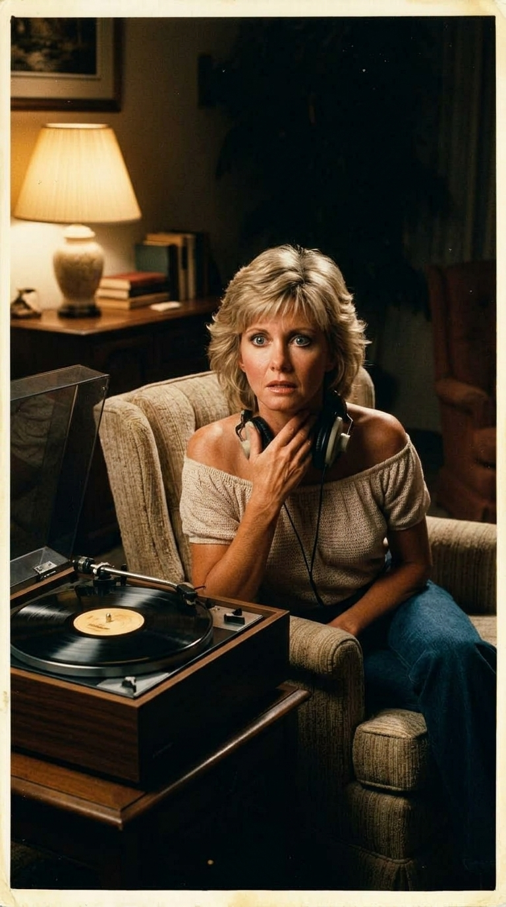
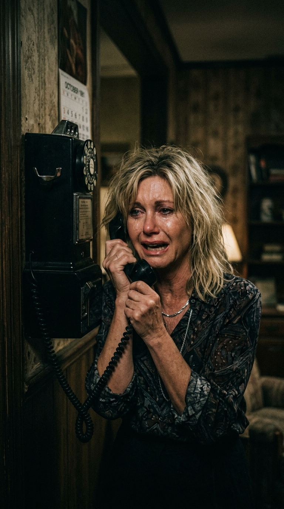
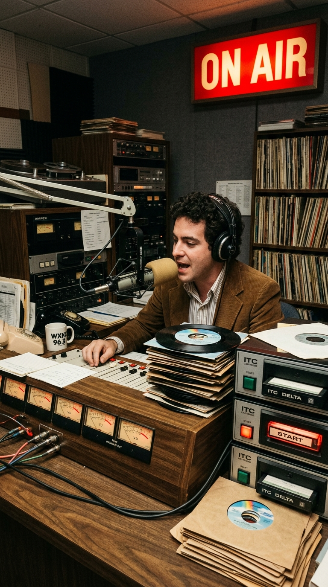
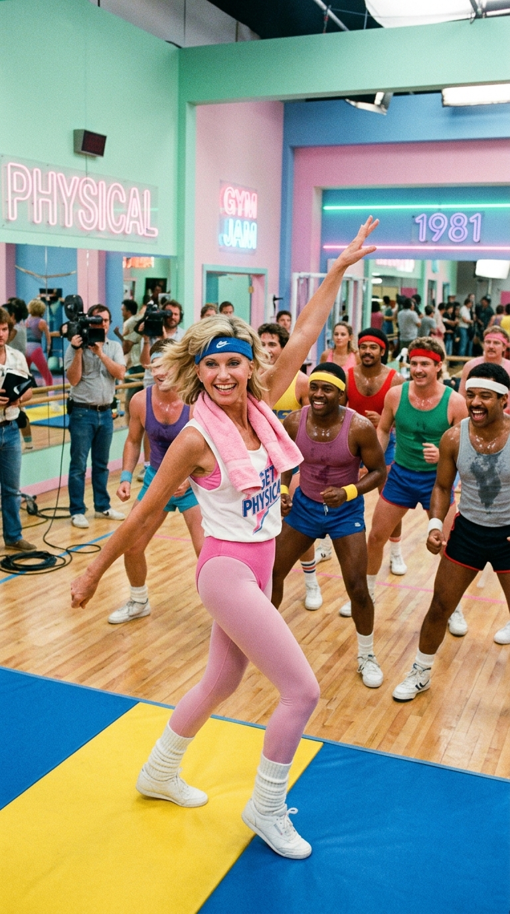

# El Pánico de «Physical»: La Llamada Desesperada que Salvó la Carrera de Olivia Newton-John

> *«There's nothing left to talk about unless it's horizontally... Let's get physical, let me hear your body talk».*

---

## Prólogo: El Mito de la Chica Buena y la Sombra de Sandy

A finales de la década de 1970, el rostro de Olivia Newton-John encarnaba la pureza incontaminada de la cultura popular anglosajona. Tras el fenómeno planetario de *Grease* (1978), donde interpretó a la inocente Sandy Olsson, y una cadena ininterrumpida de números uno en las listas de música country y pop melódico (*«I Honestly Love You»*, *«Have You Never Been Mellow»*, *«Hopelessly Devoted to You»*), su imagen pública era un templo inmaculado. Era la novia de América y la hija predilecta de Australia: dulce, rubia, intachable y protegida por una audiencia familiar que no toleraba la más mínima grieta de provocación.

Sin embargo, al entrar en los años ochenta y rebasar los treinta y dos años, Olivia sentía que aquella jaula de cristal amenazaba con asfixiar su evolución artística. Quería un sonido más visceral, contemporáneo y bailable. Lo que jamás imaginó fue que la búsqueda de esa madurez la colocaría al borde de un ataque de pánico que casi la lleva a destruir el mayor éxito comercial de toda su vida.

---

## Acto I: La Canción Huérfana que Rod Stewart Descartó

En 1981, los compositores británicos Steve Kipner y Terry Shaddick se encontraban en Los Ángeles trabajando en una maqueta con un ritmo electrónico implacable, impulsado por una línea de bajo sintetizado y guitarras rítmicas de corte funky. La canción, titulada provisionalmente *«Physical»*, había sido escrita con un tono descarado, machista y callejero. Su destinatario original era Rod Stewart, el arquetipo del rockstar seductor británico; más tarde se pensó en Tina Turner. Pero ambos la descartaron.

Fue entonces cuando el productor y confidente musical de Olivia, John Farrar, escuchó la maqueta. Farrar intuyó que el contraste entre aquella base bailable arrolladora y la voz cristalina de Olivia podía ser dinamita pura. En los estudios de grabación de Sunset Sound en Los Ángeles, Olivia se colocó frente al micrófono y registró las pistas vocales, dejándose llevar por la energía del tema sin reparar demasiado en la lectura literal de los versos.

---

## Acto II: El Pánico de Medianoche y la Llamada a Lee Kramer

La crisis estalló días después de que la mezcla final quedara terminada y las cintas máster fueran enviadas a los cuarteles generales de MCA Records. Sola en el salón de su residencia en Malibú, Olivia colocó el acetato de prueba en su tocadiscos de alta fidelidad. 

Al escuchar la canción en el silencio de su hogar, las palabras resonaron como una sentencia implacable:

> *«There's nothing left to talk about unless it's horizontally... Let's get physical, let me hear your body talk».*  
> *(«Ya no queda nada de qué hablar a menos que sea en posición horizontal... Pasemos a lo físico, déjame oír a tu cuerpo hablar»).*

El impacto psicológico fue demoledor. Olivia se vio a sí misma destrozando de un plumazo una década de devoción familiar. El puritanismo reinante en la era Reagan en Estados Unidos y la moral ultraconservadora no perdonarían jamás semejante invitación sexual descarada. Presa de una angustia incontrolable, tomó el teléfono en mitad de la noche y llamó a su manager y entonces pareja sentimental, Lee Kramer.

Entre sollozos y con la respiración entrecortada, Olivia le rogó:  
—*«¡Lee, por favor, detén el disco! ¡Llama a la discográfica y retira las copias de las radios inmediatamente! ¡Es demasiado obsceno, no puedo sacar esto al mundo! ¡Va a arruinar mi carrera para siempre!»*.

Kramer intentó calmarla, pero la realidad industrial era inflexible: el single ya había salido de las fábricas de prensado, los programadores de radio ya tenían las copias promocionales y el ritmo bailable estaba empezando a encender las líneas telefónicas de las emisoras. La canción no se podía frenar.

---

## Acto III: La Jugada Maestra del Gimnasio y la Censura Real

Frente al abismo del escándalo, Olivia y su equipo entendieron que solo había una forma de salvar la situación: cambiar radicalmente el contexto de la palabra «físico». Si la letra hablaba de la cama, la pantalla tenía que hablar de sudor, esfuerzo y ejercicio aeróbico.

Junto al director británico Brian Grant, concibieron un concepto visual satírico, colorista y desenfadado. En lugar de una atmósfera íntima o seductora, situaron a Olivia en un gimnasio de estética pop con mallas de colores pastel, camisetas amplias de hombro caído y la icónica cinta elástica en la frente. En el video, una enérgica Olivia intentaba poner en forma a un grupo de hombres con evidente sobrepeso, rodeada de duchas, pesas y máquinas de ejercicio. 

El golpe de timón visual fue una genialidad de relaciones públicas: la provocación sexual se camufló de comedia deportiva y empoderamiento fitness.

Aun así, la controversia fue inevitable:
- Varias estaciones de radio conservadoras en Utah (como KSL-AM) y emisoras del *Bible Belt* prohibieron la emisión de la canción por considerarla «inmoral y contraria a los valores familiares».
- Dos emisoras dependientes de la BBC en el Reino Unido vetaron el tema en sus franjas diurnas.
- El final del videoclip —donde dos de los culturistas se marchan de la mano hacia las duchas dejando a Olivia perpleja— provocó que varias cadenas regionales de televisión en EE. UU. y la televisión pública de Sudáfrica censuraran el metraje.

---

## Acto IV: Diez Semanas en el Olimpo de Billboard

En lugar de destruir su carrera, la polémica actuó como un propulsor atómico. La combinación del video hilarante, el bajo demoledor y el morbo latente de la letra convirtió a *«Physical»* en un tifón sociológico.

En noviembre de 1981, el tema alcanzó el puesto número uno del *Billboard Hot 100*. Y allí permaneció durante **diez semanas consecutivas**, un récord que ninguna canción había logrado desde los tiempos dorados de los Beatles y que se mantuvo como la marca absoluta durante toda la década. 

El álbum homónimo vendió más de diez millones de copias en todo el mundo, ganó el premio Grammy al Mejor Video del Año y redefinió la cultura estética de los años ochenta: la moda del fitness, los calentadores de lana y las cintas fluorescentes pasaron de los gimnasios californianos al vestuario cotidiano de millones de personas en los cinco continentes.

---

## Epílogo: El Legado Inmortal de una Leyenda Valiente

Años más tarde, ya consagrada como una de las figuras más respetadas y queridas de la historia de la música, Olivia recordaba con una sonrisa pícara aquel ataque de pánico nocturno:

> *«Pensé que mi carrera se había terminado. Estaba aterrorizada de lo que dirían mis fans y mi madre. Pero al final, fue la decisión más liberadora que tomé en mi vida. Me permitió dejar de ser la eterna niña buena y convertirme en una mujer dueña de su propio destino».*

La canción que Olivia Newton-John intentó retirar llorando a medianoche terminó siendo proclamada por la revista *Billboard* como **el single más exitoso de toda la década de 1980**, demostrando que a veces el mayor triunfo de un artista reside en el valor de saltar al vacío precisamente cuando el miedo amenaza con paralizarlo.

---

### 📚 Fuentes y Archivo Documental
1. **Newton-John, Olivia.** *Don't Stop Believin'*. Gallery Books / Simon & Schuster, 2019. (Autobiografía oficial, memorias sobre la grabación y pánico inicial ante «Physical»).
2. **Kipner, Steve & Shaddick, Terry.** *The Making of Physical: Interviews on Songwriting and Rod Stewart's Rejection*. Billboard Magazine Archives, 1982 / 2011.
3. **Grant, Brian.** *Directing the 80s: How the Physical Video Changed MTV and Aerobics Culture*. Sound & Vision Retrospective, 2018.
4. **Billboard Magazine.** *Billboard Hot 100 Chart Archives (November 1981 – January 1982: 10 Weeks at #1) y All-Time 80s Hot 100 Ranking*.
5. **The New York Times & Los Angeles Times.** *Censorship and the Rise of Fitness Pop in Reagan's America*. Artículos de prensa, noviembre de 1981.
6. **MCA Records / EMI Records.** *Physical (MCA-5229)*. Fichas de producción de estudio Sunset Sound y notas discográficas oficiales, Depósito Legal 1981.
