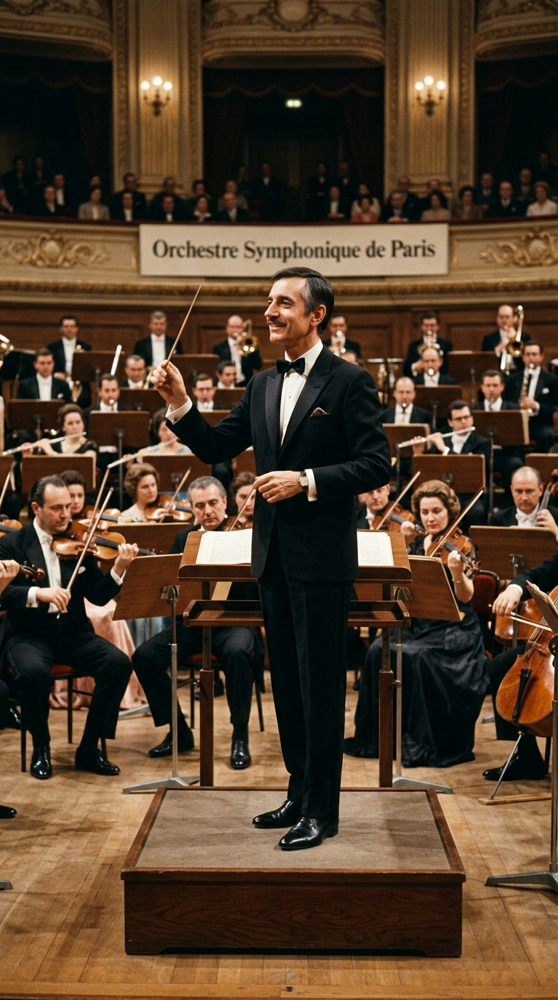
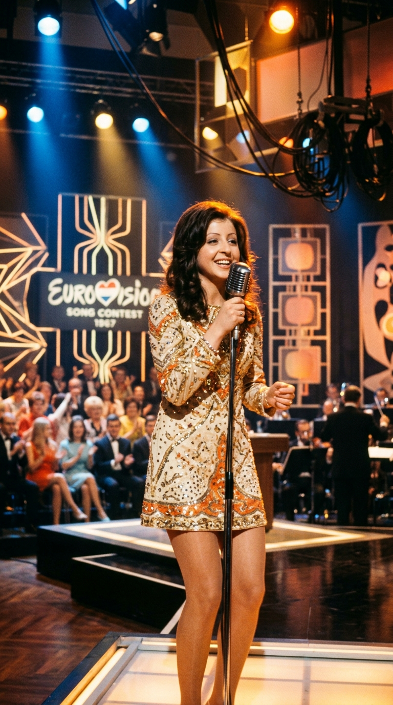
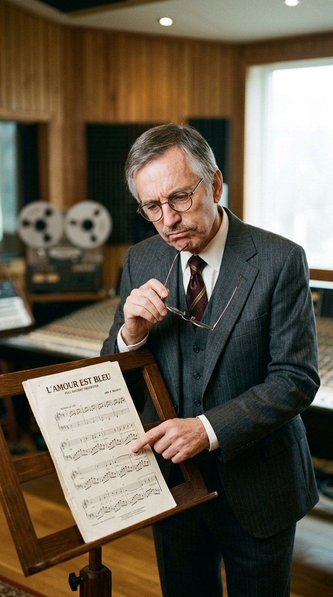
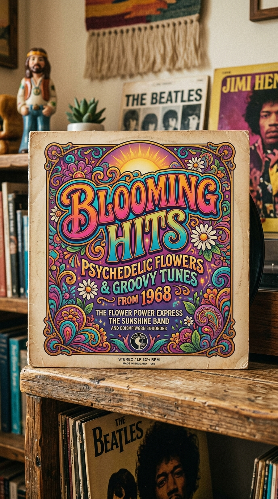
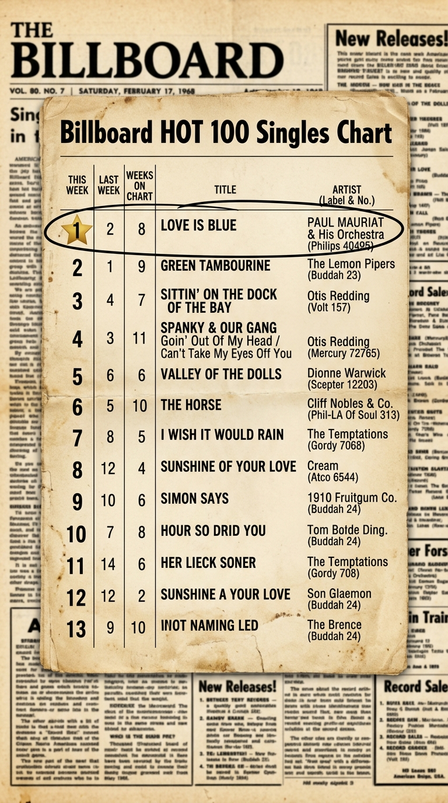
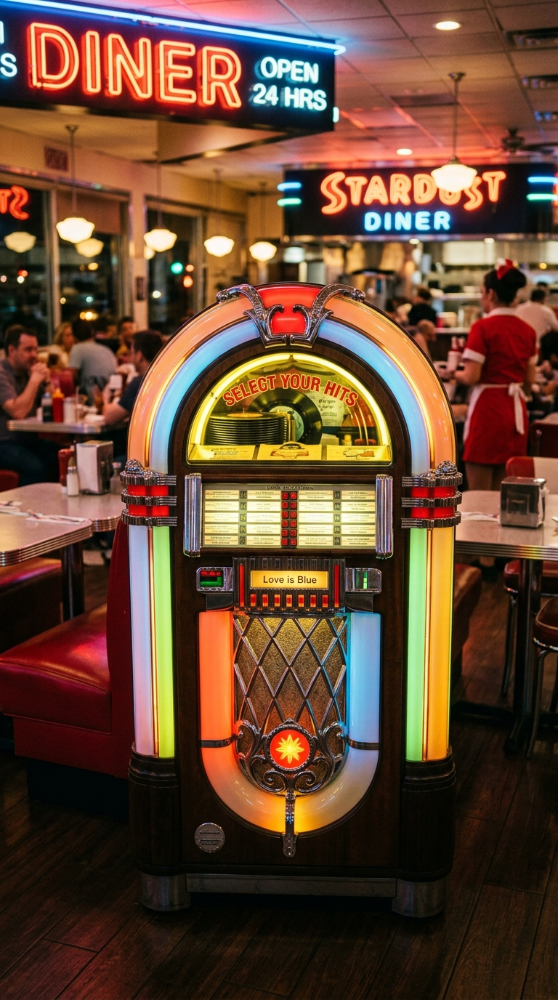

# 🌊 La Gloria No Deseada: Cómo el Director Francés que Despreciaba su Canción Conquistó el Número Uno de América

> *«Ni siquiera quería grabarla. Me parecía una melodía menor, ligera y sin ningún misterio. La incluí en el disco a última hora solo para rellenar los tres minutos que faltaban en la cara B del vinilo. Y esa misma tontería que casi tiro a la basura terminó marcando el resto de mi vida entera.»*  
> — **Paul Mauriat**, recordando el insólito fenómeno de *«Love is Blue»*, 1968.

---

*París, 1967: El clavecín barroco grabado a regañadientes por un maestro de orquesta francés que se convirtió en el bálsamo pacífico de un país desgarrado por la guerra de Vietnam.*

---

### Prólogo: La derrota discreta de Viena

La noche del sábado **8 de abril de 1967**, el suntuoso Palacio Imperial de Hofburg en Viena albergaba la duodécima edición del **Festival de la Canción de Eurovisión**. Entre los diecisiete países competidores, una jovencísima cantante griega de apenas diecisiete años llamada **Vicky Leandros**, vestida de riguroso luto y representando al Gran Ducado de Luxemburgo, subió al escenario para interpretar una balada melancólica titulada **«L'amour est bleu»** («El amor es azul»), con música del compositor francés **André Popp** y letra de **Pierre Cour**.

A pesar de su elegancia poética —donde cada color del arcoíris describía los estados fluctuantes del amor y la tristeza—, la canción pasó sin pena ni gloria por el certamen. Cuando los jurados emitieron sus votos, la alegre cantante británica Sandie Shaw arrasó con el tema *«Puppet on a String»*, relegando a la balada luxemburguesa a un discreto **cuarto lugar**.

Para el mercado musical europeo, el destino de *«L'amour est bleu»* parecía sellado: sería otra de las miles de canciones olvidadas que terminaban sepultadas en los archivos de la televisión continental. 

Nadie en aquella elegante sala austriaca podía sospechar que, apenas unos meses más tarde, aquella melodía descartada cruzaría el Atlántico para lograr una hazaña jamás igualada por ningún otro músico en la historia de Francia.

---

### Acto I: El relleno contractual en los estudios de París

A finales de 1967, en los estudios de Philips Records en París, el prestigioso director de orquesta y arreglista **Paul Mauriat** ultimaba las pistas de su nuevo álbum instrumental, *Blooming Hits*.

Mauriat no era un producto prefabricado de la industria del pop: era un músico de formación clásica rigurosa en el Conservatorio de Marsella, un intelectual del sonido que había dedicado años de su vida a dirigir y orquestar las obras cumbre de leyendas de la *chanson* francesa como **Charles Aznavour** y **Mireille Mathieu**. 

Cuando el disco estaba prácticamente cerrado, el director de la discográfica se acercó a la cabina con una advertencia logística: faltaba exactamente **una pista** para alcanzar los once temas reglamentarios y completar la duración técnica exigida para el prensado del disco de vinilo. 

El ejecutivo deslizó sobre el atril la partitura de *«L'amour est bleu»*, sugiriéndole que grabara una versión instrumental rápida.

Mauriat arrugó el ceño. Consideraba que la melodía de Popp era simplona, predecible y carente del peso armónico que él exigía a sus producciones.

—*«Es una pieza intrascendente. No tiene alma»*, protestó Mauriat con su habitual franqueza marsellesa. *«No me gusta y no quiero ensuciar el álbum con música ligera de festival.»*

Sin embargo, apremiado por los plazos de entrega y la insistencia de la compañía, Mauriat aceptó el encargo a regañadientes, con una sola condición: adaptaría la pieza a su propio lenguaje sónico.

---

### Acto II: El clavecín barroco y el bálsamo de una nación herida

En lugar de limitarse a una lectura orquestal tradicional de música de ascensor, el instinto de arreglista de Mauriat obró un milagro de diseño acústico.

Para llevar la voz cantante de la melodía, descartó los violines solistas y decidió utilizar un instrumento poco habitual en el pop comercial: un **clavecín eléctrico** (*harpsichord*). Al pulsar las teclas con un punteo ágil, seco y brillante, el instrumento evocaba la música cortesana del barroco europeo del siglo XVIII, pero sostenido por una base rítmica moderna: un bajo pulsante, platillos suaves y una sección de cuerdas majestuosa que ascendía y descendía como las olas de un mar en calma.

Aquel híbrido entre la música clásica barroca y la calidez del pop sesentero —lo que los críticos bautizaron como *Baroque Pop*— transformó la melodía en algo hipnótico, cristalino y dotado de una paz casi terapéutica.

Mauriat entregó la cinta, cobró sus honorarios de sesión y se olvidó por completo del asunto, convencido de que la pista se perdería en la cara B del vinilo.

Pero a miles de kilómetros de distancia, al otro lado del océano, Estados Unidos atravesaba uno de los inviernos más traumáticos y violentos de su historia moderna.

En los primeros meses de **1968**, la sociedad estadounidense se desangraba: la sangrienta Ofensiva del Tet en la guerra de Vietnam copaba los informativos con imágenes de ataúdes y helicópteros en llamas, las ciudades ardían en disturbios raciales y una sensación de angustia y fractura generacional dominaba el país. Las radios comerciales estaban saturadas por el rock psicodélico estridente de Jimi Hendrix o las crónicas de protesta juvenil.

Una tarde de diciembre de 1967, un programador de radio de una pequeña emisora de Minneapolis pinchó casualmente el corte instrumental de Mauriat. 

Lo que ocurrió a continuación fue un fenómeno sociológico espontáneo: la centralita telefónica de la emisora colapsó con llamadas de oyentes desesperados preguntando por aquella música misteriosa. La emisora hermana WLS de Chicago se sumó a la rotación, y en pocos días estaciones de costa a costa comenzaron a emitir la canción sin descanso.

Para millones de familias estadounidenses agobiadas por el luto, las noticias de soldados caídos y el caos en las calles, aquel clavecín transparente y aquellas cuerdas reconfortantes funcionaron como un bálsamo celestial, un refugio de serenidad absoluta en medio de la tormenta.

---

### Acto III: El récord histórico de Billboard

El ascenso comercial de **«Love is Blue»** fue fulminante e histórico.

El **10 de febrero de 1968**, la versión instrumental de Paul Mauriat alcanzó el **puesto número uno del Billboard Hot 100**, la lista de éxitos más influyente del planeta, desbancando a superestrellas mundiales como The Beatles, The Temptations y Aretha Franklin. 

La canción permaneció en la cima durante **cinco semanas consecutivas**, vendiendo más de **dos millones de discos** en Estados Unidos y alcanzando también el número uno en la lista de ventas de álbumes de Billboard. 

Con aquel hito, Paul Mauriat inscribió su nombre con letras de oro en las enciclopedias musicales: se convirtió en el **primer y único artista francés en toda la historia de la música popular en alcanzar el número uno absoluto del Billboard Hot 100 con un tema instrumental**, un récord legendario que permanece intacto casi seis décadas después.

---

### Epílogo: La dulce maldición de un maestro

Cuando la noticia del número uno llegó a su apartamento en París, Paul Mauriat no pudo evitar una sonrisa de ironía amarga.

Aquel hombre tímido y sobrio, que aspiraba a ser recordado por sus complejas composiciones sinfónicas y sus arreglos operísticos, se vio catapultado a la fama global gracias a los tres minutos de música de relleno que había grabado por puro compromiso comercial.

Durante las siguientes tres décadas, la Orquesta de Paul Mauriat recorrió los auditorios más prestigiosos del planeta. Fue venerado con devoción casi religiosa en **Japón** —donde realizó más de mil doscientos conciertos abarrotando el Nippon Budokan de Tokio año tras año— y en toda América Latina. En cada recital, desde París hasta Buenos Aires, el público se ponía en pie para exigir la misma pieza que el maestro había despreciado en el estudio.

Mauriat aprendió a aceptarlo con elegancia y humildad:

—*«El público es el único dueño de la música»*, reflexionó en una de sus últimas entrevistas. *«A veces, un artista pasa toda su vida buscando una obra maestra y la gente elige un detalle diminuto. Si esa pequeña melodía llevó paz al corazón de alguien en un momento oscuro, entonces mi vida entera como músico ha tenido sentido.»*

---

### Reflexión: La serenidad en medio del ruido

En un mundo ruidoso, saturado de prisas, conflictos y estridencias, a veces la mayor revolución no consiste en gritar más fuerte, sino en ofrecer tres minutos de silencio y belleza cristalina para que el alma humana pueda volver a respirar.

Y a ti, cuando el clavecín de *«Love is Blue»* comienza a desgranar sus notas en el aire, ¿qué remanso de paz y sosiego se abre paso en medio de tu jornada?

---

### 📚 Fuentes y Archivo Documental

* **Billboard Magazine Archives (Febrero-Marzo 1968):** Registros oficiales del Billboard Hot 100 y certificación de ventas de la Recording Industry Association of America (RIAA) para Philips Records.
* **Le Figaro & Le Monde (Hemeroteca 1967-1968):** Crónicas culturales francesas sobre el triunfo insólito de Paul Mauriat en el mercado estadounidense tras Eurovisión.
* **Mauriat, Paul (1998):** *Trente ans d'amour instrumental*. Entrevistas retrospectivas para la televisión pública francesa (ORTF / France 3).
* **Popp, André & Cour, Pierre (1967):** Partitura y registro original de derechos de autor de *«L'amour est bleu»* (Editions Barclay).
