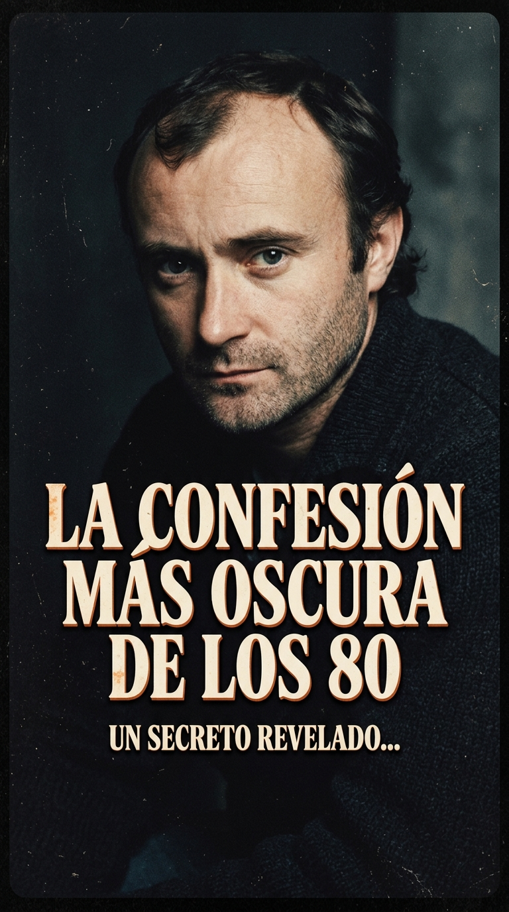
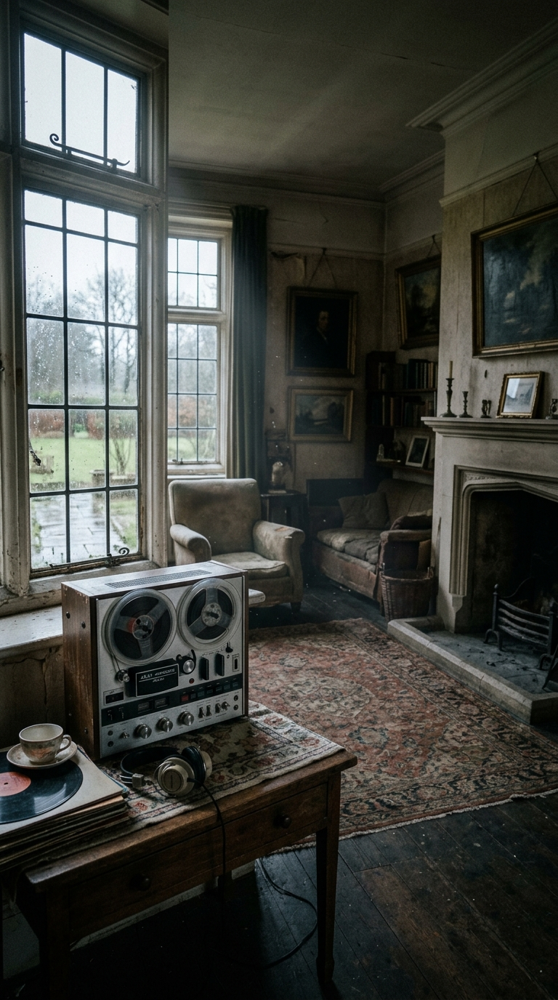
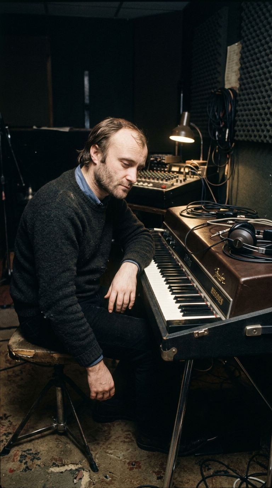
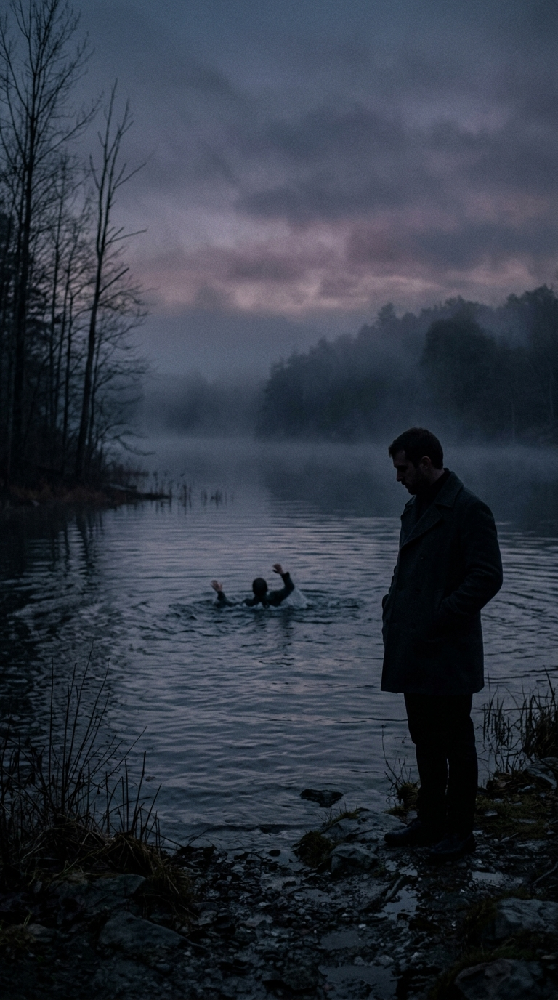
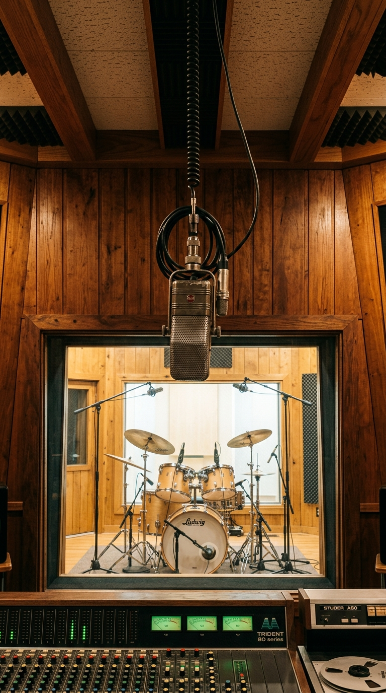

# 🌧️ La Herida en la Niebla: La Verdad Detrás de la Canción más Oscura de los Ochenta y el Redoble que Cambió el Sonido del Rock

> *«No hay ningún hombre ahogándose. No hay ningún testigo misterioso ni una venganza secreta en un concierto. Solo había un tipo desmoronado en una casa vacía, con una grabadora de ocho pistas, una caja de ritmos barata y una pena negra que no me dejaba respirar.»*  
> — **Phil Collins**, desmintiendo la leyenda urbana de *«In the Air Tonight»*, 1981.

---

*Old Croft, Surrey, 1979: El lamento solitario de un hombre quebrado que un accidente técnico en una mesa de mezclas convirtió en el golpe de batería más legendario de la música popular.*

---

### Prólogo: El silencio de una casa vacía

A principios de 1979, el mundo exterior creía que Phil Collins lo tenía todo. Como virtuoso baterista y recién estrenado vocalista de Genesis tras la partida de Peter Gabriel, había logrado lo que parecía imposible: mantener a la legendaria banda de rock progresivo en la cima de las listas mundiales, abarrotando estadios en Europa y América. Pero puertas adentro, la realidad era una ruina humeante.

Su primer matrimonio con Andrea Bertorelli, su amor de juventud a quien conocía desde los once años en las clases de teatro de Londres, había colapsado de manera fulminante. Desesperado por salvar a su familia, Collins canceló de urgencia los compromisos de Genesis y tomó el primer vuelo hacia Vancouver, Canadá, donde Andrea se había marchado con sus dos hijos pequeños, Simon y Joely. Fue inútil. Tras semanas de reproches amargos en habitaciones de hotel gélidas, Collins regresó a Inglaterra con una maleta, el corazón destrozado y la certeza irrevocable de que su hogar había dejado de existir.

Al cruzar el umbral de **Old Croft**, una extensa casona de campo en el pueblo de Shalford, en el condado de Surrey, el silencio lo golpeó como un mazazo físico. Los armarios estaban vacíos, los juguetes de sus hijos ya no decoraban el suelo y la calefacción apagada impregnaba cada habitación de una frialdad espectral. 

Collins tenía veintiocho años, un dolor corrosivo instalado en el pecho y una cantidad abrumadora de tiempo por delante. Para no hundirse en el alcohol ni perder la cordura, decidió transformar el dormitorio principal en un santuario sonoro de supervivencia.

---

### Acto I: Tres acordes, una caja de ritmos y un exorcismo

Sin la presión de los complejos compases matemáticos de Genesis, Collins comenzó a comprar equipos de grabación para trabajar en absoluta soledad. En el centro de la habitación instaló una consola de mezclas **Soundcraft Series Two**, una grabadora de cinta de una pulgada y ocho pistas marca **Brenell**, un piano eléctrico **Fender Rhodes**, un sintetizador **Sequential Circuits Prophet-5** y un aparato que acababa de salir al mercado: la caja de ritmos analógica **Roland CR-78 CompuRhythm**.

Una noche de densa niebla inglesa, Collins encendió la Roland CR-78 y seleccionó un patrón rítmico automatizado: el preset *"Disco-2"*. Para despojarlo de cualquier frivolidad festiva, manipuló los diales de tempo, ralentizando el compás hasta convertirlo en un latido fúnebre, mecánico e hipnótico: *tick-tock, tick-tock*.

Con el pie izquierdo presionando el pedal de sustain de su sintetizador Prophet-5, tocó tres acordes suspendidos que parecían flotar en el éter: **Re menor, Do mayor y Si bemol mayor**. La atmósfera era tan densa que casi podía cortarse con un cuchillo.

Tomó un micrófono, se acercó la cápsula a los labios y pulsó el botón rojo de grabación de la máquina Brenell. No había libreta sobre la consola, ni borradores tachados, ni rimas preconcebidas. Lo que salió de su garganta fue un vómito emocional espontáneo, un torrente de rabia contenida, perplejidad y despecho articulado en tiempo real:

> *«I can feel it coming in the air tonight, oh Lord...  
> And I've been waiting for this moment for all my life, oh Lord...  
> Can you feel it coming in the air tonight? Oh Lord...»*

En los versos siguientes, la amargura se volvía más punzante: *«Si me dijeras que te estás ahogando, no te tendería una mano... He visto tu rostro antes, amigo mío, pero no sé si sabes quién soy... Bueno, puedes limpiarte esa sonrisa, sé dónde has estado... Todo ha sido un puñado de mentiras»*. 

Cuando la cinta se detuvo, Collins comprendió que no había compuesto una canción de pop: había grabado el electrocardiograma de su propio derrumbe.

---

### Acto II: El mito del lago y el ahogado que nunca existió

A medida que la maqueta se filtraba entre los círculos musicales y finalmente vio la luz en enero de 1981, la crudeza casi amenazante de la letra desató una de las leyendas urbanas más extravagantes y duraderas en la historia del rock.

La fábula popular —transmitida de boca en boca antes de la era de internet— aseguraba que, durante su juventud, Phil Collins había sido testigo presencial de cómo un amigo cercano se ahogaba en un lago profundo. Según el mito, había un segundo hombre en la orilla que disponía de una cuerda o una barca, pero que se negó fríamente a intervenir, dejando morir al muchacho ante los ojos impotentes del cantante. La historia concluía con un clímax digno de una película de suspenso psicológico: Collins, tras convertirse en estrella, habría contratado detectives privados para localizar al hombre, le habría enviado una entrada de primera fila para un concierto masivo y, en mitad de la noche, habría apagado las luces del estadio para proyectar un foco implacable sobre su rostro mientras cantaba *«In the Air Tonight»* señalándolo con el dedo.

La leyenda caló tan hondo en el inconsciente colectivo que dos décadas más tarde el propio rapero **Eminem** la inmortalizó en su célebre tema *«Stan»* (2000): *«¿Sabes esa canción de Phil Collins, 'In the Air of the Night', sobre ese tipo que pudo haber salvado al otro de ahogarse pero no lo hizo, y Phil lo vio todo y luego en su concierto lo encontró?»*.

La realidad, sin embargo, era infinitamente más humana y desgarradora. 

—*«No hay ningún lago, no hay ningún ahogado y jamás he confrontado a nadie bajo un foco»*, explicaría Collins años más tarde con una sonrisa resignada. *«El ahogado era una metáfora involuntaria. El que se estaba ahogando era yo. La persona a la que le cantaba no era un criminal misterioso; era mi esposa, que se había marchado, y la ira ciega de un hombre que sentía que su vida entera se desvanecía en el aire sin que nadie hiciera nada por rescatarlo.»*

---

### Acto III: El micrófono de intercomunicación y el estruendo de piedra

Pero si la letra de *«In the Air Tonight»* encerraba un drama humano demoledor, su resolución musical estaba destinada a cambiar la física del sonido en la década de los ochenta. Y como suele ocurrir con los hitos más trascendentes de la música, todo ocurrió gracias a un accidente tecnológico fortuito.

Meses antes, a finales de 1979, Collins había acudido a los estudios **The Town House** (situados en Goldhawk Road, en el barrio londinense de Shepherd's Bush) para grabar baterías en el tercer álbum en solitario de su excompañero **Peter Gabriel** (*Peter Gabriel III*, popularmente conocido como *Melt*), producido por **Steve Lillywhite** y con el joven ingeniero de sonido **Hugh Padgham** a los mandos.

Gabriel había impuesto una regla estricta para el disco: quedaba terminantemente prohibido utilizar platillos de bronce; solo se permitían toms, cajas y bombos de piel. Para aislar el sonido acústico, instalaron la batería en el legendario **Studio 2** de Town House: una habitación monumental revestida de arriba abajo con paredes de piedra maciza y suelo de madera dura, diseñada para reflejar el eco natural con una brillantez cortante.

En la sala de control reinaba la última joya tecnológica de la época: una mesa de mezclas **Solid State Logic (SSL) 4000 B Series**. Aquella consola incorporaba un sistema de comunicación interna: un micrófono omnidireccional (el STC 4021, apodado cariñosamente *"la manzana"*) colgado del techo de la sala de piedra para que los ingenieros pudieran escuchar lo que hablaban los músicos entre toma y toma. Para que el sonido de la sala no metiera ruido de fondo continuo, el circuito de ese micrófono estaba conectado a un compresor extremadamente agresivo y a una compuerta de ruido (*noise gate*).

Una tarde, mientras Collins afinaba su batería **Gretsch**, Hugh Padgham pulsó por error el botón de escucha (*listen mic*) mientras Phil golpeaba los toms con toda su fuerza física.

Lo que salió por los monitores principales de la sala de control paralizó a todos los presentes.

El compresor de la SSL aplastaba el golpe de los toms contra las paredes de piedra, amplificando el aire y la pegada con un volumen sísmico colosal, pero en una fracción de milisegundo, cuando el volumen caía por debajo del umbral, la compuerta digital cerraba el canal en seco: *¡BOOM-shhh!*... silencio absoluto. No había cola de eco tradicional, ni desvanecimiento progresivo. Era un trueno gigante decapitado por una guillotina de precisión.

Padgham y Lillywhite se miraron atónitos. Supieron al instante que habían tropezado con el santo grial de la percusión moderna. Modificaron las conexiones de la consola para poder rutear la señal de ese micrófono de comunicación directamente a las pistas de la grabadora de cinta de 24 canales.

Cuando Collins comenzó a grabar las pistas definitivas de su álbum debut, *Face Value* (1981), convocó a Hugh Padgham a Town House. La estructura de *«In the Air Tonight»* fue diseñada con una audacia psicológica magistral: durante **tres minutos y quince segundos**, la canción somete al oyente a una tortura de tensión minimalista, sostenida únicamente por el murmullo de la Roland CR-78, los acordes fantasmagóricos del Prophet-5 y la voz susurrada de Collins.

Y entonces, en el minuto **3:16**, la presa cede.

Con una ferocidad casi animal, los palillos de Phil Collins caen sobre los toms de la batería Gretsch:

> **«Dum-dum, dum-dum, dum-dum, dum-dum... CHACK-CHACK!»**

El redoble más demoledor, catártico e imitado en la historia de la música popular acababa de nacer. El estallido no solo liberaba toda la bilis y el veneno que Collins llevaba acumulados en el cuerpo; detonaba una revolución estética que gobernaría las baterías del rock y el pop planetario durante toda la década de los ochenta: desde Bruce Springsteen y Duran Duran hasta Madonna y Tears for Fears.

---

### Epílogo: El Ferrari negro y la inmortalidad nocturna

Lanzado como el sencillo de debut en solitario de Collins el **5 de enero de 1981**, *«In the Air Tonight»* trepó al número dos en las listas británicas y conquistó las radios de todo el planeta. 

Tres años más tarde, en el otoño de 1984, el director de cine Michael Mann utilizó la canción en una secuencia icónica del episodio piloto de la serie de televisión **Miami Vice**: los detectives Sonny Crockett y Ricardo Tubbs conduciendo un Ferrari Daytona negro por las avenidas desiertas y húmedas de Miami en plena madrugada, bajo la luz de los neones y el pulso implacable de la batería de Collins. Aquella escena transformó para siempre la relación entre la narrativa cinematográfica y la música pop.

Mucho más que un éxito de ventas o un truco de ingeniería en una mesa SSL, *«In the Air Tonight»* permanece en la memoria cultural como el testimonio supremo de cómo un artista puede descender a las profundidades de su propia humillación privada, recoger los pedazos rotos de su vida y forjar con ellos un monumento sonoro imperecedero.

---

### Reflexión: El pulso que aguarda en la oscuridad

El dolor es una experiencia universal, pero pocos seres humanos han logrado capturar el momento exacto en que la tristeza silenciosa se transforma en un grito ensordecedor de redención. 

Y a ti, cuando los tres minutos de susurro llegan a su fin, ¿qué recuerdos o heridas te despierta ese redoble visceral que sacude la noche?

---

### 📚 Fuentes y Archivo Documental

* **Collins, Phil (2016):** *Not Dead Yet: The Autobiography*. Crown Archetype / Century. Memorias oficiales donde se documenta con precisión la ruptura matrimonial en Shalford y las sesiones caseras en Old Croft.
* **Sound on Sound Magazine (Archives, 2005):** *Classic Tracks: Phil Collins 'In the Air Tonight'*. Entrevista técnica en profundidad con el ingeniero y coproductor Hugh Padgham sobre el descubrimiento del *gated reverb* en la mesa SSL 4000B de The Town House.
* **Flans, Robyn (1983):** *Phil Collins: The Solo Drummer*. Modern Drummer Magazine, edición de noviembre. Análisis del set Gretsch y la configuración percusiva de *Face Value*.
* **Bowler, Dave & Dray, Bryan (1992):** *Genesis: A Biography*. Sidgwick & Jackson. Documentación histórica sobre la pausa sabática de Genesis en 1979 y el viaje a Vancouver.
* **Billboard & Official Charts Company (1981-1984):** Registros históricos de posicionamiento en listas internacionales y certificación de ventas de Virgin Records / Atlantic Records.
