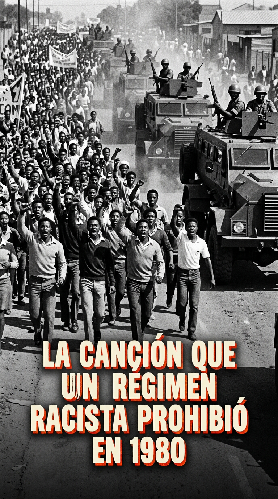
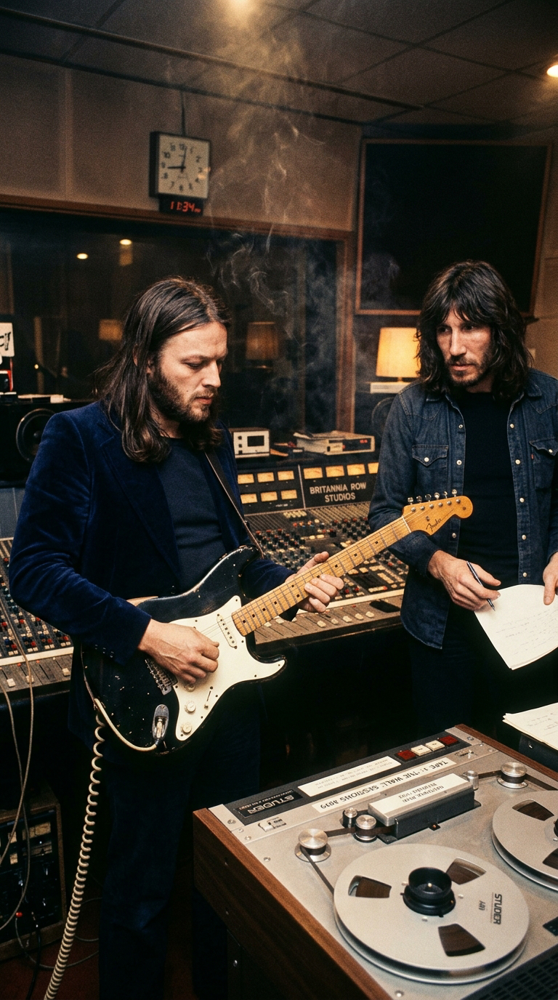
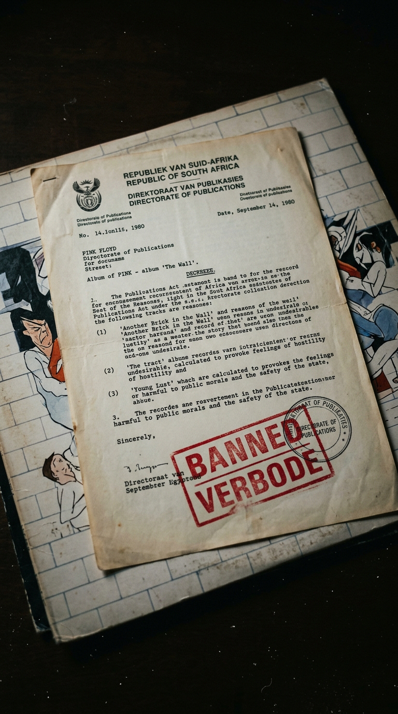
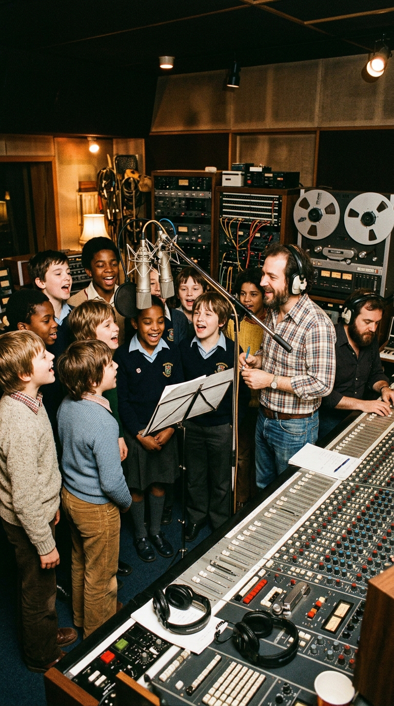
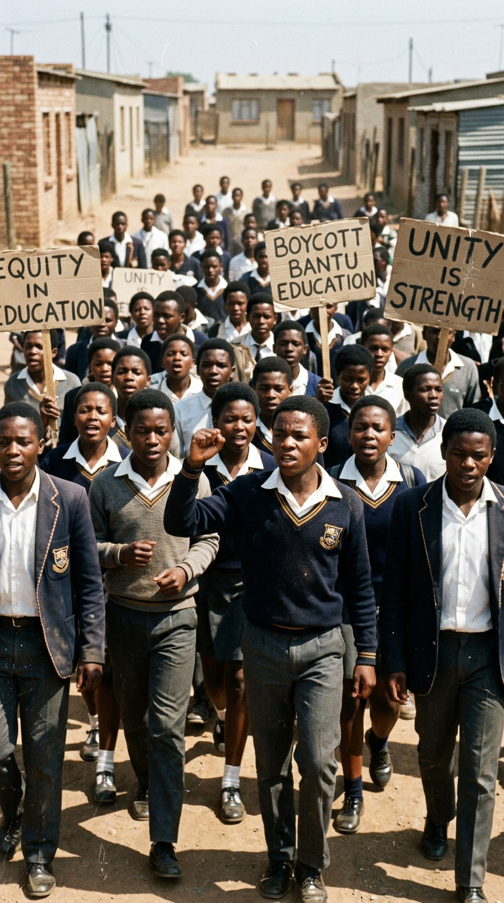
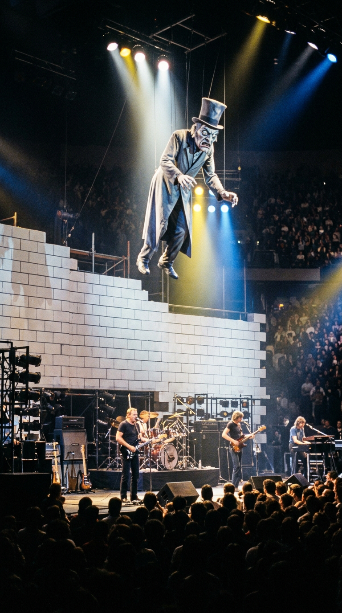

# 🧱 El Motín de las Aulas: Cómo 23 Niños Clandestinos Crearon el Himno que Aterrorizó a un Régimen

> *«La educación en la Inglaterra de posguerra no buscaba iluminar a los niños, sino doblegarlos. Te golpeaban con reglas de madera, te humillaban frente a tus compañeros y te enseñaban a callar. 'Another Brick in the Wall' no era una rebelión contra el conocimiento: era un grito de guerra contra los tiranos que se disfrazaban de maestros.»*  
> — **Roger Waters**, sobre las raíces autobiográficas de *The Wall*, Londres, 1979.

---

*Britannia Row Studios, Londres, 1979: La insólita conspiración sonora donde un ritmo bailable, una guitarra prestada y un coro de colegiales sin permiso estatal dieron origen al único número uno mundial de Pink Floyd.*

---

### Prólogo: Las cicatrices de Cambridge y la herida de la tiza

A finales de la década de **1970**, Gran Bretaña se desmoronaba entre huelgas de basureros, apagones industriales y un invierno de descontento que enterraba las últimas cenizas del optimismo sesentero. Encerrado en los estudios **Britannia Row**, en el barrio obrero de Islington (norte de Londres), **Roger Waters** no miraba al presente; miraba hacia las sombras de su propia infancia.

En su memoria permanecían intactos los ecos de la *Cambridgeshire High School for Boys* de finales de los años cuarenta y principios de los cincuenta. Allí, una casta de profesores autoritarios, endurecidos por los traumas no resueltos de la Segunda Guerra Mundial y armados con varas de fresno, ejercían una pedagogía basada en el sarcasmo punitivo y la demolición sistemática de la individualidad. Para Waters —cuyo padre, Eric Fletcher Waters, había muerto en el frente de Anzio en 1944 cuando él apenas era un bebé de cinco meses—, la figura de la autoridad masculina siempre había estado ligada a la imposición, la frialdad y el castigo.

*Britannia Row Studios, 1979: Waters y Gilmour analizan las cintas maestras de un álbum conceptual concebido como un exorcismo colectivo contra la alienación.*

En el monumental tapiz conceptual de *The Wall*, la escuela no era un mero escenario anecdótico: era la segunda gran hilera de ladrillos que el protagonista, Pink, levantaba para aislarse de un mundo hostil. Sin embargo, en el verano de 1979, el tema destinado a retratar ese trauma escolar, titulado provisionalmente *«Another Brick in the Wall (Part 2)»*, estaba a punto de ser descartado o relegado a un interludio menor. 

Duraba escasamente **un minuto y veinte segundos**. Tenía una sola estrofa acústica, un coro escueto y un ritmo monótono que la banda consideraba una simple transición entre canciones. Fue entonces cuando un productor foráneo, contratado para mediar en las tormentosas relaciones internas de la banda, decidió dinamitar las reglas sagradas del rock progresivo.

---

### Acto I: El sacrilegio del compás 4/4 y el desafío de Bob Ezrin

El joven productor canadiense **Bob Ezrin** —famoso por sus trabajos viscerales con Alice Cooper, Lou Reed y KISS— llegó a Londres con una misión suicida: transformar las cuarenta maquetas desordenadas y fúnebres de Roger Waters en un disco doble capaz de competir en las listas comerciales sin perder su filo artístico.

Al escuchar la maqueta preliminar de *«Part 2»*, Ezrin intuyó de inmediato que bajo aquella melodía fúnebre latía un potencial volcánico. Pero para liberarlo, propuso una herejía impensable: acelerar el tempo a **100 pulsaciones por minuto** e incorporar el pulso bailable del compás **4/4 con bombo a negras**, inspirado directamente en el sonido *disco-funk* que reinaba en las pistas de baile de Nueva York con la banda Chic de Nile Rodgers.

> *«Cuando le dije a la banda que debíamos meter una base bailable, David Gilmour me miró como si me hubiera vuelto loco»*, recordaría Bob Ezrin años más tarde. *«Me dijo: '¡Eso no es Pink Floyd! Nosotros no hacemos música de discoteca'. Le respondí que el ritmo disco no era el fin, sino el caballo de Troya para que el mensaje penetrara en la juventud»*.

*La cabina de Britannia Row: Ajustando los compresores y ecualizadores para fusionar el bajo pulsante de Waters con una cadencia bailable sin precedentes en la banda.*

Ezrin convenció a David Gilmour para que fuera una noche al club nocturno *Embassy* de Mayfair a escuchar cómo sonaba la producción de música disco en un sistema de sonido de alta fidelidad. Gilmour volvió al estudio impresionado por la pegada física de las frecuencias graves y aceptó construir una base rítmica implacable: el baterista Nick Mason fijó un tempo metronómico y Waters grabó una línea de bajo elástica y tensa sobre su Fender Precision.

Aun así, la estructura seguía siendo diminuta. Ezrin insistió:  
*—Roger, este tema necesita dos estrofas completas y dos coros. No puede terminar en un minuto.*  
*—¡No voy a escribir más letra!* —bramó Waters tajante—. *La canción dice exactamente lo que tiene que decir.*  
*—Está bien* —replicó Ezrin con calma maquiavélica—. *Si tú no vas a cantar la segunda estrofa, haré que la cante un coro de niños.*

Waters se marchó del estudio dando un portazo, convencido de que la idea era una extravagancia que jamás llegaría a materializarse.

---

### Acto II: La misión clandestina: 23 colegiales en Britannia Row

Con la banda ausente, Bob Ezrin llamó al ingeniero de sonido británico **Nick Griffiths** y le encomendó una misión urgente:  
*«Necesito un coro escolar con acento proletario del norte de Londres. No quiero niños de academia de canto ni voces líricas refinadas de iglesia. Quiero niños de la calle, que suenen desafiantes, rebeldes y auténticos»*.

Griffiths cruzó a pie la calle Essex Road y entró en la vecina **Islington Green School**, un colegio estatal de educación secundaria conocido por su alumnado multiétnico y de clase trabajadora. Allí buscó a **Alun Renshaw**, un profesor de música joven, carismático y heterodoxo, que solía enseñar a sus alumnos canciones populares y pop en lugar de conformarse con el rígido repertorio clásico del programa oficial.

*Britannia Row, octubre de 1979: Alun Renshaw reúne a su clase frente a los micrófonos Neumann, grabando estrofa por estrofa a espaldas de la dirección del colegio.*

La propuesta era tan tentadora como peligrosa. La directora del centro, Margaret Maden, era una figura estricta y tradicional que jamás habría autorizado a sus estudiantes faltar a clases para colaborar en el disco de una banda de rock famosa por sus excesos lisérgicos y sus críticas institucionales. Renshaw tomó una decisión audaz: aprovechó la hora del recreo y del almuerzo para trasladar en pequeños grupos a **veintitrés alumnos de entre trece y quince años** al interior de los estudios Britannia Row, a menos de quinientos metros del patio escolar.

Durante cuarenta minutos de adrenalina pura, Griffiths colocó micrófonos de condensador Neumann U87 frente a los muchachos. La letra, escrita a mano en una pizarra de tiza, desafiaba todas las normas de la gramática inglesa con su célebre doble negación:

> *«We don't need no education...*  
> *We don't need no thought control...*  
> *No dark sarcasm in the classroom...*  
> *Teachers, leave them kids alone!»*  
> *(«No necesitamos ninguna educación...*  
> *No necesitamos ningún control del pensamiento...*  
> *Ningún sarcasmo oscuro en el aula...*  
> *¡Maestros, dejen a los chicos en paz!»)*

Los niños no necesitaban fingir. Aquel grito condensaba el hastío real acumulado durante años de reprimendas, uniformes desgastados y platos grasientos en el comedor escolar. Cantaron con una fuerza visceral, arrastrando las vocales con el acento áspero del East End londinense. 

Cuando los colegiales regresaron a sus aulas antes de que la campana delatora delató su ausencia, Griffiths se quedó a solas en la sala de control. Utilizó una técnica legendaria de doblaje (*overdubbing*): copió la pista vocal de los veintitrés niños y la reprodujo **veinticuatro veces en la grabadora multipista**, desfasando milimétricamente cada capa con reverberación de placas EMT. El resultado sonoro fue sobrecogedor: los veintitrés alumnos se habían multiplicado hasta sonar como un **ejército enfurecido de cientos de niños marchando al unísono contra el sistema**.

---

### Acto III: El solo de la Goldtop y el estallido del escándalo

Cuando Roger Waters y David Gilmour regresaron al estudio y Ezrin deslizó los atenuadores de la consola para reproducir la cinta combinada, la habitación quedó en silencio sepulcral.

Waters, con los ojos muy abiertos, esbozó una sonrisa que rara vez concedía en el estudio:  
*«Maldita sea, Bob... esto es absolutamente brillante»*.

La voz desgarradora de los niños no solo duplicaba la duración del tema; resignificaba por completo el dolor de Waters, convirtiendo una queja biográfica en un manifiesto universal de resistencia generacional.

Faltaba el cierre instrumental. Gilmour no recurrió a su habitual Fender Stratocaster negra. Para romper la mezcla con un tono más cálido, gordo y penetrante, descolgó una legendaria **Gibson Les Paul Goldtop de 1955** equipada con pastillas P-90. Conectó la guitarra directamente a la consola de grabación y la redirigió a un amplificador en sala para generar una ligera retroalimentación armónica.

*El clímax melódico: Gilmour improvisa en solo dos tomas uno de los solos más aclamados y fluidos en la historia de la guitarra eléctrica.*

En apenas dos tomas completas, Gilmour esculpió una de las obras cumbres del instrumento: un solo melódico, bluesero, rítmicamente impecable, que respondía a los gritos infantiles con la elegancia serena de quien ha conquistado la libertad tras derribar las paredes de la opresión.

Lanzado como sencillo el **23 de noviembre de 1979** —el primer lanzamiento de 45 RPM de Pink Floyd en Gran Bretaña desde 1968—, *«Another Brick in the Wall (Part 2)»* desató una conmoción social inmediata. Vendió **más de un millón de copias en tres semanas** solo en el Reino Unido, arrebatando el codiciado número uno de Navidad y alcanzando la cima del *Billboard Hot 100* en Estados Unidos, además de coronar las listas en Alemania, Francia, España, Australia y Canadá.

Pero con el éxito sobrevino la furia institucional.

Los tabloides sensacionalistas británicos como *The Sun* y el *Daily Mail* calificaron la canción de «ataque anarquista contra la moral pública» y «propaganda de la delincuencia juvenil». La primera ministra conservadora, **Margaret Thatcher**, manifestó públicamente su repudio hacia el mensaje de la canción. La Autoridad Educativa del Interior de Londres (*ILEA*) abrió una investigación oficial y prohibió a los alumnos de Islington Green School conceder entrevistas de prensa o aparecer en el mítico programa televisivo *Top of the Pops*. Como represalia final, al profesor Alun Renshaw se le impidió ascender dentro del escalafón docente y los niños apenas recibieron una copia del disco y entradas para conciertos como agradecimiento inicial.

Sin embargo, el verdadero terremoto histórico no ocurriría en los estudios de televisión londinenses, sino a ocho mil kilómetros de distancia, bajo el cielo abrasador del sur de África.

---

### Acto IV: Soweto, 1980: El grito frente a las tanquetas del Apartheid

A principios de **1980**, la República de Sudáfrica vivía bajo el puño de hierro del régimen del **Apartheid**. La población negra y mestiza estaba sometida a la oprobiosa *Ley de Educación Bantú* (*Bantu Education Act*), un sistema diseñado explícitamente para destinar a los jóvenes no blancos a tareas serviles y de mano de obra barata, confinándolos a escuelas sin recursos, sin electricidad y con infraestructuras deplorables.

En abril de 1980, los estudiantes de secundaria de **Elsies River**, en las afueras de Ciudad del Cabo, declararon una huelga estudiantil masiva para protestar contra la discriminación racial y las condiciones infrahumanas de sus colegios. El boicot se propagó como un reguero de pólvora por los guetos de Soweto, Johannesburgo y Durban.

*Ciudad del Cabo, abril de 1980: Miles de estudiantes desafían el estado de sitio entonando el coro de Pink Floyd como su himno oficial de rebelión pacífica.*

Miles de jóvenes sudafricanos comenzaron a marchar desarmados por las avenidas de tierra polvorienta. Pero ya no entonaban consignas políticas tradicionales: al unísono, haciendo retumbar el suelo con sus pies y levantando sus puños cerrados al cielo, comenzaron a corear el estribillo que habían escuchado en las cintas de casete introducidas clandestinamente en el país:

> *«¡We don't need no education! ¡We don't need no thought control!»*

Para los jóvenes de Soweto, aquellas palabras no eran una metáfora sobre maestros estrictos en salones victorianos; eran una denuncia literal contra el intento del Estado blanco de controlar sus mentes y robarles el porvenir. La música de Pink Floyd se convirtió en la banda sonora de la mayor insurrección escolar desde los sangrientos levantamientos de Soweto de 1976.

Aterrorizado por la potencia simbólica del himno, el gobierno del Partido Nacional de Pieter Willem Botha actuó con desesperación burocrática. El **2 de mayo de 1980**, la Dirección de Publicaciones de Sudáfrica emitió un decreto ministerial extraordinario: *«Another Brick in the Wall (Part 2)»* fue declarada oficialmente **«amenaza para la seguridad nacional y orden público»**.

*El sello de la censura: El régimen del Apartheid prohíbe de forma fulminante la venta, emisión y posesión del álbum 'The Wall' en todo el territorio sudafricano.*

La orden exigía la retirada inmediata de todas las copias en vinilo de las tiendas de discos y amenazaba con penas de cárcel a cualquier emisora de radio que se atreviera a reproducir la melodía. La posesión del sencillo se convirtió en un delito de sedición.

El intento de silenciar la canción fracasó estrepitosamente. Los activistas del Congreso Nacional Africano (*ANC*) grabaron miles de casetes piratas que circulaban de mano en mano en los suburbios. Cuanto más intentaba la policía reprimir el canto con gases lacrimógenos y tanquetas blindadas, con mayor fuerza resonaba el coro en las asambleas clandestinas. La censura oficial sudafricana logró exactamente lo contrario de lo que pretendía: convirtió una canción de rock en un símbolo inmortal de la lucha universal contra el racismo de Estado.

---

### Epílogo: El muro que cayó desde adentro

Más de cuatro décadas después de aquella tarde clandestina en Islington, la resonancia de *«Another Brick in the Wall (Part 2)»* sigue estremeciendo la cultura mundial.

En **2004**, un experto en derechos de propiedad intelectual, Peter Rowan, rastreó los registros escolares de Islington Green School y localizó a los antiguos alumnos que habían prestado sus voces en 1979. Tras una batalla legal frente a las entidades de gestión británicas, los 23 colegiales —ahora convertidos en padres de familia, mecánicos, enfermeras y maestros— recibieron por primera vez el reconocimiento formal de sus créditos de interpretación y las regalías acumuladas por su histórica participación.

*El espectáculo en vivo: El colosal muro de cartón y luz levantado en los estadios del mundo, antes de su derrumbe simbólico en cada concierto.*

La historia demostró una verdad inapelable: los regímenes autoritarios, los censores y los burócratas de la educación represiva pasan al olvido, pero el eco de aquellas 23 voces infantiles cruzando la consola analógica de Britannia Row permanece vivo en la memoria de la humanidad.

Porque ningún gobernante, ningún ejército y ninguna ley de censura ha podido jamás construir un muro lo suficientemente alto como para detener el avance de una verdad cuando va montada sobre las alas de una canción invencible.

---

### 💬 La Pregunta para Nuestra Comunidad

*«Another Brick in the Wall»* demostró que la música puede trascender la intención de sus creadores y transformarse en la bandera de dignidad de un pueblo sometido a miles de kilómetros de distancia.

**¿Qué sentiste la primera vez que escuchaste ese coro infantil y el solo de David Gilmour? ¿Crees que la escuela actual ha superado el «control del pensamiento» o siguen existiendo muros invisibles en la educación moderna?**

*Te leemos en los comentarios de nuestra publicación semanal.*

---

### 📚 Fuentes y Archivo Documental

Para la rigurosa reconstrucción histórica, musicológica y testimonial de esta crónica, la redacción de *Acordes Ocultos* ha consultado y contrastado los siguientes documentos y fuentes hemerográficas:

1. **Mason, Nick.** *Inside Out: A Personal History of Pink Floyd*. Chronicle Books, San Francisco, 2004. Relato oficial del baterista sobre la intervención de Bob Ezrin, las sesiones en Britannia Row y la incorporación de ritmos bailables en la producción del álbum.
2. **Blake, Mark.** *Comfortably Numb: The Inside Story of Pink Floyd*. Da Capo Press, Boston, 2008. Investigación exhaustiva sobre el reclutamiento del coro de Islington Green School, el testimonio de Alun Renshaw y la reacción de la directora Margaret Maden.
3. **Ezrin, Bob.** Entrevistas para la revista *Guitar World* (septiembre de 1993) y *Sound on Sound* (octubre de 2009), detallando la técnica de grabación, la edición con cinta de 24 pistas y las decisiones armónicas de *«Part 2»*.
4. **Fitch, Vernon & Richard Mahon.** *Comfortably Numb: A History of 'The Wall' (1978–1981)*. PFA Publishing, 2006. Documentación pormenorizada de los diarios de estudio, fechas de lanzamiento y resoluciones judiciales de derechos para los estudiantes.
5. **Government Gazette of South Africa.** *Publication of Censorship Decisions under the Publications Act of 1974: Proscription of 'Another Brick in the Wall'*. Pretoria, República de Sudáfrica, 2 de mayo de 1980 (Notice No. 892/80).
6. **Inner London Education Authority (ILEA).** *Minutes of the Education Committee: Inquiry into Islington Green School's Unauthorized Commercial Participation*. Archivo Histórico de la Ciudad de Londres, noviembre de 1979 – enero de 1980.
7. **BBC News Archives.** *Pink Floyd choir pupils seek royalties*. Reportaje especial de investigación sobre el rastreo de los 23 alumnos de Islington por el agente Peter Rowan, Londres, 27 de noviembre de 2004.
