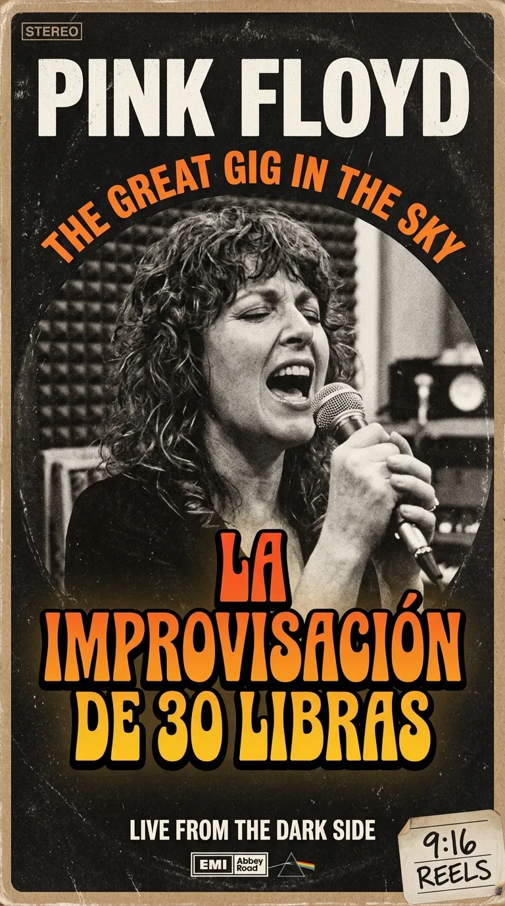
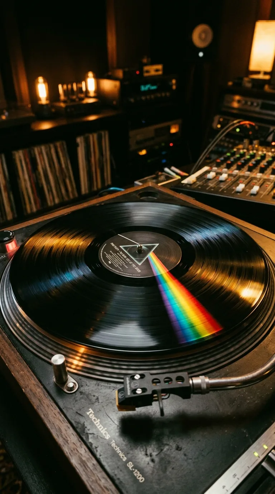
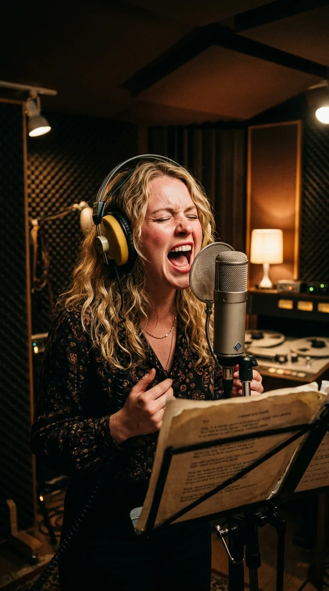
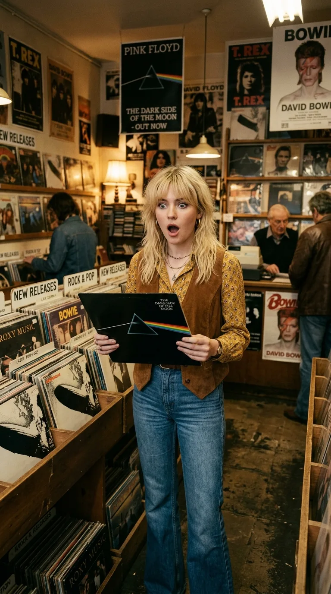
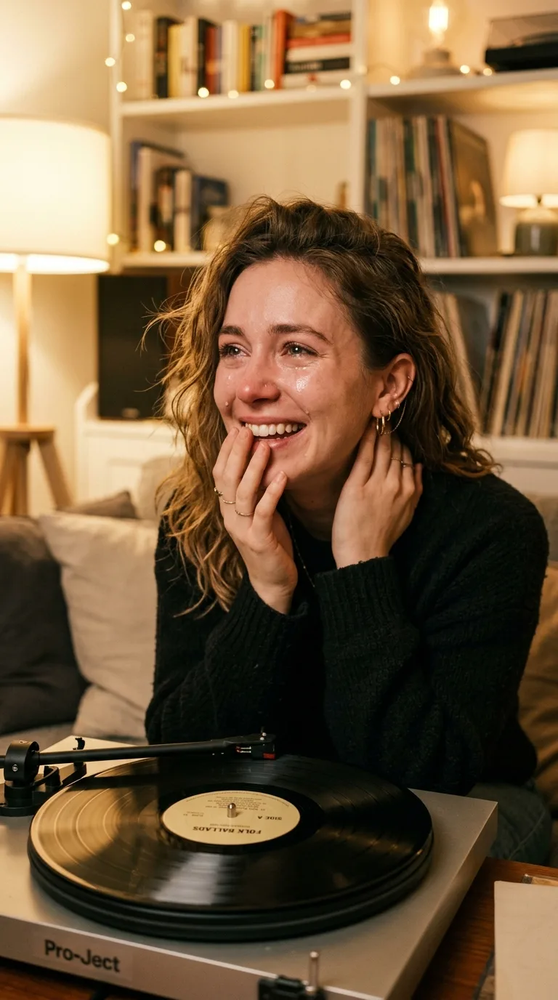

# 🎹 El Lamento de las Treinta Libras: La Tarde que una Voz Sin Palabras Venció a la Muerte

### *La tarde en que una muchacha de veinticinco años cobró la tarifa sindical de un domingo en Abbey Road, temió haber hecho el ridículo frente a Pink Floyd y se marchó pidiendo disculpas, sin sospechar que su lamento improvisado se convertiría en el mayor réquiem secular de la historia del rock.*

---

**Por la redacción de Acordes Ocultos**  
*Tiempo de lectura estimado: 11 minutos*

> *«And I am not frightened of dying... Any time will do, I don't mind. Why should I be frightened of dying? There's no reason for it, you've gotta go sometime...»*  
> — **Gerry O'Driscoll**, conserje de Abbey Road Studios (*The Dark Side of the Moon*, 1973)

---

### Prólogo: Los planes del sábado y la llamada del domingo

El fin de semana del **20 y 21 de enero de 1973**, la música ocupaba la mente de **Clare Torry**, pero no precisamente en un estudio de grabación. Con veinticinco años, una sólida formación melódica y un oficio curtido en grabaciones publicitarias, sintonías de televisión y discos de bajo presupuesto, la joven vocalista londinense tenía un compromiso innegociable para la noche del sábado: entradas para ver en directo a su ídolo, el legendario pionero del rock and roll **Chuck Berry**.

Por eso, cuando el teléfono de su casa sonó aquel sábado proponiéndole acudir de urgencia a una sesión en los míticos estudios de **Abbey Road**, su respuesta fue inmediata y categórica: no podía ir. Tenía planes. El rock clásico de Chuck Berry en vivo estaba primero.

*Abbey Road Studios, Londres, 1973: La sesión donde una cantante de 25 años transformó una base de piano en la elegía vocal más estremecedora de la música contemporánea.*

Al otro lado de la línea hablaba Dennis, el encargado de contrataciones y pagos de EMI en Abbey Road. Siguiendo la recomendación entusiasta de un joven e intuitivo ingeniero de sonido llamado **Alan Parsons** —quien había quedado impresionado por la fuerza y el timbre vocal de Clare en unas sesiones pop previas—, Dennis insistió. El grupo que estaba grabando no era una orquesta comercial corriente, sino **Pink Floyd**, el cuarteto de rock progresivo más vanguardista de Gran Bretaña. Estaban dando los últimos retoques a una ambiciosa obra conceptual y necesitaban desesperadamente una voz femenina para una pieza que no lograban redondear.

Acordaron reprogramar la cita para la tarde siguiente. El domingo **21 de enero**, entre las siete y las diez de la noche, Clare se acercaría al Estudio 3 de Abbey Road. Sería un trabajo de pocas horas, remunerado con la tarifa reglamentaria del sindicato de músicos (*Musicians' Union*): **treinta libras esterlinas**, el doble de la tarifa estándar por tratarse de un domingo por la tarde. Terminada la faena, Clare planeaba marcharse a cenar tranquilamente con su novio.

Jamás cruzó por su cabeza que aquel encargo fortuito de un domingo invernal, por el precio de una cena modesta, terminaría grabando su respiración y su alma en el corazón del álbum más legendario del siglo XX.

---

### Acto I: La partitura de la mortalidad y el abismo sin palabras

En aquel inicio de 1973, David Gilmour, Roger Waters, Richard Wright y Nick Mason se encontraban en la recta final de la gestación de ***The Dark Side of the Moon***. El disco se había concebido como un fresco implacable sobre las fuerzas invisibles que asedian y desgastan la cordura del ser humano: el paso destructor de los años (*«Time»*), la avaricia material (*«Money»*), la violencia bélica (*«Us and Them»*) y la locura que había apartado a su antiguo líder espiritual, **Syd Barrett** (*«Brain Damage»*).

Sin embargo, en el ecuador de la primera cara del vinilo, una pieza instrumental permanecía suspendida en un limbo inquietante.

*El diseño icónico de Hipgnosis: Una meditación sonora sobre la fragilidad de la existencia que exigía una dimensión humana desgarradora.*

La composición había brotado de la sensibilidad armónica de **Richard Wright**. En los conciertos de la gira de 1972, la banda la interpretaba bajo títulos provisionales como *«The Mortality Sequence»* (*La secuencia de la mortalidad*) o *«The Religion Song»*. Era una progresión solemne y emotiva construida al piano entre Si menor y Fa mayor, arropada por las texturas envolventes del órgano Hammond y el lamento aéreo del *pedal steel* de David Gilmour.

Para darle sentido durante las actuaciones, Roger Waters solía intercalar cintas con sermones del periodista Malcolm Muggeridge y lecturas bíblicas de la Primera Epístola a los Corintios. Pero en la sala de mezclas de Abbey Road, la banda sintió que aquel recurso sonaba pedagógico, frío y distante. La muerte no necesitaba homilías ni letanías religiosas; la muerte era un misterio mudo, una encrucijada biológica que dejaba a las palabras desarmadas.

David Gilmour lo tenía claro: necesitaban una voz humana. Pero no querían versos escritos. En cuanto un cantante empezaba a articular palabras sobre la tumba, el ataúd o el más allá, la música caía en la obviedad y el melodrama barato. Querían una voz que no pronunciara ni una sola sílaba inteligible, pero que hiciera vibrar las fibras más recónditas del pecho.

Fue entonces cuando Alan Parsons recordó a aquella joven de voz elástica y bluesera que había conocido semanas atrás.

---

### Acto II: El sofá chesterfield del Estudio 3 y el reto del micrófono

A las siete de la tarde de aquel domingo, Clare Torry llegó a la estación de metro de St. John's Wood, caminó unas pocas manzanas bajo el aire helado de Londres y empujó las puertas del Estudio 3 de Abbey Road.

*St. John's Wood, 21 de enero de 1973: Clare Torry entra en las entrañas de Abbey Road sin saber qué se esperaba de ella.*

Al ingresar a la sala de control, la atmósfera que encontró la desconcertó profundamente. Sentados en un gastado sofá chesterfield de cuero oscuro frente a la majestuosa consola analógica **EMI TG12345**, los cuatro miembros de Pink Floyd permanecían casi inmóviles. No había sonrisas de bienvenida ni charlas distendidas; solo una cortesía británica fría, analítica y distante. Parecían exhaustos tras meses de encierro creativo.

*La sala de control de Abbey Road: Waters, Gilmour, Wright y Mason escuchando en silencio los primeros tanteos de la sesión.*

Pusieron la pista de acompañamiento para que Clare la escuchara. Richard Wright le indicó que la canción se llamaría tentativamente *«The Great Gig in the Sky»* (*El gran concierto en el cielo*). Clare escuchó con atención la rueda de acordes de piano, esperando que le entregaran una carpeta con la partitura o una hoja con las letras manuscritas:

—*«¿Dónde está la letra? ¿Qué se supone que debo cantar?»*, preguntó con naturalidad profesional.  
—*«No hay letra»*, le respondió David Gilmour desde el sofá. *«No queremos palabras. Simplemente entra en la cabina y haz lo que sientas»*.

Clare se quedó perpleja. Para una cantante habituada a la disciplina de los arreglos comerciales, donde cada compás, armonía y consonante estaba milimétricamente pautado en el atril, aquella libertad absoluta sonaba como una trampa mortal.

Caminó hacia la cabina aislada. Frente a ella se erguía un imponente micrófono de condensador **Neumann U87** protegido por una pantalla antipop. Se ajustó los auriculares de diadema sobre las orejas y, a través del cristal grueso de la pecera, vio a Parsons ajustar los potenciómetros mientras la luz roja de grabación se encendía.

Los primeros acordes comenzaron a rodar por sus cascos. Clare intentó emitir algunos tarareos convencionales (*«Oh, yeah, baby...»*), pero de inmediato se detuvo, sintiendo que sonaba ridículo, vulgar y fuera de lugar sobre la solemnidad de aquel piano. 

En ese segundo de silencio interior, tomó una determinación que cambiaría la historia de la música contemporánea:

> *«Comprendí que no podía cantar aquello como una vocalista corriente. Tenía que fingir que no era una persona; tenía que pensar en mi propia voz como si fuera un instrumento musical: una guitarra solista de blues desgarrando la noche o una sección de metales llorando en la penumbra. Me dije: 'Cierra los ojos, déjate llevar por los acordes y no tengas miedo de desnudarte'»*.

---

### Acto III: El lamento de la cabina y la disculpa antes de partir

Respiró hondo. En los auriculares sonó la introducción de piano de Wright, el pulso amortiguado de la batería de Nick Mason y, flotando en la penumbra, la voz del conserje irlandés de Abbey Road, Gerry O'Driscoll: *«And I am not frightened of dying... any time will do, I don't mind. Why should I be frightened of dying? There's no reason for it, you've gotta go sometime»*.

Cuando la secuencia moduló con majestuosidad hacia Fa mayor, Clare Torry abrió la boca y dejó que brotara el vendaval.

*Cabina del Estudio 3: El desgarro intuitivo y sin palabras que inmortalizó a una cantante desconocida.*

Lo que salió de su garganta no fue un ejercicio de técnica vocal; fue una deflagración visceral, un lamento primitivo y sagrado a la vez. Su voz arrancó en un registro medio teñido de tristeza otoñal, para trepar de pronto en un portamento desgarrador hacia las notas más agudas de su tesitura. Sin emplear una sola consonante, jugando únicamente con vocales abiertas y quiebros de garganta, moduló la intensidad de la agonía humana: rugía con la fuerza de una leona herida en los pasajes donde la batería crecía en dramatismo, y descendía hacia susurros trémulos y quebradizos cuando el piano de Wright buscaba el reposo de la resignación.

En la sala de control, el ambiente se transformó por completo. Alan Parsons vigilaba con ojos desorbitados los vúmetros analógicos de la mesa de mezclas para evitar que la descomunal potencia de los agudos saturara la cinta de dos pulgadas. A su lado, David Gilmour y Roger Waters permanecían clavados en sus asientos, mirándose en silencio, sobrecogidos por una intensidad que jamás habrían imaginado para aquella pista.

*El control room de Abbey Road: Gilmour y Waters asimilando el impacto emocional de la voz en directo.*

La cinta llegó a su fin y los ecos de la reverberación se disolvieron en la cabina. Clare abrió los ojos, jadeando ligeramente por el esfuerzo físico. A través del cristal de la sala de control, nadie aplaudía. Nadie levantaba los pulgares. Los músicos continuaban sentados en el sofá, completamente inmóviles y en silencio.

La cantante, educada en la rigidez de los estándares pop de la época, interpretó aquel mutismo sepulcral como una señal inequívoca de fracaso y bochorno. Creyó que había gritado como una desquiciada, que había arruinado la pista de piano y que la banda estaba horrorizada.

Empujó la puerta de la cabina, se quitó los auriculares y, sonrojada, se acercó a los controles disculpándose avergonzada:

—*«Lo siento muchísimo. Me temo que me he excedido por completo... Sonó demasiado chillón, ¿verdad? Puedo intentar otra toma mucho más suave y contenida»*.

David Gilmour le agradeció la entrega y le pidió registrar una segunda toma, buscando matices complementarios y modulaciones diferentes. Probaron incluso registrar un fragmento de una tercera pista, pero Clare se detuvo a los pocos compases: la voz comenzaba a fatigarse y sentía que empezaba a repetirse de forma mecánica.

La sesión había concluido. Clare Torry firmó la planilla de la *Musicians' Union*, guardó en el bolso el cheque por **treinta libras** correspondientes a la tarifa doble de un domingo por la noche, se despidió cordialmente de aquellos cuatro muchachos silenciosos y abandonó Abbey Road. Media hora después, estaba cenando con su pareja en un restaurante londinense, contándole entre risas que había estado gritando en una cabina para un grupo de melenudos extraños y que estaba absolutamente convencida de que borrarían su grabación para meter un solo de guitarra o un arreglo de cuerdas.

---

### Acto IV: El prisma en la vitrina de King's Road

Pasaron las semanas y el invierno dio paso a la primavera. En marzo de 1973, ***The Dark Side of the Moon*** fue publicado oficialmente por Harvest Records en Gran Bretaña y Capitol Records en los Estados Unidos. 

Envuelto en el diseño revolucionario del colectivo artístico **Hipgnosis** —aquel prisma refractando un rayo blanco en un arcoíris hipnótico sobre un fondo negro absoluto, ilustrado por George Hardie—, el álbum se convirtió en un fenómeno cultural instantáneo. Las emisoras de radio no dejaban de radiar sus cortes y los escaparates de las tiendas de música de todo el país se tiñeron de negro y refracciones de luz.

Un día soleado de abril, Clare Torry caminaba despreocupadamente por **King's Road**, en el corazón bohemio del barrio de Chelsea. Al pasar frente a una concurrida tienda de discos, un inmenso cartel promocional de Pink Floyd llamó su atención en la vitrina.

*Londres, primavera de 1973: Clare Torry en King's Road descubriendo el álbum en el escaparate de una tienda de música.*

Sintió una chispa de curiosidad. Aquella era la banda con la que había grabado hacía tres meses. Entró al local, buscó la cubeta de novedades, tomó un ejemplar precintado del vinilo y le dio la vuelta para ojear la contraportada. 

Sus ojos recorrieron los títulos de las pistas hasta detenerse en el corte número cinco de la primera cara:

> **5. The Great Gig in the Sky (Wright)**  
> *Vocal: Clare Torry.*

Un escalofrío le recorrió la espalda. ¡Su nombre estaba allí impreso!

Sacó dinero de su bolsillo y compró el álbum con sus propios ahorros como cualquier clienta anónima. Caminó apresuradamente hasta su apartamento, abrió el plástico protector y colocó el vinilo virgen sobre el plato de su tocadiscos. Bajó la aguja con dedos trémulos.

*El salón familiar en 1973: La conmoción de una joven al comprender que su improvisación dominical era ahora inmortal.*

Escuchó el latido fundacional de *«Speak to Me»*, la ingravidez de *«Breathe»*, el vértigo tecnológico de *«On the Run»*, el estallido ensordecedor de los relojes de *«Time»*... y de pronto, los compases solemnes y cálidos del piano de Richard Wright.

En la sala de máquinas, Alan Parsons y David Gilmour habían obrado una genialidad de orfebrería sonora: lejos de descartar su trabajo, habían tomado las mejores frases de la **Toma 1** y las habían entrelazado con pasajes sublimes de la **Toma 2**, construyendo una interpretación vocal continua de una belleza devastadora. A mitad de la pieza emergía el susurro etéreo de **Patricia «Puddie» Watts**: *«I never said I was frightened of dying»*.

Y sobre todo ello, su propia voz se elevaba como un cometa de fuego, cantándole cara a cara a la eternidad.

Clare Torry cayó de rodillas sobre la alfombra de su salón, conmovida por una mezcla de asombro, alivio y sobrecogimiento. Aquella sesión dominical que ella temía haber arruinado era en realidad la cúspide emocional del disco; un lamento desgarrado y luminoso que no pertenecía a Pink Floyd ni a ella sola, sino a toda la humanidad enfrentada al enigma del adiós definitivo.

---

### Epílogo: El juicio de la justicia y la eternidad compartida

Durante más de tres décadas, el mundo disfrutó de *«The Great Gig in the Sky»* como una creación adjudicada únicamente a Richard Wright, mientras Clare Torry permanecía acreditada en la letra menuda como una simple intérprete invitada. La única compensación económica por una de las interpretaciones vocales más célebres, reproducidas y veneradas de la historia del rock continuaban siendo aquellas treinta libras esterlinas cobradas en 1973.

Sin embargo, en el año **2004**, Clare decidió que la historia debía escribirse con entera justicia. Con el respaldo de análisis musicológicos rigurosos, presentó una demanda formal ante el **Tribunal Superior de Justicia de Londres** (*High Court of Justice*) reclamando sus derechos de coautoría sobre la obra.

El argumento de su reclamación era irrebatible: la base que Richard Wright le había facilitado en Abbey Road era una progresión armónica instrumental al piano; la melodía vocal, la dinámica dramática, los saltos de intervalo y la arquitectura emocional que convirtieron esa pista en una leyenda imperecedera **habían sido compuestos y creados por ella misma en el acto de improvisación frente al micrófono**.

En abril de **2005**, ambas partes alcanzaron un acuerdo extrajudicial definitivo de carácter confidencial. A partir de esa fecha histórica, todas las reediciones mundiales, prensajes en vinilo, CD y plataformas de streaming corrigieron para siempre los créditos de la canción:

> 🎼 **«The Great Gig in the Sky» — Compuesta por Richard Wright y Clare Torry.**

Richard Wright, quien falleció en septiembre de 2008, reconoció siempre con nobleza y caballerosidad que la pieza jamás habría alcanzado la categoría de mito sin la entrega despojada y valiente de aquella muchacha que entró en su estudio un domingo por la tarde dispuesta a cantar sin palabras.

Hoy, más de medio siglo después de aquella tarde gélida en Abbey Road, cuando el alarido celestial de Clare Torry vuelve a rasgar el silencio en los altavoces de cualquier rincón del planeta, ya nadie escucha un ejercicio de estudio: escuchamos la prueba deslumbrante de que, cuando el lenguaje humano fracasa para explicar el misterio de la muerte, el alma descalza todavía es capaz de inventar su propia eternidad.

---

### 💬 La Pregunta para Nuestra Comunidad

La trascendencia universal de *«The Great Gig in the Sky»* reside en su pureza: al despojar al canto de palabras y dogmas, cada oyente proyecta en ese lamento su propio duelo, su propia herida o su propia esperanza de redención.

**¿Qué sentiste la primera vez que escuchaste la voz de Clare Torry en este tema? ¿A qué momento de tu vida te transporta este lamento cada vez que vuelve a sonar?**

*Te leemos en los comentarios de nuestra publicación semanal.*

---

### 📚 Fuentes y Archivo Documental

1. **Abbey Road Studios Archive.** *The Dark Side of the Moon Studio Documents & Recording Logs*. Registros de consola y hojas de sesión del Estudio 3 (21 de enero de 1973), bitácoras de cinta de Alan Parsons y documentos de la Musicians' Union.
2. **Harris, John.** *The Dark Side of the Moon: The Making of the Pink Floyd Masterpiece*. Da Capo Press, 2006. Reconstrucción pormenorizada de las sesiones de grabación y entrevistas testimoniales en profundidad a Clare Torry, David Gilmour y Alan Parsons.
3. **Blake, Mark.** *Comfortably Numb: The Inside Story of Pink Floyd*. Da Capo Press, Cambridge (MA), 2008. Capítulos dedicados a la evolución de *The Mortality Sequence* y la incorporación de las voces no verbales.
4. **Mason, Nick.** *Inside Out: A Personal History of Pink Floyd*. Chronicle Books / Weidenfeld & Nicolson, Londres, 2004. Memorias oficiales del baterista con detalles sobre la audición dominical y el proceso de mezcla.
5. **Torry, Clare.** Declaraciones biográficas y entrevistas documentales en *The Word Magazine* (2005), BBC Radio 2 (*Classic Albums Special: The Dark Side of the Moon*) y *Pink Floyd: The Making of The Dark Side of the Moon* (Classic Albums, Isis Productions / Eagle Rock Entertainment, 2003).
6. **Tyler, Kieron.** *The Dark Side of the Moon: Clare Torry's Great Gig in the Sky*. The Arts Desk, 2013 (Análisis musicológico sobre la trayectoria de Torry, la sesión de 1973 y el acuerdo de coautoría Wright/Torry).
7. **Harvest Records / EMI Records Ltd.** Fichas de producción y prensajes originales de *The Dark Side of the Moon* (Catálogo SHVL 804, marzo de 1973; créditos actualizados Wright/Torry a partir de 2005 por Pink Floyd Music Ltd / Sony Music).
