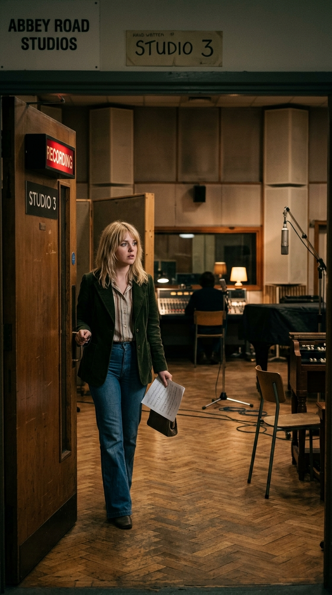
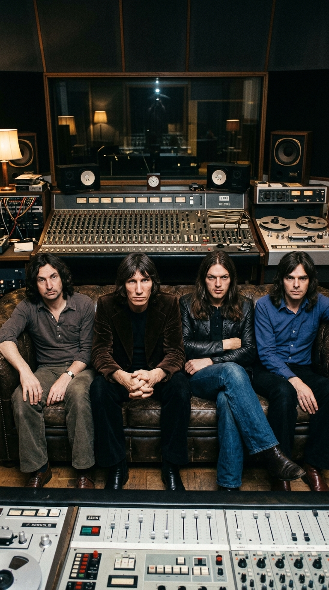
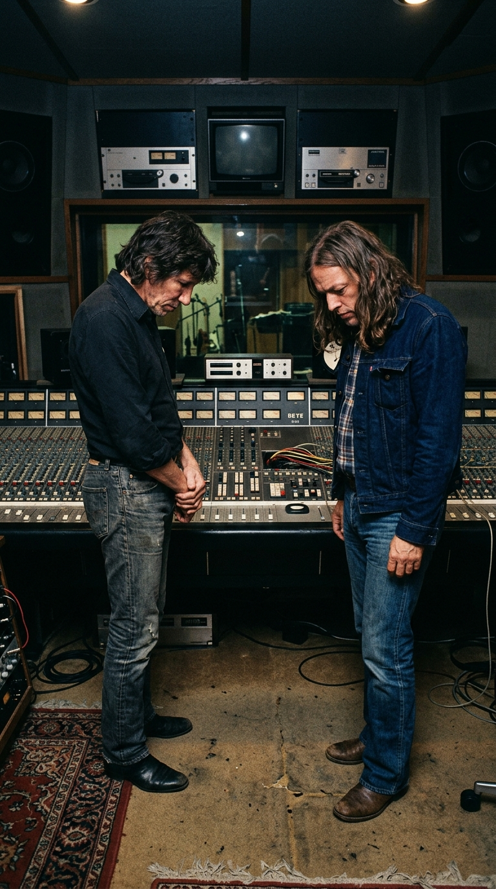

# 🎹 El Lamento de las Treinta Libras: La Tarde que una Voz Sin Palabras Venció a la Muerte

> *«No cantes palabras. No pienses en notas. Piensa en el horror, en la agonía, en el último suspiro de la vida abandonando la carne... y simplemente deja salir lo que sientas.»*  
> — **David Gilmour a Clare Torry**, Cabina de grabación de Abbey Road Studio 3, domingo 21 de enero de 1973.

---

*Abbey Road Studios, Londres, 1973: La sesión secreta donde una cantante de 25 años grabó la improvisación vocal más estremecedora en la historia del rock.*

---

### Prólogo: La muchacha que tenía prisa por ver a Chuck Berry

La tarde del domingo **21 de enero de 1973**, el cielo sobre Londres tenía ese tono plomizo y grasiento que precede a las heladas de invierno. En una pequeña vivienda del barrio de Willesden, **Clare Torry**, una vocalista de sesión de veinticinco años con modales discretos y formación pop, consultaba nerviosa su reloj de muñeca. Aquella noche tenía una cita impostergable: dos entradas para el concierto dominical de **Chuck Berry** en el *Hammersmith Odeon*. Su bolso ya estaba listo, su abrigo de terciopelo colocado sobre el respaldo de una silla y sus pensamientos estaban a kilómetros de distancia de cualquier sala de grabación.

Fue entonces cuando sonó el teléfono.

Al otro lado de la línea hablaba **Alan Parsons**, un joven e impetuoso ingeniero de sonido de EMI Records al que Clare conocía fugazmente tras haber grabado algunas maquetas orquestales de bajo presupuesto y recopilatorios de éxitos comerciales para el sello Pickwick. La voz de Parsons sonaba extrañamente urgente:

—*«Clare, estoy en los estudios Abbey Road con Pink Floyd. Están rematando un álbum conceptual sobre la locura y el paso del tiempo. Tienen una pista de piano sobre la muerte que no logran cerrar. Necesitan una voz femenina ahora mismo. ¿Puedes venir un par de horas?»*

Clare dudó. Pink Floyd no era precisamente su devoción; para una cantante educada en el soul de Sam Cooke, la música de la Motown y el pop melódico de Radio Luxembourg, aquellos cuatro muchachos melancólicos de Cambridge eran poco más que unos intelectuales oscuros que hacían ruidos espaciales interminables con sintetizadores y cintas al revés.

—*«Lo siento, Alan, pero esta noche voy a ver a Chuck Berry. Es sagrado»*, respondió ella con franqueza.

Parsons insistió. Acordaron un término medio: si se presentaba en el **Estudio 3 de Abbey Road** puntualmente a las siete de la tarde, podría terminar la sesión antes de las ocho y media y llegar en metro a tiempo para los primeros acordes de rock and roll en Hammersmith.

Clare Torry se calzó las botas, cerró la puerta de su casa y tomó el transporte subterráneo hacia la estación de St. John\'s Wood. Jamás sospechó que aquel desvío fortuito de una hora, por el que cobraría la tarifa sindical reglamentaria de un domingo, terminaría inscribiendo su respiración y su llanto en el corazón mismo del disco más influyente del siglo XX.

---

### Acto I: La partitura de la mortalidad y el vacío de las palabras

En enero de 1973, los cuatro integrantes de **Pink Floyd** —David Gilmour, Roger Waters, Richard Wright y Nick Mason— libraban una batalla silenciosa contra sus propios fantasmas dentro de Abbey Road. Durante meses habían estado cincelando una obra monumental titulada ***The Dark Side of the Moon***, un fresco sonoro diseñado para radiografiar las presiones invisibles que devoran la cordura humana: el peso asfixiante del reloj (*«Time»*), la corrupción del dinero (*«Money»*), la violencia bélica (*«Us and Them»*) y la inevitable decadencia mental de su antiguo líder extraviado, **Syd Barrett** (*«Brain Damage»*).

Pero en la cara A del vinilo existía una pieza huérfana.

*El vinilo legendario de Hipgnosis: Una obra maestra que necesitaba desesperadamente un rostro humano para su meditación sobre la muerte.*

La pista había nacido bajo los dedos delicados del tecladista **Richard Wright**, quien en los primeros conciertos de 1972 la interpretaba como una pieza instrumental flotante llamada sucesivamente *«The Mortality Sequence»* (*La secuencia de la mortalidad*) o *«The Religion Song»*. Consistía en una cadencia circular y conmovedora de acordes en Si menor y Fa mayor tocados en su piano de cola Steinway, acompañados por los acordes calientes del órgano Hammond y el lamento espectral de la guitarra *pedal steel* de David Gilmour.

Para darle sentido narrativo en vivo, Roger Waters había insertado grabaciones en cinta magnetofónica con lecturas bíblicas del capítulo quinto de la Primera Epístola a los Corintios y sermones apocalípticos del periodista Malcolm Muggeridge. Pero al escuchar las mezclas en la mesa analógica del Estudio 3, el resultado les parecía acartonado, excesivamente británico y frío. La muerte real no hablaba en versículos litúrgicos; la muerte era un abismo mudo, una amputación biológica que dejaba a las palabras desarmadas y ridículas.

—*«Necesitamos una voz»*, concluyó David Gilmour en la sala de control. *«Pero no queremos una letra. En cuanto alguien empieza a cantar palabras sobre la tumba, la poesía se vuelve barata y pretenciosa. Queremos una voz que no diga nada, pero que lo diga todo.»*

Fue entonces cuando Alan Parsons recordó a aquella muchacha de Willesden capaz de alcanzar notas desgarradoras sin desafinar un ápice.

---

### Acto II: La mirada gélida del sofá y el abismo de la cabina

A las siete en punto de la tarde, la puerta pesada e insonorizada del Estudio 3 se abrió. Clare Torry entró luciendo un suéter sencillo, pantalones vaqueros y el cabello rubio alborotado por el viento invernal.

*St. John\'s Wood, 1973: Una joven de 25 años entra a las entrañas del templo donde The Beatles habían redefinido el mundo.*

La atmósfera dentro del estudio era densa, impregnada de humo de cigarrillos, café rancio y ese silencio distante, casi quirúrgico, que caracterizaba a los músicos de Cambridge. Sentados en un gastado sofá de cuero chesterfield, frente a la imponente consola **EMI TG12345**, los cuatro miembros de la banda permanecían inmóviles, mirándola fijamente con cortesía distante.

*La sala de control de Abbey Road: Waters, Gilmour, Wright y Mason observando en silencio a la recién llegada.*

—*«Bien, Clare»*, le dijo Richard Wright tras reproducir la base instrumental. *«Esta es la pista. Se llamará The Great Gig in the Sky (El gran concierto en el cielo). Queremos que cantes encima.»*

Clare escuchó la secuencia de acordes por los auriculares. La música era hermosa, ondulante y extraña, pero no había rastro de una guía vocal:

—*«¿Y cuál es la letra? ¿Dónde está el texto?»*, preguntó ella desconcertada.
—*«No hay texto»*, sentenció Roger Waters desde el sofá. *«No queremos ninguna palabra en inglés ni en ningún otro idioma.»*
—*«¿Y qué se supone que debo hacer?»*
—*«Improvisa. Entra a la cabina, escucha los acordes y piensa en la muerte. Piensa en el fin de todas las cosas. Haz lo que tu voz te pida.»*

Clare caminó hacia la cabina acristalada con las piernas temblorosas. Los auriculares amarillos le aplastaban las orejas y frente a ella se erguía la silueta solitaria de un micrófono de condensador **Neumann U87**. Desde el cristal, Parsons encendió la luz roja de grabación. El segundero del reloj de Abbey Road avanzaba implacable. 

En ese instante de pánico puro, Torry comprendió que no podía abordar la sesión como una corista convencional. 

> *«Me di cuenta de que si intentaba cantar como una cantante de soul o de pop, sonaría grotesco»*, recordaría años más tarde. *«Tuve que convencerme de que yo no era una persona: era un instrumento musical. Era una trompeta con sordina. Era un saxofón tenor sollozando en un club a oscuras. Me dije a mí misma: \'Cierra los ojos, no mires al cristal y no tengas miedo de hacer el ridículo\'»*.

---

### Acto III: El alarido celestial y la huida de las treinta libras

La pista de piano de Wright comenzó a sonar. Tras el redoble suave de los platillos de Nick Mason y la voz cavernosa del conserje de Abbey Road, Gerry O\'Driscoll (*«And I am not frightened of dying... why should I be frightened of dying? There\'s no reason for it, you\'ve gotta go sometime»*), los acordes cayeron en cascada hacia el Fa mayor.

Clare Torry respiró hondo, apretó los párpados y abrió la boca.

*Cabina de Abbey Road, Toma 1: El lamento salvaje que brotó de las entrañas de una mujer sin red de seguridad.*

Lo que brotó de su garganta no fue un ejercicio técnico; fue un vendaval volcánico de emoción humana sin domesticar. Un alarido que comenzó en un registro medio, cálido y contenido, para luego ascender como una columna de fuego hacia un falsete agudo, desgarrador, que parecía invocar a la vez el dolor de un parto cósmico y el estertor de un alma despidiéndose de la carne. 

Su voz navegaba las progresiones armónicas de Wright con una intuición melódica asombrosa: quebraba las notas en los momentos exactos de mayor tensión, soltaba pequeños gemidos de rendición lírica y descendía luego hacia murmullos guturales, agotados, como si tras contemplar la inmensidad del universo la voz humana no tuviera más remedio que replegarse en la humildad del silencio.

En la sala de control, Alan Parsons contuvo la respiración para no saturar los vúmetros analógicos. A su lado, David Gilmour y Roger Waters se miraron de reojo, paralizados por la conmoción eléctrica que acababa de inundar el aire.

*El control room congelado: La sorpresa absoluta de cuatro músicos acostumbrados a controlarlo todo ante la espontaneidad del genio ajeno.*

Cuando la cinta de dos pulgadas se detuvo, Clare abrió los ojos en la cabina. Sudaba frío. A través del cristal aislante, vio que ninguno de los cuatro músicos aplaudía; estaban inmóviles, con la mirada clavada en el suelo o en la consola. 

La muchacha sintió una punzada ardiente de vergüenza. Creyó sinceramente que había gritado como una demente, que había desafinado y que su arrebato operístico había destrozado la sofisticación estética de Pink Floyd.

Se quitó los auriculares a toda prisa, abrió la puerta de la cabina y entró al cuarto de control encogiéndose de hombros:

—*«Les pido mil disculpas»*, murmuró con la voz entrecortada. *«Ha sido espantoso. Me he dejado llevar... Sé que no es lo que buscaban. Si quieren, puedo intentar algo mucho más contenido.»*

Hizo una segunda toma buscando moderar los excesos, pero la voz ya sonaba forzada y cansada. En la tercera toma se detuvo a los treinta segundos: *«No puedo dar más. Mi voz se está quebrando»*.

Gilmour sonrió con timidez y le agradeció el esfuerzo. Nadie en la sala le dijo que acababan de presenciar un milagro. 

Clare firmó la planilla del sindicato de músicos (*Musicians\' Union*), cobró su cheque reglamentario de **30 libras esterlinas** —el doble de la tarifa estándar por tratarse de un domingo por la noche—, guardó el dinero en su bolso y corrió hacia la estación de metro. Media hora después, estaba cantando a grito pelado los estribillos de Chuck Berry en Hammersmith, convencida de que los ingenieros de Pink Floyd borrarían su cinta a la mañana siguiente para grabar encima.

---

### Acto IV: La revelación en el escaparate de Oxford Street

Pasaron los meses. Llegó la primavera de **marzo de 1973**.

*The Dark Side of the Moon* llegó a las tiendas de discos de Gran Bretaña y los Estados Unidos envuelto en un aura de fascinación colectiva. El diseño del prisma refractando un haz de luz sobre fondo negro, creado por el colectivo artístico **Hipgnosis**, comenzó a colonizar los escaparates de todas las capitales del mundo.

Un día cualquiera de abril, Clare Torry caminaba por una concurrida calle comercial de Londres cuando vio un inmenso póster promocional de Pink Floyd en la vitrina de una tienda de discos. 

*Londres, primavera de 1973: El momento en que Clare Torry descubrió su nombre impreso en la contraportada del vinilo.*

Por pura curiosidad, entró al local, se acercó a la cubeta de novedades y tomó un ejemplar precintado del vinilo. Le dio la vuelta para mirar los créditos de los músicos y los agradecimientos habituales. Sus ojos recorrieron los títulos de las pistas hasta detenerse en la quinta canción de la primera cara:

> **5. The Great Gig in the Sky (Wright)**  
> *Vocal composition and backing vocals by Clare Torry.*

El corazón le dio un vuelco salvaje.

Compró el disco de inmediato con sus propios ahorros, subió a su apartamento casi sin aliento y colocó el vinilo virgen sobre el plato giratorio de su tocadiscos. Bajó la aguja con dedos trémulos. Escuchó el latido del corazón de *«Speak to Me»*, el descenso aéreo de *«Breathe»*, la vorágine tecnológica de *«On the Run»*, la explosión de campanas de *«Time»*... y de pronto, los acordes de piano de Richard Wright.

*El salón familiar en 1973: Las lágrimas de una joven al comprender que su angustia de una tarde era ahora inmortal.*

Cuando los compases alcanzaron el punto de inflexión, su propia voz estalló en el salón. No la habían borrado. No la habían enterrado bajo capas de sintetizadores. Allí estaba: la **Toma 1 íntegra**, pura, descarnada, majestuosa, elevada por la ingeniería de Parsons a la cima del dramatismo musical. 

Clare Torry cayó sentada sobre la alfombra y rompió a llorar. En aquel llanto se mezclaban la incredulidad, el alivio y una revelación aplastante: aquella muchacha que horas antes solo pensaba en llegar a tiempo a un concierto de rock había capturado, en un puñado de minutos y sin pronunciar una sola consonante, el lamento que toda la humanidad lleva atorado en la garganta ante el misterio insondable de la muerte.

---

### Epílogo: El juicio de la justicia y la eternidad compartida

Durante más de tres décadas, el mundo conoció a *«The Great Gig in the Sky»* como una creación exclusiva de Richard Wright, mientras el nombre de Clare Torry figuraba apenas en la letra pequeña como una colaboración meramente interpretativa. La compensación económica por una de las interpretaciones vocales más celebradas y reproducidas de todos los tiempos continuaba siendo aquel viejo cheque de treinta libras cobrado en 1973.

Sin embargo, en el año **2004**, Clare decidió que la historia debía ser contada con entera justicia. Asesorada por musicólogos y especialistas legales, presentó una demanda ante el **Tribunal Superior de Justicia de Londres** (*High Court of Justice*) reclamando los derechos de coautoría de la canción. 

El argumento de su defensa era irrebatible: la partitura que Richard Wright le había entregado en Abbey Road era una progresión armónica básica al piano; la melodía vocal, la dinámica, los giros melódicos y la arquitectura emocional que convirtieron esa pista instrumental en una obra cumbre del arte contemporáneo **habían sido compuestos por ella en el acto de improvisación**.

En abril de **2005**, la corte falló a su favor y Pink Floyd llegó a un acuerdo amistoso fuera de los tribunales. A partir de ese momento, todos los discos, reediciones y ediciones digitales de *The Dark Side of the Moon* pasaron a acreditar la canción con una firma compartida e innegociable:

> 🎼 **«The Great Gig in the Sky» — Compuesta por Richard Wright y Clare Torry.**

Richard Wright, fallecido en 2008, reconoció siempre con nobleza que la pieza jamás habría alcanzado la categoría de leyenda sin la entrega despojada de aquella joven que entró a su estudio con miedo al fracaso.

Hoy, más de cincuenta años después de aquella tarde gélida en Abbey Road, cuando la voz de Clare Torry estremece los altavoces de millones de personas alrededor del planeta, ya nadie escucha una simple canción de rock progresivo. Escuchamos el testimonio desnudo del espíritu humano: la prueba radiante de que, cuando las palabras fracasan para explicar el dolor del mundo, el alma todavía encuentra la manera de cantar su propia libertad.

---

### 💬 La Pregunta para Nuestra Comunidad

La genialidad de *«The Great Gig in the Sky»* reside en su valentía: despojar al canto de cualquier palabra para que el oyente proyecte en ese lamento su propia pérdida, su propia herida o su propia esperanza de trascendencia.

**¿Qué sentiste la primera vez que escuchaste el alarido de Clare Torry? ¿A qué rincón íntimo de tu memoria te transporta cada vez que suena este himno?**

*Te leemos en los comentarios de nuestra publicación semanal.*

---

### 📚 Fuentes y Archivo Documental

Para la rigurosa reconstrucción biográfica, histórica, musicológica y judicial de esta crónica, la redacción de *Acordes Ocultos* ha consultado y contrastado las siguientes fuentes documentales:

1. **Blake, Mark.** *Comfortably Numb: The Inside Story of Pink Floyd*. Da Capo Press, Cambridge (MA), 2008. Capítulos dedicados a las sesiones de composición y ensamblaje de *The Dark Side of the Moon* en Abbey Road Studios (1972–1973).
2. **Mason, Nick.** *Inside Out: A Personal History of Pink Floyd*. Chronicle Books / Weidenfeld & Nicolson, Londres, 2004. Memorias oficiales del baterista de la banda con sus impresiones directas sobre la audición de Clare Torry y la dirección artística de Roger Waters.
3. **Harris, John.** *The Dark Side of the Moon: The Making of the Pink Floyd Masterpiece*. Da Capo Press, 2006. Reconstrucción pormenorizada de la jornada del 21 de enero de 1973, incluyendo el testimonio de Alan Parsons y las bitácoras de consola de EMI.
4. **Torry, Clare.** Entrevistas biográficas en audio y prensa escrita para *The Word Magazine* (2005), BBC Radio 2 (*Classic Albums Special: The Dark Side of the Moon*) y el documental oficial de televisión *Pink Floyd: The Making of The Dark Side of the Moon* (Isis Productions / Eagle Rock Entertainment, 2003).
5. **Parsons, Alan.** *The Alan Parsons Project Archives & Audio Engineering Society (AES) Papers*. Conferencias magistrales y entrevistas técnicas sobre el microfoneo con Neumann U87 y las decisiones de mezcla multipista en la consola EMI TG12345.
6. **High Court of Justice (Chancery Division, London, 2004–2005).** Registros judiciales del caso *Torry v. Pink Floyd Music Ltd and EMI Records*, resolución de autoría compositiva compartida y modificación de los créditos fonográficos mundiales.
7. **Pornon, Charles & Thorgerson, Storm (Hipgnosis).** *For the Love of Vinyl: The Album Art of Hipgnosis*. Picturebox, 2008. Archivo fotográfico y conceptual de la creación visual del prisma y los artes promocionales de 1973.
