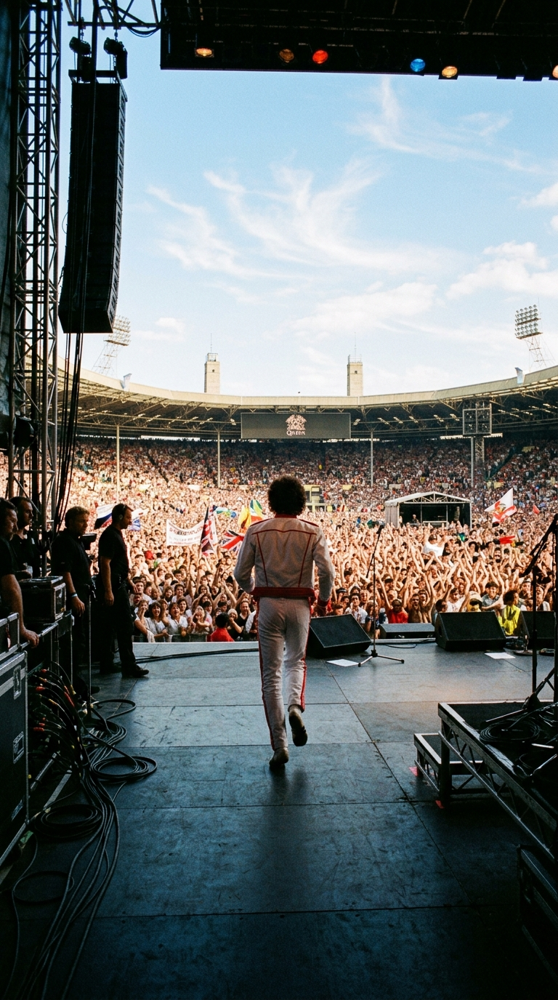
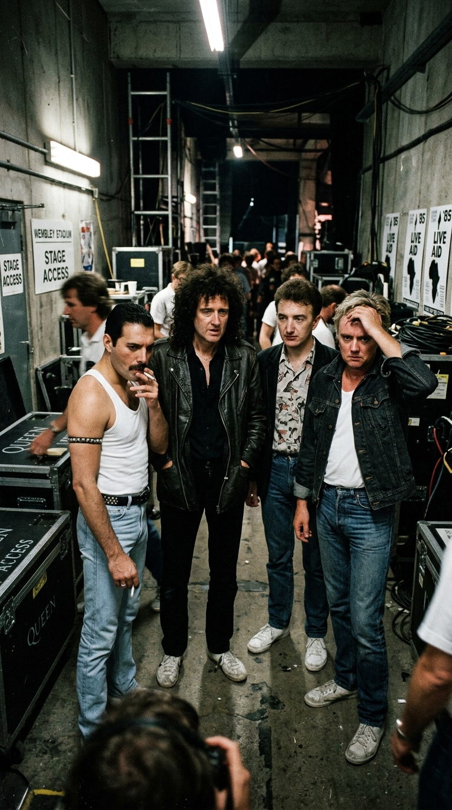
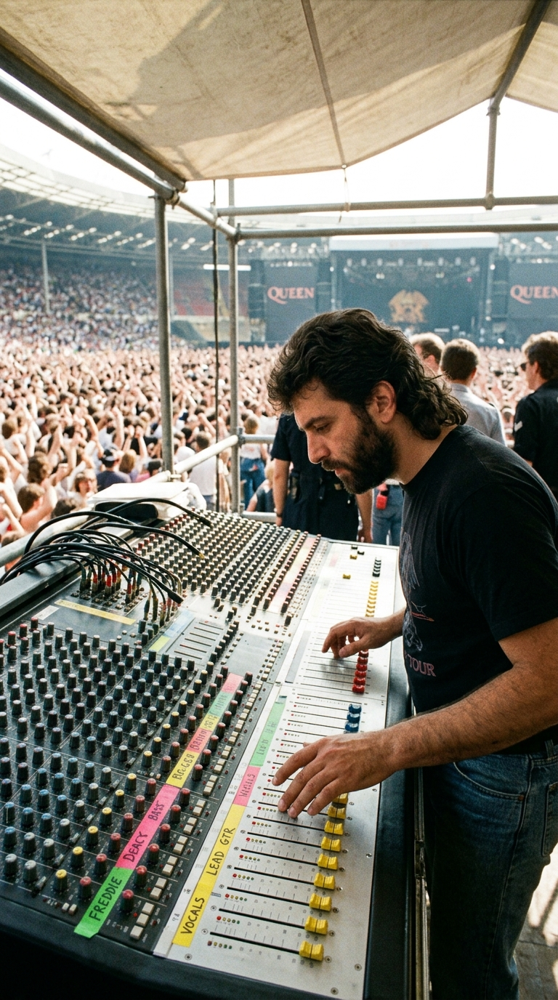
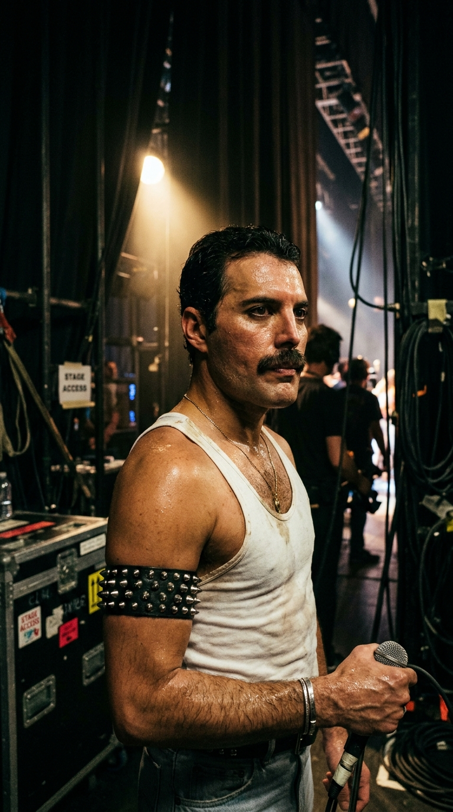
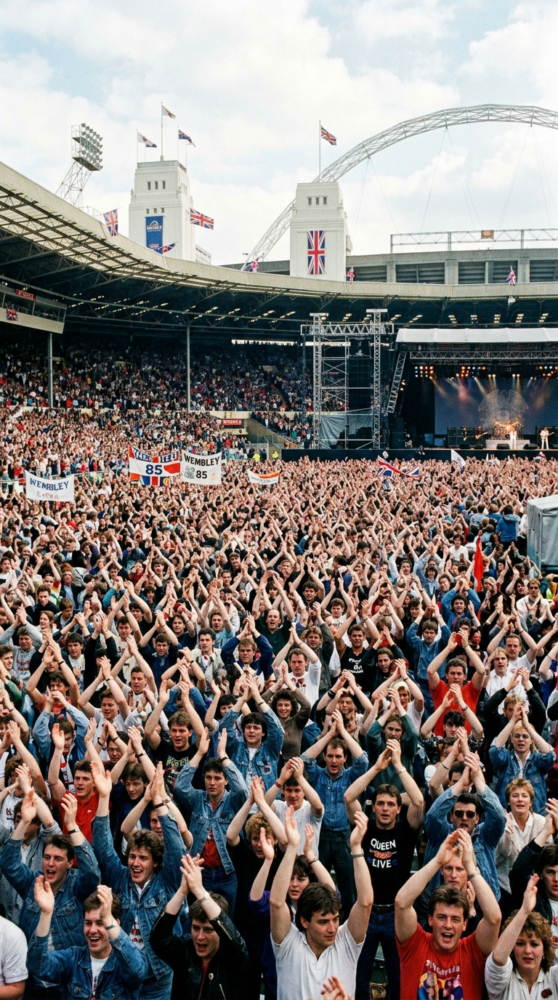
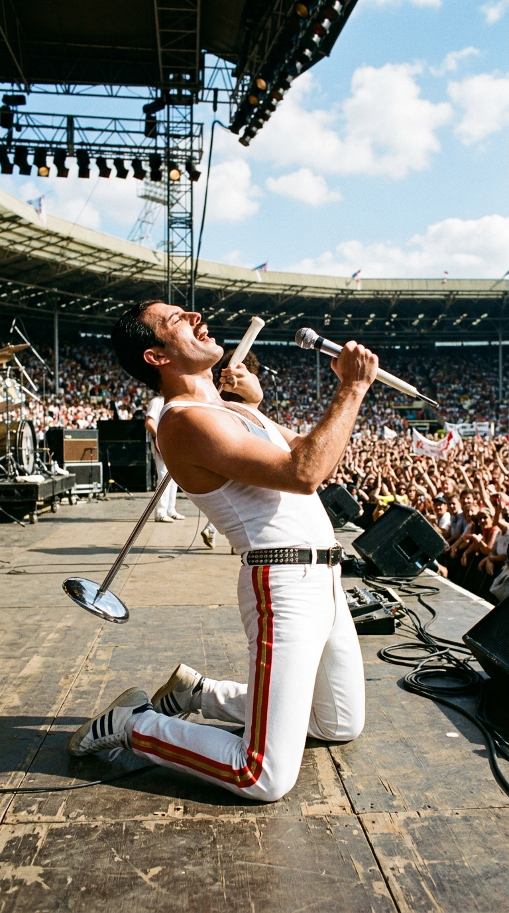
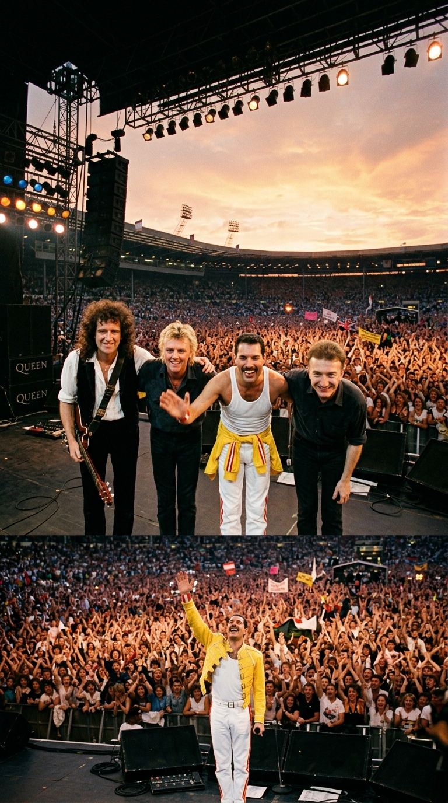

# 👑 El Asalto a Wembley: La Tarde en que Freddie Mercury Conquistó el Planeta en Veinte Minutos

> *«¡Malditos bastardos! ¡Nos robaron el maldito espectáculo a todos! Saliste ahí fuera y convertiste el estadio entero en tu patio trasero. Fue la actuación más perfecta y electrizante que jamás haya visto en mi vida.»*  
> — **Elton John a Freddie Mercury**, en los camerinos de Wembley, 13 de julio de 1985.

---

*Estadio de Wembley, Londres, 13 de julio de 1985: Veintiún minutos de sincronía absoluta que rescataron a Queen de la disolución y redefinieron las leyes del rock de estadios.*

---

### Prólogo: Al borde del abismo

En el caluroso mediodía del sábado **13 de julio de 1985**, mientras las cámaras de televisión comenzaban a enlazar satélites para transmitir el concierto benéfico **Live Aid** a casi dos mil millones de personas en ciento cincuenta países, entre los bastidores del Estadio de Wembley reinaba un ambiente de incertidumbre casi fúnebre para una de las bandas más vendedoras de la historia británica.

Queen no llegaba a la cita como los reyes triunfales que el mundo recuerda hoy, sino como un gigante herido, desgastado por tensiones internas feroces y al borde mismo de la desintegración. Nueve meses atrás, en octubre de 1984, la banda había aceptado una serie de conciertos millonarios en el complejo de ocio de **Sun City**, en el enclave de Bophuthatswana, Sudáfrica, violando el estricto boicot cultural impuesto por las Naciones Unidas contra el régimen racista del Apartheid. La reacción de la opinión pública internacional fue demoledora: el Sindicato de Músicos Británicos los multó y los colocó en su lista negra, la prensa musical los tachó de mercenarios sin escrúpulos y en Estados Unidos la cadena MTV —ya escandalizada por el videoclip travestido de *«I Want to Break Free»*— había dejado prácticamente de programar su música.

Los cuatro integrantes —Freddie Mercury, Brian May, Roger Taylor y John Deacon— apenas se hablaban fuera del escenario. Agotados tras doce años ininterrumpidos de giras y con sus respectivos proyectos en solitario compitiendo entre sí, los rumores de una separación inminente llenaban las páginas de los tabloides londinenses.

Cuando el organizador del evento, **Bob Geldof**, telefoneó a Freddie Mercury para rogarle que se sumaran al cartel benéfico contra la hambruna en Etiopía, la primera reacción del vocalista fue de rechazo categórico:

—*«Nosotros somos una banda de noche, cariño. Necesitamos nuestras luces, nuestros sintetizadores y dos horas de concierto. No pienso salir a plena luz del día, a las seis de la tarde, sin prueba de sonido y con solo veinte minutos de reloj»*, protestó Freddie.

Sin embargo, tras una tensa reunión en un restaurante de Kensington, los cuatro músicos entendieron que no se trataba de un acto de caridad más: era el juicio final para su carrera. Si fracasaban frente a la realeza del pop —David Bowie, U2, The Who, Elton John y Paul McCartney—, Queen quedaría enterrado para siempre como una reliquia marchita de los años setenta.

---

### Acto I: La conspiración del Shaw Theatre y la trampa del volumen

Mientras la mayoría de las superestrellas invitadas confiaban en la improvisación o se limitaban a programar un par de temas acústicos, Queen abordó el desafío con la precisión militar de un ejército que prepara una invasión. 

Una semana antes del concierto, alquilaron durante tres días enteros las instalaciones del **Shaw Theatre**, en Kings Cross. Con cronómetros en mano, cronometraron cada compás, cada transición y cada acorde hasta diseñar una suite ininterrumpida de **veintiún minutos exactos** que encadenaba sus mayores himnos generacionales sin conceder un solo segundo de respiro al espectador.

Pero la estrategia maestra de Queen no se libró solo sobre las tablas del teatro, sino en la cabina de sonido.

El Consejo del Gran Londres (*Greater London Council*) había impuesto a la organización una limitación acústica draconiana: la música en el estadio no podía superar los **89 decibelios** medidos desde la torre de control, bajo amenaza de multas astronómicas por exceso de ruido en una zona residencial. Como consecuencia, las primeras actuaciones de la tarde —a pesar del entusiasmo de Status Quo o Elvis Costello— sonaban delgadas, apagadas y carentes de pegada física en las gradas superiores del coloso de cemento.

Fue entonces cuando entró en acción el veterano ingeniero de sonido de directo de Queen, el estadounidense **Trip Khalaf**, un sabueso curtido en las giras más complejas del rock internacional. 

Durante el cambio de escenario previo a la salida de Queen, Khalaf y el técnico James 'Ratty' Hince se deslizaron discretamente hacia las mesas de mezclas principales de la torre central. Con un movimiento rápido y entrenado, burlaron los limitadores de compresión impuestos por la BBC y los ingenieros del festival, empujando los faders de salida master al nivel óptimo del sistema de sonido. 

Sin que los inspectores municipales pudieran reaccionar a tiempo, Queen dispondría de una potencia limpia de casi **100 decibelios**: sonarían con el doble de presencia, pegada y claridad que cualquier otra banda en toda la jornada.

---

### Acto II: El león blanco salta a la arena

A las **18:41 horas**, el presentador de la BBC anunció el nombre de Queen. 

Vestido de una sencillez desarmante —unos vaqueros desgastados marca Wrangler, una camiseta blanca de tirantes sin ningún logotipo, zapatillas deportivas Adidas y un brazalete de cuero negro con tachuelas plateadas en el bíceps derecho—, Freddie Mercury no caminó hacia el escenario: trotó como un felino hambriento, saltando y agitando los puños en el aire ante el rugido atronador de setenta y dos mil gargantas.

Se sentó de inmediato frente al piano de cola **C. Bechstein** y, sin mediar palabra, deslizó los dedos sobre el teclado para tocar el arpegio más célebre de la música británica.

> *«Mama, just killed a man...  
> Put a gun against his head, pulled my trigger, now he's dead...»*

La conmoción que recorrió Wembley fue instantánea. Freddie no cantaba para las gradas; cantaba mirando fijamente a la lente de la cámara principal, estableciendo un contacto visual íntimo e hipnótico con los millones de espectadores que lo observaban desde las pantallas de televisión en salas de estar de Tokio, Buenos Aires, Nueva York y Madrid. 

Tras el primer clímax operístico de *«Bohemian Rhapsody»*, Brian May rasgó su guitarra eléctrica **Red Special** para dar paso al tema que definiría el concierto: **«Radio Ga Ga»**.

Compuesta por el baterista Roger Taylor como una reflexión nostálgica sobre la era dorada de la radio frente a la tiranía visual de los vídeos musicales, la canción adquirió en Wembley la dimensión de un ritual sagrado. Freddie se colgó el micrófono inalámbrico adherido a su característico pie de metal seccionado y comenzó a desplazarse por la inmensidad del proscenio.

Al llegar al estribillo, Freddie levantó ambos brazos sobre su cabeza y dio dos palmadas secas en el aire: *clap-clap*.

Lo que ocurrió a continuación forma parte de la historia universal de la cultura popular.

En una sincronía matemática perfecta, las **setenta y dos mil personas** que abarrotaban el estadio —desde la primera fila de la hierba hasta la última hilera de asientos en el anfiteatro superior— levantaron los brazos al cielo y aplaudieron al unísono: *clap-clap*. Una marea humana de ciento cuarenta y cuatro mil manos moviéndose como un único organismo vivo bajo el sol de Londres. 

Incluso los agentes de policía y el personal de seguridad apostados frente a las vallas de contención dejaron de vigilar y se sumaron al compás hipnótico de las palmas.

---

### Acto III: El juego vocal y la catarsis colectiva

Entre canción y canción, sabiendo que tenía al mundo entero en la palma de su mano, Freddie detuvo a la banda y se plantó en el centro del escenario para realizar su célebre improvisación a capela con el público:

> *«¡Ay-Oh!»*  
> *(¡Ay-Oh!, respondieron setenta y dos mil voces con fuerza volcánica)*  
> *«¡Ay-de-de-de-de-de-de-Oh!»*  
> *(¡Ay-de-de-de-de-de-de-Oh!)*

Freddie sostuvo una nota aguda prodigiosa durante más de cinco segundos, haciendo alarde de su tesitura de tenor natural antes de sonreír con picardía, mirarse el bíceps y rematar con un cómico: *«¡Fuck you!»*, desatando una carcajada colectiva en todo el estadio.

Le siguieron la fuerza rockera de *«Hammer to Fall»*, la vitalidad contagiosa de *«Crazy Little Thing Called Love»* y un cierre apoteósico con el binomio inmortal: *«We Will Rock You»* y *«We Are the Champions»*. Cuando Freddie arrojó al aire una bandera británica y saludó con una reverencia teatral, habían transcurrido exactamente **veintiún minutos y veintitrés segundos**.

Queen no solo había tocado: había arrasado con el festival.

Cuando la banda bajó las escaleras metálicas hacia los túneles interiores de Wembley, **Elton John** los interceptó con las manos en la cabeza, mitad furioso y mitad deslumbrado:

—*«¡Malditos cabrones! ¡Hicieron que el resto de nosotros parezcamos unos principiantes!»*, gritó entre risas mientras abrazaba a Freddie.

Incluso los críticos musicales más despiadados de Inglaterra tuvieron que capitular al día siguiente. El semanario *New Musical Express* y el diario *The Times* coincidieron en el veredicto: Queen había firmado, sin discusión posible, la mayor actuación de rock en directo jamás filmada.

---

### Epílogo: El renacimiento inmortal

El impacto de aquella tarde calurosa de julio fue sísmico e inmediato. 

El lunes siguiente a Live Aid, las tiendas de discos de Gran Bretaña y Europa registraron ventas masivas de todo el catálogo discográfico de Queen, con su recopilatorio *Greatest Hits* volviendo a escalar a las primeras posiciones de las listas de éxitos. 

Pero el milagro más trascendente ocurrió en el seno de la propia banda: las rencillas pueriles, el desgaste y las amarguras del pasado se evaporaron en el calor de los aplausos de Wembley. Reunidos en el estudio con una hermandad renovada, compusieron el himno *«One Vision»*, grabaron el exitoso álbum *A Kind of Magic* (1986) y se embarcaron en la gira europea más multitudinaria de su carrera: el legendario **Magic Tour** de 1986, que culminaría precisamente abarrotando Wembley dos noches consecutivas y llenando el parque de Knebworth ante ciento veinte mil almas en el que sería, trágicamente, el último concierto en vivo de Freddie Mercury con la banda.

Aquellos veinte minutos en Live Aid demostraron que cuando el carisma, el virtuosismo y el coraje humano se alinean en un mismo instante, la música es capaz de suspender el tiempo, borrar las divisiones del planeta y tocar las puertas de la eternidad.

---

### Reflexión: El pacto sagrado entre un hombre y la multitud

Cuatro décadas después de aquel verano de 1985, el metraje de Freddie Mercury corriendo sobre el escenario de Wembley sigue erizando la piel de millones de personas que ni siquiera habían nacido cuando la música sonó. 

Y a ti, cuando ves esa marea infinita de setenta y dos mil almas aplaudiendo al unísono al ritmo de *«Radio Ga Ga»*, ¿qué emoción te estremece el corazón al contemplar la cumbre absoluta del rock en directo?

---

### 📚 Fuentes y Archivo Documental

* **Blake, Mark (2010):** *Is This the Real Life?: The Untold Story of Queen*. Aurum Press. Análisis pormenorizado de las tensiones internas previas a Live Aid y los ensayos en el Shaw Theatre.
* **Geldof, Bob (1986):** *Is That It?*. Penguin Books. Memorias del fundador de Live Aid con testimonios directos sobre la negociación con Freddie Mercury y la logística del evento.
* **Freestone, Peter (2001):** *Freddie Mercury: An Intimate Memoir by the Man who Knew Him Best*. Omnibus Press. Registro testimonial del asistente personal de Mercury sobre los momentos previos y posteriores a la salida al escenario en Wembley.
* **Sound on Sound Magazine (Julio 2005):** *Live Aid: 20 Years On – The Audio Engineering Miracle*. Reportaje técnico sobre la torre de sonido central, la limitación a 89 dB y la manipulación de faders de Trip Khalaf.
* **BBC Television & Live Aid Trust Archives (1985):** Metraje original de la transmisión mundial y registros de audiencia certificada.
