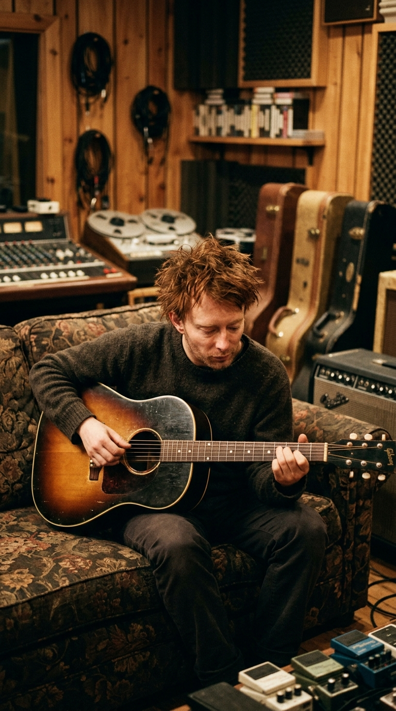
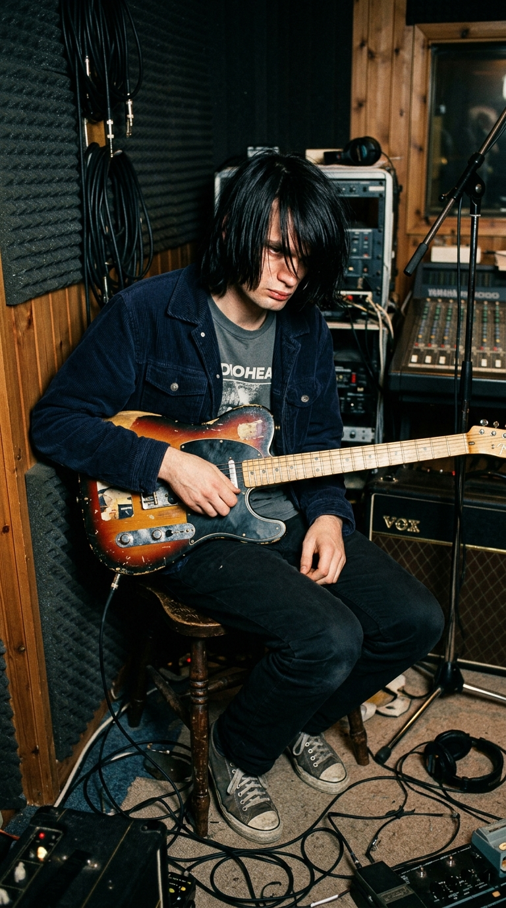
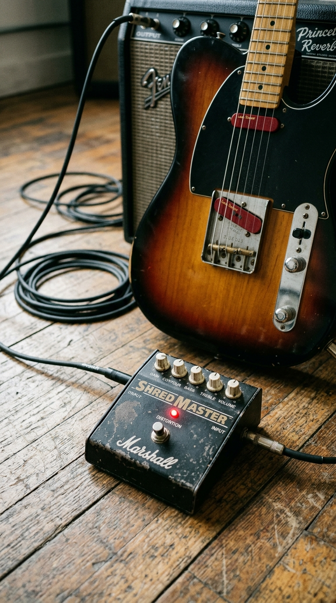
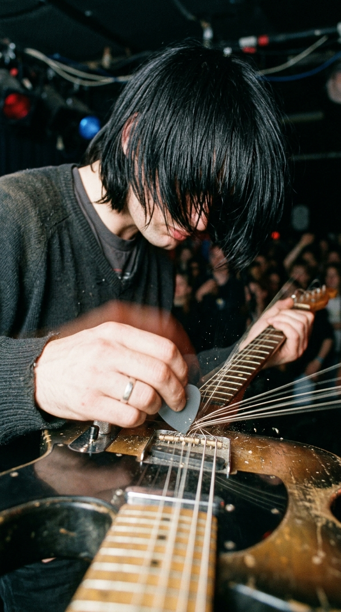
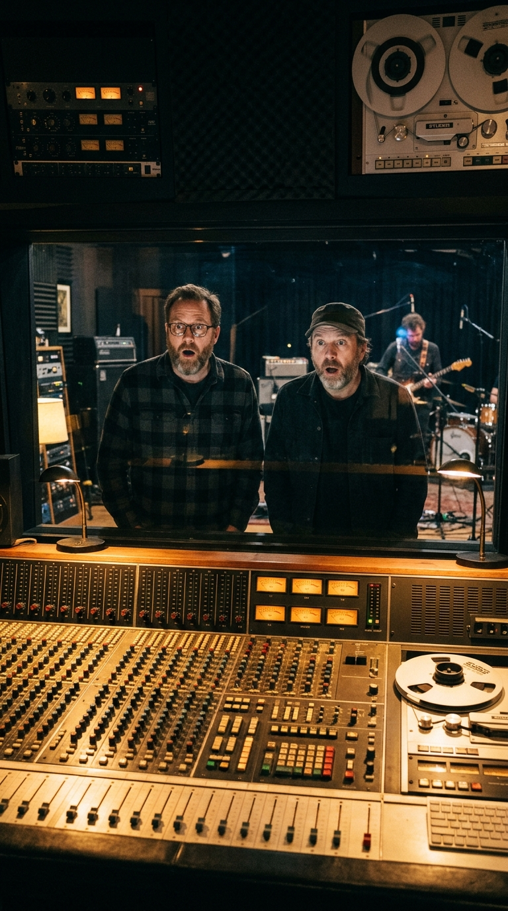
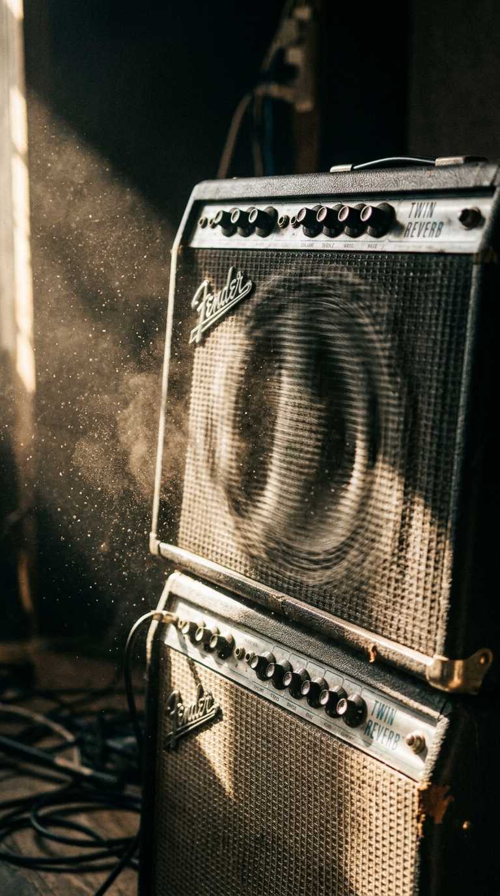

# ⚡ El Sabotaje que Creó un Himno: Cómo la Furia de Jonny Greenwood Salvó a «Creep» del Olvido

> *«Jonny odiaba esa canción con toda su alma. Le parecía una baladita pop empalagosa, complaciente y blanda. Así que, justo antes del estribillo, intentó arruinar la toma aporreando las cuerdas de su guitarra con toda la rabia de su cuerpo. Y fue justo ese ruido salvaje el que hizo famosa a la canción.»*  
> — **Colin Greenwood**, bajista de Radiohead, recordando la sesión de 1992.

---

*Chipping Norton Studios, Oxfordshire, 1992: Dos golpes de guitarra llenos de despecho que transformaron una dulce canción acústica en el aullido generacional de los inadaptados de los noventa.*

---

### Prólogo: El muchacho invisible en la esquina del bar

A finales de los años ochenta, en la histórica ciudad universitaria de Oxford, un joven enjuto, de complexión frágil y con una parálisis congénita en el párpado izquierdo que le había costado burlas y crueldad durante su infancia escolar, solía sentarse en el rincón más oscuro del pub **The Jericho Tavern**. 

Se llamaba **Thom Yorke**. Mientras sus compañeros de la escuela Abingdon bebían cerveza y celebraban la euforia juvenil, Thom observaba en silencio a una muchacha de belleza distante y magnética que frecuentaba el local. Nunca reunió el coraje para acercarse a ella; ni siquiera para pronunciar un saludo de cortesía. Para Yorke, aquella chica personificaba una pureza inalcanzable, una especie de criatura celestial ante la cual él se percibía a sí mismo como un ser defectuoso, repulsivo e invisible: un bicho raro (*«weirdo»*), una criatura que provocaba escalofríos al arrastrarse por el suelo (*«creep»*).

Una noche de 1987, en su habitación de estudiante de la Universidad de Exeter, Yorke tomó una guitarra acústica y vomitó aquella humillación íntima en cuatro acordes elementales: **Sol mayor, Si mayor, Do mayor y Do menor**. 

> *«When you were here before, couldn't look you in the eye...  
> You're just like an angel, your skin makes me cry...  
> But I'm a creep, I'm a weirdo...  
> What the hell am I doing here? I don't belong here...»*

Para Thom, la canción era solo un diario íntimo de autodesprecio, una pieza menor que guardó en una libreta de espiral sin imaginar jamás que aquellos cuatro minutos terminarían convirtiéndose en el salvoconducto y la condena de su vida.

---

### Acto I: La trampa de Chipping Norton y la balada empalagosa

En septiembre de **1992**, el quinteto de Oxford —rebautizado recientemente como **Radiohead** por exigencias de su sello discográfico, Parlophone/EMI— se encerró en los **Chipping Norton Recording Studios**, ubicados en la campiña de Oxfordshire, para grabar su álbum de debut, *Pablo Honey*.

Para supervisar las sesiones, la compañía contrató a dos reconocidos productores estadounidenses: **Sean Slade** y **Paul Q. Kolderie**, dos artesanos de Boston que venían de moldear el sonido áspero y volcánico de gigantes del rock alternativo como Pixies, Hole y Dinosaur Jr.

Las primeras jornadas en Chipping Norton fueron un desastre frustrante. La banda estaba nerviosa, las tomas de los sencillos principales sonaban rígidas y la química no terminaba de cuajar. Durante una pausa entre tomas, mientras los ingenieros calibraban los micrófonos de la batería, Thom Yorke comenzó a rasguear con desgana su vieja guitarra acústica, cantando los versos de *«Creep»* con un hilo de voz quebrado.

Al terminar, Yorke se encogió de hombros y le dijo con ironía a los productores estadounidenses:

—*«Es solo nuestra pequeña canción a lo Scott Walker. Una balada tonta para pasar el rato.»*

Slade y Kolderie intercambiaron una mirada electrizante desde la pecera de control. Con su instinto curtido en el underground de Boston, supieron al instante que aquella supuesta «canción tonta» tenía una melodía devastadora, una vulnerabilidad desgarradora que podía conectar con millones de adolescentes alienados. 

—*«Olvídense de lo que estábamos haciendo»*, ordenó Kolderie por el interfono. *«Vamos a grabar esa balada ahora mismo.»*

---

### Acto II: El golpe de furia de Jonny Greenwood

Pero en la sala de grabación había alguien que no compartía el entusiasmo de los productores: el guitarrista principal **Jonny Greenwood**.

Greenwood, un prodigio instrumental educado en la música clásica que idolatraba el post-punk vanguardista de Magazine y la disonancia cortante de Sonic Youth, sentía una aversión física hacia la canción. Le parecía un tema cursi, azucarado, una baladita pop inofensiva y dócil que no encajaba con la identidad abrasiva que él deseaba para el grupo.

Agotado y furioso tras varias tomas en las que la banda tocaba con una delicadeza que él consideraba vomitiva, Jonny decidió poner fin a la farsa. Conectó su **Fender Telecaster Plus** —equipada con pastillas dobles Lace Sensor— a un pedal de distorsión **Marshall Shredmaster** y subió la ganancia de su amplificador Fender Twin Reverb al nivel máximo.

Su plan era simple y suicida: sabotearía la toma con tal violencia que los productores no tendrían más remedio que desechar la pista para siempre.

La grabación comenzó. Durante el primer verso, la batería de Philip Selway y el bajo de Colin Greenwood avanzaban con una cadencia hipnótica, mientras Thom Yorke susurraba con una fragilidad casi infantil: *«I want a perfect body, I want a perfect soul...»*.

Y entonces, en el compás exacto previo al estallido del estribillo, en el breve instante de silencio donde la canción amenazaba con disolverse en su propia timidez, Jonny Greenwood descargó el brazo derecho con una ferocidad animal sobre las cuerdas apagadas de la Telecaster:

> **¡KA-CHUNK!... ¡KA-CHUNK!**

El pedal Shredmaster soltó dos dentelladas de estática pura, un golpe seco y cortante como el portazo de una celda de castigo.

En la sala de control, Paul Kolderie y Sean Slade saltaron de sus asientos. No hubo reproches ni gritos de enfado: sus rostros se iluminaron con una sonrisa de euforia absoluta. Aquellos dos golpes de guitarra llenos de rabia, aquel espasmo de hostilidad no planificada, eran exactamente la dinamita que la canción necesitaba para escapar de la mediocridad pop. 

Convertían una queja pasiva en un rugido de insurrección física. Era la herida abierta que faltaba.

—*«¡No toquen nada!»*, gritó Kolderie al técnico de cinta. *«¡Esa es la toma definitiva!»*.

---

### Acto III: El pleito de los acordes y el número uno accidental

Cuando *«Creep»* vio la luz en el Reino Unido en septiembre de 1992, la influyente emisora BBC Radio 1 la rechazó fríamente, argumentando en un informe interno que la canción era *«demasiado deprimente para la programación diurna»*. El sencillo original apenas logró vender unas modestas seiscientas copias y parecía condenado al olvido en las gavetas de saldos de las disquerías británicas.

Pero el destino tenía preparado un giro insólito. En Israel, un influyente locutor de radio llamado Yoav Kutner comenzó a pinchar la canción incansablemente en la emisora militar Galei Tzahal. En cuestión de semanas, *«Creep»* se convirtió en el mayor éxito del país. 

Poco después, la prestigiosa emisora alternativa **KROQ** de Los Ángeles importó el disco y comenzó a radiarlo en alta rotación. El videoclip —rodado en el club Oxford Venue con una estética cruda y sudorosa— entró en la rotación pesada de MTV, detonando una fiebre mundial que catapultó el sencillo al Top 10 de las listas de Estados Unidos y forzó a Parlophone a reeditar la canción en Gran Bretaña, donde esta vez alcanzó el número siete.

Sin embargo, el éxito trajo consigo una amarga tormenta legal. Los veteranos compositores británicos **Albert Hammond** y **Mike Hazlewood** reconocieron en la progresión armónica y en el puente vocal de *«Creep»* una similitud innegable con su clásico de 1972 *«The Air That I Breathe»*, popularizado mundialmente por The Hollies. Lejos de entablar un litigio hostil en los tribunales, Thom Yorke y Radiohead admitieron con honestidad que la progresión de acordes había sido tomada de manera inconsciente de aquel recuerdo de infancia. El conflicto se zanjó amistosamente fuera de los juzgados, acreditando formalmente a Hammond y Hazlewood como coautores de la canción.

---

### Epílogo: El monstruo que devoró a sus creadores

Durante la segunda mitad de los años noventa, a medida que Radiohead evolucionaba hacia la sofisticación artística de *OK Computer* (1997) y la revolución electrónica de *Kid A* (2000), *«Creep»* se convirtió en una prisión asfixiante para la banda.

En cada festival, en cada concierto en estadios de Japón o Sudamérica, miles de fanáticos casuales ignoraban sus composiciones experimentales y gritaban enfurecidos exigiendo escuchar los cuatro acordes de su debut. Thom Yorke llegó a insultar a miembros del público que pedían el tema, y la banda tomó la decisión radical de eliminarla por completo de sus repertorios en directo durante años enteros, refiriéndose a ella despectivamente como *«Crap»* («Basura»).

Solo con la madurez y la distancia de las décadas, Radiohead logró hacer las paces con el monstruo que les abrió las puertas del mundo. Comprendieron que aquel sabotaje frustrado de Jonny Greenwood no era una vergüenza juvenil, sino el testimonio indeleble del momento exacto en que cinco muchachos británicos transformaron la cobardía, la fealdad y el desencanto en el himno de redención más honesto de su generación.

---

### Reflexión: La belleza de lo defectuoso

Todos los seres humanos hemos experimentado alguna vez la asfixiante sensación de no encajar en ninguna parte, de contemplar el mundo como intrusos temerosos detrás de un cristal empañado.

Y a ti, cuando los dos zarpazos de guitarra de Jonny Greenwood rasgan el silencio, ¿qué herida o recuerdo de juventud te hace sentir que no estás solo en tu extrañeza?

---

### 📚 Fuentes y Archivo Documental

* **Randall, Mac (2000):** *Exit Music: The Radiohead Story*. Delta / Omnibus Press. Crónica exhaustiva de las sesiones en Chipping Norton y la génesis lírica en The Jericho Tavern.
* **Sound on Sound Magazine (Enero 2004):** *Classic Tracks: Radiohead 'Creep'*. Entrevista en profundidad con los productores Sean Slade y Paul Q. Kolderie sobre la técnica del pedal Marshall Shredmaster y la toma de Jonny Greenwood.
* **Doheny, James (2002):** *Radiohead: Back to Save the Universe: The Stories Behind Every Song*. Thunder's Mouth Press. Análisis del litigio sobre derechos de autor con Albert Hammond y Mike Hazlewood.
* **NME & Melody Maker Archives (1992-1993):** Reseñas de la edición original de *Pablo Honey* y reportajes sobre el impacto imprevisto de la canción en la radio de Israel y EE. UU.
